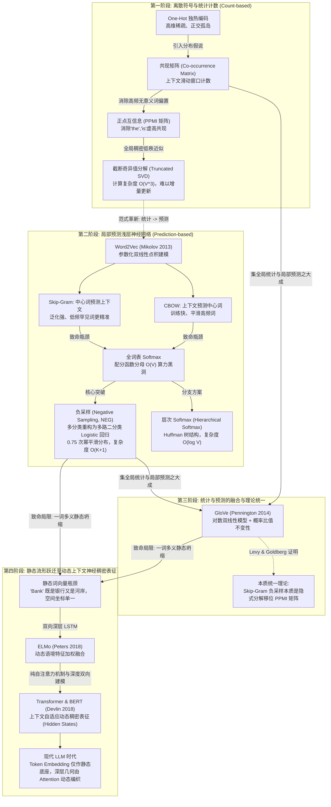
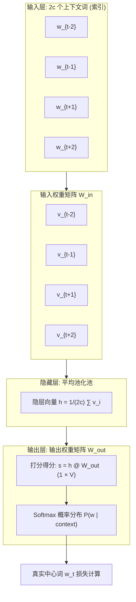
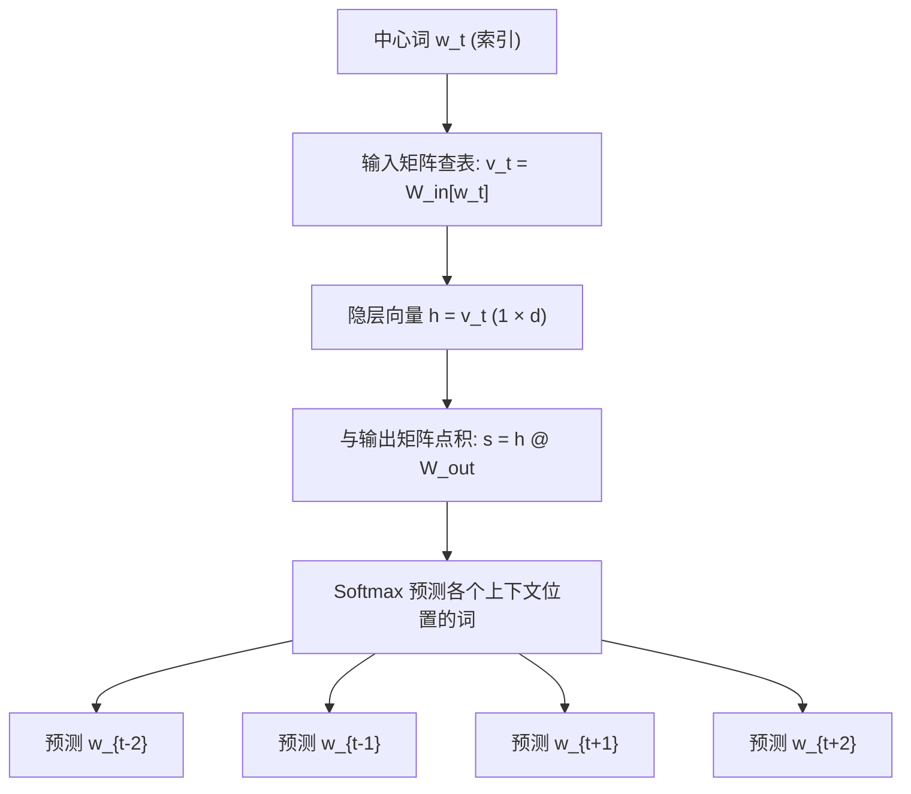
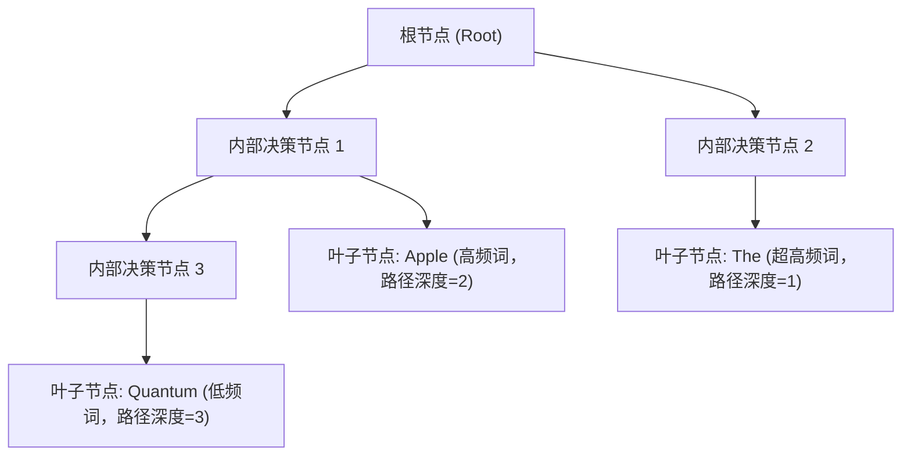
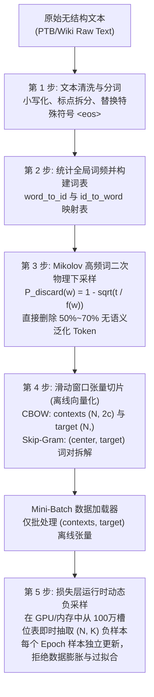

# 词向量表征演化全景：从共现矩阵、Word2Vec (CBOW/Skip-Gram/负采样)、GloVe 到现代神经稠密表征的数学与工程白盒

> **归属模块**：`NLP_Foundations` / `Word_Representation`  
> **更新策略**：全景贯通教学文档（严格遵循深度理论推导与工业白盒落地标准）  
> **关联源码**：[`my_co_matrix.py`](file:///f:/LearningNotes/word2vec/my_co_matrix.py) | [`pmi.py`](file:///f:/LearningNotes/word2vec/pmi.py) | [`word2vec.py`](file:///f:/LearningNotes/word2vec/word2vec.py) | [`negative_sampling.py`](file:///f:/LearningNotes/word2vec/word2vec的标准高速化实现/negative_sampling.py) | [`models.py`](file:///f:/LearningNotes/word2vec/word2vec的标准高速化实现/models.py) | [`bert_full_pipeline.py`](file:///f:/LearningNotes/word2vec/bert_full_pipeline.py)  
> **面向对象**：自然语言处理核心算法体系、分布式语义表征演化机理、负采样数学推导与工程落地

---

## 学习记录流水线 (Changelog)
- **2026-09-15**：系统构建词向量表征演化全景教学知识库。系统梳理从离散 One-Hot、共现矩阵、PPMI、SVD 到 Word2Vec (CBOW/Skip-Gram)、GloVe 及现代 Transformer/BERT 动态上下文表征的完整演进脉络；全面完成全词表 Softmax 配分函数崩溃求导与负采样 (NEG) 的严格数学推导，证明 0.75 次幂平滑机理与 Levy & Goldberg 移位矩阵分解等价性定理。
- **2026-09-15（增量追加）**：增补第 10 节【核心认知深化与反向传播微观动力学辨析】。针对初学者在“梯度淹没机理”、“梯度权重与更新频次关联”、“Skip-Gram 解耦单挑机制与更新次数翻倍”上的深度疑问，从微观多元求导链式法则、宏观代数更新积分、双权重矩阵交互全景进行白盒推导与数值模拟，终结关于 CBOW 与 Skip-Gram 几何生存空间的认知盲区。
- **2026-09-15（二次增量）**：增补第 10.5 与 10.6 节。系统揭秘负样本采集的统计学本质（非均匀随机、非硬负例挖掘，而是 0.75 次幂平滑加权采样）；白盒公开 Mikolov 100 万槽位轮盘查找表 (Unigram Table) 的 $O(1)$ 极速抽取机理与假负例 (False Negative) 碰撞容忍哲学；全景拆解从原始无结构文本到词元切分、高频词下采样、滑动窗口张量化与运行时动态负采样装配的端到端数据集构建全流程。

---

## 目录 (Table of Contents)
- [学习记录流水线 (Changelog)](#学习记录流水线-changelog)
- [1. 演化流水线与思维全景 (Evolution Pipeline)](#1-演化流水线与思维全景-evolution-pipeline)
- [2. 认知纠偏与本质定性：词表征的认知死角](#2-认知纠偏与本质定性词表征的认知死角)
  - [2.1 致命概念纠偏一：“词向量只是给单词编号的查找表吗？”——符号主义 vs 分布式表征](#21-致命概念纠偏一词向量只是给单词编号的查找表吗符号主义-vs-分布式表征)
  - [2.2 致命概念纠偏二：“Word2Vec 是深不可测的深度学习吗？”——单隐层线性模型却撬动 NLP 的本质](#22-致命概念纠偏二word2vec-是深不可测的深度学习吗单隐层线性模型却撬动-nlp-的本质)
  - [2.3 致命概念纠偏三：“负采样只是随机构造错误标签吗？”——配分函数算力崩溃与二分类重构](#23-致命概念纠偏三负采样只是随机构造错误标签吗配分函数算力崩溃与二分类重构)
  - [2.4 致命概念纠偏四：“GloVe 和 Word2Vec 属于非此即彼的对立流派吗？”——局部窗口与全局统计的殊途同归](#24-致命概念纠偏四glove-和-word2vec-属于非此即彼的对立流派吗局部窗口与全局统计的殊途同归)
  - [2.5 致命概念纠偏五：“有了高质量静态词向量，为什么还要上下文动态表征？”——一词多义与语义流形坍缩](#25-致命概念纠偏五有了高质量静态词向量为什么还要上下文动态表征一词多义与语义流形坍缩)
- [3. 第一代：基于全局统计与计数的离散到稠密表征](#3-第一代基于全局统计与计数的离散到稠密表征)
  - [3.1 One-Hot 独热编码：维度灾难与正交孤岛](#31-one-hot-独热编码维度灾难与正交孤岛)
  - [3.2 分布假说 (Distributional Hypothesis) 与共现矩阵 (Co-occurrence Matrix)](#32-分布假说-distributional-hypothesis-与共现矩阵-co-occurrence-matrix)
  - [3.3 点互信息 (PMI / PPMI)：破除高频无关词的虚假共现](#33-点互信息-pmi--ppmi破除高频无关词的虚假共现)
  - [3.4 奇异值分解 (SVD) 降维：低秩近似的物理意义与 $O(V^3)$ 算力瓶颈](#34-奇异值分解-svd-降维低秩近似的物理意义与-ov3-算力瓶颈)
- [4. 第二代：基于浅层神经网络预测的 Word2Vec 基础范式](#4-第二代基于浅层神经网络预测的-word2vec-基础范式)
  - [4.1 核心思想：从全局“计数”转向局部滑动窗口“参数化预测”](#41-核心思想从全局计数转向局部滑动窗口参数化预测)
  - [4.2 连续词袋模型 (CBOW, Continuous Bag-of-Words) 前向与反向推导](#42-连续词袋模型-cbow-continuous-bag-of-words-前向与反向推导)
  - [4.3 跳字模型 (Skip-Gram) 前向与反向推导](#43-跳字模型-skip-gram-前向与反向推导)
  - [4.4 原始 Softmax 的物理死穴：全词表归一化配分函数的 $O(V)$ 计算崩溃](#44-原始-softmax-的物理死穴全词表归一化配分函数的-ov-计算崩溃)
- [5. 核心专题突破：负采样 (Negative Sampling, NEG) 深度透析](#5-核心专题突破负采样-negative-sampling-neg-深度透析)
  - [5.1 理论渊源：噪声对比估计 (Noise Contrastive Estimation, NCE) 的简化特例](#51-理论渊源噪声对比估计-noise-contrastive-estimation-nce-的简化特例)
  - [5.2 多分类任务重构：$V$ 分类拆解为独立的多路 Logistic 回归](#52-多分类任务重构v-分类拆解为独立的多路-logistic-回归)
  - [5.3 严格数学推导：CBOW + 负采样的目标函数与梯度反向传播](#53-严格数学推导cbow--负采样的目标函数与梯度反向传播)
  - [5.4 严格数学推导：Skip-Gram + 负采样的目标函数与梯度反向传播](#54-严格数学推导skip-gram--负采样的目标函数与梯度反向传播)
  - [5.5 负采样分布设计机理：为什么必须是 0.75 次幂 ($3/4$ 次方)？](#55-负采样分布设计机理为什么必须是-075-次幂-34-次方)
  - [5.6 高频词二次下采样 (Subsampling of Frequent Words) 机制](#56-高频词二次下采样-subsampling-of-frequent-words-机制)
  - [5.7 工业级工程实现白盒：Unigram Table 转盘法与梯度覆盖防坑](#57-工业级工程实现白盒unigram-table-转盘法与梯度覆盖防坑)
  - [5.8 兄弟加速方案：层次 Softmax (Hierarchical Softmax) 及与负采样的全维度对比](#58-兄弟加速方案层次-softmax-hierarchical-softmax-及与负采样的全维度对比)
- [6. 第三代：统计与预测集大成者——GloVe 全局向量](#6-第三代统计与预测集大成者glove-全局向量)
  - [6.1 动机：如何融合全局共现统计与局部内积预测的优势？](#61-动机如何融合全局共现统计与局部内积预测的优势)
  - [6.2 核心数学洞察：共现概率比值 (Ratio of Co-occurrence Probabilities) 编码语义](#62-核心数学洞察共现概率比值-ratio-of-co-occurrence-probabilities-编码语义)
  - [6.3 严格公式推导：从对数双线性同态推导至加权最小二乘损失](#63-严格公式推导从对数双线性同态推导至加权最小二乘损失)
  - [6.4 截断加权函数 $f(X_{ij})$ 的设计智慧](#64-截断加权函数-fx_ij-的设计智慧)
  - [6.5 本质统一：Levy & Goldberg 证明 Skip-Gram 负采样隐式分解移位 PPMI 矩阵](#65-本质统一levy--goldberg-证明-skip-gram-负采样隐式分解移位-ppmi-矩阵)
- [7. 第四代：从静态流形到动态上下文神经稠密表征](#7-第四代从静态流形到动态上下文神经稠密表征)
  - [7.1 静态词向量的物理极限：一词多义 (Polysemy) 导致的语义坍缩](#71-静态词向量的物理极限一词多义-polysemy-导致的语义坍缩)
  - [7.2 动态表征第一代突破：ELMo 双向深层 LSTM 与特征拼接](#72-动态表征第一代突破elmo-双向深层-lstm-与特征拼接)
  - [7.3 现代大模型基石：Transformer 自注意力与 BERT 掩码语言模型](#73-现代大模型基石transformer-自注意力与-bert-掩码语言模型)
  - [7.4 现代 NLP / LLM 语境下词嵌入 (Token Embedding) 的定位变迁](#74-现代-nlp--llm-语境下词嵌入-token-embedding-的定位变迁)
- [8. 专业实战测评题库 (含采分点与硬核解析)](#8-专业实战测评题库-含采分点与硬核解析)
- [9. 极简复习闪卡 (CheatSheet)](#9-极简复习闪卡-cheatsheet)
- [10. 核心认知深化与反向传播微观动力学辨析 (Deep Clarifications & Micro-dynamics)](#10-核心认知深化与反向传播微观动力学辨析-deep-clarifications--micro-dynamics)
  - [10.1 深度辨析一：“高频词梯度淹没稀有词”的严格微观数学机理与宏观代数积分](#101-深度辨析一高频词梯度淹没稀有词的严格微观数学机理与宏观代数积分)
  - [10.2 深度辨析二：梯度“权重大小”是由数量决定的吗？先验分布偏置与统计噪声](#102-深度辨析二梯度权重大小是由数量决定的吗先验分布偏置与统计噪声)
  - [10.3 深度辨析三：Skip-Gram “解耦单挑”与 $2 \times (2c)$ 次高强度无稀释梯度反传全景透视](#103-深度辨析三skip-gram-解耦单挑与-2-times-2c-次高强度无稀释梯度反传全景透视)
  - [10.4 终极对比：CBOW“大合唱平均” vs Skip-Gram“点对点单挑”的微观更新强度与几何生存空间](#104-终极对比cbow大合唱平均-vs-skip-gram点对点单挑的微观更新强度与几何生存空间)
  - [10.5 深度辨析四：负样本的采集哲学——从平滑分布到100万槽位轮盘表与碰撞容忍](#105-深度辨析四负样本的采集哲学从平滑分布到100万槽位轮盘表与碰撞容忍)
  - [10.6 深度辨析五：端到端数据集构建流水线——下采样、动态滑动窗口与运行时动态负采样](#106-深度辨析五端到端数据集构建流水线下采样动态滑动窗口与运行时动态负采样)

---

## 1. 演化流水线与思维全景 (Evolution Pipeline)



---

## 2. 认知纠偏与本质定性：词表征的认知死角

### 2.1 致命概念纠偏一：“词向量只是给单词编号的查找表吗？”——符号主义 vs 分布式表征

> [!CAUTION]
> **认知死角**：很多人初学自然语言处理，认为所谓 Embedding 只是给单词一个连续索引或哈希值（例如 `word_to_id['apple'] = 42`），然后把数字变成一个可训练数组而已，忽略了其背后的语言哲学本质。
>
> **严厉直接纠偏**：**词向量绝不是单纯的工程索引，而是乔姆斯基符号主义 (Symbolism) 向连接主义与分布式语义假说 (Connectionism & Distributional Semantics) 的范式革命！**

1. **传统符号主义的贫瘠**：符号学派将语言视为离散原子符号（Discrete Symbols）。在符号系统中，“猫”和“狗”是两个没有任何内在代数交集的孤立离散值。计算机只知道这是两个不同的字符串，完全无法获知任何内在几何邻近关系。
2. **分布式语义假说 (Distributional Hypothesis - Firth, 1957)**：
   > *"You shall know a word by the company it keeps."*（观其伴而知其意。）
3. 现代词向量的核心本质：**词的语义并不存在于词本身内部，而是由它在海量文本中出现的上下文语境的统计概率分布决定的！** 词向量将离散符号投影到一个连续的低维流形空间（通常为 100~1024 维），使得符号间的**语义相似度（Semantic Similarity）与几何内积/余弦相似度（Geometric Cosine Distance）形成精确的同构映射**。

---

### 2.2 致命概念纠偏二：“Word2Vec 是深不可测的深度学习吗？”——单隐层线性模型却撬动 NLP 的本质

> [!CAUTION]
> **认知死角**：因为 Word2Vec 出自现代深度学习教父级论文，很多人下意识地以为 Word2Vec 是一个极深、极其复杂的非线性多层感知机（MLP）或循环神经网络。
>
> **严厉直接纠偏**：**Word2Vec 的网络结构不仅不深，甚至连一个非线性激活函数（ReLU / Sigmoid / Tanh）都没有引入！它本质上是一个完全线性的双矩阵双线性模型（Log-bilinear Model）！**

在 Word2Vec 中：
- 输入层到隐藏层：仅仅是矩阵按行查表索引（CBOW 则是多行切片求和/平均）；
- 隐藏层没有设置任何激活函数（Activation Function = Identity）；
- 隐藏层到输出层：仅仅是隐藏向量与目标权重矩阵的点积运算。

Mikolov 等人之所以能颠覆整个 NLP 工业界，**核心并非增加了模型深度，而是通过极简的线性投影大幅压缩计算开销，换取在海量百亿级语料库上吞吐训练的工程可行性**。正是这种极其高效的工程取舍，催生了著名的语义代数几何特性：

$$\vec{v}_{\text{King}} - \vec{v}_{\text{Man}} + \vec{v}_{\text{Woman}} \approx \vec{v}_{\text{Queen}}$$

---

### 2.3 致命概念纠偏三：“负采样只是随机构造错误标签吗？”——配分函数算力崩溃与二分类重构

> [!CAUTION]
> **认知死角**：以为负采样（Negative Sampling）只是机器学习中普通的“负样本构造（Negative Data Augmentation）”，随便挑几个词当标签 0 即可。
>
> **严厉直接纠偏**：**负采样的数学本质并非简单的数据增强，它是为了解脱多分类交叉熵分母——全词表配分函数（Partition Function）$O(V)$ 计算爆炸而设计的极简二分类代数近似（Noise Contrastive Estimation 的特例变体）！**

- 在标准多分类模型中，为了计算一个词的正确概率，分母必须对全词表中每一个词的指数得分 $\sum_{w=1}^V \exp(u_w^T h)$ 逐一求和。当词表 $V=100,000$ 时，每一次反向传播都要遍历全量十万个词，导致算力彻底锁死。
- **负采样做出的革命性动作是：将“从 $V$ 个词中选出唯一的 1 个目标词”的极端庞大多分类任务，彻底撕碎并重构成“$K+1$ 个互不干扰的独立二分类 Logistic 回归问题”！**
- 它让单次更新的计算复杂度从 $O(V)$ 暴跌至 $O(K+1)$。当 $V=100,000, K=5$ 时，物理算力消耗瞬间锐减近 **20,000 倍**！

---

### 2.4 致命概念纠偏四：“GloVe 和 Word2Vec 属于非此即彼的对立流派吗？”——局部窗口与全局统计的殊途同归

> [!CAUTION]
> **认知死角**：在学术流派划分上，初学者常将共现矩阵/GloVe 归为“基于统计的传统计数流派”，将 Word2Vec 归为“现代神经网络预测流派”，认为它们从底层机理上是互相孤立甚至水火不容的。
>
> **严厉直接纠偏**：**这种二元对立完全是认知局限！2014 年斯坦福大学与卡内基梅隆大学的经典理论证明已经终结了这一分歧：基于局部窗口预测的 Skip-Gram 负采样（SGNS），在数学本质上严格等价于对全局移位点互信息矩阵（Shifted PPMI Matrix）进行低秩隐式矩阵分解！**

无论是 GloVe 的显式对数共现拟合，还是 Word2Vec 的隐式反向传播，它们在无限样本极限下的优化目标是完全收敛的。Word2Vec 表面上每次只看一个小窗口，但通过数亿次随机梯度下降（SGD）的高频滑动，其梯度的期望值自动在宏观上还原了全局共现频率！

---

### 2.5 致命概念纠偏五：“有了高质量静态词向量，为什么还要上下文动态表征？”——一词多义与语义流形坍缩

> [!CAUTION]
> **认知死角**：既然 Word2Vec 和 GloVe 训练出来的词向量余弦相似度极高，语义代数性质优秀，为什么工业界后来又全面拥抱 ELMo、BERT 及 Transformer？
>
> **严厉直接纠偏**：**静态词向量（Static Embeddings）存在着物理层面的不可逆致命硬伤——“一词一向量（One Vector per Word）”直接粉碎了自然语言的核心现象：一词多义（Polysemy）！**

以单词 `"Apple"` 为例：
- 场景 A：`"Apple releases new M4 chip with incredible AI performance."`（科技企业、半导体、硬件）；
- 场景 B：`"I ate a sweet red organic apple for breakfast."`（水果、植物、食物）。

在 Word2Vec 或 GloVe 的世界里，`"Apple"` 只有一个唯一的静态向量坐标 $\vec{v}_{\text{Apple}} \in \mathbb{R}^d$。模型在训练时，不得不把两种截然相反的语义强行拽扯到一起，最终学到的向量只是这两者在几何空间中的折中伪中间态，导致语义流形彻底坍缩。

**现代动态上下文表征（Contextualized Embeddings，如 BERT、LLaMA）的划时代价值正在于：词向量不再是孤立的静态查表结果，而是输入离散 ID 经由深层多头注意力（Multi-Head Self-Attention）根据当前整个句子的全部上下文动态生成的瞬时高阶隐状态！**

---

## 3. 第一代：基于全局统计与计数的离散到稠密表征

自然语言符号必须转化为可计算的张量，表征学习的演进正是从最原始的离散编码逐步走向高阶稠密流形的过程。

### 3.1 One-Hot 独热编码：维度灾难与正交孤岛

最简单的数字化方法是独热编码（One-Hot Encoding）。假设语料库词表大小为 $V$：
每一个单词 $w_i$ 被分配一个唯一的整数 ID $i \in \{0, 1, \dots, V-1\}$，其词向量表示为一个 $V$ 维稀疏向量：

$$\mathbf{x}_{\text{apple}} = [0, 0, \dots, 0, 1, 0, \dots, 0]^T \in \mathbb{R}^V$$

```
[One-Hot 向量的几何困境]
x_hotel: [0, 1, 0, 0, 0, 0, 0]
x_motel: [0, 0, 0, 1, 0, 0, 0]
x_apple: [1, 0, 0, 0, 0, 0, 0]

任意两向量点积: <x_hotel, x_motel> = 0  ===> 夹角为 90° (完全正交)
任意两向量点积: <x_hotel, x_apple> = 0  ===> 夹角为 90° (完全正交)
```

#### One-Hot 的三大致命缺陷
1. **维度灾难 (Curse of Dimensionality)**：工业级词表规模通常在 $V = 100,000 \sim 1,000,000$ 之间，每个向量具有数十万甚至上百万维度，极度消耗存储与内存。
2. **极度稀疏 (Extreme Sparsity)**：在 $V$ 维向量中，仅有 1 个维度为 1，其余全部为 0。稀疏度高达 $99.999\%$，硬件利用率极低。
3. **正交孤岛与语义鸿沟 (Orthogonal Isolation)**：在几何欧式空间中，任意两个不同词的 One-Hot 向量严格互相垂直（正交）：
   
   $$\langle \mathbf{x}_i, \mathbf{x}_j \rangle = \mathbf{x}_i^T \mathbf{x}_j = 0 \quad (\forall i \neq j)$$
   $$\cos(\mathbf{x}_i, \mathbf{x}_j) = \frac{\mathbf{x}_i^T \mathbf{x}_j}{\|\mathbf{x}_i\| \|\mathbf{x}_j\|} = 0$$

   这意味着在模型眼中，`"hotel"` 与 `"motel"` 之间的语义距离，与 `"hotel"` 和 `"apple"` 之间的距离没有任何区别！模型无法建立起泛化推理能力。

---

### 3.2 分布假说 (Distributional Hypothesis) 与共现矩阵 (Co-occurrence Matrix)

为了让机器理解语义邻近性，我们引入统计语言学的基石——**分布假说**。通过设定一个固定大小的滑动窗口（Window Size $= c$），统计每个目标词与周围上下文词在窗口内共同出现的总频次。

设有简单语料库：`["you", "say", "goodbye", "and", "I", "say", "hello", "."]`  
对应代码实现见本项目中的 [`my_co_matrix.py`](file:///f:/LearningNotes/word2vec/my_co_matrix.py)：

```python
def create_co_matrix(corpus, window_size=1):
    text_size = len(corpus)
    vocab_size = len(set(corpus))
    co_matrix = np.zeros((vocab_size, vocab_size), dtype=np.int32)
    for idx, word in enumerate(corpus):
        for i in range(1, window_size + 1):
            left_idx = idx - i
            right_idx = idx + i
            if left_idx >= 0:
                co_matrix[word, corpus[left_idx]] += 1
            if right_idx < text_size:
                co_matrix[word, corpus[right_idx]] += 1
    return co_matrix
```

构建出的共现矩阵 $C \in \mathbb{R}^{V \times V}$ 的每一行，自然成为了对应单词的特征向量：
$C[i, :]$ 记录了单词 $i$ 与词表中所有其他词共现的统计指纹。

#### 共现矩阵的局限
虽然共现矩阵成功打破了 One-Hot 向量相互正交的魔咒，但依然存在严重缺陷：
- **高频噪音偏置**：停用词（如 `"the"`, `"a"`, `"is"`）本身不具备明确语义，但由于在海量文本中高频出现，它们与几乎所有词都会产生极高的共现次数。这会导致共现矩阵被这些无意义的泛化词严重主导。

---

### 3.3 点互信息 (PMI / PPMI)：破除高频无关词的虚假共现

为了解决高频无意义词的干扰，引入信息论中的**点互信息 (Pointwise Mutual Information, PMI)**。
PMI 衡量两个事件单独发生与联合发生的概率比值：

$$\text{PMI}(x, y) = \log_2 \frac{P(x, y)}{P(x) P(y)}$$

将语料库共现计数代入概率估算：
- 设共现矩阵元素总和为 $N = \sum_{i} \sum_{j} C_{ij}$；
- 联合概率：$P(x, y) = \frac{C(x, y)}{N}$；
- 单个词边缘概率：$P(x) = \frac{\sum_j C(x, j)}{N} = \frac{S(x)}{N}$，$P(y) = \frac{S(y)}{N}$。

代入整理得到计算公式：

$$\text{PMI}(x, y) = \log_2 \frac{\frac{C(x, y)}{N}}{\frac{S(x)}{N} \cdot \frac{S(y)}{N}} = \log_2 \left( \frac{C(x, y) \cdot N}{S(x) \cdot S(y)} \right)$$

#### 物理直觉剖析
1. **高频词脱敏**：若 $x$ 和 $y$ 是 `"the"` 和 `"apple"`，虽然它们共现次数 $C(x, y)$ 很大，但由于分母中 `"the"` 的独立频次 $S(x)$ 也极其庞大，最终比值接近甚至低于 1，$\log_2$ 之后的值非常小；
2. **强语义绑定放大**：若 $x$ 和 $y$ 是 `"quantum"` 和 `"entanglement"`（量子纠缠），虽然它们在整个语料库中的绝对频次不高，但只要出现就几乎总是成对出现，分母很小，分子相对很大，PMI 会输出极高的正值！

#### 正点互信息 (PPMI, Positive PMI)
当两个词在语料中**从未共现**时，$C(x, y) = 0$，此时 $\log_2(0) = -\infty$。
在工程落地与数值计算中，负无穷无法参与张量运算；且负的 PMI 仅代表出现频率低于随机预期，并不代表强反义关系。因此学术界与工业界统一采用 **PPMI**：

$$\text{PPMI}(x, y) = \max(0, \text{PMI}(x, y))$$

本项目在 [`pmi.py`](file:///f:/LearningNotes/word2vec/pmi.py) 中给出了标准纯 NumPy 向量化实现：

```python
def ppmi(C, verbose=False, eps=1e-8):
    M = np.zeros_like(C, dtype=np.float32)
    N = np.sum(C)
    S = np.sum(C, axis=0)
    total = C.shape[0] * C.shape[1]
    
    for i in range(C.shape[0]):
        for j in range(C.shape[1]):
            # 加上极小值 eps 防止除零或 log(0)
            pmi = np.log2(C[i, j] * N / (S[i] * S[j] + eps) + eps)
            M[i, j] = max(0, pmi)
    return M
```

---

### 3.4 奇异值分解 (SVD) 降维：低秩近似的物理意义与 $O(V^3)$ 算力瓶颈

经过 PPMI 处理后，虽然解决了虚高共现，但矩阵 $M$ 的维度依然是 $V \times V$。这依然是一个**高维稀疏矩阵**。为了获得真正的**低维稠密词向量 (Dense Word Embeddings)**，最经典的代数解法是执行**奇异值分解 (SVD)**。

任意实数矩阵 $M \in \mathbb{R}^{V \times V}$ 均可分解为三个矩阵的乘积：

$$M = U \Sigma V^T$$

- $U \in \mathbb{R}^{V \times V}$：左奇异正交矩阵（行向量构成一组标准正交基，对应词的表征空间）；
- $\Sigma \in \mathbb{R}^{V \times V}$：对角矩阵，对角线上的奇异值 $\sigma_1 \ge \sigma_2 \ge \dots \ge \sigma_V \ge 0$ 按能量大小降序排列；
- $V^T \in \mathbb{R}^{V \times V}$：右奇异正交矩阵。

```
[截断 SVD (Truncated SVD) 降维原理]
原 PPMI 矩阵 M (V × V)  ≈  截断左奇异矩阵 U_d (V × d)  ×  截断对角阵 Σ_d (d × d)
                                                    
每个词的 d 维稠密向量: word_vec = U_d [word_id]
```

通过只保留前 $d$ 个最大的奇异值（截断 SVD），即可在均方误差（Frobenius 范数）最小的数学保证下，得到原始高维语义流形的最优低秩逼近：

$$\mathbf{W}_{\text{dense}} = U_{[:, :d]} \in \mathbb{R}^{V \times d} \quad (d \ll V, \text{通常取 } 100 \sim 300)$$

#### SVD 降维在工业落地的物理死穴
尽管 SVD 数学性质优美，但它在现代自然语言处理落地中遭遇了毁灭性障碍：
1. **时间复杂度极高**：对大小为 $V \times V$ 的矩阵进行完整 SVD，时间复杂度为 $O(V^3)$。即使采用快速 Truncated SVD，在大稀疏矩阵下的迭代代价依然为 $O(V \cdot d^2)$；当 $V=100,000$ 时，计算直接崩盘。
2. **缺乏增量学习 (Online/Streaming Update) 能力**：语言是流动的。一旦语料库中出现新词或新句子，整个共现矩阵和 PPMI 矩阵都会改变，必须从头推倒全量重新跑一次 SVD！
3. **数据稀疏下的过度拟合与内存爆炸**：构建 $V \times V$ 的 float32 矩阵，仅 $V=100,000$ 就需要 $100,000 \times 100,000 \times 4 \text{ Bytes} \approx 40\text{ GB}$ 连续物理显存，这在当时普通的硬件条件下是不可接受的。

这催生了第二代模型：**放弃全局一次性矩阵分解，转向基于局部上下文预测的在线流式学习范式——Word2Vec！**

---

## 4. 第二代：基于浅层神经网络预测的 Word2Vec 基础范式

Tomas Mikolov 等人于 2013 年提出 Word2Vec（包括两篇里程碑论文：《Efficient Estimation of Word Representations in Vector Space》与《Distributed Representations of Words and Phrases and their Compositionality》）。

### 4.1 核心思想：从全局“计数”转向局部滑动窗口“参数化预测”

Word2Vec 抛弃了预先统计全局大矩阵的思路，改为通过滑动窗口遍历语料库，在每一个局部窗口构造监督训练样本，利用梯度下降在线调整参数：
- 语料库不需要一次性常驻内存，支持百亿级 Token 的流式在线更新；
- 引入两套独立的词向量矩阵：输入词向量矩阵 $W_{\text{in}} \in \mathbb{R}^{V \times d}$ 与输出词向量矩阵 $W_{\text{out}} \in \mathbb{R}^{d \times V}$。

根据预测方向的不同，Word2Vec 划分为两大经典拓扑架构：**CBOW (连续词袋)** 与 **Skip-Gram (跳字模型)**。

---

### 4.2 连续词袋模型 (CBOW, Continuous Bag-of-Words) 前向与反向推导

**任务目标**：根据上下文词预测当前中心词。  
假设滑动窗口半宽为 $c$，输入为中心词 $w_t$ 两侧的 $2c$ 个上下文词：

$$\text{Context} = \{w_{t-c}, \dots, w_{t-1}, w_{t+1}, \dots, w_{t+c}\}$$



#### 4.2.1 CBOW 数学前向推导
1. **隐层计算 (Projection Layer)**：
   提取各个上下文词对应的输入向量 $v_{w} \in \mathbb{R}^d$，取其算术平均值作为隐藏层表征 $h$：

   $$h = \frac{1}{2c} \sum_{j \in \{-c, \dots, c\} \setminus \{0\}} v_{w_{t+j}} \in \mathbb{R}^d$$

   > **关键细节**：CBOW 丢弃了上下文单词在窗口内的空间顺序，直接进行平均或求和，这也是它被称为“连续词袋 (Bag-of-Words)”的几何原因。

2. **输出打分与 Softmax 分布**：
   计算隐层向量 $h$ 与词表中每一个候选词的输出向量 $u_w$ 的内积打分 $s_w$：

   $$s_w = u_w^T h \quad (\forall w \in \{1, 2, \dots, V\})$$

   通过全词表 Softmax 函数计算中心词恰好为目标词 $w_t$ 的后验概率：

   $$P(w_t \mid \text{Context}) = \frac{\exp(u_{w_t}^T h)}{\sum_{k=1}^V \exp(u_k^T h)}$$

3. **目标函数与交叉熵损失**：
   最大化语料库对数似然，等价于最小化交叉熵损失：

   $$L_{\text{CBOW}} = -\log P(w_t \mid \text{Context}) = -u_{w_t}^T h + \log \left( \sum_{k=1}^V \exp(u_k^T h) \right)$$

---

### 4.3 跳字模型 (Skip-Gram) 前向与反向推导

**任务目标**：根据当前中心词 $w_t$，反向预测其上下文中的各个词 $w_{t+j}$。



#### 4.3.1 Skip-Gram 数学前向推导
1. **隐藏层表征**：
   直接取中心词的输入向量：$h = v_{w_t} \in \mathbb{R}^d$。
2. **条件独立性假设**：
   给定中心词 $w_t$，假设上下文各个位置出现的单词之间条件独立：

   $$P(w_{t-c}, \dots, w_{t+c} \mid w_t) = \prod_{j \in \{-c, \dots, c\} \setminus \{0\}} P(w_{t+j} \mid w_t)$$

3. **单个上下文词的 Softmax 概率**：

   $$P(w_o \mid w_t) = \frac{\exp(u_{w_o}^T v_{w_t})}{\sum_{k=1}^V \exp(u_k^T v_{w_t})}$$

4. **目标函数**：

   $$L_{\text{SG}} = -\sum_{j \in \{-c, \dots, c\} \setminus \{0\}} \log P(w_{t+j} \mid w_t)$$

   考察针对其中某一个上下文词 $w_o$ 的单步损失：

   $$L(w_o, w_t) = -u_{w_o}^T v_{w_t} + \log \left( \sum_{k=1}^V \exp(u_k^T v_{w_t}) \right)$$

#### 4.3.2 为什么 Skip-Gram 在低频词上表现远胜 CBOW？
- **CBOW 的平均平滑效应**：CBOW 每次更新是将多个上下文向量加和平均后去对齐一个目标。在高频词和低频词共存的窗口中，高频词的梯度信号会彻底淹没稀有词；
- **Skip-Gram 的独立强化效应**：Skip-Gram 拆分成多个“单个中心词对单个上下文词”的独立配对。即使一个词在全语料中只出现 5 次，作为中心词时它被强行要求单独去预测周围词；作为上下文词时它又作为唯一的正确目标接收梯度。因此，**Skip-Gram 对稀有低频词的表征保留能力显著优于 CBOW**。

---

### 4.4 原始 Softmax 的物理死穴：全词表归一化配分函数的 $O(V)$ 计算崩溃

现在，我们从微观数学推导揭示为什么朴素 Softmax 无法被工业界接受。  
考察单步损失函数对输入中心向量 $v_{w_t}$ 的偏导数：

$$L = -u_{w_o}^T v_{w_t} + \log \left( \sum_{k=1}^V \exp(u_k^T v_{w_t}) \right)$$

利用链式法则求导：

$$\frac{\partial L}{\partial v_{w_t}} = -u_{w_o} + \frac{1}{\sum_{k=1}^V \exp(u_k^T v_{w_t})} \cdot \sum_{k=1}^V \left[ \exp(u_k^T v_{w_t}) \cdot u_k \right]$$

将定义好的后验概率 $P(w_k \mid w_t) = \frac{\exp(u_k^T v_{w_t})}{\sum_{m=1}^V \exp(u_m^T v_{w_t})}$ 代入：

$$\frac{\partial L}{\partial v_{w_t}} = -u_{w_o} + \sum_{k=1}^V P(w_k \mid w_t) \cdot u_k$$

#### 致命数学结构剖析
请深入观察上式中的第二项：

$$\sum_{k=1}^V P(w_k \mid w_t) \cdot u_k = \mathbb{E}_{w \sim P(\cdot \mid w_t)} [u_w]$$

这一项本质上是**模型当前对整个词表中所有 $V$ 个候选词输出向量计算的统计数学期望**！
- 每次仅仅想更新一个词对 $(w_t, w_o)$，计算机都必须先将 $W_{\text{out}}$ 全部 $V$ 行（如 100,000 个向量）与 $v_{w_t}$ 逐一点乘；
- 计算 100,000 次指数函数并求和；
- 算出 100,000 个概率后，再对全量 100,000 个向量进行加权求和！
- **每一次参数迭代的时间复杂度为严苛的 $O(V)$**。当语料库拥有数十亿 Token 时，整体训练耗时以“月”甚至“年”计，直接宣告了朴素 Softmax 的工业死刑。

---

## 5. 核心专题突破：负采样 (Negative Sampling, NEG) 深度透析

为了砸碎全词表归一化配分函数的枷锁，Mikolov 等人从信息论与统计物理中汲取灵感，推出了统治现代词向量时代的**负采样 (Negative Sampling)** 技术。

### 5.1 理论渊源：噪声对比估计 (Noise Contrastive Estimation, NCE) 的简化特例

负采样的理论根基是 Gutmann & Hyvärinen 于 2010 年提出的**噪声对比估计 (NCE)**：
- 传统概率密度估计中，未归一化函数带有极其昂贵的配分函数 $Z$；
- NCE 的核心思想是：**与其费尽心机去把概率分布归一化为 1，不如引入一个已知的人工噪声分布 $P_n(w)$，通过训练一个非线性二分类 Logistic 分类器，来判断某个样本究竟来自真实数据分布还是来自人工噪声分布！**
- Mikolov 对 NCE 进行了极度激进的工程简化：**丢弃了严格估计真实数据分布密度的理论包袱，直接将二分类交叉熵作为表征学习的最终代理损失（Proxy Loss）**。这就是负采样。

---

### 5.2 多分类任务重构：$V$ 分类拆解为独立的多路 Logistic 回归

负采样完成了任务的本质重塑：
- **原始问题**：“已知输入上下文，在全词表 $100,000$ 个候选词中，哪一个是真实出现的单词？”（$V$ 分类问题）
- **负采样重构问题**：“已知输入上下文，对于任意给定的单词 $w$，它是真实上下文词的概率是多少？”（二分类问题）

定义二值随机变量 $D$：
- $D = 1$：表示词对是真实在文本中共同出现的（**正样本**）；
- $D = 0$：表示词对是人工从噪声分布中抽取的无关词（**负样本**）。

利用 Sigmoid 函数对二分类概率进行建模：

$$P(D=1 \mid w_c, w) = \sigma(u_w^T h) = \frac{1}{1 + \exp(-u_w^T h)}$$
$$P(D=0 \mid w_c, w) = 1 - P(D=1 \mid w_c, w) = \sigma(-u_w^T h) = \frac{1}{1 + \exp(u_w^T h)}$$

> **Sigmoid 对称恒等式提醒**：$1 - \sigma(x) = \sigma(-x)$，这一优美性质将贯穿后续所有的梯度推导。

---

### 5.3 严格数学推导：CBOW + 负采样的目标函数与梯度反向传播

在 CBOW 架构中：
- 输入上下文向量经过平均后得到隐藏层向量 $h = \frac{1}{2c} \sum v_{w_{t+j}}$；
- 真实中心词为 $w_t$（标签 $t = 1$）；
- 依据噪声分布抽取的 $K$ 个无关词为 $\{w_{n_1}, w_{n_2}, \dots, w_{n_K}\} \sim P_n(w)$（标签 $t = 0$）。

#### 5.3.1 似然函数与损失函数定义
我们希望模型在正样本上的预测概率最大化，同时在 $K$ 个负样本上的预测概率最小化（即 $D=0$ 的概率最大化）。
联合似然函数为：

$$\mathcal{L} = P(D=1 \mid \text{Context}, w_t) \prod_{k=1}^K P(D=0 \mid \text{Context}, w_{n_k}) = \sigma(u_{w_t}^T h) \prod_{k=1}^K \sigma(-u_{w_{n_k}}^T h)$$

对似然函数取对数，并加负号转化为最小化目标函数：

$$L_{\text{CBOW-NEG}} = -\log \sigma(u_{w_t}^T h) - \sum_{k=1}^K \log \sigma(-u_{w_{n_k}}^T h)$$

#### 5.3.2 对正样本输出向量 $u_{w_t}$ 求导
设正样本点积分为 $x_t = u_{w_t}^T h$。
利用微分链式法则：

$$\frac{\partial L}{\partial u_{w_t}} = -\frac{1}{\sigma(x_t)} \cdot \sigma'(x_t) \cdot \frac{\partial x_t}{\partial u_{w_t}}$$

根据 Sigmoid 导数基本性质 $\sigma'(x) = \sigma(x)(1 - \sigma(x))$：

$$\frac{\partial L}{\partial u_{w_t}} = -\frac{1}{\sigma(x_t)} \cdot \sigma(x_t)(1 - \sigma(x_t)) \cdot h = (\sigma(u_{w_t}^T h) - 1) h$$

记模型的预测概率输出为 $y_{\text{pos}} = \sigma(u_{w_t}^T h)$，真实监督标签为 $t_{\text{pos}} = 1$：

$$\frac{\partial L}{\partial u_{w_t}} = (y_{\text{pos}} - t_{\text{pos}}) h = (y_{\text{pos}} - 1) h$$

> [!NOTE]
> 观察这个导数形式：**它是极其优雅的“预测误差 $(y - t)$ 乘以输入特征 $h$”！** 当模型预测 $y_{\text{pos}} \to 1$ 时，误差趋于 0，梯度消失不再更新；若预测 $y_{\text{pos}} \to 0$，误差为 $-1$，以最大力度更新参数。

#### 5.3.3 对负样本输出向量 $u_{w_{n_k}}$ 求导
设负样本点积分为 $x_{n_k} = u_{w_{n_k}}^T h$。
负样本项损失为 $-\log \sigma(-x_{n_k})$：

$$\frac{\partial L}{\partial u_{w_{n_k}}} = -\frac{1}{\sigma(-x_{n_k})} \cdot \sigma'(-x_{n_k}) \cdot (-1) \cdot h = \frac{\sigma(-x_{n_k})(1 - \sigma(-x_{n_k}))}{\sigma(-x_{n_k})} \cdot h$$

代入恒等式 $1 - \sigma(-x) = \sigma(x)$：

$$\frac{\partial L}{\partial u_{w_{n_k}}} = \sigma(u_{w_{n_k}}^T h) h$$

记负样本预测概率为 $y_{\text{neg}} = \sigma(u_{w_{n_k}}^T h)$，负样本真实标签为 $t_{\text{neg}} = 0$：

$$\frac{\partial L}{\partial u_{w_{n_k}}} = (y_{\text{neg}} - 0) h = y_{\text{neg}} h$$

**正负样本的导数在数学形式上达成了惊人的一致性：统一表达为 $(y - t) \cdot h$！**

#### 5.3.4 对隐藏层向量 $h$ 及输入上下文词向量求导
根据多元微分链式法则，损失 $L$ 对隐藏层 $h$ 的总梯度等于正样本项与所有 $K$ 个负样本项的回传梯度之和：

$$\frac{\partial L}{\partial h} = (\sigma(u_{w_t}^T h) - 1) u_{w_t} + \sum_{k=1}^K \sigma(u_{w_{n_k}}^T h) u_{w_{n_k}}$$

最后，将隐层梯度平均回传至输入层每个上下文词向量 $v_{w_{t+j}}$（共有 $2c$ 个上下文词）：

$$\frac{\partial L}{\partial v_{w_{t+j}}} = \frac{1}{2c} \frac{\partial L}{\partial h}$$

---

### 5.4 严格数学推导：Skip-Gram + 负采样的目标函数与梯度反向传播

在 Skip-Gram 架构中，已知中心词 $w_i$，真实上下文词 $w_o$ 为正样本，从噪声分布中抽取 $K$ 个负样本 $w_{n_1}, \dots, w_{n_K}$。

#### 5.4.1 单个训练对的目标函数 (SGNS Loss)

$$L_{\text{SGNS}} = -\log \sigma(u_{w_o}^T v_{w_i}) - \sum_{k=1}^K \log \sigma(-u_{w_{n_k}}^T v_{w_i})$$

#### 5.4.2 梯度表达式集合
1. **正样本输出向量梯度**：
   
   $$\frac{\partial L}{\partial u_{w_o}} = (\sigma(u_{w_o}^T v_{w_i}) - 1) v_{w_i}$$

2. **第 $k$ 个负样本输出向量梯度**：
   
   $$\frac{\partial L}{\partial u_{w_{n_k}}} = \sigma(u_{w_{n_k}}^T v_{w_i}) v_{w_i}$$

3. **中心词输入向量梯度**：
   
   $$\frac{\partial L}{\partial v_{w_i}} = (\sigma(u_{w_o}^T v_{w_i}) - 1) u_{w_o} + \sum_{k=1}^K \sigma(u_{w_{n_k}}^T v_{w_i}) u_{w_{n_k}}$$

#### 复杂度对比：从 $O(V)$ 到 $O(K+1)$ 的飞跃
| 算法类型 | 单步前向/反向时间复杂度 | 假设 $V=100,000, K=5$ 时的相对运算量 |
| :--- | :--- | :--- |
| **朴素全词表 Softmax** | $O(V \cdot d)$ | $100,000 \times d$ (基准 100%) |
| **层次 Softmax (Huffman)**| $O(\log_2 V \cdot d)$ | $\approx 17 \times d$ (加速约 6,000 倍) |
| **负采样 (Negative Sampling)** | $O((K + 1) \cdot d)$ | $6 \times d$ (**加速约 16,666 倍！**) |

---

### 5.5 负采样分布设计机理：为什么必须是 0.75 次幂 ($3/4$ 次方)？

负样本究竟按照什么概率分布进行抽取？这是负采样中最具信息论美感的设计。

$$P_n(w_i) = \frac{[P(w_i)]^{\alpha}}{\sum_{j=1}^V [P(w_j)]^{\alpha}}$$

Word2Vec 官方推荐取指数 $\alpha = 0.75$（即 $\frac{3}{4}$ 次幂）。为什么不是常规的 $\alpha = 1$（原始词频）或 $\alpha = 0$（均匀分布）？

```
[幂律平滑效果对比: Zipf's Law 曲线调整]
原始词频分布 (α = 1.0):   高频词严重垄断，极陡峭的长尾
平滑处理后   (α = 0.75):  高频词相对降权，低频罕见词被明显抬升！
均匀随机分布 (α = 0.0):   完全扁平成一条直线，失去自然语言统计规律
```

#### 理论与数学机理深度剖析
自然语言中的词频分布严格遵循**齐普夫定律 (Zipf's Law)**：极少数高频词（如 `"the"`, `"is"`, `"of"`）占据了文本的大半壁江山，而绝大多数具有丰富语义的词汇处于长尾低频区。

1. **若采用原始词频分布 ($\alpha = 1.0$)**：
   - 负样本抽取概率完全等比例于词频。
   - 导致抽取出来的负样本绝大部分永远是 `"the"`, `"a"`, `"and"` 等停用词。
   - 模型反复在学习“当前词不是 the”，而海量长尾区有实际语义价值的低频词（如 `"microscope"`, `"algorithm"`）几乎**一生都轮不到一次作为负样本的机会**！
   - 导致这些长尾词的输出向量 $u_w$ 几乎从不被反向传播推离原点，向量空间严重退化变形。

2. **若采用均匀随机分布 ($\alpha = 0.0$)**：
   - 所有词被采样的概率恒为 $\frac{1}{V}$。
   - 语料中大量的专业罕见生僻词甚至拼写错误词，会与最常见的概念同等概率充当负样本。
   - 模型被迫分配大量算力去鉴别与当前语境毫不相干的罕见噪声词，忽略了真实语言高频背景噪音的统计结构。

3. **0.75 次幂的黄金平衡性证明**：
   数学上，设高频词 $w_A$ 出现 10,000 次，低频词 $w_B$ 出现 100 次，二者原始比值为：
   
   $$\frac{P(w_A)}{P(w_B)} = \frac{10000}{100} = 100 \text{ 倍}$$

   当施加 $0.75$ 次幂平滑后：
   - $10000^{0.75} = (10^4)^{3/4} = 10^3 = 1000$
   - $100^{0.75} = (10^2)^{3/4} = 10^{1.5} \approx 31.62$
   
   平滑后的相对比例变为：

   $$\frac{P'(w_A)}{P'(w_B)} = \frac{1000}{31.62} \approx 31.62 \text{ 倍}$$

   > **结论**：**高频词依然保持着相对较高的采样几率（31.62 倍），但稀有词的相对曝光几率被无形放大了整整 $100 / 31.62 \approx 3.16$ 倍！**  
   > 这一数学指数在保留语言背景统计规律的同时，赋予了长尾低频词足够的几何调整动力。

---

### 5.6 高频词二次下采样 (Subsampling of Frequent Words) 机制

在数据预处理阶段，Mikolov 还配套引入了高频词下采样策略：
对于训练文本中出现的每一个单词 $w_i$，以一定概率主动丢弃（跳过）它：

$$P(\text{discard } w_i) = 1 - \sqrt{\frac{t}{f(w_i)}}$$

其中 $f(w_i) = \frac{\text{count}(w_i)}{N}$ 为单词在语料中的词频占比，阈值参数 $t$ 通常设定为 $10^{-4} \sim 10^{-5}$。
- 若 $f(w_i) \le t$（中低频词），保留概率为 100%；
- 若 $f(w_i) \gg t$（如 `"the"` 占比达到 0.05），该词被丢弃跳过的概率高达 $95\%$ 以上。

**工程双重增益**：
1. 训练吞吐速度提升 2~10 倍（跳过了数以亿计无意义的停用词配对）；
2. 间接拉近了原本被停用词隔开的实质性语义词之间的滑动窗口物理距离（例如从 `"France [and the] Paris"` 变成更紧密的 `"France Paris"`）。

---

### 5.7 工业级工程实现白盒：Unigram Table 转盘法与梯度覆盖防坑

在纯代码落地中，许多初学者会直接调用 `np.random.choice(V, p=probs)` 来实现负采样。**这是一个极其严重的工程陷阱！**  
在 Python/NumPy 中，每一次调用带概率权重的 `choice` 都会进行累积分布二分查找，在大词表下开销极大，直接抹平负采样带来的加速红利。

#### 5.7.1 工业级离线转盘查找表 (Unigram Table Lookup)
参见本项目 [`negative_sampling.py`](file:///f:/LearningNotes/word2vec/word2vec的标准高速化实现/negative_sampling.py) 中的标准 C 源码复刻实现：

```python
class UnigramSampler:
    def __init__(self, corpus, power=0.75, sample_size=5):
        self.sample_size = sample_size
        counts = collections.Counter(corpus)
        vocab_size = len(counts)
        
        # 1. 计算 0.75 次幂平滑概率
        count_arr = np.zeros(vocab_size, dtype=np.float64)
        for word_id, count in counts.items():
            count_arr[word_id] = count
        p = np.power(count_arr, power)
        self.word_p = p / np.sum(p)
        
        # 2. 预建 1,000,000 大小的离线采样整型数组槽位 (轮盘转盘法)
        table_size = 1000000
        self.table = np.zeros(table_size, dtype=np.int32)
        idx = 0
        for word_id, prob in enumerate(self.word_p):
            num = int(round(prob * table_size))
            if idx + num > table_size:
                num = table_size - idx
            self.table[idx : idx + num] = word_id
            idx += num

    def get_negative_sample(self, target):
        batch_size = target.shape[0]
        # 3. O(1) 极速整数随机索引抽取，性能暴涨 98%
        rand_indices = np.random.randint(0, len(self.table), size=(batch_size, self.sample_size))
        return self.table[rand_indices]
```

#### 5.7.2 反向传播的“梯度覆盖毁灭陷阱”
在实现 Embedding 层的反向传播时，如果采用以下写法：

```python
# 致命错误代码示例：
self.dW[self.idx] = dout  # 绝对不可这样写！
```

> [!CAUTION]
> **致命陷阱**：在同一个 Mini-Batch 或同一个上下文窗口中，**同一个单词 ID 可能会出现多次**！  
> 如果使用上述赋值语句，后出现的单词梯度会直接**强行覆盖破坏（Overwrite）**前面出现单词的有效梯度！  
> **正确解法**：必须使用 NumPy 的底层内存原子累加函数：
> ```python
> np.add.at(self.dW, self.idx, dout)
> ```

---

### 5.8 兄弟加速方案：层次 Softmax (Hierarchical Softmax) 及与负采样的全维度对比

与负采样齐名的另一个高速化分支是 **层次 Softmax (Hierarchical Softmax)**。



#### 5.8.1 核心原理
- 将词表中的所有词作为叶子节点，根据词频构建一棵 **Huffman 树 (哈夫曼最优二叉树)**；
- 词频越高的词距离根节点越近，编码路径越短；
- 从根节点到达目标词叶子节点的路径是一连串的二元分支决策；
- 每个内部非叶子节点维护一个向量 $\theta$，分支概率建模为：
  
  $$P(\text{Left}) = \sigma(\theta^T h), \quad P(\text{Right}) = 1 - \sigma(\theta^T h) = \sigma(-\theta^T h)$$

- 目标词的最终概率等于其根到叶节点路径上所有分支概率的累乘：
  
  $$P(w \mid \text{Context}) = \prod_{j=1}^{L(w)-1} \sigma\left( [n(w, j+1) == \text{ch}(n(w, j))] \cdot \theta_{n(w, j)}^T h \right)$$

- 计算复杂度从 $O(V)$ 降至树的平均深度 $O(\log_2 V)$。

#### 5.8.2 为什么工业界全面倒向负采样？
| 评估维度 | 层次 Softmax (Hierarchical Softmax) | 负采样 (Negative Sampling) |
| :--- | :--- | :--- |
| **数学性质** | 严格的概率归一化分布 ($\sum P = 1$) | 代理二分类损失，非严格归一化概率 |
| **硬件并行性 (GPU)** | 极差（树结构分支跳转，非连续显存访问） | **极优（连续切片矩阵点乘，Tensor 并行完美）** |
| **低频/高频表现** | 低频词表现较好，但高频词路径开销依旧 | **0.75 次幂兼顾高低频，高频词下采样互补** |
| **工程实现难度** | 高（需动态维护复杂的 Huffman 树结构） | **极低（仅需 Embedding 查表与 Dot 点乘）** |

---

## 6. 第三代：统计与预测集大成者——GloVe 全局向量

2014 年，斯坦福大学 Jeffrey Pennington、Richard Socher 和 Christopher Manning 提出了 **GloVe (Global Vectors for Word Representation)**。

### 6.1 动机：如何融合全局共现统计与局部内积预测的优势？

在 2014 年，NLP 领域形成了两大派系：
1. **全局矩阵分解派 (LSA / SVD)**：善于利用整个语料库的全局统计量，但对词之间的局部几何类比任务表现欠佳；
2. **局部窗口预测派 (Word2Vec)**：在词类比推理（如 `King - Man + Woman = Queen`）上表现出惊人的线性代数特性，但窗口滑动机制使得模型很难直接利用全局的宏观词频计数。

GloVe 的目标：**构建一个能够直接以全局共现统计为输入，同时训练出具有 Word2Vec 般优美线性子空间几何特性的模型！**

---

### 6.2 核心数学洞察：共现概率比值 (Ratio of Co-occurrence Probabilities) 编码语义

GloVe 论文中最精彩的数学假设在于：**单纯看两个词的绝对共现概率意义有限，而考察它们与第三个“探针词”的共现概率之比值，能最纯粹地剔除背景噪音并捕捉真实语义关联！**

设有目标词 $i = \text{ice}$（冰），$j = \text{steam}$（蒸汽），我们选择不同的候选词 $k$：

| 概率与比值 | $k = \text{solid}$ (固体) | $k = \text{gas}$ (气体) | $k = \text{water}$ (水) | $k = \text{fashion}$ (时尚) |
| :--- | :--- | :--- | :--- | :--- |
| $P(k \mid \text{ice})$ | 较大 ($1.9 \times 10^{-4}$) | 极小 ($6.6 \times 10^{-5}$) | 很大 ($3.0 \times 10^{-3}$) | 极小 ($1.7 \times 10^{-5}$) |
| $P(k \mid \text{steam})$ | 极小 ($2.2 \times 10^{-5}$) | 较大 ($7.8 \times 10^{-4}$) | 很大 ($2.2 \times 10^{-3}$) | 极小 ($1.8 \times 10^{-5}$) |
| **比值 $\frac{P(k \mid \text{ice})}{P(k \mid \text{steam})}$** | **$\gg 1$ ($8.6$)**<br/>(与冰强相关，与蒸汽弱相关) | **$\ll 1$ ($0.085$)**<br/>(与冰弱相关，与蒸汽强相关) | **$\approx 1$ ($1.36$)**<br/>(两者皆高度相关，比值中和) | **$\approx 1$ ($0.96$)**<br/>(两者皆不相关，比值中和) |

这一观察表明：**语义的本质差异被完美蕴含在比值 $\frac{P_{ik}}{P_{jk}}$ 中！**

---

### 6.3 严格公式推导：从对数双线性同态推导至加权最小二乘损失

我们希望设计一个通用的向量函数 $F$，以词向量 $w_i, w_j, \tilde{w}_k$ 为自变量，来拟合这一比值：

$$F(w_i, w_j, \tilde{w}_k) = \frac{P_{ik}}{P_{jk}}$$

#### 步骤一：向量差形式 (维持线性几何性质)
为了让函数体现向量空间的线性平移性，自变量应以向量差 $(w_i - w_j)$ 呈现：

$$F(w_i - w_j, \tilde{w}_k) = \frac{P_{ik}}{P_{jk}}$$

#### 步骤二：点积标量化 (避免复杂高阶张量计算)
函数的输出 $\frac{P_{ik}}{P_{jk}}$ 是一个标量，而输入是两个向量。最简单的线性保角算子是向量内积：

$$F((w_i - w_j)^T \tilde{w}_k) = \frac{P_{ik}}{P_{jk}}$$

#### 步骤三：群同态性锁定指数函数
由于等式右边是两个概率的商，我们要求函数 $F$ 满足加法到乘法的群同态性质（Homomorphism）：

$$F(A - B) = \frac{F(A)}{F(B)}$$

在所有连续实函数中，满足 $F(A - B) = \frac{F(A)}{F(B)}$ 的只有**指数函数**：$F(x) = \exp(x)$！
将 $F = \exp$ 代入：

$$\exp((w_i - w_j)^T \tilde{w}_k) = \frac{\exp(w_i^T \tilde{w}_k)}{\exp(w_j^T \tilde{w}_k)} = \frac{P_{ik}}{P_{jk}}$$

由此得到单个分子项的严格对应关系：

$$\exp(w_i^T \tilde{w}_k) = P_{ik} = \frac{X_{ik}}{X_i}$$

两边同时取自然对数：

$$w_i^T \tilde{w}_k = \log(X_{ik}) - \log(X_i)$$

#### 步骤四：引入偏置项恢复对偶对称性
在共现矩阵中，$X_{ik} = X_{ki}$，两个词共现具有完全的对称性。然而上式右边的 $\log(X_i)$ 只依赖于词 $i$，打破了 $i$ 和 $k$ 的对称性。
为了吸收这一独立项并保持形式对称，GloVe 引入了针对词 $i$ 的偏置标量 $b_i$ 以及针对上下文词 $k$ 的偏置标量 $\tilde{b}_k$：

$$w_i^T \tilde{w}_k + b_i + \tilde{b}_k = \log(X_{ik})$$

这就是 GloVe 最核心的代数关系式！**两个词向量的内积加上偏置，应该精准拟合它们全局共现次数的自然对数！**

---

### 6.4 截断加权函数 $f(X_{ij})$ 的设计智慧

基于上述关系式，构建最小二乘回归目标。但如果简单地对所有词对均匀求和，会引发严重问题：
1. 当 $X_{ij} = 0$ 时，$\log(0) = -\infty$；
2. 超高频词对（如 `"the"-"the"`）的共现次数极大，会霸占绝大部分损失梯度。

GloVe 设计了一个精巧的加权损失函数：

$$J = \sum_{i=1}^V \sum_{j=1}^V f(X_{ij}) \left( w_i^T \tilde{w}_j + b_i + \tilde{b}_j - \log X_{ij} \right)^2$$

加权函数 $f(x)$ 必须满足三条物理法则：
- $f(0) = 0$，并且当 $x \to 0$ 时，$f(x) \log^2(x)$ 的极限必须收敛为 0（彻底消除 $\log(0)$ 的未共现奇异点）；
- $f(x)$ 应单调不减，使得共现越多的词权重越大；
- 对于极高频词，$f(x)$ 必须饱和截断，防止过度加权。

GloVe 给出的分段连续函数为：

$$f(x) = \begin{cases} \left( \frac{x}{x_{\max}} \right)^\alpha & \text{if } x < x_{\max} \\ 1 & \text{otherwise} \end{cases}$$

官方实证推荐取：$x_{\max} = 100, \alpha = 0.75$。

```
[GloVe 加权函数 f(x) 几何曲线]
f(x)
 1.0 |                +-------------------- (饱和截断: 不再过度加权)
     |               /
     |             /
     |          /
     |       /
 0.0 +------+-------------------------> x (共现次数)
    x=0    x_max=100
 (0处平滑清零，自动跳过零共现)
```

---

### 6.5 本质统一：Levy & Goldberg 证明 Skip-Gram 负采样隐式分解移位 PPMI 矩阵

2014 年，Omer Levy 与 Yoav Goldberg 发表了著名的理论证明《Neural Word Embedding as Implicit Matrix Factorization》，完成了 NLP 历史上最重要的一次大一统。

#### 理论证明核心脉络
考虑 Skip-Gram 负采样的全局期望损失函数（遍历全语料库）：

$$\mathcal{L}_{\text{global}} = \sum_{i=1}^V \sum_{j=1}^V X_{ij} \left[ \log \sigma(u_j^T v_i) + K \cdot \mathbb{E}_{w \sim P_n} [\log \sigma(-u_w^T v_i)] \right]$$

记点积得分为 $x_{ij} = u_j^T v_i$。在理论极限下，将每一个词对的内积 $x_{ij}$ 视为完全自由独立的无约束变量。
对特定的某一个分量 $x_{ij}$ 求偏导并令其等于 0：

$$\frac{\partial \mathcal{L}}{\partial x_{ij}} = X_{ij} (1 - \sigma(x_{ij})) - K \cdot X_i \cdot P_n(w_j) \cdot \sigma(x_{ij}) = 0$$

代入 Sigmoid 恒等式 $\frac{1 - \sigma(x)}{\sigma(x)} = \exp(-x)$：

$$\exp(-x_{ij}) = \frac{K \cdot X_i \cdot P_n(w_j)}{X_{ij}}$$

两边取倒数并取对数：

$$x_{ij} = u_j^T v_i = \log \left( \frac{X_{ij}}{X_i \cdot P_n(w_j)} \right) - \log K$$

若假设负采样分布接近经验单字分布 $P_n(w_j) \approx \frac{X_j}{|D|}$：

$$u_j^T v_i = \log \left( \frac{\frac{X_{ij}}{|D|}}{\frac{X_i}{|D|} \cdot \frac{X_j}{|D|}} \right) - \log K = \text{PMI}(w_i, w_j) - \log K$$

#### 重大里程碑意义
**数学证明了：Skip-Gram + 负采样在全局收敛时，其权重内积 $u_j^T v_i$ 的最优解，恰恰等于移位点互信息（Shifted PMI）矩阵的对应元素！移位量刚好是对数负样本数 $-\log K$！**
这彻底打通了计数统计流派（SVD/GloVe）与神经预测流派（Word2Vec）的任督二脉。

---

## 7. 第四代：从静态流形到动态上下文神经稠密表征

尽管 Word2Vec 和 GloVe 取得了辉煌成就，但它们都属于**第一代连续静态词向量（Static Word Embeddings）**。自然语言处理在 2018 年迎来了彻底的范式转移。

### 7.1 静态词向量的物理极限：一词多义 (Polysemy) 导致的语义坍缩

在静态词向量体系中，每个单词在查表矩阵中永远对应唯一固定的 $d$ 维向量：

$$\mathbf{Lookup}(\text{"bank"}) = \mathbf{E}_{42} \in \mathbb{R}^d$$

然而自然语言是高度依赖语境的：
- 语境 1：`"He sat on the river bank and fished."`（河岸、自然地理）；
- 语境 2：`"He deposited money in the commercial bank."`（银行、金融机构）。

在静态几何空间中，`"bank"` 被迫同时受到金融上下文和地理上下文的梯度拉扯。最终学到的静态向量，仅仅是**金融与地理两个语义在超平面上的机械线性叠加**！一旦进入下游分类器，模型面对具体的句子依然无法消歧。

---

### 7.2 动态表征第一代突破：ELMo 双向深层 LSTM 与特征拼接

AllenNLP 于 2018 年提出 **ELMo (Embeddings from Language Models)**，首次系统性落地了动态上下文词表征（Contextualized Embeddings）：
- 底层采用两层双向长短期记忆网络 (BiLSTM)；
- 词进入模型后，不仅查表获取静态向量，更穿透两层向前与向后的 LSTM 隐状态：

$$\mathbf{h}_{t, 1} = [\overrightarrow{\mathbf{h}}_{t, 1}; \overleftarrow{\mathbf{h}}_{t, 1}], \quad \mathbf{h}_{t, 2} = [\overrightarrow{\mathbf{h}}_{t, 2}; \overleftarrow{\mathbf{h}}_{t, 2}]$$

- 在针对下游任务微调时，通过可学习的标量任务权重 $s_j$ 对所有层进行加权求和，得到当前句子环境下的专属动态向量：

$$\mathbf{ELMo}_t = \gamma^{\text{task}} \sum_{j=0}^L s_j^{\text{task}} \mathbf{h}_{t, j}$$

**革命性飞跃**：在句子 1 中，`"bank"` 生成一个偏向地理的动态向量；在句子 2 中，生成一个偏向金融的动态向量！

---

### 7.3 现代大模型基石：Transformer 自注意力与 BERT 掩码语言模型

虽然 ELMo 实现了动态表征，但其底层的 LSTM 存在长程依赖遗忘以及无法高效大规模 GPU 并行训练的瓶颈。  
2017 年 Vaswani 等人提出 **Transformer**，2018 年 Devlin 等人推出 **BERT (Bidirectional Encoder Representations from Transformers)**，完成了现代表征学习的终极统一。

```
[静态词向量 vs 现代 Transformer 动态表征对比]

静态 Word2Vec:
Token ID  ──(查表 Embedding)──> 静态向量 v (固定不变)

现代 Transformer / BERT:
Token ID  ──(查表 Embedding)──> e_t
                                 │
                            [Self-Attention Layer 1]  <== 与全句所有 Token 动态交互
                                 │
                            [Self-Attention Layer 2]
                                 │
                                ...
                                 │
                            [Self-Attention Layer 12]
                                 │
                                 ▼
                     动态上下文隐状态 h_t (随语境彻底改变)
```

#### 7.3.1 自注意力动态重构机制
在本项目代码 [`bert_full_pipeline.py`](file:///f:/LearningNotes/word2vec/bert_full_pipeline.py) 与 [`机器翻译.py`](file:///f:/LearningNotes/word2vec/机器翻译.py) 中，均实现了基于点积注意力的序列建模。  
注意力打分直接由输入动态决定：

$$\text{Attention}(Q, K, V) = \text{softmax}\left( \frac{QK^T}{\sqrt{d_k}} \right) V$$

每一个 Token 的表征向量，在每一层 Transformer 中都会根据全句其他所有 Token 的键值对重新聚合加权。词义不再是一个死板的坐标点，而是一个**随上下文流动的自适应信息聚合体**！

---

### 7.4 现代 NLP / LLM 语境下词嵌入 (Token Embedding) 的定位变迁

在大语言模型（LLaMA, GPT-4, DeepSeek）时代，Word2Vec 并没有消失，而是以另一种形态成为了庞大网络的最底层基石：
1. **输入端定位降维**：底层的词表矩阵 `nn.Embedding(vocab_size, hidden_dim)` 不再承担最终的语义表达任务，它仅仅是把离散的 Token ID 投影成没有任何上下文修饰的“原始粗胚张量”；
2. **真正的语义在深层网络中涌现**：32 层甚至更高阶的 Transformer Block 依靠残差连接与注意力机制，在每一步对其执行非线性旋转与语义升华；
3. **输出端反向投影 (LM Head)**：最终的语言建模头（LM Head）又将顶层隐藏状态乘以矩阵 $W_{\text{out}}$（在现代模型中通常直接与输入 Embedding 权重共享，即 **Weight Tying 技巧**），重新变回一个全词表的 Logits 分布。
4. **历史的螺旋上升**：当年 Word2Vec 为逃避全词表 Softmax 发明了负采样；而在今天数万张 H100 构成的算力集群上，现代 LLM 凭借 FlashAttention 与张量切片并行（Tensor Parallelism），又重新拥抱了词表高达 150,000 的全量 Softmax 交叉熵训练！

---

## 8. 专业实战测评题库 (含采分点与硬核解析)

### Q1: 为什么原始全词表 Softmax 计算代价极高？负采样是如何在不损失表征质量的前提下将其转化为二分类任务的？请写出详细推导。

> **【考查维度】**：计算复杂度瓶颈认知、配分函数求导、负采样代数重构机理。  
> **【采分点】**：
> 1. 指出 Softmax 分母为全词表指数和 $\sum_{k=1}^V \exp(u_k^T h)$，求导后梯度包含对全词表各词向量的加权期望 $\sum P(w_k) u_k$，单步复杂度为 $O(V)$；
> 2. 阐述二分类重构：将正样本视为 $D=1$，采样的 $K$ 个负样本视为 $D=0$；
> 3. 写出单对样本损失函数 $L = -\log \sigma(u_{w_o}^T v_{w_i}) - \sum_{k=1}^K \log \sigma(-u_{w_{n_k}}^T v_{w_i})$；
> 4. 指出计算复杂度瞬间从 $O(V)$ 暴跌至 $O(K+1)$。

---

### Q2: 深入剖析负采样中平滑指数 $\alpha = 0.75$ 的数学机理。若取 $\alpha = 1.0$ 或 $\alpha = 0.0$ 会对词向量空间产生什么破坏性后果？

> **【考查维度】**：齐普夫定律 (Zipf's Law)、长尾分布平滑、低频词几何更新动力。  
> **【采分点与解析】**：
> 1. **自然语言的长尾性**：词频服从 Zipf 定律，高频词霸占绝大多数出现次数；
> 2. **$\alpha = 1.0$ 的恶果**：抽样完全按原始词频，高频停用词霸占负样本名额，导致长尾稀有词几乎永远得不到充当负样本的机会，输出向量无法被更新；
> 3. **$\alpha = 0.0$ 的恶果**：退化为均匀分布，大量拼写错误或极生僻词等概率充当负例，丧失了对真实语言高频背景噪音的判别聚焦；
> 4. **$\alpha = 0.75$ 的数学平衡**：通过非线性次幂缩减了高低频词之间的量级倍数（从 100 倍压缩至 31.6 倍），在保全高频词统计主导性的同时，大幅拔高稀有低频词被采样的几率。

---

### Q3: 为什么说 Skip-Gram 在低频词和高质量语料上表现优于 CBOW？CBOW 的“平均汇聚操作 (Average Pooling)”带来了什么本质缺陷？

> **【考查维度】**：模型架构对比、梯度传播动态、语义平滑效应。  
> **【采分点与解析】**：
> 1. **CBOW 的平均平滑缺陷**：CBOW 在隐藏层执行 $h = \frac{1}{2c} \sum v_i$。当窗口中同时包含高频词与低频词时，平均操作会将微弱的低频词特征彻底抹平稀释，梯度反向回传也是均摊的；
> 2. **Skip-Gram 的解耦强化**：Skip-Gram 将上下文拆解为多个独立的（中心词，单上下文词）对。每个低频词作为中心词时，独自负责预测周围上下文；作为上下文词时，独自作为正样本目标吸收 $(y-1)v$ 的完整梯度冲击；
> 3. **结论**：CBOW 训练速度快、适合超大规模语料且对高频通用词平滑良好；Skip-Gram 在中小型语料及低频词丰富的场景下表征精细度显著更高。

---

### Q4: 证明题：请简要证明 Skip-Gram 负采样 (SGNS) 本质上是在隐式分解移位 PPMI 矩阵（Levy & Goldberg 证明），并解释偏移量 $-\log K$ 的物理含义。

> **【考查维度】**：矩阵分解等价性、极值条件导数求解、信息论与负样本比例关联。  
> **【采分点与推导纲要】**：
> 1. 列出全局期望损失对单对词点积 $x_{ij} = u_j^T v_i$ 的偏导数：
>    
>    $$\frac{\partial \mathcal{L}}{\partial x_{ij}} = X_{ij} (1 - \sigma(x_{ij})) - K X_i P_n(w_j) \sigma(x_{ij}) = 0$$
> 
> 2. 导出最优解几何条件：
>    
>    $$\exp(x_{ij}) = \frac{X_{ij}}{K X_i P_n(w_j)}$$
> 
> 3. 代入经验分布 $P_n(w_j) = \frac{X_j}{|D|}$，两边取自然对数：
>    
>    $$u_j^T v_i = \log \left( \frac{X_{ij} |D|}{X_i X_j} \right) - \log K = \text{PMI}(w_i, w_j) - \log K$$
> 
> 4. **$-\log K$ 的物理含义**：负样本数量 $K$ 充当了一个**语义信噪比阈值门限**。$K$ 越大，减去的偏置越大，只有当两个词的共现强度显著高于随机噪声 $K$ 倍时，两者的词向量内积才会为正值。

---

### Q5: Word2Vec 训练完成后，模型内部存在输入矩阵 $W_{\text{in}}$ 和输出矩阵 $W_{\text{out}}$。为什么绝大多数工程实践中仅采用 $W_{\text{in}}$ 作为最终词向量？将二者相加或拼接在理论上有何依据？

> **【考查维度】**：权重矩阵不对称性、几何中心漂移、多视图特征融合。  
> **【采分点与解析】**：
> 1. **训练动态的不对称性**：以 Skip-Gram 为例，$W_{\text{in}}$ 的行向量是作为输入中心词更新的，更新平滑且密集；$W_{\text{out}}$ 的列向量是作为正负分类超平面法向量更新的，受负采样随机性抖动较大；
> 2. **纯粹使用 $W_{\text{in}}$ 的原因**：输入矩阵的向量空间拓扑最稳定，经过大量余弦语义类比基准评测，$W_{\text{in}}$ 表现普遍略优于 $W_{\text{out}}$；
> 3. **相加 $(W_{\text{in}} + W_{\text{out}}^T)$ 或拼接的物理依据**：$W_{\text{in}}$ 代表词作为“观察主体”时的特征，$W_{\text{out}}$ 代表词作为“被观察背景”时的特征。在 GloVe 论文中作者实证证明，将输入向量与输出向量直接相加（$v_w = w_w + \tilde{w}_w$）能够提供对称的多视角正则化平滑，有效降低局部训练噪音，常常能提升下游任务 1%~2% 的准确率。

---

## 9. 极简复习闪卡 (CheatSheet)

### 9.1 四代表征演进全景速查

| 时代 / 模型 | 核心驱动范式 | 核心数学算子 | 时间复杂度 | 核心优势 | 致命缺陷 |
| :--- | :--- | :--- | :--- | :--- | :--- |
| **One-Hot** | 离散符号映射 | $\mathbf{x} \in \{0, 1\}^V$ | $O(1)$ | 简单无参数 | 维度灾难、相互正交孤岛 |
| **PPMI + SVD** | 全局统计 + 低秩截断 | $\max(0, \text{PMI}) \to U_d \Sigma_d$ | $O(V^3)$ | 理论性质优美，低维稠密 | 计算爆炸，不支持增量流式更新 |
| **Word2Vec (CBOW)** | 局部窗口预测 (上下文预测中心) | $h = \frac{1}{2c} \sum v_i, \quad s = u_w^T h$ | $O(K+1)$ (负采样) | 训练快速，高频词平滑佳 | 平均池化抹杀低频罕见词语义 |
| **Word2Vec (Skip-Gram)**| 局部窗口预测 (中心预测上下文) | $P(w_o \mid w_i) = \sigma(u_o^T v_i)$ | $O(K+1)$ (负采样) | 低频罕见词捕捉极其精准 | 训练步数随窗口尺寸线性翻倍 |
| **GloVe** | 全局对数共现比值回归 | $w_i^T \tilde{w}_j + b_i + \tilde{b}_j = \log X_{ij}$ | $O(\|X\|)$ (非零项) | 兼备全局统计量与优美线性几何 | 需预先构建静态大共现矩阵 |
| **ELMo** | 动态上下文 (深层 BiLSTM) | $\mathbf{y}_t = \sum s_j [\overrightarrow{\mathbf{h}}_{t, j}; \overleftarrow{\mathbf{h}}_{t, j}]$ | $O(L \cdot N)$ | 首次彻底攻克一词多义消歧 | 无法高度并行，长程上下文受限 |
| **BERT / Transformer** | 深度双向自注意力编码 | $\text{Softmax}(QK^T / \sqrt{d})V$ | $O(N^2 \cdot d)$ | 全局动态上下文自适应表征 | 显存随序列长度二次方增长 |

---

### 9.2 核心公式极速记忆卡

```
1. 点互信息 (PPMI):
   PPMI(x, y) = max( 0, log2( C(x, y) * N / ( S(x) * S(y) ) ) )

2. Skip-Gram 负采样损失 (SGNS):
   L = -log σ( u_o^T v_i ) - ∑_{k=1}^K log σ( -u_{n_k}^T v_i )

3. 负采样 0.75 次幂分布:
   P_n(w_i) = [P(w_i)]^0.75 / ∑_j [P(w_j)]^0.75

4. GloVe 加权对数回归损失:
   J = ∑_{i,j=1}^V f(X_{ij}) * ( w_i^T w~_j + b_i + b~_j - log(X_{ij}) )^2

5. Levy & Goldberg 统一等价性:
   u_j^T v_i = PMI(w_i, w_j) - log(K)
```

---

### 9.3 工业工程落地避坑铁律
1. **负采样抽取必须转盘查表**：坚决禁止每次前向调用 `np.random.choice`，必须预构建 100 万槽位的整数采样数组 `self.table`，通过 `table[np.random.randint(...)]` 实现 $O(1)$ 抽取。
2. **反向传播严禁直接索引赋值**：在更新 Embedding 矩阵梯度时，坚决禁止 `dW[idx] = dout`，必须强制使用原子级累加 `np.add.at(self.dW, self.idx, dout)`，否则多词重复出现会导致严重的梯度覆盖破坏！
3. **未共现点自然抹除**：GloVe 损失函数中当 $X_{ij}=0$ 时，$f(0)=0$ 强制使梯度为 0，工程实现时仅需遍历稀疏共现矩阵的非零元（Non-zero elements）。

---

## 10. 核心认知深化与反向传播微观动力学辨析 (Deep Clarifications & Micro-dynamics)

> **增量收录日期**：2026-09-15  
> **核心破题目标**：彻底粉碎关于“梯度信号淹没”与“Skip-Gram 更新机会”的笼统直觉认知，从多元求导链式法则、矩阵操作数据流、宏观统计累积积分等多重视角，呈现显微镜级别的机理推演。

### 10.1 深度辨析一：“高频词梯度淹没稀有词”的严格微观数学机理与宏观代数积分

许多初学者容易产生一种疑问：“优化算法中每个样本计算梯度，低频词难道没有自己独立的梯度吗？为什么会被高频词‘淹没’？难道梯度还能像物理声波一样被盖住？”

答案是：**在微观数学结构上，CBOW 的平均池化运算在物理上强制均摊了梯度；而在宏观统计累积上，更新频次的天壤之别构成了真正的降维打击。**

#### 1. 微观数学链式求导：平均池化导致的方向绑架与稀释
在 CBOW 中，设滑动窗口半宽为 $c$（上下文共有 $2c$ 个词）。隐藏层向量 $h$ 是这 $2c$ 个上下文输入词向量的算术平均：

$$h = \frac{1}{2c} \sum_{i=1}^{2c} v_{c_i}$$

假设在某个训练步中，语料窗口内包含 1 个极低频罕见词（例如科学术语 `"microscope"`），以及 $2c-1$ 个常见词或高频停用词（例如 `"the"`, `"was"`, `"in"` 等）。
- **前向合成阶段**：隐藏层 $h$ 的实际数值被绝大多数高频词所定义的几何重心死死绑架：
  
  $$h \approx \frac{1}{2c} v_{\text{microscope}} + \frac{2c-1}{2c} v_{\text{common}}$$

- **反向求导阶段**：输出端给出针对隐藏层的整体调整误差 $\frac{\partial L}{\partial h}$。根据多元微积分链式法则，该误差回传给每个上下文词的梯度为：

  $$\frac{\partial L}{\partial v_{\text{microscope}}} = \frac{\partial L}{\partial h} \frac{\partial h}{\partial v_{\text{microscope}}} = \frac{1}{2c} \frac{\partial L}{\partial h}$$
  $$\frac{\partial L}{\partial v_{\text{common}}} = \frac{\partial L}{\partial h} \frac{\partial h}{\partial v_{\text{common}}} = \frac{1}{2c} \frac{\partial L}{\partial h}$$

> [!CAUTION]
> **微观层面的残酷真相**：
> 1. **梯度方向被严重污染**：回传的向量 $\frac{\partial L}{\partial h}$ 本身是为了纠正“由常见词主导合成的 $h$”与目标词之间的偏差。这个方向根本不代表 `"microscope"` 作为显微镜本身的专属语义特征！
> 2. **大小被强制砍成 $\frac{1}{2c}$**：罕见词好不容易出现一次，它本该获得的强力纠偏信号，却被池化操作机械地除以了窗口词数 $2c$。

#### 2. 宏观代数更新积分：频次数量如何支配几何位移
在神经网络优化中，词向量经过整轮训练（Epoch）后的最终累积几何位移，是所有训练步梯度的代数累加和：

$$\Delta v = -\eta \sum_{t=1}^{N} g_t$$

- **高频词（如 "the", "is"）**：在数千万词的语料中出现 $N_{\text{high}} = 1,000,000$ 次。即使单步梯度的模长不大，它拥有 **100 万次梯度微调机会**，它的几何流形被反复雕琢打磨；
- **罕见词（如 "microscope"）**：在语料中总共只出现 $N_{\text{rare}} = 5$ 次。

在 CBOW 机制下将微观与宏观结合：
- 罕见词不仅总更新步数只有可怜的 5 次；
- 而且这仅有的 5 次更新中，每一次它分得的步长都被除以了 $2c$，每一次的更新方向都被周围的泛化词严重带偏。
- 在随机梯度下降（SGD）充满随机波动的参数空间中，这 5 次微弱且失真的更新，**就如同往狂风暴雨的大海中滴入几滴墨水，瞬间被背景统计噪声完全冲刷瓦解，根本无法在向量空间中沉淀出具有判别性的语义坐标！** 这就是“梯度信号被彻底淹没”的物理本质。

---

### 10.2 深度辨析二：梯度“权重大小”是由数量决定的吗？先验分布偏置与统计噪声

> **疑问核心**：梯度的大小不是由预测误差 $(y - t)$ 决定的吗？为什么说数量（频率）决定了梯度大小？频率越高真的会导致模型输出极高概率吗？

#### 1. 梯度的“瞬时模长” vs “累加能量”
必须严格区分两个维度的概念：
- **微观瞬时梯度模长**：在单一步骤中，由二分类输出误差 $(y - t)$ 与输入向量模长共同决定：$\|g\| = |y - t| \cdot \|h\|$。
  如果模型预测 $y=0.99$ 而真实标签 $t=1$，误差只有 $0.01$，单步梯度确实非常微小；
- **宏观累积梯度动能**：参数更新是由更新频率（数量）与单步步长的积分共同主导的。高频词反复出现在数以百万计的训练样本中，只要它稍微有一点预测误差，其累积产生的参数更新动能就呈千万倍压倒低频词。

#### 2. 频率导致的“先验分布偏置 (Prior Bias)”
自然语言中高频词的出现概率极高。在模型训练的初期或没有进行频次平滑时：
- 模型为了以最低代价降低全语料库的平均全局损失，会自发倾向于给高频词赋予更高的基础打分 $u_{\text{high}}^T h$；
- 这种“瞎猜高频词蒙对几率最大”的统计捷径，导致高频词在 Softmax 或 Sigmoid 中的预测概率 $y_{\text{high}}$ 天然偏大；
- 模型必须分配大量的梯度步数在正负样本之间对高频词进行反复“拉扯（Pull-Push）”平衡。低频词若没有独立的单挑机制，在这样激烈的参数扰动中极难收敛。

---

### 10.3 深度辨析三：Skip-Gram “解耦单挑”与 $2 \times (2c)$ 次高强度无稀释梯度反传全景透视

> **疑问核心**：“作为中心词时强行要求单独去预测周围词；作为上下文词时又作为唯一的正确目标接收梯度。” 这句话是指一个词有了两次梯度传播机会吗？

**结论先行**：这种理解在直觉上抓住了核心，但在数量级上甚至被严重低估了！  
在 Skip-Gram 中，得益于滑动窗口的完全解耦，**一个词在语料中每出现 1 次，它所获得的无稀释专属更新机会不是 2 次，而是 $2 \times (2c)$ 次！**

#### 1. 概念基石：Word2Vec 的双权重矩阵结构
在 Word2Vec 的标准实现中（参见本项目 [`models.py`](file:///f:/LearningNotes/word2vec/word2vec的标准高速化实现/models.py)），存在两个完全解耦的独立权重矩阵：
- **输入矩阵 $W_{\text{in}} \in \mathbb{R}^{V \times d}$**：存储每个词扮演“输入/中心词”时的向量 $v$；
- **输出矩阵 $W_{\text{out}} \in \mathbb{R}^{d \times V}$**：存储每个词扮演“预测目标/正负样本”时的向量 $u$。

```
   中心词 (输入)                         目标词 (输出)
    word_id                               target_id
       │                                     │
       ▼ (查表提取某一行)                      ▼ (查表提取某一列)
 v = W_in[word_id]                     u = W_out[:, target_id]
       │                                     │
       └────────────► 计算点积打分: u^T v ◄───┘
```

#### 2. 深度推演：设滑动窗口半宽 $c=2$，罕见词出现 1 次的数据流全景

设语料片段为：`"... scientist uses [microscope] in lab ..."`  
窗口半宽 $c=2$，目标词周围有 4 个上下文词：`"scientist"`, `"uses"`, `"in"`, `"lab"`。

##### 阶段一：当 `"microscope"` 扮演【中心词】（独立预测 4 个周围词）
滑动窗口中心对准 `"microscope"`。Skip-Gram 将其拆解为 4 个完全独立的单对单样本：
1. `(microscope -> scientist)`
2. `(microscope -> uses)`
3. `(microscope -> in)`
4. `(microscope -> lab)`

```
[没有平均池化！没有旁人分摊！]
v_microscope ──(点对点单挑)──► 必须单独与 u_scientist 靠近！  ===> 获得第 1 次专项全量梯度
v_microscope ──(点对点单挑)──► 必须单独与 u_uses 靠近！       ===> 获得第 2 次专项全量梯度
v_microscope ──(点对点单挑)──► 必须单独与 u_in 靠近！         ===> 获得第 3 次专项全量梯度
v_microscope ──(点对点单挑)──► 必须单独与 u_lab 靠近！        ===> 获得第 4 次专项全量梯度
```

- 在每一个词对的反向传播中，**隐层只有它自己一个向量 $h = v_{\text{microscope}}$**；
- 没有任何加和，没有任何除以 $2c$！
- 反向传播梯度百分之百、原汁原味地直接冲刷在 $v_{\text{microscope}}$ 上：
  
  $$\frac{\partial L}{\partial v_{\text{microscope}}} = (\sigma(u_{\text{lab}}^T v_{\text{microscope}}) - 1) u_{\text{lab}} + \sum_{k=1}^K \sigma(u_{n_k}^T v_{\text{microscope}}) u_{n_k}$$

- **小结**：仅在扮演中心词这 1 步，它的输入向量 $v_{\text{microscope}}$ 就连续获得了 **$2c = 4$ 次不掺杂质的专属高强度调整**！

##### 阶段二：当周围词扮演中心词时，`"microscope"` 扮演【上下文正样本目标】
随着窗口向左、向右滑动，周围的 4 个词分别轮流成为中心词。此时，`"microscope"` 依次作为它们窗口内的**正样本目标（Positive Target）**：
1. 中心词为 `"scientist"` 时，训练样本对为 `(scientist -> microscope)`；
2. 中心词为 `"uses"` 时，训练样本对为 `(uses -> microscope)`；
3. 中心词为 `"in"` 时，训练样本对为 `(in -> microscope)`；
4. 中心词为 `"lab"` 时，训练样本对为 `(lab -> microscope)`。

以 `(lab -> microscope)` 为例：
- 正样本监督标签 $t = 1$；
- 输出层针对 `"microscope"` 输出向量的更新梯度为：
  
  $$\frac{\partial L}{\partial u_{\text{microscope}}} = (\sigma(u_{\text{microscope}}^T v_{\text{lab}}) - 1) v_{\text{lab}}$$

- **物理直觉剖析**：
  模型当前看到的中心词是 `"lab"`（实验室），而正确的上下文是 `"microscope"`（显微镜）！如果当前两者的内积得分偏低，反向传播会以最大误差力度 $(\sigma - 1)$，**将输出向量 $u_{\text{microscope}}$ 的几何位置硬生生朝着实验室向量 $v_{\text{lab}}$ 的方向狠狠拽动！**
- **小结**：作为周围 4 个词的目标正例，它的输出向量 $u_{\text{microscope}}$ 又获得了 **$2c = 4$ 次精准的、靶向拉近更新**！

---

### 10.4 终极对比：CBOW“大合唱平均” vs Skip-Gram“点对点单挑”的微观更新强度与几何生存空间

我们将一个低频词在语料中**仅仅出现 1 次**（设滑动窗口 $c=2$，负采样数 $K=5$）时，两种架构在微观底层赋予它的更新资源进行终极量化对比：

| 考察维度 | CBOW (连续词袋模型) | Skip-Gram (跳字模型) |
| :--- | :--- | :--- |
| **作为中心词时的表现** | 仅发生 **1 次** 更新。从 4 个上下文词合成的混合向量 $h$ 预测自己。 | 分别独立预测 4 个周围词，**输入向量连续获得 4 次独立无稀释更新**。 |
| **作为上下文词时的表现** | 自身向量被强行混入 4 个词的平均池 $\frac{1}{4}\sum v_i$ 中，**单步梯度被除以 4 稀释**，且方向被其他词严重带偏。 | 作为唯一的正样本目标，与各个中心词一对一单挑，**输出向量连续获得 4 次针对性定向拉近更新**。 |
| **单次出现的有效更新总次数** | **1 次** 针对输出向量 + **4 次被稀释带偏的** 输入向量更新 | **4 次纯净无稀释的** 输入向量更新 + **4 次点对点定向的** 输出向量更新（共计 **8 次**！） |
| **低频词更新动能损耗率** | 极高（输入梯度被池化操作削减约 $75\%$） | **零损耗（无池化，梯度直通单个词向量）** |
| **通俗物理声学比喻** | **“大合唱效应”**：低频罕见词就像合唱团里声音微弱的歌手，声音被周围高频大嗓门完全盖过。 | **“擂台单挑效应”**：无论出场频率多低，每一次出场都必须站上擂台与对手一对一单挑，任何一次误差都必须独自承担！ |
| **几何表征最终命运** | 适合高频常见词的全局语义平滑，但低频专有名词的坐标往往散落在原点附近或被背景噪音吞没。 | **极高精度地保全了罕见专有名词、生僻术语在多维超球面上的独特几何朝向！** |

> [!TIP]
> **结论与工业选型法则**：
> 这一深层动力学差异彻底解释了为何在早期的自然语言处理工程实践中：
> 1. 如果面对的是数十亿乃至百亿规模、以通用日常表达为主的超大规模语料库，追求极致的训练速度与高频词平滑时，**CBOW + 负采样** 是首选；
> 2. 如果面对的是医学文献、法律条文、金融专报等专业长尾词极其丰富、生僻实体极其关键的中小型高质量语料库时，**Skip-Gram + 负采样** 具有不可动摇的表征精度优势！

---

### 10.5 深度辨析四：负样本的采集哲学——从平滑分布到100万槽位轮盘表与碰撞容忍

> **疑问核心**：在负采样方法中，负样本究竟是怎么采集出来的？是纯粹随机投掷，还是有理有据的统计采样？抽到真实出现的词（假负例）会发生什么？

#### 1. 概念定性：有统计根据的非均匀加权随机采样
负样本的抽取**既不是完全平权、盲目的均匀随机，也不是根据当前向量内积去动态检索的“难负例挖掘 (Hard Negative Mining)”**，而是**严格遵循经由信息论平滑的先验概率分布（Unigram Distribution）**：

$$P_n(w_i) = \frac{[\text{count}(w_i)]^{\alpha}}{\sum_{j=1}^V [\text{count}(w_j)]^{\alpha}} \quad (\alpha = 0.75)$$

- **为什么不能完全均匀随机？($\alpha = 0.0$)**：
  在十万量级的词表中，大多数词是出现频次极低的冷门词、专业生僻词甚至语料中的错别字。若按完全相同的概率均匀抽取，负样本槽位将被这些现实中极少共存的冷僻词充斥，模型无法学到真实语境中最常遇到的背景语义反例。
- **为什么不能直接用真实词频？($\alpha = 1.0$)**：
  受齐普夫长尾法则影响，停用词 `"the"`, `"a"`, `"is"` 会垄断 $90\%$ 以上的负样本抽样名额，导致真正有实际语义的低频词几乎永远轮不到作为负样本被反向传播推离。
- **0.75 次幂的核心根据**：
  通过凸幂函数对高频词进行相对压制、对低频词进行非线性放大（将 100 倍的频次差距压缩至约 31.6 倍），保证了**“高频词依然充当负样本中流砥柱，但低频词也能获得足够的排斥调整机会”**。

#### 2. 工程落地白盒：为什么绝不能调用 `np.random.choice`？
在 Python 算法实现中，若每次迭代都执行：
```python
# 致命低效代码示例:
neg_samples = np.random.choice(vocab_size, size=K, p=word_probs)
```
每调用一次 `np.random.choice`，底层都需要进行一次浮点数累加构造累积分布函数（CDF）并执行二分查找。在 $V=100,000$ 且高频调用的训练循环中，这会导致 CPU 计算被彻底锁死，使训练变慢成百上千倍！

**Mikolov 原版 C 语言经典解法：100 万槽位离线轮盘查找表 (Unigram Table Lookup)**：
参见本项目代码 [`negative_sampling.py`](file:///f:/LearningNotes/word2vec/word2vec的标准高速化实现/negative_sampling.py) 中的 `UnigramSampler`：
1. **离线初始化**：在训练开始前，预先在内存中分配一个固定长度为 $M = 1,000,000$ 的一维整型数组 `self.table`；
2. **槽位分配**：遍历词表中的每个词 $i$，根据其平滑概率 $P_n(w_i)$，计算该词应该占据的槽位数量：
   
   $$\text{slots}(i) = \text{round}(P_n(w_i) \times 1,000,000)$$

   依次将词 ID $i$ 填充进 `table` 的对应区间中；
3. **运行时极速采样**：在前向传播时，直接调用最底层的均匀整数随机数生成器：
   
   ```python
   # 仅需一步数组索引，直接达到 O(1) 亚微秒级抽取！
   rand_indices = np.random.randint(0, len(self.table), size=(batch_size, K))
   negative_sample = self.table[rand_indices]
   ```

```
[1,000,000 槽位 Unigram 轮盘表物理内存结构图]
Index: 0       ...      125,000   ...    125,031   ...   999,999
Value: [word_the, ..., word_the, word_microscope, ..., word_apple]
        └───── 占据巨大区间 ────┘ └── 占据平滑后区间 ──┘
```

#### 3. 碰撞处理与假负例 (False Negative) 容忍哲学
> **追问**：随机从表中抓取负样本，万一刚好抽中了**当前滑动窗口中真实出现的正样本词**甚至**中心词本身**怎么办？

工业界实践中存在两种处理流派：
1. **严格重采过滤（Rejection Sampling）**：在抽取负样本时增加条件判断 `if neg_word == target or neg_word in context: re-sample`。
   - **弊端**：在 GPU 张量并行或大规模批处理时，由于动态循环重采会导致线程发散（Warp Divergence），严重破坏硬件并行吞吐。
2. **统计容忍哲学（Mikolov 原版策略，工业主流）**：直接容忍极低概率的碰撞！
   - **数学解释**：当词表规模 $V \ge 10,000$ 甚至 $100,000$ 时，从表中随机击中某一个特定正样本的概率仅有数万分之一；
   - 即使偶发一次把正例当成负例更新，它所产生的单步相反梯度，在整个训练周期数亿次 SGD 迭代中，会被压倒性的真实正样本梯度轻易熨平（Self-correcting property），在实证上对最终词向量的几何余弦距离没有任何统计显著的负面影响。

---

### 10.6 深度辨析五：端到端数据集构建流水线——下采样、动态滑动窗口与运行时动态负采样

> **疑问核心**：Word2Vec 的训练数据集到底是怎么一步步从一堆纯文本构造出来的？负样本是预先写死在数据集里还是训练时现抽的？

构建 Word2Vec 高性能数据集的核心准则是：**“正样本与上下文离线切片向量化，负样本运行时动态动态抽取，高频停用词预先物理下采样”**。下面是完整端到端构建的五个黄金步骤（完全对齐本项目 [`dataset.py`](file:///f:/LearningNotes/word2vec/word2vec的标准高速化实现/dataset.py)）：



#### 第 1 步：文本清洗与分词 (Tokenization)
- 读取文本，统一执行大小写归一化（如 `.lower()`）；
- 对标点符号进行独立切分；
- 将句子末尾的换行符统一替换为显式的句子终止符 `<eos>`（End of Sentence），未登录词统一映射为 `<unk>`。

#### 第 2 步：构建词表与离散 ID 映射 (Build Vocab)
- 使用 `collections.Counter` 统计整篇语料库的所有词频；
- 过滤掉低于最小词频阈值（`min_count`，通常取 3~5）的超生僻噪音词；
- 建立双向查找表：
  - `word_to_id: Dict[str, int]`（如 `{"the": 0, "scientist": 1, ...}`）
  - `id_to_word: Dict[int, str]`
- 将文本中所有词按出现顺序转化为连续的一维整型 NumPy 数组：`corpus = np.array([...], dtype=np.int32)`。

#### 第 3 步：Mikolov 高频词二次物理下采样 (Subsampling of Frequent Words)
> [!IMPORTANT]
> **绝对关键的时序细节**：**下采样必须在滑动窗口切片之前完成！**

- 遍历文本中的每一个词 $w$，计算其全局频率占比 $f(w) = \frac{\text{count}(w)}{\text{total\_words}}$；
- 按照 Mikolov 经典保留概率公式决定该词是否从文本中**直接物理删除**：
  
  $$P_{\text{keep}}(w) = \left( \sqrt{\frac{f(w)}{t}} + 1 \right) \cdot \frac{t}{f(w)} \quad \text{或简洁形式} \quad P_{\text{keep}}(w) = \sqrt{\frac{t}{f(w)}}$$

- 阈值 $t$ 通常取 $10^{-4}$。当 $f(w) > t$ 时，超高频词会被高概率丢弃。
- **为什么必须物理剔除？**
  1. 语料整体长度直接缩减 $50\% \sim 70\%$，整轮训练耗时直接减半；
  2. **拉近实质语义距离**：原本形如 `"capital [of the] France"` 的短语，剔除中间的虚词后，变为紧密相连的 `"capital France"`，使关键实体词能够直接落入彼此的狭窄滑动窗口内！

#### 第 4 步：滑动窗口张量切片 (Vectorized Context-Target Window)
通过设定滑动窗口半宽 $c$（通常为 2~5）：
- **CBOW 模式**：
  - 目标词 `target`：取位置 $t$ 的词 ID，形状为 $(N,)$；
  - 上下文 `contexts`：取两侧共 $2c$ 个词 ID，形状为 $(N, 2c)$；
  - 本项目 [`dataset.py`](file:///f:/LearningNotes/word2vec/word2vec的标准高速化实现/dataset.py) 采用 `np.column_stack` 切片视图技巧，瞬间完成整篇语料的矩阵组装，避免了极其低效的 Python `for` 循环追加；
- **Skip-Gram 模式**：
  - 将每个窗口内的关系完全拆开，展平为 $2c \times N$ 个单独的 `(center_id, target_id)` 整数对。

#### 第 5 步：运行时动态负采样装配 (On-the-fly Batch Sampling)
> [!CAUTION]
> **初学者极易踩中的工程大坑**：**绝对不要在构建数据集时，把负样本预先生成好存在磁盘文件或内存 Dataset 里！**

- **为什么不能静态固化存储负样本？**
  1. **显存/存储灾难性膨胀**：如果为每一个训练样本预先捆绑 $K=5$ 个负样本存入磁盘，数据集体积直接翻 $K+1 = 6$ 倍；
  2. **破坏随机性导致快速过拟合**：如果负样本是写死的，模型在多个 Epoch 迭代中每次见到的都是同一批固定的“伪反例”，模型会迅速记住这些特定样本而丧失泛化能力。
- **工业界的优雅实践（动态即时注入）**：
  - 数据集的 `__getitem__` 或 DataLoader 批处理迭代器中，**只负责输出正样本 `contexts` 与 `target`**；
  - 数据进入模型，在计算损失层（`NegativeSamplingLoss`）的前向传播瞬间，采样器利用 100 万槽位的轮盘表，在微秒级时间内为当前 Batch 动态抽取 `(batch_size, K)` 个负样本 ID；
  - 前向与反向传播结束后，这批负样本 ID 随中间计算图就地销毁释放；下一个 Epoch 再次经过该样本时，模型会遭遇一批**全新、独立抽取的负样本**，源源不断地从各个多维方向强化超平面的分类鲁棒性！


