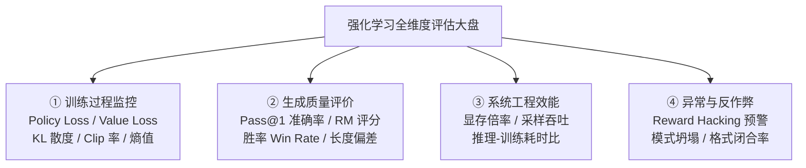
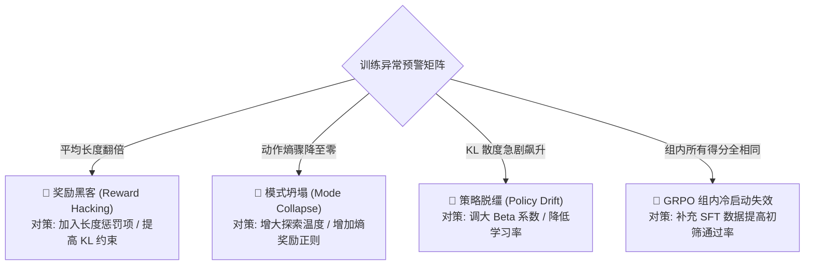

# 大模型强化学习与对齐全维度评估指标体系与实战手册

> 本文档针对 LLM 强化学习（PPO、DPO、GRPO 等）从**训练动态监控**、**生成结果对齐质量**、**系统资源效能**到**反作弊安全防御**四大维度，建立起全套工业级、可落地的评估指标矩阵。

---

## 📖 目录 (Table of Contents)

1. [一、为什么强化学习的评估比监督微调 (SFT) 复杂得多？](#一为什么强化学习的评估比监督微调-sft-复杂得多)
2. [二、训练过程动态监控指标 (Training Dynamics Metrics)](#二训练过程动态监控指标-training-dynamics-metrics)
   - [1. 策略损失 (Policy Loss) 与价值损失 (Value Loss)](#1-策略损失-policy-loss-与价值损失-value-loss)
   - [2. 概率比率 (Policy Ratio) 与截断触发率 (Clip Fraction)](#2-概率比率-policy-ratio-与截断触发率-clip-fraction)
   - [3. KL 散度与策略漂移量 (KL Divergence)](#3-kl-散度与策略漂移量-kl-divergence)
   - [4. 策略动作熵 (Policy Entropy) 与模式坍塌](#4-策略动作熵-policy-entropy-与模式坍塌)
   - [5. 优势分布统计量 (Advantage Mean & Std)](#5-优势分布统计量-advantage-mean--std)
   - [6. DPO 专属：隐式奖励分差 (Implicit Reward Margin)](#6-dpo-专属隐式奖励分差-implicit-reward-margin)
3. [三、生成结果与对齐质量指标 (Output Alignment & Quality Metrics)](#三生成结果与对齐质量指标-output-alignment--quality-metrics)
   - [1. 客观理科任务：规则准确率 (Pass@1 / Pass@k)](#1-客观理科任务规则准确率-pass1--passk)
   - [2. 主观文科任务：奖励模型均分 (Reward Model Score)](#2-主观文科任务奖励模型均分-reward-model-score)
   - [3. 对抗胜率 (Head-to-Head Win Rate) 与 Elo 天梯分](#3-对抗胜率-head-to-head-win-rate-与-elo-天梯分)
   - [4. 长度偏差 (Length Bias) 与长度归一化惩罚](#4-长度偏差-length-bias-与长度归一化惩罚)
   - [5. 结构化格式依从率 (Format Compliance Rate)](#5-结构化格式依从率-format-compliance-rate)
   - [6. 语言退化检测：困惑度 (Perplexity / PPL)](#6-语言退化检测困惑度-perplexity--ppl)
4. [四、系统资源与工程效能指标 (Systems & Efficiency Metrics)](#四系统资源与工程效能指标-systems--efficiency-metrics)
   - [1. 峰值显存倍率 (Peak VRAM Footprint)](#1-峰值显存倍率-peak-vram-footprint)
   - [2. 采样-训练耗时比 (Sample-to-Train Time Ratio)](#2-采样-训练耗时比-sample-to-train-time-ratio)
   - [3. 推理吞吐 (Tokens per Second Throughput)](#3-推理吞吐-tokens-per-second-throughput)
5. [五、异常模式与自动化告警机制 (Failure Modes & Red Flags)](#五异常模式与自动化告警机制-failure-modes--red-flags)
   - [1. 奖励黑客 (Reward Hacking) 的识别与根治](#1-奖励黑客-reward-hacking-的识别与根治)
   - [2. 策略崩溃 (Policy Collapse) 救砖防线](#2-策略崩溃-policy-collapse-救砖防线)
   - [3. GRPO 组内标准差归零 (Zero Discrimination)](#3-grpo-组内标准差归零-zero-discrimination)
6. [六、业界主流评测基准与自动化评测流水线](#六业界主流评测基准与自动化评测流水线)
7. [七、指标速查与健康判定红绿灯表](#七指标速查与健康判定红绿灯表)

---

## 一、为什么强化学习的评估比监督微调 (SFT) 复杂得多？

在 SFT 阶段，评估通常只需要看验证集上的 **Cross-Entropy Loss** 或 **Perplexity (PPL)**，只要 Loss 平稳下降，模型就在老老实实模仿人类高质量语料。

但在强化学习（RLHF / DPO / GRPO）阶段，情况发生剧变：
1. **没有唯一的“标准答案”**：针对“请写一封委婉的发货道歉信”，存在成千上万种优秀表达，传统的词级别 BLEU / ROUGE 重合度彻底失效；
2. **奖励模型 (RM) 本身存在漏洞**：模型具有极强投机性，一旦发现某个讨巧模式（例如无休止地堆砌客套话、生成超长段落、或盲目给出肯定性词汇），模型会将其概率拉满以骗取高分，这就是臭名昭著的 **Reward Hacking（奖励黑客）**；
3. **策略可能无声无息地崩溃**：训练 Loss 可能持续下降，表面上 Reward 越来越高，但模型实际生成的内容可能已经变成胡言乱语、答非所问，或者语言能力严重退化。

因此，**评估强化学习必须构建“全链路多维雷达”**，绝不能单凭某个单一标量得分下定论。

---

## 二、训练过程动态监控指标 (Training Dynamics Metrics)

### 1. 策略损失 (Policy Loss) 与价值损失 (Value Loss)

#### 策略损失 (Policy Loss)
- **物理含义**：衡量策略模型（Actor）参数更新的步长与方向。
- **正常走势**：在 PPO / GRPO 中，由于优化目标是最大化加权优势，代码中 Loss 通常取负号。**Policy Loss 通常在 0 附近小幅震荡或平缓下降**，不要期望它像 SFT 那样单调陡峭下降。
- **异常预警**：
  - 若 Policy Loss 出现指数级跳变（如从 0.1 突然变成 100+），通常是发生了梯度爆炸或未做截断；
  - 若始终死在 0，说明所有样本的 Advantage 为 0 或梯度被全部截断。

#### 价值损失 (Value Loss，PPO 专属)
- **公式**：$\mathcal{L}_{\text{value}} = \frac{1}{2} \mathbb{E} \left[ (V_\phi(s_t) - \hat{R}_t)^2 \right]$
- **物理含义**：Critic 价值网络对未来收益预估的均方误差（MSE）。
- **健康标准**：应随训练逐步降低。如果 Value Loss 居高不下甚至暴增，说明 **Critic 已经“看不懂球赛”**，它给出的基线全是错的，此时计算出的 Advantage 会严重误导 Actor，必须调大 Critic 学习率或预训练 Critic。

---

### 2. 概率比率 (Policy Ratio) 与截断触发率 (Clip Fraction)

$$r_t(\theta) = \frac{\pi_\theta(a_t | s_t)}{\pi_{\text{old}}(a_t | s_t)}$$

- **Clip Fraction（截断触发率）**：整批采样 Token 中，发生 $r_t > 1+\epsilon$ 或 $r_t < 1-\epsilon$ 的比例：
$$\text{ClipFrac} = \frac{1}{N} \sum_{i=1}^N \mathbb{I}\Big(|r_t - 1| > \epsilon\Big)$$

- **评估标准（黄金区间）**：
  - **健康区间：$5\% \sim 25\%$**。这表明策略正在稳健探索，既有部分动作被修正，又没有激进失控；
  - **危险区间（$> 35\%$）**：更新步长过激，大量梯度被削平归零，可能导致训练震荡甚至崩溃；
  - **低效区间（$< 2\%$）**：学习率太小或 Advantage 信号太微弱，策略几乎原地不动。

---

### 3. KL 散度与策略漂移量 (KL Divergence)

$$\mathbb{D}_{\text{KL}}(\pi_\theta \| \pi_{\text{ref}}) = \mathbb{E}_{x \sim \pi_\theta} \left[ \log \frac{\pi_\theta(x)}{\pi_{\text{ref}}(x)} \right]$$

- **物理含义**：衡量当前正在训练的策略与原始 SFT 参考模型之间的信息几何距离——**“离刚出厂的自己跑偏了多远”**。
- **作用**：作为惩罚项防止模型为了取悦 Reward Model 丢失人类语言自然属性。
- **健康标准**：
  - **健康均值**：$\mathbb{D}_{\text{KL}} \in [0.01, 0.20]$；
  - **严重告警（$> 0.50$）**：策略出现严重语义漂移（Drift），模型可能开始输出结构混乱的乱码或病态文本；
  - **过强束缚（$< 0.005$）**：KL 正则系数 $\beta$ 设得过大，模型如同被固定在基座上，无法学会任何新对齐行为。

---

### 4. 策略动作熵 (Policy Entropy) 与模式坍塌

$$\mathcal{H}(\pi_\theta) = - \sum_{a} \pi_\theta(a | s) \log \pi_\theta(a | s)$$

- **物理含义**：模型输出概率分布的混乱程度或不确定性。熵越大，说明模型回答越丰富多样；熵越小，说明模型确定性越强。
- **健康监控**：
  - 训练初期：熵通常较高（0.5 ~ 2.0）；
  - 训练中后期：随着偏好固化，熵适度下降；
  - **模式坍塌预警 (Mode Collapse)**：若熵骤降至接近 0（如 $< 0.05$），意味着模型对任何问题都只能机械化地输出极度单一的套话（例如无论问什么都回答“是的，非常感谢您的提问……”），失去了语言表达的多样性。

---

### 5. 优势分布统计量 (Advantage Mean & Std)

- **物理含义**：衡量本轮采样的回答是“优于预期”还是“劣于预期”。
- **规范标准**：
  - 经过标准化（Whitening）处理后：$\text{Mean}(\hat{A}) \approx 0.0, \ \text{Std}(\hat{A}) \approx 1.0$；
  - 若在 GRPO 中未经标准化的原始 Reward 均值极低（例如全为 0），会导致组内 $\text{Std} = 0$，除零兜底后优势全为 0，模型陷入**冷启动空转**。

---

### 6. DPO 专属：隐式奖励分差 (Implicit Reward Margin)

$$\Delta r(x) = r_\theta(x, y_w) - r_\theta(x, y_l) = \beta \log \frac{\pi_\theta(y_w|x)}{\pi_{\text{ref}}(y_w|x)} - \beta \log \frac{\pi_\theta(y_l|x)}{\pi_{\text{ref}}(y_l|x)}$$

- **物理含义**：当前策略给好答案打的隐式分数比坏答案高出多少。
- **评估标准**：
  - 初始状态：$\Delta r \approx 0$，胜率 $\sigma(\Delta r) \approx 50\%$；
  - 理想收敛：$\Delta r > 2.0 \sim 3.0$，此时胜率 $\sigma(\Delta r) > 90\%$；
  - **过拟合预警**：若 $\Delta r > 10.0$，胜率已饱和至 99.99%，继续训练只会使梯度破坏通用语言能力。

---

## 三、生成结果与对齐质量指标 (Output Alignment & Quality Metrics)

### 1. 客观理科任务：规则准确率 (Pass@1 / Pass@k)

在数理推理与代码任务中，评价最直接、最客观：
- **Pass@1**：每个 Prompt 仅生成 1 个答案，提取答案验证是否精确匹配 Ground Truth。
- **Pass@k**：每个 Prompt 生成 $k$ 个候选（如 $k=8$ 或 $16$），只要有至少 1 个回答做对，即记为命中：
$$\text{Pass@}k = 1 - \frac{\binom{n-c}{k}}{\binom{n}{k}}$$
- **意义**：衡量大模型在推理空间中的“上限潜力”与“解题广度”。DeepSeek-R1 就是通过 GRPO 强化学习将 Pass@1 逼近 Pass@k 的极限。

---

### 2. 主观文科任务：奖励模型均分 (Reward Model Score)

- **评估方法**：使用经人工偏好精调的判卷模型（如 ArmoRM、Starling-RM 或 GPT-4），对模型生成的最终文本进行 0~10 分连续打分。
- **指标**：
  - 测试集平均得分 (Mean Score)
  - 高分占比 (Fraction of Score > 8.0)
  - 负向公关事件发生率 (Fraction of Score < 0.0)

---

### 3. 对抗胜率 (Head-to-Head Win Rate) 与 Elo 天梯分

- **评估方法（金标准）**：
  - 将待评估模型 $M_{\text{RL}}$ 与基线模型（如 SFT 基座、GPT-4o、Claude 3.5）针对同一批基准 Prompt 生成回答；
  - 采用 **双盲盲测（Blind A/B Test）**，由人类专家或顶级 LLM-as-a-Judge（如 GPT-4）进行两两对比打分；
  - 为消除位置偏见（Position Bias），必须做**正反向两轮对调（A/B vs B/A）**。
- **胜率公式**：
$$\text{Win Rate} = \frac{N_{\text{win}} + 0.5 \times N_{\text{tie}}}{N_{\text{total}}}$$

---

### 4. 长度偏差 (Length Bias) 与长度归一化惩罚

大模型强化学习中最隐蔽的作弊手段是：**模型发现只要长篇大论、罗列废话，Reward Model 或人类裁判就会倾向于打高分**。

- **监控手段**：
  - 记录平均生成 Token 长度走势（Avg Tokens）；
  - **长度相关性系数（Correlation(Length, Reward)）**：若两者的 Pearson 相关系数超过 0.7，极大概率发生了长度作弊；
- **长度归一化评分 (Length-Normalized Score)**：
$$R_{\text{norm}}(y) = R(y) - \alpha \cdot \max(0, |y| - L_{\text{target}})$$

---

### 5. 结构化格式依从率 (Format Compliance Rate)

对于推理模型（如 DeepSeek-R1 范式），格式至关重要：
- 严格要求回答包含 `<think>...</think>` 与 `<answer>...</answer>`；
- **格式依从率（Compliance Rate）**：成功完整闭合标签且答案字段非空的生成比例；
$$\text{Compliance Rate} = \frac{\text{严格符合格式的样本数}}{\text{总测试样本数}} \times 100\%$$

---

### 6. 语言退化检测：困惑度 (Perplexity / PPL)

- **物理含义**：将对齐后的模型送去评估通用维基百科或通用对话语料的 PPL。
- **安全红线**：若强化学习后模型的通用 PPL 相比 SFT 基座上涨超过 15%，说明发生了严重的“对齐税（Alignment Tax）”，模型虽然刷高了特定任务的分数，但通用理解与常识能力已严重退化。

---

## 四、系统资源与工程效能指标 (Systems & Efficiency Metrics)

| 核心工程指标 | PPO (私教) | DPO (改错本) | GRPO (赛马) | 工业选型决策建议 |
| :--- | :--- | :--- | :--- | :--- |
| **同时驻留显存模型数** | **4 个** (Actor, Ref, RM, Critic) | **2 个** (Actor, Ref) | **1~2 个** (Actor, 冻结Ref) | 资源极度紧张时优先首选 GRPO 或 DPO |
| **峰值显存倍率 (VRAM Ratio)** | $\mathbf{> 4.0\times}$ | $\mathbf{\approx 2.0\times}$ | $\mathbf{\approx 1.2\times}$ | 训练 70B+ 大模型时，GRPO 省下数倍硬件预算 |
| **反向传播计算复杂度** | 高 (Actor + Critic 双反传) | 低 (仅 Actor 单反传) | 低 (仅 Actor 单反传) | DPO 反传最轻快，工程实现最简 |
| **在线采样开销 (Rollout Time)** | 适中 (单次采样 1 个回答) | **0 (纯离线成对数据)** | **极高 (同一 Prompt 采样 $G$ 份)** | GRPO 是“用推理时间换显存空间”的典型代表 |
| **通信与分布式架构门槛** | 极高 (多模型跨卡管道通信) | 极低 (标准 DDP / FSDP 即可) | 中等 (需要大吞吐生成引擎如 vLLM 支撑) | 小型团队落地 DPO 最省心，巨头长推理推 GRPO |

---

## 五、异常模式与自动化告警机制 (Failure Modes & Red Flags)

### 1. 奖励黑客 (Reward Hacking) 的识别与根治
- **现象**：Reward 曲线漂亮上升，但人工抽检发现回答充满了特定欺骗性套话（例如无限重复“根据权威科学研究表明……”），甚至利用特殊符号让 RM 发生未定义行为。
- **根治方案**：
  1. 引入长度惩罚（Length Penalty）；
  2. 混合多个不同结构的奖励模型取保守估计（Ensemble RM 取最小值）；
  3. 动态自适应 KL 罚项（Adaptive KL Control）。

### 2. 策略崩溃 (Policy Collapse) 救砖防线
- **现象**：模型生成死循环、无限输出重复字符（如 `\n\n\n...`）。
- **根治方案**：
  - 检查重要性采样比率 $r_t$，如果出现 NaN 或 Inf，立即回滚最近的 Checkpoint；
  - 采用 DeepSeek-V3.2 提出的无偏 KL 估计（k3 估计器）与 Off-policy 掩码，消除极端概率下的梯度冲击。

### 3. GRPO 组内标准差归零 (Zero Discrimination)
- **现象**：对于高难度题目，模型采样的 $G=8$ 个回答全部答错（得分均为 0），导致标准差 $\text{std}=0$，除以 $\epsilon$ 后优势趋近 0，本题无法提供任何梯度更新。
- **根治方案**：
  - **阶梯式渐进奖励**：哪怕没完全算对，只要写出了正确的解题思路第一步就给 0.2 分，形成梯度爬坡；
  - **强化 Mid-training / SFT 冷启动**：先用数千条高质量 CoT 让模型具备 10%~20% 的基底答对率。

---

## 六、业界主流评测基准与自动化评测流水线

在模型强化学习训练完成后，必须在以下标准基准矩阵上进行全自动化回归评测：

1. **数学与逻辑推理能力**：
   - **GSM8K**：8,000 道小学数学应用题，评估分步推理能力；
   - **MATH 500**：高难度竞赛级数学题，评估深层 CoT 解题能力。
2. **通用对话与人类意图对齐**：
   - **AlpacaEval 2.0**：评估人类偏好胜率（LC-WinRate 长度控制胜率）；
   - **MT-Bench**：多轮对话深度评估，涵盖角色扮演、推理、写作与编码 8 大类。
3. **代码生成能力**：
   - **HumanEval** / **MBPP**：评估代码生成的 Pass@1 函数单元测试通过率。
4. **安全合规与红队对抗 (Safety & Red-Teaming)**：
   - **JailbreakBench** / **Do-Not-Answer**：针对诱导越狱、违法建议的坚决拒答率。

---

## 七、指标速查与健康判定红绿灯表

| 监控指标 | 正常健康区间 (绿色) | 需警惕区间 (黄色) | 危险暴雷区间 (红色) | 异常应急处方 |
| :--- | :--- | :--- | :--- | :--- |
| **Policy Ratio ($r_t$)** | $0.85 \sim 1.15$ | $0.70 \sim 1.30$ | $<0.5$ 或 $>2.0$ | 调小学习率，收紧 Clip 范围 |
| **Clip Fraction** | $5\% \sim 25\%$ | $25\% \sim 35\%$ | $>35\%$ 或 $<2\%$ | 检查 Advantage 量纲是否已白化归一化 |
| **KL Divergence** | $0.01 \sim 0.20$ | $0.20 \sim 0.50$ | $>0.50$ | 立即增大 KL 系数 $\beta$ 保护基座 |
| **Policy Entropy** | $0.3 \sim 2.0$ | $0.1 \sim 0.3$ | $<0.1$ | 检查是否发生模式坍塌，增大探索温度 |
| **DPO Margin ($\Delta r$)** | $1.0 \sim 4.0$ | $4.0 \sim 8.0$ | $>10.0$ (饱和) | 停止 DPO 训练，防止过拟合偏好对 |
| **Avg Length 变化率** | 增幅 $< 30\%$ | 增幅 $30\% \sim 80\%$ | 增幅 $> 100\%$ | 启动长度惩罚，排查 Reward Hacking |
| **Pass@1 正确率** | 稳步爬升 | 平台期停滞 | 陡然下滑 | 降低采样温度，排查 Cold-Start 数据质量 |
