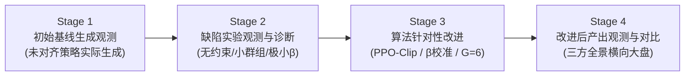

# White-Box RL Lab (白盒可透视强化学习与大模型对齐实验室)

> 这是一个专为深入理解大语言模型强化学习与对齐技术（PPO、DPO、GRPO 等）底层数学物理机制而构建的**教学级、工业级白盒可透视开源实验工程**。
>
> 本项目摒弃任何第三方框架的黑盒过度封装（拒绝 `trainer.train()` 一笔带过），将**逐 Token 价值估计心电图、Advantage 优势演算、PPO-Clip 截断、DPO 隐式奖励拔河、GRPO 组内赛马、DeepSeek-V3.2 无偏 KL 与全维度评估指标监控看板**完全解构，提供高信息密度的终端透视看板。

---

## 📖 目录 (Table of Contents)

1. [💡 项目设计哲学与“白盒透视”体系](#-项目设计哲学与白盒透视体系)
2. [⚙️ 三大核心对齐算法架构流程](#️-三大核心对齐算法架构流程)
3. [📐 核心数学原理与物理机制推导](#-核心数学原理与物理机制推导)
4. [📈 全维度评估指标体系 (Evaluation Metrics)](#-全维度评估指标体系-evaluation-metrics)
5. [🎯 四大攻防基准测试矩阵 (Benchmark Suite)](#-四大攻防基准测试矩阵-benchmark-suite)
6. [📁 目录组织规范](#-目录组织规范)
7. [🚀 快速开始 (Quick Start)](#-快速开始-quick-start)
8. [📊 透视控制台看板解读指南](#-透视控制台看板解读指南)
9. [🔬 消融实验矩阵 (Ablation Studies)](#-消融实验矩阵-ablation-studies)
10. [📚 深度学习理论笔记指引](#-深度学习理论笔记指引)

---

## 💡 项目设计哲学与“白盒透视”体系

在大模型后训练（Post-Training）阶段，强化学习往往被视为最令人头疼的“玄学黑盒”：
- **PPO** 显存占用巨大，训练动辄震荡崩溃，你不知道 Critic 究竟在哪个 Token 发生了预估失常；
- **DPO** 去掉了强化学习复杂回路，但对数据噪声极其敏感，好坏答案的隐式奖励是如何拔河的？
- **GRPO**（DeepSeek-R1 核心底座）省去了 Critic，如何仅靠组内同行对比（z-score）就激发了长思维链（CoT）推理能力？

本项目通过**全透明探针体系 (White-Box Probes)**，将计算图每一个齿轮的咬合过程实时呈现在终端：

```
[输入 Prompt]
       │
       ├───────────────────────────────┬───────────────────────────────┐
       ▼                               ▼                               ▼
【探针 1：PPO 四模型心电图】     【探针 2：DPO 偏好拔河】         【探针 3：GRPO 赛马名次榜】
Critic 逐 Token 打分 V(s)         计算相对基座对数概率差            同一 Prompt 群发采样 G 个候选
时序差分 TD / Advantage 演算      隐式奖励 r_w, r_l 提取           规则引擎判卷 + CoT 格式打分
Ratio 截断抹平梯度过程            Bradley-Terry 胜率矩阵演化        z-score 组内标准化: A=(r-μ)/σ
       │                               │                               │
       └───────────────────────────────┼───────────────────────────────┘
                                       ▼
                       【探针 4：全维度评估指标大盘】
         Policy Loss · KL 散度 · 策略熵 · Clip 率 · 长度作弊检测 · 健康度红绿灯
```

---

## ⚙️ 三大核心对齐算法架构流程

```mermaid
flowchart TD
    subgraph S1["PPO (四模型特训班)"]
        Actor["Actor (更新)"] -->|"生成序列"| Critic["Critic (更新)<br/>逐 Token 打分 V(s)"]
        Actor -->|"完整回答"| RM["Reward Model (冻结)<br/>打总分 R"]
        Actor -.->|"KL 约束"| Ref1["Ref Model (冻结)"]
        Critic --> Adv1["Advantage = 实际 - 预期"]
        RM --> Adv1
        Adv1 --> Clip1["PPO-Clip 截断 ±20%"]
        Clip1 -->|"更新参数"| Actor
    end

    subgraph S2["DPO (偏好拔河改错本)"]
        Pairs["偏好对 (y_w, y_l)"] --> D_Actor["Actor (更新)"]
        Pairs --> D_Ref["Ref Model (冻结)"]
        D_Actor --> Margin["隐式奖励分差<br/>Δr = r_w - r_l"]
        D_Ref --> Margin
        Margin --> Sigmoid["Sigmoid 裁判胜率 σ(Δr)"]
        Sigmoid --> D_Loss["-log σ 极小化"]
        D_Loss -->|"更新参数"| D_Actor
    end

    subgraph S3["GRPO (DeepSeek 内部赛马)"]
        Q["Prompt 题目"] --> Rollout["组内群发采样<br/>G 个候选答案"]
        Rollout --> RuleJudge["规则引擎 (理科)<br/>硬解 0/1 + CoT 标签"]
        RuleJudge --> GroupNorm["组内归一化<br/>A_i = (r_i - mean) / std"]
        GroupNorm --> V32["DeepSeek-V3.2 魔改<br/>无偏 KL + Off-Policy 掩码"]
        V32 -->|"更新参数"| G_Actor["Actor (更新)"]
    end
```



---

## 📐 核心数学原理与物理机制推导

### 1. PPO-Clip 截断与优势估计
$$L^{\text{CLIP}}(\theta) = \hat{\mathbb{E}}_t \left[ \min\left(r_t(\theta)\hat{A}_t, \ \text{clip}(r_t(\theta), 1-\epsilon, 1+\epsilon)\hat{A}_t\right) \right]$$

- **概率比率**：$r_t(\theta) = \frac{\pi_\theta(a_t|s_t)}{\pi_{\theta_{\text{old}}}(a_t|s_t)}$
- **截断限位器**：$\epsilon = 0.2$，当好动作概率暴涨超 $20\%$ 或坏动作暴跌超 $20\%$ 时，梯度被强行归零，**防止策略过山车崩溃**。
- **广义优势估计 (GAE)**：
$$\hat{A}_t = \sum_{l=0}^\infty (\gamma \lambda)^l \delta_{t+l}^V, \quad \delta_t^V = R_t - \beta \mathbb{D}_{\text{KL}} + \gamma V(s_{t+1}) - V(s_t)$$

### 2. DPO 直接偏好优化 (Bradley-Terry 拔河模型)
$$L_{\text{DPO}}(\theta) = - \mathbb{E}_{(x, y_w, y_l)} \left[ \log \sigma \left( \beta \log \frac{\pi_\theta(y_w|x)}{\pi_{\text{ref}}(y_w|x)} - \beta \log \frac{\pi_\theta(y_l|x)}{\pi_{\text{ref}}(y_l|x)} \right) \right]$$

- **隐式奖励映射**：$r_\theta(x, y) = \beta \log \frac{\pi_\theta(y|x)}{\pi_{\text{ref}}(y|x)}$
- **拔河机制**：最大化好答案相对基座的概率提升量与坏答案提升量之间的分差 $\Delta r = r_w - r_l$。

### 3. GRPO 组内相对优势与 DeepSeek-V3.2 稳定魔改
$$A_i = \frac{r_i - \text{mean}(\{r_1, \dots, r_G\})}{\text{std}(\{r_1, \dots, r_G\}) + \epsilon}$$

$$L_{\text{GRPO}}(\theta) = \frac{1}{G} \sum_{i=1}^G \left( \min(r_i A_i, \text{clip}(r_i, 1-\epsilon, 1+\epsilon) A_i) - \beta \mathbb{D}_{\text{KL}}(\pi_\theta \| \pi_{\text{ref}}) \right)$$

- **DeepSeek-V3.2 无偏 KL 估计 (k3 估计器)**：
$$\mathbb{D}_{\text{KL}}^{\text{unbiased}} = \frac{\pi_\theta}{\pi_{\text{old}}} \left( \frac{\pi_{\text{ref}}}{\pi_\theta} - \log \frac{\pi_{\text{ref}}}{\pi_\theta} - 1 \right)$$
消除 $1/\pi_\theta$ 带来的数值不稳定与梯度爆炸。
- **Off-Policy 序列掩码**：
$$M_i = \begin{cases} 0 & A_i < 0 \ \text{且} \ \frac{1}{|o_i|}\sum \log \frac{\pi_{\text{old}}}{\pi_\theta} > \delta \\ 1 & \text{否则} \end{cases}$$
对偏离当前策略过大的历史负样本屏蔽纠错，防止训练震荡。

---

## 📈 全维度评估指标体系 (Evaluation Metrics)

强化学习决不能仅盯一个单一奖励得分。本项目构建了四大支柱评估指标（详见专著 [`EVALUATION_METRICS_RL.md`](EVALUATION_METRICS_RL.md)）：

| 支柱维度 | 核心监控指标 | 正常健康区间 | 物理意义与异常警报 |
| :--- | :--- | :--- | :--- |
| **训练动态** | **Policy Loss** | 0 附近窄幅波动 | 衡量参数更新平稳度；若暴涨至数十提示学习率过大。 |
| **训练动态** | **Value Loss** (仅PPO) | 持续下降并收敛 | Critic 预估均方误差；若居高不下说明裁判看不准局势。 |
| **训练动态** | **Clip Fraction** | **$5\% \sim 25\%$** | 截断触发率；$>35\%$ 提示更新过激，$<2\%$ 提示步长太保守。 |
| **训练动态** | **KL Divergence** | **$0.01 \sim 0.20$** | 偏离基座程度；$>0.50$ 提示严重漂移崩溃，$<0.001$ 提示学不动。 |
| **训练动态** | **Policy Entropy** | $0.3 \sim 2.0$ | 动作多样性；骤降至 $<0.1$ 说明陷入**模式坍塌 (Mode Collapse)**。 |
| **生成质量** | **Pass@1 / Pass@k** | 稳步爬升 | 数学/代码客观题硬指标通过率。 |
| **生成质量** | **Win Rate** | $> 50\%$ | 相对 SFT 基座模型的双盲 A/B 胜率。 |
| **反作弊** | **Length Bias** | 相关系数 $< 0.6$ | 检验是否发生“靠写废话骗分”的 **Reward Hacking**。 |
| **工程效能** | **Peak VRAM** | PPO >4x, GRPO 1.2x | 显存峰值消耗倍率。 |

---

## 🎯 四大攻防基准测试矩阵 (Benchmark Suite)

预设在 `data/benchmark_cases.json` 中：

1. **Exact Math & CoT 推理**：验证 GRPO 规则打分能否有效激发 `<think>` 思考深度；
2. **Safety & Red-Teaming 对抗拒答**：验证 DPO / PPO 在面对诱导违法犯罪提问时的合规拒答能力；
3. **Format Compliance 结构化依从**：验证模型是否严格闭合 `<think>...</think><answer>...</answer>`；
4. **Length Bias Defense 抗冗长作弊**：验证长度惩罚能否粉碎 Reward Hacking。

---

## 📁 目录组织规范

```text
PPO-GRPO-DPO/
├── README.md                      # 本手册 (开源门面与实战全景)
├── PPO-DPO-GRPO强化学习笔记.md      # 万字经典强化学习笔记 (增量追加理论与实战实操)
├── EVALUATION_METRICS_RL.md       # 评估指标体系专著 (覆盖四大维度与红绿灯表)
├── requirements.txt               # 轻量环境依赖 (纯原生 PyTorch, Rich 等)
├── main.py                        # 统一可执行入口 (演示/对比/消融/基准测试)
├── data/                          # 语料与攻防数据集
│   ├── reasoning_tasks.json       # 数学推理题 (供 GRPO 规则硬解)
│   ├── preference_pairs.json      # 偏好对数据 (供 DPO 拔河)
│   ├── alignment_prompts.json     # 安全对齐 Prompt (供 PPO/RM 评分)
│   └── benchmark_cases.json       # 4 维攻防基准测试矩阵
├── src/                           # 核心白盒源码
│   ├── config.py                  # 全局超参数与配置
│   ├── visualizer.py              # Rich 终端透视看板
│   ├── models/
│   │   ├── policy_network.py      # Actor 策略网络与自回归生成头
│   │   ├── critic_network.py      # Critic 价值网络 (逐 Token 打分)
│   │   └── reward_engine.py       # 双引擎奖励判题器 (规则硬解 + 语义偏好)
│   ├── algorithms/
│   │   ├── ppo_trainer.py         # 白盒 PPO 训练器 (心电图与 GAE 演算)
│   │   ├── dpo_trainer.py         # 白盒 DPO 训练器 (隐式奖励拔河)
│   │   └── grpo_trainer.py        # 白盒 GRPO 训练器 (赛马 + DeepSeek-V3.2 魔改)
│   └── metrics/
│       └── rl_metrics.py          # 评估指标计算与自动化健康诊断引擎
└── experiments/                   # 实验套件
    ├── compare_all.py             # 三大算法横向全维度对照实验
    ├── ablation_kl.py             # KL 正则强度消融实验
    └── ablation_grpo_group.py     # GRPO 组大小 G 消融实验
```

---

## 🚀 快速开始 (Quick Start)

### 1. 安装依赖（无需庞大显卡，纯 CPU 亦可秒级运行）
```bash
# 克隆仓库并安装轻量依赖
pip install -r requirements.txt
```

### 2. 运行单算法白盒探针演示
```bash
# 运行 PPO 四模型协作与心电图透视
python main.py --algo ppo

# 运行 DPO 偏好拔河与胜率转换透视
python main.py --algo dpo

# 运行 DeepSeek GRPO 组内赛马与无偏 KL 透视
python main.py --algo grpo
```

### 3. 一键运行全算法横向对照实验
```bash
python main.py --compare
```

### 4. 执行消融实验
```bash
# 执行 KL 正则消融实验 (验证有无 KL 时的 Reward Hacking 现象)
python main.py --ablation kl

# 执行 GRPO 组大小 G 消融实验 (验证 G=2, 4, 8 时的方差平滑度)
python main.py --ablation group
```

### 5. 批量运行 4 维基准攻防测试矩阵
```bash
python main.py --benchmark
```

---

## 📊 白盒实验范式与控制台看板解读指南

本项目严格遵循真实的科学实验铁律：**【观测基线产出 -> 观测缺陷与诊断归因 -> 算法针对性改进 -> 观测对比评测】**，拒绝任何预设脚本，所有状态与张量运算均实时动态生成！



运行程序后，控制台将依次呈现专业看板：

### 阶段 1：初始基线产出观测看板 (Baseline Observation)
- **观测要领**：让未对齐的基座策略直接自回归生成回答，观察其原始生成内容、Reward 奖励分与 Critic 初始价值预估。基线阶段往往表现为：语气生硬、未写 CoT 标签、或对好坏答案持 50% 盲猜态度。

### 阶段 2：缺陷实验观测与诊断看板 (Flawed Run & Failure Diagnosis)
- **观测要领**：故意运行存在严重理论缺陷的配置（如 PPO 去除 KL 约束与 Clip 截断、DPO 设置极小 $\beta=0.001$、GRPO 设定过小采样组 $G=2$）：
  - **PPO 无约束更新**：比率 $r_t$ 发生剧烈失控（$>1.3$），KL 散度飙升（$>0.27$），策略熵骤降（模式坍塌）；
  - **DPO 极小 $\beta$ 更新**：隐式奖励分差 $\Delta r$ 几乎无法拉开（$<0.2$），胜率卡死在 $53\%$，出现严重的梯度消失欠拟合；
  - **GRPO $G=2$ 更新**：采样样本同质化全错，组内方差 $\sigma=0$，发生“零优势死锁”（Zero-Advantage Dilemma），模型原地空转。

### 阶段 3：算法针对性改进看板 (Targeted Algorithmic Improvement)
- **观测要领**：引入工业级数学改进（PPO 双重剪裁 + KL 锚定；DPO 黄金 $\beta=0.1$ 校准；GRPO 群组扩充 $G=6$ + DeepSeek-V3.2 无偏 KL 估计器 k3 与 Off-Policy 序列掩码）：
  - **PPO 心电图看板**：Critic 价值从负值平稳回升至正向激励区间，时序走势稳步爬升；
  - **DPO 拔河看板**：好答案对数似然 $\Delta \log \pi$ 稳步拉升，坏答案被坚决压制，胜率从 50% 飙升至 90%+；
  - **GRPO 赛马名次榜**：展示组内同行相对优势 $A_i$（最佳候选斩获 $+1.4\sigma$ 正向优势），展现“全靠同行衬托”。

### 阶段 4：改进效果评测大盘 (Tri-State Comparison)
- **观测要领**：同屏并列【基线状态 -> 缺陷尝试 -> 改进方案】三方核心物理量，以实测数据闭环印证算法改进的必要性与有效性！

---

## 🔬 消融实验矩阵 (Ablation Studies)

本项目内置两大关键消融实验，印证大模型后训练的关键规律：

1. **KL 正则系数消融 ($\beta = 0.0$ vs $0.05$ vs $0.5$)**：
   - $\beta=0$ 时：模型放飞自我，KL 散度急剧上升，极易触发 Reward Hacking；
   - $\beta=0.05$ 时：黄金适度，偏好提升与基座能力兼顾；
   - $\beta=0.5$ 时：模型过度拘谨，无法有效学到新偏好。
2. **GRPO 组大小消融 ($G = 2$ vs $4$ vs $8$)**：
   - $G=2$ 时方差大，易陷入全对/全错除零失效区；
   - $G=8$ 时（DeepSeek 标准配置）统计基线高度平稳，正解优势被稳定拉伸至 $+1.5\sigma \sim +2.5\sigma$。

---

## 📚 深度学习理论笔记指引

本项目代码与两份理论专著紧密呼应：
- 💡 [**`PPO-DPO-GRPO强化学习笔记.md`**](PPO-DPO-GRPO强化学习笔记.md)：万字大白话经典笔记，从生活比喻、公式符号拆解到工业避坑指南；
- 📈 [**`EVALUATION_METRICS_RL.md`**](EVALUATION_METRICS_RL.md)：工业级强化学习全维度评估指标体系与红绿灯速查表。
