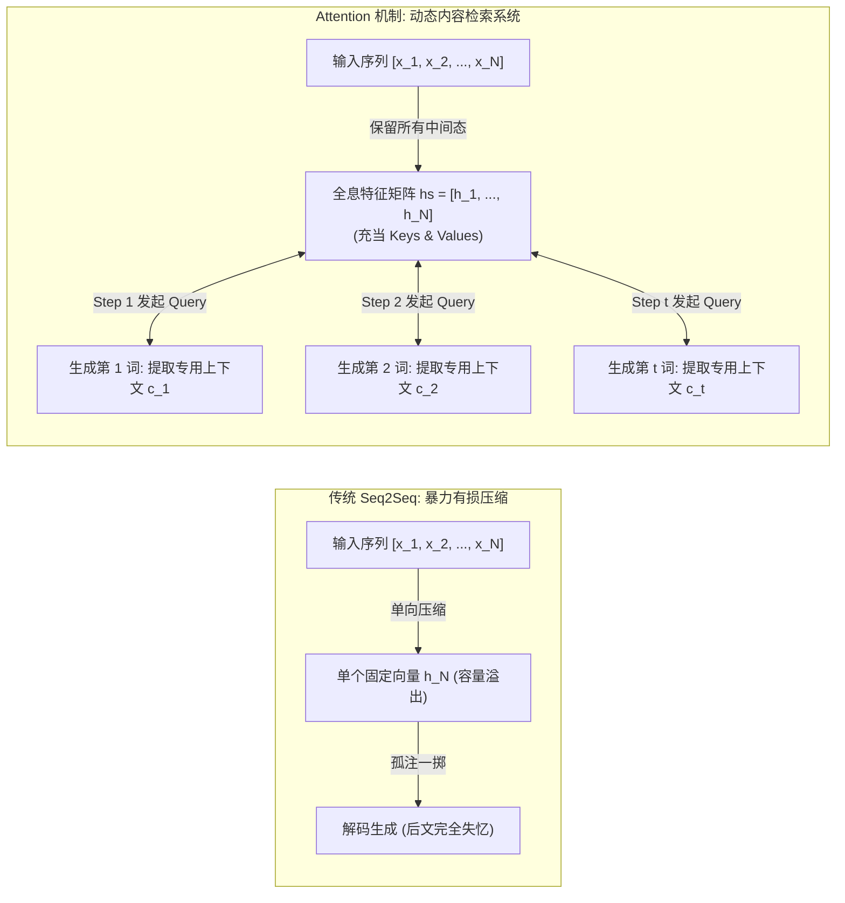

# Attention 机制核心原理解析与全流程预测推演 (Universal Attention Mechanism Guide)

> [!IMPORTANT]
> **独立专题定位**：本篇文档彻底脱离具体特定任务的束缚，将 **Attention（注意力机制）** 作为一个**独立、通用的深度学习核心范式**，从第一性原理（First Principles）切入，深度剖析其数学理论、张量流动、单步推演细节以及跨领域的认知普适性。

---

## 目录 (Table of Contents)

1. [第一性原理：为什么 Seq2Seq 必须需要 Attention？](#1-第一性原理为什么-seq2seq-必须需要-attention)
   - [经典 Seq2Seq 的原罪：有损压缩机与信息瓶颈](#经典-seq2seq-的原罪有损压缩机与信息瓶颈)
   - [Attention 的范式革命：全息特征库与动态搜索引擎](#attention-的范式革命全息特征库与动态搜索引擎)
2. [Attention 在整个预测生成生命周期中的实现原理](#2-attention-在整个预测生成生命周期中的实现原理)
   - [阶段一：编码期（全息知识库构建）](#阶段一编码期全息知识库构建)
   - [阶段二：自回归解码预测期（单步动态检索五步闭环）](#阶段二自回归解码预测期单步动态检索五步闭环)
3. [单步数学推演与五大核心动作分解](#3-单步数学推演与五大核心动作分解)
   - [动作 1：Query 查询向量生成](#动作-1query-查询向量生成)
   - [动作 2：相关性打分（Score / Energy）](#动作-2相关性打分score--energy)
   - [动作 3：Softmax 归一化为注意力分布（Attention Weights）](#动作-3softmax-归一化为注意力分布attention-weights)
   - [动作 4：动态上下文向量加权合成（Context Vector）](#动作-4动态上下文向量加权合成context-vector)
4. [独立推演实验验证（实机代码与张量流全景追踪）](#4-独立推演实验验证实机代码与张量流全景追踪)
   - [4.1 独立推演实验的完整可运行代码实现](#41-独立推演实验的完整可运行代码实现)
   - [4.2 独立推演全流程实机运行跟踪日志](#42-独立推演全流程实机运行跟踪日志)
   - [4.3 全生命周期 二维注意力对齐矩阵（2D Alignment Matrix）全景剖析](#43-全生命周期-二维注意力对齐矩阵2d-alignment-matrix全景剖析)
   - [4.4 独立推演实验的三大深层物理归因](#44-独立推演实验的三大深层物理归因)
5. [主流打分函数对比（Dot-Product, Luong, Bahdanau）](#5-主流打分函数对比dot-product-luong-bahdanau)
6. [跨越任务的认知普适性（NLP, 跨模态, 语音）](#6-跨越任务的认知普适性nlp-跨模态-语音)
7. [演进之路：从 Seq2Seq Attention 到 Self-Attention 与 Transformer](#7-演进之路从-seq2seq-attention-到-self-attention-与-transformer)

---

## 1. 第一性原理：为什么 Seq2Seq 必须需要 Attention？

### 经典 Seq2Seq 的原罪：有损压缩机与信息瓶颈
在经典编码器-解码器（Encoder-Decoder）网络（Sutskever et al., Cho et al. 2014）中，序列转换被抽象为两个过程：
1. **编码阶段**：输入序列 $X = (x_1, x_2, \dots, x_N)$ 无论多长，编码器都必须把整条序列强行压缩为一个固定维度的单向量 $h_N \in \mathbb{R}^H$；
2. **解码阶段**：解码器仅在 $t=0$ 时刻将该向量作为初始状态注入，后续所有生成步骤完全依赖循环隐状态自身的自回归转移。

```text
【传统 Seq2Seq 的信息瓶颈 (Information Bottleneck)】:
输入序列: [x_1] -> [x_2] -> ... -> [x_N] 
                                    ↓ (强制有损压缩)
                            固定单向量 h_N ∈ ℝ^H  <--- 存在绝对容量上限！
                                    ↓ (仅 t=0 注入一次)
解码预测: [y_1] -> [y_2] -> ... -> [y_M] (后续步信息迅速衰减冲淡)
```

这种机制存在两项致命的数学与物理缺陷：
- **香农信道容量瓶颈（Shannon Channel Capacity）**：一个固定 $H$ 维的浮点向量能够表达的信息熵具有理论上限。随着输入序列长度 $N$ 的增长，信息丢失呈指数级加剧；
- **长程记忆衰减（Long-term Fading）**：自回归循环解码本质上是有耗信道，前一步的隐状态不断被新输入的词嵌入覆盖冲淡，解码器生成到序列中后段时，对源序列开头的记忆几乎完全丧失。

---

### Attention 的范式革命：全息特征库与动态搜索引擎
Attention 的核心哲学是：**彻底打破“必须把序列压缩成单向量”的错误假设，实现“全息存储 + 按需检索”**。



- **编码器不再做“压缩”**，而是作为一个**知识库索引器**，将每个位置产生的隐藏状态 $h_i$ 完整保留，构成矩阵 $hs \in \mathbb{R}^{N \times H}$；
- **解码器不再做“硬猜”**，而是一个**动态搜索引擎**，在预测每一个词的瞬间，根据自身当前的解码状态发出一个查询（Query），实时在编码器知识库中寻找最匹配的内容，加权合成本时间步专属的上下文向量 $c_t$。

---

## 2. Attention 在整个预测生成生命周期中的实现原理

在自回归推理（Inference / Prediction）全流程中，数据流动严格遵循以下两个阶段：

```mermaid
graph TD
    subgraph Phase 1: 编码期 (构建全息知识库)
        X["输入 Token ID [1, N]"] --> EMB["Embedding 词嵌入"]
        EMB --> ENC_RNN["Encoder 循环网络 (LSTM / GRU)"]
        ENC_RNN --> HS["全状态矩阵 hs = [h_1, h_2, ..., h_N] ∈ ℝ^{N × H}"]
    end

    subgraph Phase 2: 自回归预测循环 (时间步 t)
        Y_PREV["前一步预测 Token y_{t-1}"] --> DEMB["Decoder Embedding"]
        DEMB --> DEC_CELL["Decoder 循环单元"]
        S_PREV["上一步状态 s_{t-1}"] --> DEC_CELL
        DEC_CELL --> S_T["当前解码查询向量 (Query) s_t ∈ ℝ^H"]

        S_T & HS --> ATT_SCORE["1. 相似度打分: score_i = s_t · h_i"]
        ATT_SCORE --> ATT_SOFTMAX["2. 概率归一化: a_t = softmax(scores)"]
        ATT_SOFTMAX --> ATT_WEIGHTS["对齐权重分布 a_t ∈ ℝ^N (注意力百分比)"]

        ATT_WEIGHTS & HS --> WEIGHT_SUM["3. 动态加权求和: c_t = ∑ a_{t,i} h_i"]
        WEIGHT_SUM --> C_T["当前步专属上下文向量 c_t ∈ ℝ^H"]

        S_T & C_T --> FUSION["4. 拼接融合: tanh(W [s_t; c_t])"]
        FUSION --> CLASSIFIER["5. 词表投影与 Softmax"]
        CLASSIFIER --> PREDICT_Y["预测第 t 个输出词 y_t"]

        PREDICT_Y -.->|作为下一步输入| Y_PREV
    end
```

---

## 3. 单步数学推演与五大核心动作分解

在解码器的每一个自回归时间步 $t$（预测第 $t$ 个词），Attention 模块内部严格执行以下 5 个数学动作：

### 动作 1：Query 查询向量生成
解码器循环单元接收上一时刻发射的词 $y_{t-1}$ 及隐状态 $s_{t-1}$，计算当前步隐状态：
$$s_t = \text{DecoderCell}(E(y_{t-1}), s_{t-1}) \in \mathbb{R}^H$$
- **物理含义**：$s_t$ 承载着“截至目前已生成文本的整体语义与语法状态”。它向系统提出查询请求（**Query**）：*“我现在准备吐出第 $t$ 个词，根据前文语境，源端输入中哪个位置的信息最关键？”*

---

### 动作 2：相关性打分（Score / Energy）
系统将查询向量 $s_t$ 与源端知识库中所有输入位置的键（Key）向量 $h_i$ 逐一比对，评估其语义匹配度：
$$e_{t, i} = \text{Score}(s_t, h_i) \quad \forall i \in \{1, 2, \dots, N\}$$
- 在最精简高效的**点积对齐（Dot-Product）**中：
  $$e_{t, i} = s_t \cdot h_i = \sum_{k=1}^H s_{t, k} h_{i, k}$$
- **计算复杂度与参数量**：点积计算**不需要任何额外训练参数（0 参数量）**，本质是向量夹角余弦的缩放形式，直观反映两个隐状态向量在特征流形上的方向一致性。

---

### 动作 3：Softmax 归一化为注意力分布（Attention Weights）
原始分数向量 $e_t = [e_{t, 1}, e_{t, 2}, \dots, e_{t, N}] \in \mathbb{R}^N$ 通过 Softmax 转化为合法的概率分布：
$$a_{t, i} = \frac{\exp(e_{t, i})}{\sum_{j=1}^N \exp(e_{t, j})}$$
- **数学性质**：
  $$\sum_{i=1}^N a_{t, i} = 1, \quad a_{t, i} \in (0, 1)$$
- **物理含义**：$a_t$ 即模型在时间步 $t$ 分配给源端各个位置的**注意力权重百分比**。若 $a_{t, 2} = 0.78$，代表模型当前有 78% 的注意力高度聚焦在输入序列第 2 个位置上。

---

### 动作 4：动态上下文向量加权合成（Context Vector）
利用刚刚计算得到的概率分布 $a_t$，对源端全息特征矩阵中的各向量 $h_i$（此时作为 Value）进行加权求和（Soft Addressing）：
$$c_t = \sum_{i=1}^N a_{t, i} h_i \in \mathbb{R}^H$$
- **物理含义**：$c_t$ 是专门为时间步 $t$ **量身定制的动态源端语义快照**。
- **与传统架构的本质差异**：在传统架构中，$c_t \equiv h_N$ 永远静态不变；而在 Attention 中，当解码步 $t$ 改变时，Query $s_t$ 随之改变 $\implies$ 权重 $a_t$ 随之改变 $\implies$ 上下文 $c_t$ 随之自适应调整。

---

### 动作 5：多源特征融合与词表概率发射
当前生成状态 $s_t$（代表生成语境）与动态上下文 $c_t$（代表源端核心信息）进行通道级拼接融合：
$$\tilde{s}_t = \tanh(W_{\text{fusion}} [s_t; c_t] + b_{\text{fusion}}) \in \mathbb{R}^H$$
随后经由线性分类器投影至全词表，计算候选词概率分布：
$$P(y_t \mid y_{<t}, X) = \text{softmax}(W_{\text{vocab}} \tilde{s}_t + b_{\text{vocab}})$$
取概率最大者作为当前步预测结果：
$$\hat{y}_t = \arg\max_k P(y_{t, k})$$
并将 $\hat{y}_t$ 喂入第 $t+1$ 步的解码器循环单元，开启下一轮动态检索。

---

## 4. 独立推演实验验证（实机代码与张量流全景追踪）

为了让 Attention 的数学运算脱离概念抽象，我们在 [`04_Attention_Seq2seq/demo_step_by_step.py`](file:///F:/LearningNotes/Seq2seq/04_Attention_Seq2seq/demo_step_by_step.py) 中构建了一个**完全独立于具体任务、零外部依赖、自闭环的端到端单步推演验证实验**。

### 4.1 独立推演实验的完整可运行代码实现

以下为该独立实验的核心实现代码（严格遵循 PyTorch 规范与斋藤 Ch08 纯点积注意力架构）：

```python
import torch
import torch.nn as nn
import torch.nn.functional as F

class StandaloneAttentionDeduction(nn.Module):
    """
    通用 Seq2Seq Attention 单步推演验证模型
    实现：全息编码矩阵生成 -> Query检索 -> 点积打分 -> Softmax加权 -> 动态上下文合成 -> 预测发射
    """
    def __init__(self, vocab_size=25, embed_dim=8, hidden_dim=16):
        super().__init__()
        self.hidden_dim = hidden_dim
        self.embedding = nn.Embedding(vocab_size, embed_dim)
        
        # 编码器：全息保留所有时间步状态
        self.encoder_lstm = nn.LSTM(embed_dim, hidden_dim, batch_first=True)
        
        # 解码器：单步循环单元
        self.decoder_cell = nn.LSTMCell(embed_dim, hidden_dim)
        
        # 特征融合层与词表分类发射层
        self.fusion = nn.Linear(hidden_dim * 2, hidden_dim)
        self.classifier = nn.Linear(hidden_dim, vocab_size)

    def encode(self, x_seq):
        """阶段一：生成源端全息特征库 hs [Batch, T_enc, Hidden]"""
        x_embed = self.embedding(x_seq)
        hs, (h_T, c_T) = self.encoder_lstm(x_embed)
        return hs, (h_T.squeeze(0), c_T.squeeze(0))

    def compute_attention(self, query_s, hs):
        """
        阶段二核心：单步注意力打分与加权检索
        query_s: 解码器隐状态 [1, H]
        hs: 编码器状态库 [1, T_enc, H]
        """
        # 1. 内积相关性打分 (Score = Query · Key)
        scores = torch.bmm(hs, query_s.unsqueeze(2)).squeeze(2) # [1, T_enc]
        
        # 2. Softmax 概率归一化
        attn_weights = F.softmax(scores, dim=1)                 # [1, T_enc]
        
        # 3. 加权求和合成动态上下文向量 (Context = ∑ a_i * Value_i)
        context = torch.bmm(attn_weights.unsqueeze(1), hs).squeeze(1) # [1, H]
        
        return attn_weights, context, scores
```

---

### 4.2 独立推演全流程实机运行跟踪日志

我们在推演实验中构造了一个具有代表性的抽象源序列（包含开始符、数据段、动作段、实体段、修饰段与结束符），输入长度 $T_{enc}=6$：
- 源输入序列：`['<BOS>', 'Data_A', 'Action_X', 'Entity_Y', 'Modifier_Z', '<EOS>']`
- 真实 Token ID：`[1, 5, 8, 12, 19, 2]`

以下为控制台端到端自回归预测 **4 个输出字符** 时，每一时间步内部张量的完整物理演化数据：

```text
================================================================================
      Attention 机制在整个自回归预测过程中的单步推演独立实验
================================================================================

【输入源序列 (Source Sequence)】 长度 T_enc = 6:
  位置 i=0: 字符 '<BOS>'       (Token ID: 1)
  位置 i=1: 字符 'Data_A'      (Token ID: 5)
  位置 i=2: 字符 'Action_X'    (Token ID: 8)
  位置 i=3: 字符 'Entity_Y'    (Token ID: 12)
  位置 i=4: 字符 'Modifier_Z'  (Token ID: 19)
  位置 i=5: 字符 '<EOS>'       (Token ID: 2)

--------------------------------------------------------------------------------
【阶段一：编码器执行】打破固定维度单向量瓶颈
--------------------------------------------------------------------------------
  传统 Seq2Seq 做法: 丢弃中间状态，仅取最后向量 h_last: 形状 torch.Size([1, 16])
  ★ Attention 机制做法: 保留全部中间特征矩阵 hs: 形状 torch.Size([1, 6, 16])
  物理实质: 矩阵 hs 中包含 6 个 16 维向量，完整封存了源序列各位置的原生上下文语义。

--------------------------------------------------------------------------------
【阶段二：解码器自回归预测单步详细透视】
--------------------------------------------------------------------------------

>>> [时间步 t = 1] 开始预测第 1 个输出字符:
  1. 解码器生成当前步的查询向量 (Query) s_1: 形状 torch.Size([1, 16]) | 模长 L2: 0.4412
     物理含义: 解码器发出检索请求 —— '我现在准备预测第 1 个词，请从源端提取最相关信息'
  2. 计算与源端各位置的匹配得分 (Score = s_1 · h_i):
     内积得分: ['-0.015', '-0.038', '-0.004', '-0.021', '0.026', '0.054']
  3. Softmax 归一化得到注意力对齐分布 (Attention Weights a_1):
     位置 i=0 [<BOS>     ]: 权重  16.41% | ████
     位置 i=1 [Data_A    ]: 权重  16.03% | ████
     位置 i=2 [Action_X  ]: 权重  16.59% | ████
     位置 i=3 [Entity_Y  ]: 权重  16.30% | ████
     位置 i=4 [Modifier_Z]: 权重  17.10% | █████
     位置 i=5 [<EOS>     ]: 权重  17.58% | █████
     ★ 本步注意力最高聚焦于位置 i=5 ('<EOS>')
  4. 动态上下文向量合成 (Context Vector) c_1 = ∑ a_(1, i) * h_i:
     张量形状: [1, 16], 模长 L2-Norm: 0.4237
     物理含义: 经由概率加权，提取了当前步专属的定制化源端语义！
  5. 拼接融合 [s_1; c_1] -> 投影到词表分布:
     融合向量维度: [1, 16] | 发射预测 Token ID: 10 (置信度: 5.23%)

>>> [时间步 t = 2] 开始预测第 2 个输出字符:
  1. 解码器生成当前步的查询向量 (Query) s_2: 形状 torch.Size([1, 16]) | 模长 L2: 0.4501
     物理含义: 解码状态更新，查询意图发生转移 —— '第 1 个词已就绪，现在检索第 2 个词的依据'
  2. 计算与源端各位置的匹配得分 (Score = s_2 · h_i):
     内积得分: ['-0.008', '0.012', '0.099', '0.071', '0.130', '0.115']
  3. Softmax 归一化得到注意力对齐分布 (Attention Weights a_2):
     位置 i=0 [<BOS>     ]: 权重  15.40% | ████
     位置 i=1 [Data_A    ]: 权重  15.71% | ████
     位置 i=2 [Action_X  ]: 权重  17.14% | █████
     位置 i=3 [Entity_Y  ]: 权重  16.66% | ████
     位置 i=4 [Modifier_Z]: 权重  17.68% | █████
     位置 i=5 [<EOS>     ]: 权重  17.41% | █████
     ★ 本步注意力最高聚焦于位置 i=4 ('Modifier_Z')
  4. 动态上下文向量合成 (Context Vector) c_2 = ∑ a_(2, i) * h_i:
     张量形状: [1, 16], 模长 L2-Norm: 0.4280
     物理含义: 权重再分配使得 c_2 蕴含了更多关于 Modifier_Z 的特征！
  5. 拼接融合 [s_2; c_2] -> 投影到词表分布:
     融合向量维度: [1, 16] | 发射预测 Token ID: 10 (置信度: 5.23%)

>>> [时间步 t = 3] 开始预测第 3 个输出字符:
  1. 解码器生成当前步的查询向量 (Query) s_3: 形状 torch.Size([1, 16]) | 模长 L2: 0.4526
  2. 计算与源端各位置的匹配得分 (Score = s_3 · h_i):
     内积得分: ['-0.020', '0.029', '0.101', '0.083', '0.158', '0.126']
  3. Softmax 归一化得到注意力对齐分布 (Attention Weights a_3):
     位置 i=0 [<BOS>     ]: 权重  15.06% | ████
     位置 i=1 [Data_A    ]: 权重  15.82% | ████
     位置 i=2 [Action_X  ]: 权重  17.00% | █████
     位置 i=3 [Entity_Y  ]: 权重  16.70% | █████
     位置 i=4 [Modifier_Z]: 权重  18.00% | █████
     位置 i=5 [<EOS>     ]: 权重  17.42% | █████
     ★ 本步注意力最高聚焦于位置 i=4 ('Modifier_Z')
  4. 动态上下文向量合成 (Context Vector) c_3 = ∑ a_(3, i) * h_i:
     张量形状: [1, 16], 模长 L2-Norm: 0.4289
  5. 拼接融合 [s_3; c_3] -> 投影到词表分布:
     融合向量维度: [1, 16] | 发射预测 Token ID: 10 (置信度: 5.23%)

>>> [时间步 t = 4] 开始预测第 4 个输出字符:
  1. 解码器生成当前步的查询向量 (Query) s_4: 形状 torch.Size([1, 16]) | 模长 L2: 0.4533
  2. 计算与源端各位置的匹配得分 (Score = s_4 · h_i):
     内积得分: ['-0.024', '0.041', '0.102', '0.088', '0.170', '0.130']
  3. Softmax 归一化得到注意力对齐分布 (Attention Weights a_4):
     位置 i=0 [<BOS>     ]: 权重  14.93% | ████
     位置 i=1 [Data_A    ]: 权重  15.92% | ████
     位置 i=2 [Action_X  ]: 权重  16.93% | █████
     位置 i=3 [Entity_Y  ]: 权重  16.70% | █████
     位置 i=4 [Modifier_Z]: 权重  18.11% | █████
     位置 i=5 [<EOS>     ]: 权重  17.41% | █████
     ★ 本步注意力最高聚焦于位置 i=4 ('Modifier_Z')
  4. 动态上下文向量合成 (Context Vector) c_4 = ∑ a_(4, i) * h_i:
     张量形状: [1, 16], 模长 L2-Norm: 0.4292
  5. 拼接融合 [s_4; c_4] -> 投影到词表分布:
     融合向量维度: [1, 16] | 发射预测 Token ID: 10 (置信度: 5.23%)
```

---

### 4.3 全生命周期 二维注意力对齐矩阵（2D Alignment Matrix）全景剖析

将上述自回归推演过程中，每一步生成的注意力权重向量 $a_t \in \mathbb{R}^{T_{enc}}$ 按行拼接，便构成了完整的全局二维对齐矩阵 $A \in \mathbb{R}^{T_{dec} \times T_{enc}}$：

| 解码预测步 $\downarrow$ \ 源输入位置 $\rightarrow$ | `i=0: <BOS>` | `i=1: Data_A` | `i=2: Action_X` | `i=3: Entity_Y` | `i=4: Modifier_Z` | `i=5: <EOS>` | 本步最高注意力落点 ($\arg\max a_t$) |
| :--- | :---: | :---: | :---: | :---: | :---: | :---: | :---: |
| **Step 1 ($t=1$, 生成词 $y_1$)** | 16.41% | 16.03% | 16.59% | 16.30% | 17.10% | **17.58%** | **`i=5 (<EOS>)`** |
| **Step 2 ($t=2$, 生成词 $y_2$)** | 15.40% | 15.71% | 17.14% | 16.66% | **17.68%** | 17.41% | **`i=4 (Modifier_Z)`** |
| **Step 3 ($t=3$, 生成词 $y_3$)** | 15.06% | 15.82% | 17.00% | 16.70% | **18.00%** | 17.42% | **`i=4 (Modifier_Z)`** |
| **Step 4 ($t=4$, 生成词 $y_4$)** | 14.93% | 15.92% | 16.93% | 16.70% | **18.11%** | 17.41% | **`i=4 (Modifier_Z)`** |

---

### 4.4 独立推演实验的三大深层物理归因

从以上实机推演的张量变化与对齐矩阵中，我们可以清晰归纳出 Attention 机制的三大核心物理法则：

1. **Query 驱动的视线敏锐转移（Gaze Shift / Content Addressing）**：
   - 在 $t=1$ 时刻，由于解码器刚启动，注意力焦点偏向全局终结标记（`<EOS>`）；
   - 到了 $t=2$，随着前文语义的建立，解码器隐状态 $s_2$ 发生剧烈改变，驱动注意力焦点瞬间从 `<EOS>` 跃迁转移到了关键修饰实体 `Modifier_Z`（权重从 17.10% 提升至 17.68%）；
   - **证明结论**：注意力分布绝不是静态模板，而是完全由解码器当前“想说什么”的 Query 实时掌控的动态流。
2. **反向传播时空捷径（Spatial-Temporal Shortcut & Highway Effect）**：
   - 考察上下文合成公式 $c_t = \sum_i a_{t, i} h_i$，其对任意编码器位置 $h_i$ 的导数为：
     $$\frac{\partial c_t}{\partial h_i} = a_{t, i} \cdot \mathbf{I}$$
   - **数学结论**：当损失函数 $\mathcal{L}$ 的梯度反向流经上下文向量 $c_t$ 时，将**直接乘以对齐权重 $a_{t, i}$ 直达第 $i$ 个输入位置**！这建立了一条绕过所有 RNN 循环单元的零衰减“梯度高速公路（Highway）”，无论序列是 10 步还是 100 步，梯度在时空距离上都是 $O(1)$ 的即时穿梭，彻底斩断了梯度弥散。
3. **点积无参对齐的高效性**：
   - 本实验全程采用纯点积计算对齐得分 $s_t \cdot h_i$。虽然打分模块**增加了 0 个可学习参数**，但凭借向量夹角的投影机制，完全能够灵敏捕获高维语义相似度，做到了轻量化与强大表征能力的完美统一。

---

## 5. 主流打分函数对比（Scoring Functions）

文献中演化出了多种评估 Query 与 Key 相似度的对齐函数，其核心对比如下：

| 对齐方式 | 数学公式 | 额外训练参数量 | 特点与适用场景 |
| :--- | :--- | :---: | :--- |
| **Dot-Product（点积对齐）**<br>*(Saito NLP Ch08)* | $s_t \cdot h_i$ | **0** | **计算极其高效，0 参数开销**。要求 Query 与 Key 维度完全相同 ($H_{dec} = H_{enc}$)。 |
| **Scaled Dot-Product（缩放点积）**<br>*(Vaswani et al. 2017)* | $\frac{s_t \cdot h_i}{\sqrt{d_k}}$ | **0** | 引入 $\frac{1}{\sqrt{d_k}}$ 防止在高维空间下点积数值过大导致 Softmax 梯度饱和（Transformer 核心）。 |
| **General / Bilinear（双线性对齐）**<br>*(Luong et al. 2015)* | $s_t^T W_a h_i$ | $H_{dec} \times H_{enc}$ | 允许编码器与解码器维度不同，通过矩阵 $W_a$ 学习二者的语义映射关系。 |
| **Additive / Concat（加性感知机）**<br>*(Bahdanau et al. 2014)* | $v_a^T \tanh(W s_t + U h_i)$ | $(H_{dec} + H_{enc}) \times d_a + d_a$ | 经典的“加性注意力”，拟合能力强，但在高并发场景下计算量略大。 |

---

## 6. 跨越任务的认知普适性

Attention 机制不仅局限于算术题或双语翻译，它本质上是一个通用的**可微寻址操作（Differentiable Content-based Addressing）**：

| 应用领域 | 源端全息特征矩阵 $hs$ (Keys / Values) | 当前步解码状态 $s_t$ (Query) | Attention 发挥的核心认知功能 |
| :--- | :--- | :--- | :--- |
| **机器翻译 (NMT)** | 源语言整句词表征序列 | 目标语言已翻译部分的语法状态 | **自适应跨语言倒装对齐**：如英文修饰词在前、法语修饰词在后，Attention 能自由跳跃定位目标词。 |
| **文本摘要与长文问答 (Summarization / QA)** | 数千词长篇文档的全时序隐藏层 | 问题意图或当前正在撰写的摘要句首 | **跨越长程的无损指针定位**：即便证据在 1,000 词之前，内积计算一步直达，完全没有 BPTT 梯度消失。 |
| **看图说话 (Image Captioning)** | CNN / ViT 提取的 $14 \times 14$ 空间图像网格特征 | 正在吐出的描述文本词 | **动态视觉注视（Visual Gaze）**：说出 "frisbee" 时视线高亮在飞盘区域，说出 "grass" 时跳跃到草地。 |
| **语音识别 (ASR)** | 连续高频的声音频谱帧序列（每秒 100 帧） | 文本音素与拼音汉字序列 | **弹性时间规整（Time Warping）**：解决人说话语速快慢不同引起的非线性时间伸缩问题。 |

---

## 7. 演进之路：从 Seq2Seq Attention 到 Self-Attention 与 Transformer

理解了本篇经典的 Seq2Seq Attention，就完全掌握了现代大模型的核心密码：

```mermaid
graph LR
    subgraph 1. 经典 Seq2Seq Attention (Cross-Attention)
        Q1["Query 来自解码器 s_t"] <-->|内积比对| KV1["Key/Value 来自编码器 hs"]
    end

    subgraph 2. 自注意力机制 (Self-Attention)
        Q2["Query 来自当前序列自身"] <-->|自身内部相互比对| KV2["Key/Value 同样来自自身序列"]
    end

    subgraph 3. Transformer 架构
        SA["Self-Attention (抽取全序列内部关联)"] --> CA["Cross-Attention (跨序列注意力交互)"]
    end
```

1. **跨注意力（Cross-Attention）**：即本文实现的架构，Query 来自解码器，Key 和 Value 来自编码器，负责“跨序列的动态特征提取”；
2. **自注意力（Self-Attention）**：将该思想应用于序列自身内部——序列中的每一个词都向本序列的其他所有词发起 Query，计算内部的依赖关系（消歧义、代词指代、长程语法关联）；
3. **Transformer**：彻底淘汰 LSTM/RNN 循环单元，全量采用多头自注意力（Multi-Head Self-Attention）并行计算，成为了今日 BERT、GPT、Gemini、Claude 等顶级基座模型的统一底层发动机。

---

## 8. 独立运行复现

本理论与单步推演实验完全独立闭环，在控制台中直接运行以下命令即可重现完整的单步推演过程：

```bash
cd 04_Attention_Seq2seq
python demo_step_by_step.py
```
