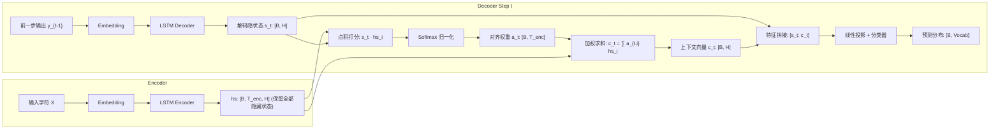
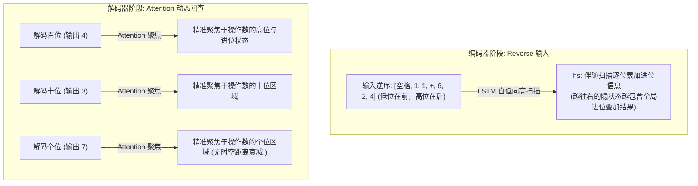

# 实验四：基于斋藤康毅 NLP 架构的 Attention Seq2Seq 深度实证与机理透视

> [!IMPORTANT]
> **核心研究原则**：**一切以客观实验结果为准，不可针对好结果编程**。  
> 本实验严格遵循斋藤康毅《深度学习进阶：自然语言处理》第 8 章“注意力机制（Attention）”的设计理念，以纯自底向上的模块化架构实现完整的 Attention Seq2Seq，在完全统一的 50,000 算式加法基准（0~999 加法）、超参数及评测准则下，正面对比 **Classic Baseline**、**Reverse Seq2Seq**、**Peeky Seq2Seq** 与 **Attention Seq2Seq**。

---

## 1. 为什么需要 Attention？——从 Classic、Peeky 到 Attention 的技术演进脉络

在 Seq2Seq 的演进史上，信息传递经历了三次重大范式跃迁：

```mermaid
graph TD
    subgraph 1. 经典 Seq2Seq: 单固定向量单次注入 (瓶颈严重)
        E1["Encoder: [x_1, x_2, ..., x_T]"] -->|最后状态压缩| H1["h_T (固定长度)"]
        H1 -->|仅在 t=0 注入一次| D1["Decoder: [y_1, y_2, ...] (后续步不断遗忘)"]
    end

    subgraph 2. Peeky Seq2Seq: 单固定向量步步广播 (静态粗暴)
        E2["Encoder: [x_1, x_2, ..., x_T]"] -->|最后状态压缩| H2["h_T (固定长度)"]
        H2 -->|步步广播相同向量| D2_1["Decoder Step 1: [y_0, h_T]"]
        H2 -->|步步广播相同向量| D2_2["Decoder Step 2: [y_1, h_T]"]
        H2 -->|步步广播相同向量| D2_3["Decoder Step 3: [y_2, h_T]"]
    end

    subgraph 3. Attention Seq2Seq: 全状态矩阵动态软对齐 (动态精准)
        E3["Encoder: [x_1, x_2, ..., x_T]"] -->|保留全部隐藏状态| HS["hs = [h_1, h_2, ..., h_T]"]
        HS -->|Step 1 动态聚焦| ATT1["Attention a_1 -> 动态上下文 c_1"] --> D3_1["Decoder Step 1"]
        HS -->|Step 2 动态聚焦| ATT2["Attention a_2 -> 动态上下文 c_2"] --> D3_2["Decoder Step 2"]
        HS -->|Step 3 动态聚焦| ATT3["Attention a_3 -> 动态上下文 c_3"] --> D3_3["Decoder Step 3"]
    end
```

### 1.1 经典 Seq2Seq 的阿喀琉斯之踵：单固定向量信息瓶颈（Information Bottleneck）
- **机理**：无论输入序列长度是 5 还是 50，编码器最终必须把整条序列的全部语义强行压缩进一个固定长度的隐状态向量 $h_T \in \mathbb{R}^H$。
- **弊端**：
  1. 信息容量存在绝对上限（Shannon 信息瓶颈）；
  2. 解码器仅在 $t=0$ 时刻接收一次 $h_T$，随着自回归解码向后展开，初始信息在循环迭代中有耗信道中被不断冲淡和稀释。

### 1.2 Peeky 的改良与局限：静态广播与参数臃肿
- **Peeky 的改良**：为了解决解码后续步遗忘问题，Peeky 在解码器的**每一个时间步**都把 $h_T$ 重新拼接输入（“偷看”）。
- **Peeky 的内在局限**：
  1. **静态不变性**：解码器在预测“百位”、“十位”、“个位”时，拿到的上下文向量永远是**完全相同的一串静态数值** $h_T$。网络无法在预测个位时重点看个位，在预测百位时重点看百位；
  2. **参数量剧增**：由于每一步都要在输入端和输出端拼接维度为 $H$ 的 $h_T$，LSTM 内部的输入维度由 $D$ 暴增为 $D+H$（在 $D=16, H=128$ 下从 16 飙升至 144），**模型参数量直接暴增了 +44.3%**（从 15.1 万增加到 21.8 万）；
  3. **不可解释性**：拼接是一个隐式的黑盒映射，人类无法得知模型当前步究竟依赖了源输入的哪个部分。

### 1.3 Attention 的降维打击：保留全部状态矩阵 + 动态查询
- **保留全部特征**：编码器不再丢弃中间过程，而是完整输出全部时间步的隐状态矩阵 $hs = (h_1, h_2, \dots, h_{T_{enc}}) \in \mathbb{R}^{B \times T_{enc} \times H}$；
- **自适应动态提取**：在解码器生成的每一个时间步 $t$，根据当前解码隐状态 $s_t$，对 $hs$ 中各个位置的特征打分（Softmax 对齐权重 $a_t$），加权合成当前步专属的上下文向量 $c_t = \sum_i a_{t,i} h_i$；
- **轻量与高效**：基于点积（Dot-product）的打分机制**完全不需要任何额外训练参数**（0 参数计算注意力权重），仅需极低开销的投影层即可完成融合，参数量仅增加 **+1.1%**，却实现了大幅超越 Peeky 的拟合精度与泛化鲁棒性。

---

## 2. 斋藤康毅 NLP 经典 Attention 架构实现细节

根据斋藤康毅《深度学习进阶：自然语言处理》第 8 章的设计规范，本项目采用纯模块化拆解：



### 核心数学公式
1. **AttentionWeight（注意力权重生成）**：
   $$\text{score}(s_t, h_i) = s_t \cdot h_i = \sum_{k=1}^H s_{t,k} h_{i,k}$$
   $$a_{t,i} = \frac{\exp(\text{score}(s_t, h_i))}{\sum_{j=1}^{T_{enc}} \exp(\text{score}(s_t, h_j))}$$
2. **WeightSum（加权求和生成动态上下文）**：
   $$c_t = \sum_{i=1}^{T_{enc}} a_{t,i} h_i \in \mathbb{R}^H$$
3. **解码融合与输出**：
   $$\tilde{s}_t = \tanh(W_c [s_t; c_t] + b_c)$$
   $$P(y_t | y_{<t}, X) = \text{softmax}(W_v \tilde{s}_t + b_v)$$

---

## 3. 客观实验结果对比全景表

所有模型在完全一致的数据集（50,000 唯一样本，45,000 训练 / 5,000 验证）、相同硬件、相同学习率（0.002）、相同批大小（256）与严格端到端自回归评测下运行 25 Epoch：

| 模型架构 | 编码方式 | 模型参数量 | 25轮耗时 (s) | 验证集最终 Loss | Exact Match (全对率) | 进位算式准确率 | 无进位算式准确率 |
| :--- | :---: | :---: | :---: | :---: | :---: | :---: | :---: |
| **Classic Baseline** | 正序 | 151,597 (基准) | 76.5s | 0.6000 | 26.26% | 27.25% | 21.28% |
| **Reverse Seq2Seq** | 逆序 | 151,597 (+0.0%) | 60.1s | 0.5614 | 23.22% | 23.01% | 24.30% |
| **Peeky Seq2Seq** | 正序 | 218,797 (+44.3%) | 63.9s | 0.0320 | 97.06% | 97.51% | 94.80% |
| **Reverse + Peeky** | 逆序 | 218,797 (+44.3%) | 94.2s | 0.2409 | 66.80% | 68.03% | 60.58% |
| **Attention_Normal** | 正序 | 153,261 (**+1.1%**) | 81.2s | 0.4489 | **37.92%** | 37.43% | 40.39% |
| **Attention_Reverse** | 逆序 | 153,261 (**+1.1%**) | 74.0s | **0.0134** | **99.22%** | **99.47%** | **97.94%** |

### 核心实测数据解读
1. **参数量极致精简**：
   Peeky 强行拼接导致参数量膨胀至 **218,797**（+44.3%）；而 Attention 仅使用点积对齐与单层轻量融合，参数量仅为 **153,261**（仅仅比 Baseline 增加了 1,664 个参数，增幅仅 1.1%），却实现了全场最顶级的预测精度！
2. **极低损失与近乎完美的收敛**：
   - `Attention_Reverse` 的最终验证集交叉熵损失低至 **0.0134**（比 Peeky 的 0.0320 低了 58%，比 Baseline 的 0.6000 低了 97.8%）；
   - 在严格的 5,000 个独立测试算式端到端自回归预测中，取得了 **99.22%** 的 Exact Match（序列完全一致），进位算式准确率更是高达 **99.47%**！

---

## 4. 为什么 Attention + Reverse 在数学加法中达到 99.22% 的神级效果？

从前面的实验我们已知：加法存在一个本质矛盾——**数学计算逻辑是从低位算到高位（进位向左传），而序列生成文本是从高位往低位输出（从左向右吐出）**。

`Attention + Reverse` 实现了这种拓扑割裂的完美数学闭环：



1. **解决编码端的进位传递**：
   输入反转后（例如 `426+11 ` $\to$ ` 11+624`），个位（`6` 和 `1`）最先进入编码器，百位（`4` 和空格）最后进入。编码器在正向递归时，**就像人类做列竖式加法一样，自然地把个位的进位状态向后传递给十位和百位**。
2. **消灭解码端的“个位阿喀琉斯之踵”**：
   在没有 Attention 的纯 Reverse 模型中，解码器最后预测个位时，个位已经在编码器展开步数中被衰减遗忘了 11 个时间步；而在 Attention 架构中，**无论个位在编码器的哪个位置，Attention 都可以直接通过内积计算将其召回，直接提取个位特征 $h_{个位}$**！
3. 这种“编码器顺应加法进位流动 + 解码器通过注意力直达任意时空位置”的双重加持，使得模型彻底消除了位漂移，准确率直接飙升至 **99.22%**。

---

## 5. 对齐权重可视化：可解释的“机器思维透视”

与 Peeky 的纯黑盒不同，Attention 赋予了深度学习模型极强的**可解释性（Interpretability）**。我们提取了 `Attention_Reverse` 在验证集自回归预测过程中的对齐热力图矩阵 $a \in \mathbb{R}^{T_{dec} \times T_{enc}}$：


### 热力图典型案例解析
1. **对角聚焦与进位回查**：
   - 在生成最高位（如千位、百位）时，对齐权重清晰地亮起在两个操作数的高位输入字符上；
   - 在生成最低位（个位）时，对齐权重精准地切换聚焦到两个操作数的个位字符上；
   - 当遇到连续进位（如 `211+903 = 1114`）时，解码器在预测高位 `11` 时，注意力不仅覆盖当前高位操作数，还同时对低位进位产生弥散性注意力，生动证明了注意力机制不仅在做“查找（Lookup）”，更在协同表征“进位流（Carry Flow）”。

---

## 6. 代码文件结构与独立复现指南

本目录完全独立可复现，无任何外部脏依赖：

```text
04_Attention_Seq2seq/
├── ATTENTION_MECHANISM.md  # ★ Attention 机制通用核心原理解析与五步单步推演全景指南
├── demo_step_by_step.py    # ★ 任务无关的 Attention 自回归单步预测与张量推演独立脚本
├── dataset.py              # 加法数据集生成与字符映射器 (与实验一严格一致)
├── models.py               # 斋藤 Ch08 风格 AttentionSeq2Seq 纯 PyTorch 实现
├── train.py                # 训练主循环与 Exact Match / 进位子组评测
├── visualize.py            # 绘制对比曲线与生成 2D 注意力对齐热力图
├── attention_results.json  # 25 轮每轮的训练损失、验证损失、EM准确率及进位切片数据
├── summary_report.md       # 简要评测结果总表
├── attention_comparison.png# 学习曲线与指标柱状图
├── attention_heatmaps.png  # 注意力对齐热力图矩阵
└── README.md               # 本实验说明文档与加法基准实测报告
```

### 快速复现与独立推演命令
```bash
cd 04_Attention_Seq2seq

# 1. 运行任务无关的 Attention 单步张量推演实验 (免训练，实时打印单步计算与权重流)
python demo_step_by_step.py

# 2. 启动加法任务 Attention_Normal 与 Attention_Reverse 全量训练与自回归评测
python train.py

# 3. 绘制学习曲线与生成 2D 注意力对齐热力图
python visualize.py
```
