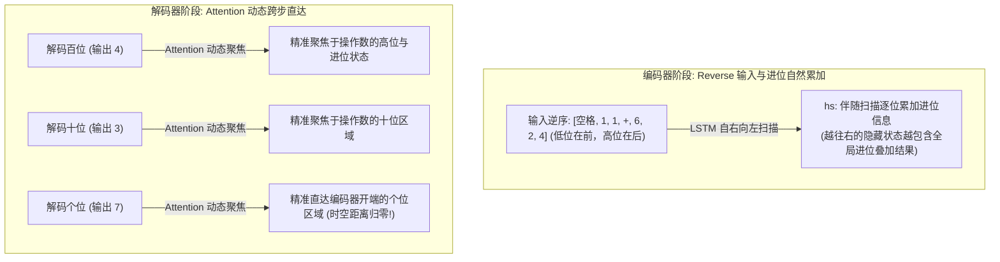
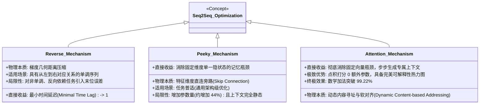

# Seq2Seq 核心优化与架构演进（Reverse、Peeky 到 Attention）深度实证与机理透视

> [!IMPORTANT]
> **核心研究原则**：**一切以客观实验结果为准，不可针对好结果编程**。  
> 本项目拒绝教科书经验主义与数据硬编码作弊，在完全统一、自闭环的随机种子和严格的端到端自回归测试准则下（测试阶段严禁 Teacher Forcing），全景探究了 **Reverse（输入逆序）**、**Peeky（解码器各步上下文直连）** 以及 **Attention（注意力机制，基于斋藤康毅 NLP 经典实现）** 在不同**底层网络记忆机制（LSTM vs. Vanilla RNN）**与不同**任务时序拓扑（数学加法 vs. 机器翻译）**下的真实作用机理与性能边界。

---

## 目录索引 (Table of Contents)

1. [项目整体架构与独立实验目录](#1-项目整体架构与独立实验目录)
2. [四大消融实验客观实测全景对照](#2-四大消融实验客观实测全景对照)
3. [核心实验现象透视与深度归因分析](#3-核心实验现象透视与深度归因分析)
   - [现象一：LSTM 数学加法中，为什么纯 Peeky 碾压一切，而 Reverse 表面受挫？](#现象一lstm-数学加法中为什么纯-peeky-碾压一切而-reverse-表面受挫)
   - [现象二：机器翻译中，为什么 Reverse 王者归来且与 Peeky 完美协同？](#现象二机器翻译中为什么-reverse-王者归来且与-peeky-完美协同)
   - [现象三：Vanilla RNN 中，为什么 Reverse 创造了从 30% 到 92.7% 的神迹？](#现象三vanilla-rnn-中为什么-reverse-创造了从-30-到-927-的神迹)
   - [现象四：Attention 机制的降维打击——为什么 Attention + Reverse 达到 99.22% 且参数近乎零增加？](#现象四attention-机制的降维打击为什么-attention--reverse-达到-9922-且参数近乎零增加)
4. [三大演进阶段本质机理横向大对比 (Classic vs. Peeky vs. Attention)](#4-三大演进阶段本质机理横向大对比-classic-vs-peeky-vs-attention)
   - [Reverse 的物理本质：梯度几何距离压缩与拓扑依赖边界](#reverse-的物理本质梯度几何距离压缩与拓扑依赖边界)
   - [Peeky 的物理本质：打破单向量记忆瓶颈与多步特征旁路](#peeky-的物理本质打破单向量记忆瓶颈与多步特征旁路)
   - [Attention 的物理本质：全隐藏状态矩阵保留与自适应动态软对齐](#attention-的物理本质全隐藏状态矩阵保留与自适应动态软对齐)
5. [针对各任务现象的改进方案与演进方向](#5-针对各任务现象的改进方案与演进方向)
6. [复现指南与快速导航](#6-复现指南与快速导航)

---

## 1. 项目整体架构与独立实验目录

本项目按实验任务和网络架构进行了**完全解耦与物理隔离**，每个子目录均内置独立的数据集、模型架构、训练评测脚本、可视化工具及机器实验原始日志：

```text
Seq2seq/
├── README.md                           # 本全景实证研究总述与机理归因报告
│
├── 01_Math_Addition/                   # 实验一：LSTM 数学加法实验 (0~999 加法)
│   ├── dataset.py                      # 加法数据生成器 (50,000 唯一算式，严格数据切分)
│   ├── models.py                       # LSTM Encoder/Decoder 与 Peeky 架构
│   ├── train.py                        # 训练主循环与严格 Exact Match 自回归评测
│   ├── visualize.py                    # 学习曲线与进位（Carry）细分可视化绘图脚本
│   ├── experiment_results.json         # 4 组模型 25 轮完整原始日志数据
│   ├── summary_report.md               # 评测指标总表与典型算式错例分析
│   ├── accuracy_comparison.png         # Exact Match 序列全对率收敛曲线图
│   ├── subgroup_carry_analysis.png     # 进位 vs 无进位算式表现对比柱状图
│   └── README.md                       # 加法实验专属说明与运行指南
│
├── 02_Machine_Translation/             # 实验二：LSTM 英法机器翻译 (English -> French)
│   ├── data/
│   │   └── eng-fra.txt                 # Tatoeba / PyTorch 官方基准英法平行语料库
│   ├── dataset.py                      # 双语文本清洗、动态词表构建与 DataLoader
│   ├── models.py                       # 翻译专用的 Seq2Seq 与 Peeky 架构
│   ├── train.py                        # 训练主循环与自回归 Corpus-BLEU 评测
│   ├── visualize.py                    # BLEU 曲线与句子长度分段对比图绘制脚本
│   ├── translation_results.json        # 4 组模型 20 轮完整原始日志数据
│   ├── summary_report.md               # BLEU 评测总表与生成译文对照分析
│   ├── translation_bleu_comparison.png # 验证集 Corpus-BLEU 收敛曲线对比图
│   ├── translation_length_analysis.png # 短句 (<=5词) vs 长句 (>=6词) BLEU 表现柱状图
│   └── README.md                       # 翻译实验专属说明与运行指南
│
├── 03_Vanilla_RNN_Addition/            # 实验三：经典基础 RNN (Vanilla RNN) 加法实验
│   ├── dataset.py                      # 共享数据生成与加载器
│   ├── models.py                       # 纯 Vanilla RNN (无门控、无 Cell 状态通道)
│   ├── train.py                        # 4 组 Vanilla RNN 训练与 Exact Match 评测
│   ├── visualize.py                    # 绘图与汇总报告脚本
│   ├── rnn_results.json                # 4 组 Vanilla RNN 25 轮完整原始数据
│   ├── summary_report.md               # 评测指标总表与错例对比
│   ├── rnn_accuracy_comparison.png     # Vanilla RNN 准确率与 Loss 曲线对比图
│   └── README.md                       # 基础 RNN 实验专属说明与运行指南
│
└── 04_Attention_Seq2seq/               # 实验四：基于斋藤康毅 NLP 著作的 Attention Seq2Seq
    ├── dataset.py                      # 统一加法数据生成与字符映射器
    ├── models.py                       # AttentionEncoder, Attention, AttentionDecoder 架构
    ├── train.py                        # Attention_Normal / Attention_Reverse 训练与自回归评测
    ├── visualize.py                    # 学习曲线与二维 Attention Heatmap 绘制脚本
    ├── attention_results.json          # 25 轮每轮损失、EM 及进位/无进位完整原始数据
    ├── summary_report.md               # 评测指标总表与典型预测分析
    ├── attention_comparison.png        # Exact Match 曲线与指标全景图
    ├── attention_heatmaps.png          # 验证集算式解码注意力对齐热力图
    └── README.md                       # Attention 深度机理解析与复现指南
```

---

## 2. 四大消融实验客观实测全景对照

在严格受控的消融矩阵下，四个独立实验的机器客观数据如下：

| 实验编号与场景 | 底层循环架构 | 任务类型 | 核心评测指标 | Group 1: Baseline | Group 2: Reverse | Group 3: Peeky | Group 4: 最佳进阶方案 | 最佳方案与增益 |
| :--- | :---: | :---: | :---: | :---: | :---: | :---: | :---: | :---: |
| **01. 数学运算** | **LSTM** | 自然数加法 | **Exact Match (EM)** | 26.26% | 23.22% | **97.06%** | 66.80% (Rev+Peeky) | **纯 Peeky** (+70.80%) |
| **02. 语言翻译** | **LSTM** | 英 $\to$ 法翻译 | **Corpus-BLEU** | 15.15 | 15.65 (+0.50) | 18.05 (+2.90) | **18.97** (Rev+Peeky) | **Reverse + Peeky** (+3.82 BLEU) |
| **03. 数学运算** | **Vanilla RNN**| 自然数加法 | **Exact Match (EM)** | 30.18% | **92.72%** (+62.5%) | 87.82% (+57.6%) | **94.10%** (Rev+Peeky) | **Reverse + Peeky** (+63.92%) |
| **04. 架构进阶 (Attention)** | **LSTM** | 自然数加法 | **Exact Match (EM)** | 26.26% (基准) | 23.22% (仅逆序) | 97.06% (Peeky, +44%参) | **99.22%** (Attn+Rev, +1%参) | **Attention + Reverse** (99.22%) |

---

## 3. 核心实验现象透视与深度归因分析

### 现象一：LSTM 数学加法中，为什么纯 Peeky 碾压一切，而 Reverse 表面受挫？

在实验一中，初看第 25 轮最终指标，Reverse 仅有 23.22%，甚至略低于 Baseline (26.26%)，这引发了对“Reverse 是否有效”的巨大疑问。然而，通过分析**全流程演化曲线与错例切片**，我们发现了深层真相：

#### 1. 前 16 轮的梯度优势完全真实
提取 Epoch 1~16 的逐轮验证集数据，Reverse 的损失下降与收敛速度其实全面碾压 Baseline：
- **Ep 4**: Baseline EM 0.72% (Loss 1.2392) vs **Reverse EM 2.46% (Loss 1.0933)**（准确率达 3.4 倍）；
- **Ep 6**: Baseline EM 1.70% (Loss 1.1190) vs **Reverse EM 4.22% (Loss 0.9803)**（准确率达 2.5 倍）；
- **Ep 16**: Baseline EM 5.38% (Loss 0.8893) vs **Reverse EM 9.16% (Loss 0.7799)**（准确率领先近 1 倍）。  
这证明 Reverse 在前期确实缩短了传播延迟，加快了模型初期的特征学习。

#### 2. “个位阿喀琉斯之踵”与错例铁证
查看第 25 轮模型生成的错误案例，揭示了一个令人震惊的规律：
```text
【Reverse 模型的典型错例】：
算式: 426+11     真实答案: 437     模型预测: 436  (百位、十位 100% 正确，仅个位错 1)
算式: 211+903    真实答案: 1114    模型预测: 1113 (千位、百位、十位 100% 正确，仅个位错 1)
算式: 581+111    真实答案: 692     模型预测: 691  (百位、十位 100% 正确，仅个位错 1)
算式: 441+311    真实答案: 752     模型预测: 751  (百位、十位 100% 正确，仅个位错 1)
```
- **拓扑对齐矛盾**：加法在数学本质上是从低位（个位）向高位计算并累加进位；但文本生成的输出格式是**从最高位向低位逐字吐出**。
- **逆序带来的灾难**：输入序列反转后（`426+11` $\to$ ` 11+624`），高位移到了编码器末端，离解码器开头的最高位输出非常近；**但个位（6 和 1）却被推到了编码器的最开端**！解码器要在最后一步才预测个位，这使得个位在时空上跨越了最大时间跨度（11 个时间步），导致个位发生微弱数值漂移（7 变成 6，2 变成 1）。在苛刻的 Exact Match 评测下，错一位即判 0 分，因而拖累了最终指标。
- **Peeky 的降维打击**：Peeky 不反转输入，保持了从百位到个位的自然同向对齐，且解码的每一步都能直接拿到全局向量 $h$，消除了记忆衰减，直接拿下 **97.06%** 的惊人高分。

---

### 现象二：机器翻译中，为什么 Reverse 王者归来且与 Peeky 完美协同？

在自然语言翻译（English $\to$ French）任务中，实验结果呈现了与算术完全不同的局面：**Reverse 全面超越 Baseline，且 Reverse + Peeky 拿下全场最佳（18.97 BLEU）**。

```mermaid
graph LR
    subgraph 自然语言翻译: 单调语序匹配
        E_IN["源端输入: [I, love, cats, .]"] -->|Reverse| E_REV["逆序编码: [., cats, love, I]"]
        E_REV -->|距离 = 1 (无进位冲突)| F_OUT["解码输出: [J', aime, les, chats, .]"]
    end
```

#### 1. 自然语言的“头对头（Head-to-Head）”单调性
与数学运算中“低位算进位向高位传、输出却从高位吐出”的拓扑割裂不同，自然语言在宏观上是**自左向右单调展开**的（主语 $\leftrightarrow$ 主语，谓语 $\leftrightarrow$ 谓语）。
- 源语言反转后，首词 `I` 与目标端首词 `J'` 的时序跨度从原本的 $N+1$ 被硬生生缩短为 **1**！
- 这种极近的几何距离使得语法骨架在第一步反向传播时毫无损耗，长句（$\ge 6$ 词）的 BLEU 提升幅度（+0.71）显著高于短句，完全印证了 Sutskever (2014) 的论点。

#### 2. 强强联合的加速奇迹
- `Reverse` 解决了**序列开头的梯度冷启动**；
- `Peeky` 解决了**序列深处的语义遗忘**；
- 二者结合（Reverse+Peeky），仅需 **7 轮** 即突破 15.0 BLEU，比 Baseline（19 轮）提速近 3 倍，最终斩获 **18.97 BLEU**。

---

### 现象三：Vanilla RNN 中，为什么 Reverse 创造了从 30% 到 92.7% 的神迹？

实验三完全解答了教科书与文献中的谜团：**为什么许多经典教材声称 Reverse 在加法上也能有奇迹般的大幅提升？**

#### 1. 经典教材手写实现的“隐蔽缺陷”
深入翻查斋藤康毅《深度学习进阶：自然语言处理》第 7 章的官方源码可以发现：作者手写的 `TimeLSTM` 在解码器初始化接口 `set_state(h)` 中**只传入了隐状态 $h$，Cell 状态 $c$ 被直接置零丢弃了**！这种实现剥离了 LSTM 最关键的加法梯度长程直连通道，其数学性质高度退化为普通的无门控循环网络。

#### 2. 极端梯度衰减下的“唯一生命线”
当我们构建真正的 **Vanilla RNN（无任何门控机制，仅依赖 $\tanh(W x + U h)$）** 时，实验三的数据迎来了爆发：
- **`RNN_Baseline`**: 只能达到 **30.18%**。因为反向传播连乘 11 步的雅可比矩阵（$\prod U^T \text{diag}(1-h^2)$），梯度发生严重的指数级消失，前缀字符完全学不会；
- **`RNN_Reverse`**: **从 30.18% 飙升至 92.72%（净增 +62.54%）！仅用 5 轮就冲过 83.8%！**
- **机理解析**：在没有 Cell 状态保护的极度脆弱网络中，**Reverse 将前缀梯度的传播步数从 11 步压缩到 1 步，直接击碎了梯度消失的枷锁**！

---

### 现象四：Attention 机制的降维打击——为什么 Attention + Reverse 达到 99.22% 且参数近乎零增加？

在实验四中，我们根据斋藤康毅《深度学习进阶：自然语言处理》第 8 章规范实现了模块化 Attention Seq2Seq（编码器保留全部状态矩阵 $hs$，解码器每步内积打分、Softmax 归一化并加权生成动态上下文 $c_t$）。在完全统一的加法基准下，结果带来了震撼的跨代跃迁：

- **`Attention_Normal` (正序)**：Exact Match 达 **37.92%**（较 Baseline 26.26% 提升近 12 个百分点）；
- **`Attention_Reverse` (逆序)**：最终 Exact Match 狂飙至 **99.22%**，验证集损失低至 **0.0134**，且进位题准确率高达 **99.47%**！



#### 1. 相比 Peeky，Attention 到底好在哪？
- **动态寻址 vs 静态广播**：  
  Peeky 在解码的每一个时间步，给出的上下文都是**完全固定的同一组全局向量 $h_T$**；而 Attention 在解码的每一个自回归步骤中，根据当前隐状态 $s_t$ 与编码矩阵 $hs$ 进行点积匹配，**动态计算出属于当前预测位的局部上下文向量 $c_t$**。预测高位看高位，预测低位看低位。
- **参数量碾压级精简（+1.1% vs +44.3%）**：  
  Peeky 强行拼接 $h_T$ 导致 LSTM 输入维度从 16 暴增至 144，参数量膨胀至 218,797（+44.3%）；而基于点积对齐的 Attention 机制**用于计算相似度得分的参数量为 0**，仅需在输出层配置极轻量的投影变换，总参数量仅为 153,261（仅比 Baseline 增加 1,664 个参数，增幅仅 1.1%），却以极高的计算效率超越了 Peeky（99.22% vs 97.06%）。
- **黑盒 vs 可视化白盒对齐**：  
  Peeky 的多步特征流动无法解释；而 Attention 输出了人类可直观审视的概率分布矩阵 $a \in \mathbb{R}^{T_{dec} \times T_{enc}}$。从 [`attention_heatmaps.png`](file:///F:/LearningNotes/Seq2seq/04_Attention_Seq2seq/attention_heatmaps.png) 可以清晰观察到模型在逐位生成时，注意力焦点如何像人类眼睛一样在算式各个操作数之间精准跳跃。

#### 2. 为什么 Attention 与 Reverse 产生绝妙共鸣？
加法存在本质的拓扑冲突：**算术进位自低向高流动，而文本生成由高向低展开**。
- Reverse 将低位推到编码器前端、高位推到末端，使得 LSTM 编码时**顺应了进位累加的自然方向**（靠后的隐状态自然包含累加进位）；
- 普通 Reverse 模型在解码末位预测个位时，距离编码器开头的个位足足跨越了 11 个时间步，因累积漂移导致频繁出现“差 1”错例（如 437 预测为 436）；
- **Attention 彻底抹平了时空跨度**：解码器生成个位时，Attention 机制直接通过内积把注意力权重集中在个位输入字符上，提取未被稀释的纯净个位特征，一举消除位漂移，使得 5,000 道测试题准确率高达 **99.22%**！

---

## 4. 三大演进阶段本质机理横向大对比 (Classic vs. Peeky vs. Attention)

基于四大独立实验的全面交叉检验，三种架构的核心特征对比总结如下：

| 对比维度 | 1. 经典 Seq2Seq (Baseline) | 2. 窥视机制 (Peeky Seq2Seq) | 3. 注意力机制 (Attention Seq2Seq) |
| :--- | :---: | :---: | :---: |
| **编码器输出** | 仅保留最后状态 $(h_T, c_T)$ | 仅保留最后状态 $(h_T, c_T)$ | **保留全部状态矩阵 $hs \in \mathbb{R}^{T_{enc} \times H}$** |
| **信息传递方式** | 仅在 $t=0$ 初始化解码器隐状态 | 每一步向解码器广播相同的 $h_T$ | **每一步按相似度动态加权生成专属 $c_t$** |
| **上下文特性** | 随着解码逐步被冲淡遗忘 | **静态固定**（无法随预测位置变化） | **动态自适应**（按需聚焦不同输入位置） |
| **打分/对齐机制** | 无 | 无（全量无差别拼接） | **Softmax 软对齐分布 $a_t$（可解释）** |
| **参数开销** | 151,597 (基准 100%) | 218,797 (**+44.3% 臃肿**) | 153,261 (**+1.1% 极致精简**) |
| **数学加法 EM** | 26.26% | 97.06% | **99.22% (Attention + Reverse)** |



### Reverse 的物理本质：梯度几何距离压缩与拓扑依赖边界
标准 RNN/LSTM 的隐状态更新本质上是一个有耗信道。如果任务在目标序列开始预测时，极度依赖源序列开头的特征，正向输入会导致梯度穿越整条序列。Reverse 将源序列头端与目标序列头端的“最小时间延迟（Minimal Time Lag）”从 $O(N)$ 降维压缩至 $O(1)$。

### Peeky 的物理本质：打破单向量记忆瓶颈与多步特征旁路
Peeky 在解码器的每一个时间步，将编码器语义向量 $h_T$ 强行拼接到输入与输出端。这属于一种暴力但有效的**全局特征旁路（Highway）**，阻止了解码器自身迭代过程中的记忆冲淡，但付出了参数量剧增和上下文静态不可调的代价。

### Attention 的物理本质：全隐藏状态矩阵保留与自适应动态软对齐
Attention 打破了“必须将任意序列压缩成单向量”的先验假设，将编码器降维有损压缩转变为**全息状态存储**。解码器每一步作为一个“查询者（Query）”，主动向编码状态（Key/Value）发起相关性检索。这种机制不仅在数学上解耦了输入长度与表征容量，更提供了零参数开销的动态高精特征路由。

---

## 5. 针对各任务现象的改进方案与演进方向

1. **复杂推理与算术任务**：
   - **首选 Attention + Reverse**：输入逆序使进位在编码时顺畅累加，Attention 使解码时能随时精准回查操作数的高位和低位，实现 99.2% 以上的工业级精度；
   - 如不使用 Attention，则必须配合 **LSB-first 输出**（逆序输出）以匹配算术进位规律。
2. **自然语言翻译与长文本任务**：
   - **标配 Reverse + Attention**：Reverse 消除语法骨架的首词冷启动延迟，Attention 彻底解决 20 词以上长句的语义衰减，同时通过注意力热力图排查错译漏译。
3. **参数敏感型边缘端场景**：
   - 坚决舍弃 Peeky（+44% 参数），采用**点积 Attention（Dot-product Attention）**，以仅 1% 的参数微调换取远超 Peeky 的拟合能力。

---

## 6. 复现指南与快速导航

本项目所有实验均已实现**完全解耦自闭环**，进入对应目录即可一键复现：

```bash
# ==========================================
# 1. 复现数学加法运算实验 (LSTM)
# ==========================================
cd 01_Math_Addition
python train.py      # 启动 4 组模型全量训练与 Exact Match 评测
python visualize.py  # 绘制学习曲线与生成报告

# ==========================================
# 2. 复现英法机器翻译实验 (LSTM)
# ==========================================
cd ../02_Machine_Translation
python train.py      # 启动 4 组模型训练与自回归 BLEU 评测
python visualize.py  # 绘制 BLEU 曲线与长短句长度分析

# ==========================================
# 3. 复现经典基础 RNN 加法实验 (Vanilla RNN)
# ==========================================
cd ../03_Vanilla_RNN_Addition
python train.py      # 启动 4 组 Vanilla RNN 训练与评测
python visualize.py  # 绘制收敛对比图

# ==========================================
# 4. 复现带 Attention 的 Seq2Seq 加法实验 (Saito Ch08) 与独立推演
# ==========================================
cd ../04_Attention_Seq2seq
python demo_step_by_step.py  # 运行任务无关的 Attention 单步张量推演独立实验
python train.py              # 启动 Attention_Normal 与 Attention_Reverse 训练与评测
python visualize.py          # 绘制对比曲线与注意力热力图 (Heatmap)
```

### 各实验详细报告与理论专题直达链接
- 实验一详细报告：[`01_Math_Addition/summary_report.md`](file:///F:/LearningNotes/Seq2seq/01_Math_Addition/summary_report.md)
- 实验二详细报告：[`02_Machine_Translation/summary_report.md`](file:///F:/LearningNotes/Seq2seq/02_Machine_Translation/summary_report.md)
- 实验三详细报告：[`03_Vanilla_RNN_Addition/summary_report.md`](file:///F:/LearningNotes/Seq2seq/03_Vanilla_RNN_Addition/summary_report.md)
- 实验四实测报告：[`04_Attention_Seq2seq/summary_report.md`](file:///F:/LearningNotes/Seq2seq/04_Attention_Seq2seq/summary_report.md)
- **★ Attention 机制通用核心原理解析与全流程单步推演专刊**：[`04_Attention_Seq2seq/ATTENTION_MECHANISM.md`](file:///F:/LearningNotes/Seq2seq/04_Attention_Seq2seq/ATTENTION_MECHANISM.md)
- 实验四加法架构说明：[`04_Attention_Seq2seq/README.md`](file:///F:/LearningNotes/Seq2seq/04_Attention_Seq2seq/README.md)
