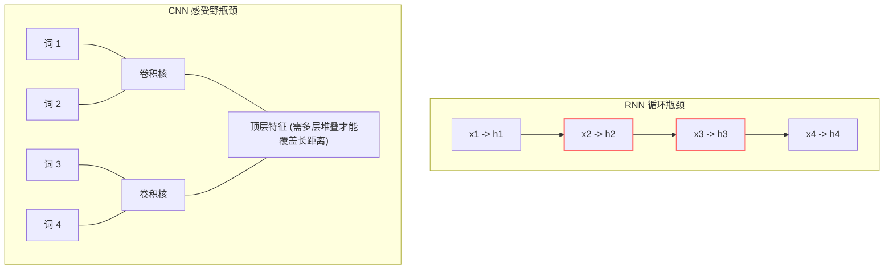
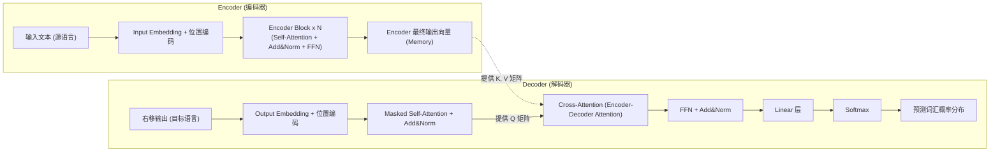
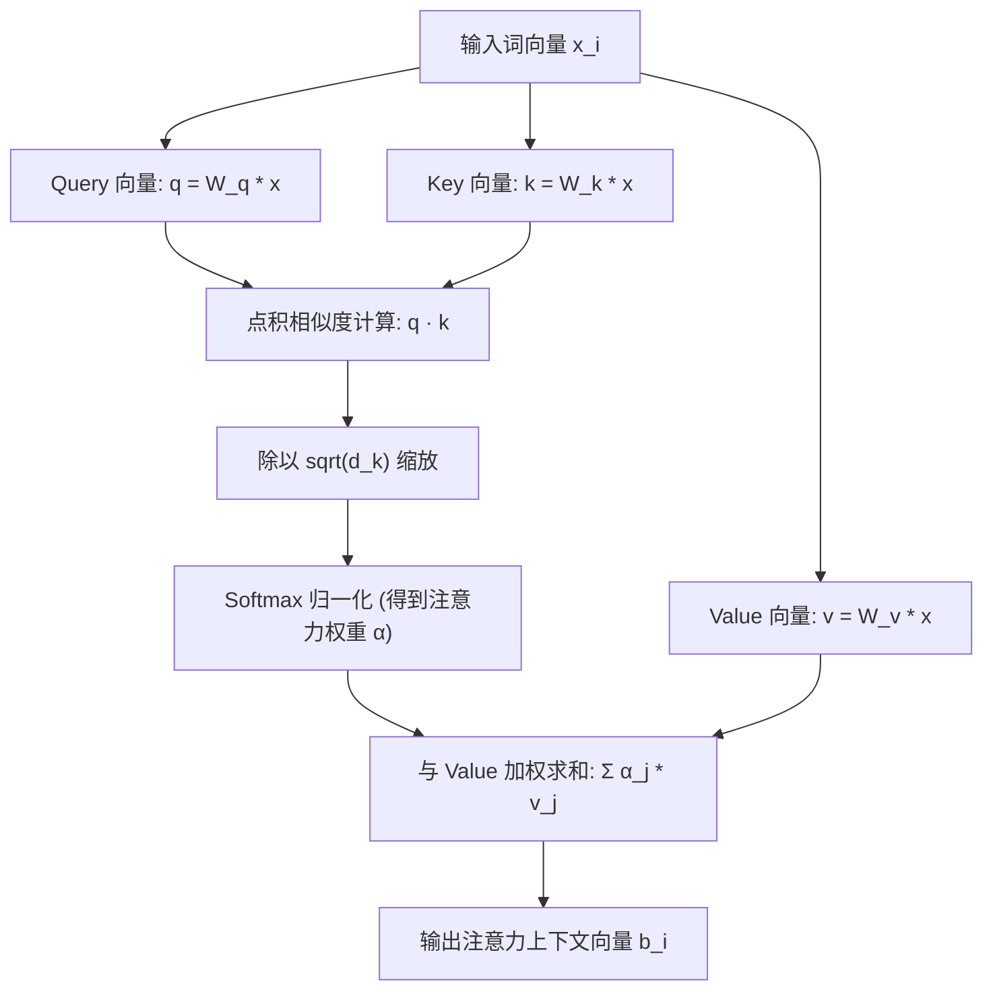
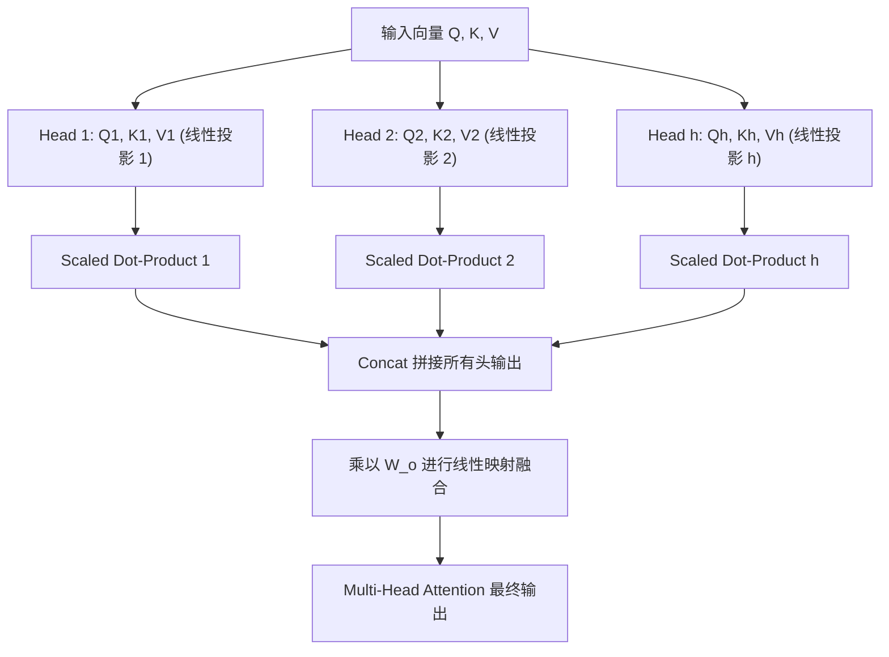
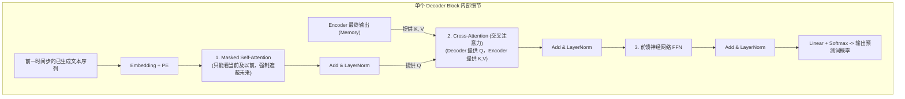

# Transformer 架构核心详解 (图解与李宏毅课程全景笔记)

*本笔记严格整合了李宏毅 (Hung-yi Lee) 教授的经典课程《Transformer: Seq2seq model with "Self-attention"》与知乎专栏“初识CV”的《Transformer模型详解（图解最完整版）》，对 Transformer 的每个核心模块进行公式级、图解级、矩阵变换级的全景还原。*

---

## 📌 导言与背景：为什么必须淘汰传统序列模型？

在 Transformer（论文《Attention Is All You Need》, Vaswani et al., 2017）出现之前，序列处理（如机器翻译、文本生成）的主流方案是 **RNN（循环神经网络，含 LSTM / GRU）** 和 **CNN（卷积神经网络）**。

### 1. RNN 的死穴：不可并行计算 (Hard to Parallel)
*   **计算串行依赖**：RNN 计算时刻 $t$ 的隐藏状态 $h_t$，必须等待时刻 $t-1$ 的隐藏状态 $h_{t-1}$ 计算完毕：
    $$h_t = f(h_{t-1}, x_t)$$
*   **硬件失配**：即使现代 GPU 拥有数万个计算核心，面对 RNN 也只能串行排队等待，算力利用率极低。
*   **长程记忆衰减与梯度消失**：虽然 LSTM 引入了门控机制（Forget Gate, Input Gate, Output Gate），但在序列长度达到数百上千时，早期信息依然会严重衰减。

### 2. CNN 的妥协与局限：感受野受限 (Receptive Field)
*   为了解决 RNN 并行度低的问题，曾有研究尝试用 **CNN（如 ByteNet, ConvS2S）** 替代 RNN 处理序列。
*   **优势**：卷积核可以全序列并行滑动计算。
*   **劣势**：单个卷积核的“感受野”是局部的（如核大小为 3 时只能看到前后 3 个词）。要捕捉序列首尾两个相距 100 个 Token 的词之间的关联，必须堆叠数十层甚至上百层卷积（通过类似膨胀卷积或树状结构扩大感受野），模型变得异常笨重。

### 3. Transformer 的终极突破：自注意力 (Self-Attention)
*   **全局一步直达**：序列中任何两个 Token，无论相距多远，交互距离永远为 $O(1)$。
*   **天然全并行**：放弃了循环机制，整个序列的所有词向量直接打包成矩阵，送入 GPU 进行矩阵乘法并行推演。

---

## 🏛️ Transformer 宏观宏观架构全览 (Encoder-Decoder)

Transformer 遵循经典的 **Seq2Seq（编码器-解码器）** 框架：

*   **Encoder 端**：输入由一系列 Token 组成，负责将整个输入序列压缩、抽象为高阶连续语义表征矩阵。
*   **Decoder 端**：自回归（Autoregressive）运行，每一次根据前面已经生成的词和 Encoder 输出的记忆矩阵，预测下一个词。

---

## 🧱 核心模块 1：输入编码与位置编码 (Embedding & Positional Encoding)

### 1.1 词嵌入 (Input Embedding)
*   通过词表字典将输入的 Token 整数 ID（如词表大小 $V=30000$）转换为连续的稠密向量（维度为 $d_{model}$，通常原论文中 $d_{model}=512$）。
*   在 Transformer 中，通常会将 Embedding 矩阵乘以缩放系数 $\sqrt{d_{model}}$，目的是让 Embedding 的数值尺度与后续的位置编码数值尺度保持平衡。

### 1.2 为什么必须引入位置编码 (Positional Encoding)？
*   **自注意力机制的置换不变性 (Permutation Invariance)**：
    Self-Attention 的核心是对全序列做加权求和。如果把输入的句子 `“我 喜欢 你”` 打乱成 `“你 喜欢 我”`，在没有额外信息的情况下，Self-Attention 算出来的每一个词的注意力分布值完全相同，没有任何顺序区分能力。
*   因为 Transformer 彻底丢弃了 RNN 的天然时间步推进机制，**必须人为把“每个词在句子中的绝对/相对位置”硬编码成数值向量注入给模型**。

### 1.3 正弦/余弦位置编码 (Sinusoidal Positional Encoding)
论文采用了非训练的、基于不同频率正弦和余弦函数的绝对位置编码：

$$PE_{(pos, 2i)} = \sin\left(\frac{pos}{10000^{\frac{2i}{d_{model}}}}\right)$$
$$PE_{(pos, 2i+1)} = \cos\left(\frac{pos}{10000^{\frac{2i}{d_{model}}}}\right)$$

*   $pos$：词在序列中的绝对位置下标（$pos = 0, 1, 2, \dots, \text{seq\_len}-1$）。
*   $i$：特征向量中的维度索引（$i \in [0, \frac{d_{model}}{2}-1]$）。
*   $2i$ 对应偶数维度（使用 $\sin$），$2i+1$ 对应奇数维度（使用 $\cos$）。

#### 💡 数学设计背后的天才构想：
1. **波长从 $2\pi$ 到 $10000 \cdot 2\pi$ 形成几何级数变化**：低维维度周期极短（像二进制的最低位迅速翻转），高维维度周期极长（像高位缓慢变化），每一个位置的 $PE_{pos}$ 向量在几何空间中都是唯一的全局坐标。
2. **便于学习相对位置线性变换**：根据三角函数和角公式：
   $$\sin(\alpha + \beta) = \sin(\alpha)\cos(\beta) + \cos(\alpha)\sin(\beta)$$
   $$\cos(\alpha + \beta) = \cos(\alpha)\cos(\beta) - \sin(\alpha)\sin(\beta)$$
   对于任意固定的偏移量 $k$，位置 $pos + k$ 的编码可以被表示为位置 $pos$ 处编码的**线性变换**（即存在一个只与 $k$ 相关的线性变换矩阵 $M_k$ 使得 $PE_{pos+k} = M_k \cdot PE_{pos}$），这使得模型极易学习到词与词之间的相对距离。
3. **为什么相加而不是拼接？**
   在工程实现中是直接相加：$X = \text{Embedding} + PE$。
   *   直觉上拼接似乎更干净，但拼接会使输入维度直接翻倍成 $2 \times d_{model}$，显著增加后续投影矩阵的参数量。
   *   高维空间具有极高的正交稀疏性（512 维的高维空间极其空旷），Embedding 与 PE 相加后，各自的特征子空间并没有严重互相污染，模型完全有能力在后续的线性投影中将它们解耦剥离出来。

---

## ⚡ 核心模块 2：自注意力机制 (Self-Attention) 深度推演

自注意力机制是 Transformer 的绝对灵魂。

### 2.1 三大核心角色：Query, Key, Value 的物理本质
每个输入向量 $a^i$ 经过三个独立的线性权重矩阵乘法，分别投影为三个不同视角的向量：
1. **$q^i = W^q a^i$ (Query, 查询向量)**：代表“当前这个词想要寻找什么样的相关信息”（发起搜索的搜索词）。
2. **$k^i = W^k a^i$ (Key, 键向量)**：代表“当前这个词身上具备什么样的特征标识，以供其他词匹配”（待检索的索引标签）。
3. **$v^i = W^v a^i$ (Value, 值向量)**：代表“如果当前词被选中匹配成功，它能向外贡献的最真实、核心的信息内容”（实际携带的数据内容）。

### 2.2 点积注意力计算四步走 (Scaled Dot-Product Attention)

#### 第一步：计算注意力相关性得分 (Dot-Product)
计算词 $i$ 的 Query 与序列中每一个词 $j$ 的 Key 的内积：
$$\alpha_{i, j} = q^i \cdot k^j$$
内积在几何上反映了两个向量的投影夹角余弦与长度积，内积越大，代表两者语义相关性越高。

#### 第二步：尺度缩放 (Scale by $\frac{1}{\sqrt{d_k}}$)
$$\text{Scaled Score} = \frac{q^i \cdot k^j}{\sqrt{d_k}}$$
其中 $d_k$ 为 Key 向量的维度（在基础版 Transformer 中 $d_k = d_{model} / h = 512 / 8 = 64$）。

> ⚠️ **深度考点：为什么必须除以 $\sqrt{d_k}$？（李宏毅与原论文的核心论证）**
> 假设 $q$ 和 $k$ 的各个分量都是独立的随机变量，均值为 $0$，方差为 $1$。
> 那么它们的点积 $q \cdot k = \sum_{m=1}^{d_k} q_m k_m$ 的均值为 $0$，**方差则会放大到 $d_k$**（标准差为 $\sqrt{d_k}$）。
> 当向量维度 $d_k$ 很大时（例如 64），点积结果的绝对值会变得极大，导致向量落入 $\text{Softmax}$ 函数的**两极饱和区**。在饱和区内，Softmax 的局部导数极度趋近于 $0$（产生严重梯度弥散），模型将无法反向传播训练！
> 除以 $\sqrt{d_k}$ 能强行将点积方差拉回 $1$，确保梯度处于最灵敏的区域。

#### 第三步：Softmax 归一化
$$\hat{\alpha}_{i, j} = \frac{\exp\left(\frac{q^i \cdot k^j}{\sqrt{d_k}}\right)}{\sum_{k'} \exp\left(\frac{q^i \cdot k^{k'}}{\sqrt{d_k}}\right)}$$
将全序列的得分压缩为非负且总和为 $1$ 的注意力概率分布权重。

#### 第四步：加权求和聚合 (Weighted Sum)
$$b^i = \sum_{j} \hat{\alpha}_{i, j} v^j$$
将所有词的 Value 向量根据注意力权重累加，得到包含了全局动态语境的最新表征 $b^i$。

### 2.3 矩阵形式的全并行推演 (GPU 执行真相)
在实际工程实现中，没有任何 `for` 循环，全部通过矩阵乘法并发完成：

$$\begin{aligned}
Q &= I \cdot W^q \quad (N \times d_k) \\
K &= I \cdot W^k \quad (N \times d_k) \\
V &= I \cdot W^v \quad (N \times d_v)
\end{aligned}$$

终极标准公式：
$$\text{Attention}(Q, K, V) = \text{softmax}\left(\frac{Q K^T}{\sqrt{d_k}}\right) V$$

*   $Q K^T$ 维度为 $(N \times d_k) \times (d_k \times N) = (N \times N)$，这就是所谓的 **Attention Map（注意力矩阵）**。
*   $\text{softmax}(Q K^T / \sqrt{d_k})$ 仍为 $(N \times N)$。
*   再乘以 $V (N \times d_v)$，输出结果维度为 $(N \times d_v)$。

---

## 🔀 核心模块 3：多头注意力机制 (Multi-Head Attention)

如果只有一组 $Q, K, V$，模型只能在一种注意力视角下寻找关联（比如只关注了语法主谓宾结构）。

### 3.1 拆分与多子空间映射
1. 将原始维度 $d_{model}=512$ 投影到 $h=8$ 个独立的子空间中，每个头的子向量维度为 $d_k = d_{model} / h = 64$。
2. 每个 head $i$ 拥有专属的投影矩阵 $W_i^Q, W_i^K, W_i^V$：
   $$\text{head}_i = \text{Attention}(Q W_i^Q, K W_i^K, V W_i^V)$$
3. 不同的头各司其职：
   *   有的头专注捕捉**短距离邻近词关系**（类似局部 CNN）；
   *   有的头专注捕捉**跨句子的长距离指代关系**（如跨段落的“他”指代谁）；
   *   有的头专注捕捉**同义词、逻辑并列关系**。

### 3.2 拼接与融合输出 (Concat & Linear)
计算完毕后，将 8 个头的输出在特征维度进行横向物理拼接：
$$\text{MultiHead}(Q, K, V) = \text{Concat}(\text{head}_1, \dots, \text{head}_h) W^O$$
*   拼接后的维度为 $h \times d_v = 8 \times 64 = 512$。
*   最后再乘以一个统一的混合权重矩阵 $W^O \in \mathbb{R}^{512 \times 512}$，完成特征的跨头融合。

---

## 🔄 核心模块 4：残差连接与层归一化 (Add & LayerNorm)

在 Encoder 和 Decoder 的每一个子层（Self-Attention 或 FFN）之后，都必须经过 **Add & Norm** 结构：
$$\text{Output} = \text{LayerNorm}(x + \text{SubLayer}(x))$$

### 4.1 残差连接 (Residual Connection, "Add")
*   借鉴了计算机视觉著名的 ResNet 思想。
*   公式：$x + \text{SubLayer}(x)$。
*   **核心目的**：在反向传播计算梯度时，残差路径提供了一条无衰减的高速公路（导数项包含恒等常数 $+1$），彻底根治了深度模型在层数加深（如堆叠数十层 Transformer）时的**梯度弥散 (Gradient Vanishing)** 难题。

### 4.2 层归一化 (Layer Normalization, "Norm")
将隐层特征向量归一化为均值为 0、方差为 1 的分布，并赋予可学习的缩放参数 $\gamma$ 与偏置参数 $\beta$：
$$\mu = \frac{1}{d} \sum_{i=1}^d x_i, \quad \sigma^2 = \frac{1}{d} \sum_{i=1}^d (x_i - \mu)^2$$
$$\hat{x}_i = \frac{x_i - \mu}{\sqrt{\sigma^2 + \epsilon}}, \quad y_i = \gamma \hat{x}_i + \beta$$

> 💡 **深度考点：为什么 NLP 必须用 LayerNorm 而坚决不用 BatchNorm？**
> *   **BatchNorm (批归一化)**：沿着 Batch 维度计算均值和方差（跨样本计算同一个特征维度的统计量）。
>     *   在 NLP 中，每个句子的实际长度完全不一致（Padding 填充了大量无意义的 0），导致 Batch 维度极度不稳定，长短句混合后统计量严重失真；
>     *   推理阶段当 Batch Size=1 时，BatchNorm 无法统计单样本方差，依赖全局移动平均，但在变长文本下泛化极差。
> *   **LayerNorm (层归一化)**：针对**单条样本自身的所有隐藏维度特征**计算均值和方差，完全独立于其他样本和批次大小。无论句子长短，每一句内部的 Token 均能获得纯净的规范化，非常契合动态序列。

---

## ⚙️ 核心模块 5：前馈神经网络 (Feed-Forward Networks, FFN)

每个注意力层之后都会紧跟一个逐位置（Position-wise）的前馈全连接网络：
$$\text{FFN}(x) = \max(0, x W_1 + b_1) W_2 + b_2$$

*   **升维再降维的瓶颈结构**：
    *   第一层线性变换将特征维度从 $d_{model}=512$ 暴增 4 倍至 $d_{ff}=2048$，经过 ReLU（或现代的 GELU/SwiGLU）非线性激活函数；
    *   第二层线性变换再将维度从 $2048$ 压缩投影回 $512$。
*   **物理意义**：Self-Attention 本质只是在做序列内各词特征的“动态加权路由”（只改变特征在不同词之间的分配组合，不产生新概念），而 FFN 则是非线性特征变换的主力军，负责**记忆与加工具体的世界知识与高阶非线性概念**。

---

## 🎯 核心模块 6：解码器机制 (Decoder) 的三大独特差异

Decoder 结构看似与 Encoder 类似，但为了自回归生成的因果性，存在三大致命的不同点：

### 6.1 差异一：掩码自注意力机制 (Masked Self-Attention)
*   **问题所在**：在训练阶段，为了实现高速并行，目标句子的所有单词（如 `“我 是 学生”`）是一次性全部喂给 Decoder 的。如果不做限制，Decoder 在预测 `“我”` 的下一个词时，Self-Attention 就会直接通过全局注意力偷看到后面紧跟的 `“是”` 和 `“学生”`，造成严重**信息泄露 (Data Leakage)**。
*   **解法：上三角因果遮蔽 (Causal Mask)**：
    在计算注意力得分矩阵后、进行 Softmax 之前，将注意力矩阵右上角（表示未来时间步的索引位置）的数值强制替换为负无穷大 $-\infty$：
    $$A_{\text{masked}} = A + M, \quad M_{i,j} = \begin{cases} 0, & j \le i \\ -\infty, & j > i \end{cases}$$
    因为 $e^{-\infty} = 0$，经过 Softmax 之后，未来所有词的注意力权重被彻底锁定为 $0$。

### 6.2 差异二：交叉注意力 (Cross-Attention / Encoder-Decoder Attention)
这是连通编码器与解码器的生命之桥：
*   **Query ($Q$)**：来自 Decoder 前一层的掩码自注意力输出（代表“当前目标语言生成到这一步，我下一步想要什么”）。
*   **Key ($K$) 与 Value ($V$)**：**全部来自于 Encoder 最终输出的高阶记忆表征矩阵**（代表“源语言输入文本提供的全量信息字典”）。
*   **作用**：让解码器生成的每一个词，都能根据自身的需要，动态回溯源语言句子中最相关的片段（如生成英文 "apple" 时，对齐回溯中文句子中的“苹果”）。

### 6.3 差异三：自回归输出头 (Linear + Softmax)
Decoder 最顶层的隐层向量通过一个线性映射层，投影到与词表大小 $V$ 等同的超大向量（Logits），再通过 Softmax 转为词表各个词的概率，采用**贪婪搜索 (Greedy Search)** 或 **束搜索 (Beam Search)** 解码输出最终的文本。

---

## 📈 核心模块 7：训练与推理的范式差异

| 维度 | 训练阶段 (Training) | 推理阶段 (Inference) |
| :--- | :--- | :--- |
| **计算模式** | **完全并行 (Non-autoregressive 并行前向)** | **串行自回归 (Autoregressive 逐字循环)** |
| **输入喂入方式** | 借助 **Teacher Forcing**，直接将真实目标标签整体右移一位输入 | 每一个时刻只能输入自己上一时刻真正预测出来的词 |
| **掩码机制** | 强依赖 **Causal Mask** 防止偷看未来 | 天然无需 Mask，因为未来词根本还没生成出来 |
| **速度表现** | 矩阵吞吐速度极快 | 极慢（受限于输出长度的逐步循环生成） |

*   **暴露偏差 (Exposure Bias)**：训练时由于有 Teacher Forcing 保护，输入始终是完美的真实标签；而在实际推理中，一旦某一步预测错误，这个错误会被作为下一轮的输入持续传递，导致整句崩溃。现代方法通过 Scheduled Sampling 或微调来缓解此问题。

---

## 🧠 总结：Transformer 核心架构记忆骨架

1. **输入级**：$X = \text{Embedding} + \text{PE}$（依靠三角函数频率唯一坐标赋予序列顺序感知）。
2. **编码级**：堆叠 $N$ 层 `[Multi-Head Self-Attention -> Add & Norm -> FFN -> Add & Norm]`。
3. **交互级**：解码器中间层通过 Cross-Attention，以自身为 $Q$，吸收 Encoder 产出的 $K$ 和 $V$。
4. **防偷窥**：解码器底层通过 $-\infty$ 因果 Mask 斩断未来信息流。
5. **归一法则**：坚决使用 LayerNorm 避免序列变长带来的统计漂移；除以 $\sqrt{d_k}$ 捍卫梯度反向传播。
