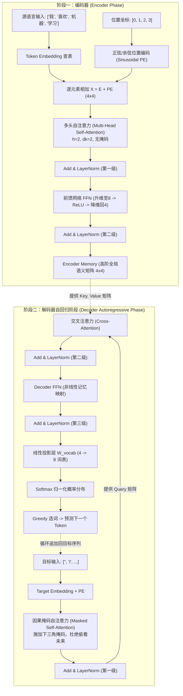

# WhiteBox Transformer: 架构全景白盒透视学习系统

> 遵循工业级现代标准模块化设计，对 Transformer（Vaswani et al., 2017）的每一个核心组件进行张量级、公式级与微观矩阵级的全透明推演。

---

## 📌 项目定位与设计哲学

绝大多数深度学习教程和开源代码将注意力机制、残差连接和归一化封装在深不可测的 PyTorch `nn.Module` 黑盒中。初学者常常陷入公式与工程代码断层的困惑。

**WhiteBox Transformer 专为透视底层机制而设计：**
1. **零强制第三方依赖**：底层矩阵运算、Softmax、LayerNorm、多头切分与 Causal Mask 全部使用 Python 原生数学实现，无需额外配置复杂环境，任意 Python 环境均可秒级运行。
2. **主动探针交互 (Active Probing Prompt)**：系统每推进一步，均先行输出直观的物理设计哲学与严密的数学公式，并**主动询问用户**是否展开当前步骤的具体计算过程与数值张量。
3. **真实端到端闭环**：不仅推演 Encoder，更完整实现了包含 **Masked Self-Attention（因果掩码自注意力）**、**Cross-Attention（编解码交互交叉注意力）** 与 **词表 Softmax 自回归生成** 的完整 Decoder 流程。

---

## 🏛️ 系统架构全览 (Seq2Seq Transformer Lens)



---

## 📂 项目结构规范

严格遵循与父目录 `RAG/whitebox_rag` 对齐的模块化工业设计：

```bash
whitebox_transformer/
├── main.py               # 命令行交互式主程序入口
├── requirements.txt      # 依赖声明 (rich 可选美化支持)
├── README.md             # 深度架构说明与设计文档
└── src/
    ├── __init__.py       # 包初始化
    ├── config.py         # 词表、超参数与确定性初始权重矩阵
    ├── math_ops.py       # 纯原生线性代数库 (Matmul, Softmax, LayerNorm, Causal Mask)
    ├── visualizer.py     # 终端白盒看板、张量渲染与字符热力图 (支持 Rich 与 ANSI 降级)
    ├── embedding.py      # 词嵌入 (Embedding) 与位置编码 (PE) 及相加 vs 拼接论证
    ├── attention.py      # 缩放点积、多头注意力、因果掩码与交叉注意力
    ├── encoder.py        # 编码器复合层 (MHA + Add&Norm + FFN)
    ├── decoder.py        # 解码器层 (Masked MHA + Cross-Attn + FFN + Linear Head)
    └── pipeline.py       # 端到端 Seq2Seq 自回归翻译推理流水线
```

---

## ⚡ 核心数学原理与深度考点透视

### 1. 为什么除以 $\sqrt{d_k}$？（李宏毅教授核心考点）
* **方差膨胀问题**：设 $q, k \in \mathbb{R}^{d_k}$ 各分量独立同分布，均值 0，方差 1。
  点积 $q \cdot k = \sum_{m=1}^{d_k} q_m k_m$ 的均值为 0，**方差膨胀至 $d_k$**（标准差为 $\sqrt{d_k}$）。
* **梯度消失危机**：当 $d_k$ 较大（如 64）时，点积绝对值极大，进入 $\text{Softmax}$ 的**两极饱和区**（输出极度接近 1 或 0）。在饱和区内局部导数趋向于 0，反向传播遭遇严重的梯度消失。
* **缩放重置**：除以 $\sqrt{d_k}$ 使得方差稳定归一为 1，确保数值落在 Softmax 导数最敏感、梯度流动最健康的区间。

### 2. 为什么位置编码直接逐元素相加 ($X + PE$) 而不是拼接？
* **代数等价性**：如果将词向量与位置独热向量拼接再乘以权重 $[W_{tok}; W_{pos}]$，展开后等于 $e_{tok} W_{tok} + e_{pos} W_{pos}$，在数学上等价于“词嵌入 + 可学习位置嵌入”。
* **直接相加的优势**：
  1. 拼接会导致输入维度变为 $D + N$，使后续所有注意力矩阵参数量随句长激增。
  2. 在 $D=512$ 的高维稀疏空间中，各子空间天然高度正交，相加并不会混淆词义与位置，后续线性层能够轻松解耦。
  3. 原版正弦/余弦编码利用三角和角公式让相对位置变换成为简单的线性旋转。

### 3. 多头注意力 (Multi-Head) 为什么没有增加总计算量？
* 设序列长度为 $N$，维度为 $D$，头数为 $h$，每个头维度 $d_k = D / h$。
* 单头点积复杂度：$O(N^2 \cdot D)$。
* 多头点积复杂度：$h \times O(N^2 \cdot \frac{D}{h}) = O(N^2 \cdot D)$。
* **总浮点运算量 (FLOPs) 完全等价**，但多头让模型能在不同子空间中并行捕获不同视角的依赖关系（如紧邻修饰、跨句指代、情感指向等）。

### 4. 为什么解码器必须施加因果掩码 (Causal Mask)？
* 在自回归生成中，第 $t$ 个词只能看到前 $t-1$ 个已经生成的词。
* 在训练时为了并行，我们将整个目标句子一次性送入模型。如果不掩盖未来 Token，模型就会在自注意力中“作弊”直接复制后文答案。
* 通过在上三角注意力得分中加入 $-\infty$，经过 Softmax 之后，未来位置的权重被严格归零。

### 5. 编解码交叉注意力 (Cross-Attention) 的维度解耦奇迹
* Query 来自 Decoder 当前状态：$Q \in \mathbb{R}^{M \times D}$（$M$ 为目标语言长度）。
* Key & Value 来自 Encoder 最终 Memory：$K, V \in \mathbb{R}^{N \times D}$（$N$ 为源语言长度）。
* 点积得分矩阵：$Q K^T \in \mathbb{R}^{M \times N}$。
* 与 Value 相乘：$\text{Softmax}(Q K^T / \sqrt{d_k}) \cdot V \in \mathbb{R}^{M \times D}$。
* **输出维度依然严格为 $(M, D)$**，与源句长度 $N$ 完全无关，实现了源语言与目标语言句子长度的完全解耦。

---

## 🚀 快速启动指南

### 方式一：直接在 Transformer 根目录运行
```powershell
cd F:\LearningNotes\Transformer
python main.py
### 方式一：🌟 启动可视化网页端 (最推荐，视觉化交互体验)
```powershell
# 在根目录直接运行 (自动唤起默认浏览器至 http://localhost:8000)
python run_web.py

# 或者直接在文件管理器中双击打开:
# F:\LearningNotes\Transformer\whitebox_transformer\web\index.html
```

### 方式二：终端 CLI 交互模式
```powershell
cd F:\LearningNotes\Transformer
python main.py
```

### 交互主菜单功能速查：
* **[1] 🌟 端到端 Seq2Seq 全流程推演**：演示从中文 `["我", "喜欢", "机器", "学习"]` 到逐步自回归预测出完整英文 `["I", "love", "machine", "learning", "<EOS>"]` 的全闭环！
* **[2] 🏛️ 深入透视【编码器 Encoder】**：查看词嵌入、正弦余弦 PE、多头自注意力、Add & LayerNorm 与 FFN。
* **[3] 🎭 深入透视【解码器 Decoder】**：查看因果掩码自注意力、交叉注意力以及信息如何在编解码端流动。
* **[4] 🎯 深入透视【输出生成层】**：查看 Logits 投影、全词表 Softmax 概率分布榜与贪婪决策。
* **[5] 📐 理论专题透视与数学证明**：包含方差膨胀、FLOPs 等价性、LayerNorm 优势等四大核心专题。
