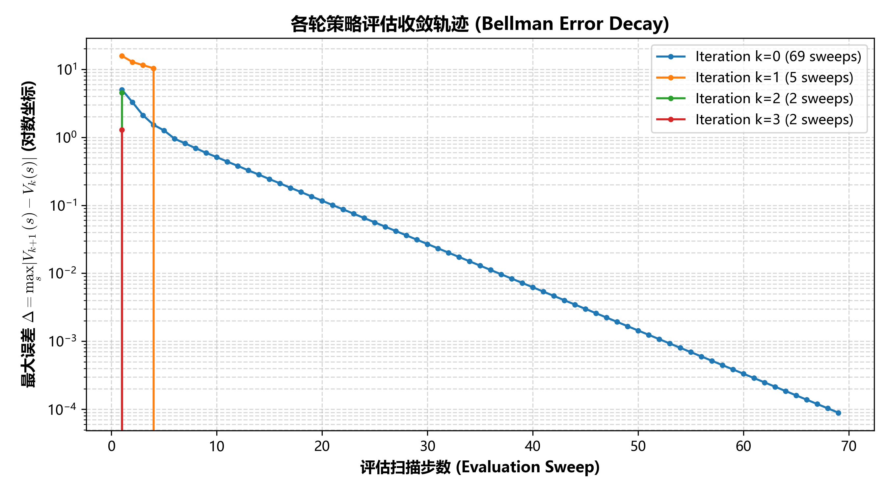
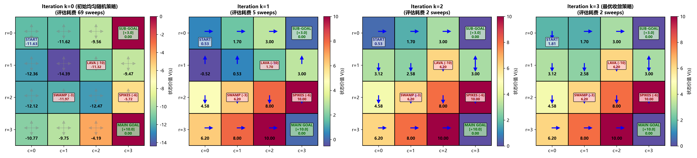

# 马尔可夫决策过程与经典动态规划 (MDP & Dynamic Programming)

> **专题归属**：`RL_Foundations` 核心学习体系  
> **专题目录**：`01_MDP_Dynamic_Programming`  
> **定位与目标**：强化学习基石理论：环境数学建模（MDP 五元组）、贝尔曼期望与最优方程、策略评估 (Policy Evaluation)、策略迭代 (Policy Iteration, PI) 与价值迭代 (Value Iteration, VI)，以及折扣因子 Gamma 对未来眼界的影响。

---

## 目录结构导航

```
01_MDP_Dynamic_Programming/
├── README.md               # [当前文档] 专题学习与运行导航
├── docs/                   # 理论讲义与详尽实验分析报告 (*.md)
├── src/                    # 核心算法实现与绘图组件 (*.py)
├── experiments/            # 独立可执行的实验脚本 (*.py)
├── logs/                   # 真实实验运行输出与数值日志 (*.txt, *.log)
└── images/                 # 出版级高清图表、动态动画与大盘 (*.png, *.gif)
```

---

## 1. 核心理论讲义 (Docs)
- [`MDP_Architecture_Master.md`](docs/MDP_Architecture_Master.md)

## 2. 算法源码 (Source Code)
- [`grid_world.py`](src/grid_world.py)
- [`policy_iteration.py`](src/policy_iteration.py)
- [`value_iteration.py`](src/value_iteration.py)
- [`visualizer.py`](src/visualizer.py)

## 3. 实验脚本 (Experiments)
- [`exp1_dynamic_programming.py`](experiments/exp1_dynamic_programming.py)
- [`exp3_gamma_comparison.py`](experiments/exp3_gamma_comparison.py)
- [`run_experiment.py`](experiments/run_experiment.py)
- [`run_gamma_comparison.py`](experiments/run_gamma_comparison.py)

## 4. 真实运行日志 (Logs)
- [`experiment_results.txt`](logs/experiment_results.txt)
- [`experiment_output.log`](logs/experiment_output.log)

## 5. 高清成果图表与动态动画 (Images & Visualizations)
### 图表成果：`policy_evaluation_convergence.png`



### 图表成果：`policy_iteration_evolution.png`



### 图表成果：`value_iteration_convergence.png`


### 图表成果：`value_iteration_evolution.png`


### 图表成果：`gamma_comparison_experiment.png`


