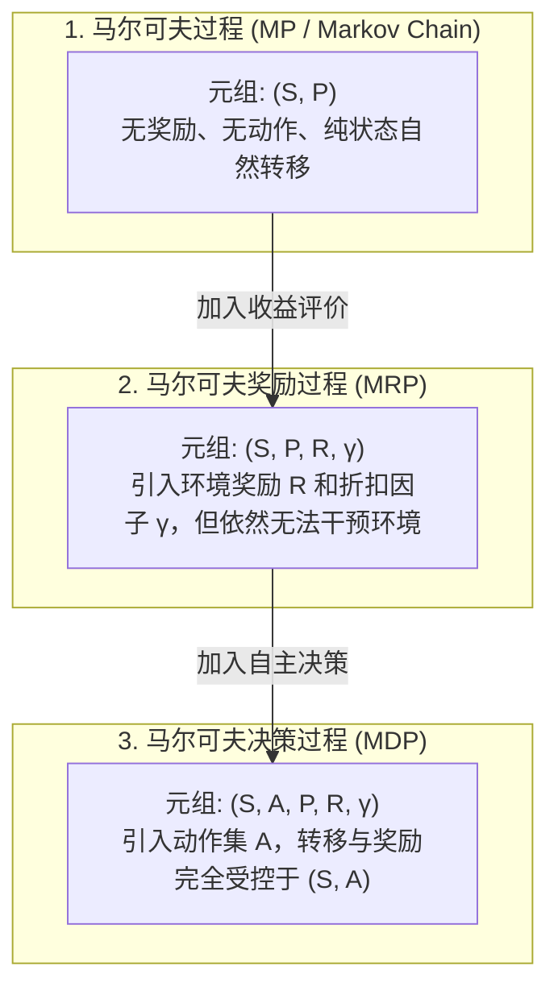
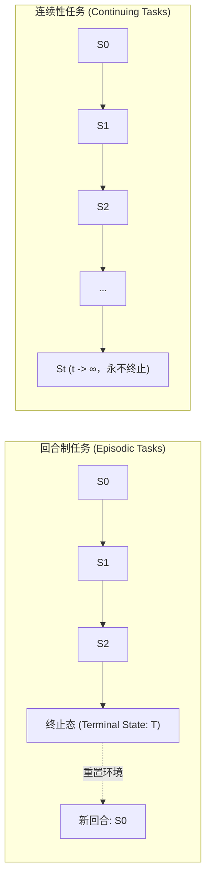
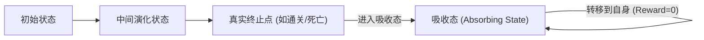
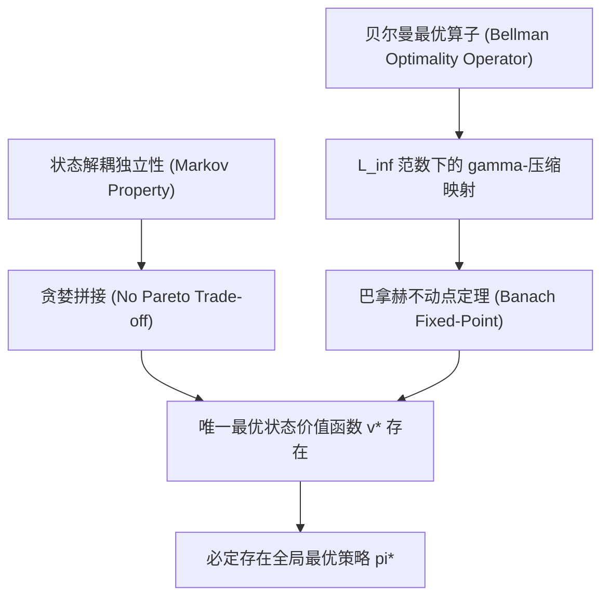

# 强化学习基础：马尔可夫决策过程 (MDP 全景解析 Master)

*本笔记专为系统性构建强化学习 (Reinforcement Learning, RL) 数学底座而设计，涵盖马尔可夫性质本质辨析、从马氏链到 MDP 的演化脉络、回合制与连续性任务的数学收敛性对比，以及常见认知漏洞的彻底排雷。*

---

## 目录 (Table of Contents)
- [⚠️ 核心概念严格排雷：两大经典认知误区](#️-核心概念严格排雷两大经典认知误区)
- [🏛️ 体系演化：从无意识到自主决策的四步阶梯](#️-体系演化从无意识到自主决策的四步阶梯)
- [⚖️ 核心辨析：回合制任务 vs 连续性任务](#️-核心辨析回合制任务-vs-连续性任务)
- [🎯 深度进阶：最优策略的存在性与确定性定理](#-深度进阶最优策略的存在性与确定性定理-optimality-theory)
- [5. [2026-09-09] 循环转移与自举套娃迷思：状态互相依赖为何不会陷入死锁？](#5-2026-09-09-循环转移与自举套娃迷思状态互相依赖为何不会陷入死锁)
  - [5.1 致命思维定势：过程式递归调用栈 vs 代数自洽联立方程](#51-致命思维定势过程式递归调用栈-vs-代数自洽联立方程)
  - [5.2 视角一：解析解——联立线性方程组与矩阵可逆性](#52-视角一解析解联立线性方程组与矩阵可逆性)
  - [5.3 视角二：物理与时间轴展开——等比数列的指数级衰减](#53-视角二物理与时间轴展开等比数列的指数级衰减)
  - [5.4 视角三：算法自举迭代——压缩映射不动点收敛保证](#54-视角三算法自举迭代压缩映射不动点收敛保证)
  - [5.5 极端反例剖析：什么时候“无限套娃”真会变成灾难？](#55-极端反例剖析什么时候无限套娃真会变成灾难)
  - [5.6 专业实战测评题库 (含采分点与解析)](#56-专业实战测评题库-含采分点与解析)
  - [5.7 极简复习闪卡 (CheatSheet)](#57-极简复习闪卡-cheatsheet)

---

## ⚠️ 核心概念严格排雷：两大经典认知误区

在深入学习 MDP 之前，必须以最严苛的数学眼光扫除初学者最容易犯的两个致命认知错误：

### 误区一：“下一步的状态和奖励仅仅决定于当前状态” ❌
*   **致命漏洞**：**你彻底遗漏了强化学习中拥有自主智能的灵魂——动作 (Action, $A_t$)！**
*   **数学真相**：
    *   如果系统的下一步状态 $S_{t+1}$ 和奖励 $R_{t+1}$ 仅仅由当前状态 $S_t$ 决定，即 $P(S_{t+1} \mid S_t)$，那根本不是“决策”过程，它只是**马尔可夫链 (Markov Chain, MC)** 或 **马尔可夫奖励过程 (Markov Reward Process, MRP)**。在那种系统里，智能体只是一个随波逐流的被动观察者。
    *   只有引入了智能体主动施加的决策动作 $A_t$，让环境状态转移受控于“状态-动作对” $(S_t, A_t)$，即：
        $$P(S_{t+1} = s', R_{t+1} = r \mid S_t = s, A_t = a)$$
        它才配被称为**马尔可夫决策过程 (Markov Decision Process, MDP)**！

### 误区二：“马尔可夫性质避免了状态数过多导致的问题” ❌
*   **致命漏洞**：**因果严重倒置！马尔可夫性质非但不能避免状态爆炸，往往反而是导致状态空间维度灾难的元凶。**
*   **数学真相**：
    *   马尔可夫性（无后效性）是指：**给定当前状态，未来独立于过去**（即“现在的状态包含了推演未来所需的所有历史信息”）：
        $$P(S_{t+1} \mid S_t, A_t, S_{t-1}, A_{t-1}, \dots, S_0, A_0) = P(S_{t+1} \mid S_t, A_t)$$
    *   **为什么会导致状态爆炸？**
        现实世界中很多问题（例如下棋、自动驾驶、打游戏）是严重依赖历史轨迹的。为了强行让系统满足马尔可夫性，工程师不得不**把一连串的历史记录硬生生打包塞进当前状态里**（典型代表：DeepMind 的 DQN 打 Atari 游戏时，必须将连续 4 帧画面拼成一个 Super-State，否则单帧静止图片根本无法推断小球的速度与加速度方向）。
    *   这种为了满足马尔可夫性而进行的“历史打包”，会直接让状态空间维度呈**指数级暴增（Curse of Dimensionality，维度灾难）**！
    *   **马尔可夫性真正的唯一价值**：它消除了对庞大历史轨迹树的条件依赖，使得**贝尔曼方程 (Bellman Equation) 和动态规划 (Dynamic Programming)** 能够在数学上成立，让复杂的序列决策问题可以被拆解为优雅的一步递推递归求解。

---

## 🏛️ 体系演化：从无意识到自主决策的四步阶梯

要理解 MDP，必须看清其在概率论与随机过程中的四层演化阶梯：



### 1. 马尔可夫过程 (MP)
*   **定义**：一个具备马尔可夫性质的随机状态序列 $\langle S_1, S_2, \dots \rangle$。
*   **要素**：$\langle \mathcal{S}, \mathcal{P} \rangle$。$\mathcal{S}$ 是有限状态集，$\mathcal{P}$ 是状态转移概率矩阵：
    $$\mathcal{P}_{ss'} = \mathbb{P}[S_{t+1} = s' \mid S_t = s]$$

### 2. 马尔可夫奖励过程 (MRP)
*   **定义**：在 MP 基础上加入了奖励信号与时间价值。
*   **要素**：$\langle \mathcal{S}, \mathcal{P}, \mathcal{R}, \gamma \rangle$。
    *   $\mathcal{R}_s = \mathbb{E}[R_{t+1} \mid S_t = s]$：处于状态 $s$ 期望获得的即时奖励。
    *   $\gamma \in [0, 1]$：折扣因子（Discount Factor）。

### 3. 马尔可夫决策过程 (MDP)
*   **定义**：在 MRP 基础上引入决策者（Agent），将外界被动的自然流动，转变为“交互-反馈”的主动学习控制闭环。
*   **核心五元组**：$\langle \mathcal{S}, \mathcal{A}, \mathcal{P}, \mathcal{R}, \gamma \rangle$
    *   $\mathcal{S}$：所有可能状态的集合。
    *   $\mathcal{A}$：所有可能采取的动作集合。
    *   $\mathcal{P}$：动态转移函数 $\mathcal{P}_{ss'}^a = \mathbb{P}[S_{t+1} = s' \mid S_t = s, A_t = a]$。
    *   $\mathcal{R}$：奖励函数 $\mathcal{R}_s^a = \mathbb{E}[R_{t+1} \mid S_t = s, A_t = a]$。
    *   $\gamma$：未来奖励的折扣因子 $\gamma \in [0, 1]$。

---

## ⚖️ 核心辨析：回合制任务 vs 连续性任务

在 MDP 理论中，根据**交互时间线是否存在天然终点**，任务被划分为两个根本对立的类别：



### 1. 全维度对比分析表

| 比较维度 | 回合制任务 (Episodic Tasks) | 连续性任务 (Continuing Tasks) |
| :--- | :--- | :--- |
| **别名** | 分段任务、片段式任务 (Episodes / Trials) | 持续性任务、非终止任务 (Infinite Horizon) |
| **时间视界 (Horizon)** | **有限步长**：存在确定的最终时刻 $T$ ($T < \infty$) | **无限步长**：时间轴走向无穷大 ($T = \infty$) |
| **终止状态 (Terminal)** | **必须存在**。一旦进入终止状态，当前回合立刻死亡并结算，重置回初始状态分布 | **坚决不存在**。环境状态持续演化，没有物理死亡或终局概念 |
| **典型现实场景** | 围棋/象棋对弈、超级马里奥过关、21点扑克、CartPole 倒立摆杆倾倒 | 工业化工厂恒温控制、服务器集群温控散热、高频量化交易做市、波士顿动力机器人连续行走巡逻 |
| **累积回报计算公式** | $G_t = \sum_{k=0}^{T-t-1} \gamma^k R_{t+k+1}$ | $G_t = \sum_{k=0}^{\infty} \gamma^k R_{t+k+1}$ |
| **折扣因子 $\gamma$ 的约束** | **允许 $\gamma = 1$**（可无折扣直接求和） | **强制要求 $\gamma \in [0, 1)$**（严禁 $\gamma = 1$！） |

---

### 2. 数学硬核探讨：为什么连续性任务严禁 $\gamma = 1$？

这是强化学习面试和理论考试中的送命题。

#### 回合制任务的数学特权：
在回合制任务中，因为步数 $T$ 是一个有限的自然数（比如一局棋最多 300 步）：
$$G_t = R_{t+1} + R_{t+2} + \dots + R_T$$
即使令 $\gamma = 1$，由于求和项数有限（假设单步奖励 $R$ 有界，即 $|R| \le R_{max}$），累积回报 $G_t$ 的上界为 $(T - t) R_{max} < \infty$，**它是绝对收敛的**。因此在回合制任务中，不加折扣的简单累计得分是合法的。

#### 连续性任务的无穷级数崩溃：
在连续性任务中，时间 $T = \infty$。如果依然令 $\gamma = 1$：
$$G_t = \sum_{k=0}^{\infty} R_{t+k+1} = R_{t+1} + R_{t+2} + R_{t+3} + \dots$$
若智能体在每一步都获得恒定微小的正奖励 $+1$（例如恒温器平稳运行每一秒得 1 分）：
$$G_t = 1 + 1 + 1 + \dots = \infty$$
*   **数学崩溃后果**：所有的策略（无论是优秀的温控策略还是极度垃圾但运行很久的策略），它们在每个状态上的价值全都是正无穷大（$\infty$）。
*   **策略评估失效**：无穷大无法比较大小（$\infty \ge \infty$ 在实数优化理论中无法排序），智能体将彻底丧失判断“动作 A 是否比动作 B 更好”的数学基础，策略梯度和值迭代全部报废！

#### 折扣因子 $\gamma < 1$ 的收敛救赎：
当引入严格的 $\gamma \in [0, 1)$ 时，根据等比数列求和公式：
$$G_t = \sum_{k=0}^{\infty} \gamma^k R_{t+k+1} \le R_{max} \sum_{k=0}^{\infty} \gamma^k = \frac{R_{max}}{1 - \gamma} < \infty$$
*   这强行将原本发散的无穷大级数，压缩到了一个确界实数区间 $\left[-\frac{R_{max}}{1-\gamma}, \frac{R_{max}}{1-\gamma}\right]$ 之内。
*   正是这个收敛的有限实数，让贝尔曼算子（Bellman Operator）成为一个**压缩映射 (Contraction Mapping)**，从而基于巴拿赫不动点定理（Banach Fixed-Point Theorem）保证了值迭代必然收敛到唯一最优解！

---

### 3. 统一建模的极客技巧：吸收态 (Absorbing State)

强化学习经典教父级教材《Reinforcement Learning: An Introduction》（Sutton & Barto）中，提出了一个极为优雅的数学把戏：**如何用连续性任务的一套公式，同时兼容回合制任务？**

**解法：引入假想的吸收状态 (Absorbing State)**
*   当一个回合制任务结束时（例如马里奥掉入悬崖死掉，或者下棋分出胜负），我们不认为时间停止了；
*   而是假定环境立即跃迁进了一个特殊的虚拟状态——**吸收态 (Absorbing State, $S_{abs}$)**；
*   在吸收态里，无论采取什么动作：
    1. 系统的下一个状态必定只能是它自己：$P(S_{t+1} = S_{abs} \mid S_t = S_{abs}, A_t = a) = 1$；
    2. 之后每一步获得的即时奖励恒等于 $0$：$R_{abs} = 0$。



通过这一技巧，回合制任务在数学上被无缝扩展成了一个无穷时间的连续任务：
$$G_t = R_{t+1} + \gamma R_{t+2} + \dots + \gamma^{T-t-1} R_T + \underbrace{\gamma^{T-t} \cdot 0 + \gamma^{T-t+1} \cdot 0 + \dots}_{= 0}$$
所有的理论证明、代码架构与公式推导，自此实现了完美的统一。


---

## 🎯 深度进阶：最优策略的存在性与确定性定理 (Optimality Theory)

在强化学习的数学大厦中，“最优策略的存在性”与“确定性策略的充分性”是整个领域得以成立的两大支柱性定理。许多人能背诵结论，却不清楚背后的数学本质。

### 1. 致命表述纠偏：“最优策略是确定性策略”错在哪？
*   **严谨批判**：**你绝不能说“最优策略【是/必须是】确定性策略”，这在数学上是不严密的！**
*   **数学事实**：
    *   **随机策略也可以是最优策略！**
    *   假设在状态 $s$ 下，向左走和向右走能获得完全相同且最大的最优动作价值：
        $$q^*(s, \text{左}) = q^*(s, \text{右}) = \max_a q^*(s, a)$$
        此时，你哪怕抛硬币（50% 向左，50% 向右），这个**随机策略依然是 100% 绝对的最优策略**！
    *   **教材与论文的真实准确命题是**：
        > **在任意有限马尔可夫决策过程 (Finite MDP) 中，必定【存在】至少一个【确定性】的最优策略。**
    *   换言之：**确定性策略对于达到全局最优是“充分”的，我们永远“不需要”为了寻求最优而被迫引入随机性。**

---

### 2. 为什么 MDP 至少存在一个最优策略？(Existence Proof)

在一般的多目标优化或博弈中，往往不存在一个“全状态绝对碾压”的策略（例如策略 A 在状态 1 下最好，策略 B 在状态 2 下最好，两者处于帕累托前沿，无法分出绝对第一）。
但在 MDP 中，为什么总能找到一个策略 $\pi^*$，它在**所有状态**下的价值都同时达到最大（$\forall s, v_{\pi^*}(s) \ge v_\pi(s)$）？



#### 核心推导三步走：
1. **状态解耦与策略自由拼接 (No State-wise Trade-off)**：
   *   因为马尔可夫性，智能体在状态 $s_1$ 下做出什么选择，**物理上不会限制或改变**它在遥远状态 $s_2$ 下能够做出的选择空间。
   *   如果策略 A 在 $s_1$ 最好，策略 B 在 $s_2$ 最好，我们完全可以定义一个“缝合策略” $\pi_{\text{new}}$：在 $s_1$ 执行 A 的动作，在 $s_2$ 执行 B 的动作。这个缝合策略必定同时在 $s_1$ 和 $s_2$ 优于 A 和 B。
   *   因此，状态之间不存在“拆东墙补西墙”的资源置换，可以在每个状态分别取最优！
2. **贝尔曼最优算子的压缩映射性 (Contraction Mapping)**：
   *   定义贝尔曼最优算子 $\mathcal{T}^*$：
       $$(\mathcal{T}^* v)(s) = \max_{a \in \mathcal{A}} \left[ \mathcal{R}_s^a + \gamma \sum_{s' \in \mathcal{S}} \mathcal{P}_{ss'}^a v(s') \right]$$
   *   利用柯西范数不等式可以严格证明，在无穷范数（$L_\infty$ Norm）下：
       $$\|\mathcal{T}^* u - \mathcal{T}^* v\|_\infty \le \gamma \|u - v\|_\infty$$
   *   因为连续任务下 $\gamma \in [0, 1)$，所以 $\mathcal{T}^*$ 是一个**严格的 $\gamma$-压缩算子**！
3. **巴拿赫不动点定理 (Banach Fixed-Point Theorem)**：
   *   有限维实数空间 $\mathbb{R}^{|\mathcal{S}|}$ 是完备的度量空间（巴拿赫空间）。
   *   根据巴拿赫不动点定理，压缩算子在完备空间中**必定存在且仅存在唯一的固定不动点** $v^*$，使得 $\mathcal{T}^* v^* = v^*$。
   *   这个唯一的 $v^*$ 就是理论极限——**最优状态价值函数**。只要有了 $v^*$，通过贪婪策略即可直接诱导出至少一个最优策略 $\pi^*$！

---

### 3. 为什么总能找到一个“确定性”最优策略？(Determinism Proof)

为什么最顶级的策略完全不需要掷骰子？

#### 数学证据：凸组合与加权平均最大值不等式
对于任意可能存在的随机策略 $\pi(a \mid s)$，它在状态 $s$ 下的价值 $v_\pi(s)$，本质上是各个动作价值 $q_\pi(s, a)$ 的**概率加权平均（即凸组合，Convex Combination）**：
$$v_\pi(s) = \sum_{a \in \mathcal{A}} \pi(a \mid s) q_\pi(s, a)$$
根据实数域最基础的不等式法则——**加权平均值永远不可能严格大于其中的最大值**：
$$\sum_{a \in \mathcal{A}} \pi(a \mid s) q_\pi(s, a) \le \max_{a \in \mathcal{A}} q_\pi(s, a)$$

*   **等号成立的唯一充要条件**：你把所有的概率质量（$100\%$ 的概率）全都分配给那个能让 $q_\pi(s, a)$ 达到最大值的单一动作 $a^*$！
*   **推论**：
    如果我们构造一个绝对纯粹的确定性贪婪策略 $\pi_{\text{det}}$：
    $$\pi_{\text{det}}(a \mid s) = \begin{cases} 1, & a = \arg\max_{a'} q^*(s, a') \\ 0, & \text{其他} \end{cases}$$
    那么：
    $$v_{\pi_{\text{det}}}(s) = 1.0 \times \max_a q^*(s, a) \ge \sum_a \pi_{\text{rand}}(a \mid s) q^*(s, a) = v_{\pi_{\text{rand}}}(s)$$
    **确定性策略在每一个状态下榨取出的价值，在数学上永远大于等于任何分摊概率的随机策略！**

---

### 4. 跨学科深思：为什么博弈论需要随机，而 MDP 坚决不需要？

很多学过《博弈论 (Game Theory)》的同学会困惑：“在石头剪刀布里，最强策略必须是随机抛硬币（各 1/3 混合纳什均衡），为什么到了强化学习 MDP 里却一定是确定性的？”

*   **博弈论 (Multi-Agent / Game Theory)**：你的对手是一个**动态博弈的有心智主体**。如果你采取确定性策略（比如每次必出石头），对手会利用后发优势或策略反制，精准出布将你打爆。因此你必须通过“随机化”来隐藏意图、消除信息泄露。
*   **单智能体 MDP (Single-Agent RL)**：环境是**无意识的、静态的物理法则**（哪怕环境的状态转移具有随机性，如 80% 成功向前走、20% 滑倒，这个概率转移矩阵 $P$ 也是永恒不变的固定分布）。
    *   “环境不会因为你每次都在悬崖边右转，就故意挪动悬崖的物理坐标来暗算你”。
    *   面对不变的物理法则，**最好的应对永远是在已知均值最大的动作上全力押注 100% 的行动力**，分摊概率只会稀释期望收益！

---

## 5. [2026-09-09] 循环转移与自举套娃迷思：状态互相依赖为何不会陷入死锁？

### 5.1 致命思维定势：过程式递归调用栈 vs 代数自洽联立方程

> [!CAUTION]
> **初学者典型困惑**：“如果状态 $s_1$ 执行动作到 $s_2$，其价值取决于 $s_2$；而 $s_2$ 又有个动作回到 $s_1$，其价值又取决于 $s_1$。这岂不是 A 调 B、B 调 A 的无限递归死循环？这不是无限套娃吗？”

* **思维定势病根**：
  * 这是典型的**“过程式编程的动态调用栈思维 (Procedural Call Stack)”**！
  * 程序员习惯了写代码：如果函数 `f()` 里调用 `g()`，而 `g()` 里面又调用 `f()`，且没有 `if (base_case) return;` 停机条件，程序运行到第 1000 层就会触发 `RecursionError: maximum recursion depth exceeded`（栈溢出崩溃）。
  * 于是初学者看到贝尔曼方程中 $s_1 \to s_2 \to s_1$ 的回路时，脑海中浮现的也是这样一条“不断深入、永无止境的死锁调用链”。
* **严厉数学反驳**：
  * **数学关系从来不是单向运行的程序指令，而是关于自洽平衡态的“联立约束（Simultaneous Constraints）”！**
  * 如果按照这种“互相依赖就是无限套娃”的逻辑，请问初中代数题：
    $$\begin{cases} x = 2 + 0.5 y \\ y = 1 + 0.5 x \end{cases}$$
    $x$ 的取值依赖 $y$，$y$ 的取值又依赖 $x$。难道初中生会说“这题是无限套娃，无解死循环”吗？
    显然不会！把第二个式子代入第一个：
    $$x = 2 + 0.5(1 + 0.5x) = 2.5 + 0.25x \implies 0.75x = 2.5 \implies x = \frac{10}{3} \approx 3.33$$
    $$y = 1 + 0.5 \times \frac{10}{3} = \frac{8}{3} \approx 2.67$$
    这不叫死循环套娃，这叫**联立方程组的唯一自洽解（Unique Self-consistent Solution）**！

---

### 5.2 视角一：解析解——联立线性方程组与矩阵可逆性

在策略评估（Policy Evaluation）中，当策略 $\pi$ 固定时，任意有限状态马尔可夫决策过程的贝尔曼期望方程本质上就是**一组联立线性方程组**。

设环境有 3 个状态 $\{s_1, s_2, s_3\}$，智能体在它们之间循环游走：
$$V(s) = \mathcal{R}^\pi(s) + \gamma \sum_{s' \in \mathcal{S}} \mathcal{P}^\pi(s' \mid s) V(s')$$

将其写成紧凑的向量矩阵形式：
$$\mathbf{V} = \mathbf{R} + \gamma \mathbf{P} \mathbf{V}$$

其中：
* $\mathbf{V} = [V(s_1), V(s_2), V(s_3)]^T \in \mathbb{R}^3$ 是待求的状态价值向量；
* $\mathbf{R} = [R(s_1), R(s_2), R(s_3)]^T \in \mathbb{R}^3$ 是各状态在策略 $\pi$ 下的期望即时奖励向量；
* $\mathbf{P} \in \mathbb{R}^{3 \times 3}$ 是状态转移概率矩阵（行随机矩阵，每行概率和为 1）；
* $\gamma \in [0, 1)$ 是折扣因子。

#### 严密数学证明：为什么这个方程组 100% 必定存在唯一解？
1. 移项提取公因式：
   $$(I - \gamma \mathbf{P}) \mathbf{V} = \mathbf{R}$$
2. 根据矩阵论中的 **Perron-Frobenius 定理**：
   * $\mathbf{P}$ 是行随机矩阵，其所有特征值 $\lambda$ 满足 $|\lambda| \le 1$，即谱半径 $\rho(\mathbf{P}) \le 1$。
3. 引入折扣因子 $\gamma < 1$：
   * 矩阵 $\gamma \mathbf{P}$ 的谱半径满足 $\rho(\gamma \mathbf{P}) = \gamma \rho(\mathbf{P}) < 1$。
   * 这意味着矩阵 $\gamma \mathbf{P}$ 的任何特征值都不可能等于 $1$！
4. **矩阵可逆性与 Neumann 级数**：
   * 矩阵 $(I - \gamma \mathbf{P})$ 的行列式绝对不为 0，**矩阵严格保证可逆**！
   * 其逆矩阵可以直接展开为绝对收敛的矩阵几何级数（Neumann Series）：
     $$(I - \gamma \mathbf{P})^{-1} = \sum_{k=0}^{\infty} (\gamma \mathbf{P})^k = I + \gamma \mathbf{P} + \gamma^2 \mathbf{P}^2 + \gamma^3 \mathbf{P}^3 + \dots$$
5. **最终唯一闭式解析解**：
   $$\mathbf{V}^* = (I - \gamma \mathbf{P})^{-1} \mathbf{R}$$
   **无论状态之间如何错综复杂地互相跳转成环，价值函数在代数上永远存在唯一的确定数值！**

---

### 5.3 视角二：物理与时间轴展开——等比数列的指数级衰减

若你执意要从“动态时间流”的角度去追踪 $s_1 \to s_2 \to s_1 \to s_2 \dots$ 的无限循环过程，我们不妨把环路展开成一棵沿时间轴无限延伸的**轨迹树**。

设智能体在 $s_1$ 与 $s_2$ 之间永无休止地来回穿梭：
* 从 $s_1 \to s_2$ 获得即时奖励 $r_1$；
* 从 $s_2 \to s_1$ 获得即时奖励 $r_2$。

从时刻 $t=0$ 开始的真实累积回报 $G_0$ 为：
$$G_0 = r_1 + \gamma r_2 + \gamma^2 r_1 + \gamma^3 r_2 + \gamma^4 r_1 + \gamma^5 r_2 + \dots$$

将奇数项与偶数项分别合并：
$$G_0 = r_1 (1 + \gamma^2 + \gamma^4 + \dots) + \gamma r_2 (1 + \gamma^2 + \gamma^4 + \dots)$$
$$G_0 = (r_1 + \gamma r_2) \sum_{k=0}^{\infty} (\gamma^2)^k$$

因为 $\gamma < 1$，公比 $\gamma^2 < 1$，根据高中等比数列求和公式：
$$\sum_{k=0}^{\infty} (\gamma^2)^k = \frac{1}{1 - \gamma^2}$$
$$G_0 = \frac{r_1 + \gamma r_2}{1 - \gamma^2} < \infty$$

#### 为什么不会“套娃爆炸”？
* 假设 $\gamma = 0.9$：
  * 第 1 步的权重是 $1.0$；
  * 转了 5 圈后（第 10 步），权重已经衰减到 $0.9^{10} \approx 0.348$；
  * 转了 25 圈后（第 50 步），权重衰减到 $0.9^{50} \approx 0.00515$；
  * 转了 50 圈后（第 100 步），权重衰减到 $0.9^{100} \approx 0.0000266$！
* **物理本质**：在折扣机制下，**无限远的未来对当下决策的影响以几何级数速度归零**。你所谓的“无限循环”，其深层影响在几十步之后就已经在数值精度层面彻底消失了！

---

### 5.4 视角三：算法自举迭代——压缩映射不动点收敛保证

对于求解最优策略的**贝尔曼最优方程**，由于引入了非线性的 $\max$ 算子：
$$Q^*(s, a) = \mathcal{R}(s, a) + \gamma \sum_{s'} \mathcal{P}(s' \mid s, a) \max_{a'} Q^*(s', a')$$
此时无法直接通过矩阵求逆 $(I - \gamma P)^{-1}$ 求解。强化学习算法（价值迭代 VI、Q-Learning 等）采用的方法正是初学者最担心的——**用估计值更新估计值的“自举迭代 (Bootstrapping)”**。

为什么电脑在后台拿着初始全为 0 的 $Q$ 表，在 $s_1$ 和 $s_2$ 之间来回倒腾自举更新，不仅没有发散，反而算出了全局最优解？

```
初始猜测 Q_0 (全0) ──> 算子 T* ──> Q_1 ──> 算子 T* ──> Q_2 ──────> 唯一全局真值 Q* (不动点)
                       误差缩减 γ 倍       误差再缩减 γ 倍
```

1. **贝尔曼最优算子是严格的 $\gamma$-压缩映射**：
   定义算子 $(\mathcal{T}^* Q)(s, a) = \mathcal{R}(s, a) + \gamma \sum_{s'} \mathcal{P}_{ss'}^a \max_{a'} Q(s', a')$。
   在向量无穷范数 $\|Q\|_\infty = \max_{s, a} |Q(s, a)|$ 下，对于任意两个不同的价值矩阵 $Q_A$ 和 $Q_B$：
   $$\|\mathcal{T}^* Q_A - \mathcal{T}^* Q_B\|_\infty \le \gamma \|Q_A - Q_B\|_\infty$$
2. **误差单调指数衰减**：
   第 $k$ 轮自举迭代与真值 $Q^*$ 之间的最大误差满足：
   $$\|Q_k - Q^*\|_\infty \le \gamma^k \|Q_0 - Q^*\|_\infty$$
3. **巴拿赫不动点定理 (Banach Fixed-Point Theorem)**：
   在完备度量空间中，严格压缩映射具有且仅有**唯一的不动点**。
   因此，无论你的状态图有多少环路、如何错综复杂地相互依赖，自举更新每执行一步，距离真理的误差就被强行压缩缩小 $\gamma$ 倍。**自举更新不是在无限死循环，而是在以几何级数速度单调奔向宇宙中唯一的不动点！**

---

### 5.5 极端反例剖析：什么时候“无限套娃”真会变成灾难？

什么时候初学者的担忧会真正成真？
**答案：当且仅当 $\gamma = 1$（无折扣）且系统存在正奖励闭环回路（Positive Reward Cycle）时！**

* **灾难复现**：
  设 $s_1 \xrightarrow{a_1} s_2$ 即时奖励 $r_1 = +1$，$s_2 \xrightarrow{a_2} s_1$ 即时奖励 $r_2 = +1$。若设定 $\gamma = 1.0$：
  $$V(s_1) = 1 + 1 + 1 + 1 + \dots = \infty$$
  $$V(s_2) = 1 + 1 + 1 + 1 + \dots = \infty$$
* **代数崩溃**：
  此时 $(I - \mathbf{P})$ 的行和全为 0（因为 $\mathbf{P}$ 每一行和为 1），矩阵必定有一根特征值为 0，行列式 $\det(I - \mathbf{P}) = 0$，**矩阵奇异、不可逆**！联立方程组无唯一解。
* **算法崩溃**：
  价值迭代的误差缩减比为 $\gamma = 1.0$，算子不再具备压缩性质。价值在自举迭代中无限膨胀至数值溢出（`inf` / `NaN`）。
* **核心结论**：
  **“无限套娃”不是马尔可夫决策过程的天然缺陷，而是由折扣因子 $\gamma \in [0, 1)$ 完美驯服的数学良态性质！**

---

### 5.6 专业实战测评题库 (含采分点与解析)

#### 题 1 【双状态环路贝尔曼解析求解】
**题目**：考虑一个包含两个状态 $\{s_1, s_2\}$ 的马尔可夫奖励过程（MRP）。已知状态转移关系如下：
* 在 $s_1$ 下，状态 100% 转移到 $s_2$，获得即时奖励 $R_1 = 4$；
* 在 $s_2$ 下，状态 100% 转移回到 $s_1$，获得即时奖励 $R_2 = -2$；
* 折扣因子设为 $\gamma = 0.5$。
1. 请列出 $V(s_1)$ 与 $V(s_2)$ 的贝尔曼期望联立方程；
2. 手算求出 $V(s_1)$ 和 $V(s_2)$ 的精确闭式解。

> **参考采分点与解析**：
> 1. **联立方程组构建（4分）**：
>    $$\begin{cases} V(s_1) = 4 + 0.5 V(s_2) \\ V(s_2) = -2 + 0.5 V(s_1) \end{cases}$$
> 2. **代入求解（6分）**：
>    将第二式代入第一式：
>    $$V(s_1) = 4 + 0.5 (-2 + 0.5 V(s_1)) = 4 - 1 + 0.25 V(s_1) = 3 + 0.25 V(s_1)$$
>    $$0.75 V(s_1) = 3 \implies V(s_1) = \frac{3}{0.75} = \mathbf{4.0}$$
>    代回求 $V(s_2)$：
>    $$V(s_2) = -2 + 0.5 \times 4.0 = -2 + 2.0 = \mathbf{0.0}$$
>    （解析结论：尽管两者相互循环依赖，但在数学上解是唯一且非常干净的常量：$V(s_1)=4, V(s_2)=0$）。

#### 题 2 【自举更新收敛步数估计】
**题目**：某强化学习算法使用价值迭代求解一个连续任务，折扣因子设定为 $\gamma = 0.8$。初始价值全填 0（$Q_0 = 0$），已知初始状态下估计值与理论真实最优值的最大绝对误差为 $\|Q_0 - Q^*\|_\infty = 50$。问：至少需要执行多少次贝尔曼自举迭代更新，才能保证全图最大误差降至 $\epsilon \le 0.1$ 以内？（已知 $\ln(0.8) \approx -0.2231$，$\ln(0.002) \approx -6.2146$）

> **参考采分点与解析**：
> 1. **应用压缩映射误差不等式（5分）**：
>    $$\|Q_k - Q^*\|_\infty \le \gamma^k \|Q_0 - Q^*\|_\infty \le \epsilon$$
>    代入具体数值：
>    $$0.8^k \times 50 \le 0.1 \implies 0.8^k \le \frac{0.1}{50} = 0.002$$
> 2. **对数求解迭代步数（5分）**：
>    两边取自然对数：
>    $$k \ln(0.8) \le \ln(0.002)$$
>    因为 $\ln(0.8) < 0$，不等号变向：
>    $$k \ge \frac{\ln(0.002)}{\ln(0.8)} = \frac{-6.2146}{-0.2231} \approx 27.85$$
>    向上取整，至少需要迭代 **28 步**。
>    （解析结论：自举迭代具有严格的几何级数收敛保障，绝非无止境的死锁套娃）。

---

### 5.7 极简复习闪卡 (CheatSheet)

| 核心维度 | 过程式直觉（错误认知） | 数学与算法真实本质（正确认知） |
| :--- | :--- | :--- |
| **状态环路依赖** | “无限递归死循环，栈溢出死锁” | **联立线性方程组**，矩阵 $(I - \gamma P)$ 严格可逆，有唯一解析解。 |
| **时间轴展开** | “无数个状态堆叠，累积回报无穷大” | **无穷等比级数**，在 $\gamma < 1$ 作用下权重指数衰减，绝对收敛。 |
| **自举更新机制** | “用瞎猜更新瞎猜，越套越歪” | **巴拿赫不动点压缩映射**，每次迭代最大误差衰减为原来的 $\gamma$ 倍。 |
| **套娃崩溃的充要条件** | “只要有环路就会死锁” | **$\gamma = 1.0$ 且存在非零净正收益环路**，此时矩阵奇异、无界发散。 |

