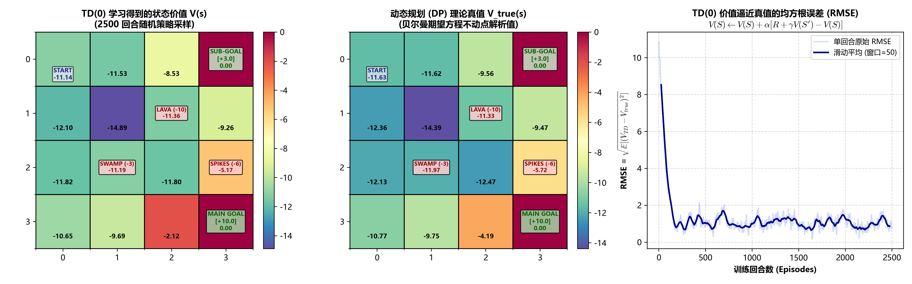
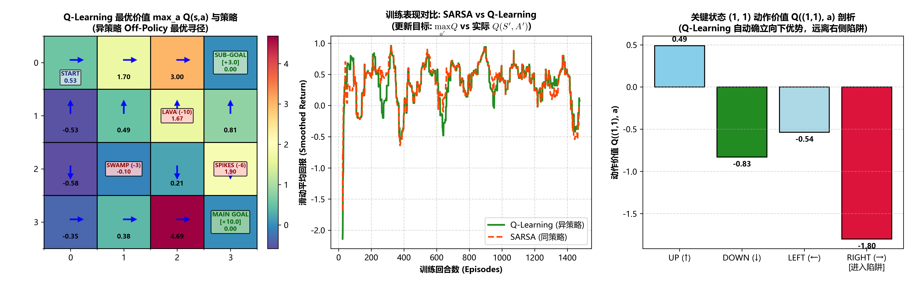

# 免模型时序差分三剑客与重要性采样 (Model-Free: TD(0), SARSA & Q-learning)

> **专题归属**：`RL_Foundations` 核心学习体系  
> **专题目录**：`02_Model_Free_Methods`  
> **定位与目标**：免模型时序差分学习：蒙特卡洛 (MC) 与动态规划 (DP) 的桥梁——时间差分 (TD)、同策略控制 SARSA、异策略控制 Q-learning、重要性采样消除机理与行为策略解耦。

---

## 目录结构导航

```
02_Model_Free_Methods/
├── README.md               # [当前文档] 专题学习与运行导航
├── docs/                   # 理论讲义与详尽实验分析报告 (*.md)
├── src/                    # 核心算法实现与绘图组件 (*.py)
├── experiments/            # 独立可执行的实验脚本 (*.py)
├── logs/                   # 真实实验运行输出与数值日志 (*.txt, *.log)
└── images/                 # 出版级高清图表、动态动画与大盘 (*.png, *.gif)
```

---

## 1. 核心理论讲义 (Docs)
- [`On_Policy_vs_Off_Policy_and_MC_vs_DP.md`](docs/On_Policy_vs_Off_Policy_and_MC_vs_DP.md)
- [`Importance_Sampling_and_Model_Free_Convergence.md`](docs/Importance_Sampling_and_Model_Free_Convergence.md)

## 2. 算法源码 (Source Code)
- [`model_free.py`](src/model_free.py)
- [`plot_model_free.py`](src/plot_model_free.py)

## 3. 实验脚本 (Experiments)
- [`exp2_model_free.py`](experiments/exp2_model_free.py)
- [`run_model_free_experiment.py`](experiments/run_model_free_experiment.py)

## 4. 真实运行日志 (Logs)
- [`model_free_results.txt`](logs/model_free_results.txt)

## 5. 高清成果图表与动态动画 (Images & Visualizations)
### 图表成果：`td0_complete_workflow.png`



### 图表成果：`sarsa_complete_workflow.png`


### 图表成果：`qlearning_complete_workflow.png`



