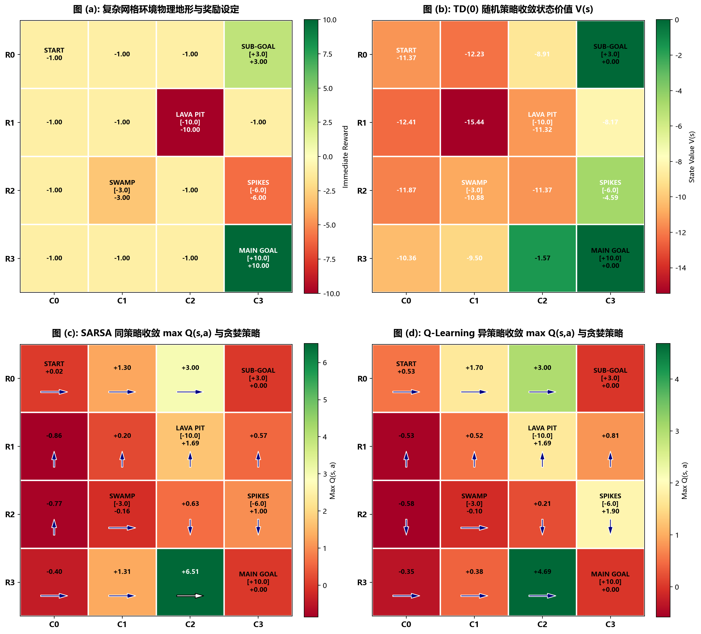
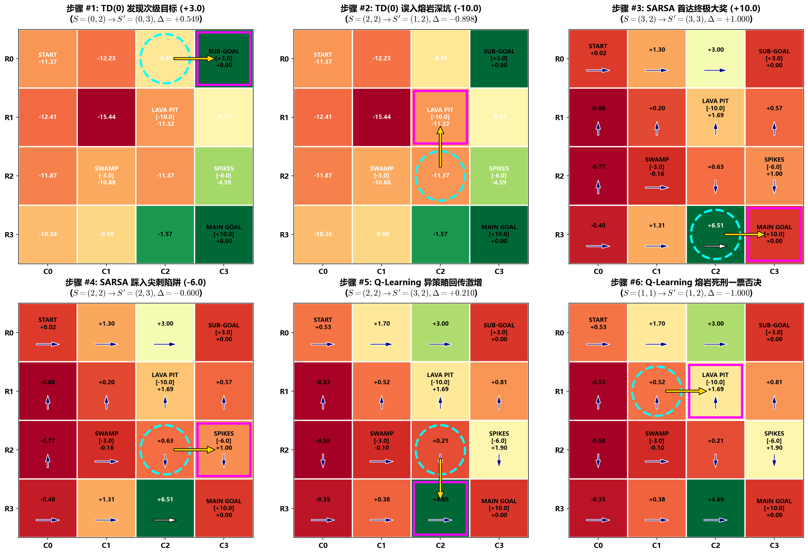
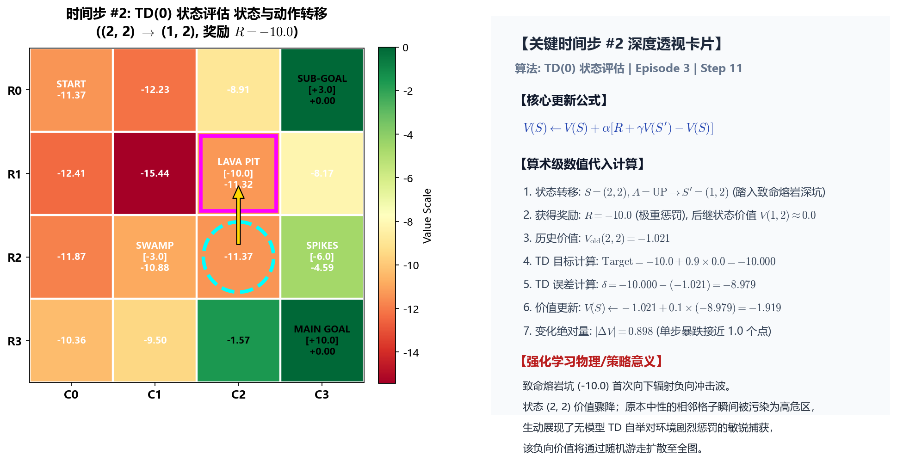
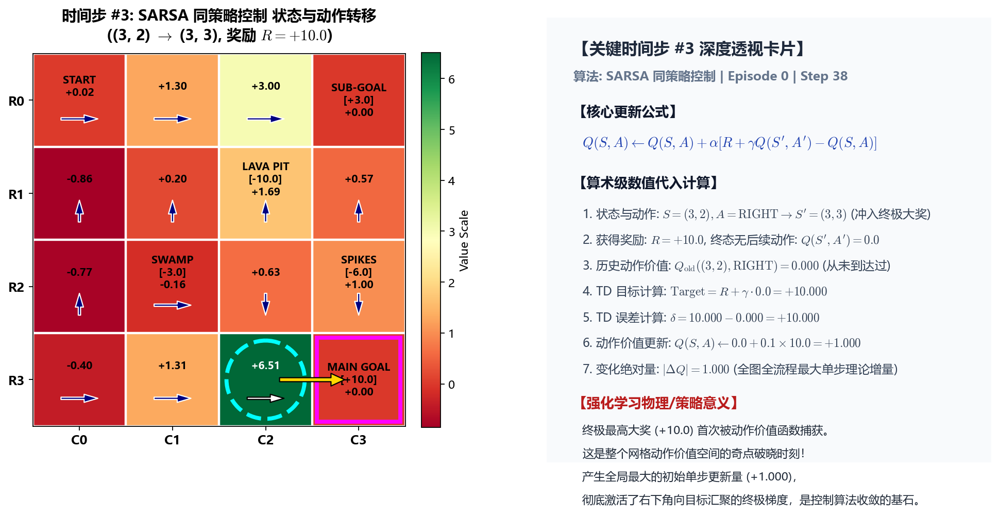
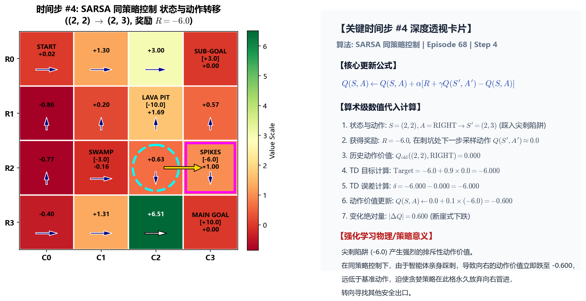
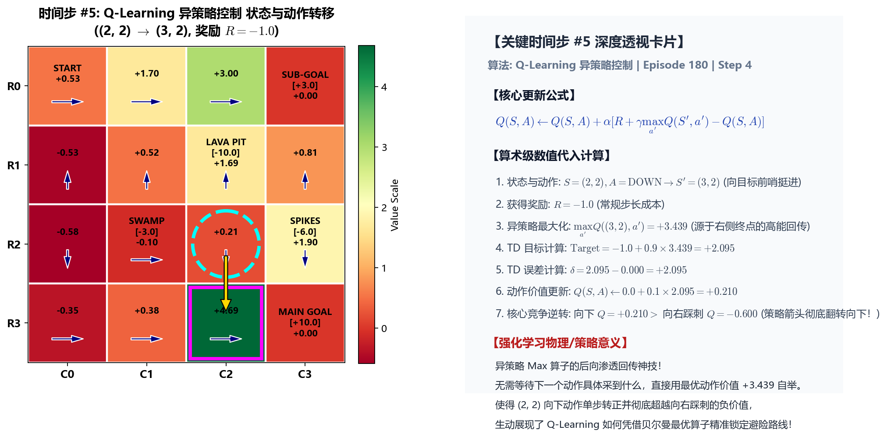
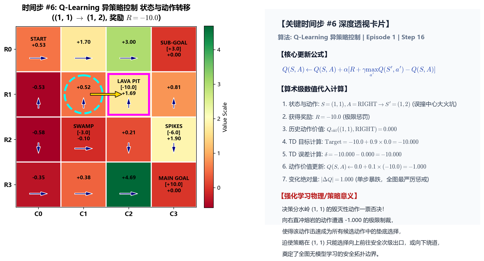

# 复杂网格世界极限博弈与六大剧变时刻深度透视 (Complex GridWorld Benchmark & Critical Steps)

> **专题归属**：`RL_Foundations` 核心学习体系  
> **专题目录**：`03_Complex_GridWorld_Benchmark`  
> **定位与目标**：复杂多奖励陷阱网格：岩浆坑 (Lava) 致命惩罚、地刺陷阱 (Spike Trap) 局部威慑、次级金币目标 (Subgoal) 贪心诱惑与主目标求解。逐时间步追踪 6 大决策剧变时刻的贝尔曼算术演化过程。

---

## 目录结构导航

```
03_Complex_GridWorld_Benchmark/
├── README.md               # [当前文档] 专题学习与运行导航
├── docs/                   # 理论讲义与详尽实验分析报告 (*.md)
├── src/                    # 核心算法实现与绘图组件 (*.py)
├── experiments/            # 独立可执行的实验脚本 (*.py)
├── logs/                   # 真实实验运行输出与数值日志 (*.txt, *.log)
└── images/                 # 出版级高清图表、动态动画与大盘 (*.png, *.gif)
```

---

## 1. 核心理论讲义 (Docs)
- [`Complex_GridWorld_Analysis.md`](docs/Complex_GridWorld_Analysis.md)

## 2. 算法源码 (Source Code)
- [`complex_grid_world.py`](src/complex_grid_world.py)
- [`complex_model_free.py`](src/complex_model_free.py)
- [`plot_complex_analysis.py`](src/plot_complex_analysis.py)

## 3. 实验脚本 (Experiments)
- [`exp4_complex_gridworld.py`](experiments/exp4_complex_gridworld.py)
- [`run_complex_experiment.py`](experiments/run_complex_experiment.py)
- [`generate_all_complex_figures.py`](experiments/generate_all_complex_figures.py)
- [`find_exact_events.py`](experiments/find_exact_events.py)

## 4. 真实运行日志 (Logs)
- [`complex_experiment_results.txt`](logs/complex_experiment_results.txt)

## 5. 高清成果图表与动态动画 (Images & Visualizations)
### 图表成果：`complex_env_overview_and_converged_policies.png`



### 图表成果：`six_critical_steps_overview.png`



### 图表成果：`step1_td0_subgoal_discovery.png`


### 图表成果：`step2_td0_lava_pit_fall.png`



### 图表成果：`step3_sarsa_main_goal_discovery.png`



### 图表成果：`step4_sarsa_spike_trap_deterrence.png`



### 图表成果：`step5_qlearning_bootstrap_surge.png`



### 图表成果：`step6_qlearning_lava_penalty.png`



