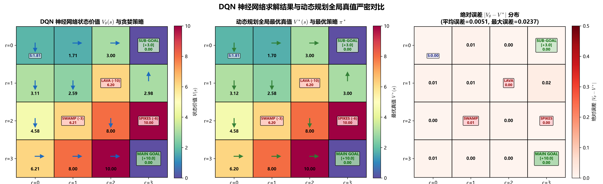

# 深度强化学习 DQN、经验回放与死亡三角 (Deep Q-Networks, Replay Buffer & Deadly Triad)

> **专题归属**：`RL_Foundations` 核心学习体系  
> **专题目录**：`04_Deep_Q_Networks_DQN`  
> **定位与目标**：从表格到深度神经网络函数逼近：致命三元组 (Deadly Triad) 的数学成因与发散灾难、经验回放池 (Experience Replay) 消除样本时序相关性、目标网络 (Target Network) 冻结自举目标。

---

## 目录结构导航

```
04_Deep_Q_Networks_DQN/
├── README.md               # [当前文档] 专题学习与运行导航
├── docs/                   # 理论讲义与详尽实验分析报告 (*.md)
├── src/                    # 核心算法实现与绘图组件 (*.py)
├── experiments/            # 独立可执行的实验脚本 (*.py)
├── logs/                   # 真实实验运行输出与数值日志 (*.txt, *.log)
└── images/                 # 出版级高清图表、动态动画与大盘 (*.png, *.gif)
```

---

## 1. 核心理论讲义 (Docs)
- [`Experience_Replay_and_Deadly_Triad.md`](docs/Experience_Replay_and_Deadly_Triad.md)：经验回放机制、马尔可夫时序自相关消除与致命三要素破局实证。
- [`DQN_Extensions_and_Rainbow_Architecture.md`](../../DQN_Extensions_and_Rainbow_Architecture.md)：DQN 扩展算法全景图谱（Double DQN、Dueling、PER、n-step、Distributional C51/QR-DQN、NoisyNet 及 Rainbow 消融动力学）。

## 2. 算法源码 (Source Code)
- [`dqn.py`](src/dqn.py)
- [`plot_dqn.py`](src/plot_dqn.py)

## 3. 实验脚本 (Experiments)
- [`exp5_dqn.py`](experiments/exp5_dqn.py)

## 4. 真实运行日志 (Logs)
- [`dqn_results.txt`](logs/dqn_results.txt)

## 5. 高清成果图表与动态动画 (Images & Visualizations)
### 图表成果：`dqn_training_curves.png`


### 图表成果：`dqn_policy_and_q_heatmap.png`



