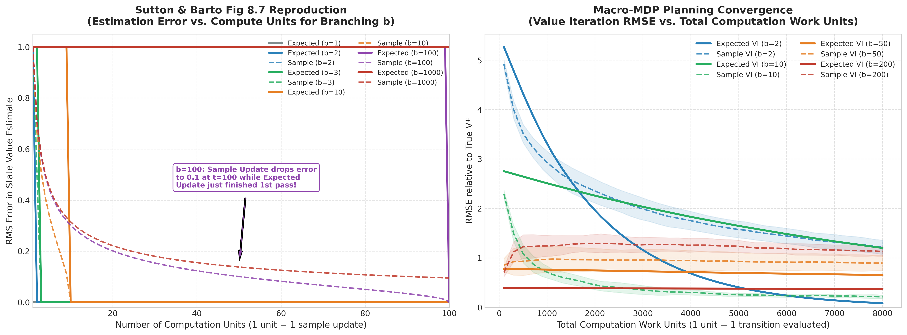
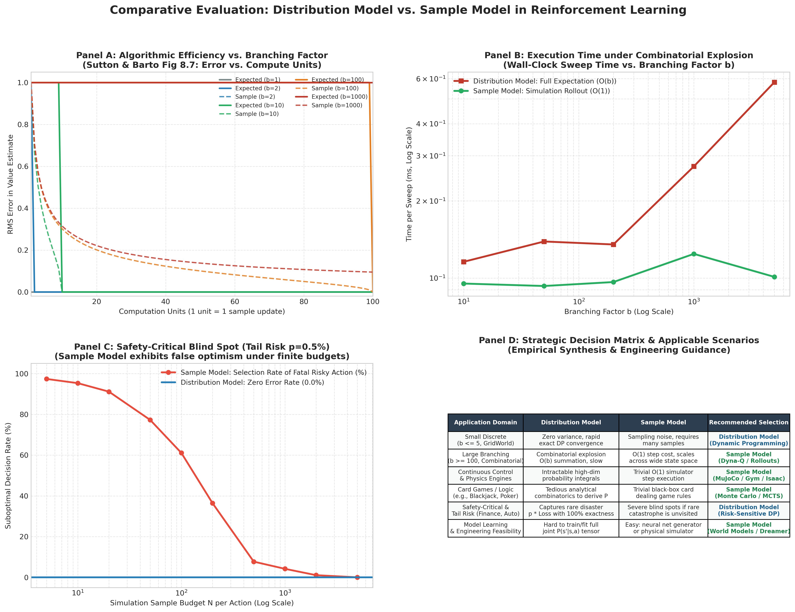

# 分布模型 vs 样本模型全维度实证对比 (Distribution Model vs Sample Model Benchmark)

> **专题归属**：`RL_Foundations` 核心学习体系  
> **专题目录**：`05_Distribution_vs_Sample_Models`  
> **定位与目标**：强化学习环境建模分水岭：分布模型（全概率转移矩阵、多重积分期望更新）vs 样本模型（抽样生成单次转移、常数开销 O(1)）。实测 Sutton Fig 8.7 分界线、高分支因子组合时间爆炸与极小概率高危陷阱盲区。

---

## 目录结构导航

```
05_Distribution_vs_Sample_Models/
├── README.md               # [当前文档] 专题学习与运行导航
├── docs/                   # 理论讲义与详尽实验分析报告 (*.md)
├── src/                    # 核心算法实现与绘图组件 (*.py)
├── experiments/            # 独立可执行的实验脚本 (*.py)
├── logs/                   # 真实实验运行输出与数值日志 (*.txt, *.log)
└── images/                 # 出版级高清图表、动态动画与大盘 (*.png, *.gif)
```

---

## 1. 核心理论讲义 (Docs)
- [`Distribution_Model_vs_Sample_Model.md`](docs/Distribution_Model_vs_Sample_Model.md)

## 2. 算法源码 (Source Code)
- [`model_comparison.py`](src/model_comparison.py)
- [`plot_model_comparison.py`](src/plot_model_comparison.py)

## 3. 实验脚本 (Experiments)
- [`exp6_distribution_vs_sample_model.py`](experiments/exp6_distribution_vs_sample_model.py)

## 4. 真实运行日志 (Logs)
- [`model_comparison_results.txt`](logs/model_comparison_results.txt)

## 5. 高清成果图表与动态动画 (Images & Visualizations)
### 图表成果：`distribution_vs_sample_branching_budget.png`



### 图表成果：`distribution_vs_sample_combinatorial_time.png`


### 图表成果：`distribution_vs_sample_rare_trap.png`


### 图表成果：`distribution_vs_sample_comprehensive_dashboard.png`



