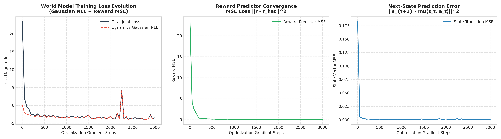
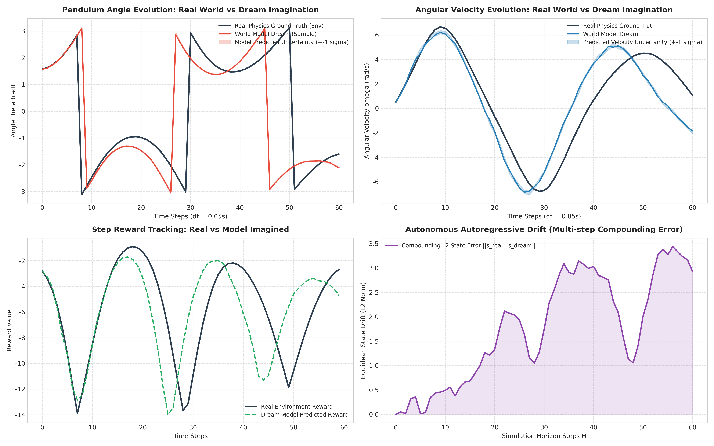
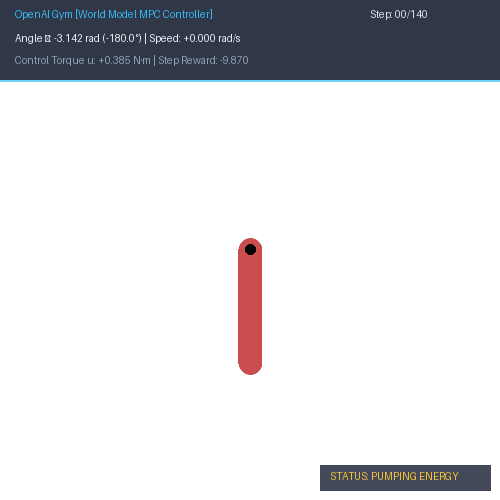
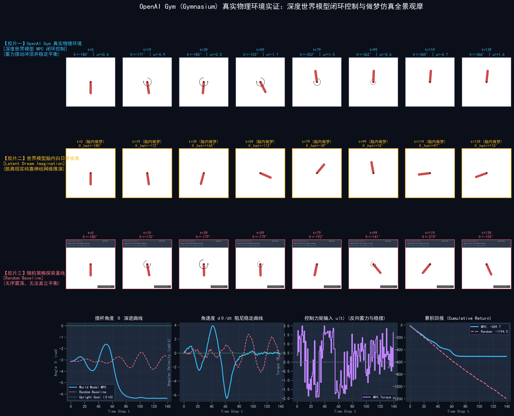

# 深度高斯世界模型、脑内做梦推演与 OpenAI Gym 物理实证 (Deep World Models & OpenAI Gym)

> **专题归属**：`RL_Foundations` 核心学习体系  
> **专题目录**：`06_Deep_World_Models_and_Gym`  
> **定位与目标**：连续控制下的深度世界模型：高斯概率转移网络、重参数化采样、高斯 NLL 损失反向传播、60 平行宇宙粒子滤波、GPU 矢量化 MPC 模型预测控制；接入 OpenAI Gym (Gymnasium) 连续倒立摆物理环境，实现影子环境做梦投影与三大高动态实证动画。

---

## 目录结构导航

```
06_Deep_World_Models_and_Gym/
├── README.md               # [当前文档] 专题学习与运行导航
├── docs/                   # 理论讲义与详尽实验分析报告 (*.md)
├── src/                    # 核心算法实现与绘图组件 (*.py)
├── experiments/            # 独立可执行的实验脚本 (*.py)
├── logs/                   # 真实实验运行输出与数值日志 (*.txt, *.log)
└── images/                 # 出版级高清图表、动态动画与大盘 (*.png, *.gif)
```

---

## 1. 核心理论讲义 (Docs)
- [`Deep_World_Model_Simulation_Report.md`](docs/Deep_World_Model_Simulation_Report.md)

## 2. 算法源码 (Source Code)
- [`deep_world_model.py`](src/deep_world_model.py)
- [`plot_world_model.py`](src/plot_world_model.py)
- [`gym_world_model_showcase.py`](src/gym_world_model_showcase.py)

## 3. 实验脚本 (Experiments)
- [`exp7_deep_world_model_simulation.py`](experiments/exp7_deep_world_model_simulation.py)
- [`exp8_gym_world_model_showcase.py`](experiments/exp8_gym_world_model_showcase.py)

## 4. 真实运行日志 (Logs)
- [`deep_world_model_results.txt`](logs/deep_world_model_results.txt)
- [`gym_world_model_showcase.txt`](logs/gym_world_model_showcase.txt)

## 5. 高清成果图表与动态动画 (Images & Visualizations)
### 图表成果：`world_model_training_curves.png`



### 图表成果：`world_model_dream_vs_real.png`



### 图表成果：`world_model_parallel_universes.png`


### 图表成果：`world_model_mpc_control.png`


### 图表成果：`world_model_master_dashboard.png`


### 动态动画：`gym_pendulum_mpc_control.gif`



### 动态动画：`gym_comparison_random_vs_mpc.gif`


### 动态动画：`gym_real_vs_dream.gif`


### 图表成果：`gym_pendulum_master_showcase.png`



