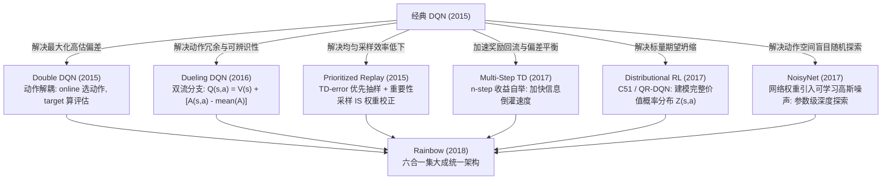

# 深度强化学习进阶：DQN 扩展算法全景图谱与 Rainbow 彩虹架构白盒解密

> **归属模块**：`RL_Foundations`  
> **更新策略**：增量追加（严格遵守 Zero-Shrinkage 协议）  
> **面向对象**：人工智能专业深度强化学习理论推导、病态病理剖析与前沿工程落地指南

---

## 目录 (Table of Contents)
- [1. 学习记录流水线 (Changelog)](#1-学习记录流水线-changelog)
- [2. 认知纠偏与系统病理视界：为什么经典 DQN 必须被外科手术式改造？](#2-认知纠偏与系统病理视界为什么经典-dqn-必须被外科手术式改造)
  - [2.1 致命认知死角：“扩展算法只是工程调优的 Tricks 拼盘吗？”](#21-致命认知死角扩展算法只是工程调优的-tricks-拼盘吗)
  - [2.2 经典 DQN 的六大固有理论病理与算子缺陷矩阵](#22-经典-dqn-的六大固有理论病理与算子缺陷矩阵)
- [3. 经典 DQN 六大核心扩展算法深度拆解与数学推导](#3-经典-dqn-六大核心扩展算法深度拆解与数学推导)
  - [3.1 Double DQN：破除贝尔曼最大化算子的高估偏差 (Overestimation Bias)](#31-double-dqn破除贝尔曼最大化算子的高估偏差-overestimation-bias)
    - [3.1.1 [2026-09-11] 深度通俗解密：从“裁判兼运动员”到“交叉复核”——DDQN 的解耦全景透视](#311-2026-09-11-深度通俗解密从裁判兼运动员到交叉复核ddqn-的解耦全景透视)
    - [3.1.2 [2026-09-11] 灵魂拷问：DDQN 真的只是“多加一层保险”吗？为什么多迭代并不能拯救经典 DQN？](#312-2026-09-11-灵魂拷问ddqn-真的只是多加一层保险吗为什么多迭代并不能拯救经典-dqn)
  - [3.2 Dueling DQN：状态价值与优势函数的结构解耦与可辨识性校正](#32-dueling-dqn状态价值与优势函数的结构解耦与可辨识性校正)
  - [3.3 优先经验回放 (Prioritized Experience Replay, PER)：非均匀采样与重要性采样校正](#33-优先经验回放-prioritized-experience-replay-per非均匀采样与重要性采样校正)
  - [3.4 多步学习 (Multi-Step Learning / $n$-step DQN)：偏差-方差折中与波前倒灌提速](#34-多步学习-multi-step-learning--n-step-dqn偏差-方差折中与波前倒灌提速)
  - [3.5 分布式强化学习 (Distributional RL: C51 & QR-DQN)：打破期望坍缩，拥抱随机本质](#35-分布式强化学习-distributional-rl-c51--qr-dqn打破期望坍缩拥抱随机本质)
    - [3.5.1 [2026-09-11] 深度质问：如果最终决策还看均值，多花50倍算力学概率分布究竟起到了什么神仙作用？](#351-2026-09-11-深度质问如果最终决策还看均值多花50倍算力学概率分布究竟起到了什么神仙作用)
  - [3.6 噪声网络 (Noisy Networks for Exploration)：从动作空间盲目抖动到参数空间一致性探索](#36-噪声网络-noisy-networks-for-exploration从动作空间盲目抖动到参数空间一致性探索)
- [4. 终极集大成者：Rainbow (彩虹模型) 架构整合与消融动力学](#4-终极集大成者rainbow-彩虹模型-架构整合与消融动力学)
  - [4.1 六合一完整集成拓扑](#41-六合一完整集成拓扑)
  - [4.2 深度消融实验 (Ablation Analysis) 启示录：谁是真正的核心支柱？](#42-深度消融实验-ablation-analysis-启示录谁是真正的核心支柱)
- [5. 专业实战测评题库 (含采分点与硬核解析)](#5-专业实战测评题库-含采分点与硬核解析)
- [6. 极简复习闪卡 (CheatSheet)](#6-极简复习闪卡-cheatsheet)

---

## 1. 学习记录流水线 (Changelog)
- **2026-09-09**：系统构建 DQN 扩展算法全景图谱。彻底破除“扩展算法是零散 Tricks 堆叠”的浅层心智模型；从数学公理、凸函数琴生不等式、不可辨识性、测度漂移、分布收缩及信息熵探索等底层维度，严密推解 Double DQN、Dueling DQN、PER、Multi-step、Distributional RL (C51/QR-DQN) 与 NoisyNet 的病理成因与破局算法；详细解构 Rainbow 统一架构及消融贡献矩阵。
- **2026-09-11（Double DQN 解耦机制深度追加）**：增补第 3.1.1 节，建立“裁判兼运动员与交叉复核”心智模型，彻底讲透为什么单纯取 Max 必然导致正向过估计；设计三动作具体数值仿真，白盒对比经典 DQN 的虚高盲从与 DDQN 的泡沫刺破过程；剖析非均匀过估计对贪婪决策排名的毁灭性破坏；给出 PyTorch 代码级两行核心解耦对照。
- **2026-09-11（反直觉反思与实证论证追加）**：增补第 3.1.2 节，迎头痛击“多迭代能自愈”的致命错觉，解构神经网络自举与泛化形成的“正反馈吸毒妄想闭环 (Delusion Loop)”；以毒地图为喻，证明 DDQN 修正动作相对排序、让真金好动作浮出水面的核心价值；列举 DeepMind Atari 实测 Q 值膨胀至 1000% 导致策略崩塌与 DDQN 分数翻倍的权威实证数据。
- **2026-09-11（分布式强化学习灵魂质问追加）**：增补第 3.5.1 节，彻底剖析“期望坍缩”抹杀风险结构与多模态的数学本质；解答“为何决策看均值却要花50倍算力学分布”的核心迷思，揭示辅助表征学习梯度暴增 50 倍、瓦解双峰伪均值优化振荡、Wasserstein 收敛映射保证与 CVaR 风险敏感安全决策四大降维打击机制；结合 Rainbow 消融实证阐明其贡献断层第一的底层逻辑。
- **2026-09-11（概念严正纠偏与收敛性本源厘清）**：针对多模态直觉示例进行外科手术式纠偏，彻底剔除将“不同动作分支”混为一谈的错误表述，正本清源确立“单动作内部环境固有随机性与长期轨迹分支”的多模态物理本质；严密剖析特征判别力暴涨如何解决“表征坍缩与决策边界噪声翻转”；从巴拿赫不动点定理与误差指数衰减维度，拨乱反正“收缩映射非探索抑制，而是算子收敛生命线”的核心数学内涵。

---

## 2. 认知纠偏与系统病理视界：为什么经典 DQN 必须被外科手术式改造？

### 2.1 致命认知死角：“扩展算法只是工程调优的 Tricks 拼盘吗？”

> [!CAUTION]
> **严重认知死角**：许多深度强化学习初学者把 Double DQN、Dueling、PER、C51 等算法视为“炼丹玄学”或“大厂为了刷榜拼凑的工程技巧 (Tricks)”。  
>
> **严厉直接纠偏**：**这种看法完全脱离了数学本质！经典 DQN (Mnih et al., 2015) 是一个在理论上处处充满“妥协”的原型机。它的贝尔曼最优算子、网络结构拓扑、经验抽取测度、收益统计量以及探索机制，每一处都存在严重的数学或统计学缺陷！每一个扩展算法，都是针对经典 DQN 某个特定数学病理实施的精准外科手术！**

### 2.2 经典 DQN 的六大固有理论病理与算子缺陷矩阵

| 经典 DQN 维度 | 固有病理 / 理论缺陷 | 诱发机制 / 数学根源 | 对应外科手术扩展算法 |
| :--- | :--- | :--- | :--- |
| **动作评估机制** | **系统性高估偏差 (Overestimation)** | $\max$ 算子与琴生不等式 (Jensen's Inequality)，噪声导致期望正向偏移 | **Double DQN (DDQN)** |
| **网络输出架构** | **动作无差别状态下的学习低效性** | 全连接层强制耦合 $Q(s, a)$，无法在不探索各动作时更新状态底色价值 $V(s)$ | **Dueling DQN** |
| **经验抽取机制** | **均匀采样的盲目性与低效性** | $\mathcal{U}(\mathcal{D})$ 将高信息量突破性样本与平庸无价值样本同等对待 | **Prioritized Experience Replay (PER)** |
| **时序差分步长** | **单步波前推进极慢、受局部方差拖累** | $n=1$ 时奖励信号每回合只能逆流 1 步，受自举偏差严重拖累 | **Multi-Step Learning ($n$-step)** |
| **价值建模本质** | **期望坍缩 (Expectation Collapse)** | 用单一标量均值 $\mathbb{E}[Z]$ 抹杀多模态分布与环境内生固有随机性 | **Distributional RL (C51 / QR-DQN)** |
| **空间探索机制** | **动作空间抖动、缺乏时序一致性** | $\epsilon$-greedy 纯属单步白噪声随机游走，高维状态下几乎无法触碰深层奖励 | **Noisy Networks (NoisyNet)** |

---

## 3. 经典 DQN 六大核心扩展算法深度拆解与数学推导



---

### 3.1 Double DQN：破除贝尔曼最大化算子的高估偏差 (Overestimation Bias)

#### (1) 为什么经典 DQN 会发生系统性高估？
经典 DQN 的目标值为：
$$Y_t^{\text{DQN}} = R_{t+1} + \gamma \max_{a \in \mathcal{A}} Q(S_{t+1}, a; \theta^-)$$
这里的核心毒瘤是：**$\max$ 算子同时充当了“动作选择器”与“价值评估器”！**

设某个真实动作价值为 $Q_{\text{true}}(s, a)$，神经网络对它的估计包含均值为 0 的无偏估计噪声 $\epsilon_a$（源于函数逼近误差、随机梯度下降震荡等）：
$$Q(s, a) = Q_{\text{true}}(s, a) + \epsilon_a, \quad \mathbb{E}[\epsilon_a] = 0$$
当我们对一组带有噪声的估计值取最大值时，根据凸函数性质与**琴生不等式 (Jensen's Inequality)**：
$$\mathbb{E} \left[ \max_{a} Q(s, a) \right] \ge \max_{a} \mathbb{E} \left[ Q(s, a) \right] = \max_a Q_{\text{true}}(s, a)$$
> **直观物理例证**：
> 假设某个状态下所有动作的真实价值都是 $0.0$。网络在训练中由于噪声，分别估计四个动作为 $[-0.5, +0.3, -0.2, +0.6]$。
> 真实的理论最大值是 $0.0$，但 $\max$ 算子会无情地挑出 $+0.6$！
> 即使噪声无偏，$\max$ 算子也永远在挑选“向上偏差最大的那个值”，导致 **$Q$ 值产生单调递增的正向系统性漂移 (Systematic Positive Bias)**。
> 这个被高估的目标值又作为下一轮更新的基准（自举 Bootstrapping），滚雪球般导致整个网络的价值估计脱离真实物理约束。

#### (2) Double DQN 的解耦手术 (Decoupling)
Double DQN (van Hasselt et al., 2015) 提出了精妙的**双网解耦法则**：
* **当前在线网络 (Online Network, $\theta_t$)**：负责**选择**具有最大估计值的动作；
* **目标网络 (Target Network, $\theta_t^-$)**：负责**评估**该动作的实际价值。

$$
a^* = \arg\max_{a \in \mathcal{A}} Q(S_{t+1}, a; \theta_t)
$$

$$
Y_t^{\text{DoubleQ}} = R_{t+1} + \gamma Q(S_{t+1}, a^*; \theta_t^-)
$$

合并写为紧凑形式：

$$
Y_t^{\text{DoubleQ}} = R_{t+1} + \gamma Q\left(S_{t+1}, \arg\max_{a} Q(S_{t+1}, a; \theta_t); \theta_t^-\right)
$$

* **为什么能消除高估？**
  即使在线网络 $\theta_t$ 因为噪声错误地高选了某个动作 $a^*$，目标网络 $\theta_t^-$ 的参数与 $\theta_t$ 是延迟解耦的，它在 $a^*$ 上的估计值很大概率并没有刚好出现正向极端噪声。评估值的期望重新回归无偏性！

---

#### 3.1.1 [2026-09-11] 深度通俗解密：从“裁判兼运动员”到“交叉复核”——DDQN 的解耦全景透视

很多初学者在复习 Double DQN 时，最大的困惑是：“原版 DQN 不就已经有 Target 网络了吗？DDQN 到底解耦了什么？怎么换个写法就能解决过估计？”

##### 1. 通俗心智模型：“既当运动员又当裁判”为什么必定诱发吹牛膨胀？
想象一场招聘面试，有 3 位候选人（动作 $a_1, a_2, a_3$），其实三人的真实能力完全一模一样，真实水平都是 60 分（$Q_{\text{true}} = [60, 60, 60]$）。
*   **面试考核存在测量随机误差（神经网络噪声）**：
    由于发挥失常或超常，面试官 $A$（网络参数 $\theta^-$）给出的测试打分分别出现了随机抖动：
    $$\text{测试得分} = [55, 75, 50]$$
*   **经典 DQN 的致命操作（自选自评）**：
    经典 DQN 此时直接执行：$\max_{a'} Q(S', a'; \theta^-)$。
    - **选谁？** 面试官 $A$ 挑出了得分最高的“幸运儿” $a_2$（75分）；
    - **给多少分？** 面试官 $A$ 直接拍板：“这个岗位的未来价值就按 **75 分** 计入更新！”
    - **荒谬之处**：$a_2$ 的能力根本没有 75 分，它只是恰好蒙中了正向噪声！但由于**选人和打分都是面试官 $A$ 一个人说了算**，$\max$ 算子天然充当了“正向极端噪声放大器”，系统性地挑出虚高异常值，导致分数越传越高，产生巨大的**虚高泡沫（Overestimation Bias）**。

##### 2. 纯数值微观推演：DDQN 如何用“交叉复核”戳破泡沫？
Double DQN 的核心洞察是：**绝对不能让同一个人既负责“选出最优动作”，又负责“评估这个动作的价值”！必须引入两套独立参数进行交叉复核！**

在深度强化学习中，我们手里恰好有两套网络参数：
1. **当前在线网络 $\theta$ (Online Network)**：每一拍都在梯度更新，参数最新；
2. **目标网络 $\theta^-$ (Target Network)**：几千步才硬拷贝同步一次，参数相对滞后、独立。

让我们看 DDQN 如何处理上述三位候选人：
*   **第一步：在线网络 $\theta$ 负责【选拔动作】（选出它认为最好的候选人）**
    假设在线网络 $\theta$ 测出的分数是 $[72, 58, 61]$。
    在线网络选出动作：
    $$a^* = \arg\max_{a} Q(S', a; \theta) = a_1$$
    *(在线网络认为 $a_1$ 是第一名)*
*   **第二步：目标网络 $\theta^-$ 负责【独立打分】（不让你自己打分，换另一个人来复核）**
    此时我们**绝对不看**在线网络给 $a_1$ 吹的 72 分，而是把 $a_1$ 牵到目标网络 $\theta^-$ 面前，让目标网络独立给它打分：
    假设目标网络给出的评分数组依然是之前那个 $[55, 75, 50]$。
    目标网络复核打分：
    $$Q(S', a^*; \theta^-) = Q(S', a_1; \theta^-) = \mathbf{55}$$
*   **奇迹发生了**：
    - 经典 DQN 得到的更新基准是 **75**（极端虚高被全盘采纳）；
    - Double DQN 得到的更新基准是 **55**（由于两个网络的噪声是统计独立的，在线网络虚高的 $a_1$，在目标网络眼里恰好并不虚高，虚高泡沫被瞬间戳破！）。

```mermaid
sequenceDiagram
    autonumber
    participant Online as 在线网络 θ (Online Network)
    participant Decision as 动作解耦仲裁器
    participant Target as 目标网络 θ^- (Target Network)

    Note over Online: 输入后继状态 S_{t+1}
    Online->>Decision: argmax_a Q(S_{t+1}, a; θ) -> 挑出最优动作 a* (仅提供动作索引)
    Note over Decision: 锁定动作 a*，禁止使用 θ 的估值！
    Decision->>Target: 查询目标网络: Q(S_{t+1}, a*; θ^-)
    Note over Target: 独立评估 a* 的数值，粉碎单一正向噪声
    Target-->>Decision: 输出无偏的评估得分
```

##### 3. 为什么“过估计”是致命的？（非均匀高估对决策的毁灭性摧毁）
有的同学会问：“如果所有动作都被高估了，大家都多加 10 分，相对大小不还是没变吗？为什么会影响决策？”
*   **真相：高估绝不是均匀的，而是“非均匀严重畸变 (Non-uniform Overestimation)”！**
*   有的动作被探索得少，方差极大，被虚高了 $+50$ 分；真正的好动作被探索得多，估计准，只虚高了 $+2$ 分。
*   结果就是：**一个原本极度危险的烂动作（真实价值 -10），因为偶然撞大运被估计成了 +40，直接篡位超越了真正的好动作（真实价值 +30）！**
*   由于强化学习依赖自举（Bootstrapping），这个错误的贪婪动作会被当成“真理”向所有前驱状态回传，引发整个价值网络的雪崩和策略劣化。

##### 4. PyTorch 白盒代码两行对比（解耦真身一目了然）
在实际写 DQN 和 Double DQN 时，两者的代码差异极其微小，却带来了质的理论飞跃：

```python
# ==================== 1. 经典 DQN (同网选评，高估元凶) ====================
# target_net 既负责选最大动作，又负责给该动作打分
# 相当于直接对 target_net 的输出张量求 max(1)[0]
next_q_values = target_net(next_states).max(1)[0].unsqueeze(1)
target_q = rewards + gamma * next_q_values * (1 - dones)

# ==================== 2. Double DQN (双网解耦，交叉复核) ====================
# 第一步：在线网络 policy_net 仅负责【选择动作索引】 (argmax)
next_actions = policy_net(next_states).argmax(dim=1, keepdim=True)

# 第二步：目标网络 target_net 仅负责【按索引提取打分】 (gather)
next_q_values = target_net(next_states).gather(1, next_actions)

target_q = rewards + gamma * next_q_values * (1 - dones)
```

---

#### 3.1.2 [2026-09-11] 灵魂拷问：DDQN 真的只是“多加一层保险”吗？为什么多迭代并不能拯救经典 DQN？

初学者往往产生一种强烈的怀疑心智：
> *“DDQN 感觉只是多加了一层保险而已，没有帮助模型找到真正高价值的动作。如果经典 DQN 迭代步数足够多，大数定律和充分试错难道不能自然纠错、找到真正的高价值动作吗？DDQN 到底有什么不可替代的价值？”*

**直接下达结论：这种直觉在表格型学习中看似合理，但在深度强化学习（函数逼近）中是致命的错误！多迭代不仅救不了经典 DQN，往往反而是把经典 DQN 推向“策略崩塌与发散深渊”的元凶！**

##### 1. 致命病理一：为什么“多迭代”无法拯救经典 DQN？（正反馈妄想陷阱与致命三要素）
很多同学误以为“神经网络只要训练得够久，误差总会被抹平”。
但在深度 Q-Learning 中，存在一个恶性循环的**正反馈吸毒陷阱 (Positive Feedback Delusion Loop)**：
1. **虚假繁荣启动**：由于深度神经网络的泛化误差，某个毫无价值的烂动作 $a_{\text{bad}}$ 在某次梯度更新中偶然被高估到了 $+100$（真实价值为 $0$）；
2. **贝尔曼自举污染**：经典 DQN 的目标算子 $\max_{a'} Q(S', a'; \theta^-)$ 无条件采纳了这个 $+100$。所有能够通往该状态的前驱状态，其目标值全部被大幅拉高；
3. **策略被幻觉绑架**：由于贪婪策略只认 $\arg\max$，智能体狂热地相信“去执行 $a_{\text{bad}}$ 能带来巨大财富”，于是把绝大多数的探索和交互预算全部砸向了这个被虚高的烂动作；
4. **灾难性干扰与网络崩溃 (Catastrophic Interference)**：
   你以为只要它多跑几次，拿到环境真实反馈的 $0$，网络就会把它拉回 $0$ 吗？
   **错！** 神经网络是有容量限制的全局函数拟合器。为了把这个被自己自举推上天的荒谬目标（比如几百甚至几千）拟合下来，梯度下降会强行扭曲隐藏层的特征权重，导致**网络其他状态动作的估计被灾难性破坏**；
   接着，另一个未充分探索的烂动作又因为权重扭曲被偶然拉高到 $+200$，智能体又转头狂热追逐新的幻象！
5. **DeepMind 官方实验证据 (Nature / AAAI 2015)**：
   在 Atari 游戏实验中，van Hasselt 等人观测到：
   - 经典 DQN 预测的 $Q$ 值随着训练步数的增加，呈**指数级爆炸**（真实得分只有 20~50 分，网络估计的 $Q$ 值飙到了 500~1000 分以上）；
   - 训练步数越长，智能体的得分反而一路暴跌，甚至**完全退化为随机乱撞的瘫痪状态（Policy Collapse）**！
   - **多迭代不仅不能纠错，反而加速了数值发散（The Deadly Triad 发作）！**

##### 2. 致命病理二：DDQN 是“多加一层保险”，还是“赋予智能体寻找真理的眼睛”？
初学者说：“DDQN 只是避免走错路，没有找到真正有价值的动作。”
*   **反问**：如果一个士兵拿着一张**将雷区标记为藏宝地、将真正阵地标记为悬崖**的毒地图，他只要“多走几万步”，能走到真正的目的地吗？
*   **他只会以最高的速度、最坚定不移的步伐，精准踩进每一个雷区炸得粉身碎骨！**
*   **强化学习寻找高价值动作的前提是：排序信号 (Ranking) 必须具有物理保真度！**
    $$\pi(s) = \arg\max_{a} Q(s, a)$$
    智能体是否会去执行真正的好动作，**百分之百取决于好动作的估值是否高于其他动作**。
*   **非均匀高估是“逆淘汰机器”**：
    由于探索度低、方差大的危险动作最容易产生超高正向噪声，$\max$ 算子会系统性地把“高风险、高方差的投机垃圾动作”推选为第一名，而把“扎实稳定、低方差的真实优秀动作”踩在脚下。
*   **DDQN 的核心救赎**：
    DDQN 绝不是“软绵绵的保险”，它是**一把冷酷的手术刀**：
    - 它通过目标网络与在线网络的双向交叉复核，**强行把所有带有侥幸心理的虚高泡沫砍回原形**；
    - 只有当虚构的海市蜃楼被全部破除后，那些**真正能够稳定拿到物理奖励的高价值动作，才能在排序榜上浮出水面**！
    - **打破虚妄，真理才能显现；DDQN 救回了动作的正确排序，这才让智能体真正具备了“识别并坚持高价值动作”的可能！**

##### 3. DeepMind 实测消融量化实锤

| 评估维度 | 经典 DQN (单网自选自评) | Double DQN (双网解耦复核) | 工业级定性结论 |
| :--- | :--- | :--- | :--- |
| **Q 值估计偏差** | **高估高达 +500% ~ +2000%** (脱离物理现实) | **几乎 0 偏差** (紧密贴合真实累积得分) | DDQN 彻底治愈了价值膨胀病 |
| **训练长时间稳定性** | 后期极易发生**策略崩塌 (Collapse)**、得分跳水 | **单调平稳提升**，后期策略极度稳固 | 多迭代在 DDQN 上才真正有正面意义 |
| **Atari 49 款游戏综合得分** | 基准基线 (100%) | **平均表现跃升 +100% 以上**（分数翻倍） | 仅改动 2 行代码，带来翻倍的性能暴涨 |

---

### 3.2 Dueling DQN：状态价值与优势函数的结构解耦与可辨识性校正

#### (1) 物理直觉：有些状态下，选什么动作根本无关紧要！
在自动驾驶或许多经典游戏场景中：
* 当前方是一条极为空旷笔直的高速公路时，向左微调、向右微调或保持直线前进，其未来的累积回报几乎完全相同；此时起决定性作用的是“**身处安全开阔高速公路**”这一状态本身的底色价值 $V(s)$；
* 只有当即将撞车的一瞬间，向左猛打方向盘和向右猛打方向盘的细微动作差异才具有生死意义。

经典 DQN 强制网络独立输出每一个 $Q(s, a)$。当网络学习到某一个状态价值很高时，它必须分别把每一个动作都走一遍并更新对应的输出神经元，才能让所有 $Q(s, a)$ 都上升。这极度浪费样本！

#### (2) 架构分离：状态价值流 (Value) 与动作优势流 (Advantage)
Dueling 架构 (Wang et al., 2016) 将卷积层/特征提取层后继的全连接层**劈裂为两个独立的流 (Two Streams)**：
1. **状态价值流 $V(s; \theta, \beta)$**：输出一个标量，代表状态 $s$ 本身有多好；
2. **动作优势流 $A(s, a; \theta, \alpha)$**：输出一个 $|\mathcal{A}|$ 维向量，代表在状态 $s$ 下采取动作 $a$ 相比于平均水平能多得多少收益。

```
                    ┌─── 全连接流 ───> 标量 V(s) ──────────────┐
                    │                                          │
特征提取主干 ───────┤                                          ▼ 【组合算子】
                    │                                 Q(s,a) = V(s) + [A(s,a) - mean(A)]
                    └─── 全连接流 ───> 向量 A(s, a) ───────────┘
```

#### (3) 核心数学障碍：不可辨识性 (Identifiability Issue)
如果直接朴素相加：$Q(s, a) = V(s) + A(s, a)$，会引发严重的**解不唯一性**！
> 给定任意常数 $C$：
> 令 $V'(s) = V(s) + C$，同时令 $A'(s, a) = A(s, a) - C$。
> 结果 $Q(s, a) = V'(s) + A'(s, a) = V(s) + A(s, a)$ 完全不变！
> **后果**：网络在反向传播时根本不知道梯度该流向 $V$ 还是流向 $A$，$V$ 和 $A$ 丧失了各自真实的物理语义。

#### (4) 唯一性约束与中心化操作
为了强行确立唯一解，必须给 $A(s, a)$ 施加约束。

* **方案 A（理论最严格，但梯度脆弱）：强制最大值为 0**
  $$Q(s, a; \theta, \alpha, \beta) = V(s; \theta, \beta) + \left( A(s, a; \theta, \alpha) - \max_{a' \in \mathcal{A}} A(s, a'; \theta, \alpha) \right)$$
  此时对于最优动作 $a^*$，$A(s, a^*) - \max_{a'} A(s, a') = 0$，使得 $Q(s, a^*) = V(s)$。数学上极具美感，但 $\max$ 算子不可导且会导致梯度只流向当前优势最大的单条动作通道，训练极其震荡。

* **方案 B（工程黄金标准，均值中心化）：中心化优势均值归零**
  $$Q(s, a; \theta, \alpha, \beta) = V(s; \theta, \beta) + \left( A(s, a; \theta, \alpha) - \frac{1}{|\mathcal{A}|} \sum_{a' \in \mathcal{A}} A(s, a'; \theta, \alpha) \right)$$
  * 虽然此时 $V(s)$ 偏离了真实的数学最大值（变成了该状态下所有动作的平均价值），但**所有动作通道的梯度平滑流动**，训练具备无与伦比的数值稳定性！

---

### 3.3 优先经验回放 (Prioritized Experience Replay, PER)：非均匀采样与重要性采样校正

#### (1) 核心动机：信息量倾斜
经典 DQN 采用均匀随机采样 $\mathcal{U}(\mathcal{D})$，这相当于把所有经历一视同仁。但现实中：
* 智能体的大部分步数是在熟悉平庸的路径上游荡，TD 误差接近 0，网络从中学不到任何新梯度；
* 极少数发生重大转折（意外掉坑、首次通关）的样本具有巨大的 TD 误差，它们才是参数更新的核心燃料。

#### (2) 优先级度量与 SumTree 高速索引
PER (Schaul et al., 2015) 规定，样本 $i$ 的抽样概率正比于其绝对 TD 误差：
$$p_i = |\delta_i| + \epsilon, \quad P(i) = \frac{p_i^\alpha}{\sum_k p_k^\alpha}$$
* $\epsilon > 0$：微小常数，防止 TD 误差为 0 的样本被“判无期徒刑”再也无法被抽到；
* $\alpha \in [0, 1]$：平滑指数。$\alpha=0$ 退化为均匀采样，$\alpha=1$ 为完全按误差比例采样。
* **工程架构**：使用**线段树 / 求和树 (SumTree)**，将 $N$ 个样本的前缀和组织为二叉树，使单步抽取和叶子节点 TD 误差更新的复杂度从 $O(N)$ 降至 $O(\log N)$！

#### (3) 数学杀手锏：重要性采样 (IS) 偏差校正权重
非均匀抽样人为改变了状态访问频率（分布从平稳的经验分布变为了偏向高误差样本的非平稳分布），破坏了无偏梯度估计。必须利用重要性采样比率进行加权：
$$w_i = \left( \frac{1}{N} \cdot \frac{1}{P(i)} \right)^\beta$$
* 归一化权重：$\tilde{w}_i = \frac{w_i}{\max_j w_j}$；
* 损失函数修正为：
  $$\mathcal{L}_{\text{PER}}(\theta) = \sum_i \tilde{w}_i \cdot \delta_i^2$$
* **参数 $\beta$ 的退火机制**：
  训练初始阶段令 $\beta = 0.4$，允许一定偏差以换取高误差样本带来的剧烈梯度修正；随着训练推进，逐步线性退火至 $\beta = 1.0$，在模型收敛临界点实现完全无偏的严格数学收敛！

---

### 3.4 多步学习 (Multi-Step Learning / $n$-step DQN)：偏差-方差折中与波前倒灌提速

#### (1) 为什么单步 TD (TD(0)) 是低效的？
在之前的波前倒灌 (Wavefront Propagation) 理论中我们证明了：在单步 TD 中，奖励信号 $R$ 每经过一个 Episode 只能从终点逆向传播回推 1 步！
* 如果终点距离起点有 100 步，单步 TD 至少需要玩 100 局，终点的价值才能倒灌到起点！
* 单步 TD 严重依赖下一个状态的估计值 $Q(S_{t+1}, \cdot)$，如果初始阶段网络对 $S_{t+1}$ 估计极差，单步更新会被巨大的**自举偏差 (Bootstrapping Bias)** 严重误导。

#### (2) $n$-step 回报公式
将单步贝尔曼展开推向 $n$ 步：
$$R_t^{(n)} = \sum_{k=0}^{n-1} \gamma^k R_{t+k+1}$$
$$Y_t^{(n)} = R_t^{(n)} + \gamma^n \max_{a \in \mathcal{A}} Q(S_{t+n}, a; \theta^-)$$

#### (3) 偏差-方差权衡的连续谱系 (Bias-Variance Trade-off)
```
          1-step TD                                   n-step TD                                     Monte Carlo (MC)
    (高偏差，低方差，单步自举)                 (黄金折中平衡点, n=3~5)                          (零偏差，高方差，全轨迹无自举)
├─────────────────────────────────────────────┼─────────────────────────────────────────────┤
Bias: 最大                                    Bias: 中等                                    Bias: 0
Variance: 最小                                Variance: 中等                                Variance: 最大
倒灌速度: 极慢 (每轮1步)                      倒灌速度: 极快 (每轮n步)                      倒灌速度: 一步到位
```
* 当 $n=3$ 或 $n=5$ 时，智能体不仅能一口气跨越数步直接吞下真实的物理累积奖励，还能保持相对平稳的方差，通常能带来极其显著的收敛提速。

---

### 3.5 分布式强化学习 (Distributional RL: C51 & QR-DQN)：打破期望坍缩，拥抱随机本质

#### (1) 期望坍缩 (Expectation Collapse) 的认知灾难
传统强化学习的价值定义为累积回报的期望：$Q(s, a) = \mathbb{E}[G_t \mid S_t=s, A_t=a]$。
这在数学上是一个严重的**降维打击（有损压缩）**！

> **经典致命反例（期望陷阱）**：
> 设智能体面临两个完全不同的动作决策：
> * **动作 A**：确定性获得 $0$ 元收益；
> * **动作 B**：$50\%$ 概率获得 $+100$ 万元，$50\%$ 概率跌入悬崖粉身碎骨惩罚 $-100$ 万元。
> 在传统 Q 学习眼里：$\mathbb{E}[Q_A] = 0$，$\mathbb{E}[Q_B] = 0.5 \times (+100) + 0.5 \times (-100) = 0$。
> **传统 Q 学习判定这两个动作完全等价！**
> 任何关于环境的多模态分布、固有物理随机性、风险偏好，在期望算子下全部灰飞烟灭！

#### (2) 分布式贝尔曼算子 (Distributional Bellman Equation)
分布式强化学习 (Bellemare et al., 2017) 放弃标量 $Q(s, a)$，转而直接建模累积回报的完整随机变量 **$Z(s, a)$**：
$$Z(s, a) \stackrel{D}{=} R(s, a) + \gamma Z(S', A')$$
其中 $\stackrel{D}{=}$ 代表左右两边的**随机变量概率分布相等**！

#### (3) C51 算法：固定离散支撑集与投影 (Categorical DQN)
* 将价值范围划分为 51 个均匀离散支撑原子 (Atoms)：$\{z_1, z_2, \dots, z_{51}\}$（例如在 $[-10, +10]$ 之间均分）；
* 神经网络输出每个原子对应的 Softmax 概率向量 $p_i(s, a)$；
* 经过贝尔曼转移算子 $R + \gamma z_j$ 后的分布支撑点会错位，C51 通过向原始 51 个原子执行线性投影插值，最小化预测分布与目标分布之间的交叉熵 (Cross-Entropy) 或 KL 散度。

#### (4) QR-DQN：分位数回归破除人为原子约束 (Quantile Regression DQN)
C51 必须人工硬编码分布的上下界 $[-V_{\min}, V_{\max}]$，且投影算子在数学上不保距。
Dabney 等人 (2018) 提出了 **QR-DQN**：**固定分位数概率（均匀切分），让神经网络预测可变的分位数支撑点**，通过分位数 Huber 损失进行优化，在 1-Wasserstein 距离度量下严格证明了收缩映射收敛性！

---

#### (5) [2026-09-11] 深度质问：如果最终决策还看均值，多花50倍算力学概率分布究竟起到了什么神仙作用？

针对初学者最容易产生的心智困惑：
> *“既然智能体在真正下棋、玩游戏选动作时，大部分时候还是根据期望均值 $\arg\max_a \mathbb{E}[Z(s, a)]$ 去做决策，那我费尽心机多花 50 倍参数和显存去维护一个完整的概率分布直方图，到底有什么用？这不是脱裤子放屁、自找麻烦吗？”*

**直接下达结论：这是强化学习历史上最违反直觉、却又最震撼人心的研究发现之一！在 Rainbow (彩虹模型) 的官方消融实验中，如果从全部六大扩展组件中拿掉“分布式强化学习”，整个模型的性能会遭遇【断崖式暴跌（跌幅全场第一）】！**

它之所以强悍，根本原因在于它在**底层表征学习、优化曲面平滑度与风险决策**上带来了四大维度的降维打击：

##### 1. 核心杀招一：辅助表征学习 (Auxiliary Representation Learning) —— 为什么特征判别力暴涨对最终决策有实质性帮助？
很多初学者质疑：“既然最终动作选择依然是 $\arg\max_a \mathbb{E}[Z(s, a)]$，特征提取器学得再丰富，最后还不是压成一个均值，对决策有什么实质帮助？”
*   **实质帮助一：终结“表征坍缩 (Representation Collapse)”与状态混淆 (State Aliasing)**
    - 深度强化学习的根本瓶颈是**状态表征学习**。在标量 DQN 中，所有信息被压缩为一个 1 维标量 $Q(s, a)$。
    - 假设环境中有两个截然不同的状态 $S_A$（高风险悬崖边）和 $S_B$（平静安全草地），若它们在动作 $a$ 下的期望回报偶然相同（例如都是 $0$），标量梯度回传给共享骨干卷积层时，**完全没有任何梯度动力去把 $S_A$ 和 $S_B$ 映射到潜空间的两个不同向量**！特征提取层会将这两个在物理几何上大相径庭的状态混为一谈（即表征坍缩）。
    - 一旦特征混淆，在 $S_A$ 上更新动作 $a_1$ 的经验，就会灾难性地干扰破坏 $S_B$ 上的决策（Catastrophic Interference）。而在分布式 RL 中，$S_A$ 对应双峰分布（$-100$ 与 $+100$），$S_B$ 对应单峰分布（$0$），网络被 51 维分布监督强行逼迫在潜在表征中把它们分得一清二楚，**彻底阻断了不同状态间的灾难性干扰**！
*   **实质帮助二：提高决策边界 (Decision Boundary) 的分辨率，防止噪声淹没最优动作**
    - 在许多复杂任务中，最优动作 $a^*$ 与次优动作 $a_{\text{sub}}$ 的真实期望差异非常微弱（例如 $Q(s, a^*) = 10.05$ vs $Q(s, a_{\text{sub}}) = 10.00$）。
    - 标量 DQN 的网络表征粗糙，SGD 逼近噪声和函数逼近误差轻松超过 $0.05$，导致 $\arg\max$ 的动作排名在训练中疯狂翻转抖动；
    - 分布式 RL 提取了高阶矩（方差、偏度、极端分位数分界线），在更鲁棒、正交的特征几何空间中计算均值，使得期望值的逼近误差方差大幅衰减，**最优动作的相对排序在决策边界处极度锐利且稳定，不再被逼近噪声轻易篡位**！
*   **实质帮助三：51 个能级密集梯度流，破除稀疏奖励下的梯度弥散**
    - 传统标量 TD 误差在大部分步数下数值极小，骨干网络长时间接收不到有效更新信号；
    - 分布式 RL 的 51 个原子相当于在 51 个不同回报能级上进行多任务辅助监督，即使总期望变化不大，分布形状的微调也能持续向底层卷积层注入高质量梯度，让特征提取器在探索初期迅速形成成熟的场景理解能力。

##### 2. 核心杀招二：瓦解“单动作内生多模态伪均值优化陷阱” (Multimodality & Bimodal Trap)
> [!WARNING]
> **概念严正纠偏**：多模态并不是指“在十字路口向左走和向右走两个不同动作的混合”，因为 $Q(s, a)$ 天然是条件于**单一特定动作 $a$** 的，向左和向右各自拥有独立的网络输出分支，模型几轮迭代后自然能通过 $\arg\max$ 选出更好的那个动作！  
> **多模态的真正物理根源，存在于【同一个动作内部的环境固有随机性】或【后续长期轨迹的分支随机性】！**

*   **单动作内部的真实多模态场景**：
    设智能体处于状态 $S$（例如面对一个神秘宝箱或处于部分可观测 POMDP 环境中），智能体执行**同一个动作 $a$（开箱）**：
    - 环境以 $50\%$ 的物理随机概率开出钻石（回报 $+10$）；
    - 环境以 $50\%$ 的物理随机概率开出炸弹（回报 $-10$）。
*   **标量 DQN 的优化悲剧（均值振荡）**：
    该动作的真实期望回报是 $0$。经典标量 DQN 强制输出层神经元拟合标量 $0$：
    - 采样到开出钻石的样本时，TD 误差将网络权重狠狠向 $+10$ 拉拽；
    - 下一步采样到开出炸弹的样本时，TD 误差又将网络权重狠狠向 $-10$ 猛踹；
    - 神经网络的参数在 $+10$ 和 $-10$ 两个极点之间剧烈振荡，SGD 梯度方差巨大，甚至导致前面共享层的特征被反复撕扯；更荒谬的是，网络最终妥协学出的标量 $0$，在真实物理世界中**根本是一个永远不可能发生的虚假回报**！
*   **分布式强化学习的降维包容**：
    C51 / QR-DQN 不去逼迫网络拟合中间均值，而是让概率网络在 $-10$ 处分配 $0.5$ 概率、在 $+10$ 处分配 $0.5$ 概率。
    - **目标分布完全是平稳、静态的！**
    - 每次采样到 $+10$ 或 $-10$，都是在对这个静态的双峰分布做经验估计，交叉熵损失或分位数损失的梯度平滑收敛，彻底根除了由于环境内生随机性导致的均值拟合振荡！

##### 3. 核心杀招三：Wasserstein 测度下的收缩映射保证（它到底起什么作用？是限制探索吗？）
> [!NOTE]
> **核心认知纠偏**：“收缩映射 (Contraction Mapping)”是泛函分析与度量空间中的纯数学收敛性性质，**它与强化学习的“探索 (Exploration) vs 利用 (Exploitation)”没有任何关系，绝不是为了让模型变得保守、不敢探索！**  
> 探索机制完全由行为策略（如 $\epsilon$-greedy、NoisyNet、熵正则化）控制，智能体即便进行 100% 盲目随机探索，底层的贝尔曼更新依然可以是收缩映射。

*   **收缩映射的真正作用：算子迭代的收敛生命线与误差衰减保证**
    - 根据**巴拿赫不动点定理 (Banach Fixed-Point Theorem)**，一个算子 $\mathcal{T}$ 只有满足收缩映射性质（在某种度量距离 $d$ 下，满足 $d(\mathcal{T}X_1, \mathcal{T}X_2) \le \gamma d(X_1, X_2), \; \gamma < 1$），才能**百分之百保证重复迭代后必定收敛到唯一的真实不动点（真实价值）**！
    - **防止误差自举爆炸 (Error Attenuation)**：在自举学习中，每一步估计都带有神经网络逼近误差 $\epsilon_t$。收缩映射保证了前面的历史误差会以每步 $\gamma$ 的速度指数级衰减，而不是像雪崩一样无限放大导致网络数值爆炸（发散）。
*   **为什么分布式 RL 必须强调 Wasserstein 收缩映射？**
    - 在标量 DQN 中，贝尔曼算子在无穷范数 $\|\cdot\|_\infty$ 下是天然收缩的；
    - 但在分布式 RL 中，我们面对的是**概率分布**！如果用常见的 KL 散度或全变差距离 (Total Variation) 来度量两个分布，贝尔曼分布算子**根本不是收缩映射**（KL 散度在环境转移下可能被放大）！这就意味着如果乱用距离度量，学习分布很可能会发生灾难性的数学发散；
    - Bellemare 等人（2017）的突破性理论贡献，正是证明了分布式贝尔曼算子在 **$p$-Wasserstein 距离（推土机距离 Earth Mover's Distance）** 下是**严格的 $\gamma$-收缩映射**！这为“直接在神经网络中学习回报概率分布”提供了无懈可击的数学公理级收敛地基！

##### 4. 核心杀招四：打破风险中性枷锁——从盲目贪婪到 CVaR 安全控制
谁说分布式决策只能看均值？一旦拥有了完整概率分布 $Z(s, a)$，智能体就获得了上帝视角般的**风险控制自由度**：
*   **条件在险价值 (CVaR / Conditional Value at Risk)**：
    在自动驾驶、高频量化金融、医疗辅助等“绝对不能承受极端事故”的场景中，我们可以直接命令策略：
    $$\pi(s) = \arg\max_{a} \text{CVaR}_{\alpha}(Z(s, a))$$
    优先选择“在最倒霉的 $5\%$ 最坏情况下，预期损失依然最小”的安全动作！这是任何传统标量强化学习在数学上永远无法实现的超能力。

---

### 3.6 噪声网络 (Noisy Networks for Exploration)：从动作空间盲目抖动到参数空间一致性探索

#### (1) $\epsilon$-greedy 的本质缺陷：单步白噪声
* $\epsilon$-greedy 是在外层输出层强行“掷骰子”随机选动作；
* 这是典型的**动作空间无记忆抖动 (Dithering in Action Space)**：第 $t$ 步向左走，第 $t+1$ 步可能随机掷到向右走，智能体在原地像布朗运动一样颤抖，根本无法深入探索需要连续执行十几步协调动作的高维环境。

#### (2) 噪声网络 (NoisyNet) 的数学机制：参数空间深度探索
NoisyNet (Fortunato et al., 2017) 将探索机制内化到神经网络的权重矩阵内部：
对于全连接层的一个线性变换 $y = Wx + b$，将其参数改造成**确定性均值 + 随机扰动**的形式：
$$y = (\mu^W + \sigma^W \odot \varepsilon^W) x + (\mu^b + \sigma^b \odot \varepsilon^b)$$
* $\mu^W, \mu^b$：可学习的权重均值；
* $\sigma^W, \sigma^b$：**可学习的噪声强度参数**！
* $\varepsilon^W, \varepsilon^b$：从零均值高斯分布 $\mathcal{N}(0, I)$ 中采样的不可控随机噪声向量。

#### (3) 核心威力：自适应与时间一致性 (Temporal Consistency)
1. **时序一致性探索**：在同一个回合中，神经网络的参数采样一次后在若干步内保持相对稳定，智能体表现出的是一种**带有连贯意图的策略探索**，而不是每一步都在掷骰子；
2. **噪声强度的梯度自适应退火**：随着网络对某个状态越来越有信心，反向传播算法会自动把该状态对应连接的 $\sigma$ 梯度驱动趋向于 0（即自动降低噪声），完全摆脱了人为设定 $\epsilon$ 衰减周期的粗暴工程束缚！

---

## 4. 终极集大成者：Rainbow (彩虹模型) 架构整合与消融动力学

### 4.1 六合一完整集成拓扑

DeepMind 在 2018 年发表的经典论文 *Rainbow: Combining Improvements in Deep Reinforcement Learning* (Hessel et al.) 中，将上述六大独立扩展技术完美熔铸为一个统一的终极智能体：

$$
\text{Rainbow} = \text{DQN} + \text{DDQN} + \text{Dueling} + \text{PER} + n\text{-step} + \text{Distributional (C51)} + \text{NoisyNet}
$$

* **DDQN**：解耦动作选择与价值评估，破除贝尔曼最大化高估偏差；
* **Dueling**：状态价值流与动作优势流分离解耦；
* **PER**：按 TD 误差优先采样并进行重要性采样权重校正；
* **$n$-step**：多步回报自举，加速有效奖励逆向倒灌；
* **Distributional (C51)**：建模收益随机变量的概率分布，避免标量期望坍缩；
* **NoisyNet**：网络参数引入可学习高斯扰动，实现时序一致性深度探索。

```
输入状态 S_t
     │
     ▼
[卷积特征提取主干 (带 NoisyNet 参数化高斯噪声)]
     │
     ├─────────────────────────────────────────────────┐
     ▼                                                 ▼
[状态价值流 V(s)] (51维原子分布)               [优势函数流 A(s, a)] (A x 51维原子分布)
     │                                                 │
     └────────────────────────┬────────────────────────┘
                              ▼
        [Dueling 概率原子聚合: Z(s, a)_i = V_i + (A_i - mean(A_i))]
                              │
                              ▼ 【在 51 个原子上输出每个动作的完整概率分布】
                     P(z_i | s, a)
                              │
                              ▼ 【期望加权求均值】
                     Q(s, a) = Σ z_i * P(z_i | s, a)
                              │
                              ├─> [Double DQN 逻辑: 用当前网络 argmax Q 选出最优动作 a*]
                              │
                              ▼
            [n-step 多步累积收益投影到目标网络 Target Network 分布]
                              │
                              ▼
        [计算分布交叉熵损失，按 PER 的重要性权重 w_i 加权更新网络梯度]
                              │
                              ▼
               [将新的 TD 误差回写至 SumTree 叶子节点]
```

---

### 4.2 深度消融实验 (Ablation Analysis) 启示录：谁是真正的核心支柱？

在 Atari 57 款基准游戏的残酷测试中，Rainbow 取得了压倒性的霸榜成绩。但更具学术价值的是论文中的**消融研究 (Ablation Study)**：每次拔掉六大组件中的任意一个，观察性能的塌陷程度：

```
Rainbow 性能消融下跌惨烈度排名 (从最致命到次要):
1. 拔掉 n-step Learning     ──> 【崩塌最惨烈】初始学习速度暴跌，前期探索效率归零！
2. 拔掉 Prioritized Replay  ──> 【崩塌严重】样本利用效率断崖式下跌，稀疏奖励游戏彻底阵亡！
3. 拔掉 Distributional RL  ──> 【影响深远】后期渐进性能上限大幅受限，稳定性降低！
4. 拔掉 NoisyNet            ──> 退化为 epsilon-greedy 后，探索受阻，某些特定游戏崩溃。
5. 拔掉 Dueling / Double    ──> 整体曲线平滑度受损，但抗压底线依然存在。
```

> [!IMPORTANT]
> **消融实验给出的三大核心认知反转：**
> 1. **前期提速双引擎**：**$n$-step Learning** 与 **Prioritized Replay** 是决定算法在早期能否快速启动并捕获有效信号的最关键推手；
> 2. **天花板决定者**：**Distributional RL** 并不显著改变策略提取的偏好，但它为网络特征表征提供了极度丰富的梯度监督信号，决定了智能体最终能达到的得分天花板；
> 3. **无缝共生性**：这六大技术在数学上分布于强化学习的六个正交维度（选择、结构、数据流、步长、概率测度、探索），彼此之间**不存在负向干扰，具有几乎完美的相长干涉与正向协同效应**！

---

## 5. 专业实战测评题库 (含采分点与硬核解析)

### 试题 1：Double DQN 与琴生不等式的高估数学证明题 (8分)
> **题目**：设在某个状态 $s$ 下，智能体有 $K$ 个可用动作，它们的真实动作价值均为常数 $V$，即 $Q^*(s, a_k) = V, \; \forall k \in \{1, \dots, K\}$。
> 假设神经网络当前的估计值包含零均值独立同分布的均匀噪声：
> $$Q(s, a_k) = V + \epsilon_k, \quad \epsilon_k \sim \text{Uniform}(-c, c), \; (c > 0)$$
> 1. （4分）求经典 DQN 贝尔曼目标中动作评估最大值项的数学期望 $\mathbb{E}\left[ \max_k Q(s, a_k) \right]$，并分析当动作数量 $K \to \infty$ 时的渐进高估极限；
> 2. （4分）证明使用 Double DQN（假设目标网络的估计噪声 $\epsilon'_k \sim \text{Uniform}(-c, c)$ 与当前网络独立）时，期望高估量严格为 0。

#### 采分点与硬核标准解答：
1. **第 1 小问（4分）**：
   * **概率分布推导（2分）**：
     令 $X_k = Q(s, a_k) = V + \epsilon_k$，其累积分布函数在 $[V-c, V+c]$ 上为：
     $$F(x) = P(X_k \le x) = \frac{x - (V - c)}{2c}$$
     令 $Y = \max_{1 \le k \le K} X_k$，其累积分布函数为：
     $$F_Y(y) = [F(y)]^K = \left( \frac{y - V + c}{2c} \right)^K$$
     对 $y$ 求导得到概率密度函数：
     $$f_Y(y) = \frac{K}{2c} \left( \frac{y - V + c}{2c} \right)^{K-1}$$
   * **期望积分求解与极限（2分）**：
     计算期望：
     $$\mathbb{E}[Y] = \int_{V-c}^{V+c} y \cdot f_Y(y) \, dy$$
     换元令 $u = \frac{y - V + c}{2c} \in [0, 1]$，则 $y = 2cu + V - c$，$dy = 2c \, du$：
     $$\mathbb{E}[Y] = \int_0^1 (2cu + V - c) \cdot K u^{K-1} \, du = V - c + 2cK \int_0^1 u^K \, du = V - c + 2c \frac{K}{K+1} = V + c \frac{K-1}{K+1}$$
     **结论**：高估偏差为 $+c \frac{K-1}{K+1} > 0$！当动作数 $K \to \infty$ 时，期望值收敛到 $V + c$。即使每个动作的噪声期望为 0，最大化算子也会产生高达 $+c$ 的最大正向高估！

2. **第 2 小问（4分）**：
   * **独立性与无偏证明（4分）**：
     在 Double DQN 中，选出的动作索引为 $k^* = \arg\max_k Q(s, a_k; \theta)$。
     该决策仅由当前网络噪声序列 $\{\epsilon_k\}$ 决定。
     目标网络的评估值为 $Q(s, a_{k^*}; \theta^-) = V + \epsilon'_{k^*}$。
     由于当前网络与目标网络相互独立，$\epsilon'_{k^*}$ 与 $k^*$ 相互独立：
     $$\mathbb{E} \left[ Q(s, a_{k^*}; \theta^-) \right] = \mathbb{E}[V] + \mathbb{E}[\epsilon'_{k^*}] = V + 0 = V$$
     **证毕**：Double DQN 的期望评估值严格等于真实值 $V$，系统性高估偏差被彻底归零！

---

### 试题 2：Dueling DQN 的可辨识性反向传播证明题 (7分)
> **题目**：考虑 Dueling DQN 的两种聚合公式：
> 公式 (1)：$Q_1(s, a) = V(s) + \left( A(s, a) - \max_{a'} A(s, a') \right)$
> 公式 (2)：$Q_2(s, a) = V(s) + \left( A(s, a) - \frac{1}{|\mathcal{A}|}\sum_{a'} A(s, a') \right)$
> 1. （3分）在离散反向传播中，分析公式 (1) 下优势函数 $A(s, a)$ 各分支的梯度流动特性，指出为什么它在实践中收敛极不稳定；
> 2. （4分）推导公式 (2) 下 $\frac{\partial Q_2(s, a)}{\partial V(s)}$ 与 $\frac{\partial Q_2(s, a)}{\partial A(s, a_i)}$ 的雅可比偏导，阐明为何公式 (2) 能保证所有分支参数的平滑梯度更新。

#### 采分点与硬核标准解答：
1. **第 1 小问（3分）**：
   * 设当前使得 $A$ 取得最大的动作是 $a^* = \arg\max_{a'} A(s, a')$。
   * 对于任意非最优动作 $a \neq a^*$：
     $$\frac{\partial Q_1(s, a)}{\partial A(s, a)} = 1, \quad \frac{\partial Q_1(s, a)}{\partial A(s, a^*)} = -1, \quad \frac{\partial Q_1(s, a)}{\partial A(s, a')} = 0 \; (\forall a' \neq a, a^*)$$
   * 而对于最优动作本身 $a = a^*$：$Q_1(s, a^*) = V(s) + (A(s, a^*) - A(s, a^*)) = V(s)$，此时 $\frac{\partial Q_1(s, a^*)}{\partial A(s, a^*)} = 0$！
   * **病理指出（3分）**：最优动作本身的优势通道梯度直接为零，无法得到强化！且只有当动作排名发生突变时才会剧烈切换导数指向，形成高度不可微的震荡阶跃，导致优化过程在局部极小点不断跳跃。

2. **第 2 小问（4分）**：
   * **偏导数精确推导（2分）**：
     对状态价值求偏导：
     $$\frac{\partial Q_2(s, a)}{\partial V(s)} = 1$$
     无论智能体探索哪一个动作，$V(s)$ 都能以权重 1.0 吸收损失函数的梯度进行全量更新！
     对优势函数各动作求偏导（使用 Kronecker $\delta$ 记号）：
     $$\frac{\partial Q_2(s, a)}{\partial A(s, a_i)} = \delta_{a, a_i} - \frac{1}{|\mathcal{A}|} = \begin{cases} 1 - \frac{1}{|\mathcal{A}|}, & \text{若 } a_i = a \\ -\frac{1}{|\mathcal{A}|}, & \text{若 } a_i \neq a \end{cases}$$
   * **平滑更新机理解析（2分）**：
     当智能体在状态 $s$ 下执行了动作 $a$ 时，虽然只观测到了动作 $a$ 的回报，但通过均值减法，被执行动作获得主导正梯度（$1 - 1/|\mathcal{A}|$），其余**所有未执行动作的分支也都会平滑地获得反向微弱惩罚梯度（$-1/|\mathcal{A}|$）**！整个优势向量网络的所有神经元每一步都在同步协同演进，彻底根除了死锁和不可导阶跃。

---

## 6. 极简复习闪卡 (CheatSheet)

| 算法简称 | 全称与发表时间 | 核心破除的数学病理 | 核心公式 / 关键架构 | 致命副作用 / 注意事项 |
| :--- | :--- | :--- | :--- | :--- |
| **DDQN** | Double DQN (2015) | $\max$ 算子导致的正向高估偏差 (Jensen 不等式) | $Y = R + \gamma Q(S', \arg\max_a Q(S', a; \theta); \theta^-)$ | 计算量微增，但不增加参数量 |
| **Dueling** | Dueling Network (2016) | 状态价值与动作细微优势强行耦合；样本利用率低 | $Q(s,a) = V(s) + [A(s,a) - \text{mean}_{a'} A(s,a')]$ | 必须使用减均值而非减最大值以保梯度平滑 |
| **PER** | Prioritized Replay (2015) | 均匀采样将高信息量样本淹没；学习速度慢 | $P(i) \propto \vert\delta_i\vert^\alpha, \quad w_i = (N \cdot P(i))^{-\beta}$ | 改变数据概率测度，必须用重要性采样退火校正 |
| **$n$-step** | Multi-Step DQN (2017) | 单步 TD 波前倒灌极慢；受单步自举偏差严重拖累 | $Y = \sum_{k=0}^{n-1} \gamma^k R_{t+k+1} + \gamma^n \max_a Q(S_{t+n}, a)$ | $n$ 过大退化为 MC 导致方差过大，一般取 $n=3$ |
| **C51 / QR** | Distributional RL (2017/18) | 标量均值导致的“期望坍缩”与多模态信息抹杀 | 预测 $Z(s, a)$ 完整概率分布，QR 预测分位数 | 显存与计算开销上升，需要分位数 Huber 优化 |
| **NoisyNet**| Noisy Networks (2017) | $\epsilon$-greedy 动作空间抖动，无法深层一致性探索 | $y = (\mu^W + \sigma^W \odot \varepsilon^W)x + (\mu^b + \sigma^b \odot \varepsilon^b)$ | 参数量增加一倍，训练早期噪声较大 |
| **Rainbow** | Rainbow DQN (2018) | 上述六大算法的正交集成与协同增益 | 集成 6 大武器的统合架构，展现完美正向干涉 | $n$-step 和 PER 贡献早期启动，C51 决定终局上限 |
