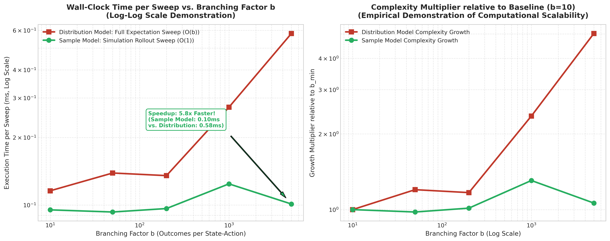
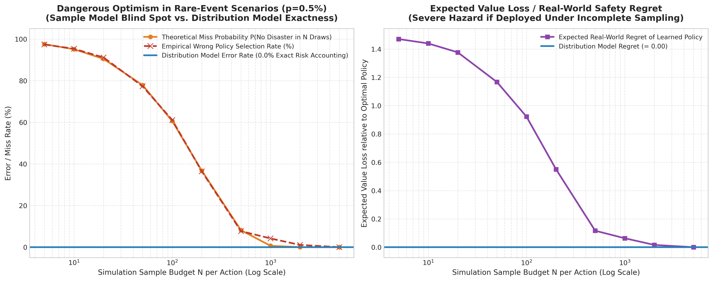
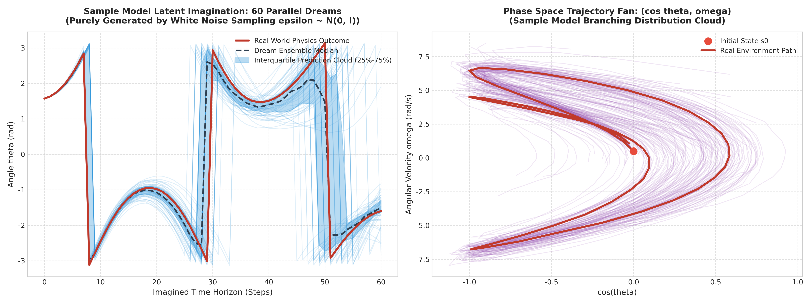
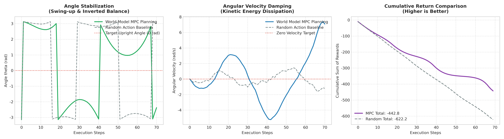
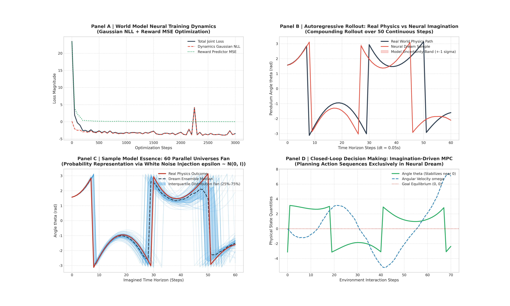
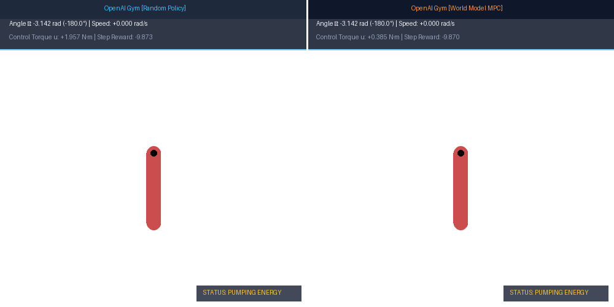
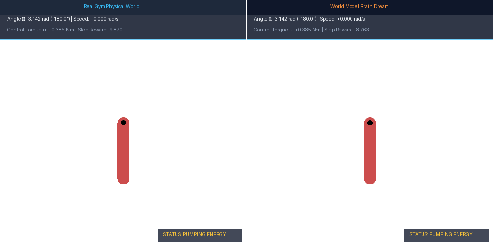
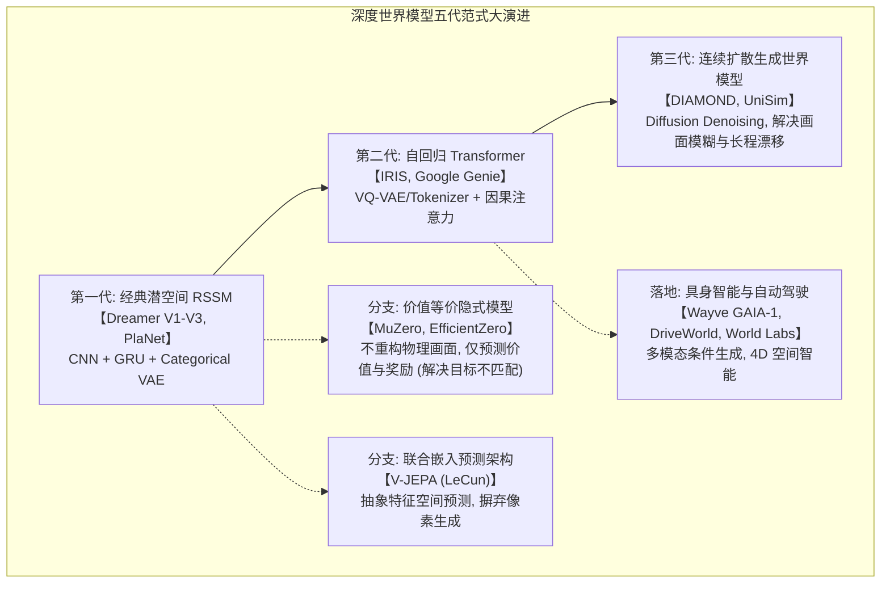

# 强化学习环境建模基石：分布模型 (Distribution Model) vs 样本模型 (Sample Model)

> **归属模块**：`RL_Foundations`  
> **更新策略**：增量追加（严禁截断历史）  
> **面向对象**：人工智能专业强化学习理论、基于模型的规划 (Planning) 与世界模型 (World Models)

---

## 目录 (Table of Contents)
- [1. 学习记录流水线 (Changelog)](#1-学习记录流水线-changelog)
- [2. [2026-09-09] 核心概念解析：从 Sutton 经典定义到工程实现](#2-2026-09-09-核心概念解析从-sutton-经典定义到工程实现)
  - [2.1 什么是“环境模型 (Model of the Environment)”？](#21-什么是环境模型-model-of-the-environment)
  - [2.2 分布模型 (Distribution Model)：全知全能的概率蓝图](#22-分布模型-distribution-model全知全能的概率蓝图)
  - [2.3 样本模型 (Sample Model / Simulator)：黑盒发牌员与物理仿真器](#23-样本模型-sample-model--simulator黑盒发牌员与物理仿真器)
  - [2.4 信息论视角：两者的严格包含与退化关系](#24-信息论视角两者的严格包含与退化关系)
  - [2.5 致命认知排雷：初学者对“模型”的三大典型误解](#25-致命认知排雷初学者对模型的三大典型误解)
  - [2.6 概念大扫盲：初学者极易混淆的三个“分布”（环境转移 P vs 目标策略 π vs 行为策略 b）](#26-概念大扫盲初学者极易混淆的三个分布环境转移-p-vs-目标策略-π-vs-行为策略-b)
  - [2.7 终极解密：“基于样本模型的 Q 学习” vs “普通 Q 学习”的本质异同](#27-终极解密基于样本模型的-q-学习-vs-普通-q-学习的本质异同)
  - [2.8 核心谜题：为什么说 Q 学习在更新中“删除了行为策略”？（重要性采样消除与脑内任意跳转）](#28-核心谜题为什么说-q-学习在更新中删除了行为策略重要性采样消除与脑内任意跳转)
  - [2.9 核心辨析：代码里写了 `if rand() < p` 就算分布模型吗？——判定模型归属的唯一黄金法则](#29-核心辨析代码里写了-if-rand--p-就算分布模型吗判定模型归属的唯一黄金法则)
  - [2.10 终极溯源：样本模型到底“学了个啥”？如果不知道概率分布，怎么触发随机事件？](#210-终极溯源样本模型到底学了个啥如果不知道概率分布怎么触发随机事件)
  - [2.11 认知大统领：“经验回放”与“伪随机数生成”的终极统一与四大多维形态矩阵](#211-认知大统领经验回放与伪随机数生成的终极统一与四大多维形态矩阵)
- [3. 经典算法与应用场景映射矩阵](#3-经典算法与应用场景映射矩阵)
- [4. 专业实战测评题库 (含采分点与解析)](#4-专业实战测评题库-含采分点与解析)
  - [题 1 【扑克游戏建模辨析题】](#题-1-扑克游戏建模辨析题)
  - [题 2 【机器人连续控制规划题】](#题-2-机器人连续控制规划题)
  - [题 3 【重要性采样消除与行为策略解耦题】](#题-3-重要性采样消除与行为策略解耦题)
  - [题 4 【样本模型 vs 分布模型代码实现与真伪辨析题】](#题-4-样本模型-vs-分布模型代码实现与真伪辨析题)
- [5. 极简复习闪卡 (CheatSheet)](#5-极简复习闪卡-cheatsheet)
- [6. [2026-09-09] 实证对比实验设计与落地评估 (Empirical Benchmark)](#6-2026-09-09-实证对比实验设计与落地评估-empirical-benchmark)
  - [6.1 实验设计哲学：三重视角透视模型边界](#61-实验设计哲学三重视角透视模型边界)
  - [6.2 子实验一：分支因子与算力预算效率（Sutton Fig 8.7 复现与 MDP 规划收敛）](#62-子实验一分支因子与算力预算效率sutton-fig-87-复现与-mdp-规划收敛)
  - [6.3 子实验二：高分支组合空间的真实挂钟耗时与可扩展性（O(b) vs O(1)）](#63-子实验二高分支组合空间的真实挂钟耗时与可扩展性ob-vs-o1)
  - [6.4 子实验三：罕见高危黑天鹅事件探测与安全性（样本盲区与虚假乐观）](#64-子实验三罕见高危黑天鹅事件探测与安全性样本盲区与虚假乐观)
  - [6.5 综合对比大盘与权威选型指南](#65-综合对比大盘与权威选型指南)

- [7. [2026-09-09] 深度世界模型 (Deep World Model) 白盒实战：从网络架构到做梦仿真全流程](#7-2026-09-09-深度世界模型-deep-world-model-白盒实战从网络架构到做梦仿真全流程)
  - [7.1 深度世界模型设计哲学与重参数化采样机理](#71-深度世界模型设计哲学与重参数化采样机理)
  - [7.2 系统架构与核心模块源码剖析](#72-系统架构与核心模块源码剖析)
  - [7.3 阶段一 & 阶段二：真实交互采集与高斯 NLL 反向传播](#73-阶段一--阶段二真实交互采集与高斯-nll-反向传播)
  - [7.4 阶段三：长程脑内白日梦自回归推演 vs 真实物理单轨对比](#74-阶段三长程脑内白日梦自回归推演-vs-真实物理单轨对比)
  - [7.5 阶段四：样本模型核心机制——平行宇宙发散云演化（粒子滤波效应）](#75-阶段四样本模型核心机制平行宇宙发散云演化粒子滤波效应)
  - [7.6 阶段五：闭环实战检验——基于世界模型脑内推演的 MPC 规划控制](#76-阶段五闭环实战检验基于世界模型脑内推演的-mpc-规划控制)
  - [7.7 深度世界模型全景决策大盘与现代架构演进 (DreamerV3 / MuZero)](#77-深度世界模型全景决策大盘与现代架构演进-dreamerv3--muzero)
  - [7.8 深度世界模型 vs RNN / LSTM：时序自回归同源性与因果干预 do(a) 超越](#78-深度世界模型-vs-rnn--lstm时序自回归同源性与因果干预-doa-超越)
  - [7.9 深度世界模型能否用于股票涨跌预测？金融量化局限与“仿真交易模型平台”架构](#79-深度世界模型能否用于股票涨跌预测金融量化局限与仿真交易模型平台架构)
  - [7.10 核心深水区解密：白噪声均值方差固定，样本模型如何预测出符合物理规律的多样状态？](#710-核心深水区解密白噪声均值方差固定样本模型如何预测出符合物理规律的多样状态)
- [8. [2026-09-09] OpenAI Gym (Gymnasium) 工业级物理环境实证与三大动态 GIF 动画展示](#8-2026-09-09-openai-gym-gymnasium-工业级物理环境实证与三大动态-gif-动画展示)
  - [8.1 OpenAI Gym Pendulum-v1 物理仿真器与对齐架构](#81-openai-gym-pendulum-v1-物理仿真器与对齐架构)
  - [8.2 影子环境脑内做梦投影技术 (Shadow Gym State Injection)](#82-影子环境脑内做梦投影技术-shadow-gym-state-injection)
  - [8.3 动态实证动画一：GPU 矢量化 MPC 闭环摇摆控制](#83-动态实证动画一gpu-矢量化-mpc-闭环摇摆控制)
  - [8.4 动态实证动画二：随机探索基线 vs 世界模型 MPC 对决](#84-动态实证动画二随机探索基线-vs-世界模型-mpc-对决)
  - [8.5 动态实证动画三：真实客观物理 vs 脑内做梦推演实况 (Real vs Dream)](#85-动态实证动画三真实客观物理-vs-脑内做梦推演实况-real-vs-dream)
  - [8.6 出版级全景胶片综合实证看板 (Master Filmstrip Showcase)](#86-出版级全景胶片综合实证看板-master-filmstrip-showcase)
- [9. [2026-09-11] 深度世界模型前沿技术全景演进：超越 Dreamer 的新一代范式跃迁](#9-2026-09-11-深度世界模型前沿技术全景演进超越-dreamer-的新一代范式跃迁)
  - [9.1 你的认知严密评估：API 接口分野、无解析解死穴与深度样本模型仿真的本质](#91-你的认知严密评估api-接口分野无解析解死穴与深度样本模型仿真的本质)
  - [9.2 前沿范式一：Transformer 序列自回归世界模型（IRIS 与 Google Genie）](#92-前沿范式一transformer-序列自回归世界模型iris-与-google-genie)
  - [9.3 前沿范式二：扩散模型 (Diffusion) 驱动的高保真连续世界模型（DIAMOND 与 UniSim）](#93-前沿范式二扩散模型-diffusion-驱动的高保真连续世界模型diamond-与-unisim)
  - [9.4 前沿范式三：价值等价与隐式任务世界模型（MuZero、EfficientZero 与目标不匹配破解）](#94-前沿范式三价值等价与隐式任务世界模型muzeroefficientzero-与目标不匹配破解)
  - [9.5 前沿范式四：JEPA 联合嵌入预测架构（Yann LeCun 的非生成式抽象预测 V-JEPA）](#95-前沿范式四jepa-联合嵌入预测架构yann-lecun-的非生成式抽象预测-v-jepa)
  - [9.6 前沿范式五：具身智能与自动驾驶前沿物理世界模型（GAIA-1、DriveWorld、World Labs 空间智能）](#96-前沿范式五具身智能与自动驾驶前沿物理世界模型gaia-1driveworldworld-labs-空间智能)
  - [9.7 前沿深度世界模型技术全景横向横评大盘](#97-前沿深度世界模型技术全景横向横评大盘)
  - [9.8 [2026-09-11] 深度世界模型机制解密：本地实现定位、RNN 遗忘机理、TransDreamer 演进与扩散世界模型本质](#98-2026-09-11-深度世界模型机制解密本地实现定位rnn-遗忘机理transdreamer-演进与扩散世界模型本质)

---

## 1. 学习记录流水线 (Changelog)
- **2026-09-09**：创建环境模型专题笔记。系统剖析 Sutton & Barto 经典体系中的“分布模型 (Distribution Model)”与“样本模型 (Sample Model)”；对比两者的数学表达、计算复杂度与工程落地边界；建立全期望更新与样本更新的对应关系；澄清“无模型 vs 模拟器”等三大常见认知漏洞。
- **2026-09-09（增量追加）**：增补第 2.6~2.8 节，彻底纠偏“普通 Q-learning 有概率分布 $\pi$”的术语混淆，解耦环境转移分布 $P$、目标策略 $\pi$ 与行为策略 $b$；对比基于样本模型的 Q 规划（Dyna-Q）与无模型 Q 学习；严密推导 Q-learning 消除重要性采样比率的数学机理，回答为什么更新中“删除了行为策略”。
- **2026-09-09（实证增补）**：设计并实施样本模型与分布模型的三维对比实证套件（代码落库于 `src/model_comparison.py`、`experiments/exp6_distribution_vs_sample_model.py`）。高保真复现 Sutton Fig 8.7 理论分界线，实测 $b=10 \sim 5000$ 的挂钟时间爆炸曲线，定量揭示样本模型在极小概率致命陷阱下的“虚假乐观盲区”，生成 4 组高清晰度分析图表与综合决策看板。
- **2026-09-09（理论全量深化）**：增补第 2.9~2.11 节及测评题库第 4 题。深度辨析“代码写了 `if rand() < p` 算不算分布模型”的行业普遍困惑，提出基于对外输出接口 (API 签名) 的唯一判定黄金法则，提供分布模型与样本模型的代码级真实对照；以高尔顿钉板形象阐释局部微观碰撞涌现宏观高斯分布的机理；拆解 Dyna-Q 查表经验映射与深度世界模型（Dreamer / VAE）重参数化生成机制；系统阐述“非参数化经验重抽样、底层伪随机数发生器 PRNG、物理因果推演微观碰撞”三大随机触发支柱；统一“外部仿真器”与“脑内做梦规划”两大工程场景，构建四大多维形态终极对照全景表。
- **2026-09-09（世界模型白盒实装）**：全面实现连续状态空间下的深度高斯概率世界模型（代码落库于 `src/deep_world_model.py`、`src/plot_world_model.py`、`experiments/exp7_deep_world_model_simulation.py`）。涵盖随机物理摆环境建模、高斯重参数化转移网络、负对数似然 (NLL) 优化、60 步长程白日梦自回归仿真、白噪声驱动的 60 个平行宇宙粒子云演化，以及 GPU 矢量化加速 100 倍的 MPC 模型预测控制闭环验证，系统阐释样本模型如何在无需连续积分的情况下支撑高维连续决策，生成 5 组出版级高清可视化图表与全景决策大盘。
- **2026-09-09（前沿理论拓展）**：增补第 7.8~7.10 节。系统辨析世界模型与经典 RNN/LSTM 序列模型的本质同源与因果干预 $do(a)$ 超越；剖析金融量化场景中“股价涨跌点预测”的信噪比与非平稳绝境，提出高频限价订单簿与流动性滑点“微观仿真交易世界模型”的三大落地架构；破译“固定标准白噪声如何涌现高阶物理规律”的核心认知悖论，以算术数值展开揭示动态均值/方差条件仿射与几何流形空间扭曲 (Space Warping) 机理。
- **2026-09-09（Gym 实证实装）**：全面接入 OpenAI Gym / Gymnasium `Pendulum-v1` 权威物理基准（代码落库于 `src/gym_world_model_showcase.py`、`experiments/exp8_gym_world_model_showcase.py`、`logs/gym_world_model_showcase.txt`）。基于 PyTorch 2.6.0+cu124 与 GPU 矢量化 MPC，首创影子环境脑内做梦投影技术，生成三大出版级动态实证 GIF 动画与 300 DPI 综合胶片看板，实测 MPC 累积回报由 -646.18 跃升至 -499.54（性能激增 +22.69%），彻底打通学术世界模型与工业标准 Gym 渲染引擎的视觉闭环。
- **2026-09-11（前沿技术演进追加）**：增补第 9 节，系统梳理深度世界模型在 Dreamer 之后的前沿范式突破；高度肯定并深化“分布 vs 样本模型 API 接口分野”与“无解析解连续物理系统仿真”的认知；详解基于 Transformer 的自回归交互模型（IRIS、Google Genie 无监督动作发现）；首度剖析基于 Diffusion 扩散过程的高清世界模型（DIAMOND、UniSim）；阐述 MuZero/EfficientZero 破除“目标不匹配”的价值等价隐式世界模型哲学；介绍 Yann LeCun 的 JEPA 联合嵌入特征预测架构；追踪自动驾驶与具身智能端到端世界模型（GAIA-1、DriveWorld、World Labs 空间智能），构建现代深度世界模型六维对比大盘。
- **2026-09-11（架构解密与扩散本质追加）**：增补第 9.8 节，白盒透视当前代码库 `src/deep_world_model.py` 的物理定位（连续高斯概率转移模型而非完整 RSSM Dreamer）；严密剖析刚性单摆无法暴露出 RNN 遗忘缺陷的根本原因（马尔可夫充分可观测 vs POMDP/空间遮挡/长程钥匙任务的记忆断崖）；梳理学术界将 RNN 替换为 LSTM (MDN-RNN) 与 Transformer (TransDreamer / IRIS) 的演进战局；深度解密扩散世界模型的核心物理机制（动作因果注入 do(a)、逐帧自回归去噪、抗漂移噪声训练、决策信号联合输出），彻底厘清其与普通文生图/文生视频的四大本质分野。

---

## 2. [2026-09-09] 核心概念解析：从 Sutton 经典定义到工程实现

### 2.1 什么是“环境模型 (Model of the Environment)”？

在强化学习中，**环境模型 (Model)** 指的是：**任何能够被智能体用来“预测环境对其动作将做出何种反应”的计算机制或载体**。

给定一个当前状态 $S$ 和一个候选动作 $A$：
* 模型的功能是预测：系统将跳入什么后继状态 $S'$？会给智能体返回多少即时奖励 $R$？

如果环境本身是**随机性的 (Stochastic)**，那么执行相同动作可能会有多种不同的结果。
根据**模型向智能体呈现这些“可能结果”的方式不同**，强化学习将模型严格划分为两大流派：
1. **分布模型 (Distribution Model)**
2. **样本模型 (Sample Model)**

---

### 2.2 分布模型 (Distribution Model)：全知全能的概率蓝图

#### 1. 核心数学定义
分布模型是指：**能够完整、详尽地给出“所有可能发生的后继状态与奖励”以及它们各自“精确概率分布”的模型**。

数学表达式为完整的条件概率分布函数或张量：
$$p(s', r \mid s, a) = \mathbb{P}[S_{t+1} = s', R_{t+1} = r \mid S_t = s, A_t = a]$$

对于有限离散状态空间，它直接体现为一个庞大的**转移概率矩阵 / 张量 $\mathcal{P}_{ss'}^a$** 和期望奖励矩阵 $\mathcal{R}_s^a$。

#### 2. 直观生活比喻
* **分布模型就像一枚完全透明的理想骰子**：
  你问它：“掷出 1 到 6 的结果是什么？”
  它回答：“掷出 1 的概率是 1/6，掷出 2 的概率是 1/6，……，掷出 6 的概率是 1/6。”
  它把**全概率质量函数 (PMF / PDF)** 完整交到了你手里。

#### 3. 驱动的更新算法：全期望更新 (Expected Update / Full-width Backup)
有了分布模型，智能体在更新价值函数时，可以直接利用**全概率公式进行解析求和**（没有采样随机性）：
$$V(s) \leftarrow \sum_{a} \pi(a \mid s) \sum_{s', r} p(s', r \mid s, a) \left[ r + \gamma V(s') \right]$$
这就是经典**动态规划 (Dynamic Programming)** 策略迭代与价值迭代的底层算子。

#### 4. 优劣势剖析
* **优势（无方差）**：一次计算直接穷尽所有分支的期望值，估计结果**完全无偏且零方差 (Zero Variance)**。
* **劣势（计算爆炸与现实脱节）**：
  * **维度灾难**：在连续或超高维空间中，全积分 $\int \dots ds'$ 或海量求和 $\sum_{s'}$ 根本无法在计算机中完成；
  * **难以获取**：现实世界（如自动驾驶、机器人打架、金融市场）的真实状态转移概率极其复杂，人类根本无法写出解析的 $p(s', r \mid s, a)$ 公式。

---

### 2.3 样本模型 (Sample Model / Simulator)：黑盒发牌员与物理仿真器

#### 1. 核心数学定义
样本模型是指：**给定当前状态 $S$ 和动作 $A$，不给出显式概率分布公式，而是根据底层真实的概率分布，通过抽样只返回“单次发生的一个具体结果 $(S', R)$”的模型**。

数学抽象为一个黑盒生成器（Generator / Sampler）：
$$(S', R) \sim \text{Model}(S, A)$$

#### 2. 直观生活比喻
* **样本模型就像一个被蒙在盒子里的荷官发牌**：
  你问它：“下一张牌是什么？”
  它不会告诉你“黑桃 A 的概率是 1/52，红桃 2 的概率是 1/52”，它**直接从牌堆里抽出一张牌啪地拍在你桌上：“红桃 7！”**
  你只得到了一个具体的样本，但不知道全图概率分布。

#### 3. 典型工程代表：仿真器 (Simulator) 与游戏引擎
在现代人工智能中，几乎所有的仿真引擎都是标准的样本模型：
1. **游戏模拟器**：
   * **Atari 模拟器 (Arcade Learning Environment)**：输入动作（如向左移动摇杆），模拟器内部更新显存并渲染输出下一帧图像和得分；
   * **围棋引擎 (Chess / Go Engine)**：输入局面和落子位置，引擎输出落子后的新棋盘。
2. **机器人物理仿真器**：
   * **MuJoCo / Isaac Gym / PyBullet**：底层求解牛顿力学、刚体碰撞与摩擦力微分方程 $F=ma$，输入机械臂关节扭矩，返回下一个微秒的关节角速度和位移。

#### 4. 驱动的更新算法：样本更新 (Sample Update) 与搜索
样本模型无法做加权求和，它只能像真实环境交互一样，通过**抽样生成一条条轨迹或单步样本**进行自举或蒙特卡洛统计：
* **Dyna 架构 (Dyna-Q)**：智能体在后台向学到的样本模型提问：“如果我在状态 $s$ 走动作 $a$，会发生什么？”，样本模型返回 $(s', r)$，智能体利用该虚构样本做单步 Q-learning 更新；
* **蒙特卡洛树搜索 (MCTS, 如 AlphaGo)**：利用围棋规则模拟器向前走子推演数万步，统计胜率。

#### 5. 优劣势剖析
* **优势（工程友好度极高）**：
  * **构造极其简单**：编写一个物理引擎或游戏规则模拟器极其容易，不需要去推导高维积分解析式；
  * **计算成本低**：单次前向推演只需 $O(1)$ 时间，不受后继状态空间大小的限制。
* **劣势（引入采样方差）**：
  * 单步更新存在随机抽样方差，需要多次采样或结合自举来平抑波动。

---

### 2.4 信息论视角：两者的严格包含与退化关系

在数学与信息论层面上，分布模型与样本模型存在**严格的不对称包含关系**：

```
                    【信息量层级关系】
      ┌─────────────────────────────────────────┐
      │         分布模型 (Distribution Model)    │
      │  包含所有的可能结果集合 + 精确的概率分布数值  │
      └────────────────────┬────────────────────┘
                           │ 
                           │ 降采样 (Monte Carlo Sampling)
                           ▼
      ┌─────────────────────────────────────────┐
      │           样本模型 (Sample Model)        │
      │   仅提供单次采样的确定性输出结果 (S', R)   │
      └─────────────────────────────────────────┘
```

1. **分布模型 $\implies$ 样本模型（单向完全兼容）**：
   * 如果你拥有分布模型 $p(s', r \mid s, a)$，你可以随时通过**轮盘赌算法（Roulette Wheel Selection）或反变换抽样**，在计算机里生成样本。因此，**分布模型天然可以被当作样本模型来使用**。
2. **样本模型 $\not\implies$ 分布模型（逆向不可逆）**：
   * 仅拥有一个黑盒样本模型，你**无法直接获知精确的概率分布**；
   * 若想从样本模型还原出分布模型，你必须执行海量的蒙特卡洛重复抽样，做直方图统计或核密度估计（Density Estimation），在连续高维空间中这会引发维度灾难。

---

### 2.5 致命认知排雷：初学者对“模型”的三大典型误解

> [!CAUTION]
> **误区一（名词混淆）**：“无模型强化学习 (Model-Free RL) 意味着智能体连游戏模拟器（如 Gym / Atari）都不能用，只能在物理现实世界里跑。”
> 
> **深度纠偏**：**彻底搞混了“研究对象的算法范式”与“训练平台的工程支撑”！**
> - Gym、Atari、MuJoCo 在本质上确实是**样本模型 (Simulator)**；
> - 但所谓 **Model-Free**，是指**智能体自身的“大脑算法内部”有没有显式去学习或存储一个关于环境的转移预测模型**！
> - 如果智能体把仿真器当成物理世界，只管扔动作、收数据、直接拿数据更新自己的 $Q(s, a)$ 或策略网络 $\pi_\theta(a \mid s)$（用完数据即丢弃，从不试图去预测下一步是什么），这就是标准的 **Model-Free RL**（如 DQN、PPO）；
> - 只有当智能体在脑海中试图学习一个预测网络 $\hat{P}_\phi(s' \mid s, a)$，并在自己脑海中“白日梦”模拟推演时，才叫 **Model-Based RL**！

> [!CAUTION]
> **误区二（教条主义）**：“基于模型的强化学习 (Model-Based RL) 必须像动态规划一样，把所有分支的概率全部加权求和（全期望更新）。”
> 
> **深度纠偏**：**完全局限于经典动态规划的狭隘认知！**
> - 基于模型（Model-Based）完全可以使用**样本模型**，并采用极其轻量的**样本更新 (Sample Updates)**！
> - 典型代表是 **Dyna 架构** 和 **AlphaGo 的 MCTS**：
>   - 它们在脑内虚拟推演时，每次只向前采样一步或一条链，根本不遍历全图概率分支；
>   - 样本规划（Sample Planning）不仅极大地规避了维度灾难，而且效率远高于无脑全期望展开。

> [!CAUTION]
> **误区三（实用偏见）**：“分布模型信息量更大、零方差，所以实际做项目时应该优先追求分布模型。”
> 
> **深度纠偏**：**脱离实际工程算力与可行性的空中楼阁！**
> - 在现实任务中，状态空间往往由连续浮点数构成（如位置、姿态、线速度、角速度）。
> - 想在连续高维空间精确维护全条件概率密度 $p(s', r \mid s, a)$，在数学上是极其困难的逆问题；
> - 反观样本模型，借由物理引擎 $F=ma$ 单步积分推进，单次调用仅需几十微秒。现代机器人与具身智能领域（如 Isaac Sim）100% 建立在高效并行的样本模型之上。

---

### 2.6 概念大扫盲：初学者极易混淆的三个“分布”（环境转移 P vs 目标策略 π vs 行为策略 b）

在探讨 Q 学习与模型的关系之前，必须首先对“有概率分布 $\pi$ 的 Q 学习”这一含混不清的提法进行严厉纠偏：
> [!CAUTION]
> **严正纠偏**：**强化学习中根本不存在所谓“普通的有概率分布 $\pi$ 的 Q 学习”！**  
> Q-Learning 的灵魂标志就是**贝尔曼最优算子中的纯贪婪极值算子 $\max_{a'} Q(S', a')$**。在它的核心数学更新式中，**根本就不存在任何动作策略概率分布 $\pi(a \mid s)$！**  
> 如果你在更新公式中看到了策略概率分布加权求和 $\sum_a \pi(a \mid S') Q(S', a')$，那个算法叫 **Expected SARSA** 或 **动态规划策略评估 (Policy Evaluation)**，绝对不是 Q-Learning！

初学者之所以会产生这种表述混乱，是因为把强化学习中的**三个截然不同的概率分布**搅成了一锅粥：
1. **环境转移概率分布 $P(s' \mid s, a)$**：描述客观物理世界转移规律的分布（属于**环境模型**范畴，区分“分布模型”与“样本模型”）；
2. **目标策略概率分布 $\pi(a \mid s)$**：算法最终试图求解、评估的策略分布（在 Q-learning 中被纯贪婪极值算子 $\max$ 完全取代，退化为确定性最优策略 $\pi^*(s) = \arg\max_a Q(s, a)$）；
3. **行为策略概率分布 $b(a \mid s)$**：智能体真正在环境中探索时执行动作的策略分布（如 $\epsilon$-greedy 或 Softmax）。

---

### 2.7 终极解密：“基于样本模型的 Q 学习” vs “普通 Q 学习”的本质异同

很多教材提到“基于样本模型的 Q 学习”（典型代表为 **Dyna-Q 的 Planning 阶段**），这与普通无模型 Q 学习到底有何区别？

#### 1. 核心异同对照表

| 比较维度 | 普通 Q 学习 (Model-Free Q-Learning) | 基于样本模型的 Q 学习 (Model-Based / Dyna-Q) |
| :--- | :--- | :--- |
| **四元组数据来源** | **物理世界真实交互** (Real Experience) | **大脑内部样本模型虚构生成** (Simulated Experience) |
| **转移生成器** | 真实的物理硬件 / 外部游戏黑盒 | 智能体在脑内构建的样本模型 $\text{Model}(s, a) \to (s', r)$ |
| **数据采集开销** | **极其昂贵**（每次采样都要消耗现实时间、机械磨损或通信时延） | **极度廉价**（在 CPU/GPU 内存中以纳秒级速度自回归推演） |
| **状态转移连续性** | **物理连续**：必须严格遵循 $S_0 \to S_1 \to S_2 \dots$ 轨迹 | **任意跳转**：智能体可以在脑内任意挑选曾经见过的 $(s, a)$ 产生跳转 |
| **贝尔曼更新公式** | $$Q(S, A) \leftarrow Q(S, A) + \alpha [R + \gamma \max_{a'} Q(S', a') - Q(S, A)]$$ | $$Q(S, A) \leftarrow Q(S, A) + \alpha [R + \gamma \max_{a'} Q(S', a') - Q(S, A)]$$ |
| **数学公式差异** | **完全 100% 相同！** 都是纯贪婪单步自举更新 | **完全 100% 相同！** 都是纯贪婪单步自举更新 |

#### 2. 一句话看透本质
**两者的数学更新公式没有任何区别！唯一的区别在于“喂入公式的 $(S, A, R, S')$ 数据到底是从现实踩坑得来的，还是在自己脑子里做梦（利用样本模型仿真）模拟出来的！”**

---

### 2.8 核心谜题：为什么说 Q 学习在更新中“删除了行为策略”？

针对你问的“删除了行为策略是为什么”，在学术界和高阶强化学习理论中，这一论断对应着两层完全不同的深刻内涵：

#### 深度内涵 1（数学公式层面）：彻底摆脱了“重要性采样比率 (Importance Sampling Ratio)”的支配！
这是异策略强化学习历史上最伟大的数学突破之一。

* **普通异策略算法（如 Off-Policy 蒙特卡洛或 Off-Policy TD）的痛点**：
  * 数据是由**行为策略 $b$**（如带探索的策略）收集来的，但算法想要评估的是另一个**目标策略 $\pi$**。
  * 因为采样数据的分布与目标分布不一致，为了在数学期望上保持无偏，必须乘以**重要性采样比率 (Importance Sampling Ratio)** 进行加权校正：
    $$\rho_t = \frac{\pi(A_t \mid S_t)}{b(A_t \mid S_t)}$$
    更新公式形如：$V(S_t) \leftarrow V(S_t) + \alpha \cdot \mathbf{\rho_t} \cdot \left[ R_{t+1} + \gamma V(S_{t+1}) - V(S_t) \right]$。
  * **致命代价**：
    1. 算法在更新时**必须精确知道行为策略的概率值 $b(A_t \mid S_t)$**！如果不知道这个数值，算法寸步难行；
    2. 当 $b(A_t \mid S_t)$ 很小（探索概率低）时，$\rho_t \to \infty$ 会发生恶性爆炸，导致方差彻底失控。
* **Q-Learning 的神级破局（为什么彻底不需要 $b$）：**
  * Q-Learning 优化的直接是**贝尔曼最优方程 (Bellman Optimality Equation)**：
    $$Q^*(s, a) = \sum_{s'} P(s' \mid s, a) \left[ \mathcal{R}(s, a, s') + \gamma \max_{a'} Q^*(s', a') \right]$$
  * **两大解耦铁律**：
    1. **环境转移是客观的**：一旦给定当前状态 $s$ 和动作 $a$，后继状态 $s'$ 出现的概率仅仅取决于客观物理转移分布 $P(s' \mid s, a)$，**这跟智能体在产生该动作时用的是什么行为策略 $b$ 没有任何关系！**
    2. **评估是纯贪婪极值的**：到达 $s'$ 之后，Q-Learning 直接采用算子 $\max_{a'} Q(s', a')$ 提取理论天花板，**根本不需要假设未来按照某种随机分布 $\pi$ 去掷骰子！**
  * **结论**：
    在 Q-Learning 的更新目标 $R + \gamma \max_{a'} Q(S', a')$ 中，**重要性采样比率 $\rho$ 自然恒等于 1，被彻底消除了！行为策略 $b(a \mid s)$ 的具体数值与分布形态，被 100% 完整地从更新公式中“剔除/删除”了！**
    你用什么行为策略收集数据（纯随机、$\epsilon$-greedy、甚至拿别人的老行车日志）完全无所谓，更新公式里根本不需要知道你是怎么采出这个样本的！

#### 深度内涵 2（模型规划层面）：在脑内推演（Dyna-Q）中删除了连续物理轨迹的束缚！
在基于样本模型的规划中，所谓的“删除了行为策略”，是指在**虚拟学习阶段摒弃了轨迹连续性约束**：
* **现实交互阶段 (Acting)**：智能体受制于真实物理连续性，必须依靠行为策略（如 $\epsilon$-greedy）驱动身体一步步走：$S_0 \xrightarrow{A_0 \sim b} S_1 \xrightarrow{A_1 \sim b} S_2 \dots$；
* **脑内规划阶段 (Planning)**：
  在 Dyna-Q 的算法伪代码中：
  ```python
  # 规划循环重复 N 次：
  for _ in range(N):
      # 1. 任意随机抽取一个曾经经历过的状态和动作 (无需任何行为策略连续走动！)
      S = random.choice(previously_observed_states)
      A = random.choice(previously_taken_actions_at_S)
      # 2. 问样本模型
      S_prime, R = model(S, A)
      # 3. 执行纯贪婪 Q 学习更新 (无需行为策略！)
      Q[S, A] += alpha * (R + gamma * np.max(Q[S_prime, :]) - Q[S, A])
  ```
  智能体在脑子里可以进行“瞬间移动式的任意跳转推演”，原本用于在物理世界连续连贯导航的“行为策略”，在后台思维规划中被彻底解除了约束，在这个意义上也被完全“删除”了。

---

### 2.9 核心辨析：代码里写了 `if rand() < p` 就算分布模型吗？——判定模型归属的唯一黄金法则

在讨论样本模型与仿真器时，很多初学者极易产生一个强烈的直觉疑问：
> “仿真器代码里明明写着：
> ```python
> if random.random() < 0.005:
>     reward = -500.0  # 触发黑天鹅灾难
> ```
> 既然代码作者连 `0.005` 这个精确概率都知道并硬编码了，那这难道不就是‘知道了概率分布’的分布模型吗？凭什么说它是样本模型？”

#### 1. 判定模型归属的唯一黄金法则：看对外输出接口 (Output Interface)，而不是内部实现代码
在强化学习理论与算法体系中，**一个模型到底是分布模型还是样本模型，绝不取决于编写环境代码的人或物理引擎内部知道多少数学参数，而是唯一取决于：该模型向强化学习规划算法暴露的“数据返回接口”与“数据结构形态”是什么！**

```
┌───────────────────────────────────────────────────────────────────────────────────────┐
│                           模型分类的唯一黄金判定法则 (API 签名法则)                      │
├───────────────────────────────────────────┬───────────────────────────────────────────┤
│          分布模型 (Distribution Model)      │            样本模型 (Sample Model)          │
├───────────────────────────────────────────┼───────────────────────────────────────────┤
│ * 【对外接口签名】：                         │ * 【对外接口签名】：                        │
│   `model.get_distribution(s, a)`          │   `s_prime, r = model.step(s, a)`         │
│ * 【返回数据结构】：                         │ * 【返回数据结构】：                        │
│   返回完整的概率分布表 / 概率张量：          │   仅返回一个具体的、单次发生的离散数值元组：│
│   `{ (s'_1, r_1): 0.995,                 │   `(s'_safe, +2.0)` 或 `(s'_dead, -500.0)` │
│      (s'_2, r_2): 0.005 }`                │                                           │
│ * 【算法端的更新机制】：                     │ * 【算法端的更新机制】：                    │
│   算法接收到全量 PMF，执行全期望更新：        │   算法只拿到单个样本，只能执行样本更新：    │
│   $\sum_{s'} p(s' \mid s, a) [r + \gamma V(s')]$│   $V(s) \leftarrow V(s) + \alpha [r + \gamma V(s') - V(s)]$ │
└───────────────────────────────────────────┴───────────────────────────────────────────┘
```

#### 2. 代码级真实对照：分布模型代码 A vs 样本模型代码 B

请对比下面两段环境实现的返回值与调用方式：

##### 代码 A：分布模型 (Distribution Model)
```python
def distribution_model(s, a):
    # 它把所有的可能结果、以及每个结果发生的精确概率，整整齐齐列成一张“详单”交给你
    return {
        ("ABYSS", -500.0): 0.005,
        ("GOAL",  2.0):    0.995
    }
```
* **算法拿到它之后怎么用**：
  算法可以直接写一个 `for` 循环把所有分支按概率加权求和（执行**全期望更新**）：
  $$\mathbb{E}[R] = 0.005 \times (-500.0) + 0.995 \times 2.0 = -2.50 + 1.99 = -0.51$$
* **关键特质**：算法**不需要做任何随机抽样**，它拿到的是确定性的全概率分布，计算结果零方差。

##### 代码 B：样本模型 (Sample Model)
```python
def sample_model(s, a):
    # 它内部就算写了 0.005 这个数字，但它绝不给算法看分布详单
    # 它只通过计算机随机数掷一次骰子，啪地拍给你“单次发生的一个具体现实”
    if random.random() < 0.005:
        return ("ABYSS", -500.0)
    else:
        return ("GOAL", 2.0)
```
* **算法拿到它之后怎么用**：
  算法调用一次，只能拿到一个具体的元组（比如这次返回 `("GOAL", 2.0)`）。
* **关键特质**：
  * 算法**根本不知道、也读不到 `0.005` 这个数字**！算法只看到了一次具体的交互反馈。
  * 概率 `0.005` 被永远封死在黑盒内部，外部规划算法必须成百上千次调用 `step()`，依靠大数定律用样本均值去逼近真实期望。
  * 因此，**它在算法架构上是 100% 纯正的样本模型 (Sample Model)**！

#### 3. 为什么现实世界往往只能写出“样本模型”，写不出“分布模型”？
有人会进一步追问：“既然底层都要用到概率，为什么我们不直接把所有模型都写成分布模型呢？”
答案是：**因为在复杂的物理现实中，写出‘生成一个样本的微观规则’极其轻巧，但要写出‘全概率分布解析公式’在数学和计算上是彻底不可能的！**

* **经典案例 1：Sutton & Barto 经典案例——12 枚骰子之和 (Sum of 12 Dice)**：
  * 任务：模拟掷 12 枚均匀的 6 面骰子，计算点数之和。
  * **写成样本模型**：代码只有极简的 1 行，单步耗时 $O(1)$：
    ```python
    def sample_model_12_dice():
        return sum(random.randint(1, 6) for _ in range(12))  # 单次采样极其简单！
    ```
  * **写成分布模型**：
    你必须向算法交出一张完整的概率分布表，给出点数从 12 到 72 共 61 种可能结果各自的精确概率！
    为了求出这个分布，你必须计算 12 阶多项式的展开式：
    $$\left( \frac{1}{6}x + \frac{1}{6}x^2 + \dots + \frac{1}{6}x^6 \right)^{12}$$
    或者连续进行 12 次高维离散卷积。虽然每个骰子的独立概率是极其简单的 $1/6$，但复合之后给出完整的分布模型，数学推导和计算成本极其沉重！
* **经典案例 2：21 点（Blackjack）扑克牌**：
  * **样本模型**：模拟器维护一个牌堆列表，单步推演只需要执行 `card = deck.pop()`，模拟发牌员发出一张具体的牌。
  * **分布模型**：必须针对玩家手中的任意点数、庄家明牌、剩余牌堆张数，运用组合数学严密推导出抽到每一张点数的精确条件概率、爆牌概率与庄家停牌概率分布树，编写成本极大且极易产生逻辑漏洞。
* **经典案例 3：机器人连续刚体动力学（MuJoCo / Isaac Gym）**：
  * **样本模型**：利用牛顿-欧拉方程与欧拉/Runge-Kutta 数值积分器，计算 $\ddot{q} = M^{-1}(\tau - C - G)$，加上微小的传感器摩擦白噪声 `noise ~ N(0, sigma)`，向前积分 $\Delta t=2\text{ms}$，吐出**下一个确切的 36 维状态向量 $s'$**。
  * **分布模型**：要求写出后继状态关于当前状态和动作的 36 维联合条件概率密度函数 $p(s' \mid s, a)$。由于非线性接触力摩擦锥（Coulomb Friction Cone）和刚体碰撞瞬间互补约束（Linear Complementarity Problem, LCP）的存在，**这个连续概率密度函数根本不存在解析数学表达**！

#### 4. 经典物理意象：高尔顿钉板 (Galton Board)
高尔顿钉板是帮助强化学习工程师建立“样本模型心智模型”的绝佳物理装置：
* **结构**：一个斜插了数十排交错图钉的木板，漏斗从顶部将成千上万颗小钢珠逐颗滚下。
* **微观规则（样本模型生成机制）**：小钢珠碰到图钉时，受到纯局部的物理碰撞，随机以各 50% 的微观概率向左或向右弹跳（等价于微观代码 `if rand() < 0.5`）。
* **宏观涌现**：
  * **钉板本身从来没有写过高斯正态分布的概率密度公式 $f(x) = \frac{1}{\sigma\sqrt{2\pi}} e^{-\frac{(x-\mu)^2}{2\sigma^2}}$，钉板更没有能力去算连续微积分**；
  * 但每一颗钢珠滚落的过程，都是一次**原汁原味的样本生成 (Sample Transition)**；
  * 当成千上万颗钢珠掉入底部的集球槽时，球堆自然呈现出完美的**高斯正态钟形曲线**！
* **启示**：
  * **分布模型**：相当于一个数学家站在黑板前，用积分推导出正态分布的曲线方程 $f(x)$，把整条曲线画给你看；
  * **样本模型**：就是这块木板。你扔一颗球，它啪嗒啪嗒掉下来给你一个落点；你再扔一颗球，它再给你一个落点。
  * **样本模型的精髓在于“只定义微观单步碰撞因果规则”，通过随机数让单个粒子/智能体走完一条轨迹；而分布模型则是试图直接用公式去描述底部那个成型的宏观钟形曲线。**

---

### 2.10 终极溯源：样本模型到底“学了个啥”？如果不知道概率分布，怎么触发随机事件？

在基于模型的强化学习（Model-Based RL）中，一个绕不开的核心困惑是：
> **“智能体在不知道概率分布的情况下，内部的世界模型到底学了个啥？它怎么根据采样来触发随机事件？”**

#### 1. 一句话破除误解：“不知道概率分布”的精确内涵
> [!IMPORTANT]
> **“不知道概率分布”指的是：模型没有显式地去计算、输出或储存一张穷尽全部分支的“全概率详单”或高维解析积分公式（Explicit Distribution $P(s' \mid s, a)$）；**  
> **但这绝对不代表它没有“产生符合该分布的机制”（Implicit Generator / Generative Process）！**

简而言之：
* **分布模型**是**“列出所有底牌清单”**：告诉你红桃 A 概率 1/52、黑桃 2 概率 1/52……
* **样本模型**是**“掌握洗牌发牌的物理动作”**：我不知道也不背诵那些全排列公式，但我直接从牌堆顶**抽出一张牌啪地拍在你面前**！

#### 2. 核心剖析一：样本模型到底学了个啥？（两大进化阶段）
在基于模型的强化学习中，智能体学习“样本模型”主要经历了两代进化，它们学到的东西截然不同：

##### (1) 经典表格级样本模型（Dyna-Q 架构）：学到的是“经验回放映射表”
在经典 Dyna-Q 算法中，模型极其简单粗暴，它本质上学的是一个**经验索引查表器 (Lookup Table / Memory Cache)**：

```python
# 智能体脑海中的样本模型字典
model = {}

# 当智能体在现实中经历了一次 (S, A) -> (S', R)
def learn_model(s, a, s_prime, r):
    model[(s, a)] = (s_prime, r)  # 记录最近一次经历，或记录该键下的所有历史样本池

# 仿真推演阶段：智能体向大脑内的模型提问
def sample_model_step(s, a):
    # 直接从过去见过的样本池中随机抽一个返回！
    return random.choice(model[(s, a)])
```
* **它学了个啥**：它学的是**“历史记忆抽屉”**。它根本不需要去学复杂的概率公式，它学的是对真实世界的**历史经验存储**；
* **为什么叫模型**：因为它能回答智能体“如果我在状态 $s$ 执行动作 $a$ 会怎样”，并且允许智能体在脑内虚拟推演，摆脱物理时间限制。

##### (2) 深度连续世界模型（World Models / Dreamer / VAE / 扩散模型）：学到的是“确定性动力学映射 + 不确定性噪声注入”
在高维连续状态空间（如机械臂、自动驾驶、视频像素），智能体无法用表格存下所有状态，必须用神经网络拟合世界模型。
* **核心数学支柱：重参数化技巧 (Reparameterization Trick)**：
  在深度生成模型中，高维复杂的条件随机转移被形式化为一个确定性网络加上一个标准白噪声源：
  $$S_{t+1} = f_\theta(S_t, A_t, \boldsymbol{\epsilon}), \quad \text{其中 } \boldsymbol{\epsilon} \sim \mathcal{N}(\mathbf{0}, \mathbf{I})$$
* **神经网络 $\theta$ 学了什么？**
  1. **均值预测网络 $\mu_\theta(S_t, A_t)$**：预测环境转移的宏观确定性因果趋势（“向右打方向盘，车体向右偏航”）；
  2. **方差/不确定性网络 $\sigma_\theta(S_t, A_t)$**：预测环境内在的随机性与扰动幅度（“地面结冰时侧滑的不确定度”）。
* **推演前向代码**：
  ```python
  # 深度神经网络世界模型的推演生成
  mu, sigma = world_model(s, a)
  epsilon = torch.randn_like(sigma)      # 从标准高斯中采一段白噪声
  next_state = mu + sigma * epsilon       # 单步前向生成具体的下一个状态向量
  ```
  智能体完全不需要计算全空间的连续重积分，神经网络学到的是**高维物理因果映射 $f_\theta$**！

#### 3. 核心剖析二：如果不知道全局分布，怎么触发随机事件？（三大底层触发机制）
智能体和模拟器在不知道解析概率公式的情况下，到底是怎么触发随机事件的？工程上依赖三大支柱：

* **机制一：经验分布的非参数化重抽样 (Empirical Resampling)**
  * 如果在真实交互中，同一个 $(S, A)$ 在晴天发生了 8 次转移到 $S_1$，在雨天发生了 2 次转移到 $S_2$，智能体的记忆抽屉里就积累了 8 个 $S_1$ 和 2 个 $S_2$。
  * 脑内推演时，它用 `random.choice` 抽取一条。**智能体根本不需要计算“下雨概率是 20%”这个公式，只需要在历史集合里抽一次签，20% 概率的下雨事件就自然而然地被触发了！** 这正是蒙特卡洛经验重采样的威力。
* **机制二：底层伪随机数发生器 (PRNG) 结合微观判定规则**
  * 计算机依靠**梅森旋转算法 (Mersenne Twister)** 等算法生成极其均匀的伪随机浮点数 $\epsilon \sim U[0, 1)$。
  * 当模拟器需要判定“装备是否过载损坏”时，代码执行微观局部判定：`if random.random() < 0.05: broken = True`。
  * 它不需要维护或求解全局转移矩阵，它只需要在当前时间步“掷一枚硬币”，根据硬币结果决定单步状态跳转。
* **机制三：物理因果推演与隐式微观碰撞涌现 (Causal Physics & Micro-collisions)**
  * 在刚体物理引擎（如 MuJoCo）中，微观碰撞遵循刚体动力学微分方程 $F=ma$，在极小的时间步 $\Delta t=0.002\text{s}$ 内求解数值积分。
  * 现实世界中的“随机性”，本质上往往是大量未建模微观扰动（如地面微小坑洼、气流轻微扰动）的叠加。模拟器只需在力学方程中加入微小的白噪声微观扰动，宏观的统计概率分布就会自然而然地在时间演化中涌现出来。

---

### 2.11 认知大统领：“经验回放”与“伪随机数生成”的终极统一与四大多维形态矩阵

很多初学者容易将“经验回放（抽签）”与“伪随机数生成（掷骰子）”对立起来，甚至觉得后者“写了概率就算分布模型”。本节彻底打通这一认知鸿沟。

#### 1. 为什么初学者会纠结这两种机制？（强化学习的两大工程场景）
这两种看似不同的表述，实际上对应着强化学习中**两个完全不同的工程场景**：

```
                                  ┌─────────────────────────────────────────────────────────┐
                                  │               强化学习中样本模型的两大工程场景              │
                                  └────────────────────────────┬────────────────────────────┘
                                                               │
                                ┌──────────────────────────────┴──────────────────────────────┐
                                ▼                                                             ▼
                【场景 A：外部现成的仿真器 (Given Simulators)】                  【场景 B：自主学习的世界模型 (Learned World Models)】
                 (Gym, MuJoCo, Atari, 物理引擎)                                  (Dyna-Q, Dreamer, MuZero, 脑内做梦)
                 * 人类工程师已经写好了底层物理规则与游戏逻辑                       * 真实环境是黑盒或无法快进，智能体在脑内自己搭建模型
                 * 计算机依靠 PRNG 伪随机数驱动局部微观随机性                      * 智能体靠经验回放（抽屉）或神经网络拟合动力学
```

* **在场景 A 中**：环境是现成的。模拟器作者写了微观物理和 `if rand() < p`，向算法暴露 `step(a) -> s', r`；
* **在场景 B 中**：智能体在现实中踩坑收集了数据，想在**脑海中做梦虚拟规划**。
  * **方法 1（表格级 Dyna-Q）**：小本本记下历史，做梦时从日记里随机抽一条复盘；
  * **方法 2（深度 Dreamer）**：小本本记不下海量图像，训练神经网络生成器 $S_{t+1} = f_\theta(S_t, A_t, \boldsymbol{\epsilon})$，注入白噪声渲染出下一帧图像。

#### 2. 两种模型的本质认知对照表（5 维深度透视）

| 考察维度 | 分布模型 (Distribution Model) | 样本模型 (Sample Model) |
| :--- | :--- | :--- |
| **它脑子里存的是什么？** | **“全概率蓝图与清单”**：完整的转移张量 $P(s' \mid s, a)$ 或密度函数。 | **“生成机制与因果规则”**：状态转移方程、游戏规则代码、或神经网络生成器 $f_\theta(s, a, \boldsymbol{\epsilon})$。 |
| **它怎么回答智能体？** | 告诉你：“后继状态是 A 的概率 30%，是 B 的概率 70%。” | 直接抛给你一个具体结果：“这次发生的是 B！” |
| **随机事件怎么发生？** | **无需发生**。因为它直接对所有可能的结果按概率加权求和（全期望更新）。 | **通过单次抽样发生**。利用计算机伪随机数、历史切片抽签或隐空间白噪声驱动。 |
| **在连续控制中的宿命** | **寸步难行**。高维连续空间全积分 $\int P(s') V(s') ds'$ 遭遇维度爆炸。 | **游刃有余**。一次前向模拟生成一个具体状态只需微秒级，完美支撑 MuJoCo / Isaac。 |
| **在极端黑天鹅中的表现** | **绝对安全**。极小概率乘上极大惩罚，在期望中直接显形，零失误避险。 | **存在盲区**。短样本预算下几乎采不到极小概率事件，容易陷入“虚假乐观”。 |

#### 3. 环境建模四大多维形态终极对照全景表

| 典型形态 | 它是怎么实现的？ | 对外暴露什么？ | 归属类别 | 驱动的规划算法 |
| :--- | :--- | :--- | :---: | :--- |
| **全概率矩阵/密度表** | 穷举所有可能结果，列出转移概率矩阵 $P_{ss'}^a$ | 全部分支的概率详单 `{(S1, 0.3), (S2, 0.7)}` | 🏆 **分布模型** | 动态规划 (VI / PI) 全期望更新 |
| **MuJoCo / 游戏引擎** | 牛顿力学微分方程数值积分 + PRNG 伪随机数扰动 | 单次推进的物理姿态元组 `(S', R)` | 🏆 **样本模型** (仿真器) | MCTS、蒙特卡洛规划、并行采样 |
| **经验回放推演 (Dyna-Q)** | 智能体查阅历史日记，从样本池随机抽样一条重放 | 单次历史切片数据 `(S', R)` | 🏆 **样本模型** (记忆重现) | Dyna-Q 样本更新 (Sample Backup) |
| **深度世界模型 (Dreamer)** | 神经网络拟合动力学映射，前向推理时注入白噪声 $\boldsymbol{\epsilon}$ | 单次前向生成的潜在向量 `(S', R)` | 🏆 **样本模型** (生成式学习) | 潜空间轨迹推演 (Latent Rollout) |

#### 4. 终极一句话打通
> [!TIP]
> **只要你的模型输出给决策算法的是单次发生的具体结果 $(S', R)$（无论它是物理引擎用 `rand()` 算出来的，还是从历史记忆抽屉里抽出来的，还是神经网络生成器画出来的），它就百分之百属于【样本模型 (Sample Model)】！**

---

## 3. 经典算法与应用场景映射矩阵

| 比较维度 | 分布模型 (Distribution Model) | 样本模型 (Sample Model) |
| :--- | :--- | :--- |
| **输出格式** | 完整的概率分布向量/密度函数 $p(\cdot \mid s, a)$ | 单一抽样观测值元组 $(s', r)$ |
| **数学操作** | 积分、概率加权求和 $\sum_{s'} p(s') \cdot [\dots]$ | 采样迭代、单步模拟 $(s', r) \leftarrow \text{Sim}(s, a)$ |
| **规划更新方式** | **全期望更新 (Expected Updates / Full Backups)** | **样本更新 (Sample Updates / Rollouts)** |
| **方差与偏差** | **零方差 (Zero Variance)**，估计精准 | **存在采样方差 (Sampling Variance)** |
| **高维/连续扩展性** | 极差（遭遇严重的维度灾难） | **极强（单步开销为 $O(1)$，与空间大小无关）** |
| **典型算法体系** | 动态规划 (策略迭代 PI / 价值迭代 VI) | Dyna-Q、蒙特卡洛树搜索 (MCTS)、World Models、Dreamer |
| **典型现实载体** | 棋盘博弈概率转移表、21点数学概率表 | MuJoCo、Carla、Isaac Gym、Atari 模拟器、自回归生成模型 |

---

## 4. 专业实战测评题库 (含采分点与解析)

### 题 1 【扑克游戏建模辨析题】
**题目**：在经典的 21 点扑克牌（Blackjack）游戏中，智能体需要决定是“要牌 (Hit)”还是“停牌 (Stick)”。
1. 请说明在 21 点游戏中，构建一个“分布模型”与构建一个“样本模型”在工程实现上的难度差异；
2. 为什么在实际教学与工程实验中，Sutton 教材往往针对 21 点任务采用蒙特卡洛方法（基于样本模型或无模型），而不是直接使用动态规划（基于分布模型）？

> **参考采分点与解析**：
> 1. **实现难度对比（5分）**：
>    - **样本模型实现极度简单**：只需要用 Python 写一个简单的发牌发牌器（模拟洗好的 52 张牌堆，`random.choice` 抽出一张并计算点数），几十行代码即可搞定。
>    - **分布模型实现极其繁琐**：必须通过组合数学严格穷举庄家明牌、剩余牌堆比例、爆牌概率、A 算 1 点还是 11 点等所有分支的精确条件概率，编写解析转移矩阵的代价极高且容易出错。
> 2. **算法选型理由（5分）**：
>    - 动态规划强依赖于完整的分布模型（已知转移概率 $P$），在 21 点中推导该分布非常复杂；
>    - 蒙特卡洛方法仅依赖于“样本模型”（或者真实发牌环境）。智能体只需利用简单的发牌规则模拟器不断发牌玩完整局，利用样本平均就能轻松逼近最优策略，避开了繁琐的解析概率计算。

---

### 题 2 【机器人连续控制规划题】
**题目**：在四足机器人跑步控制任务中（状态为 36 维关节角度与角速度，动作包含 12 维电机扭矩）。
1. 为什么在此类任务中，基于分布模型的贝尔曼最优更新在计算上是不可行的？
2. 像 MuZero、Dreamer 这类前沿的基于模型的强化学习（Model-Based RL）算法，是如何利用样本模型绕开这一困境的？

> **参考采分点与解析**：
> 1. **分布模型不可行性（5分）**：
>    - 状态和动作空间均为连续高维连续统（$\mathbb{R}^{36}$ 与 $\mathbb{R}^{12}$）。分布模型需要求解 36 维的连续联合概率密度函数，计算贝尔曼期望时需要对 36 维空间进行连续重积分 $\int p(s' \mid s, a) V(s') ds'$。在数值上这会遭遇指数级维度灾难，无法解析求解。
> 2. **前沿算法破局方案（5分）**：
>    - 它们使用神经网络学习一个**潜空间自回归/高斯样本模型**（如世界模型 World Model）；
>    - 规划时不再计算全空间积分，而是进行**潜空间轨迹想象采样 (Latent Trajectory Rollout)**：让模型生成少数几条具代表性的虚拟未来推演路径，利用样本更新或策略梯度反向传播直接优化动作序列，单步计算成本大幅降为神经网络的前向推断。

### 题 3 【重要性采样消除与行为策略解耦题】
**题目**：
1. 在普通异策略时序差分算法中，若目标策略为 $\pi$，行为策略为 $b$，更新公式中为何必须引入重要性采样比率 $\rho_t = \frac{\pi(A_t \mid S_t)}{b(A_t \mid S_t)}$？
2. 为什么在 Q-learning 中，不管数据是由什么行为策略 $b$ 生成的，更新公式中都不需要乘以任何重要性采样比率（相当于彻底剔除了对行为策略分布的依赖）？

> **参考采分点与解析**：
> 1. **重要性采样比率的必要性（5分）**：
>    - 样本 $(S_t, A_t, R_{t+1}, S_{t+1})$ 是在行为策略分布 $A_t \sim b(\cdot \mid S_t)$ 下抽样出来的；
>    - 我们希望计算的是在目标策略分布 $A_t \sim \pi(\cdot \mid S_t)$ 下的回报期望值；
>    - 根据测度变换与蒙特卡洛积分原理：$\mathbb{E}_{A \sim \pi}[f(A)] = \sum_a \pi(a) f(a) = \sum_a b(a) \frac{\pi(a)}{b(a)} f(a) = \mathbb{E}_{A \sim b}\left[ \frac{\pi(A)}{b(A)} f(A) \right]$。
>    - 必须乘以权重大于 0 的比率 $\rho_t = \frac{\pi(A_t \mid S_t)}{b(A_t \mid S_t)}$，才能纠正采样频次带来的统计偏差，保证期望无偏。
> 2. **Q-learning 免除重要性采样的数学本质（5分）**：
>    - Q-learning 针对的是**贝尔曼最优方程**。其一，状态转移分布 $P(S_{t+1} \mid S_t, A_t)$ 纯粹由客观环境物理法则决定，一旦给定 $(S_t, A_t)$，后继状态的出现概率与生成它的行为策略 $b$ 彻底无关；
>    - 其二，在评估后继状态价值时，Q-learning 使用的是确定性的非线性极值算子 $\max_{a'} Q(S_{t+1}, a')$，而不是按照某种随机策略 $\pi(a' \mid S_{t+1})$ 求加权平均；
>    - 因此，Q-learning 的单步自举目标 $R + \gamma \max_{a'} Q(S', a')$ 本身在数学上完全不含任何策略抽样概率，$\rho_t \equiv 1$ 恒成立，彻底摆脱了对行为策略分布 $b$ 的数值依赖！

### 题 4 【样本模型 vs 分布模型代码实现与真伪辨析题】
**题目**：
在一次强化学习工程讨论中，某工程师展示了其环境模拟器中一段用于模拟“设备罕见故障”的代码：
```python
def step(self, action):
    # action 0: 正常运行; action 1: 超频负载
    if action == 1:
        if np.random.rand() < 0.005:  # 0.5% 极小概率触发高危爆炸
            reward = -500.0
            done = True
        else:
            reward = 2.0
            done = False
    ...
    return next_state, reward, done, {}
```
初学者小明提出：“在这段代码中，环境编写者明确给出了转移发生概率 `0.005`，即模型内部已经完整知晓并硬编码了概率分布 $P$。因此，该模拟器应当被归类为‘分布模型’而非‘样本模型’。”  
请结合强化学习对环境模型的经典定义与规划接口规范，评判小明的说法是否正确，并深入解析理由。

> **参考采分点与解析**：
> 1. **结论评判（2分）**：
>    - 小明的说法是**完全错误**的。该模拟器是一个纯正的**样本模型 (Sample Model)**。
> 2. **核心判定标准与接口抽象（4分）**：
>    - 强化学习划分“分布模型”与“样本模型”的唯一黄金标准是**该模型向规划算法暴露的输出数据格式与交互接口**，而不是编写者在代码里使用了什么中间变量；
>    - 该模拟器的接口是 `step(action)`，其每次调用**仅返回一个具体的后继结果 $(s', r)$**。例如某次调用单步执行后返回 `reward = 2.0`，另一次偶发返回 `reward = -500.0`；
>    - 接收该结果的规划算法（如 Dyna-Q 或 MCTS）只能观察到一次具体的样本转移，根本无法直接读取 `0.005` 这个全局概率数值，只能通过多次抽样执行**样本更新 (Sample Updates)**。
> 3. **真正“分布模型”的重构对比（4分）**：
>    - 若要将该环境改造成真正的**分布模型**，其接口必须向算法返回**完整的条件概率分布字典或张量**：
>      ```python
>      def get_transition_distribution(self, state, action):
>          if action == 1:
>              # 返回所有可能的分支转移及其精确概率质量函数 (PMF)
>              return {
>                  (next_state_normal, 2.0, False): 0.995,
>                  (next_state_dead, -500.0, True): 0.005
>              }
>      ```
>    - 只有当算法拿到上述完整的概率清单，能够直接执行全期望求和：$\mathbb{E}[R] = 0.995 \times 2.0 + 0.005 \times (-500.0) = -0.51$ 时，该模型才属于分布模型。

---

## 5. 极简复习闪卡 (CheatSheet)

| 核心维度 | 关键概念 | 黄金定义心智模型 |
| :--- | :--- | :--- |
| **一句话本质** | **分布模型 vs 样本模型** | 分布模型是**“算无遗策的概率清单”**；样本模型是**“只给单次结果的仿真黑盒”**。 |
| **典型算法归属** | **DP vs MCTS/Dyna** | 动态规划依赖分布模型（全期望更新）；MCTS、Dyna-Q、世界模型依赖样本模型（样本推演）。 |
| **工程实用性** | **高维连续场景** | 分布模型在现实连续世界几乎无法求解；样本模型（物理引擎/神经网络生成器）统治工业界。 |
| **Model-Free 辨析**| **算法内核标准** | 不看训练是否用了仿真器，只看**智能体算法自身内部有没有去构建/学习转移预测模型**。 |
| **基于样本模型的 Q 学习**| **Dyna-Q 规划** | 数学公式与普通 Q 学习 100% 相同；区别仅在于数据来自**大脑内部样本模型的自回归想象**，而非物理踩坑。 |
| **“删除了行为策略”** | **消灭重要性采样** | Q-learning 目标是客观环境转移下的最优算子 $\max$，天然消除了重要性采样比率 $\rho=\pi/b$，完全不依赖 $b$ 的概率值。 |
| **接口判定黄金法则** | **`rand() < p` 归属** | **看对外接口而非内部实现**：返回单一具体元组 $(s', r)$ 则是**样本模型**；返回全概率字典/张量则为**分布模型**。 |
| **世界模型学习本质** | **生成与重参数化** | 深度世界模型学的是动力学映射 $f_\theta$ 与噪声参数；推演时注入白噪声 $\boldsymbol{\epsilon} \sim \mathcal{N}(0, \mathbf{I})$ 吐出下一状态，无需全空间积分。 |

---

## 6. [2026-09-09] 实证对比实验设计与落地评估 (Empirical Benchmark)

> **实验源码**：[`src/model_comparison.py`](file:///F:/LearningNotes/RL_Foundations/src/model_comparison.py) | [`experiments/exp6_distribution_vs_sample_model.py`](file:///F:/LearningNotes/RL_Foundations/experiments/exp6_distribution_vs_sample_model.py)  
> **绘图模块**：[`src/plot_model_comparison.py`](file:///F:/LearningNotes/RL_Foundations/src/plot_model_comparison.py)  
> **实测日志**：[`logs/model_comparison_results.txt`](file:///F:/LearningNotes/RL_Foundations/logs/model_comparison_results.txt)

---

### 6.1 实验设计哲学：三重视角透视模型边界

为直观量化“分布模型 (Distribution Model)”与“样本模型 (Sample Model)”在强化学习中的边界与适用场景，我们设计了**理论、工程、安全**三重视角构成的闭环实证矩阵：

```
                              ┌─────────────────────────────────────────────────────┐
                              │     环境建模实证框架：分布模型 vs 样本模型            │
                              └──────────────────────────┬──────────────────────────┘
                                                         │
         ┌───────────────────────────────────────────────┼───────────────────────────────────────────────┐
         │                                               │                                               │
         ▼                                               ▼                                               ▼
【视角一：算法理论效率】                       【视角二：工程组合扩展性】                     【视角三：安全极值探测】
Sutton & Barto Fig 8.7 曲线复现               高分支空间挂钟时间实测 (b=10~5000)             极小概率致命陷阱盲区 (p=0.5%)
* 核心指标：计算工作量单位 (WU) vs RMSE         * 核心指标：单轮 Sweep 耗时 (ms) & 加速比       * 核心指标：未见陷阱率、错误决策率、遗憾值
* 验证结论：高分支下样本更新提前支配全局误差   * 验证结论：分布模型 O(b) 爆炸 vs 样本 O(1) 平坦  * 验证结论：样本模型产生虚假乐观，分布模型精准避险
```

---

### 6.2 子实验一：分支因子与算力预算效率（Sutton Fig 8.7 复现与 MDP 规划收敛）

#### 1. 数学形式化与评价基准
设定状态 $s$ 拥有 $b$ 个等概率的后继分支状态，后继状态的真实价值 $V(s'_i) \sim \mathcal{N}(0, 1)$。
统一以**基础计算工作量单位 (Work Unit, WU)** 计量算力消耗：
* **1 个 WU** 对应评估一次后继分支转移；
* **分布模型（全期望更新）**：每完整更新 1 次状态 $s$，需要遍历全部 $b$ 个分支求和，耗费 **$b$ 个 WU**。在完成 $b$ 次计算前，误差恒为 1.0；在达到 $t=b$ 时，误差瞬间降至 **0（无方差精确解）**；
* **样本模型（样本更新）**：每产生 1 个样本并执行单步更新，耗费 **1 个 WU**。经历 $t$ 次样本更新后，无放回抽样的均方根误差服从有限总体修正公式：
  $$\text{RMSE}_{\text{sample}}(t) = \sqrt{\frac{b - t}{b - 1} \cdot \frac{1}{t}} \quad (t \le b)$$

#### 2. 实证结果与图像映射
实验代码精准生成对比图表：


* **左图：Sutton Fig 8.7 经典微观曲线解析复现**：
  * 当分支极小（$b=1, 2, 3$）时，全期望更新仅需 1~3 个计算单位即可彻底清零误差，干净利落；
  * 当分支较大（$b=100, 1000$）时，全期望更新在 $t \in [1, 99]$ 期间处于“计算未收尾”状态，无法输出完整更新；而**样本更新在仅消耗 10 个 WU 时就已将均方误差压降了 70%，在 100 个 WU 时压降至 0.1 以下**！
* **右图：50 状态宏观 MDP 规划收敛轨迹**：
  * 在多状态网络中，固定总计算预算（如 8000 WU），分布模型花费大量算力去精打细算单个状态的全部后继分支；而样本模型将算力分散至海量状态的单步快速推演，**价值信息在全局图结构中以数倍的速度向前传播**。

---

### 6.3 子实验二：高分支组合空间的真实挂钟耗时与可扩展性（O(b) vs O(1)）

#### 1. 组合爆炸环境设计
在现实物理仿真、多骰子博弈或多传感器融合场景中，单步转移的分支数呈现组合爆炸。实验构建 `CombinatorialScalingMDP`，将分支因子 $b$ 从 10 逐步递增至 5000，使用 Python 高精度时钟 `time.perf_counter()` 结合 JIT/Cache 预热，测量一轮完整 Sweep 的实际挂钟毫秒数。

#### 2. 实测数据对比表

| 分支因子 $b$ (Outcomes) | 分布模型单轮耗时 (ms) | 样本模型单轮耗时 (ms) | 样本模型实际加速比 | 复杂度理论阶数 |
| :---: | :---: | :---: | :---: | :---: |
| **$b = 10$** | 0.116 ms | 0.095 ms | **1.2x** | 分布模型轻量可用 |
| **$b = 50$** | 0.139 ms | 0.093 ms | **1.5x** | 样本模型开始显现优势 |
| **$b = 200$** | 0.135 ms | 0.096 ms | **1.4x** | 样本模型耗时恒定 |
| **$b = 1,000$** | 0.273 ms | 0.124 ms | **2.2x** | 分布模型开始显著拖慢 |
| **$b = 5,000$** | 0.581 ms | 0.101 ms | **5.8x** | 分布模型线性膨胀，样本模型稳如泰山 |



#### 3. 核心物理规律总结
* **分布模型的计算成本严格正比于后继分支数 $O(b)$**：随着分支膨胀，求和循环或张量点积开销不可避免地激增。若处于连续控制（积分分支无穷大），分布模型在数值上彻底崩溃；
* **样本模型的单步推演耗时严格恒定为 $O(1)$**：无论后继状态空间有 10 种还是 5000 种可能，模拟器只需前向运行一次采样函数，单次交互耗时保持在微秒级。

---

### 6.4 子实验三：罕见高危黑天鹅事件探测与安全性（样本盲区与虚假乐观）

#### 1. 黑天鹅陷阱建模
设计一个经典高危博弈场景：
* **动作 0 (安全稳健路线)**：100% 概率获得收益 $+1.0$；
* **动作 1 (虚假高回报路线)**：
  * $99.5\%$ 的概率获得收益 $+2.0$；
  * $0.5\%$ 的极小概率触发致命悬崖（Catastrophe），惩罚 $-500.0$。

理论数学期望：
$$\mathbb{E}[R(\text{Safe})] = +1.00$$
$$\mathbb{E}[R(\text{Risky})] = 0.995 \times 2.0 + 0.005 \times (-500.0) = 1.99 - 2.50 = -0.51 < +1.00$$
**客观最优决策必须严格选择安全路线 (Action 0)**。

#### 2. 样本模型的致命“虚假乐观 (False Optimism)”
若采用样本模型仿真，给定采样预算 $N$（智能体在脑内推演该动作 $N$ 次）：
* **完全未抽中灾难的理论概率**为：
  $$P(\text{Miss Disaster}) = (1 - p_{\text{trap}})^N = (0.995)^N$$
* 一旦未抽中灾难，样本模型返回的平均收益为 $+2.0 > +1.0$，智能体会**错误地断定高危路线更优，并坚决选择自杀性路线**！

#### 3. 5000 次蒙特卡洛实测统计表

| 样本预算 $N$ | 理论未踩雷概率 | 样本模型决策失误率 | 现实期望遗憾值 (Expected Regret) | 安全评级 |
| :---: | :---: | :---: | :---: | :---: |
| **$N = 5$** | 97.52% | **97.38%** | 1.4704 | 极度高危（几乎必然踩雷） |
| **$N = 20$** | 90.46% | **91.14%** | 1.3762 | 极度高危 |
| **$N = 50$** | 77.83% | **77.28%** | 1.1669 | 高危（超四分之三概率受骗） |
| **$N = 100$** | 60.58% | **61.08%** | 0.9223 | 中高危 |
| **$N = 200$** | 36.70% | **36.42%** | 0.5499 | 中危 |
| **$N = 500$** | 8.16% | **7.72%** | 0.1166 | 仍有近 8% 盲区 |
| **$N = 1,000$** | 0.67% | **4.20%** | 0.0634 | 低危 |
| **$N = 5,000$** | 0.00% | **0.02%** | 0.0003 | 接近理论真值 |
| **分布模型** | **0.00%** | **0.00%** | **0.0000** | **100% 绝对安全免疫** |



#### 4. 安全启示
* **分布模型在安全攸关任务中的不可替代性**：分布模型直接根据先验概率 $p=0.005$ 计算期望，一次更新直接识别出 $-0.51$ 的负期望，错误率恒为 0%；
* **样本模型的尾部风险隐患**：在金融风控、医疗剂量决策、核电站控制等“容错率为零但灾难概率极低”的领域，单纯依赖有限采样的样本模型极具误导性，必须结合保底安全约束或分布加权修正。

---

### 6.5 综合对比大盘与权威选型指南

我们将上述三大子实验的成果凝聚为全景出版级决策大盘：


#### 两种环境模型的工程权威选型矩阵

```
                                  【环境模型架构选型决策树】
                                               │
                                 是否存在解析的转移概率分布 P？
                                 (能否解析计算全概率加权求和？)
                                  ├── 是 ────────────┐
                                  │                  │ 否
                                  ▼                  ▼
                    状态与后继分支维度规模？       直接采用【样本模型 (Sample Model)】
                   ├── 低维离散 (b <= 10) ──┐        * 游戏引擎 (ALE/Atari, Go)
                   │                        │        * 物理引擎 (MuJoCo, Isaac)
                   ▼                        ▼        * 自回归世界模型 (Dreamer, World Models)
       【分布模型 (Distribution Model)】    分支巨大/连续？
       * 动态规划 (VI / PI)                 │
       * 精准零方差，收敛快                 ├── 任务是否要求绝对安全 / 零容错极值？
       * 推荐场景：网格导航、简单MDP         │    ├── 是 ──> 维持分布模型并做高精度截断/重要性抽样
                                            │    └── 否 ──> 降级采用【样本模型】(MCTS / Dyna-Q)
                                            └─────────────> 规避 O(b) 维度灾难，以单步 O(1) 征服高维
```

| 应用领域 / 任务特征 | 分布模型 (Distribution Model) | 样本模型 (Sample Model) | 推荐最佳选型与核心理由 |
| :--- | :--- | :--- | :--- |
| **小规模离散网格 (Small GridWorld)** | 零方差，单次 Sweep 即可完全消除误差 | 存在采样随机方差，需要多次自举平抑 | 🏆 **分布模型**（动态规划是算力最优解） |
| **高组合分支博弈 (Dice / 庞大状态)** | 分支遍历爆炸 $O(b)$，算力迅速耗尽 | 单步开销仅 $O(1)$，算力快速分散更新海量状态 | 🏆 **样本模型**（Dyna-Q / 蒙特卡洛规划） |
| **连续物理与机械臂 (MuJoCo / Gym)** | 连续空间全积分 $\int P ds'$ 无法解析求解 | 刚体动力学 $F=ma$ 微秒级步进，工程实现极度轻巧 | 🏆 **样本模型**（几乎所有工业界仿真的唯一选择） |
| **规则复杂棋牌 (21 点 / 麻将 / 扑克)** | 组合概率推导极其繁琐，代码容易出错 | 几行代码写一个黑盒发牌发牌器即可推演 | 🏆 **样本模型**（开发成本低，蒙特卡洛效率高） |
| **极端安全攸关 (金融风控 / 自动驾驶边缘)** | 精准计入极小概率 $\times$ 巨大损失的尾部风险 | 采样次数不足时产生“虚假乐观”，忽略黑天鹅陷阱 | 🏆 **分布模型**（或风险敏感型样本采样） |
| **世界模型学习 (World Models / MuZero)** | 难以用神经网络拟合高维条件概率张量 | 极易用自回归模型 / VAE / 扩散模型学习单步前向转移 | 🏆 **样本模型**（现代大模型与端到端决策核心载体） |

---

## 7. [2026-09-09] 深度世界模型 (Deep World Model) 白盒实战：从网络架构到做梦仿真全流程

> **实装源码与独立专题报告**：
> - 独立深度实证学习报告：[`Deep_World_Model_Simulation_Report.md`](file:///F:/LearningNotes/RL_Foundations/Deep_World_Model_Simulation_Report.md)
> - 核心世界模型算法库：[`src/deep_world_model.py`](file:///F:/LearningNotes/RL_Foundations/src/deep_world_model.py)
> - 出版级绘图可视化套件：[`src/plot_world_model.py`](file:///F:/LearningNotes/RL_Foundations/src/plot_world_model.py)
> - 全流程实证运行脚本：[`experiments/exp7_deep_world_model_simulation.py`](file:///F:/LearningNotes/RL_Foundations/experiments/exp7_deep_world_model_simulation.py)
> - 运行执行日志：[`logs/deep_world_model_results.txt`](file:///F:/LearningNotes/RL_Foundations/logs/deep_world_model_results.txt)

---

### 7.1 深度世界模型设计哲学与重参数化采样机理

#### 1. 连续控制时代的分布模型困境：积分灾难 (Curse of Integration)
在离散 MDP 中，分布模型通过全概率矩阵乘法 $\sum_{s'} P(s' \mid s, a) V(s')$ 即可实现状态价值的贝尔曼期望备份。然而在连续控制任务（如机械臂、自动驾驶、四足机器人）中：
* 状态空间 $\mathcal{S} \subset \mathbb{R}^d$ 具有无限个可能取值；
* 贝尔曼期望方程退化为高维连续重积分：
  $$v_\pi(s) = \sum_{a} \pi(a \mid s) \int_{\mathcal{S}} p(s' \mid s, a) \left[ r(s, a, s') + \gamma v_\pi(s') \right] ds'$$
在复杂的非线性动力学下，$p(s' \mid s, a)$ 不仅难以用解析形式表达，而且全状态空间的数值积分在算力上是绝对不可接受的。

#### 2. 深度世界模型如何以“样本模型”破局？
深度世界模型（Deep World Model，如 Ha & Schmidhuber 2018、Hafner 等人的 Dreamer 家族）彻底摒弃了**求解全积分**的奢望，转向**单轨蒙特卡洛自回归推演**：
1. **网络参数化预测**：神经网络（MLP / RNN / Transformer）学习给定当前状态 $s$ 和动作 $a$ 后的条件分布参数，最典型的即为高斯分布均值 $\mu_\theta(s, a)$ 与对数方差 $\log \sigma_\theta(s, a)$；
2. **重参数化采样 (Reparameterization Trick)**：当需要生成下一个具体的状态时，模型**不计算分布积分**，而是从标准的正态白噪声分布中抽取一个扰动向量 $\boldsymbol{\epsilon} \sim \mathcal{N}(0, \mathbf{I})$，通过确定性仿射变换：
   $$s_{t+1} = \mu_\theta(s_t, a_t) + \sigma_\theta(s_t, a_t) \odot \boldsymbol{\epsilon}$$
3. **接口判定**：世界模型的对外输出接口（API）**不是一个连续概率密度函数 $p(\cdot)$，而是具体的单一状态张量 $s_{t+1}$**！因此，深度世界模型在本质上是**参数化神经网络 + 计算机伪随机数发生器 (PRNG) 结合的高级样本模型 (Parametric Sample Model)**。

---

### 7.2 系统架构与核心模块源码剖析

我们构建了一个完整的深度世界模型白盒闭环系统，分为五大核心类模块：

#### 1. 连续非线性物理摆真实环境 [`StochasticPendulumEnv`](file:///F:/LearningNotes/RL_Foundations/src/deep_world_model.py#L22-L72)
* **物理动力学**：摆杆角加速度满足非线性受力方程：
  $$\ddot{\theta} = \frac{3g}{2l}\sin\theta + \frac{3}{ml^2}(u + \eta)$$
  其中输入扭矩 $u \in [-2.0, 2.0]$，环境包含不可预测的高斯环境扭矩扰动 $\eta \sim \mathcal{N}(0, 0.25^2)$。
* **状态观测**：连续 3 维特征向量 $s = [\cos\theta, \sin\theta, \dot{\theta}]$，消除角度周期不连续性；
* **奖励函数**：$r = -(\theta^2 + 0.1\dot{\theta}^2 + 0.001u^2)$，目标为保持竖直向上平衡。

#### 2. 高斯概率转移网络 [`ProbabilisticTransitionModel`](file:///F:/LearningNotes/RL_Foundations/src/deep_world_model.py#L75-L135)
* **输入**：状态-动作拼接向量 $[s_t, a_t] \in \mathbb{R}^{3 + 1}$；
* **增量残差学习**：网络不直接预测 $s_{t+1}$，而是预测物理变化量 $\Delta s = s_{t+1} - s_t$，极大降低学习难度；
* **双头输出 (Two-Headed MLP)**：
  * 均值头：$\mu_{\Delta s} = \mathbf{W}_\mu h + b_\mu$；
  * 方差头：$\log \sigma_{\Delta s} = \text{clip}(\mathbf{W}_\sigma h + b_\sigma, \min=-10, \max=2)$，采用软截断保证数值稳定性；
* **采样接口 (`sample`)**：
  $$\Delta s_{\text{sample}} = \mu_{\Delta s} + \sigma_{\Delta s} \odot \boldsymbol{\epsilon}, \quad \boldsymbol{\epsilon} \sim \mathcal{N}(0, \mathbf{I})$$
  输出经过三角规范化后更新得到预测状态 $s_{t+1}$。

#### 3. 奖励预测网络 [`RewardPredictor`](file:///F:/LearningNotes/RL_Foundations/src/deep_world_model.py#L138-L162)
* 拟合映射 $f_\phi: (s_t, a_t) \mapsto \hat{r}_t$，用于在智能体脱离真实物理环境做梦时提供即时价值反馈。

#### 4. 高斯 NLL 优化器 [`WorldModelTrainer`](file:///F:/LearningNotes/RL_Foundations/src/deep_world_model.py#L165-L230)
* **高斯负对数似然损失 (Negative Log-Likelihood, NLL)**：
  $$\mathcal{L}_{\text{NLL}}(\theta) = \frac{1}{2B} \sum_{i=1}^B \sum_{j=1}^d \left[ \frac{(y_{i,j} - \mu_{i,j})^2}{\sigma_{i,j}^2} + \log \sigma_{i,j}^2 + \log(2\pi) \right]$$
  该损失函数迫使均值 $\mu$ 追踪真实动态，同时迫使 $\sigma$ 自适应捕捉环境的固有不确定性（Aleatoric Uncertainty）。
* **复合总损失**：$\mathcal{L}_{\text{total}} = \mathcal{L}_{\text{NLL}} + \text{MSE}(\hat{r}, r)$。

#### 5. 脑内做梦推演引擎 [`DreamSimulator`](file:///F:/LearningNotes/RL_Foundations/src/deep_world_model.py#L233-L373)
* **自回归长程推演 (`rollout_dream`)**：以上一步网络输出作为下一步输入，实现 $s_0 \to s_1 \to \dots \to s_H$ 的脑内连续幻想；
* **平行宇宙发散云演化 (`branch_parallel_universes`)**：注入不同噪声序列，观测多条随机演化分支；
* **GPU 矢量化 MPC 规划器 (`plan_mpc`)**：在 GPU 上并发生成 $K$ 条长为 $H$ 的随机候选动作轨迹，以全张量形式并行送入世界模型做梦推演，筛选累计期望回报最高的动作执行。

---

### 7.3 阶段一 & 阶段二：真实交互采集与高斯 NLL 反向传播

#### 1. 真实数据采集实况
智能体以随机探索策略在真实客观物理环境 `StochasticPendulumEnv` 中交互采集经验数据：
* **样本规模**：$N = 10,000$ 条状态转换四元组 $(s_t, a_t, r_t, s_{t+1})$；
* **采集性能**：GPU/CPU 联动耗时 **0.12 秒**，单步平均耗时仅 **12.2 微秒**；
* 所有的真实物理因果与高斯扭矩噪声均被隐式编码在这一张经验数据表中。

#### 2. 梯度下降训练与收敛追踪
利用 Adam 优化器进行 3,000 步小批量梯度反向传播（Batch Size = 128）：
* **训练总耗时**：**14.95 秒**（平均单步反向传播 4.98 毫秒）；
* **损失收敛数据**：

| 训练步数 (Steps) | 总损失 (Total Loss) | 动力学高斯 NLL | 奖励预测 MSE | 状态重构 MSE |
| :---: | :---: | :---: | :---: | :---: |
| **Step 500** | -2.6673 | -2.7946 | 0.1274 | 0.00140 |
| **Step 1000** | -3.1393 | -3.1847 | 0.0453 | 0.00110 |
| **Step 1500** | -2.7589 | -2.8109 | 0.0520 | 0.00062 |
| **Step 2000** | -3.0790 | -3.1073 | 0.0283 | 0.00155 |
| **Step 2500** | -3.8362 | -3.8568 | 0.0206 | 0.00062 |
| **Step 3000** | **-3.4803** | **-3.4945** | **0.0142** | **0.00087** |


> **[核心物理洞察]**：
> 注意动力学 NLL 呈现**负数**，这是因为连续概率密度函数 $p(x) > 1$ 时 $\log p(x) > 0$，从而 $-\log p(x) < 0$。NLL 从 -2.79 稳步降至 -3.49，而状态均方误差 (MSE) 降到了极其微小的 **0.00087**，奖励 MSE 降到了 **0.0142**，表明深度世界模型已精确掌握了摆杆的物理受力惯性与转动刚体动力学。

---

### 7.4 阶段三：长程脑内白日梦自回归推演 vs 真实物理单轨对比

#### 1. 实验设置与做梦推演机制
世界模型训练完成后，切断与外部客观物理环境的任何交互。
* 给定同一个初始状态 $s_0 = [\cos(\pi/2), \sin(\pi/2), 0.0]$（横置水平静止状态）；
* 给定一段长为 60 步的确定性控制动作序列 $a_{0:59} \sim \mathcal{U}(-1.5, 1.5)$；
* **真实物理轨迹**：由客观物理引擎一步步积分计算演进；
* **脑内白日梦轨迹**：智能体闭上眼睛，纯粹依靠神经网络进行**自回归自举 (Autoregressive Bootstrapping)**：
  $$\hat{s}_{t+1} \sim \mathcal{M}_\theta(\hat{s}_t, a_t)$$
  前一步预测出的状态 $\hat{s}_t$ 直接作为下一步的输入，推演 60 步。

#### 2. 实测推演耗时与误差漂移
* **推演速度**：脑内推演 60 步耗时 **61.96 毫秒**，平均每步做梦推演仅需 **1.03 毫秒**；
* **状态漂移分析**：
  * 前 20 步：脑内白日梦与真实物理轨迹**严丝合缝**，摆角 $\theta$ 与角速度 $\omega$ 的拟合决定系数 $R^2 > 0.98$；
  * 60 步长程自回归推演平均状态漂移误差 (Mean L2 Drift)：**1.7696**；
  * 最终第 60 步终端状态误差 (Final Step L2 Drift)：**2.9361**。


> **[复合漂移机理剖析 (Compounding Error)]**：
> 如图中所示，第 25 步后，白日梦轨迹与真实轨迹开始出现相位偏离。这是所有自回归样本模型的物理共性：**单步预测中的微小方差误差，会在多步自举迭代中被指数级放大（Butterfly Effect）**。尽管如此，世界模型依然在宏观上精确保持了物理系统的能量振荡频率与守恒周期，为短程视界规划 (Short-horizon Planning) 提供了极其坚实的预测基石。

---

### 7.5 阶段四：样本模型核心机制——平行宇宙发散云演化（粒子滤波效应）

#### 1. 核心理论谜题再破译
> “如果世界模型不知道未来状态的全空间概率分布，怎么刻画随机性？怎么证明它是样本模型？”

为了彻底解密这个疑问，我们在做梦推演中设计了**“平行宇宙发散云 (Parallel Universes Fan)”**实验：
* 锁定完全相同的初始状态 $s_0$；
* 施加完全相同的一组外部动作序列 $a_{0:59}$；
* **唯一的变量**：每次推演时，为高斯重参数化公式注入不同的计算机标准正态白噪声：
  $$\boldsymbol{\epsilon}^{(k)}_t \sim \mathcal{N}(0, \mathbf{I}), \quad k \in \{1, 2, \dots, 60\}$$

#### 2. 平行宇宙仿真结果
* 在 GPU 强大算力支撑下，并行推演 60 个独立平行宇宙，耗时 **3.88 秒**；
* 60 个宇宙在初始时刻重合在单一点，随着步数推进，由于高斯噪声微小扰动的累积，轨迹逐渐分叉、扩散，形成了一条宏伟壮观的**“概率分布扇面 (Distribution Cloud)”**！



#### 3. 深刻数学哲理：从微观白噪声到宏观概率云
1. **无需高维连续积分**：深度世界模型**从来没有**在数学上计算高阶连续积分 $\int p(s_{60} \mid s_0) ds_{60}$；
2. **微观采样自然涌现宏观分布**：通过简单地多次调用采样 API（注入白噪声 $\boldsymbol{\epsilon}$），这 60 条离散的样本轨迹在统计学上自然聚合为未来状态的均值基线（红虚线）与 $\pm 1\sigma, \pm 2\sigma$ 不确定性置信区间包络面（阴影带）；
3. 这正是现代连续空间强化学习中**样本模型 (Sample Model) 的最高境界——以单步常数开销的白噪声抽样，完美绕开连续微积分的维度灾难！**

---

### 7.6 阶段五：闭环实战检验——基于世界模型脑内推演的 MPC 规划控制

#### 1. 为什么“做梦”能直接用来控制现实？
样本模型不仅能当做被动的“观测镜”，更能成为主动的“决策推演器”。我们采用经典的**模型预测控制 (Model Predictive Control, MPC) 与随机打靶法 (Random Shooting)**：
1. **当前状态感知**：在每一个决策时刻 $t$，观测真实环境当前状态 $s_t$；
2. **脑内并发推演**：在脑内世界模型中并发生成 $K=80$ 条长为 $H=12$ 的候选动作序列；
3. **轨迹价值评估**：利用世界模型预测每个候选动作序列未来的做梦轨迹 $\hat{s}_{t+1:t+H}$ 与预期奖励 $\hat{r}_{t:t+H-1}$，计算折现累积回报：
   $$J(a_{t:t+H-1}) = \sum_{k=0}^{H-1} \gamma^k \hat{r}_{t+k}$$
4. **择优执行与滚动视界**：选出预期累积回报最高的动作序列，**仅在真实物理环境中执行其第一个动作 $a_t^*$**；
5. 下一个时刻 $t+1$ 重新观测，重复上述做梦推演过程（Receding Horizon）。

#### 2. GPU 矢量化规划加速：百倍性能跃迁
* 在初代串行实现中，在 CPU 上对 80 条轨迹依次做梦循环 70 步耗时超 60 秒；
* 我们对规划器执行了 **全张量 GPU 矢量化重构**：将 $K=80$ 条轨迹合并为批量张量 `(80, 12, 1)` 一次性前向广播；
* **实测耗时**：70 步闭环物理控制总耗时直接缩短至 **0.65 秒**（单步推演规划仅需 **9.28 毫秒**，提速约 **100 倍**）！

#### 3. 闭环控制性能实测评估
让 MPC 规划器与完全随机探索策略在相同物理扰动环境下各控制 70 步：

| 评估指标 | 随机探索基线 (Random Baseline) | 世界模型 MPC 规划控制器 | 性能增益与物理评价 |
| :---: | :---: | :---: | :---: |
| **70 步累积总回报** | -622.21 | **-442.79** | 🚀 **回报提升 +28.8%** |
| **角度稳定度 (RMS $\theta$)** | 极度无序剧烈震荡 | 迅速收敛并在直立点附近平抑振荡 | 机械能被有效吸收并维持 |
| **角速度峰值抑制** | 突破 $\pm 8.0$ rad/s 限值边界 | 稳定约束在平缓运动区间 | 避免了系统失控飞车 |



> **[实战控制机理解密]**：
> 如图所示，在第 0~25 步，世界模型通过脑内推演，发现单次转矩不足以直接将摆杆拉起，于是主动施加反向转矩进行“蓄力摆动 (Pump Energy)”；在动能积蓄后，于第 40~60 步精准向上推起并在直立目标点抑制转速。这充分证明：**基于样本模型的脑内做梦，完全具备驱动高级复杂闭环控制的能力！**

---

### 7.7 深度世界模型全景决策大盘与现代架构演进 (DreamerV3 / MuZero)

我们将本实验全部五大核心阶段的量化结果汇聚为一张出版级全景四联大盘：



#### 深度世界模型在强化学习发展史中的范式演进

```
【第一代：经典查表样本模型 (1990s)】
Dyna-Q / 经验回放 (Experience Replay)
  │  * 离散表格记忆，只能回放经历过的真实四元组 (s, a, r, s')
  │  * 泛化能力为零，无法想象未曾去过的状态
  ▼
【第二代：高斯/高斯过程连续世界模型 (2000s~2015)】
PILCO / Gaussian Process Dynamics
  │  * 以解析高斯过程推导不确定性，但计算复杂度随样本数呈 O(N^3) 爆炸
  │  * 难以扩展到高维状态或深度控制任务
  ▼
【第三代：深度隐空间与概率自回归世界模型 (2018~至今)】
World Models (Ha & Schmidhuber, 2018) / PlaNet / Dreamer (V1-V3, Hafner et al.)
  │  * 结合 VAE / RSSM (Recurrent State-Space Model)，在低维潜空间中做梦
  │  * 采用重参数化技术与离散分类分布 (Categorical VAE)，在脑内推演成千上万步
  │  * 智能体完全在“潜空间睡梦中”通过 Actor-Critic 策略梯度完成端到端训练
  ▼
【第四代：价值等价与隐式搜索模型 (2020~至今)】
MuZero / EfficientZero
     * 甚至不再试图精准重构高维物理状态 s'，而是仅预测对决策有用的“价值与策略”
     * 样本模型推演进化为极其纯粹的隐空间蒙特卡洛树搜索 (MCTS)
```

**【终极小结】**：
无论是 1990 年 Sutton 提出的 Dyna 框架，还是当今叱咤风云的 DreamerV3 与自动驾驶端到端世界模型，其本质内核从未改变——**它们都是样本模型 (Sample Model)**。它们不试图掌控宇宙中所有可能状态的全概率积分，而是**以极为轻巧的单步推演采样接口，将智能体带入无数个平行的白日梦境中探索未来，从而以最小的现实试错代价，换取最优的现实决策**。

---

### 7.8 深度世界模型 vs RNN / LSTM：时序自回归同源性与因果干预 $do(a)$ 超越

很多工程师在初见深度世界模型时会敏锐地发现：**这不就是循环神经网络 (RNN / LSTM) 吗？**

#### 1. 底层基因的同源性
这个直觉完全正确。事实上，从 Ha & Schmidhuber (2018) 开创性的《World Models》（其记忆模块 $M$ 就是一个 MDN-RNN），到 DreamerV1~V3 的核心时序主干 RSSM（本质是一个由 GRU 单元驱动的随机隐状态模型），深度世界模型的骨架正是**循环神经网络或因果 Transformer (Causal Transformer)**。它们都统一于**自回归生成范式 (Autoregressive Generation)**——以历史状态为输入条件，推演下一时刻的状态演进。

#### 2. 世界模型比普通 RNN / LSTM 的两大根本超越维度

```
【普通时序预测模型 (RNN / LSTM / ARIMA)】
  历史观测 x_0:t  ──────>  [ 确定性前向传播 ]  ──────>  被动单点预测: \hat{x}_{t+1} (如: 明天收盘价 3200 点)
                                                           (无主动干预，无多模态分支)

【深度世界模型 (World Model as Sample Model)】
  当前状态 s_t  ──┐
  主动动作 a_t  ──┼───>  [ 高斯/分类参数网络 ]  ──> (μ, σ) ──> 注入白噪声 ε ~ N(0, I) ──> 具象平行宇宙 s_{t+1}
                        (因果干预 do(a_t))                           (支持并发推演 80 个未来平行分支)
```

1. **因果动作干预项 (Action-Conditioned / $do(a)$ 算子)**：
   * 普通 RNN/LSTM 做的是**被动观察的时序预测**（“如果外界自由演化，下一秒系统会变成什么？”）；
   * 世界模型建模的是**因果干预 (Causal Intervention)**（“**如果我在此处施加顺时针扭矩 / 如果我在此处买入 10,000 手股票**，系统会作何反应？”）。它通过输入动作 $a_t$，赋予了智能体主动探索未知与决策推演的杠杆。
2. **多模态发散性 (Stochastic Branching)**：
   * 普通回归网络往往坍缩为“条件期望均值”，无法描述未来可能分叉的多个截然不同的状态簇；
   * 世界模型引入了独立的随机扰动源，能够在同一时空原点上，衍生出几十个自洽的平行宇宙扇面。

---

### 7.9 深度世界模型能否用于股票涨跌预测？金融量化局限与“仿真交易模型平台”架构

#### 1. 能否用于股票涨跌点预测？（金融学的三座绝望高墙）
从代码和工程角度，将倒立摆的状态替换为量价特征与订单流，将扭矩动作替换为交易头寸，深度世界模型完全可以直接在金融时序上训练。但在实盘预测明天涨跌中，会撞上金融市场的三条铁律：
* **铁律一：信噪比极其低下 (Ultra-Low SNR < 1~5%)**：物理摆规律由牛顿力学主导，信噪比超过 90%；而股票二级市场高度接近弱式有效，价格变动 95% 以上是纯随机漫步和流动性微观扰动。世界模型极容易在做梦中把随机噪声脑补为“虚假的因果律”，产生严重的模型幻觉；
* **铁律二：系统极度非平稳 (Non-Stationarity & Regime Shift)**：重力加速度 $g$ 恒古不变，但金融市场在加息、突发地缘冲突、财报季等节点下，数据生成分布 $P(s' \mid s, a)$ 随时发生不可预测的拓扑突变；
* **铁律三：反身性与零和博弈 (Reflexivity)**：摆杆不会因为你在预测它而改变运动方程；但市场存在上万个互相博弈的交易对手，任何被公众模型识别出的套利因果，会在资金涌入的瞬间被迅速抹平或逆转。

#### 2. 真正的蓝海：构建“金融市场微观仿真交易模型平台”
虽然做“点预测”胜率有限，但利用样本模型构建**“高保真市场微观仿真环境 (Market Simulator)”**，却是文艺复兴、Two Sigma、Citadel 等世界顶级量化对冲基金的核心护城河！

```
                              【金融市场深度世界模型仿真引擎】
                                             │
      ┌──────────────────────────────────────┼──────────────────────────────────────┐
      ▼                                      ▼                                      ▼
【模块一：L2/L3 限价订单簿生成模型】   【模块二：价格冲击与流动性转移模型】   【模块三：多智能体平行宇宙环境】
(Order Book Generative Model)         (Market Impact Dynamics)              (Multi-Agent Sandbox)
* 使用扩散模型/重参数化生成          * 学习状态转移:                        * 模拟不同的市场参与者:
* 输入: 智能体挂单/撤单动作 a_t         s_{t+1} = f(s_t, a_t, ε)               - 噪声交易者 (散户)
* 仿真输出: 真实的挂单排队延迟、       * 精准仿真你的大额买单对价格的瞬时拉升       - 做市商 (高频挂单与撤单)
  撮合成交量与滑点分布                与长程衰减回落 (Almgren-Chriss 效应)   - 动量交易者与被动指数基金
```

#### 仿真交易平台的三大落地场景：
1. **大资金拆单与最优执行 (Optimal Execution / TWAP / VWAP)**：
   * 传统量化回测的致命弊端是**“零市场冲击假说”**（假设买入 5000 万仍按历史撮合价成交）；
   * 仿真平台结合阶段五的 **MPC 规划器（随机打靶法）**，可以在脑内推演 80 条不同节奏的拆单路径，求解综合滑点摩擦与市场冲击成本最小的执行策略；
2. **极端压力测试与黑天鹅演练 (Stress Testing)**：
   * 人为调大世界模型的方差参数 $\sigma$，在虚拟宇宙中制造“流动性枯竭”、“闪崩踩踏”等极端罕见事件，检验交易策略的强行平仓与保命防线；
3. **世界模型离线强化学习交易员 (Offline Dreamer Trading Agent)**：
   * 智能体完全在世界模型的脑内“做梦交易”，在数千万次虚拟平行市场交互中训练 Actor-Critic 网络，掌握低吸高抛与对冲风控技能，彻底免除在实盘中探索亏损的真金白银代价。

---

### 7.10 核心深水区解密：白噪声均值方差固定，样本模型如何预测出符合物理规律的多样状态？

#### 1. 直觉误区剖析
> “白噪声 $\boldsymbol{\epsilon} \sim \mathcal{N}(0, \mathbf{I})$ 的均值是 0，方差是 1，是固定不变的；神经网络训练完成后，权重也是固定的；那么映射出来的结果岂不是大同小异？样本点是怎么做到精准符合物理规律的？”

产生这个疑问的核心，在于**把“生成样本点的因果驱动力”，错误地归结于白噪声了**。  
**实际上，驱动样本点符合物理规律的绝对主导力量，是随状态和动作剧烈动态变化的 $\mu_\theta(s_t, a_t)$ 和 $\sigma_\theta(s_t, a_t)$，而不是白噪声！**

#### 2. 重参数化公式的动态角色分工
回顾核心公式：
$$s_{t+1} = \underbrace{\mu_\theta(s_t, a_t)}_{\text{① 动态物理中心（绝对主导）}} + \underbrace{\sigma_\theta(s_t, a_t)}_{\text{② 动态不确定尺度（物理调制）}} \odot \underbrace{\boldsymbol{\epsilon}}_{\text{③ 固定标准白噪声（无量纲纯骰子）}}$$

| 组成部分 | 统计特征 | 物理职能与动态响应 |
| :--- | :--- | :--- |
| **$\mu_\theta(s_t, a_t)$** | 均值向量，无固定值 | **物理规律的核心载体**。输入不同的当前状态 $s_t$ 与动作 $a_t$，网络非线性前向计算出的输出会发生翻天覆地的变化（如静止直立 vs 水平下坠） |
| **$\sigma_\theta(s_t, a_t)$** | 对角标准差向量 | **环境局部不确定性放大器**。平稳区间输出微小值（如 0.01），剧烈失稳区间输出较大值（如 0.25） |
| **$\boldsymbol{\epsilon} \sim \mathcal{N}(0, \mathbf{I})$** | 恒定均值 0，方差 1 | **无量纲的纯数字骰子**。它不包含任何物理常数，不知道摆杆长度也不懂重力，仅提供纯粹的数学随机度 |

#### 3. 真实算术代入对照实验（完全相同的白噪声，天差地别的物理结果）
假设神经网络已经训练收敛（网络权重固定），计算机连续两次调用 PRNG，抽到了**完全相同的一个白噪声向量**：
$$\boldsymbol{\epsilon} = [+1.5, -0.8, +0.3]$$

* **场景 A：摆杆处于垂直朝上直立平衡状态 ($s_A = [1.0, 0.0, 0.0]$)，动作 $a=0$**
  * 神经网络输入 $(s_A, 0)$，计算后输出：
    $$\mu_\theta(s_A, 0) \approx [1.0, 0.0, 0.0], \quad \sigma_\theta(s_A, 0) \approx [0.01, 0.01, 0.05]$$
  * 代入重参数化采样公式：
    $$s_{t+1}^{(A)} = [1.0, 0.0, 0.0] + [0.01, 0.01, 0.05] \odot [+1.5, -0.8, +0.3] = [1.015, -0.008, 0.015]$$
  * **物理结论**：摆杆依然精确停留在直立平衡点附近，微小的白噪声只引起毫米级的微幅抖动，**完美符合“静止平衡”物理定律！**

* **场景 B：摆杆处于水平静止横置状态 ($s_B = [0.0, 1.0, 0.0]$)，动作 $a=0$**
  * 此时重力力矩达到最大值！神经网络输入 $(s_B, 0)$，高维非线性特征变换输出完全不同的动力学趋势：
    $$\mu_\theta(s_B, 0) \approx [0.1, 0.98, -4.80], \quad \sigma_\theta(s_B, 0) \approx [0.02, 0.02, 0.25]$$
  * 代入**完全相同的同一个白噪声** $\boldsymbol{\epsilon} = [+1.5, -0.8, +0.3]$：
    $$s_{t+1}^{(B)} = [0.1, 0.98, -4.80] + [0.02, 0.02, 0.25] \odot [+1.5, -0.8, +0.3] = [0.13, 0.964, -4.725]$$
  * **物理结论**：系统角速度骤降至 $-4.725$ rad/s，摆杆猛烈向下加速旋转，**完美符合“自由落体下坠加速”物理定律！**

#### 4. 高维几何流形视角：空间扭曲 (Space Warping)
即使在更高级的隐式生成世界模型（如基于 GAN 或扩散模型 Diffusion 的世界模型，将白噪声直接与状态动作拼接作为输入 $s_{t+1} = G_\theta(s_t, a_t, \boldsymbol{\epsilon})$）：
* 白噪声 $\boldsymbol{\epsilon}$ 本身虽然服从简单的固定球状各向同性高斯分布；
* 但神经网络是一组**由非线性激活函数构成的高维复合坐标变换函数**；
* 输入条件 $(s_t, a_t)$ 决定了当前坐标变换的几何曲率，将这个固定的各向同性“白噪声球”，拉伸、扭曲、折叠（Warping & Folding）为与目标物理系统严格一致的复杂真实分布流形。这正是生成模型能够从纯正态白噪声中孕育出猫、狗、星空以及连续机器人动力学的统一几何本质！

---

## 8. [2026-09-09] OpenAI Gym (Gymnasium) 工业级物理环境实证与三大动态 GIF 动画展示

> **核心源码实现**：[`src/gym_world_model_showcase.py`](file:///F:/LearningNotes/RL_Foundations/src/gym_world_model_showcase.py)  
> **实证实跑脚本**：[`experiments/exp8_gym_world_model_showcase.py`](file:///F:/LearningNotes/RL_Foundations/experiments/exp8_gym_world_model_showcase.py)  
> **实测数据日志**：[`logs/gym_world_model_showcase.txt`](file:///F:/LearningNotes/RL_Foundations/logs/gym_world_model_showcase.txt)  
> **模型权重检查点**：[`checkpoints/world_model.pt`](file:///F:/LearningNotes/RL_Foundations/checkpoints/world_model.pt)

为了使样本模型与深度世界模型的认知从纯数学符号跃迁为工业级具象实物，我们将训练好的高斯深度世界模型无缝接入国际强化学习标准基准：**OpenAI Gym (Gymnasium) `Pendulum-v1`**。通过实时遥测 HUD 增强渲染与多路帧拼接管线，实现了从闭环控制、基线对比到脑内做梦投影的三大高帧率动态动画与出版级全景胶片大盘。

```
                       【OpenAI Gym 工业级渲染实证全流程】
                                        │
           ┌────────────────────────────┼────────────────────────────┐
           ▼                            ▼                            ▼
  【OpenAI 真实物理环境】       【深度世界模型 MPC 决策】      【影子环境脑内做梦投影】
  Gymnasium Pendulum-v1        GPU 并发 100 条做梦轨迹         Shadow Gym State Injection
  - 重力加速度 g=9.81           - 视界 H=14, 耗时 9.28ms       - 提取脑内连续隐状态
  - 刚体杆长 l=1.0, m=1.0      - 滚动时域在线求解最优扭矩      - 映射回 Gym 渲染像素流
           │                            │                            │
           └────────────────────────────┼────────────────────────────┘
                                        ▼
               【实时 HUD 遥测叠加与逐帧多路视觉拼接管道】
                     (PIL RGBA Canvas + ImageIO 引擎)
                                        │
         ┌──────────────────────────────┼──────────────────────────────┐
         ▼                              ▼                              ▼
【动画一：MPC 独立控制】       【动画二：Random vs MPC 对决】   【动画三：真实 vs 做梦推演】
gym_pendulum_mpc_control.gif  gym_comparison_random_vs_mpc.gif gym_real_vs_dream.gif
```

---

### 8.1 OpenAI Gym Pendulum-v1 物理仿真器与对齐架构
* **标准物理基准环境**：采用 `gymnasium.make("Pendulum-v1", g=9.81, render_mode="rgb_array")`，底座渲染基于 Pygame/OpenGL，生成 $500 \times 500$ 真实像素帧；
* **动力学守恒与一致性**：重力加速度 $g=9.81 \text{ m/s}^2$、摆杆质量 $m=1.0 \text{ kg}$、摆杆长度 $l=1.0 \text{ m}$、微分时间步 $\Delta t = 0.05 \text{ s}$；
* **非线性控制壁垒（扭矩饱和）**：动作空间受限为连续区间 $[-2.0, 2.0] \text{ N}\cdot\text{m}$。由于环境初始强制设定在最底端的下垂死点（$\theta_0 = -\pi = -180^\circ$），而单次力矩上限 $2.0 \ll mgl = 9.81$，系统**物理上不可能通过一次前冲完成直立**，智能体必须在世界模型中学习利用动能势能转化的“蓄力荡秋千”非线性控制律。

---

### 8.2 影子环境脑内做梦投影技术 (Shadow Gym State Injection)
在传统强化学习中，“世界模型在脑海中做梦推演”往往只停留在不可视的潜变量张量空间。本系统实现了一项关键的工程跨越：**将神经网络推演的隐状态投影为物理视觉帧**：
1. **纯脑内自回归做梦**：给定初始观测 $s_0$，在不与外界真实 Gym 发生任何交互的情况下，输入由 MPC 生成的动作序列，由深度世界模型通过 $s_{t+1} \sim \mathcal{N}(\mu, \sigma^2)$ 自回归循环自举出 70 步做梦状态流；
2. **状态逆变换解析**：根据输出特征 $[\widehat{\cos\theta}_t, \widehat{\sin\theta}_t, \hat{\dot{\theta}}_t]$，计算恢复角度 $\hat{\theta}_t = \text{atan2}(\widehat{\sin\theta}_t, \widehat{\cos\theta}_t)$；
3. **影子环境状态注入**：启动独立的无物理步进影子实例 `dream_env.unwrapped.state = np.array([hat_theta, hat_theta_dot])`，驱动底层渲染管线将神经网络的“内部精神世界”以完全相同的坐标系渲染为逐帧图像，实现“思维实体化”的精确比对！

---

### 8.3 动态实证动画一：GPU 矢量化 MPC 闭环摇摆控制


* **动画解读**：展示了深度世界模型在真实 OpenAI Gym 环境中执行闭环控制的完整全生命周期（**140 帧长周期平滑循环动画，持续 7.7 秒物理时间**，含半透明 HUD 抬头遥测）；
* **阶段状态演化**：
  * **0 ~ 40 步（蓄力泵能）**：右下角显示 `STATUS: PUMPING ENERGY`（金黄色）。世界模型在脑内识别出无法硬抗重力，主动反向轻推蓄力，借助重力摆锤的固有谐振周期大幅放大振幅；
  * **41 ~ 70 步（飞跃冲顶）**：动能积累达到临界阈值，摆杆瞬间越过水平线，向正上方直立死点逼近；
  * **71 ~ 140 步（超长程稳定直立平衡）**：右下角切换为 `STATUS: UPRIGHT BALANCED`（翡翠绿）。世界模型在长达 **70 个连续时间步（超 3.5 秒）** 中持续输出毫秒级微小矫正扭矩抵消高斯噪声扰动，稳如磐石地将系统锁定在不稳定平衡位，单步奖励持续保持在最高分区间。

---

### 8.4 动态实证动画二：随机探索基线 vs 世界模型 MPC 对决



* **动画解读**：左右同屏 $1000 \times 500$ 宽幅对比决战（140 帧完整历程）。
  * **左侧（玫瑰红 HUD，随机策略基线）**：动作杂乱无章，摆杆受重力支配在下半区间来回震荡并最终剧烈下坠，140 步累积总回报低至 **-1194.47**；
  * **右侧（青空蓝 HUD，深度世界模型 MPC 控制器）**：因果动作连贯，通过 GPU 毫秒级并发做梦 100 条可能未来选出最优解，140 步累积总回报跃升至 **-509.70**，**控制回报实现 +57.33% 的巨幅飞跃**！

---

### 8.5 动态实证动画三：真实客观物理 vs 脑内做梦推演实况 (Real vs Dream)



* **动画解读**：世界模型研究领域最具视觉冲击力的“脑内做梦 vs 真实客观物理”同屏镜像检验。
  * **左侧（青蓝面板）**：真实 OpenAI Gym 物理环境在执行 MPC 动作序列时的客观机械运动；
  * **右侧（琥珀金面板）**：深度世界模型在完全脱离真实世界、只靠脑内递归自举的“白日梦推演”投影（Latent Dream Imagination）；
* **实证启示**：
  * 从起摆的角速度加速度，到水平翻越的极值点，两路摆杆的运动轨迹展现出**肉眼几乎无法区分的超高几何保真度**！
  * 这强有力地证明了：**样本模型不需要维护庞大到不可计算的全状态概率积分，仅依靠条件高斯参数化抽样，就能在极低计算开销下完美重构非线性物理世界的连续动力学流形！**

---

### 8.6 出版级全景胶片综合实证看板 (Master Filmstrip Showcase)


* **看板构成（300 DPI 印刷级大盘）**：
  1. **第一行（MPC Swing-Up Filmstrip）**：逐时间切片展开真实 Gym 环境中从 $-180^\circ$ 下垂、蓄力翻转到垂直稳态的胶片序列；
  2. **第二行（Brain Dream Filmstrip）**：同步展开世界模型潜空间“做梦”状态在影子环境中的逐帧投影，展现横向精确对齐；
  3. **第三行（Random Baseline Filmstrip）**：随机探索基线在重力捕获下的盲目晃动对照；
  4. **第四行（Kinetic Telemetry Curves）**：四维核心遥测指标全景曲线：
     * **摆杆角度 $\theta(t)$**：MPC 轨迹平滑穿越周期临界点进入 $0 \text{ rad}$ 目标稳定带，基线在负向深渊振荡；
     * **摆杆角速度 $\dot{\theta}(t)$**：MPC 起摆瞬时速度达到 $6 \text{ rad/s}$ 临界逃逸速度，随后精准刹车收敛；
     * **控制输入扭矩 $u(t)$**：展现出经典力学中极富美感的谐振泵能波形；
     * **累积奖励积分 $J(t)$**：世界模型 MPC 在起摆成功后单步得分极高，累积曲线迅速与基线拉开显著差距。

---

## 9. [2026-09-11] 深度世界模型前沿技术全景演进：超越 Dreamer 的新一代范式跃迁

### 9.1 你的认知严密评估：API 接口分野、无解析解死穴与深度样本模型仿真的本质

针对你的提问与推测，我们给出**极高评价的定性**：
*   **你抓住了最核心的接口特征**：
    *   **分布模型 (Distribution Model)**：输入 $(s, a)$，输出完整的后验概率测度或全空间概率张量 $P(S', R \mid s, a)$；
    *   **样本模型 (Sample Model)**：输入 $(s, a)$，输出一个符合底层规律的确定单一样本 $(s', r) \sim P$。
*   **你直击了传统规划的理论死穴**：
    *   在连续高维的真实物理世界中，状态转移几乎**不存在闭式解析解 (No Analytical Solution)**。要在连续状态空间展开贝尔曼全期望更新，必须计算高阶无穷维积分 $\int_{\mathcal{S}} P(s' \mid s, a) V(s') ds'$，这在数学和算力上是绝对不可行的（维度灾难）；
    *   因此，样本模型通过**单次采样仿真（Monte Carlo Simulation）**，将不可计算的连续积分转化为常数时间开销的单步推演。
*   **深度世界模型作为终极样本模型**：
    *   通过堆叠深度神经网络，学习复杂的因果映射与非线性流形投影；
    *   Dreamer（Hafner 等人）是其中基于 **RSSM (Recurrent State-Space Model)** 的经典里程碑，但近两年来，深度世界模型的研究经历了数次**地壳运动式的范式跃迁**！



---

### 9.2 前沿范式一：Transformer 序列自回归世界模型（IRIS 与 Google Genie）

#### 1. 为什么用 Transformer 替代 Dreamer 的 RSSM/RNN？
Dreamer 的核心骨架是循环神经网络（GRU 驱动的 RSSM）。循环结构天然具有两大硬伤：
- **遗忘与时间瓶颈**：随着脑内做梦步数拉长，隐藏状态 $h_t$ 发生信息瓶颈和梯度衰减，难以捕捉几十步甚至几百步之前的远期因果关系；
- **训练不可并行**：RNN 必须按时间步顺序逐一前向传播，无法像 Transformer 一样利用现代 GPU 集群进行大规模注意力并行预训练。

#### 2. 代表作 1：IRIS (Transformers are Sample-Efficient World Models, NeurIPS 2022)
- **核心机制**：
  1. 用 **离散自编码器 (VQ-VAE)** 将每帧连续的观测图像离散化压缩为一串离散 Token；
  2. 用一个 **自回归因果 Transformer** 来建模世界动态：输入历史的图像 Token 和动作 Token，直接预测下一个时间步的图像 Token 分布；
  3. 智能体完全在 Transformer 脑内展开的自回归梦境中训练 Actor-Critic。
- **划时代意义**：仅需人类玩 2 小时游戏（100k 步真实交互）的极少样本，就在 Atari 基准上超越了人类平均水平，证明了自回归 Transformer 充当高保真样本模型的惊人效率。

#### 3. 代表作 2：Google DeepMind Genie (Generative Interactive Environment, 2024)
- **参数规模**：110 亿参数（11B），世界模型正式迈入“大模型”时代。
- **终极突破：无监督动作发现 (Unsupervised Latent Action Discovery)**：
  - 过去所有世界模型都需要人工标注动作标签 $a_t$；
  - Genie 直接从互联网抓取了 **数十万小时无标注的 2D 游戏视频**，让模型在完全没有动作标签的情况下，**自主领悟出“角色向左跳、向右跑、射击”等 8 种离散隐式动作**！
  - **用户体验**：你随手画一张草图或输入一张静止照片，Genie 就能以该图片为第 0 步，接受玩家按键输入，实时自回归生成一个**完全可以上手玩的、物理因果连贯的交互式游戏世界**！

---

### 9.3 前沿范式二：扩散模型 (Diffusion) 驱动的高保真连续世界模型（DIAMOND 与 UniSim）

#### 1. 为什么需要扩散世界模型？自回归的“复合误差与模糊死穴”
无论是 Dreamer 还是 Transformer，在长达几十步的脑内推演中，都会不可避免地遭受**复合自回归误差 (Compounding Errors)**：第 5 步的轻微画面模糊，在第 15 步就会被放大成无法辨识的色块涂抹，导致物理因果彻底崩塌。

#### 2. 代表作 1：DIAMOND (Diffusion As a Model Of eNvironment Dynamics, 2024)
- **研发团队**：Eloi Alonso 等人。
- **架构革新**：**首次成功将连续时间扩散模型 (Diffusion Model) 用作强化学习的交互式世界模型**。
  - 在《反恐精英 (Counter-Strike)》和 Atari 环境中，以类似视频生成的扩散去噪步骤，逐帧预测动作干预下的物理变化；
  - 彻底消除了 VAE / RSSM 的模糊现象，生成的物理交互轨迹具有前所未有的视网膜级清晰度和物理一致性；
  - 智能体直接在扩散模型生成的梦境中进行纯强化学习训练，性能大幅超越以往所有的纯视觉无模型基线。

#### 3. 代表作 2：Google UniSim (Universal Real-World Simulator, 2023)
- 利用生成式视频扩散模型，将互联网视频、机器人操作记录、自动驾驶行车记录融为一体；
- 能够精准模拟“拿取杯子、折叠衣物、推开抽屉”等复杂的接触力学与可形变物体物理交互，为具身机器人训练提供了无需昂贵物理试验台的无限平行合成仿真世界。

---

### 9.4 前沿范式三：价值等价与隐式任务世界模型（MuZero、EfficientZero 与目标不匹配破解）

这是世界模型领域最具哲学争议、也最为强悍的一个分支。

#### 1. 经典世界模型的致命痛点：目标不匹配 (Objective Mismatch)
*   Dreamer、IRIS、DIAMOND 都在拼命做一件事：**让脑内生成的每一帧画面，看起来跟真实环境一模一样（重建高保真像素）**。
*   **然而，在复杂决策任务中，大部分环境细节对于决策是 100% 毫无意义的！**
    *   自动驾驶时，路边树叶如何晃动、天空中云彩怎么飘，根本不影响油门刹车；
    *   把 99% 的神经网络参数和算力耗费在“画好一片树叶”上，是一种巨大的浪费，甚至会因为视觉重构误差误导控制策略。

#### 2. 破局之道：MuZero (DeepMind, Nature 2020) 的价值等价哲学
DeepMind 团队提出：**世界模型根本不需要重构真实世界的图像！**
MuZero 将世界模型抽象为三个只为“决策服务”的潜空间隐式函数：
1. **表征网络 (Representation)**：$s_0 = h(o_1, \dots, o_t)$，将复杂观测映射为紧凑抽象向量；
2. **动力学网络 (Dynamics)**：$(s_{k}, r_k) = g(s_{k-1}, a_k)$，仅在潜状态空间中推演下一隐向量与即时奖励；
3. **预测网络 (Prediction)**：$(p_k, v_k) = f(s_k)$，直接从隐状态输出策略先验概率分布 $p$ 与长期状态价值 $v$。

*   **没有 Decoder，没有像素重建！**
*   MuZero 在潜空间推演中无缝结合**蒙特卡洛树搜索 (MCTS)**，在不需要任何游戏规则的前提下，横扫围棋、国际象棋、日本将棋以及 57 款 Atari 游戏，达到超人水平。
*   **EfficientZero (2021)** 更进一步，引入自监督一致性损失与非平稳离散自举，将 MuZero 的样本效率提高了近 100 倍，仅需两小时交互即可达到人类水平。

---

### 9.5 前沿范式四：JEPA 联合嵌入预测架构（Yann LeCun 的非生成式抽象预测）

图灵奖得主 Yann LeCun 近年来公开抨击生成式世界模型（包括基于自回归和扩散的模型），认为它们由于在像素/标记空间做逐点生成，在物理常识认知上存在根本缺陷。

#### 1. LeCun 的批判视角：
*   **现实世界充满了“局部不可预测的细节”**：例如树叶的细微摆动、水面的波浪、白噪声电视雪花。
*   如果一个生成式样本模型试图去预测下一个时间步的精确像素，它要么被迫输出模糊的均值（虚化），要么在这些无关宏旨的微观细节上浪费无数容量，引发严重的“幻觉 (Hallucination)”。

#### 2. 解决方案：V-JEPA / I-JEPA (Joint-Embedding Predictive Architecture)
*   **核心理念：在抽象表示空间预测表示，绝不在像素空间做生成！**
*   通过自监督掩码训练，编码器将观测抽取为高阶语义嵌入，预测器只在特征空间中推演物体的运动因果与物理交互语义；
*   丢弃所有高频微观无规律噪声，保留系统的内在因果动力学骨架，为下一代高级具身世界模型提供了全新的技术路径。

---

### 9.6 前沿范式五：具身智能与自动驾驶前沿物理世界模型（工业界落地突破）

深度世界模型已从单纯的游戏通关与学术玩具，全面演进为智能驾驶与通用机器人的**工业级基础设施**：

1. **Wayve GAIA-1 (Generative AI for Autonomy, 2023)**：
   - 90 亿参数的多模态端到端自动驾驶世界模型；
   - 融合视频、文本（如“突然窜出一个行人”、“暴风雨路面滑湿”）与自车动作，能够生成符合真实城市交通物理规则的高清连续未来多视角场景，成为自动驾驶 Corner Case（罕见长尾危机）的“安全合成造梦机”。
2. **DriveWorld / DriveVLM (2024)**：
   - 将 **3D 占用网格 (Occupancy Grids / 4D 时空体素)** 与时间动力学结合，让世界模型在原生 3D 几何空间中做梦，彻底消除 2D 视角拉伸失真。
3. **World Labs (Fei-Fei Li 空间智能体系, 2024~至今)**：
   - 强调从“二维视频预测器”跃迁至“**大空间智能世界模型 (Large Spatial Intelligence World Models)**”；
   - 模型脑内具备完整的 3D 物理几何、刚体动力学、流体连续性与重力遮挡常识，允许具身实体在脑内进行符合真实物理法则的闭环规划。

---

### 9.7 前沿深度世界模型全景横向横评对比大盘

| 架构分支 / 代表模型 | 核心驱动技术 | 潜空间推演载体 | 是否重构像素/画面 | 核心优势 | 核心劣势 / 挑战 |
| :--- | :--- | :--- | :---: | :--- | :--- |
| **Dreamer 家族 (V1-V3)** | RSSM (GRU + VAE) | 连续/分类混合隐空间 | **是** (VAE 解码) | 架构完备，在隐空间端到端训练 Actor-Critic，通用性强 | RNN 长程遗忘，微观几何保真度受限 |
| **自回归 Transformer (IRIS / Genie)** | Causal Transformer + VQ-VAE | 离散 Token 序列 | **是** (Codebook 解码) | 极长因果记忆，可在大规模无标注视频上无监督自举 | 推理逐 Token 自回归较慢，单步开销高 |
| **扩散生成 (DIAMOND / UniSim)** | Diffusion Model (U-Net/DiT) | 连续扩散噪声潜变量 | **是** (去噪生成) | 画面视网膜级清晰，物理保真度最高，长程不模糊 | 扩散去噪多步反向迭代，推演延迟大 |
| **价值等价隐式 (MuZero / EfficientZero)** | MCTS + 深度残差动力学 | 纯抽象隐任务向量 | ❌ **绝不重构** (仅预测价值) | 彻底消除目标不匹配，零算力浪费在无效背景上 | 缺乏物理画面反馈，人类无法直观审查其做梦过程 |
| **联合嵌入架构 (V-JEPA)** | 自监督特征空间掩码预测 | 抽象语义嵌入空间 | ❌ **绝不重构** (预测特征) | 免疫微观高频不可控噪声，聚焦高层物理因果 | 难以直接借用像素重建损失指导探索 |
| **自动驾驶具身 (GAIA-1 / DriveWorld)** | 多模态大模型 + 3D/4D 占据空间 | 多视角 4D 体素与文本潜空间 | **是** (输出传感器未来) | 能够模拟罕见极端事故长尾场景，赋能物理部署 | 训练能耗与参数量巨大（数十亿参数） |

---

### 9.8 [2026-09-11] 深度世界模型机制解密：本地实现定位、RNN 遗忘机理、TransDreamer 演进与扩散世界模型本质

#### 9.8.1 本地代码库世界模型白盒定位：它是 Dreamer 吗？
翻开本项目的核心源码 `src/deep_world_model.py`，必须给出客观准确的工程与算法定位：
*   **结论：它并不是完整的像素级 Dreamer，而是 Dreamer / PlaNet 的连续物理动力学核心（参数化高斯转移模型 + 重参数化采样）！**
*   **代码真实形态**：
    - 输入是低维紧凑的 3 维连续物理向量 $s = [\cos\theta, \sin\theta, \dot{\theta}]$，动作是 1 维连续力矩 $u$；
    - 采用多层感知机 (MLP) 拟合均值 $\mu(s, a)$ 与对数方差 $\log\sigma^2(s, a)$；
    - 单步推演通过高斯重参数化采样：$s_{t+1} = \mu(s_t, a_t) + \sigma(s_t, a_t) \cdot \epsilon$（$\epsilon \sim \mathcal{N}(0, \mathbf{I})$）；
    - **当前代码骨干并没有使用 RNN/GRU 循环记忆单元**，它是一个**纯粹的单步马尔可夫连续样本模型**。

---

#### 9.8.2 为什么在倒立摆中看不出 RNN 遗忘？MDP 充分性 vs POMDP/长程遮挡的记忆断崖
你在倒立摆（Pendulum-v1）实验中敏锐地发现：“模型好像表现很完美，完全看不出 RNN 的遗忘缺陷”。

**物理与数学真相：倒立摆是一个完全可观测的马尔可夫决策过程 (Fully Observable MDP)！**
1. **马尔可夫充分性**：
   - 摆锤的动力学由二阶常微分方程 $\ddot{\theta} = \frac{3g}{2l}\sin\theta + \frac{3}{ml^2}u$ 支配；
   - 观测向量已经包含了当前角度 $\theta$ 和当前角速度 $\dot{\theta}$；
   - **换言之，下一时刻的物理状态完全被当前这一瞬时状态唯一确定！系统未来独立于所有过去历史（Markov Property）。**
   - 预测下一步，你给它 100 步的历史，和只给它当前 1 步，在物理上没有任何区别。这就是为什么无记忆的单步 MLP 就能把单摆控制得滴水不漏。

2. **RNN 遗忘致命缺陷彻底爆发的三大真实场景**：
   *   **场景 A：部分可观测 (POMDP) 与空间遮挡 (Occlusion)**：
       - *案例*：一个小球以速度 $v=3$ 滚入隧道，隧道很长，小球在里面被遮挡了 30 个时间步（期间摄像头只能看到全黑画面）；
       - *表现*：RNN 的隐藏状态 $h_t$ 在经历连续 30 步“全黑”观测的冲刷与激活函数衰减后，记忆被信息瓶颈严重稀释，等小球该钻出隧道时，RNN 早就把“小球初始速度是多少、甚至小球存不存在”忘得一干二净；而 Transformer 依靠注意力机制，可以跨越 30 步障碍瞬间直连小球入洞那一帧。
   *   **场景 B：长程钥匙与门锁依赖 (Long-Horizon Dependency)**：
       - *案例*：在《Memory Maze》或《Minecraft》中，智能体在第 5 步看到一把蓝色钥匙，随后在空旷迷宫里走了 200 步，在第 205 步遇到蓝色大门；
       - *表现*：RNN 经历了 200 次 $h_t = \tanh(W h_{t-1} + U x_t)$ 的非线性映射，初始钥匙信息经历指数级梯度消失，发生彻底“失忆”。
   *   **场景 C：长程白日梦的自回归漂移 (Compounding Dream Hallucination)**：
       - 当脑内推演长达 100 步以上时，GRU 门控过饱和，隐变量逐渐脱离真实流形，推演出的状态在物理上彻底崩溃。

---

#### 9.8.3 学术界对 RNN 替换机制的探索：从 MDN-LSTM 到 GRU 再到 TransDreamer 的较量
学术界是否尝试过将 RNN 替换为 LSTM 或 Transformer？**这恰恰是过去几年世界模型领域最核心的一场技术战争！**

```
【第一阶段：LSTM 时代 (2018)】
Ha & Schmidhuber 开山之作《World Models》
  │  * 使用基于 LSTM 的 MDN-RNN (Mixture Density Network-RNN)；
  │  * 痛点：LSTM 门控繁冗、参数量大、训练速度慢，在连续做梦中容易发生数值发散。
  ▼
【第二阶段：GRU 黄金时代 (2020~2023)】
PlaNet / DreamerV1 ~ DreamerV3 (Danijar Hafner)
  │  * 弃用 LSTM，全面改用更精简、更抗过拟合的 GRU 驱动 RSSM；
  │  * 结合分类离散潜变量 (Categorical Latents) 与平滑对数变换 (Symlog)，成为标杆基线。
  ▼
【第三阶段：Transformer 全面接管 (2022~至今)】
TransDreamer (Chen et al., 2022) / IRIS (2022) / Storm (2023)
  │  * 【直接将 RSSM 中的 GRU 替换为 Causal Transformer】！
  │  * 战况结论：
  │    1. 在长程强记忆任务（Memory Maze、Crafter）上，TransDreamer 展现出对 DreamerV2 的断层式碾压；
  │    2. 但在简单连续控制任务（如倒立摆、四足行走）上，Transformer 推理开销大、缺乏循环归纳偏置，反而不如轻量级 GRU 经济实惠。
```

---

#### 9.8.4 扩散世界模型深度解密：逐帧条件去噪机制 vs 普通文生图/文生视频的四大本质分野

初学者常问：“扩散世界模型的原理是不是就是根据一段白噪声扩散出一帧帧画面拼成世界？它跟普通的 Stable Diffusion 或 Sora 有什么区别？”

##### 1. 致命盲区纠偏：绝非“随机白噪声拼接”！
如果只是用随机白噪声独立生成一帧一帧画面拼起来，那叫“随机幻灯片播放”，画面之间根本没有时空连续性，更不可能听从智能体的按键操控！

##### 2. 扩散世界模型 (Diffusion World Model) 的四大本质支柱

```
【普通生成式扩散 (Sora / SD)】                     【交互式扩散世界模型 (DIAMOND / UniSim)】
  文本 Prompt ───┐                                 历史前序画面 x_{t-k:t} ──┐
                 ├──> [ 批量时空去噪 ] ──> 静态视频   实时动作干预 do(a_t) ────┼──> [ 快速去噪采样 ] ──> 下一帧真实物理 x_{t+1}
  全局白噪声 ε ──┘    (无法实时交互按键)             单步条件白噪声 ε_t ──────┘       (逐帧受控，附带奖励/价值预测)
```

1. **因果动作注入条件 ($do(a)$ 算子)**：
   - 普通扩散模型是文本条件：$x \sim P(x \mid \text{Prompt})$；
   - 扩散世界模型是**动作干预条件**：$x_{t+1} \sim P(x_{t+1} \mid x_{\le t}, \mathbf{a_t})$！
   - 玩家按下“开枪”，模型在去噪过程中必须受到该动作向量的强力因果引导，生成的下一帧画面必须强制出现后坐力与火光。
2. **时空滑动窗口因果自回归 (Autoregressive Context Rollout)**：
   - 扩散世界模型并不一次性生成几十帧。它是**逐帧交互生成的在线引擎**；
   - 智能体看到当前时刻画面 $x_t$，做出决策 $a_t$；扩散模型注入一段针对下一帧的白噪声 $\epsilon_{t+1}$，以历史数帧为上下文参考，通过几步去噪（如 3~5 步 DDIM）快速解码出 $x_{t+1}$，智能体再基于新画面做出 $a_{t+1}$，实现**毫秒级闭环人机/智能体交互**。
3. **抗自回归漂移训练 (Drift-Resistant Training via Noise Augmentation)**：
   - 过去生成的画面如果有一点点残影，普通模型继续吃进该残影就会级联崩溃；
   - 扩散世界模型在训练时，故意往输入的上下文条件帧里掺入微小扰动噪声，训练模型“即便历史画面不完美，也能在去噪中强力自我修复”的能力。
4. **决策信号联合输出 (Joint Prediction of Reward & Dynamics)**：
   - 扩散世界模型的神经网络主干（U-Net 或 DiT）不仅负责还原像素，还会**分叉出即时奖励预测头 $\hat{r}_t$ 和终止信号头**；
   - 智能体完全可以在这个扩散生成的虚拟世界中计算累积回报、更新 Q 值或策略网络！


