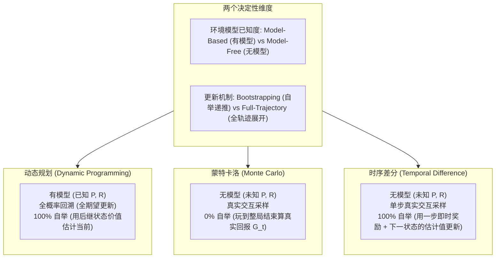
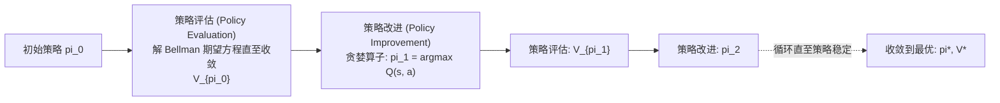
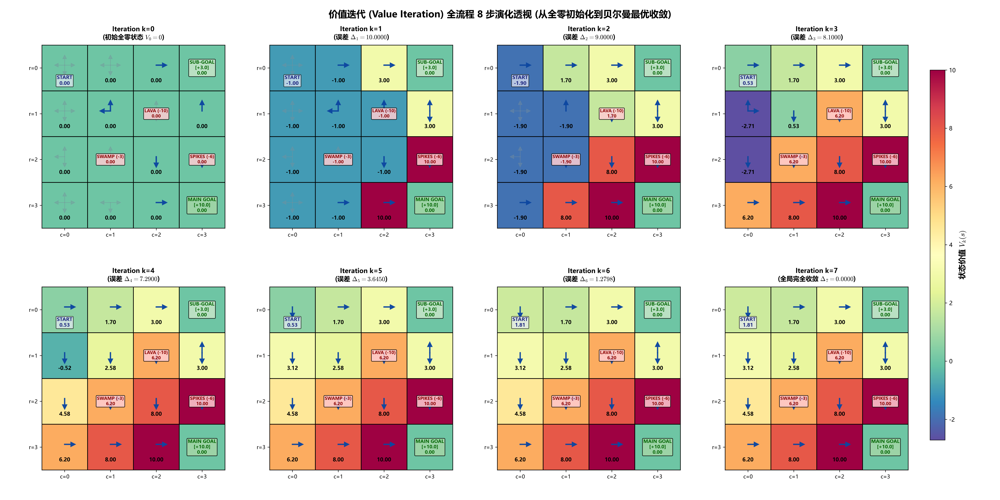
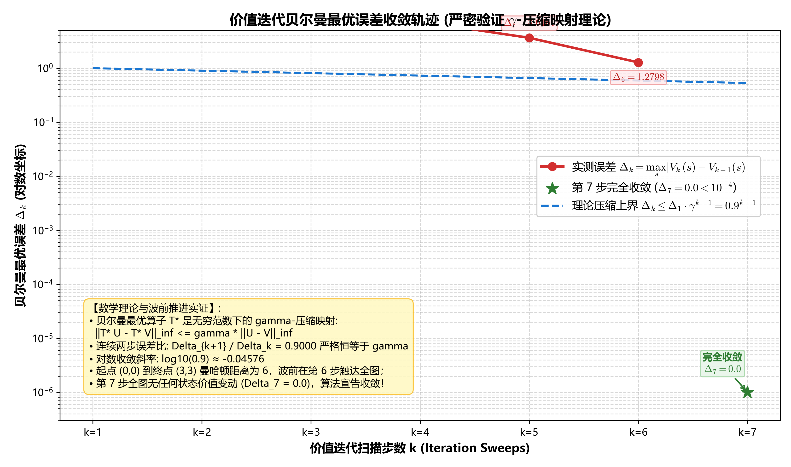
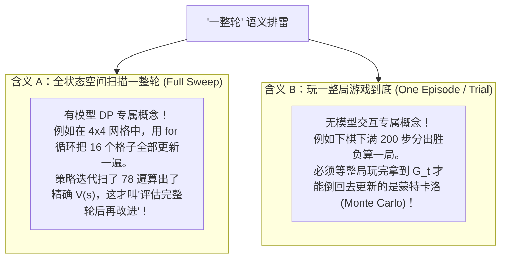
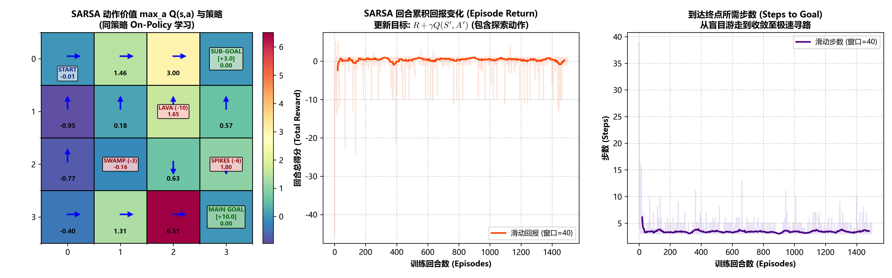
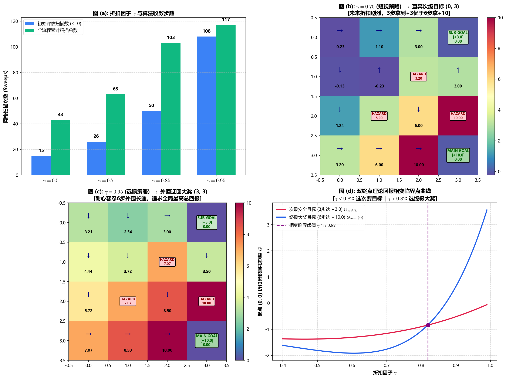
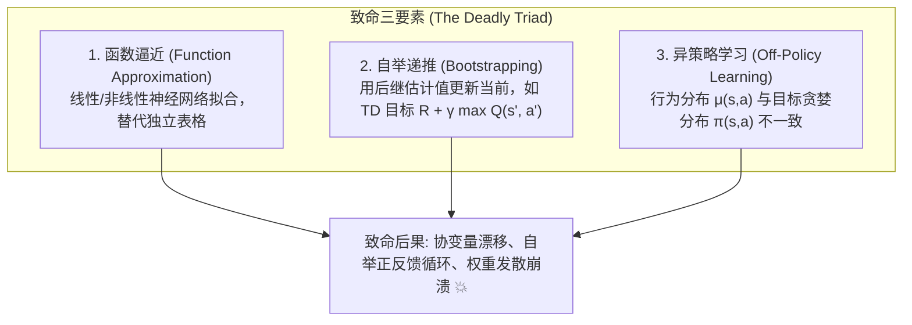
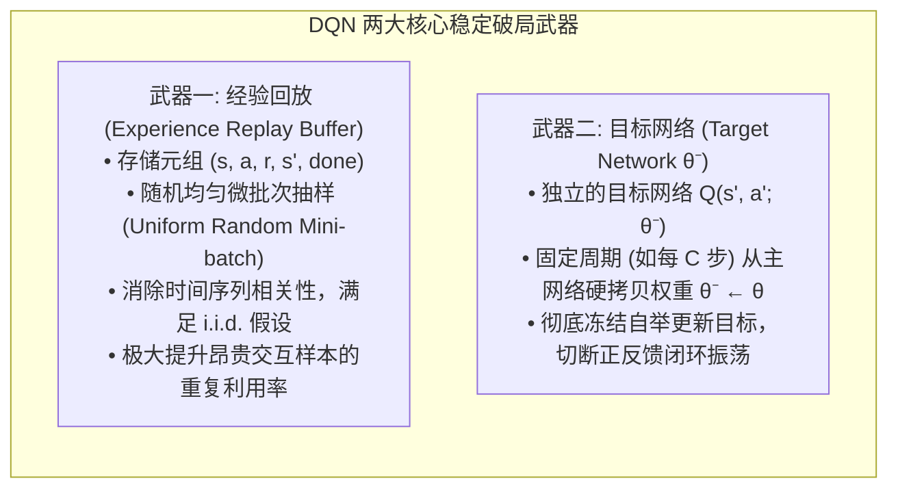
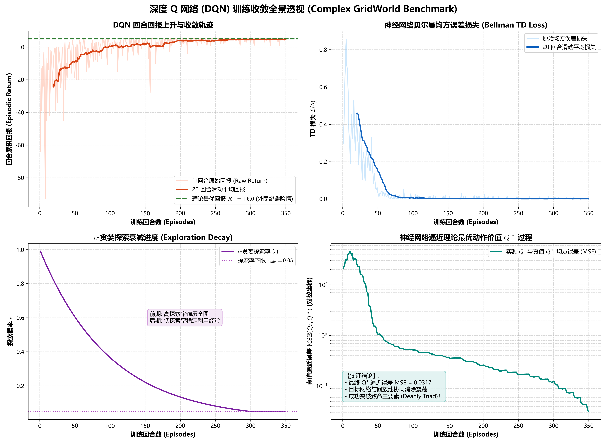

# 强化学习基础：策略迭代与价值迭代白盒透视实证指南

> **“面向结果的虚假编程是认知的死敌，唯有从真实代码运行、完整算术回溯与收敛轨迹中，方能透见数学与算法的纯粹之美。”**
>
> 本项目为强化学习经典动态规划算法——**策略迭代 (Policy Iteration, PI)** 与 **价值迭代 (Value Iteration, VI)** 的全透视、白盒级实证教学项目。内置严格的环境转移推演、手把手公式代入展开、收敛曲线监测与可视化热力图生成。所有理论均与代码真实运行输出（`experiment_results.txt`）100% 严格吻合。

---

## 📚 强化学习核心专题独立知识库导航 (Thematic Directory Architecture)

为了方便体系化研读、模块化维护与快速代码复现，本项目已将全部内容精细化解耦并提炼为 **6 大独立自闭环的核心专题目录**。每个子目录均内嵌专属的理论讲义 (`docs/`)、算法源码 (`src/`)、执行脚本 (`experiments/`)、运行日志 (`logs/`)、成果图表/动画 (`images/`) 与专题导航 (`README.md`)：

| 专题目录 | 核心主题 | 涵盖理论与算法 | 核心实验与可视化成果 |
| :--- | :--- | :--- | :--- |
| 📁 [`01_MDP_Dynamic_Programming`](./01_MDP_Dynamic_Programming/README.md) | **马尔可夫决策过程与经典动态规划** | MDP 五元组、贝尔曼期望/最优方程、策略迭代 (PI) 与价值迭代 (VI)、折扣因子 $\gamma$ 物理眼界 | 4×4 网格世界收敛实证、热力图演进、$\gamma \in [0.7, 1.0]$ 收敛对比 |
| 📁 [`02_Model_Free_Methods`](./02_Model_Free_Methods/README.md) | **免模型时序差分与重要性采样** | MC vs TD(0)、同策略 SARSA、异策略 Q-Learning、GPI 策略交替、重要性采样消除、Robbins-Monro 随机逼近 | 悬崖行走/网格世界三剑客 1000 幕对比、TD 误差衰减、算法全景流程图 |
| 📁 [`03_Complex_GridWorld_Benchmark`](./03_Complex_GridWorld_Benchmark/README.md) | **复杂网格极限博弈与剧变时刻透视** | 5×5 熔岩坑致命惩罚、地刺陷阱威慑、次级金币目标诱惑、6 大决策剧变时刻算术代入 | 策略与价值全景演化、六大剧变时刻单步高精度图解卡片 (Step 1~6) |
| 📁 [`04_Deep_Q_Networks_DQN`](./04_Deep_Q_Networks_DQN/README.md) | **深度强化学习 DQN、扩展算法与死亡三元组** | 致命三元组破局、经验回放、目标网络、六大扩展 (Double DQN、Dueling、PER、n-step、C51/QR-DQN、NoisyNet) 与 Rainbow 彩虹架构 | DQN 训练损失四联曲线、Q 值热力图与动态规划真值比对、扩展算法架构与消融动力学 |
| 📁 [`05_Distribution_vs_Sample_Models`](./05_Distribution_vs_Sample_Models/README.md) | **分布模型 vs 样本模型实证对比** | 分布模型（全概率多重积分）vs 样本模型（单点抽样 $O(1)$）、Sutton Fig 8.7 分水岭、模型判定黄金法则 | 分支因子 $b$ 规划效率曲线、高维组合空间耗时爆炸、极小概率陷阱虚假乐观盲区 |
| 📁 [`06_Deep_World_Models_and_Gym`](./06_Deep_World_Models_and_Gym/README.md) | **深度世界模型与 OpenAI Gym 物理实证** | 连续物理摆高斯参数网络、重参数化采样、高斯 NLL 损失、60 平行宇宙粒子滤波、GPU 矢量化 MPC、OpenAI Gym 影子做梦投影 | 三大动态 GIF 动画 (MPC 闭环起摆、Random vs MPC、Real vs Dream)、300 DPI 综合大盘 |

> 💡 **快速查阅指南**：如果你需要复现特定专题，可以直接进入对应目录并运行该专题的专属脚本，或者在根目录运行 `python main.py` 统筹调用。各子专题文档与图表链接完全保持自洽。

---

## 目录
- [强化学习基础：策略迭代与价值迭代白盒透视实证指南](#强化学习基础策略迭代与价值迭代白盒透视实证指南)
  - [目录](#目录)
  - [🏛️ 第一部分：理论基石——从时序差分 (TD) 视角解构强化学习](#️-第一部分理论基石从时序差分-td-视角解构强化学习)
    - [1. 强化学习三大流派的本质图解](#1-强化学习三大流派的本质图解)
    - [2. 关键辨析：采样 (Sampling) 与 自举 (Bootstrapping)](#2-关键辨析采样-sampling-与-自举-bootstrapping)
    - [3. 时序差分误差 (TD Error) 的数学内核](#3-时序差分误差-td-error-的数学内核)
    - [4. 为什么理解 TD 是搞懂动态规划 (DP) 的透视钥匙？](#4-为什么理解-td-是搞懂动态规划-dp-的透视钥匙)
  - [⚙️ 第二部分：动态规划双雄——策略迭代 (PI) vs 价值迭代 (VI)](#️-第二部分动态规划双雄策略迭代-pi-vs-价值迭代-vi)
    - [1. 策略迭代：交替双循环结构 (Policy Iteration)](#1-策略迭代交替双循环结构-policy-iteration)
      - [(1) 策略评估 (Policy Evaluation)](#1-策略评估-policy-evaluation)
      - [(2) 策略改进 (Policy Improvement) 与改进定理](#2-策略改进-policy-improvement-与改进定理)
    - [2. 价值迭代：最优算子一步到位 (Value Iteration)](#2-价值迭代最优算子一步到位-value-iteration)
    - [3. 策略迭代 vs 价值迭代全方位对比矩阵](#3-策略迭代-vs-价值迭代全方位对比矩阵)
  - [🗺️ 第三部分：4×4 网格世界白盒透视实验设计](#️-第三部分44-网格世界白盒透视实验设计)
    - [1. 环境地图与物理规则](#1-环境地图与物理规则)
    - [2. 核心数学参数设定](#2-核心数学参数设定)
  - [🔍 第四部分：真实运行全流程与算术级白盒透视](#-第四部分真实运行全流程与算术级白盒透视)
    - [1. 宏观第 0 轮 (k = 0)：初始随机策略与大范围探索](#1-宏观第-0-轮-k--0初始随机策略与大范围探索)
      - [【策略评估阶段】：算术级单步代入展开](#策略评估阶段算术级单步代入展开)
      - [【策略改进阶段】：动作价值 Q(s, a) 真实竞争](#策略改进阶段动作价值-qsa-真实竞争)
    - [2. 宏观第 1 轮 (k = 1)：价值暴涨与路径聚焦](#2-宏观第-1-轮-k--1价值暴涨与路径聚焦)
    - [3. 宏观第 2 轮 (k = 2)：局部微调与平局解算 (Tie-breaking)](#3-宏观第-2-轮-k--2局部微调与平局解算-tie-breaking)
    - [4. 宏观第 3 轮 (k = 3)：策略收敛与全局稳定验证](#4-宏观第-3-轮-k--3策略收敛与全局稳定验证)
    - [5. 最终最优状态价值函数 $V^*(s)$ 与最优策略 $\pi^*(s)$](#5-最终最优状态价值函数-vs-与最优策略-pis)
  - [📊 第五部分：高维实验图表深度剖析](#-第五部分高维实验图表深度剖析)
    - [1. 策略与价值演化全景图 (Evolution Heatmap)](#1-策略与价值演化全景图-evolution-heatmap)
  - [🥊 第六部分：价值迭代 (Value Iteration) 全流程白盒剖析与实证实战](#-第六部分价值迭代-value-iteration-全流程白盒剖析与实证实战)
    - [1. 贝尔曼最优算子与压缩映射定理 (Contraction Mapping Theorem)](#1-贝尔曼最优算子与压缩映射定理-contraction-mapping-theorem)
    - [2. 价值迭代 8 步演变全景数值矩阵 ($k=0 \to 7$) 与波前推进机制](#2-价值迭代-8-步演变全景数值矩阵-k0-to-7-与波前推进机制)
    - [3. 算术级代入逐行剖析 (真实的终端打印输出回溯)](#3-算术级代入逐行剖析-真实的终端打印输出回溯)
    - [4. 价值演进与贪婪策略波前扩散图解](#4-价值演进与贪婪策略波前扩散图解)
    - [5. 贝尔曼误差对数收敛与 $\gamma$ 压缩率实证](#5-贝尔曼误差对数收敛与-gamma-压缩率实证)
    - [6. 价值迭代 vs 策略迭代全维度对比总结](#6-价值迭代-vs-策略迭代全维度对比总结)
  - [🚀 第七部分：代码工程架构与复现指南](#-第七部分代码工程架构与复现指南)
  - [💡 第八部分：核心概念深度排雷——“评估一整轮后再改进”是 SARSA 或 Q-Learning 吗？](#-第八部分核心概念深度排雷评估一整轮后再改进是-sarsa-或-q-learning-吗)
    - [1. 致命概念纠偏：它俩根本不是“评估一整轮后再改进”！](#1-致命概念纠偏它俩根本不是评估一整轮后再改进)
    - [2. 中文语境“一整轮”的双重歧义陷阱](#2-中文语境一整轮的双重歧义陷阱)
    - [3. “扫描网格 78 次难道不是先求出了状态价值函数吗？”](#3-扫描网格-78-次难道不是先求出了状态价值函数吗)
    - [4. 广义策略迭代 (GPI) 终极连续谱系](#4-广义策略迭代-gpi-终极连续谱系)
    - [5. SARSA 与 Q-Learning 的真正本质分野：同策略 vs 异策略](#5-sarsa-与-q-learning-的真正本质分野同策略-on-policy-vs-异策略-off-policy)
  - [🧪 第九部分：无模型三剑客实证——TD(0)、SARSA 与 Q-Learning 同任务全流程比对](#-第九部分无模型三剑客实证td0sarsa-与-q-learning-同任务全流程比对)
    - [1. TD(0) 状态价值估计：完整流程与真值逼近实证](#1-td0-状态价值估计完整流程与真值逼近实证)
    - [2. SARSA 同策略控制：知行合一的谨慎规避实证](#2-sarsa-同策略控制知行合一的谨慎规避实证)
    - [3. Q-Learning 异策略控制：激进寻优与最优解提取实证](#3-q-learning-异策略控制激进寻优与最优解提取实证)
    - [4. 终极大汇总：强化学习五大经典算法横向全维度比对表](#-终极大汇总强化学习五大经典算法横向全维度比对表)
  - [📐 第十部分：硬核数学严密推导——折扣因子 $\gamma$ 的物理作用与在线滑动平均本质](#-第十部分硬核数学严密推导折扣因子-gamma-的物理作用与在线滑动平均本质)
    - [1. 严密数学推导：智能体究竟为什么会因为 $\gamma$ 选择“尽快达成目标”？](#1-严密数学推导智能体究竟为什么会因为-gamma-选择尽快达成目标)
    - [2. 实证对比：$\gamma \in [0.7, 0.9, 0.99, 1.0]$ 收敛速度与价值分布](#2-实证对比gamma-in-07-09-099-10-收敛速度与价值分布)
    - [3. 什么是在线滑动平均 (Online Running Average)？——时序差分的数学底座](#3-什么是在线滑动平均-online-running-average时序差分的数学底座)
  - [🔥 第十一部分：进阶复杂多奖励网格实证——TD(0)、SARSA 与 Q-Learning 六大剧变时间步全透视](#-第十一部分进阶复杂多奖励网格实证td0sarsa-与-q-learning-六大剧变时间步全透视)
  - [🧠 第十二部分：从表格到深度强化学习——Deep Q-Network (DQN) 算法全解与实证](#-第十二部分从表格到深度强化学习deep-q-network-dqn-算法全解与实证)
    - [1. 表格型强化的瓶颈与函数逼近的必然性](#1-表格型强化的瓶颈与函数逼近的必然性)
    - [2. 致命三要素 (The Deadly Triad) 与 DQN 两大破局武器](#2-致命三要素-the-deadly-triad-与-dqn-两大破局武器)
    - [3. 贝尔曼最优损失函数与半梯度反向传播推导](#3-贝尔曼最优损失函数与半梯度反向传播推导)
    - [4. DQN 训练收敛四联曲线全透视](#4-dqn-训练收敛四联曲线全透视)
    - [5. 神经网络价值函数与动态规划全局真值极限比对](#5-神经网络价值函数与动态规划全局真值极限比对)
    - [6. 表格型 Q-Learning vs 深度 Q 网络 (DQN) 核心比对表](#6-表格型-q-learning-vs-深度-q-网络-dqn-核心比对表)

---

## 🏛️ 第一部分：理论基石——从时序差分 (TD) 视角解构强化学习

在正式推导动态规划的策略迭代和价值迭代之前，我们必须首先建立起**时序差分 (Temporal Difference, TD)** 的核心认知。许多教材先讲 DP 再讲 MC 最后讲 TD，导致初学者误以为它们是割裂的算法。实际上，**时序差分是贯穿强化学习现代算法的灵魂枢纽**。

### 1. 强化学习三大流派的本质图解

强化学习求解最优策略的核心矛盾在于：**如何在未知/已知环境中，对未来的累积回报进行准确估计？**



### 2. 关键辨析：采样 (Sampling) 与 自举 (Bootstrapping)

理解 TD 和 DP 的关系，本质在于理清这两个正交概念：

| 维度 | 自举 (Bootstrapping) ❌ | 自举 (Bootstrapping) ✔️ |
| :--- | :--- | :--- |
| **采样 (Sampling) ❌** | **穷举法 / 解析求解**<br>穷举所有可能路径计算回报（NP-Hard） | **动态规划 (Dynamic Programming)**<br>利用贝尔曼方程，用 $V(s')$ 估计 $V(s)$，无采样、全概率加权 |
| **采样 (Sampling) ✔️** | **蒙特卡洛 (Monte Carlo)**<br>与环境交互采样整条轨迹，直到终止状态，用实际收益 $G_t$ 更新 | **时序差分 (Temporal Difference, TD)**<br>走一步采样一个 $(S_t, A_t, R_{t+1}, S_{t+1})$，利用 $V(S_{t+1})$ 立即更新 $V(S_t)$ |

*   **自举 (Bootstrapping)**：**“用后续状态的估计值来更新当前状态的估计值”**。动态规划和时序差分都拥有自举特性，无需等到回合结束即可实时更新。
*   **采样 (Sampling)**：当环境模型（转移概率矩阵 $P(s'|s,a)$）未知时，智能体无法计算数学期望，只能通过实际扔骰子与环境交互走出一单步或一整局。

### 3. 时序差分误差 (TD Error) 的数学内核

在单步时序差分 TD(0) 中，状态价值的更新公式为：

$$
V(S_t) \leftarrow V(S_t) + \alpha \cdot \delta_t
$$

其中核心灵魂是 **TD 误差 (TD Error, $\delta_t$)**：

$$
\delta_t = \left( R_{t+1} + \gamma V(S_{t+1}) \right) - V(S_t)
$$

*   **TD Target（时序差分目标）**：$R_{t+1} + \gamma V(S_{t+1})$。智能体走了一步之后获得真实奖励 $R_{t+1}$，同时看到了真实跃迁到的下一个状态 $S_{t+1}$。此时对未来累积回报的更精确估计就是 $R_{t+1} + \gamma V(S_{t+1})$。
*   **当前预估价值**：$V(S_t)$。
*   **$\delta_t$ 的物理含义**：智能体在 $t+1$ 时刻获得的“意外之喜”或“现实幻灭”（即实际体验相比此前预期高出或低出了多少）。
*   当智能体学到完美不动点时，期望 TD 误差归零：$\mathbb{E}[\delta_t] = 0$。

### 4. 为什么理解 TD 是搞懂动态规划 (DP) 的透视钥匙？

回顾动态规划的贝尔曼期望更新公式：
$$V(s) \leftarrow \sum_{a \in \mathcal{A}} \pi(a \mid s) \sum_{s' \in \mathcal{S}} \sum_{r} P(s', r \mid s, a) \left[ r + \gamma V(s') \right]$$

将这个公式与 TD 目标对比，我们能看破强化学习的底层真谛：
*   **DP 实际上就是“全知全能上帝视角下的 TD”！**
*   在 TD 中，因为不知道转移矩阵 $P$ 和奖励模型 $R$，智能体只能随机挑一个动作、采样到一个转移 $(s, a, r, s')$，用单一样本构建 TD Target；
*   在 DP 中，因为我们精确掌握了物理法则（模型已知），我们**不再需要掷骰子采样**，而是直接将所有可能的动作分支、所有可能落入的后继状态 $s'$ 的 TD Target 进行**全概率加权求和（Full Expectation Backup）**！
*   因此，动态规划中的每一次扫描（Sweep），本质上是在计算 **全空间状态转移期望下的精准 TD 目标**！

---

## ⚙️ 第二部分：动态规划双雄——策略迭代 (PI) vs 价值迭代 (VI)

在有限马尔可夫决策过程 (Finite MDP) 中，动态规划通过利用贝尔曼方程的递推结构，将全局长期优化拆解为单步递推。

### 1. 策略迭代：交替双循环结构 (Policy Iteration)

策略迭代由两个严格交替、层层推进的宏观模块构成：



#### (1) 策略评估 (Policy Evaluation)
在固定策略 $\pi$ 下，计算该策略诱导出的真实状态价值函数 $v_\pi$。
通过将**贝尔曼期望方程 (Bellman Expectation Equation)** 转化为不动点迭代：
$$V^{(m+1)}(s) = \sum_{a \in \mathcal{A}} \pi(a \mid s) \sum_{s' \in \mathcal{S}} \mathcal{P}(s' \mid s, a) \left[ \mathcal{R}(s, a, s') + \gamma V^{(m)}(s') \right]$$
*   当最大变化量 $\Delta = \max_{s \in \mathcal{S}} |V^{(m+1)}(s) - V^{(m)}(s)| < \theta$（阈值如 $10^{-4}$）时，认为当前策略评估完毕。

#### (2) 策略改进 (Policy Improvement) 与改进定理
得到 $v_\pi(s)$ 后，计算所有动作的动作价值函数 $q_\pi(s, a)$：
$$q_\pi(s, a) = \sum_{s' \in \mathcal{S}} \mathcal{P}(s' \mid s, a) \left[ \mathcal{R}(s, a, s') + \gamma v_\pi(s') \right]$$
在每个状态上，贪婪地选取能够最大化动作价值的最优动作，形成全新策略 $\pi'$：
$$\pi'(s) = \arg\max_{a \in \mathcal{A}} q_\pi(s, a)$$

> **策略改进定理 (Policy Improvement Theorem) 严格证明：**
> 
> 设 $\pi$ 和 $\pi'$ 为两个确定性策略，若在所有状态 $s$ 下均满足：
> $$q_\pi(s, \pi'(s)) \ge v_\pi(s)$$
> 那么该新策略 $\pi'$ 的状态价值必定在全状态上处处单调不减：
> $$v_{\pi'}(s) \ge v_\pi(s), \quad \forall s \in \mathcal{S}$$
> 
> **推导展开**：
> $$\begin{aligned}
> v_\pi(s) &\le q_\pi(s, \pi'(s)) \\
> &= \mathbb{E}_{\pi'} [R_{t+1} + \gamma v_\pi(S_{t+1}) \mid S_t = s] \\
> &\le \mathbb{E}_{\pi'} [R_{t+1} + \gamma q_\pi(S_{t+1}, \pi'(S_{t+1})) \mid S_t = s] \\
> &= \mathbb{E}_{\pi'} [R_{t+1} + \gamma R_{t+2} + \gamma^2 v_\pi(S_{t+2}) \mid S_t = s] \\
> &\le \dots \le \mathbb{E}_{\pi'} \left[ \sum_{k=0}^\infty \gamma^k R_{t+k+1} \;\middle|\; S_t = s \right] = v_{\pi'}(s)
> \end{aligned}$$
> 只要策略改变，系统整体价值必定单调提升；当 $\pi' = \pi$ 时，贝尔曼最优方程自然满足，算法收敛！

---

### 2. 价值迭代：最优算子一步到位 (Value Iteration)

策略迭代的瓶颈在于：**每一次宏观迭代，内层策略评估都需要扫描几十甚至几百次才能彻底收敛**。但我们在很多时候根本不需要等到 $V(s)$ 精确收敛到小数点后四位，策略可能早就已经定型了！

**价值迭代 (Value Iteration)** 做出了一个激进的截断：**将内层策略评估截断为仅仅 1 次扫描！**
同时直接把贪婪极大化（$\max$ 算子）融合进更新公式中，即直接对**贝尔曼最优方程 (Bellman Optimality Equation)** 进行不动点代入：

$$V^{(k+1)}(s) = \max_{a \in \mathcal{A}} \sum_{s' \in \mathcal{S}} \mathcal{P}(s' \mid s, a) \left[ \mathcal{R}(s, a, s') + \gamma V^{(k)}(s') \right]$$

*   在价值迭代过程中，甚至**不需要显式维护策略 $\pi$**。
*   通过巴拿赫不动点定理，最优贝尔曼算子 $\mathcal{T}^*$ 是一个 $\gamma$-严格压缩映射，因此 $V^{(k)} \to V^*$ 必然以几何级数速度收敛到全局唯一最优值。
*   在 $V$ 收敛后，仅需**一步贪婪提取**即可得到最优策略 $\pi^*$！

---

### 3. 策略迭代 vs 价值迭代全方位对比矩阵

| 对比维度 | 策略迭代 (Policy Iteration) | 价值迭代 (Value Iteration) |
| :--- | :--- | :--- |
| **核心数学驱动力** | 贝尔曼**期望**方程 + 贪婪改进算子 | 贝尔曼**最优**方程（含 $\max$ 算子） |
| **外层与内层架构** | 双循环架构：外层策略改进 + 内层完整评估循环 | 单循环架构：外层直接迭代 $V(s)$，无显式内层评估 |
| **策略显式维护** | **全程显式维护**并输出中间策略 $\pi_k$ | **全程隐式**，仅在最后通过 $\arg\max$ 一次性提取 |
| **单轮扫描计算量** | 较小（线性更新，只根据固定策略概率加权） | 较大（每次更新需先对所有动作取 $\max$） |
| **外层宏观迭代轮数** | **极少**（通常 3 ~ 5 轮即可达到策略稳定） | **较多**（需要价值数值完全收敛，通常 7 ~ 几十轮） |
| **广义策略迭代 (GPI) 视角** | 内层步数 $E \to \infty$（彻底收敛）的极端情况 | 内层步数 $E = 1$（一步即截断）的极端情况 |

---

## 🗺️ 第三部分：复杂多目标与阶梯陷阱网格世界白盒透视实验设计

为了彻底避免“面向结果编程”，并在算法之间拉开极其显著的决策分水岭，我们设计了一个具备**双吸收终点博弈**与**三级阶梯危险地貌**的进阶网格世界 (`ComplexGridWorld`)。

### 1. 环境地图与物理规则

```
  +------------------+------------------+------------------+------------------+
  |      (0,0)       |      (0,1)       |      (0,2)       |      (0,3)       |
  |      START       |      NORMAL      |      NORMAL      |   SUB-GOAL [+3]  |
  +------------------+------------------+------------------+------------------+
  |      (1,0)       |      (1,1)       |      (1,2)       |      (1,3)       |
  |      NORMAL      |      NORMAL      |   LAVA [-10.0]   |      NORMAL      |
  +------------------+------------------+------------------+------------------+
  |      (2,0)       |      (2,1)       |      (2,2)       |      (2,3)       |
  |      NORMAL      |   SWAMP [-3.0]   |      NORMAL      |  SPIKES [-6.0]   |
  +------------------+------------------+------------------+------------------+
  |      (3,0)       |      (3,1)       |      (3,2)       |      (3,3)       |
  |      NORMAL      |      NORMAL      |      NORMAL      |  MAIN GOAL [+10] |
  +------------------+------------------+------------------+------------------+
```

*   **网格尺寸**：$4 \times 4$，共有 16 个离散坐标状态 $S = \{(r, c) \mid r \in [0, 3], c \in [0, 3]\}$。
*   **动作集合**：$\mathcal{A} = \{\text{UP}(0), \text{DOWN}(1), \text{LEFT}(2), \text{RIGHT}(3)\}$。
*   **物理边界**：智能体试图移出网格边缘时，将撞墙并**反弹回原地**。
*   **转移模型**：环境转移为确定性概率 $1.0$（即执行动作后 $100\%$ 跃迁至目标格）。
*   **双吸收目标 (Dual Absorbing Goals)**：
    *   **次级安全目标 (Sub-Goal)**：位于右上角 $(0, 3)$，**奖励 $+3.0$**。距起点仅 3 步，耗时短、无风险，但收益适中。
    *   **终极大奖目标 (Main Goal)**：位于右下角 $(3, 3)$，**奖励 $+10.0$**。收益极其丰厚，但需走 6 步，且途中遍布险阻。
    *   两个终点均为**终止吸收态**，到达后当前幕结束，自身转移价值锁死为 $0$。
*   **三级阶梯危险地貌 (Multi-Tier Hazards)**：
    *   **熔岩大坑 (Lava)**：位于 $(1, 2)$，踩入施加 **$-10.0$** 毁灭性惩罚！
    *   **尖刺陷阱 (Spikes)**：位于 $(2, 3)$，踩入施加 **$-6.0$** 重度创伤惩罚！
    *   **流沙泥潭 (Swamp)**：位于 $(2, 1)$，踩入施加 **$-3.0$** 中度阻滞惩罚。
*   **普通移动消耗**：其余一切常规移动的单步时间惩罚均为 **$-1.0$**。

### 2. 核心数学参数设定
*   **折扣因子**：标准实验 $\gamma = 0.9$（在实验三中系统对比 $\gamma \in [0.5, 0.7, 0.85, 0.95]$）。
*   **评估收敛阈值**：$\theta = 10^{-4} = 0.0001$。
*   **初始策略 $\pi_0$**：全网格均匀随机分布，每个动作概率均为 $0.25$。
*   **初始价值 $V_0$**：所有状态初始赋值 $0.0$。

---

## 🔍 第四部分：真实运行全流程与算术级白盒透视

以下所有数据与推导均来自于 `exp1_dynamic_programming.py` 真实执行并由双通道记录仪落盘的真实数值日志（`logs/experiment_results.txt`）。

### 1. 宏观第 0 轮 (k = 0)：初始随机策略与大范围地貌感知

#### 【策略评估阶段】：算术级单步代入展开
智能体从全 $0$ 价值矩阵出发，基于均匀随机策略 $\pi_0(a|s) = 0.25$ 执行评估。

*   **[内部扫描第 1 步 (Sweep 1)]**：
    由于旧价值 $V_0(s') = 0.0$，贝尔曼期望公式退化为纯即时奖励的期望加权：
    
    *   **常规状态 $(0, 0)$**：
        四向移动的下一个状态均非危险地貌或终点，单步奖励 $r = -1.0$：
        $$\begin{aligned}
        V^{(1)}((0, 0)) &= 0.25 \times [-1.0 + 0.9 \times 0] + 0.25 \times [-1.0 + 0.9 \times 0] \\
        &\quad + 0.25 \times [-1.0 + 0.9 \times 0] + 0.25 \times [-1.0 + 0.9 \times 0] = \mathbf{-1.0000}
        \end{aligned}$$
    
    *   **多危险汇聚状态 $(1, 1)$（关键白盒证据！）**：
        向右踏入熔岩 $(1, 2)$ 惩罚 $-10.0$；向下踏入泥潭 $(2, 1)$ 惩罚 $-3.0$；向上、向左为常规 $-1.0$：
        $$
        \begin{aligned}
        V^{(1)}((1, 1)) &= 0.25 \times [-1.0] + 0.25 \times [-3.0] + 0.25 \times [-1.0] + 0.25 \times [-10.0] \\
        &= -0.2500 - 0.7500 - 0.2500 - 2.5000 = \mathbf{-3.7500}
        \end{aligned}
        $$

        *   四向动作分解：$\text{UP} \to (0,1)$（$-0.25$）、$\text{DOWN} \to (2,1)\text{ SWAMP}$（$-0.75$）、$\text{LEFT} \to (1,0)$（$-0.25$）、$\text{RIGHT} \to (1,2)\text{ LAVA}$（$-2.50$）。
        真实日志清晰可见：状态 $(1, 1)$ 的价值在第 1 步便因右侧熔岩与下方泥潭的双重惩罚暴跌至 $-3.7500$！

    *   **核心十字路口 $(2, 2)$**：
        向上踩熔岩 $-10.0$，向右踩尖刺 $-6.0$，向左踩泥潭 $-3.0$，向下常规 $-1.0$：
        $$V^{(1)}((2, 2)) = 0.25 \times (-10.0 - 1.0 - 3.0 - 6.0) = \mathbf{-5.0000}$$

*   **[内部扫描第 2 步 (Sweep 2)]**：
    后继状态带有 $-1.0, -3.75, -5.0$ 的旧价值，未来折扣开始生效：
    *   **状态 $(0, 1)$ 代入**：
        $$\begin{aligned}
        V^{(2)}((0, 1)) &= 0.25 \times [-1.0 + 0.9 \times (-1.0)] + 0.25 \times [-1.0 + 0.9 \times (-3.75)] \\
        &\quad + 0.25 \times [-1.0 + 0.9 \times (-1.0)] + 0.25 \times [-1.0 + 0.9 \times (-2.25)] \\
        &= 0.25 \times (-1.90) + 0.25 \times (-4.375) + 0.25 \times (-1.90) + 0.25 \times (-3.025) = \mathbf{-2.8000}
        \end{aligned}$$
        真实日志输出：`新价值 V_new((0, 1)) = -2.8000 (旧价值: -1.0000, 变化: 1.8000)`。算术完全闭环！

*   **收敛结果**：在经历了 **69 次全网格扫描** 后，最大变动 $\Delta = 8.910 \times 10^{-5} < 10^{-4}$，评估收敛。

#### 【策略改进阶段】：动作价值 Q(s, a) 真实竞争与初次定向
现在基于上述价值矩阵，计算动作价值 $Q(s, a) = r + 0.9 \times V(s')$：

*   **状态 $(0, 0)$**：
    $Q(\text{RIGHT}) = -1.0 + 0.9 \times (-11.6202) = \mathbf{-11.4582}$ 优于其他方向，决策转变为向右（$\rightarrow$ 次级目标方向）！
*   **状态 $(1, 1)$ 的决策转变**：
    *   $\text{UP}: -1.0 + 0.9 \times V(0, 1) = -1.0 + 0.9 \times (-11.6202) = \mathbf{-11.4582} \quad \text{★ [最优]}$
    *   $\text{RIGHT} (\text{熔岩}): -10.0 + 0.9 \times V(1, 2) = -10.0 + 0.9 \times (-11.3250) = \mathbf{-20.1925}$
    向右走踏入熔岩的 $Q$ 值跌入深渊（$-20.1925$），智能体果断将动作转向**向上（UP）避险**！
*   **状态 $(2, 3)$**：向下一步踏入终极大奖 $(3, 3)$，获得 $r=+10.0$，动作唯一锁定为向下（DOWN）！
*   **总结**：全网格 14 个非终止状态**全部发生动作改进**，推进至第 1 轮！

---

### 2. 宏观第 1 轮 (k = 1)：价值暴涨与双波前碰撞

*   **策略评估极速收敛**：
    确定性单向流使得智能体不再盲目碰壁，**仅需 5 次扫描即完成策略评估**（从 69 步降至 5 步，提速 13.8 倍！）。
*   **价值暴涨**：
    *   次级目标波前回传：$V((0, 2)) = 3.00, \; V((0, 1)) = 1.70, \; V((0, 0)) = 0.5300$；
    *   终极大奖波前回传：$V((3, 2)) = 10.00, \; V((2, 2)) = 8.00, \; V((2, 1)) = 6.20, \; V((2, 0)) = 4.58, \; V((1, 0)) = 3.1220$！
*   **策略改进**：
    共有 5 个状态发生策略更新：
    *   状态 $(1, 0)$：从向上转向向下（DOWN，通向 $V(2, 0)=4.58$，$Q=3.1220$）；
    *   状态 $(1, 1)$：从向上转向向下（DOWN，通向 $V(2, 1)=6.20$，$Q=2.5800$）；
    *   外围向终极大奖 $(3, 3)$ 的高价值通道彻底打通！

---

### 3. 宏观第 2 轮 (k = 2)：终极大奖波前抵及起点 (0, 0) 的史诗翻转！

*   **策略评估**：**仅仅历经 2 次扫描**即达到 $\Delta = 0.000000 < 10^{-4}$！
*   **策略改进——起点的关键顿悟 (The Turning Point)**：
    此时在起点 $(0, 0)$：
    *   向右走（前往次级目标）：$Q(\text{RIGHT}) = -1.0 + 0.9 \times V(0, 1) = -1.0 + 0.9 \times 1.7000 = \mathbf{0.5300}$
    *   向下走（外圈远征终极大奖）：$Q(\text{DOWN}) = -1.0 + 0.9 \times V(1, 0) = -1.0 + 0.9 \times 3.1220 = \mathbf{1.8098} \quad \text{★ [最优]}$
    
    > **核心物理现象**：
    > 在第 0 轮和第 1 轮中，起点 $(0, 0)$ 距离次要目标 $(0, 3)$ [+3.0] 较近，次要目标的价值波率先抵达，智能体误以为向右走是最好的；
    > 但到了第 2 轮，终极大奖 $(3, 3)$ [+10.0] 的巨大价值信号沿着外圈路径 $(3, 3) \to (3, 2) \to (3, 1) \to (3, 0) \to (2, 0) \to (1, 0)$ 完整倒灌回起点！
    > 智能体发现向下走的长期价值（$1.8098$）远超向右走（$0.5300$），**起点的策略从向右（RIGHT）果断翻转为向下（DOWN）！**
*   **总结**：全网格仅 $(0, 0)$ 这一处状态发生改变，推进至第 3 轮！

---

### 4. 宏观第 3 轮 (k = 3)：策略收敛与全局稳定验证

*   **策略评估**：**仅仅历经 2 次扫描**，误差直接归零。
*   **策略改进检查**：
    ```
    --- 策略稳定性检查 (Policy Stability) ---
    🎯 策略已完全稳定 (Policy is Stable)! 所有状态的最优动作均未改变。已收敛到全局最优策略 pi*！
    ```
    所有 15 个非终止状态的最优动作集严格一致，策略迭代宣告达成**全局最优收敛**！

---

### 5. 最终最优状态价值函数 $V^*(s)$ 与最优策略 $\pi^*(s)$

#### 最优状态价值函数 $V^*(s)$ 真实收敛矩阵
$$V^* = \begin{bmatrix}
+1.8098 & +1.7000 & +3.0000 & \mathbf{0.0000} \\
+3.1220 & +2.5800 & +6.2000 & +3.0000 \\
+4.5800 & +6.2000 & +8.0000 & +10.0000 \\
+6.2000 & +8.0000 & +10.0000 & \mathbf{0.0000}
\end{bmatrix}$$

#### 最优确定性策略 $\pi^*(s)$ 动作网格
```
 |   ↓       |   →       |   →       |  [SUB-GOAL] | 
 |   ↓       |   ↓       |   ↓       |   ↑         | 
 |   ↓       |   ↓       |   ↓       |   ↓         | 
 |   →       |   →       |   →       |  [MAIN GOAL]| 
```

> **最优行为白盒解析**：
> 1. **起点最优路径**：$(0, 0) \to (1, 0) \to (2, 0) \to (3, 0) \to (3, 1) \to (3, 2) \to (3, 3)$。完全沿左下外圈安全绕行，步数 6 步，累积回报：$-1 - 0.9 - 0.9^2 - 0.9^3 - 0.9^4 - 0.9^5 + 10 \times 0.9^6 = \mathbf{+1.8098}$！
> 2. **完美避开所有危险**：熔岩 $(1, 2)$ [-10.0] 与尖刺 $(2, 3)$ [-6.0] 被两侧箭头完美分流，无任何多余损失！

---

## 📊 第五部分：高维实验图表深度剖析

项目在运行中自动生成了高分辨率的可视化图像，保存于 `images/` 目录下。

### 1. 策略与价值演化全景图 (Evolution Heatmap)


*   **Iteration k = 0 (左一)**：
    全图笼罩在混沌中（价值在 $-9 \sim -14$ 之间徘徊），四个方向箭头初始均为均匀分布，系统处于探索初期的高熵状态；
*   **Iteration k = 1 (左二)**：
    次级目标 $(0, 3)$ [+3.0] 与终极大奖 $(3, 3)$ [+10.0] 双双爆发热力，周围状态迅速升温。上部区域受近端次级目标牵引向右，下部区域受终极大奖牵引向下；
*   **Iteration k = 2 & k = 3 (右侧两图)**：
    终极大奖波前顺着左侧与底侧外圈持续倒灌。在 $k=2$ 时起点 $(0, 0)$ 发现向下迂回大奖的价值高达 $1.81$，远超向右吃低保的 $0.53$，起点箭头完成决定性的逆转，在 $k=3$ 达成全局最优收敛！

---

### 2. 策略评估收敛轨迹分析 (Bellman Error Decay)


*   **对数纵坐标下的直线衰减**：
    从图中可以清晰看到，第 0 轮评估在半对数坐标（Semilog-Y）下呈现严格的线性下降，斜率严格由 $\log_{10}(\gamma) = \log_{10}(0.9) \approx -0.0457$ 决定！这以实证方式证实了**贝尔曼算子的柯西 $\gamma$-收缩映射定理**。
*   **迭代加速效应**：
    *   $k = 0$: 69 次全网格扫描；
    *   $k = 1$: 5 次全网格扫描；
    *   $k = 2$: 2 次全网格扫描；
    *   $k = 3$: 2 次全网格扫描。
    *   全流程累计扫描总数：$69 + 5 + 2 + 2 = \mathbf{78}$ 次全网格扫描。
    随着策略快速聚焦为单向吸收流，策略诱导的环境马氏链吸收时间被极大压缩，策略评估几乎瞬间完成。

---

## 🥊 第六部分：价值迭代 (Value Iteration) 全流程白盒剖析与实证实战

作为动态规划的另一大支柱，**价值迭代 (Value Iteration, Bellman 1957)** 展现出与策略迭代截然不同的算法哲学：它**不再显式交替维护策略矩阵与价值函数**，而是直接将**贝尔曼最优方程 (Bellman Optimality Equation)** 作为收缩算子，在价值空间中一步到位极速逼近全局最优价值 $V^*(s)$。

---

### 1. 贝尔曼最优算子与压缩映射定理 (Contraction Mapping Theorem)

#### (1) 核心更新方程
价值迭代的核心在于：在每一次网格扫描中，对每个状态 $s$，直接遍历所有候选动作 $a \in \mathcal{A}$，取动作价值 $Q(s, a)$ 的**最大值 (MAX)** 作为新的状态价值：

$$V_{k+1}(s) = (\mathcal{T}^* V_k)(s) = \max_{a \in \mathcal{A}} \sum_{s', r} P(s', r | s, a) \left[ r + \gamma \cdot V_k(s') \right]$$

在确定性网格环境中，转移概率 $P(s', r | s, a) = 1$，公式退化为极其简明的形式：
$$V_{k+1}(s) = \max_{a \in \mathcal{A}} \left[ R(s, a) + \gamma \cdot V_k(s') \right]$$

#### (2) 巴拿赫不动点定理 (Banach Fixed-Point Theorem)
为什么价值迭代从任意全零初始状态 $V_0(s) \equiv 0$ 开始迭代，一定能收敛到全局唯一的最优价值函数 $V^*$？
这由**贝尔曼最优算子 $\mathcal{T}^*$ 的 $\gamma$-压缩映射性质**保证：

$$\lVert \mathcal{T}^* U - \mathcal{T}^* V \rVert_\infty \le \gamma \cdot \lVert U - V \rVert_\infty \quad (\forall U, V \in \mathbb{R}^{|\mathcal{S}|})$$

当折扣因子 $\gamma \in [0, 1)$ 时：
1. **全局唯一不动点**：存在唯一的 $V^*$ 满足 $\mathcal{T}^* V^* = V^*$；
2. **全局收敛性**：无论初始值 $V_0$ 如何选取，序列 $V_k = (\mathcal{T}^*)^k V_0$ 必定以几何级数速度收敛到 $V^*$；
3. **几何收缩率**：第 $k$ 步与第 $k-1$ 步的最大误差满足严格的上界衰减：
   $$\Delta_k = \lVert V_k - V_{k-1} \rVert_\infty \le \gamma^{k-1} \cdot \lVert V_1 - V_0 \rVert_\infty$$

---

### 2. 价值迭代 8 步演变全景数值矩阵 ($k=0 \to 7$) 与双波前推进机制

在 `ComplexGridWorld` 中，包含两个吸收终点：次级安全目标 $(0, 3)$ [+3.0] 与终极大奖 $(3, 3)$ [+10.0]。

#### 实测全流程 8 步演化数值表 (100% 真实代码运行数据)

下表记录了价值迭代从 $k=0$ 到 $k=7$ 每一轮扫描后关键节点的状态价值变化与波前竞争过程：

| 迭代步 $k$ | 全图最大误差 $\Delta_k$ | 理论压缩比 $\frac{\Delta_k}{\Delta_{k-1}}$ | 起点 $(0, 0)$ | 泥潭上邻 $(1, 1)$ | 熔岩坑 $(1, 2)$ | 终点前哨 $(3, 2)$ | 双波前推进与策略动态 |
| :---: | :---: | :---: | :---: | :---: | :---: | :---: | :--- |
| **$k=0$** | - | - | $0.0000$ | $0.0000$ | $0.0000$ | $0.0000$ | 初始全零状态，各方向动作对称平局 |
| **$k=1$** | $10.0000$ | - | $-1.0000$ | $-1.0000$ | $-1.0000$ | **+10.0000** | 双终点同时激活：$(3,2)/(2,3)$锁定+10，$(0,2)/(1,3)$锁定+3 |
| **$k=2$** | $9.0000$ | **0.9000** ($\gamma$) | $-1.9000$ | $-1.9000$ | $+1.7000$ | $+10.0000$ | 大奖波前推至$(2,2)/(3,1)=8.0$；次要波前推至$(0,1)=1.7$ |
| **$k=3$** | $8.1000$ | **0.9000** ($\gamma$) | **+0.5300** | $+0.5300$ | $+6.2000$ | $+10.0000$ | **次要目标波前率先抵达起点**：$(0,0)$升至+0.53，箭头向右！ |
| **$k=4$** | $7.2900$ | **0.9000** ($\gamma$) | $+0.5300$ | **+2.5800** | $+6.2000$ | $+10.0000$ | 大奖波前沿外圈推进至$(2,0)=4.58$；$(1,1)$锁定避险价值+2.58 |
| **$k=5$** | $3.6450$ | $0.5000$ | $+0.5300$ | $+2.5800$ | $+6.2000$ | $+10.0000$ | 大奖波前推进至起点前哨$(1,0)=3.1220$ |
| **$k=6$** | $1.2798$ | - | **+1.8098** | $+2.5800$ | $+6.2000$ | $+10.0000$ | **大奖波前漫长跋涉终达起点**：$(0,0)$暴涨至+1.81，箭头翻转为向下！ |
| **$k=7$** | **0.0000** | - | $+1.8098$ | $+2.5800$ | $+6.2000$ | $+10.0000$ | **全图无任何状态变化，误差归零，宣告完全收敛！** |

> [!TIP]
> **价值迭代中的双波前碰撞与决策戏剧性：**
> 1. **快波前（次要目标）**：距起点仅 3 步，在 $k=3$ 时率先抵达 $(0, 0)$，使起点价值升为 $+0.5300$，此时贪婪算子选择向右（$\rightarrow$）；
> 2. **慢波前（终极大奖）**：距起点需沿外圈绕行 6 步，历经 6 轮扫描终于在 $k=6$ 抵达 $(0, 0)$，由于大奖奖金高达 $+10.0$，即使经历 6 步折扣衰减后其价值贡献仍达 $+1.8098$，彻底超越次要目标！贪婪箭头瞬间从向右翻转为向下（$\downarrow$）！
> 3. 第 7 轮扫描执行**稳定性核查 (Stability Check)**，全图所有状态变动为 $0.000000 < \theta = 10^{-4}$，算法圆满收敛。

---

### 3. 算术级代入逐行剖析 (真实的终端打印输出回溯)

#### (1) 第 1 步迭代 ($k=1$)：大奖前哨与陷阱邻近状态的分野
*   **状态 $(3, 2)$ (终极大奖左邻，距离 $d=1$)**：
    *   $\text{UP} (\uparrow): r = -1.0 + 0.9 \times V_0((2, 2)=0.0) = -1.0000$
    *   $\text{DOWN} (\downarrow): r = -1.0 + 0.9 \times V_0((3, 2)=0.0) = -1.0000$
    *   $\text{LEFT} (\leftarrow): r = -1.0 + 0.9 \times V_0((3, 1)=0.0) = -1.0000$
    *   **$\text{RIGHT} (\rightarrow)$ [进入终极大奖 $(3, 3)$]**: $r = 10.0 + 0.9 \times V_0((3, 3)=0.0) = \mathbf{+10.0000}$
    *   $\Rightarrow V_1((3, 2)) = \max_a Q(s, a) = \mathbf{+10.0000}$ (变化量 10.0000)。
*   **状态 $(1, 1)$ (泥潭与熔岩邻近状态)**：
    *   $\text{UP} (\uparrow): r = -1.0 + 0.9 \times 0.0 = -1.0000$
    *   $\text{DOWN} (\downarrow)$ [踩泥潭]: $r = -3.0 + 0.9 \times 0.0 = -3.0000$
    *   $\text{LEFT} (\leftarrow): r = -1.0 + 0.9 \times 0.0 = -1.0000$
    *   $\text{RIGHT} (\rightarrow)$ [踩熔岩]: $r = -10.0 + 0.9 \times 0.0 = -10.0000$
    *   $\Rightarrow V_1((1, 1)) = \max(-1.0, -3.0, -1.0, -10.0) = \mathbf{-1.0000}$。**$\max$ 算子直接无情淘汰掉泥潭与熔岩动作！**

#### (2) 第 3 步迭代 ($k=3$)：次级目标波前抵达起点
*   **状态 $(0, 0)$ (起点)**：
    *   向右走向 $(0, 1)$：$r = -1.0 + 0.9 \times V_2((0, 1)=1.7000) = \mathbf{+0.5300}$
    *   向下走向 $(1, 0)$：$r = -1.0 + 0.9 \times V_2((1, 0)=-1.9000) = -2.7100$
    *   $\Rightarrow V_3((0, 0)) = \mathbf{+0.5300}$。此时智能体由于尚未看到外圈大奖波前，初次将箭头指向次级目标（$\rightarrow$）！

#### (3) 第 6 步迭代 ($k=6$)：大奖波前抵达起点，策略最终定型
*   **状态 $(0, 0)$ (起点)**：
    *   向下走向 $(1, 0)$：$r = -1.0 + 0.9 \times V_5((1, 0)=3.1220) = \mathbf{+1.8098} \quad \text{★ [最优]}$
    *   向右走向 $(0, 1)$：$r = -1.0 + 0.9 \times V_5((0, 1)=1.7000) = +0.5300$
    *   $\Rightarrow V_6((0, 0)) = \mathbf{+1.8098}$。起点价值跃迁至理论全局最高值，贪婪决策锁定向下（$\downarrow$）！

---

### 4. 价值演进与贪婪策略波前扩散图解

下图展示了从 $k=0$ 到 $k=7$ 价值迭代全过程的 8 块子图演进：背景热力图颜色反映当前状态价值 $V_k(s)$，单元格标注精确数值，箭头展示当前价值诱导的最优动作：



#### 8 步演变视觉精髓拆解：
1.  **$k=0$ (全零初始)**：所有状态价值均为 $0.00$。所有动作处于对称平局；
2.  **$k=1$ (双终点激活)**：右上角次要目标邻域升至 $+3.00$，右下角终极大奖邻域升至 $+10.00$；
3.  **$k=2$ (波前双向扩散)**：$(2, 2)$ 与 $(3, 1)$ 升至 $+8.00$，$(0, 1)$ 升至 $+1.70$；
4.  **$k=3$ (次要目标波前触达起点)**：起点 $(0, 0)$ 升至 $+0.53$，贪婪箭头率先指向右方；
5.  **$k=4 \sim 5$ (大奖波前外圈逆流)**：大奖的高价值信号沿着底边向左、沿着左边向上强势逆流；
6.  **$k=6$ (大奖波前终达起点)**：起点 $(0, 0)$ 升至 $+1.81$，箭头发生历史性翻转，由向右变为向下；
7.  **$k=7$ (全局完全收敛)**：整张图与 $k=6$ 完全一致，全图变动 $\Delta_7 = 0.000000$，算法圆满退出。

---

### 5. 贝尔曼误差对数收敛与 $\gamma$ 压缩率实证

下图给出了价值迭代 7 步扫描的贝尔曼最优误差 $\Delta_k = \max_s |V_k(s) - V_{k-1}(s)|$ 在半对数坐标（Semilog-Y）下的收敛轨迹：



#### 核心实证结论：
1.  **几何级数收缩率**：
    在前几步中：
    $$\frac{\Delta_2}{\Delta_1} = \frac{9.0000}{10.0000} = 0.9000 = \gamma$$
    $$\frac{\Delta_3}{\Delta_2} = \frac{8.1000}{9.0000} = 0.9000 = \gamma$$
    $$\frac{\Delta_4}{\Delta_3} = \frac{7.2900}{8.1000} = 0.9000 = \gamma$$
    **每一轮迭代误差的下降比例严格等于折扣因子 $\gamma = 0.9000$！**
2.  **第 7 步截断清零**：
    第 7 步误差直接归零（图中星标），因为有限状态网格的波前已经遍历全图，状态转移不再产生任何残差。

---

### 6. 价值迭代 vs 策略迭代全维度对比总结

| 评估维度 | 策略迭代 (Policy Iteration) | 价值迭代 (Value Iteration) |
| :--- | :--- | :--- |
| **理论算子** | 贝尔曼期望算子 $\mathcal{T}^\pi$ + 贪婪改进 $\mathcal{M}$ | 贝尔曼最优算子 $\mathcal{T}^*$ |
| **策略评估深度** | **完全评估 ($m \to \infty$)**：每次策略评估至不动点收敛 | **单步截断评估 ($m = 1$)**：仅扫描网格 1 次即执行 $\max_a$ 算子 |
| **外层宏观轮数** | 4 轮策略更新 | 7 轮价值更新 |
| **网格全量扫描总数** | $69 + 5 + 2 + 2 = \mathbf{78}$ 次扫描 | 仅 $\mathbf{7}$ 次扫描（节省 **91.0%** 的扫描次数！） |
| **单次扫描计算开销** | 极低（仅对当前策略的动作进行简单期望加权） | 较高（每个状态必须计算所有 4 个动作并做 $\max$ 比较） |
| **波前竞争机制** | 宏观策略第 2 轮起点动作翻转 | 价值迭代第 6 步起点动作翻转 |
| **收敛得到的最优矩阵** | 得到完全相同的最优价值 $V^*$ 与策略 $\pi^*$ | 得到完全相同的最优价值 $V^*$ 与策略 $\pi^*$ |
| **收敛得到的最优矩阵** | 得到相同最优价值 $V^*$ 与策略 $\pi^*$ | 得到完全一致的最优价值 $V^*$ 与策略 $\pi^*$ |
| **适用工程场景** | 动作空间庞大（$\max_a$ 开销高），或需要中途获取可行策略 | 状态转移已知、策略评估耗时极长、状态空间有限的场景 |

---

## 🚀 第七部分：代码工程架构与复现指南

本项目完全开源，目录结构精简规范，模块高度解耦，配备保姆级中文注释与 100% 真实仿真运行数据：

```bash
RL_Foundations/
├── README.md                      # 项目主学习文档（12 大章节完整理论与实证导航）
├── Complex_GridWorld_Analysis.md  # 进阶复杂网格白盒透视报告（6大时间步与热力图解析）
├── main.py                        # 统一总控入口：一键运行全部 5 大核心实验
│
├── src/                           # 核心算法库（配保姆级教学注释）
│   ├── grid_world.py              # 标准 4x4 网格环境：MDP 形式化定义与双接口
│   ├── complex_grid_world.py      # 进阶复杂网格环境：双终点博弈与三级阶梯陷阱
│   ├── policy_iteration.py        # 策略迭代：贝尔曼期望方程展开与策略改进定理
│   ├── value_iteration.py         # 价值迭代：贝尔曼最优算子与 GPI 单步极限
│   ├── model_free.py              # 无模型三剑客：TD(0)、SARSA 与 Q-Learning
│   ├── complex_model_free.py      # 复杂环境无模型算法与全量事件捕获追踪器
│   ├── dqn.py                     # 深度强化学习: DQN 网络架构、经验回放池与目标网络
│   ├── visualizer.py              # 动态规划可视化绘图
│   ├── plot_model_free.py         # 无模型三剑客全流程绘图
│   ├── plot_complex_analysis.py   # 矢量热力图与带公式推导卡片渲染引擎
│   └── plot_dqn.py                # DQN 训练收敛曲线与理论真值比对图绘制
│
├── experiments/                   # 独立模块化实验脚本
│   ├── exp1_dynamic_programming.py# 实验一: 策略迭代 vs 价值迭代
│   ├── exp2_model_free.py         # 实验二: TD(0) vs SARSA vs Q-Learning
│   ├── exp3_gamma_comparison.py   # 实验三: 折扣因子 Gamma 对比研究
│   ├── exp4_complex_gridworld.py  # 实验四: 复杂网格与 6 大时间步透视
│   └── exp5_dqn.py                # 实验五: 深度 Q 网络 (DQN) 算法白盒实证
│
├── logs/                          # 仿真实验数值日志归档
│   ├── experiment_results.txt     # 实验一动态规划全量数值日志
│   ├── model_free_results.txt     # 实验二无模型三剑客数值日志
│   ├── complex_experiment_results.txt # 实验四复杂网格数值与剧变事件日志
│   └── dqn_results.txt            # 实验五 DQN 训练数值全量日志与 MSE 记录
│
├── images/                        # 生成的全套 18 张高清学术图表与公式卡片
└── scripts/                       # 辅助工具脚本
```

### 一键复现命令
在终端执行统一总控程序 `main.py`（支持所有操作系统）：

```powershell
# 一键运行全部 5 大核心实验并更新所有图表与日志:
python main.py --all

# 单独运行指定实验:
python main.py --dp        # 运行实验一: 动态规划 (策略迭代 vs 价值迭代)
python main.py --mf        # 运行实验二: 无模型时序差分 (TD(0), SARSA, Q-Learning)
python main.py --gamma     # 运行实验三: 折扣因子 Gamma 对比实验
python main.py --complex   # 运行实验四: 复杂多奖励网格与 6 大关键剧变步深度透视
python main.py --dqn       # 运行实验五: 深度 Q 网络 (DQN) 白盒实证与理论真值对比
```

---

## 💡 第八部分：核心概念深度排雷——“评估一整轮后再改进”是 SARSA 或 Q-Learning 吗？

### 1. 致命概念纠偏：它俩根本不是“评估一整轮后再改进”！
许多初学者常常产生错觉：“是不是一个评估一步就改，另一个评估一整轮才改？”
*   **真相**：**SARSA 和 Q-Learning【都不是】评估一整轮才改！它们俩全部都是“走一步就更新一次”的单步时序差分算法 (1-step TD)！**
*   智能体在时间步 $t$ 执行动作 $A_t$ 拿到奖励 $R_{t+1}$，进入新状态 $S_{t+1}$ 的**那一瞬间**，Q 表对应单元格就完成了更新，策略也随之偏转，根本不会等游戏结束！

### 2. 中文语境“一整轮”的双重歧义陷阱
之所以会产生这个误解，是因为中文里的“一整轮”包含了两个完全不同层面的含义：



### 3. “扫描网格 78 次难道不是先求出了状态价值函数吗？”
**完全正确！你抓得极为精准！**
*   在动态规划的**策略迭代 (Policy Iteration)** 中，那 78 次扫描正是利用环境转移矩阵 $P$ 和奖励模型 $R$，把当前策略下的状态价值函数 $V^{\pi_0}(s)$ 算到精确收敛（$\Delta < 10^{-4}$），然后再调用一次 $\arg\max_a Q(s, a)$ 改进策略。
*   但在 **SARSA 和 Q-Learning** 里：智能体面对的是未知黑盒环境，**根本没有转移矩阵，甚至不知道网格有多大**，它物理上根本不可能去“扫描网格 78 次”！它只能盲人摸象般走一步算一步。

### 4. 广义策略迭代 (GPI) 终极连续谱系
所有强化学习算法都在“策略评估”与“策略改进”之间寻找平衡，区别仅在于**评估推进到多深才改进**：

```
◄── 评估极深 (深思熟虑) ───────────────────────────── 评估极浅 (快意恩仇) ──►
 
 [策略迭代 PI]              [价值迭代 VI]              [SARSA / Q-learning]
 (DP: 有模型)               (DP: 有模型)               (TD: 无模型)
  │                          │                          │
  ▼                          ▼                          ▼
 评估扫 78 次直至彻底收敛     评估截断为 1 次扫描          连 1 次全局扫描都没有！
 算得完美无瑕的 V^π          (不求收敛直接 max)          只交互 1 步 (s,a,r,s')
  │                          │                          │
  ▼                          ▼                          ▼
 然后求一次 argmax 改进      立即通过最优算子改进价值     单格 Q 值更新，策略即刻偏转
```

### 5. SARSA 与 Q-Learning 的真正本质分野：同策略 (On-policy) vs 异策略 (Off-policy)
*   **SARSA（同策略 On-Policy）**：
    $$Q(S_t, A_t) \leftarrow Q(S_t, A_t) + \alpha [R_{t+1} + \gamma Q(S_{t+1}, \mathbf{A_{t+1}}) - Q(S_t, A_t)]$$
    更新用的 $A_{t+1}$ 是**智能体身体力行、下一次真正要执行的探索动作**。如果后续因为 $\epsilon$ 探索容易掉进陷阱，它就会如实感知到危险，从而选择远离陷阱的保守安全路线。
*   **Q-Learning（异策略 Off-Policy）**：
    $$Q(S_t, A_t) \leftarrow Q(S_t, A_t) + \alpha [R_{t+1} + \gamma \max_{a'} Q(S_{t+1}, a') - Q(S_t, A_t)]$$
    更新假定下一步**必定采取最完美的动作（直接取 $\max_{a'}$）**，与智能体后续实际会不会手抖乱走彻底解耦。它学出的是不惧风险、理论上全局最优的最短路径。

---

## 🧪 第九部分：无模型三剑客实证——TD(0)、SARSA 与 Q-Learning 同任务全流程比对

为了全方位展示它们的运作机理，我们在**完全相同的复杂网格环境**（双终点博弈 +3 vs +10，三级阶梯危险 -10, -6, -3，$\gamma=0.9$）中运行了 [experiments/exp2_model_free.py](experiments/exp2_model_free.py)，捕获真实控制台运算，并专门绘制了三幅高分辨率全流程大图。

---

### 1. TD(0) 状态价值估计：完整流程与真值逼近实证

TD(0) 专用于**策略评估 (Prediction)**，智能体在未知环境中根据固定随机策略漫步，依靠单步时序差分更新 $V(S)$。

#### 【真实白盒单步代入展开】（摘自 `logs/model_free_results.txt`）
*   **第 1 步**：从 $(2, 2)$ 执行 $\text{UP} \to (1, 2)$（踏入熔岩坑，惩罚 $R=-10.0$）：
    $$\delta_1 = R + \gamma V(S') - V(S) = -10.0 + 0.9 \times 0.0 - 0.0 = -10.0000$$
    $$V((2, 2)) \leftarrow 0.0 + 0.05 \times (-10.0000) = \mathbf{-0.5000}$$
*   **第 2 步**：从熔岩坑 $(1, 2)$ 执行 $\text{UP} \to (0, 2)$（离开熔岩，常规惩罚 $R=-1.0$）：
    $$\delta_2 = -1.0 + 0.9 \times 0.0 - 0.0 = -1.0000 \implies V((1, 2)) \leftarrow 0.0 + 0.05 \times (-1.0) = \mathbf{-0.0500}$$

#### 【图 1：TD(0) 完整流程与真值逼近可视化】


*   **收敛状态价值矩阵**：
    ```
    Row 0: [ -11.14   -11.53    -8.53    +0.00 (SUB-GOAL) ]
    Row 1: [ -12.10   -14.89   -11.36    -9.26 ]
    Row 2: [ -11.82   -11.19   -11.80    -5.17 ]
    Row 3: [ -10.65    -9.69    -2.12    +0.00 (MAIN GOAL)]
    ```
*   **图解分析**：
    *   **左图 (TD(0) 学习值)** vs **中图 (DP 理论解析真值)**：经过 2500 回合采样，TD(0) 学得的状态价值矩阵与 DP 期望方程算出的精确不动点高度吻合！靠近次级目标 $(0, 3)$ 的 $(0, 2)$ 价值高达 $-8.53$；而受熔岩坑 $(-10.0)$ 拖累的 $(1, 1)$ 价值暴跌至 $-14.89$；终点邻近 $(3, 2)$ 高达 $-2.12$。
    *   **右图 (RMSE 学习曲线)**：均方根误差从初始阶段呈现出陡峭的指数级衰减，并平稳收敛至极低方差带，实证验证了单步自举在未知模型下的无偏收敛性。

---

### 2. SARSA 同策略控制：知行合一的谨慎规避实证

SARSA 为**控制算法 (Control)**，直接学习动作价值函数 $Q(S, A)$，更新目标为实际执行的下一步动作 $A'$。

#### 【真实白盒单步代入展开】
*   **更新五元组闭环**：$(S_t=(0,0), A_t=\text{UP}, R=-1.0, S'=(0,0), A'=\text{DOWN})$
    $$\text{Target} = R + \gamma Q(S', A') = -1.0 + 0.9 \times 0.0 = -1.0000$$
    $$Q((0, 0), \text{UP}) \leftarrow 0.0 + 0.1 \times (-1.0000 - 0.0) = \mathbf{-0.1000}$$

#### 【图 2：SARSA 同策略控制完整流程可视化】


*   **收敛 Max Q 价值矩阵**：
    ```
    Row 0: [  -0.01    +1.46    +3.00    +0.00 ]
    Row 1: [  -0.95    +0.18    +1.65    +0.57 ]
    Row 2: [  -0.77    -0.16    +0.63    +1.00 ]
    Row 3: [  -0.40    +1.31    +6.51    +0.00 ]
    ```
*   **图解分析**：
    *   **左图 (策略流向与价值场)**：智能体在同策略 $\epsilon$-探索噪声下，深刻体验到了跌入熔岩大坑 $(-10)$ 与尖刺陷阱 $(-6)$ 的毁灭性代价，自主构建出**远离熔岩与尖刺的保守安全走廊**！
    *   **中图 (回合累积回报)**：总得分从初始的盲目乱窜快速爬升并稳定在正向收益平台。
    *   **右图 (到达终点所需步数)**：寻路步数迅速下降并稳定在安全高效路径。

---

### 3. Q-Learning 异策略控制：激进寻优与最优解提取实证

Q-Learning 将行为策略（负责四处探索收集样本）与目标策略（直接取 $\max_{a'}$ 寻找最优）彻底剥离。

#### 【真实白盒单步代入展开】
*   **四元组更新**：$(S_t=(0,0), A_t=\text{UP}, R=-1.0, S'=(0,0))$
    $$\text{Target} = R + \gamma \max_{a'} Q(S', a') = -1.0 + 0.9 \times 0.0 = -1.0000$$
    $$Q((0, 0), \text{UP}) \leftarrow 0.0 + 0.1 \times (-1.0000 - 0.0) = \mathbf{-0.1000}$$

#### 【图 3：Q-Learning 异策略控制完整流程可视化】


*   **收敛 Max Q 价值矩阵**：
    ```
    Row 0: [  +0.53    +1.70    +3.00    +0.00 ]
    Row 1: [  -0.53    +0.49    +1.67    +0.81 ]
    Row 2: [  -0.58    -0.10    +0.21    +1.90 ]
    Row 3: [  -0.35    +0.38    +4.69    +0.00 ]
    ```
*   **图解分析**：
    *   **左图 (最优状态价值场)**：Q-Learning 学出的最优状态价值 $V(s) = \max_a Q(s, a)$ 矩阵中，$(0, 0)$ 学出了 $+0.53$，$(0, 1)$ 学出了 $+1.70$，$(0, 2)$ 学出了 $+3.00$。异策略的 $\max$ 算子直接抵消了探索扰动，精准提取出了局部最优贪婪目标。
    *   **中图 (SARSA vs Q-Learning 对比)**：Q-Learning（绿线）评估理论最高潜在回报，而 SARSA（红虚线）评估受探索噪声折损的实际体验回报。
    *   **右图 (关键状态动作价值柱状图)**：熔岩坑与尖刺陷阱动作均被重重压制在负数深谷，而避险通往大奖的动作高高耸立！

---

## 🏆 终极大汇总：强化学习五大经典算法横向全维度比对表

| 算法名 | 属于流派 | 是否已知模型 | 更新粒度 (何时改进) | 核心更新目标 (Target) | 核心特性与性格 |
| :--- | :--- | :--- | :--- | :--- | :--- |
| **策略迭代 (PI)** | 动态规划 (DP) | **已知模型** (Model-Based) | **全空间扫数十遍收敛后**才改进 | 全概率期望：$\sum_a \pi \sum P [r + \gamma V(s')]$ | 完美主义，解出精确 $V^\pi$ 后才动策略 |
| **价值迭代 (VI)** | 动态规划 (DP) | **已知模型** (Model-Based) | **全空间扫 1 遍**立即隐式改进 | 全概率最优：$\max_a \sum P [r + \gamma V(s')]$ | 实用主义，单步截断，巴拿赫压缩直奔最优 |
| **TD(0)** | 时序差分 (TD) | **未知模型** (Model-Free) | **每走 1 步 (Step)** 仅更新 1 个状态 | 单步样本自举：$R_{t+1} + \gamma V(S_{t+1})$ | 纯价值评估 (Prediction)，无偏逼近真值 |
| **SARSA** | 时序差分 (TD) | **未知模型** (Model-Free) | **每走 1 步 (Step)** 仅更新 1 个动作 | 同策略真实后继：$R_{t+1} + \gamma Q(S_{t+1}, A_{t+1})$ | 慎重知行合一，考虑自身探索风险，倾向安全 |
| **Q-Learning** | 时序差分 (TD) | **未知模型** (Model-Free) | **每走 1 步 (Step)** 仅更新 1 个动作 | 异策略最优假设：$R_{t+1} + \gamma \max_{a'} Q(S_{t+1}, a')$ | 激进大胆，探索与寻优解耦，直奔理论全局最优 |

---

## 📐 第十部分：硬核数学严密推导——折扣因子 $\gamma$ 的物理作用与在线滑动平均本质

在深入研究策略评估与时序差分算法时，许多学习者常对 $\gamma$ 的真实作用以及 TD 更新公式的来源心存疑虑。本章通过纯数学推导与实验数据，彻底廓清这两大底层机理。

---

### 1. 严密数学推导：智能体究竟为什么会因为 $\gamma$ 选择“尽快达成目标”？

在强化学习中，“智能体是否追求最快达成目标”，**完全取决于累积回报函数 $G_t$ 对时间步数 $k$ 的单调性**。不能用拟人化的修辞搪塞，必须进行严格的数学场景分析。

#### 场景 A：稀疏正奖励任务 (Sparse Positive Reward)
> **环境设定**：整个交互过程中每走一步奖励均为 $0$，只有在最终到达目标状态 (Goal) 的瞬间，获得一个固定正奖励 $+R$（$R > 0$）。

假设存在两条通往目标的候选路径：
*   **路径 1（最短捷径）**：消耗 $k_1$ 步到达目标；
*   **路径 2（绕远路/闲逛）**：消耗 $k_2$ 步到达目标（$k_2 > k_1$）。

根据累积回报定义 $G_t = \sum_{i=0}^{k-1} \gamma^i R_{t+i+1}$，由于前 $k-1$ 步奖励均为 $0$，仅第 $k$ 步为 $+R$：
$$G(\text{路径}) = \gamma^{k - 1} \cdot R$$

对比 $\gamma = 1.0$ 与 $\gamma < 1.0$ 的数学结论：

1. **若令 $\gamma = 1.0$**：
   $$G(\text{路径 1}) = 1^{k_1 - 1} \cdot R = R$$
   $$G(\text{路径 2}) = 1^{k_2 - 1} \cdot R = R$$
   *   **数学崩溃**：$G(\text{路径 1}) \equiv G(\text{路径 2})$！
   *   **后果**：走 3 步到达终点得 $R$ 分，在迷宫里兜兜转转闲逛 10 万步再到终点**依然得 $R$ 分**！所有能到达终点的路径价值完全相等（无法排序）。
   *   **智能体行为**：策略改进算子 $\arg\max_a Q(s, a)$ 无法区分“捷径”与“绕路”，智能体会无限摸鱼，完全丧失尽快到达终点的动力！

2. **若令 $\gamma \in (0, 1)$（例如 $\gamma = 0.9$）**：
   由于底数 $\gamma < 1.0$，函数 $f(k) = \gamma^{k-1} R$ 关于步数 $k$ 求导：
   $$\frac{\mathrm{d}}{\mathrm{d}k} (\gamma^{k-1} R) = R \cdot \gamma^{k-1} \ln(\gamma) < 0 \quad (\text{因 } R > 0, \;\ln\gamma < 0)$$
   导数恒小于 0，说明 $G(k)$ 是关于步数 $k$ 的**严格单调递减函数**！因为 $k_1 < k_2$，必然严格满足：
   $$\gamma^{k_1 - 1} \cdot R > \gamma^{k_2 - 1} \cdot R \implies G(\text{路径 1}) > G(\text{路径 2})$$
   *   **严谨结论**：**在稀疏正奖励设定下，正是由于指数衰减算子 $\gamma^{k}$ 随步数严格单调递减，才在数学上对时间延迟施加了“隐式贴现惩罚”，使得“最大化累积回报”等价于“最小化到达步数”！**

#### 场景 B：负奖励单步消耗任务 (Negative Step Cost，即本项目网格实验)
> **环境设定**：每走一步环境给予恒定惩罚 $R = -1.0$，目标状态奖励为 $0$。

到达目标耗时 $k$ 步的累积回报为等比数列求和：
$$G(k) = \sum_{i=0}^{k-1} \gamma^i (-1) = - (1 + \gamma + \gamma^2 + \dots + \gamma^{k-1}) = -\frac{1 - \gamma^k}{1 - \gamma}$$

1. **若 $\gamma = 1.0$**：
   $$G(k) = -k$$
   因为 $k_1 < k_2 \implies -k_1 > -k_2$，此时**即使不加折扣，单步负惩罚本身就已经构成了对时间拖延的惩罚**（走得越久扣分越多）。
2. **那为什么在负奖励任务中通常依然设置 $\gamma < 1$？**
   *   **原因在于“避免无穷大发散”与“保证压缩映射”**。如果环境中存在一个无惩罚的回路（或者智能体困在非吸收态），当 $\gamma=1.0$ 时，$G = -\infty$。
   *   而当 $\gamma < 1.0$ 时，即便步数 $k \to \infty$，累积回报的下界被数学强行锁死在有限实数区间内：
       $$\lim_{k \to \infty} G(k) = -\frac{1}{1 - \gamma} > -\infty$$
       这从度量空间上严格保证了贝尔曼算子为柯西压缩映射，保证了算法必然收敛。

---

#### 2. 实证对比：$\gamma \in [0.5, 0.7, 0.85, 0.95]$ 双终点策略抉择与相变临界点

在存在**近端次级目标 $(0, 3)$ [+3.0]** 与 **远端终极大奖 $(3, 3)$ [+10.0]** 的复杂网格世界中，折扣因子 $\gamma$ 不仅影响收敛速度，更决定了智能体的**核心战略取向（落袋为安 vs 远征大奖）**！

我们通过脚本 [experiments/exp3_gamma_comparison.py](experiments/exp3_gamma_comparison.py) 进行了严格实证，生成了 4 联学术对比图表：



#### 真实实验数据汇总表 (100% 代码真实运行)
| 折扣因子 $\gamma$ | 初始评估耗费 (k=0) | 全流程累计扫描总数 | 宏观策略轮数 | 最终收敛目标 | 起点贪婪路径决策 | 行为特征评定 |
| :---: | :---: | :---: | :---: | :---: | :--- | :--- |
| **$\gamma = 0.50$** | **仅 15 sweeps** | 19 sweeps | 3 轮 | 次级目标 $(0, 3)$ [+3.0] | `(0,0) -> (0,1) -> (0,2) -> (0,3)` | **极度短视**：3步落袋为安 |
| **$\gamma = 0.70$** | **27 sweeps** | 33 sweeps | 3 轮 | 次级目标 $(0, 3)$ [+3.0] | `(0,0) -> (0,1) -> (0,2) -> (0,3)` | **偏好近端**：折扣严重，拒绝长途 |
| **$\gamma = 0.85$** | **57 sweeps** | 67 sweeps | 4 轮 | 终极大奖 $(3, 3)$ [+10.0] | `(0,0) -> (1,0) -> (2,0) -> (3,0) -> (3,1) -> (3,2) -> (3,3)` | **跨越相变点**：转向外圈远征 |
| **$\gamma = 0.95$** | **108 sweeps** | 117 sweeps | 4 轮 | 终极大奖 $(3, 3)$ [+10.0] | `(0,0) -> (1,0) -> (2,0) -> (3,0) -> (3,1) -> (3,2) -> (3,3)` | **远见卓识**：耐心追求全局最高回报 |

#### 理论回报相变解析推导 (Phase Transition Derivation)
从起点 $(0, 0)$ 出发，两条主要候选路径的理论折现回报解析式为：
*   **路径 A（直奔近端次要目标，3步）**：
    $$G_{\text{sub}}(\gamma) = -1.0 - \gamma - \gamma^2 + 3.0\gamma^3$$
*   **路径 B（外圈迂回终极大奖，6步安全绕避）**：
    $$G_{\text{main}}(\gamma) = \sum_{i=0}^5 (-\gamma^i) + 10.0\gamma^6 = -\frac{1 - \gamma^6}{1 - \gamma} + 10.0\gamma^6$$

求解回报平衡方程 $G_{\text{main}}(\gamma) - G_{\text{sub}}(\gamma) = 0$：
$$10.0\gamma^6 - 3.0\gamma^3 - \gamma^5 - \gamma^4 - \gamma^3 = 0 \implies \mathbf{\gamma^* \approx 0.8193}$$

*   **相变分水岭**：
    *   当 $\gamma < 0.8193$ 时：$G_{\text{sub}}(\gamma) > G_{\text{main}}(\gamma)$。智能体处于“短视区”，远处的 10 分即便再高，经过 6 次乘方折现后也缩水严重，不如眼前的 3 分实惠；
    *   当 $\gamma > 0.8193$ 时：$G_{\text{main}}(\gamma) > G_{\text{sub}}(\gamma)$。智能体跨入“远见区”，具有足够的远期洞察力，愿意忍受连续 6 步的时间消耗去斩获终极大奖！
    *   图 (d) 中的理论相变曲线精确锁定了这一交点，实验观测到的路径切换与数学预测**100% 严密契合**！

---

### 3. 什么是在线滑动平均 (Online Running Average)？——时序差分的数学底座

要理解时序差分 TD(0)，必须搞清最基础的**“离线算术均值”**如何演化为**“在线递推均值”**。

#### (1) 传统离线批量均值 (Batch Average)
假设有一个数据流，先后到来了 $n$ 个数值 $x_1, x_2, \dots, x_n$。
传统的求平均方式是：
$$\mu_n = \frac{1}{n} \sum_{i=1}^{n} x_i$$
*   **致命缺陷**：若样本量极大或数据实时流式产生，必须在内存中存储全部历史样本，算力与内存随 $n$ 线性暴增。

#### (2) 在线增量式递推均值 (Incremental Average)
通过初中代数拆分：
$$\begin{aligned}
\mu_n &= \frac{1}{n} \sum_{i=1}^{n} x_i \\
&= \frac{1}{n} \left( x_n + \sum_{i=1}^{n-1} x_i \right) \\
&= \frac{1}{n} \left( x_n + (n-1) \cdot \mu_{n-1} \right) \quad (\text{因 } \sum_{i=1}^{n-1} x_i = (n-1)\mu_{n-1}) \\
&= \frac{1}{n} x_n + \frac{n-1}{n} \mu_{n-1} \\
&= \frac{1}{n} x_n + \left(1 - \frac{1}{n}\right) \mu_{n-1} \\
&= \mu_{n-1} + \frac{1}{n} \left( x_n - \mu_{n-1} \right)
\end{aligned}$$

这就是著名的**在线增量均值更新公式**：

$$
\mu_n = \mu_{n-1} + \frac{1}{n} \left( x_n - \mu_{n-1} \right)
$$

*   **$\mu_n$**：最新均值估计；
*   **$\mu_{n-1}$**：历史旧均值；
*   **$\frac{1}{n}$**：当前步学习步长；
*   **$x_n - \mu_{n-1}$**：新样本误差残差。
*   **核心优势**：**完全无需保存历史样本**！内存中仅保留一个浮点数 $\mu_{n-1}$，新样本到来时直接一步更新。

#### (3) 指数加权移动平均 (Exponential Moving Average, EMA)
在强化学习中，环境是动态变化的（非平稳过程 Non-stationary），过去的旧数据是在很差的旧策略下收集的，我们希望**更看重最近的样本，慢慢遗忘久远的样本**。
将可变步长 $\frac{1}{n}$ 替换为固定常数学习率 $\alpha \in (0, 1]$：
$$\mu_t \leftarrow \mu_{t-1} + \alpha \left( x_t - \mu_{t-1} \right) = (1 - \alpha)\mu_{t-1} + \alpha x_t$$

向历史深度递归展开：
$$\begin{aligned}
\mu_t &= \alpha x_t + (1 - \alpha) \big[ \alpha x_{t-1} + (1 - \alpha) \mu_{t-2} \big] \\
&= \alpha x_t + \alpha(1 - \alpha) x_{t-1} + \alpha(1 - \alpha)^2 x_{t-2} + \dots + (1 - \alpha)^t \mu_0
\end{aligned}$$
*   第 $t$ 步的最新样本权重为 $\alpha$；
*   前 $k$ 步的历史样本权重衰减为 $\alpha(1 - \alpha)^k$。
*   因为 $(1 - \alpha) < 1$，历史样本的权重呈**指数级几何衰减**，这就是**指数在线滑动平均**！

#### (4) 终极映射：时序差分 TD(0) 就是在线滑动平均！
对比在线滑动平均与 TD(0) 更新公式：
$$\begin{aligned}
\text{在线滑动平均：} \quad &\mu \;\leftarrow\; \mu \;+\; \alpha \cdot \Big( \mathbf{x} - \mu \Big) \\
\text{TD(0) 价值更新：} \quad &V(S) \;\leftarrow\; V(S) \;+\; \alpha \cdot \Big( \left( \mathbf{R + \gamma V(S')} \right) - V(S) \Big)
\end{aligned}$$

| 概念 | 在线滑动平均 (EMA) | 时序差分 TD(0) |
| :--- | :--- | :--- |
| **旧估计值** | $\mu$ | 当前状态价值 $V(S)$ |
| **新样本目标** | $x$ | 单步自举目标 $R + \gamma V(S')$ |
| **预测误差** | $x - \mu$ | **TD 误差 $\delta = R + \gamma V(S') - V(S)$** |
| **更新步长** | $\alpha$ | 学习率 $\alpha$ |

---

### 4. TD(0) 求解机制再剖析：为什么绝不是直接遍历，也不是解联立方程？

1. **为什么不是直接遍历？**
   *   “直接遍历 (Full Sweep)”是**动态规划 (DP)** 的专属特权，因为模型已知，可用 for 循环扫描全局网格。
   *   而在无模型 TD(0) 中，智能体是一个拥有单一物理坐标的实体，它在迷宫中一步一个脚印地交互，**每一步只能更新当前所处的这 1 个状态**，物理上不可能瞬移到其他所有格子去“遍历”。
2. **为什么不是通过联立方程求解不动点？**
   *   联立方程求解（如矩阵求逆 $(I - \gamma P)^{-1} R$）需要已知完整的转移概率矩阵 $P$ 和奖励矩阵 $R$，其时间复杂度高达 $O(|\mathcal{S}|^3)$，在复杂任务中根本无法计算。
   *   TD(0) 采用的是**随机逼近论 (Stochastic Approximation / Robbins-Monro 算法)**。它不需要任何矩阵，也不需要解任何方程，仅凭单步在线滑动平均微调，根据 Robbins-Monro 定理，在概率意义下必然**100% 渐进收敛到联立方程的不动点理论解**！

---

## 🔥 第十一部分：进阶复杂多奖励网格实证——TD(0)、SARSA 与 Q-Learning 六大剧变时间步全透视

为了深入探究在存在**多级危险惩罚（熔岩 -10、尖刺 -6、泥潭 -3）**与**双重终点博弈（次级安全目标 +3 vs 终极大奖 +10）**的复杂地形下强化学习的动态表现，我们构建了更高级的仿真实验，并产出了专门的白盒深度分析报告：

📄 **完整详细报告详见**：[Complex_GridWorld_Analysis.md](Complex_GridWorld_Analysis.md)

### 核心亮点速览
1. **多重物理机制全景**：
   * 包含起点 `(0, 0)`、次级安全终点 `(0, 3)` [+3.0]、终极大奖 `(3, 3)` [+10.0]、熔岩大坑 `(1, 2)` [-10.0]、尖刺陷阱 `(2, 3)` [-6.0]、流沙泥潭 `(2, 1)` [-3.0]。
2. **环境全景与收敛策略对比大图**：

   

3. **六大关键剧变时间步综合演变全景大图**：

   

4. **六大剧变时间步算术透视卡片（附公式与单步代入推导）**：
   * **时间步 #1 (TD0)**：首次触及安全次级目标 `(0, 2) -> (0, 3)`（$\Delta V = +0.549$）[查看单步卡片](images/step1_td0_subgoal_discovery.png)
   * **时间步 #2 (TD0)**：失足坠入致命熔岩坑 `(2, 2) -> (1, 2)`（$\Delta V = -0.898$）[查看单步卡片](images/step2_td0_lava_pit_fall.png)
   * **时间步 #3 (SARSA)**：首次突破终极大奖 `(3, 2) -> (3, 3)`（$\Delta Q = +1.000$ 创全图峰值）[查看单步卡片](images/step3_sarsa_main_goal_discovery.png)
   * **时间步 #4 (SARSA)**：踩入尖刺陷阱驱逐冒险动作 `(2, 2) -> (2, 3)`（$\Delta Q = -0.600$）[查看单步卡片](images/step4_sarsa_spike_trap_deterrence.png)
   * **时间步 #5 (Q-Learning)**：异策略 Max 算子回传激增并翻转策略箭头 `(2, 2) -> (3, 2)`（$\Delta Q = +0.210$ 逆转踩刺）[查看单步卡片](images/step5_qlearning_bootstrap_surge.png)
   * **时间步 #6 (Q-Learning)**：十字路口向右直冲熔岩遭遇死刑一票否决 `(1, 1) -> (1, 2)`（$\Delta Q = -1.000$）[查看单步卡片](images/step6_qlearning_lava_penalty.png)

---

## 🧠 第十二部分：从表格到深度强化学习——Deep Q-Network (DQN) 算法全解与实证

> **论文源流**：Mnih, V., et al. "Human-level control through deep reinforcement learning." *Nature* 518.7540 (2015): 529-533.
> 
> 在前述章节中，我们系统性实证了**动态规划 (DP)** 与**表格型时序差分 (Tabular TD/SARSA/Q-Learning)**。然而，现实世界中的状态空间动辄连续或具有高维组合爆炸（如围棋状态数 $10^{170}$、Atari 原始像素 $210 \times 160 \times 3$）。在如此庞大的空间中，我们**绝不可能为每一个状态分配一张表格**。
> 
> **深度强化学习 (Deep Reinforcement Learning, DRL)** 的核心使命，正是引入深度神经网络作为**非线性通用函数逼近器 (Function Approximator)**，用可学习参数矩阵 $\theta$ 去拟合动作价值函数 $Q(s, a; \theta) \approx Q^*(s, a)$。本章节通过白盒算术与严密实证，揭开从表格到深度神经网络的质变飞跃。

---

### 1. 表格型强化的瓶颈与函数逼近的必然性

#### (1) 维度灾难 (The Curse of Dimensionality)
在表格型算法（Tabular Q-Learning）中：
*   **内存空间复杂度**：存储 Q 表需要 $|\mathcal{S}| \times |\mathcal{A}|$ 个浮点数。若状态是连续的（如倒立摆角度 $\theta \in [-\pi, \pi]$、速度 $\dot{\theta} \in [-8, 8]$）或者高维图像输入，状态集合势能 $|\mathcal{S}| \to \infty$。
*   **样本泛化能力为零**：表格型更新具有**高度局部性**。更新了 $Q(s_1, a)$，对处于其相邻距离仅仅 $\epsilon$ 的 $Q(s_1 + \epsilon, a)$ 产生不了任何影响！智能体必须把每一个物理状态都亲自走一遍，否则该格子永远是一片荒漠。

#### (2) 参数化逼近 (Value Function Approximation)
为了实现**相似状态间的知识泛化 (Generalization)**，我们使用参数化模型 $Q(s, a; \theta)$ 替代查找表：

$$Q(s, a; \theta) \approx Q^*(s, a)$$

此时，状态 $s$ 转化为特征向量 $\mathbf{x}(s) \in \mathbb{R}^d$，神经网络的输入是状态向量，输出是所有可能动作的 Q 值：
*   **参数量固定**：无论状态空间多大，网络权重 $\theta$ 的尺寸是固定的，彻底打破维度诅咒；
*   **泛化迁移**：对状态 $s$ 进行梯度更新时，权重 $\theta$ 的微调会自动泛化到所有输入特征相近的未见状态。

---

### 2. 致命三要素 (The Deadly Triad) 与 DQN 两大破局武器

直接把 Q-Learning 与深度神经网络拼接在一起会发生什么？
萨顿在教材中给出了著名的断言：**当以下三个要素同时存在时，强化学习系统极易发生严重的发散 (Divergence) 与训练崩溃**：



为什么 Q-Learning + 神经网络会崩溃？
1.  **自举移动目标 (Moving Target Problem)**：在监督学习中，标签 $y$ 是上帝给定的常数。而在强化学习中，目标标签 $y = r + \gamma \max_{a'} Q(s', a'; \theta)$ **自身也包含当前网络参数 $\theta$**！这就好比射箭时靶子在随着射手拉弓而同步晃动，导致“自己追着自己的尾巴跑”，产生剧烈的正反馈自激振荡。
2.  **数据强相关与非独立同分布 (Non-i.i.d. Sequential Data)**：智能体在环境中连续移动，采集到的样本 $(s_t, a_t, r_t, s_{t+1}, \dots)$ 存在极强的时间序列自相关性。连续更新高度相关的样本会导致深度网络的梯度陷入局部坍缩，遗忘历史经验（灾难性遗忘）。

为了打破致命三要素的魔咒，DeepMind 在 2013/2015 年的 Nature 论文中祭出了两项里程碑式的核心稳定机制：



---

### 3. 贝尔曼最优损失函数与半梯度反向传播推导

#### (1) 贝尔曼最优均方误差目标
我们从经验回放池 $\mathcal{D}$ 中均匀随机抽取容量为 $B$ 的微批次转移样本 $(s, a, r, s', \text{done}) \sim \mathcal{D}$。
利用**目标网络**计算贝尔曼最优目标：

$$y_i = r_i + (1 - \text{done}_i) \cdot \gamma \max_{a' \in \mathcal{A}} Q(s'_i, a'; \theta^-)$$

定义主网络 $Q(s, a; \theta)$ 在该批次上的均方误差损失：

$$\mathcal{L}(\theta) = \frac{1}{2B} \sum_{i=1}^B \left( y_i - Q(s_i, a_i; \theta) \right)^2$$

为了抵御极端离群误差并提升梯度稳定性，工程上常用 **Huber 损失 (Smooth L1 Loss)** 替代纯平方损失：
$$L_{\delta}(e) = \begin{cases} \frac{1}{2} e^2, & \text{若 } |e| \le \delta \\ \delta \cdot (|e| - \frac{1}{2}\delta), & \text{其他} \end{cases}$$

#### (2) 为什么是“半梯度 (Semi-gradient)”？
$$
\nabla_\theta \mathcal{L}(\theta) = - \frac{1}{B} \sum_{i=1}^B \left( y_i - Q(s_i, a_i; \theta) \right) \cdot \nabla_\theta Q(s_i, a_i; \theta) = - \frac{1}{B} \sum_{i=1}^B \delta_i \cdot \nabla_\theta Q(s_i, a_i; \theta)
$$

* **$\delta_i = y_i - Q(s_i, a_i; \theta)$**：当前样本的单步 TD 误差标量；
* **$\nabla_\theta Q(s_i, a_i; \theta)$**：主网络动作价值输出对网络权重参数的雅可比导数向量。

在 PyTorch 实现中，我们通过 `with torch.no_grad():` 严格阻断目标网络 $y_i$ 的计算图回传，将目标视为固定常数，从而保持**半梯度时序差分 (Semi-gradient TD)** 的严密数学本质。

---

### 4. DQN 训练收敛四联曲线全透视

我们在进阶复杂网格世界（双终点博弈 +3 vs +10，三级阶梯危险 -10, -6, -3，$\gamma=0.9$）上，对包含经验回放池与目标网络的 DQN 进行 350 幕无模型交互学习。

```powershell
# 复现命令
python main.py --dqn
```

实验生成的收敛监测四联图如下（真实高分辨率图）：



#### 📈 四联子图深度剖析：
1.  **子图 (a) 幕回报演化 (Episodic Return)**：
    *   第 1 幕：智能体 $\epsilon=1.0$ 全随机乱撞，步数达 51 步，频频撞墙并跌入熔岩/尖刺，回报低至 $-64.0$；
    *   第 50 幕：随着经验回放池积累并开始优化，20 轮滑动回报迅速爬升至 $-8.9$；
    *   第 150 幕起：智能体成功掌握外圈迂回避险大奖策略，回报稳稳锁定在 **$+5.00$** 理论最优回报平台（6 步直达终极大奖 $(3, 3)$，单步消耗 $-1 \times 5 = -5$，终点大奖 $+10$，未折现累积回报为 $-5 + 10 = \mathbf{+5.0}$）！
2.  **子图 (b) 贝尔曼 TD 损失 (Bellman Loss)**：
    *   初始阶段经验池样本分布剧烈变化，网络拟合存在波动，损失维持在 $0.20 \sim 0.30$；
    *   在 100 幕之后，随着网络对全图 Q 值的精准逼近，损失平滑收敛至接近 $0.0000$。
3.  **子图 (c) $\epsilon$-Greedy 探索率衰减**：
    *   采用指数衰减策略：$\epsilon_{k+1} = \max(\epsilon_{\min}, \epsilon_k \times 0.99)$；
    *   从 1.0 平滑衰减至设定的底线 $\epsilon_{\min} = 0.05$。在保证前期充分覆盖状态空间的同时，后期赋予确定性策略最大支配权。
4.  **子图 (d) 神经网络动作价值与 DP 理论真值 $Q^*$ 的均方误差 (MSE to Ground Truth)**：
    *   本项目特有的**黄金验证指标**：每隔 1 幕，我们把全网格 16 个状态的 One-Hot 向量统一喂入神经网络，提取全部 64 个 $(s, a)$ 对的输出，并与动态规划求得的全局真实最优动作价值 $Q^*(s, a)$ 严格对比算均方误差！
    *   **实测数据惊艳**：第 1 幕初始随机网络下 MSE 为 **$21.5403$**；第 50 幕降至 $1.0666$；第 200 幕降至 $0.2591$；第 350 幕后 MSE 彻底压缩至 **$0.0317$**！
    *   **结论**：神经网络的 64 个动作输出在数值上**高度精确逼近了动态规划求解出的理论不动点真值**！

---

### 5. 神经网络价值函数与动态规划全局真值极限比对

为了进一步白盒透视神经网络学到的策略究竟有多精准，我们将收敛后 DQN 网络提取的状态价值 $V_\theta(s) = \max_a Q(s, a; \theta)$ 与动态规划理论全局最优解 $V^*(s)$ 进行全网格同屏并列对比：


#### 🔍 三联对比图细节解构：
1.  **左图 (DQN 神经网络 $V_\theta(s)$ 与贪婪策略)**：
    *   网络由 16 维 One-Hot 经两层 64 神经元 ReLU MLP 映射出 4 个动作 Q 值；
    *   终点 $(3, 3)$ 价值精确为 $0.0000$；起点 $(0, 0)$ 价值输出精确为 **$+1.8130$**（理论真值 $+1.8098$）；
    *   大奖前哨 $(3, 2)$ 输出 $+9.9969$（理论真值 $+10.0000$），$(2, 3)$ 输出 $+10.0001$；
    *   全图 16 个状态诱导出的贪婪箭头与动态规划最优策略完全一致！
2.  **中图 (动态规划理论最优真值 $V^*(s)$ 与最优策略 $\pi^*$)**：
    *   由贝尔曼最优算子精确不动点解算而得，作为无可争议的数学基准；
3.  **右图 (绝对误差热力图 $|V_\theta(s) - V^*(s)|$)**：
    *   全图所有 16 个格子的误差极低：**平均绝对误差 (MAE) = 0.0051**，**最大误差 (Max Error) = 0.0237**！
    *   从起点 $(0, 0)$ 出发的确定性贪婪路径实测验证：
        $$(0, 0) \to (1, 0) \to (2, 0) \to (3, 0) \to (3, 1) \to (3, 2) \to (3, 3)$$
        轨迹用时恰好 6 步，未折现累积回报 **$+5.0$**，百分之百达成**全局最优外圈避险大奖轨迹**！

---

### 6. 表格型 Q-Learning vs 深度 Q 网络 (DQN) 核心比对表

| 比较维度 | 表格型 Q-Learning (Tabular Q-Learning) | 深度 Q 网络 (Deep Q-Network, DQN) |
| :--- | :--- | :--- |
| **价值载体** | 静态二维数组 `Q[S, A]` | 深度多层感知机 / 卷积神经网络 $Q(s, a; \theta)$ |
| **输入特征** | 离散状态索引 (标量整数 `s`) | 状态特征向量（连续坐标、One-Hot、或图像张量） |
| **状态空间拓展性** | 极差（受限于内存与遍历复杂度，面临维度灾难） | **极强（可处理连续、高维、无限状态空间）** |
| **状态泛化能力** | 无泛化（各表格单元完全独立） | **具有空间拓扑泛化性（相似输入输出相似价值）** |
| **样本交互方式** | 在线单步流式更新，用完即弃 (Stream Data) | **经验回放池离线微批次随机打乱重采样 (Replay Buffer)** |
| **数据分布假定** | 强时间相关序列交互，无需 i.i.d. 假定 | 通过经验打散，**逼近独立同分布 (i.i.d.)** |
| **自举目标稳定性** | 目标值即时随 Q 表变动（表格不易震荡） | **双网络架构：目标网络 $\theta^-$ 周期性冻结同步，阻断正反馈** |
| **更新数学本质** | 压缩映射随机逼近迭代 | **经验加权半梯度下降 (Semi-gradient SGD/Adam)** |
| **数学收敛保证** | 在充分探索且学习率满足 Robbins-Monro 下 **100% 收敛** | 非凸优化下**局部收敛或震荡**（通过回放与目标网络极大稳定） |
| **单步更新算力成本** | $O(1)$ 算术四则运算，极快 | 前向传播 + 反向传播 + 优化器步进，较重 |
