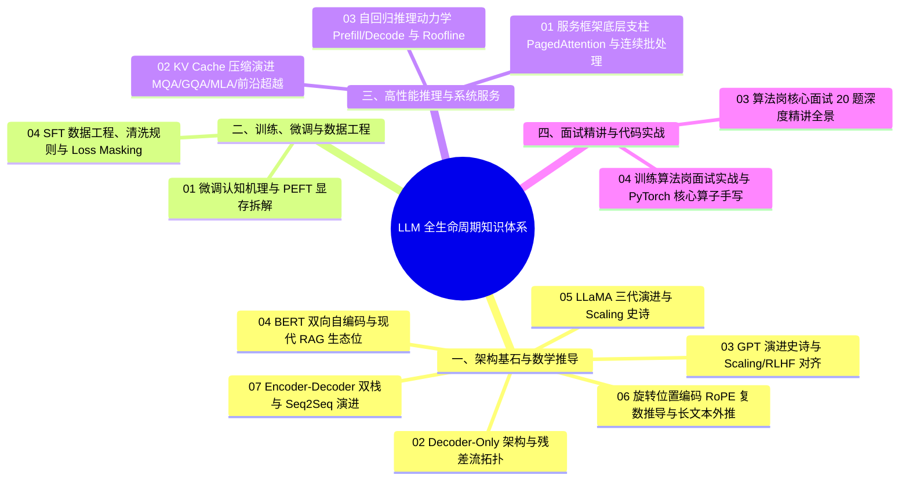

# 大语言模型全景知识库 (Large Language Models Mastery)

## 1. 模块总览
本模块是大语言模型（Large Language Models, LLM）的工业级全生命周期知识沉淀库。

针对现代深度学习与人工智能大模型算法工程，本模块严格拒绝浅层调包，系统化打通从**底层数学机理与网络拓扑**、**大规模分布式预训练与 SFT 数据工程**、**高性能自回归推理与系统级服务部署（Serving）**，到**大厂算法面试通关与白板算子手写**的完整闭环。

---

## 2. 知识全景拓扑 (Knowledge Topology)

---

## 3. 四大细分小主题与文章索引 (Subtopics & Articles)

### 📂 小主题一：架构基石与数学推导 (`01_Architecture_and_Foundations/`)
聚焦主流现代 LLM 的基础架构设计、数学正交证明与长文本扩展理论：
- [02_LLM_Full_Architecture_and_LoRA_Mapping.md](./01_Architecture_and_Foundations/02_LLM_Full_Architecture_and_LoRA_Mapping.md)：现代自回归 Decoder-Only LLM 全架构拆解、残差流主干、ELMo 动态加权机制、三大架构终极辨析与 LoRA 物理挂载全景。
- [03_GPT_Architecture_Evolution_and_Scaling_Master.md](./01_Architecture_and_Foundations/03_GPT_Architecture_Evolution_and_Scaling_Master.md)：GPT 家族全景深度透视：从 GPT-1 到 GPT-4 四代演进、Pre-LN 架构、因果下三角注意力、ICL 涌现假说、Kaplan/Chinchilla 规模法则、RLHF/DPO 对齐与 KV Cache 白盒工程。
- [04_BERT_Architecture_Pretraining_and_FineTuning_Master.md](./01_Architecture_and_Foundations/04_BERT_Architecture_Pretraining_and_FineTuning_Master.md)：BERT 全景深度透视：四代表征演进、Token/Segment/Position 三合一输入、GELU 激活、MLM 80-10-10 动力学、NSP 存废之争、RoBERTa/ALBERT/DeBERTa 演进与现代 RAG 检索重排生态位。
- [05_LLaMA_Architecture_Evolution_and_Scaling_Master.md](./01_Architecture_and_Foundations/05_LLaMA_Architecture_Evolution_and_Scaling_Master.md)：大模型工业基准与开源分水岭：LLaMA 架构全景拆解（Pre-RMSNorm、SwiGLU 守恒推导、RoPE 正交证明、GQA 显存削减）与 LLaMA-1 到 LLaMA-3 演进史诗。
- [06_Rotary_Position_Embedding_RoPE_Master.md](./01_Architecture_and_Foundations/06_Rotary_Position_Embedding_RoPE_Master.md)：旋转位置编码 (RoPE) 全景透视：从复数旋转欧拉公式推导、块对角正交内积不变性、相消干涉长程衰减，到 PI、NTK-Aware、YaRN 与 LLaMA-3 Base 500k 长文本外推史诗。
- [07_Encoder_Decoder_Seq2Seq_Architecture_Master.md](./01_Architecture_and_Foundations/07_Encoder_Decoder_Seq2Seq_Architecture_Master.md)：Encoder-Decoder 架构全景深度透视：Seq2Seq 起源哲学、双栈协同与 Cross-Attention 桥梁、T5 (Text-to-Text) 与 BART 白盒去噪拆解、推理双栈异构 KV Cache 内存瓶颈与端到端 PyTorch 代码实现。

---

### 📂 小主题二：训练、微调与数据工程 (`02_Training_and_FineTuning/`)
深入大模型有监督微调（SFT）、参数高效自适应与工业级数据清洗工程：
- [01_FineTuning_Foundations_and_PEFT.md](./02_Training_and_FineTuning/01_FineTuning_Foundations_and_PEFT.md)：微调认知纠偏、分布式表征机理、参数选择本质、全量微调显存开销（$16\Phi$）严密推导与考核题库。
- [04_SFT_Data_Engineering_and_Preprocessing.md](./02_Training_and_FineTuning/04_SFT_Data_Engineering_and_Preprocessing.md)：大模型微调数据工程实战、ShareGPT/Messages 演进、MinHash LSH 语义去重、Chat Template 与 Loss Masking 机制。

---

### 📂 小主题三：高性能推理与系统服务 (`03_Inference_and_Serving/`)
直击自回归推理内存墙瓶颈、显存虚拟化与分布式 Serving 调度引擎：
- [03_LLM_Inference_Mechanics_Prefill_Decode_KVCache.md](./03_Inference_and_Serving/03_LLM_Inference_Mechanics_Prefill_Decode_KVCache.md)：大模型自回归推理动力学、Prefill 与 Decode 双阶段范式、KV Cache 显存模型与 Roofline 内存墙瓶颈。
- [01_LLM_Serving_Frameworks_Deep_Dive.md](./03_Inference_and_Serving/01_LLM_Serving_Frameworks_Deep_Dive.md)：大模型服务框架本质、五大底层技术支柱（PagedAttention 虚拟分页、连续批处理 Continuous Batching、Chunked Prefill 分块预填充）、主流框架选型（vLLM/SGLang/TRT-LLM）。
- [02_KV_Cache_Compression_MQA_GQA_MLA_and_Beyond.md](./03_Inference_and_Serving/02_KV_Cache_Compression_MQA_GQA_MLA_and_Beyond.md)：大模型注意力演进与 KV Cache 极限压缩：MHA、MQA、GQA 到 DeepSeek MLA（低秩隐变量、解耦 RoPE、矩阵吸收）全景推导与前沿超越（NSA、CLA、动态驱逐、FP8 量化）。

---

### 📂 小主题四：面试通关与白板手撕代码 (`04_Interviews_and_HandsOn/`)
大厂算法岗核心真题深度复盘、系统级排障与底层算子手撕代码：
- [03_LLM_Algorithm_Interview_Core_20_Questions.md](./04_Interviews_and_HandsOn/03_LLM_Algorithm_Interview_Core_20_Questions.md)：大模型算法岗高频核心面试题全景精讲（20 题全解析：自注意力 $\sqrt{d_k}$ 方差推导、AMP/梯度检查点/FlashAttention、Decoder-Only/MoE/MLA、LoRA/SFT/RLHF PPO/DPO/GRPO、量化/PagedAttention、VLM/LDM、RAG/Agent/SWE-bench 评测）。
- [04_LLM_Training_Algorithm_Interview_and_PyTorch_Code.md](./04_Interviews_and_HandsOn/04_LLM_Training_Algorithm_Interview_and_PyTorch_Code.md)：大模型训练算法岗面试实战与 PyTorch 算子手撕指南（LayerNorm vs BatchNorm 与 RMSNorm 演进、残差连接与 Pre-LN 梯度高速公路、分布式并行通信 Ring-AllReduce 推导、DeepSpeed ZeRO-1/2/3 显存计算、Loss NaN 工业排查、手写 PyTorch MHA/RMSNorm/RoPE/LoRA 算子、计算机科班八股）。

---

## 4. 核心系统痛点与认知盲区解决矩阵 (Problem-Solution Matrix)

| 序号 | 经典认知误区 / 系统严重痛点 | 底层真实机理与工业级解决方案 |
| :--- | :--- | :--- |
| **01** | **神经网络参数“模块割裂论”（颅相学误区）**：误以为不同网络参数孤立负责语义、语法或特定任务。 | **分布式表征与叠加态理论**：深度网络中知识跨层、跨注意力头高度纠缠。微调并非“挑出语义神经元”，而是通过低秩矩阵或结构性剪裁对整体表征空间施加定向微扰。 |
| **02** | **“PEFT 绝不会引起灾难性遗忘”**：误以为冻结原权重就能绝对免疫遗忘。 | **表征空间偏移**：最终推理输出为 $W = W_0 + \Delta W$，下游单任务监督过强时合并后的流形空间仍会塌缩。需配合混合通用回放数据（Replay Buffer）与小学习率。 |
| **03** | **盲目全量微调导致显存瞬间 OOM**：未估算优化器状态（Optimizer States）开销。 | **显存量化拆解公式**：全量 AdamW 训练消耗高达 $16\Phi \sim 20\Phi$ 字节（7B 需 112GB+）；改用 LoRA/QLoRA 冻结主干梯度及优化器动量，仅需微调低秩参数。 |
| **04** | **误判 LoRA 初始化策略**：未理解矩阵乘法链式法则导致的对称性梯度陷阱。 | **非对称初始化准则**：$B=0$ 保证初始增量为 0（继承基模先验）；$A \sim \mathcal{N}$ 打破对称性保证第 1 步 $B$ 能捕获有效梯度。全零会导致梯度死锁，全高斯会导致初始 Loss 爆炸。 |
| **05** | **用 FastAPI 直接包裹 `model.generate()` 上线**：并发到 10 时显存打爆或延迟暴涨数十倍。 | **连续批处理 (Continuous Batching)**：消除传统静态批处理对齐补齐（Padding）带来的巨大浪费，实现不同长短请求在 Token 迭代级随到随走。 |
| **06** | **KV Cache 显存碎片化导致极低并发 (OOM)**：为请求预分配连续显存导致 60%~80% 显存处于闲置虚占状态。 | **PagedAttention 虚拟显存机制**：借鉴操作系统分页机制，将 KV Cache 拆为非连续物理页面，显存浪费从 70% 骤降至 4% 以下，并实现 Shared Block 共享前缀。 |
| **07** | **长 Prompt 进入导致正在流式输出的用户剧烈卡顿**：新请求的 Prefill 耗时过长，阻塞了所有 Decode 批次。 | **分块预填充 (Chunked Prefill)**：将长 Prompt 切为固定大小的数据块（如 512 Tokens），与 Decode 步骤交替融合执行，稳定 TPOT 流式延迟。 |
| **08** | **分布式训练单卡装不下模型**：误以为只能买更大显存的 GPU。 | **3D 并行与 ZeRO 切分**：机内高带宽使用张量并行（TP），跨机使用流水线并行（PP）；配合 ZeRO-1/2/3 切分优化器状态、梯度与参数，单卡显存随卡数线性缩减。 |

