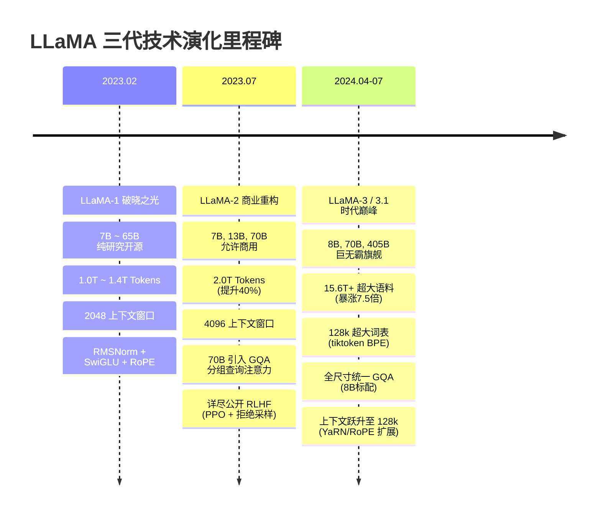

# 大模型工业基准与开源分水岭：LLaMA 架构全景拆解与演进史诗

> **归属模块**：`LLM_FineTuning`  
> **更新策略**：增量追加（严格遵循 Zero-Shrinkage 规范）  
> **面向对象**：人工智能专业大模型底层原理、Transformer 演化推导与工业级基模设计

---

## 目录 (Table of Contents)
- [1. 学习记录流水线 (Changelog)](#1-学习记录流水线-changelog)
- [2. 认知纠偏与本质定性：什么是 LLaMA？](#2-认知纠偏与本质定性什么是-llama)
  - [2.1 致命概念纠偏：“LLaMA 是 Meta 发布的 ChatGPT 类似产品吗？”](#21-致命概念纠偏llama-是-meta-发布的-chatgpt-类似产品吗)
  - [2.2 颠覆式哲学反转：Chinchilla 缩放定律的“逆行者”与过训练 (Over-training) 经济学](#22-颠覆式哲学反转chinchilla-缩放定律的逆行者与过训练-over-training-经济学)
  - [2.3 开源界的“Linux时刻”：为什么全球现代大模型都在以 LLaMA 为骨架？](#23-开源界的linux时刻为什么全球现代大模型都在以-llama-为骨架)
- [3. 经典 LLaMA 架构的三大外科手术式改动（底层数学白盒推导）](#3-经典-llama-架构的三大外科手术式改动底层数学白盒推导)
  - [3.1 Pre-RMSNorm：舍弃可学习偏置与均值计算的极速归一化](#31-pre-rmsnorm舍弃可学习偏置与均值计算的极速归一化)
  - [3.2 SwiGLU 门控前馈网络：参数守恒定理与非线性表达力飞跃](#32-swiglu-门控前馈网络参数守恒定理与非线性表达力飞跃)
  - [3.3 旋转位置编码 (RoPE)：复数域正交旋转与相对距离内积证明](#33-旋转位置编码-rope复数域正交旋转与相对距离内积证明)
- [4. 从 LLaMA-1 到 LLaMA-3 的三代技术演化史诗](#4-从-llama-1-到-llama-3-的三代技术演化史诗)
  - [4.1 LLaMA-1 (2023.02)：开源火种、学术开放与基础参数规范](#41-llama-1-202302开源火种学术开放与基础参数规范)
  - [4.2 LLaMA-2 (2023.07)：商用破局、GQA 分组查询注意力与 RLHF 全流程公开](#42-llama-2-202307商用破局gqa-分组查询注意力与-rlhf-全流程公开)
  - [4.3 LLaMA-3 / 3.1 / 3.3 (2024)：15T 超大数据风暴、128k 词表与 128k 超长上下文](#43-llama-3--31--33-202415t-超大数据风暴128k-词表与-128k-超长上下文)
- [5. LLaMA 三代演进全景参数对比矩阵](#5-llama-三代演进全景参数对比矩阵)
- [6. 专业实战测评题库 (含采分点与硬核解析)](#6-专业实战测评题库-含采分点与硬核解析)
- [7. 极简复习闪卡 (CheatSheet)](#7-极简复习闪卡-cheatsheet)

---

## 1. 学习记录流水线 (Changelog)
- **2026-09-09**：系统构建 LLaMA 基础模型架构与三代演进白盒知识库。严厉驳斥将 LLaMA 视为“应用级 ChatGPT”或“自研全新发明架构”的肤浅认知；深度解构其作为开创性开源事实标准的真实生态定位；从算子计算图、复数旋转、参数守恒与 Chinchilla 优化反转等底层维度，严密推导 RMSNorm、SwiGLU、RoPE、GQA 的设计机理；全景复盘 LLaMA-1 到 LLaMA-3 的工程飞跃。

---

## 2. 认知纠偏与本质定性：什么是 LLaMA？

### 2.1 致命概念纠偏：“LLaMA 是 Meta 发布的 ChatGPT 类似产品吗？”

> [!CAUTION]
> **严重认知死角**：很多外行甚至部分初学者常问：“LLaMA 和 ChatGPT 比谁好用？我在哪里能像聊天软件一样直接跟 LLaMA 说话？”  
>
> **严厉直接纠偏**：**这种提问暴露了对大模型技术栈分层的完全无知！ChatGPT 是一个集成了前端界面、对话管理、指令对齐、内容审核与工程服务的商用端到端“产品（Product）”；而 LLaMA 是一个纯粹的“底层预训练语言模型（Foundation Base Model）”！**

* **LLaMA 的全称**：**Large Language Model Meta AI**，由 Meta AI（前身为 Facebook 人工智能研究院 FAIR，由 Hugo Touvron 等人领衔）于 2023 年 2 月正式向学术界公开。
* **交付内容**：Meta 发布的不是一个 App，而是**论文、开源 PyTorch 模型代码，以及高达几十 GB 到数百 GB 的原始张量权重权重文件（`.pth` / `safetensors`）**！
* **生态定位**：LLaMA 是大模型工业界的**基础“母模”**。随后全球爆火的开源模型，无论是早期微调出来的 Alpaca、Vicuna，还是国内各大厂商的衍生自研模型（如 Baichuan、Yi、Qwen、DeepSeek 等），在底层架构上 95% 以上都完整继承了 LLaMA 所确立的 Decoder-Only 算子范式。

---

### 2.2 颠覆式哲学反转：Chinchilla 缩放定律的“逆行者”与过训练 (Over-training) 经济学

在 2023 年初 LLaMA 问世之前，整个 AI 工业界被 OpenAI 的 GPT-3（175B）、Google 的 PaLM（540B）深度笼罩，陷入了盲目堆砌参数量的**“巨模军备竞赛”**。

DeepMind 提出的 **Chinchilla 缩放定律 (Hoffmann et al., 2022)** 在数学上证明了计算最优性（Compute-Optimal）：
> 在给定的训练浮点运算预算（FLOPs）下，模型参数量 $N$ 与训练 Token 数 $D$ 应当等比例同步增加：$N \propto \sqrt{\text{FLOPs}}, \; D \propto \sqrt{\text{FLOPs}}$。  
> 按照此法则，一个 7B 左右的模型，只需要训练大约 **140B (1400 亿) Tokens** 即可达到算力最优利用点。

```
经典 Chinchilla 视角:
   算力预算固定 ──> 模型参数 N 与数据量 D 1:1 对等 ──> 达到“训练成本”最优。
   (但完全忽略了模型上线后每天产生数亿次调用的“推理成本”！)

LLaMA 的颠覆性反思 (Over-training 经济学):
   目标: 极致压缩“推理阶段 (Inference) 的边际成本”！
   策略: 故意使用高达 1.0T ~ 1.4T (1.4 万亿) Tokens 的海量数据，去“过饱和训练”一个仅有 7B / 13B 的紧凑模型！
```

#### 为什么 LLaMA 这种“过训练 (Over-training)”策略是革命性的？
1. **训练是一次性的，推理是无穷无尽的**：虽然在训练 7B 模型时喂入 1T 数据超出了 Chinchilla 训练最优阈值（即单步 Loss 下降的边际效用递减）；
2. **推理吞吐降维打击**：训练完成后，一个仅有 7B / 13B 的模型，可以被单块消费级显卡（如 RTX 3090/4090）甚至普通苹果 Mac (M 系列芯片) 顺畅运行，其推理速度比 175B 巨模快几十倍，显存占用降低 95%！
3. **能力越级爆发**：LLaMA-1 13B 在绝大多数基准测试上以十分之一的参数量直接正面击溃了 175B 的 GPT-3，证明了**“大数据的饱和灌溉能够彻底激发小参数量模型的表征极限”**。

---

### 2.3 开源界的“Linux时刻”：为什么全球现代大模型都在以 LLaMA 为骨架？

LLaMA 的发布被称为大模型开源生态的**“Linux 时刻”**或**“ImageNet 时刻”**：
1. **打破寡头垄断**：在 LLaMA 之前，顶级 LLM 的权重被 OpenAI 和 Google 严密死守，学术界与中小型企业只能做“黑盒 Prompt 调优”；
2. **催生整个繁荣工具链**：vLLM、Ollama、llama.cpp、GGUF、Axolotl、Unsloth、PEFT/LoRA 等今天如雷贯耳的基础设施，全部是**以 LLaMA 权重和张量结构为原生适配目标而诞生并孵化的**；
3. **架构事实标准 (De Facto Standard)**：LLaMA 从 2017 年的原生 Transformer 中进行了精巧的算子剪裁与整合，确立了**“自回归因果解码器 (Causal Decoder-Only) + RMSNorm + SwiGLU + RoPE”**的工业黄金铁三角。

---

## 3. 经典 LLaMA 架构的三大外科手术式改动（底层数学白盒推导）

LLaMA 并没有发明全新的单体神经网络层，而是从近年来前沿学术成果中，精准吸纳了三项经过千亿规模验证的高效算子，对 2017 年的原始 Transformer 实施了彻底的外科手术：

```
2017 原始 Transformer (Vaswani)          2023 LLaMA 工业标准架构 (Meta)
┌──────────────────────────────┐          ┌──────────────────────────────┐
│  Post-LayerNorm (训练不稳定)  │  ──────> │  Pre-RMSNorm (深层梯度极其稳定)│
│  标准 FFN (ReLU / GELU)      │  ──────> │  SwiGLU 门控前馈网络 (非线性跃迁)│
│  可学习/正弦绝对位置编码       │  ──────> │  RoPE 旋转位置编码 (相对距离衰减)│
└──────────────────────────────┘          └──────────────────────────────┘
```

---

### 3.1 Pre-RMSNorm：舍弃可学习偏置与均值计算的极速归一化

#### (1) 原始 LayerNorm 的冗余开销
标准 LayerNorm (Ba et al., 2016) 对输入向量 $x \in \mathbb{R}^d$ 的处理为：
$$\mu = \frac{1}{d} \sum_{i=1}^d x_i, \quad \sigma = \sqrt{\frac{1}{d} \sum_{i=1}^d (x_i - \mu)^2 + \epsilon}$$
$$y = \frac{x - \mu}{\sigma} \odot \gamma + \beta$$
* 包含两次跨维度的全局归约（求均值 $\mu$ 与方差 $\sigma$）；
* 包含可学习平移偏置 $\beta$。

#### (2) RMSNorm (Root Mean Square Normalization) 的数学精简
Zhang & Sennrich (2019) 证明：**LayerNorm 带来训练稳定性的核心功臣是尺度缩放（Scaling），激活值的均值平移特性（Mean Shift）几乎没有任何正向贡献！**
LLaMA 彻底移除了均值计算，直接除以**均方根 (RMS)**，且彻底废弃偏置 $\beta$：

$$\text{RMS}(x) = \sqrt{\frac{1}{d} \sum_{i=1}^d x_i^2 + \epsilon}$$
$$\bar{x}_i = \frac{x_i}{\text{RMS}(x)} \cdot \gamma_i$$

* **工程优势**：在 GPU 显存带宽受限（Memory-Bound）的 Kernel 中，RMSNorm 减少了一次全局 Reduction 访存，执行速度提升 10%~50%；
* **Pre-Norm 放置**：所有 Norm 均放置在 Multi-Head Attention 和 FFN 计算之前（输入端），主干残差流 $x_{l+1} = x_l + F(\text{RMSNorm}(x_l))$ 保持纯净的无阻碍直连，彻底杜绝了深层网络的梯度消失与爆炸。

---

### 3.2 SwiGLU 门控前馈网络：参数守恒定理与非线性表达力飞跃

#### (1) 原始 Transformer FFN 的局限
原始 FFN 仅包含两层全连接与 ReLU/GELU 激活：
$$\text{FFN}(x) = \max(0, x W_1 + b_1) W_2 + b_2$$
隐藏层维度通常扩展为 $d_{\text{ffn}} = 4d_{\text{model}}$。参数量为：
$$2 \times d_{\text{model}} \times 4d_{\text{model}} = 8 d_{\text{model}}^2$$

#### (2) SwiGLU (Swish Gated Linear Unit) 的门控机制
Shazeer (2020) 提出了门控线性单元（GLU）变体，LLaMA 选用了其中表现最佳的 **SwiGLU**：
$$\text{SwiGLU}(x) = \left( \text{Swish}(x W_{\text{gate}}) \odot x W_{\text{up}} \right) W_{\text{down}}$$
其中 $\text{Swish}(z) = z \cdot \sigma(z) = \frac{z}{1 + e^{-z}}$，$\odot$ 为逐元素哈达玛积（Hadamard Product）。

#### (3) 关键参数守恒定理：为什么 $d_{\text{ffn}} = \frac{8}{3}d_{\text{model}}$？
SwiGLU 拥有三个权重矩阵：$W_{\text{gate}}, W_{\text{up}} \in \mathbb{R}^{d \times d_{\text{ffn}}}$ 以及 $W_{\text{down}} \in \mathbb{R}^{d_{\text{ffn}} \times d}$。
其总参数量为：
$$P_{\text{SwiGLU}} = 3 \times d_{\text{model}} \times d_{\text{ffn}}$$
为了保证在引入双路门控的同时，**前馈网络的总参数量与标准 Transformer 的 $8d_{\text{model}}^2$ 严格等价守恒**：
$$3 \times d_{\text{model}} \times d_{\text{ffn}} \approx 8 d_{\text{model}}^2 \implies d_{\text{ffn}} = \frac{8}{3} d_{\text{model}} \approx 2.67 d_{\text{model}}$$

> **工程落地对齐**：
> 在 GPU 上进行矩阵乘法（Tensor Core）时，矩阵维度若为 256 或 64 的倍数，硬件利用率与访存对齐最高。
> 因此 LLaMA 规定：取 $\frac{8}{3}d_{\text{model}}$ 后，**向上取整到最近的 256 的倍数**！
> * 以 LLaMA-1 7B 为例：$d_{\text{model}} = 4096$；
> * 理论 $\frac{8}{3} \times 4096 = 10922.67$；
> * 向上对齐到 256 的倍数：$\lceil 10922.67 / 256 \rceil \times 256 = 43 \times 256 = \mathbf{11008}$！这就是源码中 $11008$ 这个神秘数字的根本由来！

---

### 3.3 旋转位置编码 (RoPE)：复数域正交旋转与相对距离内积证明

#### (1) 为什么放弃传统位置编码？
* **可学习绝对位置编码（如 GPT-3）**：无法自然外推到训练长度之外，且只能学习“绝对索引”，对“词与词相隔多远”这一相对因果无感知；
* **T5 相对位置偏置**：直接向注意力分数矩阵加 Bias，破坏了高效的算子融合（如 FlashAttention）优化。

#### (2) RoPE (Rotary Position Embedding, Su et al., 2021) 核心推导
RoPE 的目标是寻找一个变换操作 $R_m$，使得经过该变换的位置为 $m$ 的 Query 向量与位置为 $n$ 的 Key 向量，其内积能够**自然且严格地只依赖于相对距离 $m - n$**：
$$\langle R_m q, R_n k \rangle = g(q, k, m - n)$$

将 $d$ 维向量两两拆解为 $d/2$ 个二维子空间，在每个二维平面上定义正交旋转矩阵：
$$R_{\theta_i, m} = \begin{pmatrix} \cos(m\theta_i) & -\sin(m\theta_i) \\ \sin(m\theta_i) & \cos(m\theta_i) \end{pmatrix}, \quad \theta_i = 10000^{-2(i-1)/d}$$

```
二维复数空间中的刚体旋转:
      Im (虚轴)
        ^
        |         q_m = R_m * q (逆时针旋转 m*θ)
        |        /
        |       / 
        |      / ) m*θ
        |     /
        +--------------------> Re (实轴)
```

根据正交旋转矩阵的群论性质：$R_m^T R_n = R_{-m} R_n = R_{n-m}$。
因此注意力分数的内积项展开为：
$$(R_m q)^T (R_n k) = q^T (R_m^T R_n) k = q^T R_{n-m} k$$
* **长程衰减性**：随着相对距离 $|m - n|$ 变大，不同频率 $\theta_i$ 的正余弦振荡在向量求和中发生相消干涉，使得长距离 Attention 权重自然衰减，完全契合人类语言的物理规律。

---

## 4. 从 LLaMA-1 到 LLaMA-3 的三代技术演化史诗



---

### 4.1 LLaMA-1 (2023.02)：开源火种、学术开放与基础参数规范
* **历史功绩**：打破巨模黑盒，证明 13B 级模型充分过训练可力压 GPT-3；
* **参数规格**：7B, 13B, 33B, 65B；
* **训练数据**：1.0T (7B/13B) 到 1.4T (33B/65B) Tokens，全部来自公开数据集（CommonCrawl, C4, GitHub, Wikipedia 等）；
* **词表与上下文**：32,000 词表大小（SentencePiece BPE），上下文窗口仅为 **2048**。全尺寸均使用标准 Multi-Head Attention (MHA)。

---

### 4.2 LLaMA-2 (2023.07)：商用破局、GQA 分组查询注意力与 RLHF 全流程公开
* **商用授权解放**：正式引入商用友好许可（月活 7 亿以下实体免费商用），扫清了企业落地法律障碍；
* **上下文翻倍**：原生支持 **4096** 上下文；
* **架构重磅升级——引入 GQA (Grouped-Query Attention)**：
  * 在 34B 和 70B 大模型上，率先放弃了全量 MHA，改为 GQA（8 个 KV Heads 共享给 64 个 Query Heads）；
  * **解决痛点**：在长文本自回归生成时，KV Cache 的显存占用随并发数和序列长度线性暴涨。GQA 直接将 KV Cache 显存消耗砍掉 **87.5% (缩减至 1/8)**，大幅提升了推理吞吐！
* **开源界教科书级对齐指南**：随附的 `Llama-2-Chat` 论文详细披露了其包含拒绝采样（Rejection Sampling）与近端策略优化（PPO）的双循环 RLHF 流程。

---

### 4.3 LLaMA-3 / 3.1 / 3.3 (2024)：15T 超大数据风暴、128k 词表与 128k 超长上下文

Meta 在 2024 年推出的 LLaMA-3 系列，标志着开源基模全面进入与闭源最强模型（GPT-4o, Claude 3.5 Sonnet）平起平坐的纪元：

1. **超大训练数据风暴 (15.6T+ Tokens)**：
   数据规模从 LLaMA-2 的 2T 飙升至 **15T 以上**（包含 5% 高质量多语言与海量代码），数据过滤采用了多级启发式规则与高精度文本分类器；
2. **Tokenizer 词表重构 (32k $\to$ 128k)**：
   * 彻底弃用 SentencePiece，改用 **tiktoken (基于 BPE)**，词表容量扩充 4 倍至 **128,256**；
   * **根本收益**：分词压缩率大幅提升 15%~20%，同一个英文单词或中文字符被切碎的概率断崖式下降，极大提升了模型在代码、多语言场景下的计算效率；
3. **全尺寸普及 GQA**：
   即便是小尺寸的 **8B 模型**，也全面换装了 GQA（8 个 KV Heads 对 32 个 Query Heads），使低显存设备进行批量推理与边缘部署变得轻而易举；
4. **超长上下文支持跃升 (8k $\to$ 128k)**：
   * LLaMA-3 原生为 8k 上下文；LLaMA-3.1 扩展至惊人的 **128k (131,072 Tokens)**！
   * 将 RoPE 基础基频超参数从原始的 $10,000$ 提升至 **$500,000$**，结合分频外推（YaRN / Frequency-based Interpolation），使模型在 128k 极端“大海捞针 (Needle-in-a-Haystack)”任务中达成 100% 完美检索召回率；
5. **开源旗舰巨无霸 405B**：
   首次成功训练出 4050 亿参数的超稠密模型，并在训练后期使用 405B 生成千万级高质量合成数据，反向蒸馏滋养 8B 和 70B 模型。

---

## 5. LLaMA 三代演进全景参数对比矩阵

| 对比维度 | LLaMA-1 (2023.02) | LLaMA-2 (2023.07) | LLaMA-3 / 3.1 (2024.04-07) |
| :--- | :--- | :--- | :--- |
| **开源许可** | 纯学术研究 (Non-commercial) | 开放商用 (月活 7 亿限制) | 开放商用 (宽松社区协议) |
| **核心参数规模** | 7B / 13B / 33B / 65B | 7B / 13B / 70B | **8B / 70B / 405B** |
| **预训练数据量** | 1.0T ~ 1.4T Tokens | 2.0T Tokens | **15.6T+ Tokens** (暴涨 7.5 倍) |
| **原生上下文长度** | 2,048 (2k) | 4,096 (4k) | **8,192 (3.0) / 131,072 (3.1 128k)** |
| **分词器与词表大小**| SentencePiece (32,000) | SentencePiece (32,000) | **tiktoken BPE (128,256)** |
| **注意力架构** | 全系列均为标准 MHA | 7B/13B 为 MHA，70B 引入 **GQA** | **全系列标配 GQA** (8B 也配备) |
| **归一化算子** | Pre-RMSNorm | Pre-RMSNorm | Pre-RMSNorm |
| **激活函数与 FFN** | SwiGLU ($d_{\text{ffn}} = 11008$) | SwiGLU ($d_{\text{ffn}} = 11008$) | SwiGLU ($8\text{B: } d_{\text{ffn}} = 14336$) |
| **位置编码基频 $\theta$**| 10,000 | 10,000 | **500,000** (长文本外推增强) |
| **推理时 KV 显存开销**| 巨大 (MHA 导致无压缩) | 70B 显著降低 (GQA 压缩 8 倍) | **极低** (8B/70B/405B 全面享用 GQA) |

---

## 6. 专业实战测评题库 (含采分点与硬核解析)

### 试题 1：SwiGLU 隐藏层维度严格推导与硬件对齐计算 (8分)
> **题目**：
> 1. （4分）设现代自回归大模型的隐藏层维度为 $d$。标准 Transformer 的 FFN 层由升维矩阵 $W_1 \in \mathbb{R}^{d \times 4d}$ 和降维矩阵 $W_2 \in \mathbb{R}^{4d \times d}$ 组成。在 SwiGLU 结构中，包含 Gate 矩阵、Up 矩阵与 Down 矩阵三个投影层。请从**参数量绝对严格等价守恒**的角度，推导 SwiGLU 的隐藏层升维维度 $d_{\text{ffn}}$ 与基础维度 $d$ 的理论数学比例关系；
> 2. （4分）已知 LLaMA-3 8B 模型的底层维度 $d_{\text{model}} = 4096$，按照上述理论计算理论 $d_{\text{ffn}}$。假设硬件要求 $d_{\text{ffn}}$ 必须向上对齐到 256 的整数倍且乘以 1.3 倍左右经验缩放，Meta 官方最终将 LLaMA-3 8B 的 $d_{\text{ffn}}$ 定为 $14336$。请验证 $14336$ 是否严格满足 256 对齐，并计算其相对原始 $4096$ 的实际倍率。

#### 采分点与硬核标准解答：
1. **第 1 小问（4分）**：
   * **标准 FFN 参数量统计（1分）**：
     标准 FFN 忽略偏置项时，两个矩阵的总参数量为：
     $$P_{\text{standard}} = (d \times 4d) + (4d \times d) = 8 d^2$$
   * **SwiGLU 参数量统计（1分）**：
     SwiGLU 包含 $W_{\text{gate}} \in \mathbb{R}^{d \times d_{\text{ffn}}}$、$W_{\text{up}} \in \mathbb{R}^{d \times d_{\text{ffn}}}$ 和 $W_{\text{down}} \in \mathbb{R}^{d_{\text{ffn}} \times d}$，总参数量为：
     $$P_{\text{SwiGLU}} = (d \times d_{\text{ffn}}) + (d \times d_{\text{ffn}}) + (d_{\text{ffn}} \times d) = 3 d \cdot d_{\text{ffn}}$$
   * **参数等价严格联立求解（2分）**：
     令 $P_{\text{SwiGLU}} = P_{\text{standard}}$：
     $$3 d \cdot d_{\text{ffn}} = 8 d^2 \implies d_{\text{ffn}} = \frac{8}{3} d \approx 2.6667 d$$
     结论：SwiGLU 为了在引入门控非线性的同时不增加参数预算与计算 FLOPs，其隐藏层维度必须严格缩减为理论原维度的 $\frac{2}{3}$（即 $\frac{8}{3}d$）。

2. **第 2 小问（4分）**：
   * **理论与实际对齐验证（2分）**：
     对于 $14336$：
     $$\frac{14336}{256} = 56.0000$$
     恰好是 256 的整数倍（56 倍），完全符合 GPU Tensor Core 的内存对齐与 Warp 调度要求。
   * **实际倍率核算（2分）**：
     计算倍率：
     $$\frac{14336}{4096} = 3.5000$$
     Meta 在 LLaMA-3 8B 中将 FFN 比例从 LLaMA-1/2 的 $\approx 2.69$（11008/4096）进一步扩大到了 $3.5$ 倍，以小幅增加 FFN 局部记忆容量为代价换取更强大的常识记忆能力。

---

### 试题 2：GQA (Grouped-Query Attention) 对 KV Cache 显存缩减的量化证明题 (7分)
> **题目**：
> 设某模型上下文长度为 $L = 8192$，批量大小为 $B = 16$，模型层数为 $N = 32$，隐藏维度为 $d = 4096$，Query 头数 $H_Q = 32$（每个头维度 $d_k = 128$）。模型以半精度 FP16（每个元素 2 字节）部署。
> 1. （3分）在标准 Multi-Head Attention (MHA) 架构下，计算整机运行自回归生成时仅 **KV Cache 所占用的绝对显存大小（GB）**；
> 2. （4分）在 LLaMA-3 采用的 GQA 架构下（设 Key/Value 头的分组数 $H_{KV} = 8$），重新计算 KV Cache 的显存大小，并指出其节省的显存百分比及对长文本并发推理的工程意义。

#### 采分点与硬核标准解答：
1. **第 1 小问（3分）**：
   * **MHA 显存公式（1分）**：
     在 MHA 中，$H_{KV} = H_Q = 32$。每一步每个 Token 必须存储 Key 和 Value 两个张量：
     $$\text{Mem}_{\text{MHA}} = 2 \times N_{\text{layers}} \times B \times L \times (H_{KV} \times d_k) \times \text{BytesPerElem}$$
   * **数值代入计算（2分）**：
     已知 $H_{KV} \times d_k = 32 \times 128 = 4096 = d$：
     $$\text{Mem}_{\text{MHA}} = 2 \times 32 \times 16 \times 8192 \times 4096 \times 2 \text{ Bytes} = 68,719,476,736 \text{ Bytes}$$
     换算为 GB：
     $$\frac{68,719,476,736}{1024^3} = \mathbf{64.0 \text{ GB}}$$
     在单张 80GB 的 A100 上，仅仅存放这 16 个并发请求的 KV Cache 就会直接吃掉 64GB 显存，导致模型主干参数根本无法加载，发生显存溢出 (OOM)！

2. **第 2 小问（4分）**：
   * **GQA 显存计算（2分）**：
     在 GQA 下，$H_{KV} = 8$，相比 $H_Q = 32$ 缩小为原来的 $\frac{8}{32} = \frac{1}{4}$：
     $$\text{Mem}_{\text{GQA}} = \frac{1}{4} \times \text{Mem}_{\text{MHA}} = \frac{64.0 \text{ GB}}{4} = \mathbf{16.0 \text{ GB}}$$
   * **节省百分比与工程意义（2分）**：
     显存开销直接**净节省 75.0%**（从 64GB 骤降至 16GB）。
     **工程意义**：在原本只能跑 16 并发的显存空间内，现在可以轻松支持 $16 \times 4 = 64$ 个长文本高吞吐并发；将小模型（如 8B）在单张消费级显卡（24GB RTX 4090）上部署超长文本推理从“天方夜谭”变成了“标准工程现实”。

---

## 7. 极简复习闪卡 (CheatSheet)

| 核心组件 | 传统 Transformer 原生方案 | LLaMA 现代工业方案 | 核心物理收益与数学本质 |
| :--- | :--- | :--- | :--- |
| **模型定位** | 机器翻译或研究原型 | **开源基模事实标准 (Foundation Base)** | 奠定开源大模型工具链生态（vLLM/llama.cpp）的绝对基石 |
| **缩放法则** | 遵循 Chinchilla 计算最优即停 | **Over-training 极限过训练** | 牺牲训练 FLOPs 边际效率，换取推理端百倍部署吞吐暴利 |
| **归一化** | Post-LayerNorm（需均值与偏置） | **Pre-RMSNorm（无均值无偏置）** | 消除均值计算访存；深层残差流梯度无阻碍直通 |
| **前馈网络** | FFN: ReLU/GELU, $d_{\text{ffn}}=4d$ | **SwiGLU, $d_{\text{ffn}}=\frac{8}{3}d$ (256对齐)** | 引入门控注意力过滤机制，参数守恒下大幅提升拟合泛化 |
| **位置编码** | 绝对可学习编码 / 相对 Bias | **RoPE (旋转位置编码)** | 二维复数域正交旋转，内积严格等于相对距离；易于长文本扩展 |
| **注意力机制** | 传统 Multi-Head Attention (MHA) | **Grouped-Query Attention (GQA)** | 多 Query 头共享 KV 头，直接砍掉 75%~87.5% 的 KV Cache 显存占用 |
| **词表演变** | 32k (SentencePiece) | **128k (tiktoken BPE)** | 编码压缩率提升 20%，显著降低中文、代码及多语言分词碎片率 |
