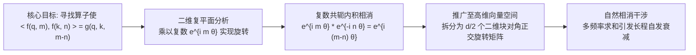

# 旋转位置编码 (RoPE) 全景透视：从复数旋转到长文本外推的数学与工程白盒

> **归属模块**：`LLM_FineTuning`  
> **更新策略**：增量追加（严格遵循 Zero-Shrinkage 规范）  
> **面向对象**：人工智能专业现代大模型位置表征机理、复分析正交证明与长文本外推算法

---

## 目录 (Table of Contents)
- [1. 学习记录流水线 (Changelog)](#1-学习记录流水线-changelog)
- [2. 认知纠偏与本质定性：关于位置编码的认知死角](#2-认知纠偏与本质定性关于位置编码的认知死角)
  - [2.1 致命概念纠偏一：“位置编码必须加在词向量上（加法偏置）吗？”](#21-致命概念纠偏一位置编码必须加在词向量上加法偏置吗)
  - [2.2 致命概念纠偏二：“RoPE 只是为了给向量打上绝对位置标签吗？”](#22-致命概念纠偏二rope-只是为了给向量打上绝对位置标签吗)
  - [2.3 致命概念纠偏三：“相对位置偏置（T5/ALiBi）性能类似，为什么工业界唯独选择 RoPE？”](#23-致命概念纠偏三相对位置偏置t5alibi性能类似为什么工业界唯独选择-rope)
- [3. RoPE 的数学起源与复数域严格推导](#3-rope-的数学起源与复数域严格推导)
  - [3.1 核心数学诉求：寻找内积保相对距离的算子](#31-核心数学诉求寻找内积保相对距离的算子)
  - [3.2 二维平面的复数欧拉公式启示](#32-二维平面的复数欧拉公式启示)
  - [3.3 推广至高维向量：块对角正交旋转矩阵](#33-推广至高维向量块对角正交旋转矩阵)
  - [3.4 为什么能自发长程衰减？相消干涉机理](#34-为什么能自发长程衰减相消干涉机理)
- [4. 工程落地白盒实现：如何用一行代码避开大矩阵乘法](#4-工程落地白盒实现如何用一行代码避开大矩阵乘法)
  - [4.1 显存与算力陷阱：千万不要构建完整的旋转矩阵](#41-显存与算力陷阱千万不要构建完整的旋转矩阵)
  - [4.2 极速向量化实现技巧 (PyTorch 纯张量切片)](#42-极速向量化实现技巧-pytorch-纯张量切片)
- [5. 长文本外推算法进化史：从 2k 到 128k 的四种解法](#5-长文本外推算法进化史从-2k-到-128k-的四种解法)
  - [5.1 外推困境：为什么长度一超模型就胡言乱语？](#51-外推困境为什么长度一超模型就胡言乱语)
  - [5.2 方案一：位置插值 (Position Interpolation, PI)](#52-方案一位置插值-position-interpolation-pi)
  - [5.3 方案二：NTK-Aware Scaled RoPE](#53-方案二ntk-aware-scaled-rope)
  - [5.4 方案三：YaRN (分频温度调制)](#54-方案三yarn-分频温度调制)
  - [5.5 方案四：LLaMA-3 的纯算力工业暴力解（Base 500,000）](#55-方案四llama-3-的纯算力工业暴力解base-500000)
- [6. 专业实战测评题库 (含采分点与硬核解析)](#6-专业实战测评题库-含采分点与硬核解析)
- [7. 极简复习闪卡 (CheatSheet)](#7-极简复习闪卡-cheatsheet)
- [8. 核心认知纠偏与全维度深度辨析 (Deep Clarifications)](#8-核心认知纠偏与全维度深度辨析-deep-clarifications)
  - [8.1 辩证统一：为什么说 RoPE 不是“仅仅标记相对位置”？](#81-辩证统一为什么说-rope-不是仅仅标记相对位置)
  - [8.2 破除“显存翻倍”荒谬脑补：KV Cache 存储旋转后 Key 的零额外开销真相与生命周期](#82-破除显存翻倍荒谬脑补kv-cache-存储旋转后-key-的零额外开销真相与生命周期)
  - [8.3 原始正弦余弦编码 (Vaswani 2017) vs RoPE：四项交叉污染 vs 严格正交旋转的数学对决](#83-原始正弦余弦编码-vaswani-2017-vs-rope四项交叉污染-vs-严格正交旋转的数学对决)
  - [8.4 为什么语言建模中“相对位置”的重要性压倒“绝对位置”？](#84-为什么语言建模中相对位置的重要性压倒绝对位置)
  - [8.5 致命概念纠偏五：“三角函数下的 $m\theta$ 不能大于 $2\pi$ 或 $\pi$ 吗？”——采样定理、相位环绕与绝对位置消歧全解](#85-致命概念纠偏五三角函数下的-mtheta-不能大于-2pi-或-pi-吗采样定理相位环绕与绝对位置消歧全解)
  - [8.6 几何与代数必然性：为什么必须拆分为 $d/2$ 个二维子空间？$(x, y)$ 坐标映射与阿贝尔群交换性](#86-几何与代数必然性为什么必须拆分为-d2-个二维子空间x-y-坐标映射与阿贝尔群交换性)
  - [8.7 注意力打分的微观物理图景：$d/2$ 组 $(q, k)$ 坐标点积的硬件并行与傅里叶相消干涉叠加](#87-注意力打分的微观物理图景d2-组-q-k-坐标点积的硬件并行与傅里叶相消干涉叠加)

---

## 1. 学习记录流水线 (Changelog)
- **2026-09-10**：系统构建旋转位置编码 (RoPE) 专题知识库。纠正“位置编码必须相加”与“相对位置偏置与 RoPE 等价”的认知死角；从复分析欧拉公式推导二维刚体旋转至高维块对角矩阵；严格证明注意力内积对相对位移 $m-n$ 的绝对保持性与长程相消干涉衰减性；解密 PyTorch 无矩阵向量化实现；全景剖析 PI、NTK-Aware、YaRN 到 LLaMA-3 基频放大的长文本外推演进图谱。
- **2026-09-10（增量追加）**：增补第 8 节。针对“仅仅标记相对位置”的片面认知，论证单个向量保留绝对坐标与双向量交互呈现相对因果的辩证统一；深度粉碎“旋转后作为独立 Key 导致显存翻倍”的荒谬误读，以白盒数据流图解证明其零额外显存占用；严密对比 Vaswani 2017 原始正弦余弦四项展开交叉污染与 RoPE 纯净正交旋转的数学差异。
- **2026-09-13（增量追加）**：增补第 8.5 节。深入辨析三角函数下 $m\theta$ 是否受限于 $2\pi$ 或 $\pi$ 的理论认知死角；严格厘清奈奎斯特-香农采样定理约束的是单步步进角频率 $\theta \le \pi$ 而非累积相位 $m\theta$；从多进制与时钟指针（时针/分针/秒针）级联系统证明多维联合表征消除绝对位置模糊性的数学机理；贯通 YaRN/NTK-Aware 长文本波长分类与外推本质。
- **2026-09-13（增量追加）**：增补第 8.6 与 8.7 节。从李群 $SO(2)$ 阿贝尔交换性严格证明为何必须切分为 $d/2$ 个 2D 子空间及其 $(x, y)$ 坐标映射与模长守恒定理；完整揭示注意力分数本质上是 $d/2$ 组 2D 坐标点积的求和（规约累加），从极坐标形式与傅里叶多频波相长/相消干涉诠释长程自发衰减的物理本质，并给出 Tensor Core 硬件级 SIMD 并行实现全景。

---

## 2. 认知纠偏与本质定性：关于位置编码的认知死角

### 2.1 致命概念纠偏一：“位置编码必须加在词向量上（加法偏置）吗？”

> [!CAUTION]
> **严重认知死角**：很多人学了 2017 原始 Transformer（Vaswani 等人）后，形成了一个牢不可破的思维定势：“所谓位置编码，就是先算一个位置向量 $p_t$，然后直接把它加到 Token 词嵌入上：$x_t = e_t + p_t$。”  
>
> **严厉直接纠偏**：**这种加法位置编码在数学表征上是极其粗暴且不优雅的！**

在原始 Transformer 中，将位置向量 $p_t$ 与词嵌入 $e_t$ 直接相加，相当于在同一个流形空间中**强行污染了词本身的语义坐标**。
* **RoPE (Rotary Position Embedding, 苏剑林等, 2021)** 彻底颠覆了加法范式：**它完全不碰底层的词嵌入（Token Embedding）！**
* 词嵌入保持纯粹的无位置语义表征；
* RoPE 仅在**进入注意力机制、计算 Query 和 Key 的那一瞬间，对向量执行空间旋转（乘法旋转变换）**！

---

### 2.2 致命概念纠偏二：“RoPE 只是为了给向量打上绝对位置标签吗？”

> [!CAUTION]
> **严重认知死角**：以为 RoPE 对位置 $m$ 的 Query 乘以旋转矩阵 $R_m$，仅仅是为了让网络知道“这个词在第 $m$ 个位置”。  
>
> **严厉直接纠偏**：**如果仅仅为了标记绝对位置，RoPE 的价值将被低估 90%！RoPE 最惊人的数学奇迹是：以绝对位置的形式编码，却在内积计算中自然演化出纯粹的相对位置因果！**

在计算自注意力权重时：

$$
\langle R_m q, R_n k \rangle = q^T R_{n-m} k
$$

在内积展开后，**绝对坐标 $m$ 和 $n$ 瞬间相消蒸发，留下的仅仅是相对跨度 $n - m$！**
模型由此天然理解：“无论这句话出现在文章开头第 1 个词，还是文章中间第 10,000 个词，只要两个词相距 3 个单位，它们感受到的几何旋转关系完全严格恒定！”

---

### 2.3 致命概念纠偏三：“相对位置偏置（T5/ALiBi）性能类似，为什么工业界唯独选择 RoPE？”

> [!CAUTION]
> **严重认知死角**：以为 T5 的相对位置偏置（Relative Bias）或 ALiBi（Attention with Linear Biases）与 RoPE 只是“学术流派不同，效果大同小异”。  
>
> **严厉直接纠偏**：**在工程落地与推理算子（FlashAttention / KV Cache）层面，这有着生与死的鸿沟！**

1. **T5 偏置与 ALiBi 的致命工程死穴**：
   - 它们是在计算出庞大的注意力分数矩阵 $S = Q K^T / \sqrt{d_k}$ 之后，**在矩阵上直接加上一个二维偏置张量 $S_{i, j} + B_{i, j}$**；
   - 这要求系统**必须完整在显存中物化（Materialize）出整个 $N \times N$ 的巨大注意力矩阵**！
   - 这直接**粉碎了现代大模型推理与训练的物理底座——FlashAttention**（FlashAttention 依靠分块融合跳过显存写入，不物化全量注意力矩阵）。
2. **RoPE 的无敌工程兼容性**：
   - RoPE 是针对每个 Token 的 Query 和 Key 向量本身做的**一维就地变换（In-place Element-wise Transformation）**；
   - 生成后直接作为独立的 Key 存入 KV Cache，完全不改动标准的自注意力矩阵计算流程；
   - **RoPE 与 FlashAttention、KV Cache、PagedAttention 具有 100% 的原生完美兼容性！** 这正是它统一全球大模型（LLaMA, Qwen, DeepSeek, Mistral）的核心原因。

---

## 3. RoPE 的数学起源与复数域严格推导



---

### 3.1 核心数学诉求：寻找内积保相对距离的算子

设位置 $m$ 的 Query 向量为 $q_m$，位置 $n$ 的 Key 向量为 $k_n$。
我们希望设计变换函数 $f(q, m)$ 和 $f(k, n)$，使得它们的内积完全且仅由未编码的向量 $q, k$ 及相对位移 $m - n$ 决定：

$$
\langle f(q, m), f(k, n) \rangle = g(q, k, m - n)
$$

---

### 3.2 二维平面的复数欧拉公式启示

考虑最简化的二维向量 $q = (q_1, q_2)^T \in \mathbb{R}^2$。
在复分析中，一个二维实向量可以等价映射为一个复数：

$$
z_q = q_1 + i q_2 \in \mathbb{C}
$$

根据欧拉公式，给一个复数乘以 $e^{i \theta}$，几何上等价于在复平面上**逆时针刚体旋转 $\theta$ 弧度**。
如果给位置 $m$ 的向量旋转角度 $m\theta$，给位置 $n$ 的向量旋转角度 $n\theta$：

$$
\tilde{z}_q = z_q \cdot e^{i m \theta}, \quad \tilde{z}_k = z_k \cdot e^{i n \theta}
$$

计算复数内积 $\text{Re}(z_1 z_2^*)$（其中 $*$ 代表复共轭）：

$$
\tilde{z}_q \tilde{z}_k^* = \left( z_q e^{i m \theta} \right) \left( z_k e^{i n \theta} \right)^* = z_q e^{i m \theta} z_k^* e^{-i n \theta} = (z_q z_k^*) \cdot e^{i (m - n) \theta}
$$

**取其实数部分，正是旋转后两向量在二维实数空间中的几何内积！**

$$
\langle \tilde{q}, \tilde{k} \rangle = \text{Re}\left( (z_q z_k^*) e^{i (m - n) \theta} \right)
$$

* 绝对位置 $m$ 和 $n$ 在指数相减中奇迹般消去，仅剩下相对间距 $m - n$；
* 这证明了：**旋转操作天然是相对位置内积不变性的精确代数解！**

---

### 3.3 推广至高维向量：块对角正交旋转矩阵

将 $d$ 维空间正交拆解为 $d/2$ 个二维子空间。
在每个二维子空间上，旋转操作对应一个 $2 \times 2$ 的二维正交旋转矩阵：

$$
R_{\theta_i, m} = \begin{pmatrix} \cos(m\theta_i) & -\sin(m\theta_i) \\ \sin(m\theta_i) & \cos(m\theta_i) \end{pmatrix}
$$

对整个 $d$ 维向量，RoPE 构造了一个高维块对角矩阵（Block-Diagonal Matrix）：

$$
R_{\Theta, m} = \begin{pmatrix}
R_{\theta_1, m} & 0 & \dots & 0 \\
0 & R_{\theta_2, m} & \dots & 0 \\
\vdots & \vdots & \ddots & \vdots \\
0 & 0 & \dots & R_{\theta_{d/2}, m}
\end{pmatrix}
$$

其中基频参数序列（继承正弦位置编码的设计）为：

$$
\theta_i = b^{-2(i-1)/d}, \quad i \in \{1, 2, \dots, d/2\}
$$

* $b$ 为底数（Base Frequency），默认经典值为 $10,000$。
* **正交群性质**：旋转矩阵属于特殊正交群 $SO(d)$，满足 $R_m^T R_m = I$ 以及：

$$
R_m^T R_n = R_{-m} R_n = R_{n - m}
$$

因此 $d$ 维向量内积严格保证：

$$
(R_m q)^T (R_n k) = q^T (R_m^T R_n) k = q^T R_{n - m} k
$$

---

### 3.4 为什么能自发长程衰减？相消干涉机理

在注意力机制中，我们希望**相隔越近的 Token 注意力权重天然越大，相距越远的 Token 注意力自发衰减**。RoPE 是如何做到这一点的？

高维内积是 $d/2$ 个子空间内积的代数叠加：

$$
q^T R_{n - m} k = \sum_{i=1}^{d/2} \left[ (q_{2i-1} k_{2i-1} + q_{2i} k_{2i}) \cos((m-n)\theta_i) + (q_{2i-1} k_{2i} - q_{2i} k_{2i-1}) \sin((m-n)\theta_i) \right]
$$

* 随着分量索引 $i$ 变化，$\theta_i$ 从高频（转得极快）平滑过渡到低频（转得很慢）；
* 当相对位移 $|m - n|$ 逐渐增大时，不同子空间的正弦与余弦波在求和时会产生**相位杂乱的“相消干涉（Destructive Interference）”**；
* 类似于傅里叶逆变换中的黎曼-勒贝格引理（Riemann-Lebesgue Lemma），内积的包络线上界随距离 $|m - n|$ 单调衰减，赋予了模型无偏的**局部性语义归纳偏置（Locality Inductive Bias）**！

---

## 4. 工程落地白盒实现：如何用一行代码避开大矩阵乘法

### 4.1 显存与算力陷阱：千万不要构建完整的旋转矩阵

如果严格按照数学公式构建一个 $[d, d]$ 的稀疏块对角矩阵，并在每次前向传播时做矩阵乘法 $q R$：
* $d = 128$ 时，$128 \times 128$ 矩阵包含 16,384 个元素，其中 98.4% 全是 0！
* 这样不仅显存带宽浪费严重，还会引入极其巨大的冗余矩阵乘法 FLOPs。

---

### 4.2 极速向量化实现技巧 (PyTorch 纯张量切片)

利用二维旋转的显式代数形式：

$$
\begin{pmatrix} \cos\theta & -\sin\theta \\ \sin\theta & \cos\theta \end{pmatrix} \begin{pmatrix} x_1 \\ x_2 \end{pmatrix} = \begin{pmatrix} x_1 \cos\theta - x_2 \sin\theta \\ x_1 \sin\theta + x_2 \cos\theta \end{pmatrix} = \begin{pmatrix} x_1 \\ x_2 \end{pmatrix} \cos\theta + \begin{pmatrix} -x_2 \\ x_1 \end{pmatrix} \sin\theta
$$

在 PyTorch 中，定义一个辅助旋转算子 `rotate_half`：

$$
\text{rotate\_half}(x) = \left[ -x_{d/2 + 1}, \dots, -x_d, x_1, \dots, x_{d/2} \right]
$$

（在两两交错排列表示下，等价于 $[-x_2, x_1, -x_4, x_3, \dots, -x_d, x_{d-1}]$）

整套 RoPE 变换可写为极其优美的**逐元素哈达玛积（Element-wise Product）**：

$$
\text{RoPE}(x, m) = x \odot \cos(m\Theta) + \text{rotate\_half}(x) \odot \sin(m\Theta)
$$

```python
import torch

def rotate_half(x: torch.Tensor) -> torch.Tensor:
    """将张量的后半部分取负，并与前半部分交换拼接"""
    x1 = x[..., : x.shape[-1] // 2]
    x2 = x[..., x.shape[-1] // 2 :]
    return torch.cat((-x2, x1), dim=-1)

def apply_rotary_pos_emb(q: torch.Tensor, k: torch.Tensor, cos: torch.Tensor, sin: torch.Tensor):
    """
    极速向量化应用 RoPE (HuggingFace Transformers / LLaMA 工业标准源码)
    输入 q, k: [Batch, Heads, Seq_Len, Head_Dim]
    输入 cos, sin: [1, 1, Seq_Len, Head_Dim]
    """
    q_embed = (q * cos) + (rotate_half(q) * sin)
    k_embed = (k * cos) + (rotate_half(k) * sin)
    return q_embed, k_embed
```
* **复杂度分析**：时间复杂度直接从矩阵乘法的 $O(d^2)$ 骤降至向量乘加的 **$O(d)$**！
* 无需任何显存动态分配，直接在 GPU L1/SRAM 缓存中完成融合计算。

---

## 5. 长文本外推算法进化史：从 2k 到 128k 的四种解法

### 5.1 外推困境：为什么长度一超模型就胡言乱语？

假设一个模型在预训练时只见过最大长度 $L_{\text{train}} = 4096$。在推理时直接喂入 $L_{\text{test}} = 16384$：
* 对于高频维度（$\theta_i$ 很大），相角 $m\theta_i$ 在 $m \in [0, 4096]$ 范围内已经转了成百上千圈，网络学到了完整的周期覆盖；
* 但对于**低频维度（$\theta_i$ 很小）**，在 $4096$ 范围内它可能才转了不到四分之一圈！
* 当位置 $m > 4096$ 时，相角跨入了网络**在训练中从未见过的未知几何区间 (Out-of-Distribution, OOD)**；
* 注意力内积算子彻底失准，困惑度（Perplexity, PPL）瞬间暴涨到数万，输出语无伦次。

---

### 5.2 方案一：位置插值 (Position Interpolation, PI, Chen et al., 2023)
* **核心思想（线性缩放）**：既然超过 $L_{\text{train}}$ 会进未知区间，那干脆把输入的位置索引全部按比例等比缩小！
  设扩展比例为 $s = L_{\text{test}} / L_{\text{train}}$（例如 $16384 / 4096 = 4$）：

$$
m' = \frac{m}{s}
$$

* **评价**：只需微调很少步数即可扩展到超长长度；
* **致命缺陷**：它在把低频拉回安全区间的同时，**也强行把高频维度的波峰压密了 $s$ 倍**，严重破坏了模型对相邻近距离 Token 的精细高频分辨力。

---

### 5.3 方案二：NTK-Aware Scaled RoPE (2023)
* **核心思想（分频不等权缩放）**：
  根据神经正切核（Neural Tangent Kernel, NTK）理论：**深度网络学习高频快、学习低频慢；高频负责局部语法细节，低频负责全局长程因果**。
  因此：高频应当尽量少缩放（保持精细度），低频应当充分缩放（拉回训练分布）。
* **数学实现**：不再改动位置索引 $m$，而是直接**增大基频底数 $b$**：

$$
b' = b \cdot s^{\frac{d}{d - 2}}
$$

* 底数 $b$ 变大后，高频分量变化极微小，而低频分量的有效波长被成比例拉长，实现了自适应分频平滑外推。

---

### 5.4 方案三：YaRN (Yet another RoPE extensioN, 2023)
* **三频段精准手术**：
  1. **高频区间**（波长 $\ll L_{\text{train}}$）：完全不插值，保持原始 RoPE；
  2. **低频区间**（波长 $> L_{\text{train}}$）：严格执行位置线性插值（PI）；
  3. **中频区间**：使用平滑过渡函数（Ramp Function）进行线性插值过渡。
* **温度修正**：在注意力 Softmax 前乘以尺度缩放因子 $\sqrt{t}$，抵消长序列下注意力熵均摊导致的“注意力过度弥散”问题。

---

### 5.5 方案四：LLaMA-3 的纯算力工业暴力解（Base 500,000）
Meta 在训练 LLaMA-3 / 3.1 时，给出了迄今为止最霸气的工业级答案：
* 放弃一切繁复的外推后处理 Trick；
* **直接在预训练阶段将 Base 底数从经典的 $10,000$ 暴力上调到 $500,000$**！
* **物理底盘**：当基频底数高达 500,000 时，即便输入序列长达 131,072（128k Tokens），最低频的维度也才转了极小一部分周期，高维与低维空间完全不会发生饱和折叠，原生轻松支撑 128k 超长文本！

---

## 6. 专业实战测评题库 (含采分点与硬核解析)

### 试题 1：RoPE 二维正交旋转内积不变性严格证明 (8分)
> **题目**：
> 设在二维实数向量空间中，两非零向量分别为 $q = (q_1, q_2)^T$ 和 $k = (k_1, k_2)^T$。对位置 $m$ 处的 $q$ 施加二维逆时针旋转矩阵 $R_m = \begin{pmatrix} \cos(m\theta) & -\sin(m\theta) \\ \sin(m\theta) & \cos(m\theta) \end{pmatrix}$，对位置 $n$ 处的 $k$ 施加旋转矩阵 $R_n = \begin{pmatrix} \cos(n\theta) & -\sin(n\theta) \\ \sin(n\theta) & \cos(n\theta) \end{pmatrix}$。
> 1. （4分）请从矩阵乘法与三角恒等式的角度，严格展开并推导内积 $(R_m q)^T (R_n k)$，证明绝对坐标 $m, n$ 在结果中完全消除，且内积严格等于 $q^T R_{n - m} k$；
> 2. （4分）指出若将正交旋转变换换为一般非正交线性变换 $M_m = m \cdot I$（即位置坐标纯缩放），内积能否保持相对距离不变性？给出数学原因。

#### 采分点与硬核标准解答：
1. **第 1 小问（4分）**：
   * 写出转置表达式（得分点：1分）：
     $$(R_m q)^T = q^T R_m^T$$
   * 计算旋转矩阵的乘积项 $R_m^T R_n$（得分点：1分）：
     $$R_m^T = \begin{pmatrix} \cos(m\theta) & \sin(m\theta) \\ -\sin(m\theta) & \cos(m\theta) \end{pmatrix} = \begin{pmatrix} \cos(-m\theta) & -\sin(-m\theta) \\ \sin(-m\theta) & \cos(-m\theta) \end{pmatrix} = R_{-m}$$
   * 两矩阵相乘展开并应用正余弦差角公式：
     $$R_m^T R_n = \begin{pmatrix} \cos(m\theta)\cos(n\theta) + \sin(m\theta)\sin(n\theta) & -\cos(m\theta)\sin(n\theta) + \sin(m\theta)\cos(n\theta) \\ -\sin(m\theta)\cos(n\theta) + \cos(m\theta)\sin(n\theta) & \sin(m\theta)\sin(n\theta) + \cos(m\theta)\cos(n\theta) \end{pmatrix}$$
     根据差角公式 $\cos(A)\cos(B) + \sin(A)\sin(B) = \cos(B - A)$ 以及 $\sin(A)\cos(B) - \cos(A)\sin(B) = \sin(A - B) = -\sin(B - A)$ 化简（得分点：1分）：
     $$R_m^T R_n = \begin{pmatrix} \cos((n - m)\theta) & -\sin((n - m)\theta) \\ \sin((n - m)\theta) & \cos((n - m)\theta) \end{pmatrix} = R_{n - m}$$
   * 因此：
     $$(R_m q)^T (R_n k) = q^T (R_m^T R_n) k = q^T R_{n - m} k$$
     内积完全由未编码向量 $q, k$ 及相对差值 $n - m$ 决定，绝对坐标被彻底相消！证毕（得分点：1分）。

2. **第 2 小问（4分）**：
   * 计算非正交变换内积（得分点：2分）：
     $$(M_m q)^T (M_n k) = (m q)^T (n k) = (m \cdot n) (q^T k)$$
   * **原因分析（得分点：2分）**：
     交叉项为乘积 $m \cdot n$，该乘积无法化简为相对位移 $m - n$ 的函数（例如 $m=2, n=1 \implies m \cdot n = 2, n-m=-1$；而 $m=4, n=3 \implies m \cdot n = 12, n-m=-1$，相同的相对距离导致了完全不同的内积增益）。因此纯缩放破坏了平移不变性，无法保持相对距离感知。

---

### 试题 2：位置插值 (PI) vs NTK-Aware 在外推时的局部频率失真推导 (7分)
> **题目**：
> 设模型头维度 $d = 128$，训练最大长度 $L_{\text{train}} = 4096$，外推目标长度 $L_{\text{test}} = 16384$（缩放因子 $s = 4$）。设基础基频 $b = 10000$。
> 1. （3分）在位置插值 (PI) 方案下，计算最高频分量（$i = 1$）对应的波长变化，阐明为什么该方案会严重破坏代码补全与局部语法分析能力；
> 2. （4分）在 NTK-Aware 方案下，新基频底数修正为 $b' = b \cdot s^{d / (d - 2)}$。代入数值计算新底数 $b'$ 的具体数值，并分析该机制为何能在保护最高频细节的同时使低频适应超长距离。

#### 采分点与硬核标准解答：
1. **第 1 小问（3分）**：
   * 原始最高频（$i=1$）频率 $\theta_1 = 10000^{-0} = 1$。
     其原始空间周期波长为：$\lambda_1 = \frac{2\pi}{\theta_1} = 2\pi \approx 6.28$ 个 Token（1分）；
   * PI 方案将位置除以 4，相当于将实际物理波长强行缩短为原来的 $1/4$：

     $$
     \lambda_1' = \frac{\lambda_1}{4} \approx 1.57
     $$

     （即约 1.57 个 Token，得分点：1分）；
   * **病理分析**：相邻两个词之间的相位差从 $1.0$ 弧度骤增为 $4.0$ 弧度，导致模型原本学会的紧密相邻语法依存（如主谓紧邻、函数名与括号紧邻）的相对感知完全错位失真，代码与复杂推理能力断崖式下跌（1分）。

2. **第 2 小问（4分）**：
   * 计算指数项：

     $$
     \frac{d}{d - 2} = \frac{128}{126} \approx 1.01587
     $$

     （得分点：1分）；
   * 计算新底数 $b'$：

     $$
     s^{\frac{d}{d - 2}} = 4^{1.01587} \approx 4.0888
     $$

     $$
     b' = 10000 \times 4.0888 \approx 40888
     $$

     （得分点：1分）；
   * **机理剖析**：
     - 对于最高频（$i=1$），$\theta_1' = (b')^0 = 1 = \theta_1$，波长完全不发生任何改变，局部相邻 Token 的高频分辨率得到 100% 完美保护（1分）；
     - 对于最低频（$i = d/2 = 64$），频率被缩小了近 4 倍，波长成比例拉长，将长距离相角完美映射回训练过的平滑区间内，实现了局部精度与全局距离的优雅兼顾（1分）。

---

## 7. 极简复习闪卡 (CheatSheet)

| 位置编码类型 | 代表模型 | 编码方式与数学操作 | 相对位置感知力 | 兼容 FlashAttention / KV Cache | 核心痛点 / 局限 |
| :--- | :--- | :--- | :--- | :--- | :--- |
| **绝对正弦编码** | 原始 Transformer (2017) | 向量加法：$x + \text{Sinusoid}(pos)$ | 弱（依靠三角展开间接感知） | 是 | 破坏语义流形空间；完全无法长程外推 |
| **绝对可学习编码** | GPT-2, GPT-3 | 向量加法：$x + W_{\text{pos}}[pos]$ | 无（每个位置独立拟合参数） | 是 | 遇到没见过的序列长度直接下标越界 |
| **T5 相对偏置** | T5, ERNIE | 注意力矩阵加偏置：$S_{i, j} + B_{i - j}$ | 强（直接查相对偏置表） | **否（无法算子融合）** | 必须在显存中物化 $N \times N$ 注意力大矩阵 |
| **ALiBi** | MPT, BLOOM | 矩阵加固定线性惩罚：$S_{i, j} - m\vert i - j\vert$ | 强（距离越远惩罚线性越大） | **否（破坏局部平滑性）** | 缺少非线性拟合能力，长程能力僵化 |
| **RoPE (经典)** | LLaMA, Qwen, DeepSeek | 向量乘法：二维复数域块对角旋转 | **极强（正交相消完美保内积）** | **是（完美原生兼容）** | 超过训练长度时低频分量 OOD 溢出 |
| **YaRN / NTK** | 超长文本微调模型 | 分频调制基频 $b$ 或分段插值 | **极强（兼顾高频局部与低频长程）** | **是（无缝兼容）** | 需要根据外推倍率微调超参数 |
| **RoPE (Base 500k)**| LLaMA-3 / 3.1 | 直接增大底数至 500,000 | **原生 128k 极强** | **是（最优雅工业解）** | 预训练需要吞下数十万亿 Token 保证充分收敛 |

---

## 8. 核心认知纠偏与全维度深度辨析 (Deep Clarifications)

### 8.1 辩证统一：为什么说 RoPE 不是“仅仅标记相对位置”？

> [!CAUTION]
> **常见认知误区**：许多初学者一看到“相对位置内积不变性”，就以为 RoPE 是把绝对位置抛弃了，仅仅计算相对位置。  
> 
> **严厉直接纠偏**：**这种看法完全割裂了局部表征与全局交互的辩证关系！RoPE 的本质是：单个向量承载绝对坐标，向量交互呈现相对因果！**

1. **单个向量视角（包含确定性绝对坐标）**：
   对于处于位置 $m$ 的 Query 向量 $q_m = R_m q$，它被施加了 $m\theta_i$ 的空间旋转。如果训练一个线性探针分类器去探测 $q_m$，**可以 100% 精确无损地解码出当前的绝对位置 $m$**！因为向量在多维空间中的绝对指向角度严格等于 $m\Theta$。模型依然能感知到“当前词处于文本的开头、中间还是末尾”。
2. **双向量交互视角（内积自发消除绝对坐标）**：
   当计算注意力内积时，两个位置的绝对角度在代数相减中相消：

$$
\langle R_m q, R_n k \rangle = q^T R_{n - m} k
$$

   **绝对位置的数值基数被归零，只暴露出相对距离 $n - m$**。
   这兼具了绝对位置的语义可寻址性与相对位置的几何平移不变性。

---

### 8.2 破除“显存翻倍”荒谬脑补：KV Cache 存储旋转后 Key 的零额外开销真相与生命周期

> [!CAUTION]
> **严重认知死角**：“作为独立的 Key 存入 KV Cache，那原本的 Key 是不是也得存一份？这岂不是导致显存翻倍？”  
> 
> **严厉直接纠偏**：**绝对不是！根本不存在所谓的‘两份 Key’！未旋转的原始 Key 在执行完单步旋转后立即被内存销毁，显存中只保存一份且仅有一份已旋转完毕的 Key！**

#### 白盒自回归生成全流程流水线（Zero-Overhead Proof）：

```
当前时间步 t (生成新词):
输入隐状态 h_t ∈ R^d
       │
       ├───────────────────────────────────────────────────────┐
       ▼                                                       ▼
线性投影得到原始 Query:                                   线性投影得到原始 Key:
q_raw = h_t W^Q                                        k_raw = h_t W^K
       │                                                       │
       ▼                                                       ▼
【就地应用 RoPE 旋转 (时间步 t)】                          【就地应用 RoPE 旋转 (时间步 t)】
q_t = RoPE(q_raw, t)                                   k_t = RoPE(k_raw, t)
       │                                                       │
       │                                                       ├─> 立即存入 KV Cache!
       │                                                       ▼ (k_raw 立即被垃圾回收释放)
       │                                                 ┌───────────────────────────────┐
       │                                                 │   KV Cache (只保存旋转后的 k)  │
       │                                                 │   Token 0: k_0                │
       │                                                 │   Token 1: k_1                │
       │                                                 │   ...                         │
       │                                                 │   Token t: k_t  <── 新追加    │
       │                                                 └───────────────┬───────────────┘
       │                                                                 │
       ▼                                                                 ▼
与历史所有已旋转的 Key 直接做标准点积计算注意力得分:
Score_{t, s} = q_t · (k_s)^T = (R_t q_raw) · (R_s k_raw)^T = q_raw R_{s - t} (k_raw)^T
```

* **显存占用增加量：严格为 0**！
* 在整个生命周期中，未旋转的 `k_raw` 只是一个瞬时的局部变量，算完旋转就释放；
* 存入 KV Cache 的就是已经完成旋转的 $k_t$；
* 当未来的 Token $s$ 生成时，拿它的 $q_s = R_s q_{\text{raw}}$ 直接与历史缓存中存储的 $k_t = R_t k_{\text{raw}}$ 做普通点积，由正交群性质自然导出 $R_{t - s}$！
* **整个过程与标准 Transformer 的 KV Cache 显存大小完全 100% 一致！**

---

### 8.3 原始正弦余弦编码 (Vaswani 2017) vs RoPE：四项交叉污染 vs 严格正交旋转的数学对决

为什么原始 Transformer 的正弦余弦编码被现代大模型全盘抛弃？以下是两者的底层代数对比：

#### (1) 原始加法正余弦编码（四项展开与交叉污染）
输入为词向量与位置向量的直接相加：$x_m = e_m + p_m$，$x_n = e_n + p_n$。
经过投影计算注意力点积：

$$
q_m k_n^T = \left( (e_m + p_m) W^Q \right) \left( (e_n + p_n) W^K \right)^T
$$

乘法展开后分裂为**互相纠缠的四个子项**：

$$
q_m k_n^T = \underbrace{e_m W^Q (W^K)^T e_n^T}_{\text{Term 1}} + \underbrace{e_m W^Q (W^K)^T p_n^T}_{\text{Term 2}} + \underbrace{p_m W^Q (W^K)^T e_n^T}_{\text{Term 3}} + \underbrace{p_m W^Q (W^K)^T p_n^T}_{\text{Term 4}}
$$

* **四项分解说明**：
  - $\text{Term 1}$（纯词义交互）：$e_m W^Q (W^K)^T e_n^T$
  - $\text{Term 2}$（词义-位置交叉项）：$e_m W^Q (W^K)^T p_n^T$
  - $\text{Term 3}$（位置-词义交叉项）：$p_m W^Q (W^K)^T e_n^T$
  - $\text{Term 4}$（纯位置交互）：$p_m W^Q (W^K)^T p_n^T$

* **致命病理 1（交叉项污染）**：Term 2 与 Term 3 将词义与位置杂糅在一起，如果词向量模长过大，位置信号就会被淹没；反之位置信号就会破坏词义分类；
* **致命病理 2（相对位置失效）**：虽然原始论文证明了 $p_{n+k}$ 可以由 $p_n$ 线性变换生成，但夹在 $W^Q$ 和 $W^K$ 两个学习矩阵之间后，Term 4 根本无法化简为相对位移 $n - m$ 的纯函数，模型在深层依然只能靠隐式拟合猜测相对距离；
* **致命病理 3（残差流污染）**：$e_m + p_m$ 混合向量直接流入后续的 FFN 与层归一化，使得每个神经元都必须分出容量去过滤位置噪声。

#### (2) RoPE 乘法正交旋转（纯净正交分解）
RoPE 的词嵌入保持纯净：$x_m = e_m$。投影后再乘正交旋转：

$$
q_m = R_m (e_m W^Q), \quad k_n = R_n (e_n W^K)
$$

内积展开：

$$
q_m k_n^T = \left( R_m (e_m W^Q) \right) \left( R_n (e_n W^K) \right)^T = e_m W^Q (R_m^T R_n) (W^K)^T e_n^T = e_m W^Q R_{n - m} (W^K)^T e_n^T
$$

* **数学优势 1（零交叉污染）**：只有唯一一个纯净项！词义矩阵 $W^Q, W^K$ 与相对位置算子 $R_{n - m}$ 完美正交协同；
* **数学优势 2（严格平移不变性）**：内积天然只依赖于相对跨度 $n - m$；
* **数学优势 3（残差流纯净）**：Value 向量 $v = e W^V$ 完全不加任何位置旋转，主干残差流 $x_{l+1} = x_l + \text{Attn} + \text{FFN}$ 纯净无污染，FFN 全心专注于语义知识记忆！

---

### 8.4 为什么语言建模中“相对位置”的重要性压倒“绝对位置”？

1. **平移不变性（Translation Invariance）**：
   一段话：“深度学习推动人工智能革命”。无论它出现在整本书的第 1 页开头（Token 1~7），还是第 500 页中间（Token 5001~5007），词与词之间的主谓、动宾语法关系与逻辑因果完全恒定不变。强制记忆绝对索引无法有效泛化；
2. **近邻局部性（Locality Principle）**：
   自然语言的大部分依存关系高度局域化（形容词紧挨着修饰名词、介词紧挨着宾语）。相对距离的相消干涉赋予了模型符合语言规律的局部性归纳偏置。

---

### 8.5 致命概念纠偏五：“三角函数下的 $m\theta$ 不能大于 $2\pi$ 或 $\pi$ 吗？”——采样定理、相位环绕与绝对位置消歧全解

> [!CAUTION]
> **严重认知死角**：“在 RoPE 的三角函数变换中，$m\theta$ 是不是必须限制在 $\pi$ 或 $2\pi$ 以内？如果根据某种采样原理，超过了 $2\pi$ 发生周期性循环，模型岂不是无法知道每个维度的绝对位置，导致位置编码产生空间混叠（Aliasing）而失效？”  
> 
> **严厉直接纠偏**：**这种担忧混淆了‘单步步进角频率（角速度）’与‘累积旋转相位（总角度）’！RoPE 绝无 $m\theta \le 2\pi$ 的限制。在实际大模型中，高频维度的 $m\theta$ 频繁且必然远大于 $2\pi$。采样定理约束的是单步步长 $\theta \le \pi$，而累积相位超出 $2\pi$ 带来的单维度周期模糊，是由高低维构成的‘多尺度时钟表盘级联系统’完全消除的！**

#### (1) 概念根源厘清：严格区分“单步角频率 $\theta$”与“累积相位 $m\theta$”
直觉中将“奈奎斯特采样定理”套用在 $m\theta$ 上，是混淆了**频率（速度）**与**相位（位移）**。我们必须进行代数定性：
* **单步角频率（Angular Frequency / 步进角速度） $\theta_i$**：
  从第 $m$ 个 Token 前进到第 $m+1$ 个 Token 时，第 $i$ 个 2D 子空间向量单步逆时针旋转的弧度增量：
  $$\Delta \phi_i = (m+1)\theta_i - m\theta_i = \theta_i$$
* **累积相位（Cumulative Phase / 总旋转角） $m\theta_i$**：
  处于第 $m$ 个绝对位置的 Token，在第 $i$ 个子空间中总共逆时针旋转的累积几何角度。

#### (2) 奈奎斯特-香农采样定理的真实约束对象：$\theta \le \pi$
在离散语言建模中，Token 序列的位置索引 $m$ 是离散整型（$m \in \mathbb{N}$），采样间隔为固定的 $\Delta m = 1$。
* **离散采样率**：$f_s = \frac{1}{\Delta m} = 1 \text{ token}^{-1}$；
* **奈奎斯特极限角频率（Nyquist Angular Frequency）**：
  根据奈奎斯特-香农采样定理，为了避免离散采样信号发生**频谱混叠（Aliasing）**，连续谐波 $\cos(\omega m)$ 在离散采样时的角频率必须满足：
  $$\omega \le \frac{2\pi \cdot f_s}{2} = \pi \text{ rad/token}$$
  * 若 $\theta > \pi$，相邻两个 Token 之间的旋转步长超过半圈（例如 $\theta = 1.2\pi$），由余弦对称性 $\cos(1.2\pi) = \cos(0.8\pi)$，离散采样点将无法区分“正向大角度旋转”与“反向小角度旋转”，在时域产生虚假低频折叠（视觉上的“车轮倒转”效应）；
  * **RoPE 的参数验证**：
    在 RoPE 的频率基底设定 $\theta_i = 10000^{-2i/d}$ 中，最高频维度 $i=0$ 的角频率为：
    $$\theta_0 = 10000^0 = 1 \text{ rad/token} < \pi \approx 3.14159$$
    对应极小波长 $\lambda_0 = \frac{2\pi}{\theta_0} \approx 6.28 > 2$ 个 Token。
  * **结论**：RoPE 的设计严格契合采样定理：**它约束的是单步步进角频率 $\theta_0 = 1 \le \pi$，绝非累积量 $m\theta \le \pi$**！

#### (3) 既然单维度 $m\theta > 2\pi$ 会发生周期重复，模型如何判定绝对位置？
当序列长度 $m \ge 7$ 时，最高频维度 $m\theta_0 \approx 7 \times 1 > 2\pi$，余弦/正弦函数不可避免地进入多圈环绕：
$$\cos(m\theta_i) = \cos((m\theta_i) \bmod 2\pi)$$
**如果孤立地审视某个高频维度，确实存在周期性歧义（无法单凭单个维度的相位断言全局绝对位置 $m$）。**

然而，RoPE 是由 $\frac{d}{2}$ 个不同角速度的 2D 正交子空间级联构成的**“多尺度多进制时钟系统”**：

```
Token 绝对位置 m
       │
       ├─► [高频子空间 i=0]       ─── 周期 T ≈ 6.28   ──► 【秒针】: 极速旋转 (mθ 远大于 2π)，提供超高精度的局域相对位移分辨率
       ├─► [中频子空间 i=d/4]     ─── 周期 T ≈ 数百   ──► 【分针】: 平稳过渡，提供中短程连续上下文平滑衰减
       └─► [低频子空间 i=d/2 - 1] ─── 周期 T ≈ 62,832 ──► 【时针】: 极慢爬行 (mθ 远小于 2π)，提供全局单调无歧义的绝对坐标锚点
```

* **时钟表盘现实类比**：
  - 你看一眼机械手表的**秒针**指在“12”，单凭秒针你根本不知道现在是 1 点、2 点还是 12 点（高频维度的单维度周期模糊）；
  - 但你只要同时抬头看一眼**时针**（甚至带有日历的月相盘），时针当前的粗粒度角度瞬间消除了所有整圈歧义，锁定了当前的小时区间；
  - **三针联合**：时针负责粗定位（宏观绝对位置），秒针负责超高精度微观刻度（微观相对距离）。
* **各维度频率跨度与周期特性全景表**：

| 维度角色 | 空间索引 $i$ | 角频率 $\theta_i$ (以 $b=10000$ 为例) | 周期 $T_i = \frac{2\pi}{\theta_i}$ | 累计相位 $m\theta$ 表现 ($L=4\text{k}$) | 核心功能职责 |
| :--- | :--- | :--- | :--- | :--- | :--- |
| **超高频维度** | $i = 0$ | $\theta_0 = 1.0$ | $\approx 6.28$ tokens | $m\theta \approx 4096 \gg 2\pi$（转了 650+ 圈） | 提供极其敏锐的相邻词相对位置区分力与近邻注意力集中度 |
| **中高频维度** | $i = d/8$ | 逐渐变小 | 数十至数百 tokens | 转了数圈至数十圈 | 平滑过渡，实现长程自发相消干涉衰减 |
| **超低频维度** | $i = d/2 - 1$ | $\theta_{\min} \approx \frac{1}{10000}$ | $\approx 2\pi \times 10000 \approx 62,832$ tokens | $m\theta \approx \frac{4096}{10000} \approx 0.41 \ll 2\pi$（连半圈都不到） | **全局单调绝对位置锚点**，彻底抹平高频维度的周期重复歧义 |

* **代数单射性证明（Injective Mapping）**：
  将所有 $\frac{d}{2}$ 个 2D 坐标串联成的高维联合映射：
  $$\Phi(m) = \left[ \cos(m\theta_0), \sin(m\theta_0), \dots, \cos(m\theta_{d/2-1}), \sin(m\theta_{d/2-1}) \right]^T \in \mathbb{R}^d$$
  由于低频分量在目标上下文窗口（如 $m \in [0, 62832)$）内单调递增未走完单周期，整个向量映射在值域内是**严格单射（One-to-One）**的。不存在两个不同的位置整数 $m_1 \ne m_2$ 使得 $\Phi(m_1) = \Phi(m_2)$。因此模型内部完全具备解码绝对位置的充要数学信息。

#### (4) 理论升华：长文本外推（YaRN / NTK-Aware）如何利用该采样机制
这一“周期与波长”的深刻规律，正是后续现代长文本外推技术的理论发源地：
当上下文长度从 $4\text{k}$ 被强行拉长至 $128\text{k} \sim 1\text{M}$ 时，**原本转不完单周期的超低频维度，其累积相位 $m\theta$ 终于突破了 $2\pi$**，导致模型在未见过的角度分布上发生分布外（OOD）崩溃。
YaRN 算法正是依据波长 $\lambda_i = \frac{2\pi}{\theta_i}$ 与训练窗口 $L$ 的比值对维度进行“因频制宜”：
1. **高频维度（$\lambda_i \ll L$）**：早就在训练中转了无数圈（$m\theta \gg 2\pi$），模型对这些维度的周期性早已脱敏并内化为局部相对注意，外推时**坚决不插值**，以誓死捍卫高频局部感知分辨率；
2. **低频维度（$\lambda_i \gg L$）**：在训练中从未见过完整周期（$m\theta \ll 2\pi$），外推时如果不做干预其相位将超出训练域，因此必须**进行严格的位置插值（PI）**，通过乘以缩放因子迫使其相位压回训练见过的范畴；
3. **中频维度（$\lambda_i \sim L$）**：采用平滑 Ramp 函数进行连续插值融合。

---

### 8.6 几何与代数必然性：为什么必须拆分为 $d/2$ 个二维子空间？$(x, y)$ 坐标映射与阿贝尔群交换性

> [!NOTE]
> **几何与群论定性**：在注意力机制的 $d$ 维向量空间中，RoPE 将每两个相邻维度结对，构成一个独立的 2D 平面。这两个维度在数学上**确确实实充当着该 2D 平面内的笛卡尔坐标 $(x, y)$（或复数平面内的实部与虚部）**。而之所以必须是“2 维”，是现代代数中关于连续正交变换群的唯一可行解。

#### (1) $(x, y)$ 坐标在 2D 子空间中的物理映射与模长守恒
对于 Head 维度为 $d$ 的向量（例如 $d=128$），RoPE 将相邻的两个特征分量打包为一个正交子空间：
$$\vec{v} = (\underbrace{v_0, v_1}_{\text{子空间 } 0}, \underbrace{v_2, v_3}_{\text{子空间 } 1}, \dots, \underbrace{v_{2i}, v_{2i+1}}_{\text{子空间 } i}, \dots, v_{d-2}, v_{d-1})$$

在第 $i$ 个 2D 子空间中：
* $v_{2i}$ 扮演横坐标 $x$（对应复数实部 $\text{Re}$）；
* $v_{2i+1}$ 扮演纵坐标 $y$（对应复数虚部 $\text{Im}$）。

给处于绝对位置 $m$ 的 Token 施加旋转，几何上就是将点 $(x, y)$ 在该二维平面上逆时针刚体旋转 $m\theta_i$ 弧度：

$$
\begin{pmatrix} x' \\ y' \end{pmatrix} = \begin{pmatrix} \cos(m\theta_i) & -\sin(m\theta_i) \\ \sin(m\theta_i) & \cos(m\theta_i) \end{pmatrix} \begin{pmatrix} x \\ y \end{pmatrix} = \begin{pmatrix} x \cos(m\theta_i) - y \sin(m\theta_i) \\ x \sin(m\theta_i) + y \cos(m\theta_i) \end{pmatrix}
$$

复数域等价表示更加直观：

$$
z = x + i y
$$

$$
z' = z \cdot e^{i m \theta_i} = (x + iy)(\cos m\theta_i + i\sin m\theta_i) = \underbrace{(x\cos m\theta_i - y\sin m\theta_i)}_{x' \text{ (新 } x \text{ 坐标)}} + i \underbrace{(x\sin m\theta_i + y\cos m\theta_i)}_{y' \text{ (新 } y \text{ 坐标)}}
$$

* **刚体旋转的核心性质：语义模长守恒（Norm Preservation）**：
  $$
  (x')^2 + (y')^2 = x^2 + y^2 \iff \|z'\| = \|z\|
  $$
  二维刚体旋转算子绝不会拉伸、压缩或扭曲向量的模长。**词嵌入经过投影后的语义激活强度 100% 保持不变，改变的仅仅是向量在子空间中的空间指向（相位角）**！

#### (2) 为什么维度必须是“2维”？不可替代的代数拓扑铁律
为什么大模型不把特征按 1 维、3 维或 4 维来分组旋转？
1. **1 维（1D）为什么不行？**
   一维实数轴上不存在“连续旋转”的概念。在 1 维空间中，唯一的保距变换是离散对称群 $O(1) \cong \{-1, +1\}$（即乘以 $+1$ 静止，或乘以 $-1$ 关于原点对称翻转），根本无法定义连续可导的旋转角度参数 $\theta$；
2. **3 维及以上（3D+）为什么不行？**
   在 3 维及以上空间中，旋转由李群 $SO(3)$ 描述，必须指定一条旋转轴和一个旋转角。
   **核心死穴在于非对易性（Non-Abelian / 不可交换）**：三维空间中的旋转不满足交换律（绕 X 轴旋转后绕 Y 轴旋转 $\ne$ 绕 Y 轴旋转后绕 X 轴旋转）。
   一旦不可交换，在自注意力内积计算中，转置乘积就无法相消化简：
   $$
   R_m^T R_n \ne R_n R_m^T \ne R_{n - m}
   $$
   这将导致相对位置平移不变性彻底崩溃！
3. **2 维是数学天选之子**：
   2 维旋转群 $SO(2)$ 是**阿贝尔群（Abelian Group，交换群）**，同构于复数单位圆群 $U(1)$：
   $$
   R(\alpha) R(\beta) = R(\beta) R(\alpha) = R(\alpha + \beta)
   $$
   2 维是**支持连续旋转且满足乘法可交换性的最小且唯一的非平凡维度**！

#### (3) 块对角正交直和分解：$\mathbb{R}^d = \bigoplus_{i=0}^{d/2-1} \mathbb{R}^2$
根据实正规矩阵谱定理，任何 $d$ 维实正交矩阵均可通过正交基对角化为 $\frac{d}{2}$ 个互相正交的 $2 \times 2$ 二维刚体旋转块。
- **解耦优势 1（频段隔离）**：每个子空间独立承载一条角频率 $\theta_i$，从高频秒针平滑过渡到低频时针，各频段互不串扰；
- **解耦优势 2（算力跃迁）**：计算复杂度由全量矩阵乘法的 $O(d^2)$ 直接暴跌至纯向量切片的 $O(d)$。

---

### 8.7 注意力打分的微观物理图景：$d/2$ 组 $(q, k)$ 坐标点积的硬件并行与傅里叶相消干涉叠加

> [!TIP]
> **本质定性**：在注意力得分计算中，Query 与 Key 的内积严格等价于 **$\frac{d}{2}$ 个 2D 子空间内独立旋转后的 $(q, k)$ 坐标点积的规约累加（Parallel Reduction Sum）**。在物理上，它是 $\frac{d}{2}$ 组不同频率谐波的傅里叶叠加；在硬件上，它是由 Tensor Core 硬件乘累加单元并发执行的高吞吐计算。

#### (1) 高维点积的精确代数解耦：$d/2$ 组 2D 坐标点积求和
设位置 $m$ 的 Query 向量 $q_m$ 与位置 $n$ 的 Key 向量 $k_n$。
因为高维旋转矩阵 $R_m$ 是块对角矩阵，高维点积直接分解为各 2D 子空间的点积之和：

$$
\text{Score}_{m, n} = q_m^T k_n = (R_m q)^T (R_n k) = q^T (R_m^T R_n) k = \sum_{i=0}^{\frac{d}{2} - 1} \mathbf{q}^{(i)T} R_{(n - m)\theta_i} \mathbf{k}^{(i)}
$$

其中每个子空间的 2D 坐标为：

$$
\mathbf{q}^{(i)} = \begin{pmatrix} x_{q, i} \\ y_{q, i} \end{pmatrix} = \begin{pmatrix} q_{2i} \\ q_{2i+1} \end{pmatrix}, \quad \mathbf{k}^{(i)} = \begin{pmatrix} x_{k, i} \\ y_{k, i} \end{pmatrix} = \begin{pmatrix} k_{2i} \\ k_{2i+1} \end{pmatrix}
$$

将每个子空间向量转换到极坐标系（模长 $r$，语义初始极角 $\alpha$）：
* $\mathbf{q}^{(i)}$ 的几何表征为 $(r_{q, i}, \alpha_{q, i})$；
* $\mathbf{k}^{(i)}$ 的几何表征为 $(r_{k, i}, \alpha_{k, i})$；

在第 $i$ 个子空间内，两向量夹角经过旋转后变为 $(\alpha_{q, i} - \alpha_{k, i}) + (m - n)\theta_i$。其 2D 坐标点积严格满足余弦定理：

$$
\text{Dot}^{(i)} = r_{q, i} \cdot r_{k, i} \cdot \cos\Big( (\alpha_{q, i} - \alpha_{k, i}) + (m - n)\theta_i \Big)
$$

全局注意力分数正是对所有 $\frac{d}{2}$ 个子空间点积的并行求和：

$$
\text{Score}_{m, n} = \sum_{i=0}^{\frac{d}{2} - 1} \underbrace{r_{q, i} r_{k, i}}_{\text{语义振幅权重}} \cos\Big( \underbrace{\Delta \alpha_i}_{\text{语义初始相角}} + \underbrace{(m - n)\theta_i}_{\text{相对距离相位调制}} \Big)
$$

#### (2) 物理图景：多频谐波叠加与自发长程相消干涉
这一数学形式在物理信号学中，完全等价于 **$\frac{d}{2}$ 个不同频率的简谐波在时域上的傅里叶干涉叠加**：

```
子空间 0 (高频):    /\/\/\/\/\/\/\/\/\/\/\/\/\  (角频率 θ_0 = 1.0, 周期极短)
子空间 1 (中频):    /¯¯\__/¯¯\__/¯¯\__/¯¯\__/¯  (角频率 θ_1 适中)
...
子空间 d/2-1 (低频): ¯¯¯¯¯¯¯¯¯¯¯\_____________/  (角频率 θ_min ≈ 0.0001, 周期超长)
─────────────────────────────────────────────────────────────────────────────
全部子空间点积求和:  【在 m = n 处相长干涉形成主峰，随距离 |m-n| 增大发生相消干涉振荡衰减】
```

1. **近邻局部（$m \approx n$）—— 相长干涉（Constructive Interference）**：
   相对相位偏移 $(m - n)\theta_i \approx 0$，所有子空间计算出的余弦项符号高度一致，所有波形在原点发生同相叠加，注意力总分达到尖锐峰值；
2. **长程远端（$|m - n|$ 很大）—— 相消干涉（Destructive Interference）**：
   各个子空间的旋转速度 $\theta_i$ 呈几何级数分布，导致随着相对位移增大，不同子空间的余弦波相位彻底错位散乱。一部分子空间点积为正，另一部分子空间点积为负，加和时正负相互抵消，总内积分数自发衰减！
   * **工程洞见**：RoPE 不需要像 ALiBi 那样在注意力矩阵上手工减去人工设定的硬惩罚项，**仅凭 $\frac{d}{2}$ 个 2D 坐标点积的求和，就在物理干涉上纯天然涌现出了“近距离高关注、远距离自发平滑衰减”的优美语言学先验**！

#### (3) GPU 底层硬件视角：Tensor Core 的超并行规约实现
在实际 GPU 推理（如 FlashAttention / cuBLAS / Triton 算子）中，底层硬件是如何处理这 $\frac{d}{2}$ 个子空间的？
1. **就地旋转（In-Place SIMD 并行）**：
   在进入内积前，向量切片 $[x_0, x_1, \dots]$ 与 $[y_0, y_1, \dots]$ 同时装入寄存器，GPU 线程单拍发射向量化乘加指令（`FMA`），所有 $\frac{d}{2}$ 组坐标同时就地完成旋转；
2. **内积计算（Tensor Core GEMM 硬件规约树）**：
   在计算 $Q K^T$ 时，现代显卡并不串行遍历子空间，而是调用 Tensor Core 的硬件矩阵乘累加指令（如 NVIDIA Hopper / Blackwell 的 `wgmma` / `mma` 指令）；
   这 $d$ 个元素（即 $\frac{d}{2}$ 对 $x, y$ 乘积分量）被加载到片上寄存器阵列，通过硬件**加法规约树（Reduction Tree）**在纳秒级时间内并发相加，一次性输出标量点积分数。


