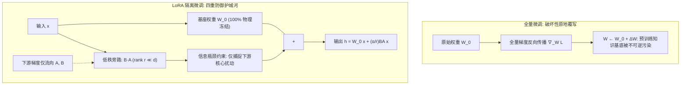

# 大模型微调机理、分布式表征与参数高效自适应 (PEFT)

> **归属模块**：`LLM_FineTuning`  
> **更新策略**：增量追加（严禁截断历史）  
> **面向对象**：人工智能专业理论与工程实践

---

## 目录 (Table of Contents)
- [1. 学习记录流水线 (Changelog)](#1-学习记录流水线-changelog)
- [2. [2026-09-08] 微调基石：从全量微调到 PEFT 机制演进](#2-2026-09-08-微调基石从全量微调到-peft-机制演进)
  - [2.1 模型微调的本质与技术坐标定位](#21-模型微调的本质与技术坐标定位)
  - [2.2 全量微调 (Full Fine-Tuning) 与显存开销数学建模](#22-全量微调-full-fine-tuning-与显存开销数学建模)
  - [2.3 灾难性遗忘 (Catastrophic Forgetting) 的流形塌缩解释](#23-灾难性遗忘-catastrophic-forgetting-的流形塌缩解释)
  - [2.4 关键认知纠偏：神经网络参数的“分布式表征” vs 假想的“功能模块论”](#24-关键认知纠偏神经网络参数的分布式表征-vs-假想的功能模块论)
  - [2.5 参数高效微调 (PEFT) 是如何选择或引入参数的？](#25-参数高效微调-peft-是如何选择或引入参数的)
  - [2.6 深度解析：LoRA 隔离微调缓解灾难性遗忘的底层原理与物理边界](#26-深度解析lora-隔离微调缓解灾难性遗忘的底层原理与物理边界)
  - [2.7 深度思维发散：表面对齐假说 (LIMA) 与知识注入边界](#27-深度思维发散表面对齐假说-lima-与知识注入边界)
- [3. 专业实战测评题库 (含采分点与解析)](#3-专业实战测评题库-含采分点与解析)
- [4. 极简复习闪卡 (CheatSheet)](#4-极简复习闪卡-cheatsheet)

---

## 1. 学习记录流水线 (Changelog)
- **2026-09-13**：增补深度推导：系统拆解 LoRA 隔离微调缓解灾难性遗忘的四大底层物理机理（基座权重零位移冻结、梯度流旁路隔离、内在低秩子空间信息瓶颈约束、模块化解耦与零损回退）；严密论证融合激活态下的流形偏移边界及工业防御对策。
- **2026-09-08**：首次创建微调体系笔记。沉淀微调应用场景、全量微调显存模型、灾难性遗忘根因；深刻纠正“参数模块割裂论（颅相学）”误区，详解分布式表征、多语义神经元、内在秩假说以及主流 PEFT（BitFit、Adapter、LoRA、Prefix）的真实参数作用机制。

---

## 2. [2026-09-08] 微调基石：从全量微调到 PEFT 机制演进

### 2.1 模型微调的本质与技术坐标定位
在大模型落地的生命周期中，微调（Fine-Tuning）处于预训练（Pre-training）与推理对齐的交汇处：
1. **预训练阶段**：利用海量无标注文本进行自回归下一词预测（Causal Next-Token Prediction），目标是压低交叉熵损失，使模型隐式吸收世界知识并构建复杂的语言概率分布。
2. **Prompt Engineering 局限**：
   - 上下文窗口限制：即便有百万 Token 窗口，注意力机制也会随着序列增长产生注意力分散（Lost in the Middle）与二次方/线性推演计算开销。
   - 行为控制不稳定：通过系统提示词引导输出风格或复杂格式容易越狱、失效或产生幻觉。
3. **微调技术坐标**：
   - 引入带有特定任务分布有监督数据集 $\mathcal{D} = \{(x_i, y_i)\}$，通过调整模型参数，将通用知识“折叠”或“投影”到特定下游任务的输入输出映射流形上。

---

### 2.2 全量微调 (Full Fine-Tuning) 与显存开销数学建模
全量微调（Full Fine-Tuning, FFT）指在训练过程中更新基础模型（Base Model）的所有可学习参数 $\Phi$。

#### 严谨显存占用拆解 (AdamW 优化器，Mixed Precision FP16/BF16)
设模型参数量为 $\Phi$（单位：Billion 参数量，即 $10^9$）：
1. **模型权重 (Weights)**：以 16-bit 浮点数（FP16/BF16）存储，每个参数占 2 字节：
   $$\text{Memory}_{\text{weights}} = 2\Phi \text{ Bytes}$$
2. **反向传播梯度 (Gradients)**：与权重同维度，同样以 FP16/BF16 存储：
   $$\text{Memory}_{\text{grads}} = 2\Phi \text{ Bytes}$$
3. **优化器状态 (Optimizer States - AdamW)**：
   - FP32 主权重副本（Master Weights）：$4\Phi \text{ Bytes}$（用于高精度参数累加更新）
   - 一阶动量（Momentum）：FP32，$4\Phi \text{ Bytes}$
   - 二阶方差（Variance）：FP32，$4\Phi \text{ Bytes}$
   - 优化器状态合计：
   $$\text{Memory}_{\text{optimizer}} = 4\Phi + 4\Phi + 4\Phi = 12\Phi \text{ Bytes}$$
4. **静态训练显存基线**：
   $$\text{Memory}_{\text{static}} = 2\Phi + 2\Phi + 12\Phi = 16\Phi \text{ Bytes}$$
   *以 7B 模型（$\Phi = 7 \times 10^9$）为例，仅存放模型、梯度和优化器就需要 $16 \times 7 = 112\text{ GB}$ 显存，未计入激活值（Activations）！*

---

### 2.3 灾难性遗忘 (Catastrophic Forgetting) 的流形塌缩解释
全量微调会导致严重的灾难性遗忘（Catastrophic Forgetting），其本质不是简单的“新知识覆盖旧知识”，而是高维特征空间的流形畸变：
- **表示漂移 (Representation Drift)**：预训练模型在高维空间建立的激活表征能够区分广泛的概念边界。当下游任务的梯度更新在所有层级全量反向传播时，损失函数极力最小化当前狭窄任务的经验风险（Empirical Risk），导致权重矩阵沿下游任务梯度的奇异方向发生不可逆位移。
- **解决方案的优劣与代价**：
  1. **混合预训练重放 (Data Replay / Mixing)**：
     - 在微调数据中按比例混入 10%~20% 的通用预训练文本（如 Wikipedia, C4, StarCoder）。
     - *缺点*：显著增加训练轮次耗时与数据清洗成本。
  2. **参数正则化约束 (Regularization)**：
     - 如 EWC (Elastic Weight Consolidation) 利用 Fisher 信息矩阵评估每个参数对原任务的重要性，施加二次惩罚：
       $$\mathcal{L}(\theta) = \mathcal{L}_{\text{new}}(\theta) + \sum_i \frac{\lambda}{2} F_i (\theta_i - \theta_i^*)^2$$
     - *缺点*：在十亿乃至百亿参数规模下，计算并维护对角/近似 Fisher 矩阵的开销过于庞大，且容易导致收敛受阻。

---

### 2.4 关键认知纠偏：神经网络参数的“分布式表征” vs 假想的“功能模块论”

> [!CAUTION]
> **常见认知误区（AI专业学生必须彻底摒弃的直觉臆想）**：
> “预训练模型的语义理解是某一部分网络权重负责的，参数彼此联系微弱，各自负责对应的问题，微调就是去挑选负责那个功能的参数，或者每个功能抽取一点。”

#### 真实物理机理：为什么这种“模块割裂论”在深度学习中彻底不成立？
1. **分布式表征 (Distributed Representations, Hinton 1986)**：
   - 概念并非由单个神经元或单个子网络独立承载，而是由横跨全网络的大量神经元协同激活的模式（Activation Pattern）共同编码。
   - 同一个权重参数 $W_{ij}$，在处理语法时提供了投影基底，在处理事实知识时提供了联想通道，在处理逻辑推理时又参与了多头注意力的路径集成。
2. **多义神经元与叠加态假说 (Polysemanticity & Superposition Hypothesis, Anthropic)**：
   - 模型面临的“概念特征数量”远超过“物理神经元维度（隐层宽度 $d$）”。
   - 模型被迫利用压缩感知原理，将多个在语义上近乎正交的高维特征“打包重叠”投影到同一个神经元上。因此，**没有任何一个权重是专属于“语义理解”或“业务分类”的**。
3. **层级抽象规律（深度神经网络的真正结构分工）**：
   - 神经网络的模块化并不是横向按“业务功能”切块，而是纵向按“抽象层级”递进：
     - **浅层 (Lower Layers)**：捕捉局部语法、词法结构、浅层统计共现。
     - **中层 (Middle Layers)**：形成实体关系、句法依赖树、跨跨度语义关联。
     - **深层 (Higher Layers)**：执行高阶抽象推理、意图判定、任务格式输出。

---

### 2.5 参数高效微调 (PEFT) 是如何选择或引入参数的？
既然无法“按功能挑选参数”，学术界和工业界是如何设计 PEFT 算法的？答案是基于**架构拓扑与矩阵重参数化**，而非任务语义功能划分：

```
                           ┌── Selective Tuning (选择式微调)
                           │   ├── BitFit: 仅训练 Bias 向量 b
                           │   └── Top-layer Tuning: 仅训练最后几层 Transformer Block
                           │
                           ├── Additive Tuning (加法/适配器微调)
                           │   ├── Bottleneck Adapter: 在 MHA/FFN 后插入低维瓶颈网络
PEFT 技术范式划分 ─────────┤   └── Prefix/Prompt Tuning: 冻结全网，在 KV-Cache 注入前缀虚拟向量
                           │
                           └── Reparameterization (重参数化微调)
                               ├── LoRA: 增量矩阵低秩分解 ΔW = B · A
                               ├── QLoRA: 4-bit NormalFloat 基模 + FP16 LoRA 适配层
                               └── DoRA: 将权重分解为幅度向量 (Magnitude) 与方向矩阵 (Direction)
```

#### 1. 选择式微调 (Selective Tuning)
- **BitFit (Zaken et al., 2021)**：
  - 冻结所有的自注意力权重矩阵 $W_q, W_k, W_v, W_o$ 和前馈网络权重 $W_1, W_2$。
  - **只训练网络中的偏置项（Bias vectors）**。
  - *原理*：偏置项参数量通常不足总参数量的 0.1%，但偏置项能够改变特征在激活函数中的截断阈值，从而对激活流形进行全局位移。
- **顶层微调 (Top-layer Tuning)**：
  - 冻结 1 到 $L-k$ 层的 Transformer Blocks，仅训练最后 $k$ 层和输出 LM Head。基于深层网络更贴近下游任务表征的经验。

#### 2. 加法式微调 (Additive Tuning / Adapters)
- **Bottleneck Adapters (Houlsby et al., 2019)**：
  - 在 Transformer Block 的 MHA 或 FFN 后面插入微型全连接瓶颈结构：降维线性层 $\rightarrow$ 非线性激活 $\rightarrow$ 升维线性层，并配合残差连接。
- **Prefix-Tuning (Li & Liang, 2021)**：
  - 冻结模型所有参数，在每一层 Transformer 的 Key 和 Value 前面拼接一段可学习的连续向量前缀（Virtual Prefix Tokens），引导注意力分布。

#### 3. 重参数化微调 (Reparameterization / Low-Rank Adaptation - LoRA)
- **内在秩假设 (Intrinsic Rank Hypothesis, Aghajanyan et al., 2020)**：
  - 预训练大模型虽然参数维度极高（过参数化），但完成特定下游任务时，参数更新矩阵 $\Delta W$ 所在的流形实际上具有非常低的“内在维度（Intrinsic Dimension）”。
- **LoRA 数学公式 (Hu et al., 2021)**：
  - 设预训练权重矩阵为 $W_0 \in \mathbb{R}^{d \times k}$，冻结 $W_0$ 不更新。
  - 引入低秩分解矩阵：
    $$\Delta W = B \cdot A, \quad \text{其中 } B \in \mathbb{R}^{d \times r}, \; A \in \mathbb{R}^{r \times k}, \; r \ll \min(d, k)$$
  - 前向传播公式：
    $$h = W_0 x + \Delta W x = W_0 x + \frac{\alpha}{r} (B A) x$$
  - *初始化规则*：$A$ 采用高斯分布初始化，$B$ 初始化为 0，确保训练初始时刻 $\Delta W = 0$，保证初始行为与基模完全一致。

---

### 2.6 深度解析：LoRA 隔离微调缓解灾难性遗忘的底层原理与物理边界

在全量微调（Full Fine-Tuning）中，模型面临不可调和的**“塑性-稳定性困境”（Plasticity-Stability Dilemma）**：学习下游新任务的梯度流经全网所有参数，造成预训练高维流形的全面塌缩（Manifold Collapse）与表征漂移（Representation Drift）。而 LoRA 作为主流的重参数化隔离微调方案，能够显著抑制遗忘现象。

#### 1. LoRA 隔离防遗忘的四大物理与数学机理



1. **基座权重物理级绝对冻结（Zero Weight Drift）**：
   - 全量微调中，参数更新为 $W \leftarrow W + \Delta W$ 原地覆写，预训练数值被彻底抹去；
   - LoRA 强制将基模参数设定为 `requires_grad = False`。模型数万亿 Token 沉淀下的句法结构、世界知识常识、通用表征投影基底在物理显存中**零位移（Zero Drift）**，原始网络结构保持 100% 纯净。
2. **梯度流的严格旁路隔离（Gradient Isolation）**：
   - 下游任务损失函数的梯度仅对可微低秩矩阵反向传播：$\frac{\partial \mathcal{L}}{\partial B}, \frac{\partial \mathcal{L}}{\partial A}$；
   - 绝不产生跨越基模权重的参数更新，从源头上**消除了多任务之间的梯度冲突（Gradient Conflict）与负迁移（Negative Transfer）**。
3. **内在低秩子空间与信息瓶颈约束（Intrinsic Subspace Restriction & Information Bottleneck）**：
   - **内在秩假设**（Intrinsic Rank Hypothesis）：Aghajanyan 等人与 Hu 等人指出，过参数化大模型在适配特定下游任务时，参数更新矩阵 $\Delta W$ 实际位于极低维度的内在子空间；
   - **容量限制作为天然正则化器**：低秩乘积 $B \cdot A$ 的最大矩阵秩严格受限于 $r \ll \min(d, k)$（如 $r=8, 16$，而 $d=4096$）。这种极端受限的参数容量形成了一个**强信息瓶颈（Information Bottleneck）**，使得 LoRA 在数学上**根本不具备重构或颠覆全局复杂高维几何流形的能力**，只能拟合下游任务的格式与局部表征变换，从而天然保全了基模的高阶几何拓扑；
   - **加法残差而非基底替代**：前向传播采用 $h = W_0 x + \frac{\alpha}{r} (B A) x$，$\Delta W x$ 仅作为微小残差偏置（Additive Residual Bias），主导特征流依然牢牢掌控在基模 $W_0$ 手中。
4. **模块化解耦与零损回退（Modular Decoupling & Zero-Cost Rollback）**：
   - **零成本完美回退**：不同于全量微调覆写后“覆水难收”，LoRA 属于外挂式增量。遇到通用推理任务时，只需将缩放系数 $\alpha$ 置零或卸载 Adapter，模型即可**瞬间 100% 恢复为纯血基模，实现真正的零遗忘**；
   - **多任务独立隔离（Multi-Adapter Routing）**：不同垂直领域的知识可以分别训练为独立的 LoRA 模块（如 $\text{LoRA}_{\text{finance}}, \text{LoRA}_{\text{code}}$），互不交叉污染。线上服务可通过路由调度器（Router）针对用户 Query 动态挂载，实现多领域并存而互不遗忘。

---

#### 2. 关键辩证纠偏：为什么 LoRA 依然无法“绝对免疫”灾难性遗忘？（物理边界与对策）

> [!WARNING]
> **切忌落入绝对化思维**：“冻结了基座权重，模型推理时就绝对不会出现灾难性遗忘”是一个严重的工程误区！

1. **激活融合态下的隐空间流形畸变**：
   - 推理部署时为了零额外延迟，通常将权重物理合并：$W_{\text{final}} = W_0 + \frac{\alpha}{r} BA$；
   - 即使不合并，前向传播中最终参与下一层计算的依然是**相加后的隐藏表征** $h = h_0 + \Delta h$；
   - 若下游任务微调时学习率过大、Epoch 过多，或者数据极度单一，$\Delta h$ 的特征范数会远远压过通用激活范数，导致注意力分布失衡（例如注意力矩阵中的 Softmax 极值被严重偏置），在需要通用推理、通用代码或日常对话时表现出**输出退化或能力急剧衰减**。
2. **Rank $r$ 设得过大的容量泄漏**：
   - 若将 $r$ 盲目放大（例如 $r=256$ 乃至更高），低秩信息瓶颈失效，LoRA 具备了破坏性覆写主导特征的能力，其遗忘程度将迅速向全量微调逼近。

#### 3. 工业界 LoRA 防遗忘的三大黄金实践方案
1. **混入通用回放数据（Replay Buffer）**：
   - 在微调数据集中强制按 10%~20% 比例掺入高质量通用预训练文本或高质量 Alpaca/ShareGPT 通用指令对，在优化 $\Delta W$ 时强行注入通用流形锚点。
2. **严控 Rank 与缩放比（Capacity Boundary）**：
   - 领域微调建议优先使用 $r \in [8, 32]$，搭配保守的 $\alpha$（如 $\alpha = 16$ 或 $\alpha = 2r$），避免赋予旁路过度的自由拟合度。
3. **KL 散度基准约束（Reference Penalty）**：
   - 在微调 Loss 中引入当前输出与冻结基模 $W_0$ 输出之间的 KL 散度惩罚，限制预测概率分布漂移：
     $$\mathcal{L}_{\text{total}} = \mathcal{L}_{\text{task}} + \lambda_{\text{KL}} D_{\text{KL}}(\pi_{\text{LoRA}}(y|x) \parallel \pi_{\text{base}}(y|x))$$

---

### 2.7 深度思维发散：表面对齐假说 (LIMA) 与知识注入边界
- **表面对齐假说 (Surface-Level Alignment Hypothesis, Zhou et al., 2023)**：
  - Meta 的 LIMA 论文指出：模型几乎所有的世界知识、事实信息和推理能力都是在**预训练阶段**获得的。
  - 微调的主要作用是**学习与用户交互的风格、格式规范（Style & Format Alignment）**，即学会如何将已经掌握的知识以人类偏好的格式呈现出来。
- **微调能够强行注入“新专业知识”吗？**
  - 尝试通过少量监督微调让模型“死记硬背”海量全新的未见实体或最新动态，极易导致严重的**事实性幻觉（Factuality Hallucinations）**。
  - *工程与学术定论*：注入全新知识的首选方案是 **持续预训练 (Continual Pre-training)** 或 **知识检索增强 (RAG)**；微调应聚焦于任务范式、指令遵循、推理链结构与特定领域术语规范的对齐。

---

## 3. 专业实战测评题库 (含采分点与解析)

### 题 1 【概念辨析题】
**题目**：同学甲认为：“因为 LoRA 冻结了基础模型的所有权重矩阵 $W_0$，所以无论在特定下游领域训练多少轮 LoRA 权重，基础模型原有的逻辑推理与通识问答能力都能百分之百无损保留。”请从模型正向传播计算流与表征空间几何的角度，批判同学甲的说法。

**采分点与硬核解析**：
1. **批判明确（2分）**：同学甲的说法错误。
2. **计算流机理（4分）**：模型最终前向计算输出为 $h = (W_0 + \frac{\alpha}{r}BA)x$。虽然参数物理上未直接修改 $W_0$，但激活值是二者线性叠加后的结果。
3. **几何流形视角（4分）**：若在单任务上长时间过拟合微调，低秩增量矩阵 $BA$ 会在该任务对应的特征投影方向施加极大能量，导致注意力权重分布出现强偏移（Attention Distribution Skew），破坏了原本通识推理所依赖的平衡隐空间几何流形，最终产生严重的表征漂移和通用能力退化。

---

### 题 2 【计算推导题】
**题目**：现有一个 $L=32$ 层的 Transformer 解码器模型，隐层维度 $d_{\text{model}} = 4096$。我们在所有注意力投影层（$W_q, W_k, W_v, W_o \in \mathbb{R}^{d \times d}$）上应用 LoRA，设置秩 $r=16$。
1. 计算单层中 4 个注意力矩阵的全量参数量，以及对应 LoRA 适配器的新增参数量。
2. 假设使用 AdamW 优化器（Mixed Precision FP16/BF16，一阶与二阶动量为 FP32），求单层注意力矩阵在**全量微调**与 **LoRA 微调**下，优化器状态（Optimizer States）各消耗多少显存（以 MB 为单位，结果保留两位小数）？

**标准答案与推导步骤**：
1. **参数量计算**：
   - 全量单层 4 矩阵参数量：
     $$\Phi_{\text{attn}} = 4 \times (4096 \times 4096) = 4 \times 16,777,216 = 67,108,864 \approx 67.11\text{ M 参数}$$
   - LoRA 单个投影矩阵参数量：$A \in \mathbb{R}^{16 \times 4096}$，$B \in \mathbb{R}^{4096 \times 16}$，参数为 $2 \times (16 \times 4096) = 131,072$。
   - 4 个矩阵合计 LoRA 参数量：
     $$\Phi_{\text{lora}} = 4 \times 131,072 = 524,288 \approx 0.52\text{ M 参数}$$
   - *参数量压缩比达 $67,108,864 / 524,288 = 128$ 倍！*
2. **优化器显存消耗计算**：
   - 优化器状态规则：每个参与训练的可学习参数需消耗 $12$ 字节（Master Weight 4B + Momentum 4B + Variance 4B）。
   - **全量微调单层优化器显存**：
     $$\text{Mem}_{\text{opt-FFT}} = 67,108,864 \times 12 \text{ Bytes} = 805,306,368 \text{ Bytes} = \frac{805,306,368}{1024^2} \approx 768.00\text{ MB}$$
   - **LoRA 微调单层优化器显存**：
     $$\text{Mem}_{\text{opt-LoRA}} = 524,288 \times 12 \text{ Bytes} = 6,291,456 \text{ Bytes} = \frac{6,291,456}{1024^2} = 6.00\text{ MB}$$
   - *单层注意力优化器显存从 768 MB 骤降至 6 MB！*

---

### 题 3 【架构设计题】
**题目**：在进行大模型跨语种（如中译英、专业小语种翻译）微调时，研究表明将 LoRA 仅施加在自注意力模块（$W_q, W_v$）的效果，往往显著逊色于同时施加在 MLP/FFN 层。请结合 Transformer 中各组件的分工原理，解释这一现象的理论依据。

**标准解析与答题要点**：
1. **组件职责划分**：
   - **Self-Attention 模块**：主要负责上下文动态路由与信息聚合（Routing & Information Retrieval），决定“当前词关注哪一个上下文词”。
   - **MLP / FFN 模块**：可被视作 Key-Value 记忆网络（Key-Value Memory Networks, Geva et al.），负责存储与提取具体的词汇表征、世界知识与实体事实。
2. **跨语种迁移机理**：
   - 跨语种任务不仅需要重新组织注意力依赖关系，更需要大规模更新跨语种词汇映射与知识库联想。
   - 若仅微调 $W_q, W_v$，模型只能调整上下文的聚合权重，而无法有效改写 FFN 中存储的隐式记忆网络，导致目标语种知识与专业术语翻译质量低下。因此必须将低秩更新矩阵覆盖至 FFN 权重。

---

## 4. 极简复习闪卡 (CheatSheet)

| 核心问题 | 黄金答案（速查心智模型） |
| :--- | :--- |
| **参数是各自分工独立的吗？** | **绝非独立**。采用分布式表征与叠加态编码，参数高度纠缠，不存在孤立负责某个业务功能的神经元。 |
| **PEFT 参数如何选？** | **按架构拓扑选，非功能选**。结构性冻结（BitFit/顶层）、加法适配（Adapters/Prefix）、低秩重参数化（LoRA/QLoRA）。 |
| **为什么大模型可用极小秩微调？** | **内在秩假说**。预训练模型表征流形高度过参数化，下游适配只需在极低维子空间扰动即可收敛。 |
| **AdamW 全量训练显存基线？** | **$16\Phi$ 字节**（权重 2B + 梯度 2B + 优化器状态 12B，未含激活值）。 |
| **微调的本质在学什么？** | **表面对齐（LIMA假说）**。学格式、交互范式与风格路由；非注入全新事实世界知识。 |
