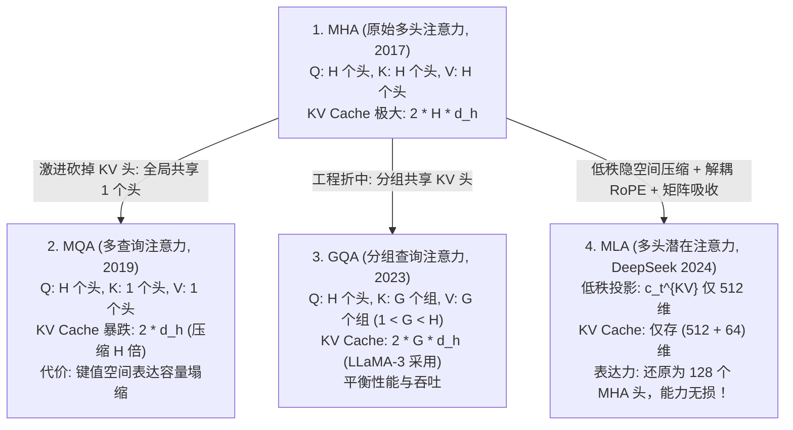

# 大模型注意力演进与 KV Cache 极限压缩：从 MHA、MQA、GQA 到 DeepSeek MLA 与前沿超越

> **归属模块**：`LLM_Serving`  
> **更新策略**：增量追加（严格遵循 Zero-Shrinkage 规范）  
> **面向对象**：人工智能专业大模型推理架构、KV Cache 显存瓶颈突破与底层算子数学推导

---

## 目录 (Table of Contents)
- [1. 学习记录流水线 (Changelog)](#1-学习记录流水线-changelog)
- [2. 认知纠偏与本质定性：关于 MLA 的核心误区批判](#2-认知纠偏与本质定性关于-mla-的核心误区批判)
  - [2.1 致命概念纠偏：“MLA 是通过低秩矩阵减少参数量，类似于 LoRA 吗？”](#21-致命概念纠偏mla-是通过低秩矩阵减少参数量类似于-lora-吗)
  - [2.2 核心矛盾厘清：静态参数量 (Weights) vs 运行时动态缓存 (KV Cache)](#22-核心矛盾厘清静态参数量-weights-vs-运行时动态缓存-kv-cache)
- [3. 注意力演化四部曲：数学推导与空间拓扑剖析](#3-注意力演化四部曲数学推导与空间拓扑剖析)
  - [3.1 MHA (Multi-Head Attention)：表达力充盈与长文本显存深渊](#31-mha-multi-head-attention表达力充盈与长文本显存深渊)
  - [3.2 MQA (Multi-Query Attention)：极致激进压缩与容量塌缩代价](#32-mqa-multi-query-attention极致激进压缩与容量塌缩代价)
  - [3.3 GQA (Grouped-Query Attention)：工程折中主义的折中解](#33-gqa-grouped-query-attention工程折中主义的折中解)
  - [3.4 MLA (Multi-Head Latent Attention)：DeepSeek 的低秩隐空间投影与数学奇迹](#34-mla-multi-head-latent-attentiondeepseek-的低秩隐空间投影与数学奇迹)
    - [3.4.1 低秩联合压缩机制 (Joint Low-Rank Compression)](#341-低秩联合压缩机制-joint-low-rank-compression)
    - [3.4.2 核心数学障碍：RoPE 旋转位置编码的不可压缩性](#342-核心数学障碍rope-旋转位置编码的不可压缩性)
    - [3.4.3 神来之笔：解耦 RoPE (Decoupled RoPE) 独立运算与语义承载本质剖析](#343-神来之笔解耦-rope-decoupled-rope-独立运算与语义承载本质剖析)
    - [3.4.4 推理端矩阵吸收神技 (Matrix Absorption Trick)：Key 的零解压计算](#344-推理端矩阵吸收神技-matrix-absorption-trickkey-的零解压计算)
- [4. 四代注意力机制单 Token 显存开销与参数矩阵严密对照](#4-四代注意力机制单-token-显存开销与参数矩阵严密对照)
- [5. 超越 MLA：前沿最新学术与工业界突破全景 (Beyond MLA)](#5-超越-mla前沿最新学术与工业界突破全景-beyond-mla)
  - [5.1 DeepSeek 原生稀疏注意力 (NSA, Native Sparse Attention)](#51-deepseek-原生稀疏注意力-nsa-native-sparse-attention)
  - [5.2 跨层注意力复用 (CLA, Cross-Layer Attention)](#52-跨层注意力复用-cla-cross-layer-attention)
  - [5.3 动态重要性驱逐算法 (SnapKV / H2O / PyramidKV)](#53-动态重要性驱逐算法-snapkv--h2o--pyramidkv)
  - [5.4 极低比特 KV Cache 量化 (FP8 / INT4 / KIVI)](#54-极低比特-kv-cache-量化-fp8--int4--kivi)
  - [5.5 DeepSeek 百万级长上下文：压缩稀疏注意力 (CSA) 与重度压缩注意力 (HCA) 双轨混合架构](#55-deepseek-百万级长上下文压缩稀疏注意力-csa-与重度压缩注意力-hca-双轨混合架构)
    - [5.5.1 认知纠偏：4:1 压缩到底压缩在哪？Q 为什么绝不压缩？](#551-认知纠偏41-压缩到底压缩在哪q-为什么绝不压缩)
    - [5.5.2 架构双轨设计：长文归档槽 (Archive) 与高频工作台 (Working Area)](#552-架构双轨设计长文归档槽-archive-与高频工作台-working-area)
    - [5.5.3 硬件极致亲和：为什么一定要按 4:1 压缩？GPU 缓存行哲学](#553-硬件极致亲和为什么一定要按-41-压缩gpu-缓存行哲学)
    - [5.5.4 训练全生命周期演进：预训练、外推、微调中的压缩状态演进](#554-训练全生命周期演进预训练外推微调中的压缩状态演进)
    - [5.5.5 维度解耦：CSA (时序压缩) 与 MLA (通道压缩) 的正交协同图景](#555-维度解耦csa-时序压缩-与-mla-通道压缩-的正交协同图景)
- [6. 专业实战测评与白盒推导题库 (含采分点与解析)](#6-专业实战测评与白盒推导题库-含采分点与解析)
- [7. 极简复习闪卡 (CheatSheet)](#7-极简复习闪卡-cheatsheet)

---

## 1. 学习记录流水线 (Changelog)
- **2026-09-13**：增补解耦 RoPE 核心机理辨析：严密推导双轨独立运算与矩阵拼接内积的可加性代数解耦机制；深度解构 RoPE 向量的语义承载本质（由深层上下文 $h_t$ 投影、内容自适应相对位置注意力、反证退化风险与内容/位置流语义分工）。
- **2026-09-09**：系统构建大模型注意力演变全景笔记。彻底驳斥“MLA 是类似 LoRA 减少参数量”的严重概念混淆；严密推导 MHA、MQA、GQA 到 MLA 的矩阵维度、显存开销与理论本质；深度解构 MLA 中 RoPE 解耦设计与推理阶段矩阵吸收（Matrix Absorption）机制；全面拓展 NSA（原生稀疏注意力）、CLA（跨层注意力）与动态 KV 驱逐等最新科研前沿。
- **2026-09-11**：新增第 5.5 节，深度解析 DeepSeek-V4 及长文本推理核心技术——压缩稀疏注意力（CSA）与重度压缩注意力（HCA）。严格厘清“4:1 压缩是在 KV 序列维度而非 Embedding 融合”、“Query 绝不压缩”及“注意力直接在压缩空间计算无需反向还原”的核心数学与工程机制；推导因果倒错（Causality Break）的 SWA 保护解法，并系统总结 HCA（128:1 稠密）与 CSA（4:1 稀疏）的层间交叠协同机制。
- **2026-09-09**：系统构建大模型注意力演变全景笔记。彻底驳斥“MLA 是类似 LoRA 减少参数量”的严重概念混淆；严密推导 MHA、MQA、GQA 到 MLA 的矩阵维度、显存开销与理论本质；深度解构 MLA 中 RoPE 解耦设计与推理阶段矩阵吸收（Matrix Absorption）机制；全面拓展 NSA（原生稀疏注意力）、CLA（跨层注意力）与动态 KV 驱逐等最新科研前沿。

---

## 2. 认知纠偏与本质定性：关于 MLA 的核心误区批判

### 2.1 致命概念纠偏：“MLA 是通过低秩矩阵减少参数量，类似于 LoRA 吗？”

> [!CAUTION]
> **严重认知死角**：初学者看到“低秩矩阵分解”几个字，便望文生义地联想到 LoRA，进而得出“MLA 是为了减少模型参数量”的荒谬结论。  
>
> **严厉直接纠偏**：**这是一个极其严重的概念混淆！MLA（Multi-Head Latent Attention）不仅没有减少模型参数量，其静态权重参数量反而比标准 MHA 更多！**

#### 两者的技术本质南辕北辙：
1. **LoRA 是参数高效微调（PEFT）技术**：
   - 解决的是**训练阶段优化器状态（Optimizer States）显存爆炸**的问题；
   - 它通过冻结基模主干，引入低秩支路 $\Delta W = BA$（$r \ll d$），其**目的确实是减少可训练参数量**。
2. **MLA 是推理阶段架构级注意力（Attention Architecture）改造**：
   - 解决的是**自回归生成（Decode）阶段 KV Cache 运行时显存爆炸与带宽瓶颈（Memory Wall）**；
   - 它在主干网络中显式增加了下投影矩阵（Down-projection）与上投影矩阵（Up-projection），**模型的静态参数量（Weights）是显著增加的！**
   - 它的低秩压缩发生在此处：**它压缩的是运行时的激活值状态（Activation States），使得存放在显卡显存中的 KV 缓存张量变得极小！**

---

### 2.2 核心矛盾厘清：静态参数量 (Weights) vs 运行时动态缓存 (KV Cache)

$$
\text{Memory}_{\text{total}} = \text{Memory}_{\text{weights}} + \text{Memory}_{\text{KV\_Cache}}
$$

* **模型权重显存 $\text{Memory}_{\text{weights}}$**：静态固定，由模型参数量与量化精度决定；
* **KV Cache 显存 $\text{Memory}_{\text{KV\_Cache}}$**：动态膨胀，随批次并发数 $B$、序列长度 $L$ 及注意力层数暴涨！

* 当处理 128k 超长上下文或数千并发时，**KV Cache 占用的显存往往是模型本身权重的数倍至数十倍！**
* 此时 GPU 的算力利用率（FLOPs Utilization）极低，瓶颈完全卡在显存带宽上（Memory-Bound）。
* **MQA、GQA 和 MLA 的一切手术刀，全部精准瞄准的是后者——即压缩每一个 Token 所产生的 KV Cache 尺寸！**

---

## 3. 注意力演化四部曲：数学推导与空间拓扑剖析



---

### 3.1 MHA (Multi-Head Attention)：表达力充盈与长文本显存深渊

在标准 MHA (Vaswani et al., 2017) 中：
设模型隐藏维度为 $d$，注意力头数为 $n_h$，每个头的维度为 $d_h$（通常 $d = n_h \cdot d_h$）。

对于输入向量 $h_t \in \mathbb{R}^d$：
$$q_t = h_t W^Q, \quad k_t = h_t W^K, \quad v_t = h_t W^V$$
其中 $W^Q, W^K, W^V \in \mathbb{R}^{d \times (n_h \cdot d_h)}$。

* **每个 Token 的 KV Cache 显存开销**：

  $$
  \text{Size}_{\text{MHA}} = 2 \times n_h \times d_h = 2d
  $$

  （以元素个数计，在 FP16 精度下对应 $4d$ 字节）
* **致命缺陷**：以 70B 模型（$n_h = 64, d_h = 128 \implies 2 \times 64 \times 128 = 16384$ 元素/Token）为例，单 Token 占用 32 KB（FP16）。当并发 $B=32$、序列长度 $L=128\text{k}$ 时，仅 KV Cache 就需要 **128 GB 显存**！两张 80GB A100 连模型权重都塞不下，直接瘫痪。

---

### 3.2 MQA (Multi-Query Attention)：极致激进压缩与容量塌缩代价

Shazeer (2019) 提出 MQA：**让所有的 Query 头共享唯一的一个 Key 头和 Value 头**。

$$q_{t, i} = h_t W_i^Q \quad (i = 1, \dots, n_h)$$
$$k_t = h_t W^K, \quad v_t = h_t W^V \quad (W^K, W^V \in \mathbb{R}^{d \times d_h})$$

* **每个 Token 的 KV Cache 显存开销**：
  $$\text{Size}_{\text{MQA}} = 2 \times 1 \times d_h = 2d_h$$
* **显存压缩比**：相较于 MHA 直接暴降 $n_h$ 倍（如 64 倍）！
* **致命代价——表达容量塌缩 (Capacity Collapse)**：
  在多头机制中，不同的头本应关注不同的语义子空间（例如头 1 关注语法依存，头 2 关注指代消歧，头 3 关注长程检索）。MQA 强行将所有头的 Key/Value 压缩进单一一组向量，使得模型在复杂长文本理解、严谨逻辑推理和代码任务中表现出显著的性能回退。

---

### 3.3 GQA (Grouped-Query Attention)：工程折中主义的折中解

Ainslie et al. (2023) 提出的 GQA 是 MHA 与 MQA 的折中泛化：
将 $n_h$ 个 Query 头均分为 $n_{kv}$ 个组（每组包含 $n_h / n_{kv}$ 个 Query 头），每组内的 Query 头共享一对 Key 和 Value 头。

* **每个 Token 的 KV Cache 显存开销**：
  $$\text{Size}_{\text{GQA}} = 2 \times n_{kv} \times d_h$$
* **行业应用**：LLaMA-2 70B 与 LLaMA-3 全系均采用 GQA（通常 $n_h = 32 \sim 64, n_{kv} = 8$），将 KV Cache 压缩为 MHA 的 $\frac{1}{4} \sim \frac{1}{8}$。
* **物理瓶颈**：GQA 依然只是“在显存与性能之间做线性妥协”。当面对 128k 或 1M 极限长文本时，$\frac{1}{8}$ 的显存开销依然过于昂贵。

---

### 3.4 MLA (Multi-Head Latent Attention)：DeepSeek 的低秩隐空间投影与数学奇迹

DeepSeek 在 DeepSeek-V2 与 DeepSeek-V3 中提出了被誉为现代注意力架构巅峰的 **MLA (Multi-Head Latent Attention)**。

> **MLA 的终极雄心**：**能否让 KV Cache 的显存开销比 MQA 还要小，但同时保留甚至超越完整 MHA 的多头强悍表达能力？**

DeepSeek 给出的答案是：**低秩联合隐空间压缩 (Joint Compression) + 解耦 RoPE (Decoupled RoPE) + 矩阵吸收 (Matrix Absorption)！**

```
                  输入隐藏状态 h_t ∈ R^d
                            │
              ┌─────────────┴─────────────┐
              ▼                           ▼
      【Key/Value 联合下投影】           【解耦 RoPE 独立投影】
       c_t^{KV} = h_t W^{DKV}             k_t^R = RoPE(h_t W^{KR})
       (仅 512 维潜在向量)               (仅 64 维位置向量)
              │                           │
              └─────────────┬─────────────┘
                            ▼
          【自回归推理时，显存中只保存此二人！】
             KV Cache = [ c_t^{KV} ; k_t^R ]
                 总维度仅: 512 + 64 = 576
                            │
                            ▼ (计算注意力时通过矩阵乘法结合律无缝计算)
                   计算 128 个注意力头的结果！
```

---

#### 3.4.1 低秩联合压缩机制 (Joint Low-Rank Compression)
对 Key 和 Value 不再分别做独立投影，而是将它们**联合投影到一个极低维度的隐空间（Latent Space）**：

$$c_t^{KV} = h_t W^{DKV}$$
* $W^{DKV} \in \mathbb{R}^{d \times d_c}$ 是下投影矩阵；
* **关键参数**：在 DeepSeek-V2/V3 中，$d = 5120$ 或 $7168$，而隐空间维度 **$d_c$ 仅为 $512$**！
* 在训练或生成时，如果需要还原多头 Key 和 Value，通过两个上投影矩阵进行解压：
  $$k_{t, i}^C = c_t^{KV} W_{i}^{UK}, \quad v_{t, i}^C = c_t^{KV} W_{i}^{UV} \quad (i = 1, \dots, n_h)$$
  * $W^{UK} \in \mathbb{R}^{d_c \times (n_h \cdot d_h)}$：上投影生成所有头的 Content Key；
  * $W^{UV} \in \mathbb{R}^{d_c \times (n_h \cdot d_v)}$：上投影生成所有头的 Content Value。

---

#### 3.4.2 核心数学障碍：RoPE 旋转位置编码的不可压缩性
如果直接对 Key 施加 RoPE 旋转位置编码，低秩压缩在数学上就会彻底崩溃！

> **严格数学反证**：
> 假设我们在还原后的 Key 上施加 RoPE 旋转矩阵 $R_t$：
> $$k_t = R_t (c_t^{KV} W^{UK})$$
> 注意力分数的计算为：
> $$q_s^T k_t = q_s^T \left[ R_t (c_t^{KV} W^{UK}) \right] = \left( q_s^T R_t \right) c_t^{KV} W^{UK}$$
> 因为旋转矩阵 $R_t$ 是**依赖于时间步 $t$（当前 Token 在序列中的绝对位置）的矩阵**，它与上投影矩阵 $W^{UK}$ **完全不满足乘法交换律**：
> $$R_t W^{UK} \neq W^{UK} R_t$$
> **后果**：如果 $R_t$ 乘在最里面，你就**必须先把 $c_t^{KV}$ 上投影解压成高维的 $k_t$，然后再对每个头乘上 $R_t$**！这样你就必须把解压后带位置信息的全量多头 Key 缓存到显存中，低秩压缩的设想完全化为泡影！

---

#### 3.4.3 神来之笔：解耦 RoPE (Decoupled RoPE) 独立运算与语义承载本质剖析

为了打破旋转矩阵与解压矩阵不满足交换律（$R_t W^{UK} \neq W^{UK} R_t$）的数学死结，DeepSeek 提出了工业界极具启发性的**解耦位置编码方案（Decoupled RoPE）**：
**将“语义内容（Content）”与“位置信息（Position）”彻底剥离为两个在几何空间与计算图上完全正交的双轨通道！**

##### 1. 解耦双轨的独立运算流水线与代数解耦机制

```
                      输入隐藏状态 h_t ∈ R^d
                                │
        ┌───────────────────────┴───────────────────────┐
        ▼                                               ▼
 【内容流 Content Stream】                     【位置流 RoPE Stream】
c_t^{KV} = h_t W^{DKV} ∈ R^{512}              k_t^R = RoPE(h_t W^{KR}) ∈ R^{64}
(联合低秩压缩，完全不乘 RoPE)                   (专门线性投影 + 绝对位置旋转，全头共享)
        │                                               │
        │ (推理时无需还原，直接矩阵吸收)                   │ (直接进入 KV Cache)
        ▼                                               ▼
缓存: c_t^{KV} (512 维)                         缓存: k_t^R (64 维)
        └───────────────────────┬───────────────────────┘
                                ▼
                 总动态缓存仅: 512 + 64 = 576 维
```

- **Query 端解耦投影**：
  - 低秩压缩：$c_t^Q = h_t W^{DQ} \in \mathbb{R}^{d_c'}$；
  - 内容查询向量：$q_{t, i}^C = c_t^Q W_i^{UQ} \in \mathbb{R}^{d_h}$（不乘 RoPE）；
  - 位置查询向量：$q_{t, i}^R = \operatorname{RoPE}(c_t^Q W_i^{QR}) = \mathcal{R}_t (c_t^Q W_i^{QR}) \in \mathbb{R}^{d_R}$；
  - 拼接向量：$q_{t, i} = [q_{t, i}^C \; ; \; q_{t, i}^R] \in \mathbb{R}^{d_h + d_R}$。
- **Key 端解耦投影**：
  - 内容键向量：$k_{s, i}^C = c_s^{KV} W_i^{UK} \in \mathbb{R}^{d_h}$（**核心：不施加 RoPE，训练时上投影，推理时直接被矩阵吸收**）；
  - 位置键向量：$k_s^R = \operatorname{RoPE}(h_s W^{KR}) = \mathcal{R}_s (h_s W^{KR}) \in \mathbb{R}^{d_R}$（**核心：全注意力头全局共享，仅占用 64 维**）；
  - 拼接向量：$k_{s, i} = [k_{s, i}^C \; ; \; k_s^R] \in \mathbb{R}^{d_h + d_R}$。

- **点积运算的代数解耦证明（可加性分块）**：
  利用分块向量内积的分配律，注意力得分被天然分解为两个独立平行的标量点积之和：
  $$
  q_{t, i}^T k_{s, i} = \begin{bmatrix} q_{t, i}^C \\ q_{t, i}^R \end{bmatrix}^T \begin{bmatrix} k_{s, i}^C \\ k_s^R \end{bmatrix} = \underbrace{(q_{t, i}^C)^T k_{s, i}^C}_{\text{语义内容打分项 (满足乘法结合律)}} + \underbrace{(q_{t, i}^R)^T k_s^R}_{\text{相对位置调制项 (独立 64 维点积)}}
  $$
  - **解耦的本质红利**：前半部分纯内容交互中**没有任何随位置变化的旋转矩阵**，因而满足结合律，推理时可直接将 $W_i^{UK}$ 吸收至 Query，使全量多头 Key 彻底无需解压；后半部分仅需对 64 维的小向量做点积，两者在算子图与显存中物理独立。

---

##### 2. 深度剖析：承载 RoPE 的专用向量是否承载了语义特征？

> [!IMPORTANT]
> **绝对定性结论**：**是的，这个 RoPE 向量绝对承载了语义特征，绝非纯粹的绝对几何索引或静态时间戳！**

很多初学者容易误认为“既然解耦为内容流和位置流，那 RoPE 向量里就只有纯位置编号，内容流里才有语义”。这是对深度学习表征机理的重大误解：

1. **输入源头与可学习投影（语义生成源）**：
   - 查看公式：$k_s^R = \mathcal{R}_s (h_s W^{KR})$。
   - 输入 $h_s$ 是前序网络层产出的深层隐藏状态，蕴含了丰富的词义、句法与上下文实体信息；
   - 投影矩阵 $W^{KR} \in \mathbb{R}^{d \times d_R}$ 是通过反向传播联合训练的可学习参数。网络通过 $W^{KR}$ 主动学习：**“从当前词的深层语义表征中，提取出哪一部分特定的特征去参与相对位置关系的敏感度判定”**。
2. **RoPE 点积的物理本质是“内容自适应的相对位置注意力”（Content-Dependent Positional Attention）**：
   - 展开位置项的点积数学形式：
     $$(q_{t, i}^R)^T k_s^R = (\mathcal{R}_t x_{t, i}^Q)^T (\mathcal{R}_s x_s^K) = (x_{t, i}^Q)^T \mathcal{R}_{s-t} x_s^K$$
     其中 $x_{t, i}^Q = c_t^Q W_i^{QR}$，$x_s^K = h_s W^{KR}$。
   - **物理意义**：相对旋转矩阵 $\mathcal{R}_{s-t}$ 只负责提供相对位移 $s-t$ 的周期正交旋转，但点积的两端依然是带有输入语义的特征向量 $x_t^Q$ 与 $x_s^K$。
   - **语义自适应场景**：
     - 若当前 Query 是一个动词，它希望强关注“前方较近距离的主语名词”；
     - 若当前 Query 是一个定语从句先行词，它希望穿透较远距离寻找关系代词；
     - 只有当位置向量本身承载了词的语法角色与语义属性，模型才能根据输入内容**动态缩放或激活对不同相对距离的注意力权重**。
3. **数学反证法：如果该向量不承载语义会发生什么？**
   - 假设 $x_t^Q$ 与 $x_s^K$ 与输入语义完全无关（例如退化为全 1 常数向量 $\mathbf{1}$），则：
     $$(q_{t, i}^R)^T k_s^R = \mathbf{1}^T \mathcal{R}_{s-t} \mathbf{1} = \sum_{j=1}^{d_R/2} \cos((s-t)\theta_j)$$
   - 此时位置打分将彻底退化为一个**静态的、与输入内容毫无关系的绝对/相对位置偏置（Static Positional Bias）**，类似 ALiBi 或 T5 的固定距离衰减标量。模型将彻底丧失“根据上下文内容动态调节位置敏感度”的高阶能力。
4. **双轨通道的语义分工与容量权衡**：
   - **内容通道（Content Stream）**：分配绝大部分维度（如 128 个头展开后达 16384 维），承担 90%+ 的**高阶全局语义、实体关系、事实知识与抽象逻辑推理**；
   - **位置通道（RoPE Stream）**：分配极小共享维度（$d_R = 64$），专门承载**与局部句法约束、词序排列、就近修饰和因果链条紧密绑定的“空间/时序相关语义”**。

---

#### 3.4.4 深度拆解：什么是“矩阵吸收”？推理时在干什么，为什么不还原，何时才还原？

初学者在阅读 MLA 时，往往被“矩阵吸收（Matrix Absorption）”这个抽象词汇所困惑。以下从**直观物理图景**、**数学代数推导**与**系统生命周期权衡**三个维度进行彻底拆解：

##### 1. 到底什么是“被矩阵吸收”？（直观比喻与代数机理）
- **直观比喻**：
  在 MLA 的原始定义中，上投影矩阵 $W_i^{UK}$ 本来是专属于 Key 的“放大镜”——负责把显存里压缩成 512 维的隐变量 $c_s^{KV}$ 还原为 128 维的多头特征。
  **“矩阵吸收”的含义是：这个放大镜不在历史的几万个 Key 身上用了，而是被当前的 Query 给“吸收/吞噬”进去了！**
- **代数推导（结合律魔术）**：
  设向量以行向量表示。计算第 $t$ 步的 Query 与第 $s$ 步历史 Key 的内容内积时：
  $$
  \text{Score}_{t, s}^C = q_{t, i}^C (k_{s, i}^C)^T
  $$
  将上投影公式 $k_{s, i}^C = c_s^{KV} W_i^{UK}$ 代入其中：
  $$
  \text{Score}_{t, s}^C = q_{t, i}^C \left( c_s^{KV} W_i^{UK} \right)^T = q_{t, i}^C (W_i^{UK})^T (c_s^{KV})^T
  $$
  根据矩阵乘法的**结合律** $(A B) C = A (B C)$，调换运算的括号结合优先级：
  $$
  \text{Score}_{t, s}^C = \underbrace{\left[ q_{t, i}^C (W_i^{UK})^T \right]}_{\tilde{q}_{t, i}^C} (c_s^{KV})^T = \tilde{q}_{t, i}^C (c_s^{KV})^T
  $$
  - **吸收的结果**：
    原本作用在历史 Key 身上的解压矩阵 $(W_i^{UK})^T$，在计算前**直接乘到了当前的 Query 身上**，生成了一个新的、吸收了 Key 投影特征的**混合查询向量 $\tilde{q}_{t, i}^C \in \mathbb{R}^{1 \times d_c}$（512 维）**！
  - **同理，Value 矩阵 $W_i^{UV}$ 的离线折叠吸收**：
    注意力加权计算原本为：
    $$o_{t, i} = \sum_{s} A_{t, s} v_{s, i} = \sum_{s} A_{t, s} (c_s^{KV} W_i^{UV}) = \left( \sum_{s} A_{t, s} c_s^{KV} \right) W_i^{UV}$$
    $W_i^{UV}$ 被直接从 Token 级求和循环中提出来，甚至可以直接与后级的输出线性投影矩阵 $W_i^O$ 预先在模型加载时相乘折叠为单一大矩阵：
    $$W_i^{UVO} = W_i^{UV} W_i^O \in \mathbb{R}^{d_c \times d}$$
    矩阵 $W_i^{UV}$ 被输出层彻底“吸收”，在注意力计算过程中完全消失！

---

##### 2. 推理阶段是在干什么？为什么完全不需要还原？

在自回归 Decode（生成每个新 Token）阶段，系统执行的操作如下：
1. **生成当前 Token 的 Query**：当前时刻只有一个新输入的 Token $h_t$，算出当前步的 $q_t$；
2. **执行矩阵吸收变换（极其轻量）**：
   将当前这 **唯一 1 个 Token** 的内容 Query 乘以转置上投影矩阵：$\tilde{q}_{t, i}^C = q_{t, i}^C (W_i^{UK})^T$。由于只有 1 个向量，这一步计算耗时不足微秒；
3. **从显存搬运压缩缓存（极大带宽节省）**：
   从 GPU 显存（HBM）中把前文全部 $S$ 个历史 Token 的缓存读入片上缓存（SRAM）。每个历史 Token **仅仅搬运 512 维的 $c_s^{KV}$ 和 64 维的 $k_s^R$**，无需读写庞大的解压后多头张量；
4. **直接在隐空间做点积**：
   在 SRAM 中直接用 512 维的 $\tilde{q}_{t, i}^C$ 与 512 维的 $c_s^{KV}$ 做内积，加上 64 维位置内积，直接产出 Softmax 注意力得分；
5. **隐变量直接加权聚合**：
   对 Value 同样直接对 512 维的 $c_s^{KV}$ 按注意力权重加权求和，最后一步统一乘以 $W^{UVO}$ 输出。

> **为什么完全不需要还原？（双重绝杀理由）**
> 1. **数学上 100% 精确等价（无损变换）**：
>    双线性内积满足 $\langle q, W k \rangle = \langle W^T q, k \rangle$。把 Key 放大映射到 Query 的空间，和把 Query 逆向映射到 Key 的压缩空间，计算出来的标量相似度完全一样，**没有任何近似和精度妥协**。
> 2. **算力与带宽的极端不对称性（$O(1)$ vs $O(S)$）**：
>    - 当前生成的 Query 只有 **1 个 Token**！
>    - 历史累积的 Key 有 **$S$ 个 Token**（如 $S = 32768$ 甚至 $128k$）；
>    - **若选择还原**：你必须对显存中 $S$ 个历史 Token 分别做上投影，运算量是 $O(S \times d_c \times n_h \times d_h)$，并且在显存中展开会撑爆带宽（Decode 阶段是典型的 Memory-Bound，显存读取带宽是死锁瓶颈）；
>    - **若矩阵吸收**：只需对当前 **1 个 Query** 做一次投影，运算量仅为 $O(1 \times d_c \times n_h \times d_h)$，同时显存搬运量暴降 93%！
>    - **结论**：既然变换 1 个 Query 就能拿到完全一样的结果，没有任何理由去把千万个历史 Token 还原！

**最终结论：MLA 在自回归推理时，缓存中永远只需要保存：**

$$
\text{KV\_Cache}_{\text{MLA}} = [ c_t^{KV} \; ; \; k_t^R ] \in \mathbb{R}^{d_c + d_R} = \mathbb{R}^{512 + 64} = \mathbb{R}^{576}
$$

---

##### 3. 那到底什么时候才需要还原？（Training 与 Prefill 阶段）

既然矩阵吸收在推理 Decode 阶段如此完美，那到底什么时候才必须显式还原 $K$ 和 $V$？
**答案：在模型训练阶段（Training）以及推理的首字预填充阶段（Prefill）！**

为什么在这些阶段不使用矩阵吸收，而必须显式还原出多头 $K$ 和 $V$？
1. **时空成本不对称性消失（$S \times S$ 全对称矩阵乘法）**：
   - 在训练和 Prefill 阶段，输入不是“1 个 Token 交互 $S$ 个历史 Token”，而是**整段输入文本内部的全量 Token 两两交互（序列长度为 $S$ 的 Query 与长度为 $S$ 的 Key 进行因果矩阵乘法）**；
   - 此时 Query 和 Key 的数量是对等的（都是 $S$），不再存在“变换 1 个 Query 就能节省 $S$ 个 Key”的非对称收益。
2. **硬件算子生态与 FlashAttention 的 Tile 结构兼容性**：
   - 工业界训练普遍高度依赖 FlashAttention-2 / 3 等高度底层手工调优的 CUDA/Triton 算子，这类算子要求每个注意力头的特征维度 $d_h$ 为标准的 64 或 128（与 GPU SRAM 的 Tensor Core Tile 硬件尺寸精确对齐）；
   - 如果在训练阶段使用矩阵吸收，Query 和 Key 在 Attention 阶段的特征维度将被强行拉大到隐变量维度 $d_c = 512$。
   - **后果**：在单头 512 维下执行 FlashAttention，单块数据超出了 GPU SRAM 的最优化缓存块尺寸，将引发频繁的寄存器溢出（Register Spill）与共享显存回退，导致计算吞吐严重下降；
   - 相比之下，将 $c^{KV}$ 显式还原成 128 个头、每个头 $d_h = 128$ 的标准多头张量，能够**完美契合 FlashAttention 的极致硬件流水线**。
3. **计算受限（Compute-Bound）vs 访存受限（Memory-Bound）的生命周期切换**：
   - **训练与 Prefill 阶段**：全序列 GEMM 矩阵乘法计算量极大，系统瓶颈在 **GPU 浮点算力（Compute-Bound）**，且此时根本不需要把每一步的中间 Key/Value 持久化缓存到显存中供多轮复用，因此完全不需要为了省显存而妥协算子效率；
   - **Decode 阶段**：算力开销极小，瓶颈彻底切换为 **GPU 显存读取带宽（Memory-Bound）**。此时省下 93% 的显存搬运量就是直接将推理吞吐提升数倍的生命线。

| 生命周期阶段 | 瓶颈特征 | Query 数量 | Key 数量 | 是否执行矩阵吸收？ | 是否还原多头 $K, V$？ | 核心原因 |
| :--- | :--- | :--- | :--- | :--- | :--- | :--- |
| **模型训练 (Training)** | Compute-Bound (算力受限) | $S$ 个 | $S$ 个 | ❌ 否 | **✅ 是（显式还原）** | 契合 FlashAttention 硬件 Tile ($d_h=128$)，无持久化缓存压力 |
| **首字填充 (Prefill)** | Compute-Bound (算力受限) | $S$ 个 | $S$ 个 | ❌ 否 | **✅ 是（显式还原）** | 批量并行计算全序列 Attention，需高效利用 Tensor Core |
| **自回归解码 (Decode)** | Memory-Bound (显存带宽受限) | **1 个** | **$S$ 个** | **✅ 是（矩阵吸收）** | **❌ 否（绝对不还原）** | $O(1)$ 变换 Query 消除 $O(S)$ 还原开销，显存搬运暴降 93% |

---

## 4. 四代注意力机制单 Token 显存开销与参数矩阵严密对照

设隐藏维度 $d=4096$，头数 $n_h=32$，每个头 $d_h=128$。对于 MLA，设 $d_c=512, d_R=64$：

| 机制名称 | 代表模型 | KV Cache 存储内容 | 每个 Token 需缓存的数值维度 | 相对 MHA 显存压缩比 | 注意力空间多头表达能力 |
| :--- | :--- | :--- | :--- | :--- | :--- |
| **MHA** | LLaMA-1, GPT-3 | 全量 $K$ 与 $V$ ($n_h$ 个头) | $2 \times 32 \times 128 = \mathbf{8192}$ | 1.0x (基准，无压缩) | **极强** (32 个全独立语义头) |
| **GQA** | LLaMA-3 ($G=8$) | 分组 $K$ 与 $V$ ($8$ 个组) | $2 \times 8 \times 128 = \mathbf{2048}$ | 4.0x (节省 75%) | **强** (保留 8 组独立语义) |
| **MQA** | PaLM, StarCoder | 共享单头 $K$ 与 $V$ ($1$ 个头) | $2 \times 1 \times 128 = \mathbf{256}$ | 32.0x (节省 96.9%) | **极弱** (全头强行共用，容量塌缩) |
| **MLA** | DeepSeek-V2 / V3 | 隐变量 $c^{KV}$ + 解耦位置 $k^R$ | $512 + 64 = \mathbf{576}$ | **14.2x (节省 93.0%)** | **极强** (计算时展开为 128 个全独立头！) |

> [!TIP]
> **MLA 为什么是降维打击？**
> 看上表可知：MLA 的 KV Cache 开销（576）逼近了近乎极端的 MQA（256），但其参与注意力计算的等效头数却高达 128 个！**它用 MQA 级别的极低显存代价，换取了超越 MHA 的庞大多头表达空间！**

---

## 5. 超越 MLA：前沿最新学术与工业界突破全景 (Beyond MLA)

除了在注意力投影维度上实施压缩，前沿科研领域在长文本推理中涌现了三大学术与工业突破方向：

### 5.1 DeepSeek 原生稀疏注意力 (NSA, Native Sparse Attention)
在 DeepSeek-V3 / R1 中，即便 MLA 将 KV Cache 压缩了 90% 以上，在 128k 超长序列下计算注意力依然面临 $O(L^2)$ 的庞大算力开销。
**DeepSeek 提出了硬件友好的原生稀疏注意力 (NSA)**：
1. **压缩粗粒度检索 (Compressed Coarse-Grained Token)**：把连续的相邻 Token 块（如 16 个 Token）通过局部聚合压成一个代表向量，Query 首先在粗粒度块上计算全局粗筛；
2. **精细细粒度回溯 (Fine-Grained Top-K Selection)**：根据粗筛得分最高的 Top-K 个关键物理块，仅对这些物理块内的真实细粒度 Token 执行 MLA 详细注意力；
3. **局部滑动窗口 (Sliding Window)**：严格保留最近 512 个 Token 的完整因果感知。

---

### 5.2 跨层注意力复用 (CLA, Cross-Layer Attention)
Brandon et al. (2024) 提出了 **Cross-Layer Attention (CLA)**：
* **机理**：Transformer 相邻层（如 Layer $l$ 与 Layer $l+1$）之间的 Key 和 Value 特征余弦相似度极高；
* **操作**：让第 $l+1$ 层的注意力直接共享第 $l$ 层的 KV Cache，而不再计算也不再存储第 $l+1$ 层的 KV！
* **增益**：与 GQA 或 MLA 是**完全正交的**。如果在 MLA 的基础上采用 2 层 CLA，KV Cache 显存开销将在 576 维的基础上**直接再被物理腰斩除以 2（仅剩 288 维/Token）**！

---

### 5.3 动态重要性驱逐算法 (SnapKV / H2O / PyramidKV)
传统 KV Cache 忠实记录历史上“每一个 Token”，但机制解释性证明注意力矩阵具有极强的稀疏性与长尾效应。
* **H2O (Heavy Hitter Oracle, 2023)**：根据累积注意力权重（Attention Cumulative Scores），只保留历史最关键的少量“重击者 (Heavy Hitters)”和局部最近 Token，驱逐无用垃圾 Token；
* **SnapKV (2024)**：在 Prefill 阶段利用提示词尾部的几个“观测 Token (Observation Window)”的注意力热力分布，一次性冻结并剪裁掉整个 Prompt 中 80% 的非关键 KV，显存暴降且长文本问答准确率几乎不掉。

---

### 5.4 极低比特 KV Cache 量化 (FP8 / INT4 / KIVI)
直接对存储在显存中的浮点张量动刀：
* **FP8 KV Cache (vLLM / DeepSeek-V3 标配)**：从标准的 FP16（16 bit / 2 Byte）通过逐通道/逐张量缩放量化为 FP8（8 bit / 1 Byte），**直接瞬间将任何注意力机制（包括 GQA 和 MLA）的物理显存再砍一半**；
* **KIVI (2024, 2-bit / 4-bit Asymmetric Quantization)**：对 Key 采用 Per-Channel 量化，对 Value 采用 Per-Token 量化，在 2-bit 极限压缩下仍能维持基础困惑度（Perplexity）。

---

### 5.5 DeepSeek 百万级长上下文：压缩稀疏注意力 (CSA) 与重度压缩注意力 (HCA) 双轨混合架构

在百万 Token（Million-Token Context）超长上下文时代（如复杂代码库、自主 Agent 运行轨迹），即使有 MLA，KV Cache 仍面临数台 8 卡服务器也装不下的显存墙。DeepSeek 在新一代架构中引入了**压缩稀疏注意力（CSA, Compressed Sparse Attention）**与**重度压缩注意力（HCA, Heavily Compressed Attention）**构成的混合注意力体系。

#### 5.5.1 认知纠偏：4:1 压缩到底压缩在哪？Q 为什么绝不压缩？

> [!CAUTION]
> **致命误区**：“CSA 的 4:1 压缩是把 4 个相邻 Token 的原始 Embedding 融合成一个向量去生成 QKV 吗？”  
> **严正纠偏**：**绝对不是！**

1. **Query ($Q$) 绝不参与相邻压缩**：
   自回归生成是逐 Token 推进的。在生成当前 Token 时，后续 Token 尚不存在；且 Query 代表当前时刻精准的检索意图，若将多个 Token 的 Query 混淆，自回归解码将彻底失效。
2. **压缩只发生在已成为历史的 Key 和 Value 上**：
   压缩发生在**序列长度（时序维度 Sequence Dimension）**，而非特征通道维度。
3. **物理存储变动**：
   原始情况下，4 个 Token 需在显存中开辟 4 个 Slot，占用 $4 \times (d_k + d_v)$ 字节；
   CSA 通过沿时序维度的跨步投影或池化，将已沉淀为历史的 4 个 Token 的 KV 归档为一个复合块：
   $$K_{\text{block}} \in \mathbb{R}^{1 \times d_k}, \quad V_{\text{block}} \in \mathbb{R}^{1 \times d_v}$$
   在显存中仅占用 **1 个物理 Slot**，显存占用直接砍掉 **75%（4:1 物理压缩）**。

#### 5.5.2 核心机制：为什么不还原直接在压缩空间算 Attention？

> [!IMPORTANT]
> **核心工程决策**：计算注意力时**绝对不需要反向解压还原回 4 个 Token**，而是直接在压缩后的语义空间完成点积与加权求和！

```
当前单点 Query:  Q_t  (维度: 1 x d)
                     │
    ┌────────────────┴────────────────┐
    │                                 │
    ▼ (点积计算相关性)                 ▼ (稀疏选中的 Top-K 压缩块)
点积: Q_t · (K_block_i)^T             显存中存储的: [K_block_i, V_block_i]
    │                                 (已经是 4:1 压缩后的单个向量)
    ▼
注意力权重: α_i = Softmax(Score_i)
    │
    ▼ (直接加权求和提取信息)
输出贡献: Output_i = α_i · V_block_i
```

1. **规避反算开销**：若每次计算都解压还原，将产生巨量反向运算并使进入 SRAM 的序列长度重新膨胀 4 倍，完全背离了设计初衷。
2. **短语级语义锚点成立**：在 4 个 Token 尺度上，自然语言和代码具有高局部冗余（如 `get_user_id()` 或 `深度学习`）。$K_{\text{block}}$ 已经能够高度表征该局域概念。
3. **运算量真降 75%**：Query 与 $K_{\text{block}}$ 做一次内积直接获取该块权重，不仅省显存，矩阵乘法 FLOPs 也实打实削减 75%。

#### 5.5.3 关键障碍突破：破解因果倒错 (Causality Break) 与 SWA 保护机制

* **因果破坏陷阱**：若对前向生成的 Token 立即打包压缩，较早的 Token 可能会提前感知较晚 Token 的信息，造成因果泄露。
* **解决机制（滑动窗口保护 + 延迟归档）**：
  1. **局部窗口（SWA）全精度保留**：最近的如 128 个 Token 始终保持原生的因果掩码和未压缩单点 KV，确保句内语法精确性；
  2. **完全沉淀为过去时才打包**：只有当这 4 个 Token 完全滑出局部窗口，其后续任意生成的 Query 都在它们之后时，后台才将其聚合并写入 CSA 长期缓存池中。

#### 5.5.4 显微镜与广角镜：HCA 与 CSA 的层间交错堆叠协同 (Interleaved)

纯靠 CSA 的 Top-K 稀疏检索存在致命弱点：未被选中的 95% 历史成为视野盲区，无法回答全局宏观总结类问题。为此，DeepSeek 构建了 **CSA + HCA** 双轨协同：

| 机制名称 | 压缩比率 | 注意力模式 | 角色隐喻 | 主要职责与专长 |
| :--- | :--- | :--- | :--- | :--- |
| **CSA (压缩稀疏注意力)** | **4:1** (中度) | **Top-K 动态稀疏检索** | **高倍显微镜** | 专攻代码变量、函数签名、关键事实的高精度挖掘（Needle in a Haystack）。 |
| **HCA (重度压缩注意力)** | **128:1** (极重度) | **全量稠密注意力 (Dense)** | **广角望远镜** | 100 万 Token 压成不足 7,800 个宏观语义锚点，无盲区全量遍历，捕获全局主题与叙事结构。 |

* **残差流中的宏微协同**：
  Transformer 架构中，HCA 层与 CSA 层**交替排列**。HCA 层先在全景摘要上做全量注意力，将全局语义地图注入残差流；随后的 CSA 层在带有大局观的 Query 指引下，由闪电索引器（Lightning Indexer）精准命中 4:1 的细节块，杜绝了“盲人摸象”式检索。

#### 5.5.5 维度解耦：CSA (时序压缩) 与 MLA (通道压缩) 的正交协同图景

| 机制 | 压缩维度 | 数据库类比 | 显存压缩本质 |
| :--- | :--- | :--- | :--- |
| **MLA (多头潜在注意力)** | **特征通道维度 (Hidden Dim)** | 垂直分表 / 剪裁列宽 | 把每个 Token 的 KV 向量从 8192 维压窄到 576 维 |
| **CSA (压缩稀疏注意力)** | **序列时序维度 (Sequence Dim)** | 水平归档 / 聚合行数 | 把连续 4 行历史记录合并为 1 个静态归档 Slot |

**终极合体效果**：单个 Token 既在特征上被 MLA 压得很窄，又在时序上被 CSA/HCA 压得很短，再经 Top-K 稀疏过滤，使百万 Token 级别的超长上下文并发服务在单机内平稳落地。

---

## 6. 专业实战测评题库 (含采分点与硬核解析)

### 试题 1：MLA 推理阶段“矩阵吸收结合律”的白盒数学推导 (8分)
> **题目**：
> 在 MLA 架构中，已知自回归 Decode 步输入向量为 $h_t \in \mathbb{R}^d$，已缓存的历史隐变量为 $c_s^{KV} \in \mathbb{R}^{d_c}$ ($s < t$)。第 $i$ 个注意力头的未解耦内容 Query 为 $q_{t, i}^C = c_t^Q W_i^{UQ}$（其中 $c_t^Q \in \mathbb{R}^{d_c'}$，$W_i^{UQ} \in \mathbb{R}^{d_c' \times d_h}$），第 $i$ 个头的 Content Key 理论还原公式为 $k_{s, i}^C = c_s^{KV} W_i^{UK}$（其中 $W_i^{UK} \in \mathbb{R}^{d_c \times d_h}$）。
> 1. （4分）写出理论注意力内积 $(q_{t, i}^C)^T k_{s, i}^C$ 的计算式，利用矩阵乘法结合律严格证明：可以通过对 Query 进行离线矩阵吸收变换，完全避免将历史缓存 $c_s^{KV}$ 上投影解压为 $k_{s, i}^C$；
> 2. （4分）分析并计算：当历史上下文长度为 $L=100,000$，头数 $n_h=128$，$d_c=512, d_h=128$ 时，若不使用矩阵吸收而在计算时将 $c_s^{KV}$ 全部上投影展开，需要瞬间创建多大显存的临时 Key 张量（按 FP16 2 字节计算）？指出矩阵吸收带来的致命显存规避价值。

#### 采分点与硬核标准解答：
1. **第 1 小问（4分）**：
   * 理论内积代入展开：

$$
(q_{t, i}^C)^T k_{s, i}^C = (q_{t, i}^C)^T \left( c_s^{KV} W_i^{UK} \right)
$$

   * 变换转置与结合律重组：根据矩阵结合律与转置性质：

$$
(q_{t, i}^C)^T \left( c_s^{KV} W_i^{UK} \right) = \left( q_{t, i}^C (W_i^{UK})^T \right) (c_s^{KV})^T
$$

   * 令吸收变换后的等效 Query 为：

$$
\tilde{q}_{t, i} = q_{t, i}^C (W_i^{UK})^T \in \mathbb{R}^{1 \times d_c}
$$

     则注意力分数严格等价于：

$$
(q_{t, i}^C)^T k_{s, i}^C = \tilde{q}_{t, i} (c_s^{KV})^T
$$

     由于 $\tilde{q}_{t, i}$ 仅在当前生成的单步 Token 计算一次（开销仅为 $O(1)$），而历史 $c_s^{KV}$ 在显存中保持 $d_c$ 维完全无需解压！证毕（1分）。

2. **第 2 小问（4分）**：
   * 若展开计算临时 Key 张量维度：$[L, n_h, d_h] = [100000, 128, 128]$（1分）；
   * 元素总数：$100,000 \times 128 \times 128 = 1.6384 \times 10^9$ 个元素（1分）；
   * 临时显存大小（FP16）：

$$
\text{Mem} = 1.6384 \times 10^9 \times 2 \text{ B} \approx 3.2768 \times 10^9 \text{ B} \approx 3.05 \text{ GB}
$$

   * **工程意义**：若不使用矩阵吸收，仅仅计算单步注意力就需要为了解压 Key 临时申请超过 3GB 的连续显存，当并发批次 $B=16$ 时临时显存直接暴增到 48GB，造成严重的显存分配碎片化甚至瞬间 OOM！矩阵吸收将这笔开销压缩为 0（1分）。

---

### 试题 2：MHA、GQA 与 MLA 显存与带宽 Roofline 瓶颈量化对比题 (7分)
> **题目**：
> 某大模型服务部署在单台 H800 GPU 上（显存带宽 $3.35 \text{ TB/s}$）。假设在自回归 Decode 阶段，批次 $B=64$，上下文长度 $L=32,768$。设模型层数 $N=60$。
> 1. （3分）在标准 MHA 架构下（每个 Token 的 KV Cache 为 8192 维 FP16 浮点数），计算所有请求仅读取一次完整历史 KV Cache 所需的总显存搬运量（GB）；
> 2. （4分）计算在仅读取 KV Cache 时，该 GPU 能够支撑的**理论最高 Token 生成速度（Tokens/s）**；若换用 DeepSeek MLA 架构（每个 Token 缓存仅为 576 维 FP16 浮点数），重新计算该生成速度并求出理论吞吐加速倍率。

#### 采分点与硬核标准解答：
1. **第 1 小问（3分）**：
   * MHA 下单 Token 字节数：$8192 \times 2 \text{ B} = 16384 \text{ B} = 16 \text{ KB}$（1分）；
   * 全层所有请求 KV Cache 总量：

$$
\text{Data}_{\text{MHA}} = 60 \times 64 \times 32768 \times 16384 \text{ B} \approx 2.06158 \times 10^{12} \text{ B} \approx 1920.0 \text{ GB}
$$

     （注：单卡甚至放不下，需要跨多卡分布式张量并行）。

2. **第 2 小问（4分）**：
   * 理论访存受限速度（Roofline 模型）：
     在 Decode 阶段，算力充足而显存带宽是绝对瓶颈。每生成 1 个批次步（包含 64 个 Token），必须完整遍历读取全部 $1920 \text{ GB}$ 的历史缓存：
     单步耗时：$T = \frac{1920 \text{ GB}}{3350 \text{ GB/s}} \approx 0.5731 \text{ s}$（约 0.5731 秒，得分点：1分）；
     吞吐量：$\frac{64 \text{ Tokens}}{0.5731 \text{ s}} \approx 111.67 \text{ Tokens/s}$（得分点：1分）。
   * MLA 架构下的指标：
     MLA 下单 Token 字节数：$576 \times 2 = 1152 \text{ Bytes}$，仅为 MHA 的 $\frac{576}{8192} \approx 7.03\%$（得分点：1分）；
     总数据读取量缩小到：$1920 \text{ GB} \times \frac{576}{8192} \approx 135.0 \text{ GB}$；
     单步耗时：$T_{\text{MLA}} = \frac{135.0}{3350} \approx 0.0403 \text{ s}$（约 0.0403 秒）；
     吞吐量：$\frac{64}{0.0403} \approx 1588.1 \text{ Tokens/s}$；
     **理论吞吐加速倍率**：$\frac{8192}{576} \approx \mathbf{14.22}$ 倍！MLA 通过粉碎显存带宽瓶颈，直接将服务并发吞吐推向了十倍以上的极限高度（得分点：1分）。

---

## 7. 极简复习闪卡 (CheatSheet)

| 机制简称 | 核心技术操作 | 压缩维度与尺度 | 显存压缩比 | 核心优势 | 致命缺陷 / 妥协代价 |
| :--- | :--- | :--- | :--- | :--- | :--- |
| **MHA** | 全独立多头映射 | 无压缩（基准） | 1.0x | 表达能力最强，语义正交独立 | 显存带宽黑洞，长文本并发迅速 OOM |
| **MQA** | 共享单个 KV 头 | 通道维度裁剪 | 32.0x | 显存压缩极高，工程实现极其简易 | 语义容量严重塌缩，复杂任务指标大幅倒退 |
| **GQA** | 分组共享 KV 头 | 通道维度折中 | 4.0x ~ 8.0x | 平衡性能与显存，现役主流（LLaMA-3） | 仍是线性折中，面对 128k 超长文本依然捉襟见肘 |
| **MLA** | 低秩联合隐变量 + 解耦 RoPE + 矩阵吸收 | 通道低秩投影 ($512+64$) | **14.2x** | **MQA 级极低缓存，保留 128 个全多头表达力** | 静态权重参数量增加，训练计算拓扑复杂度升高 |
| **CSA** | 4:1 序列压缩 + 闪电索引 Top-K 选通 | 时序维度 4:1 下采样 | **4.0x (叠加 MLA 后达 50x+)** | **零解压直接算，单点高精检索，抗背景噪声** | 纯稀疏模式存在全局宏观视野盲区 |
| **HCA** | 128:1 重度序列压缩 + 全量稠密注意力 | 时序维度 128:1 极度压缩 | **128.0x** | **无死角全局宏观感知，计算开销可忽略** | 局部微观细节模糊，无法用于精确信息提取 |
| **NSA** | 粗筛块检索 + 细粒度回溯 | 动态稀疏子集 | 动态 50x+ | 突破 $O(L^2)$ 计算复杂度，支持超长上下文 | 需要专用定制化 GPU 稀疏算子内核支持 |
| **CLA** | 跨相邻层复用 KV | 跨层正交复用 | 2.0x ~ 4.0x | 零推理改造，直接腰斩层级缓存总显存 | 奇偶层表征存在轻微冗余损失 |
| **FP8 KV** | 缓存张量低比特量化 | 数据精度压缩 (FP16 $\to$ FP8) | 2.0x | 无需改动模型架构，直接节省一半显存 | 需要微小的精度校准，防止离群值溢出 |
