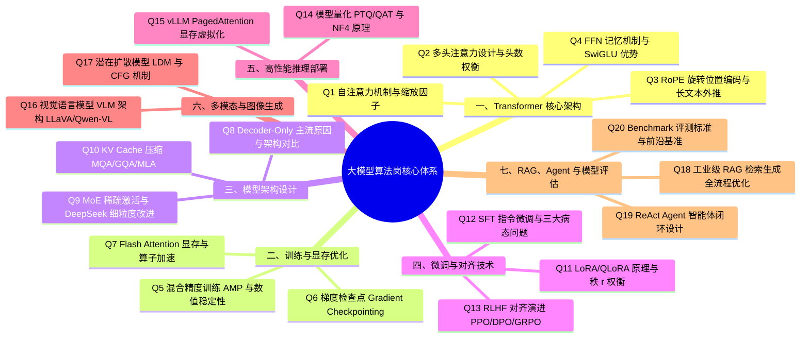
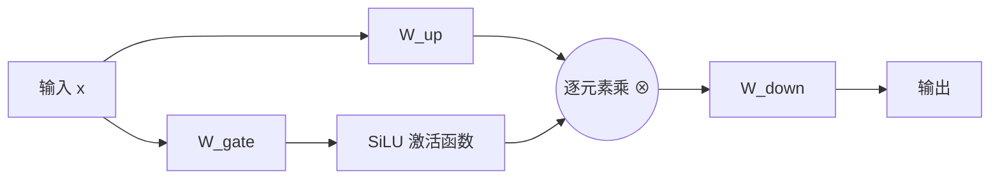
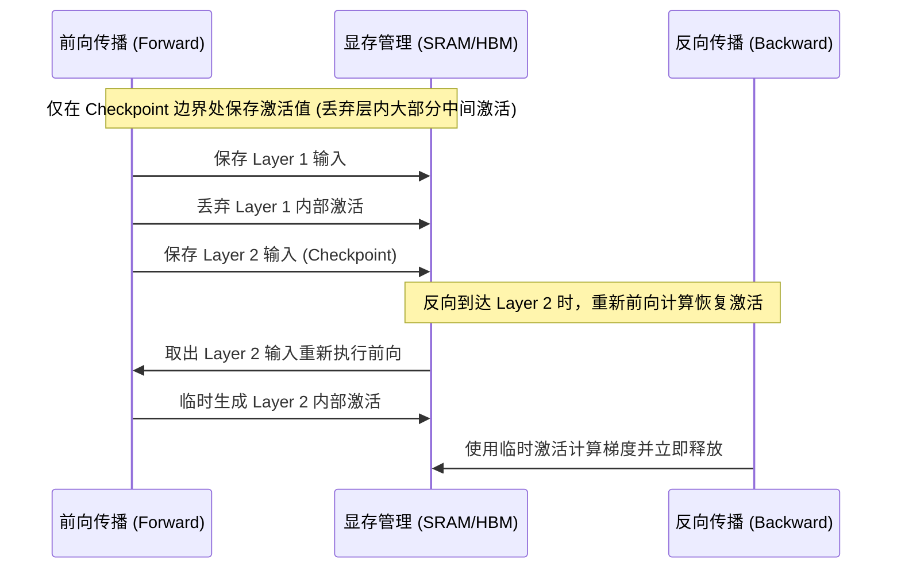
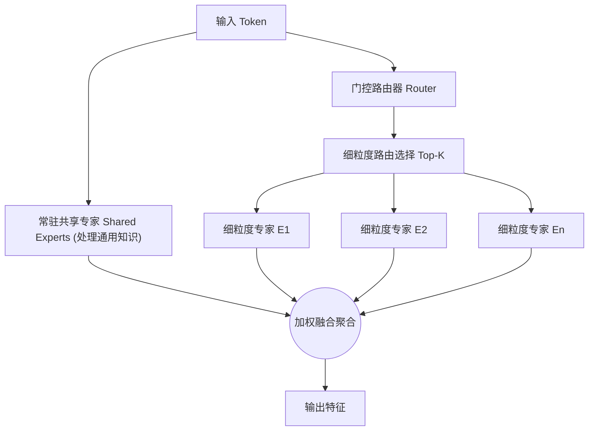
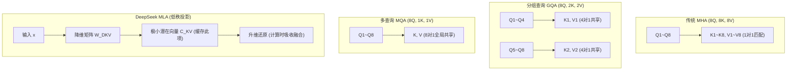
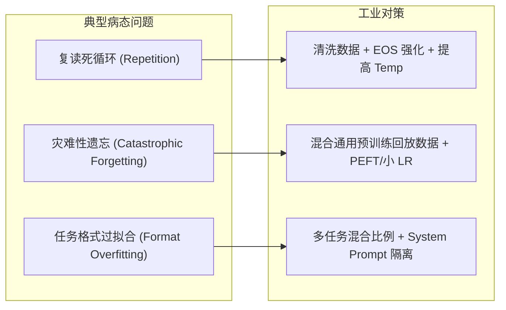
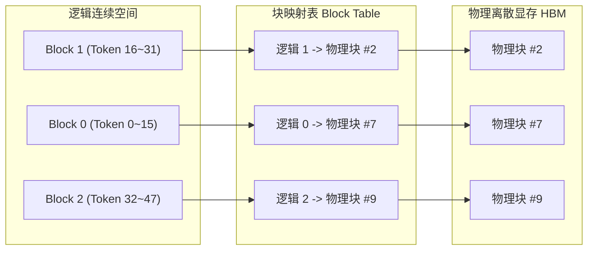
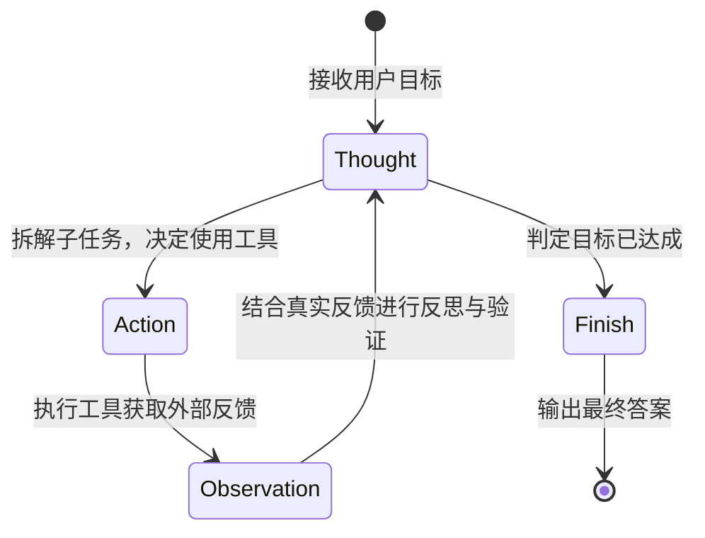

# 大模型算法岗高频核心面试题全景精讲 (LLM Algorithm Interview Deep Dive)

> **知识库定位**：工业界大模型算法岗（研发、训练、推理、多模态、Agent）核心八股与系统级原理深度沉淀。  
> **内容来源**：知乎高赞回答（985 计算机本硕、大模型论文作者与大厂算法岗经历深度总结）系统化整理与工程推导重构。  
> **核心架构**：全文分为 7 大模块，共 20 道最具区分度的深度面试真题，涵盖**基础数学推导**、**系统架构设计**、**工程 Trade-off 权衡**与**面试吟唱答题模板**。

---

## 知识全景地图 (Knowledge Navigation)




## 快速跳转索引 (Clickable Index Table)

| 模块 | 序号 | 题目与核心要点 | 锚点跳转 |
| :--- | :--- | :--- | :--- |
| **一、Transformer 核心架构** | **Q1** | 自注意力机制与除以 $\sqrt{d_k}$ 数学方差证明 | [👉 跳转 Q1](#q1) |
| | **Q2** | 多头注意力设计原理与头数权衡 | [👉 跳转 Q2](#q2) |
| | **Q3** | RoPE 旋转位置编码相对位置推导与长文本外推 | [👉 跳转 Q3](#q3) |
| | **Q4** | FFN 知识记忆机制与 SwiGLU 优势 | [👉 跳转 Q4](#q4) |
| **二、训练与显存优化** | **Q5** | 混合精度训练 AMP 与 Loss Scaling 状态机 | [👉 跳转 Q5](#q5) |
| | **Q6** | 梯度检查点 Gradient Checkpointing 时空权衡 | [👉 跳转 Q6](#q6) |
| | **Q7** | Flash Attention SRAM/HBM 存储与 Online Softmax | [👉 跳转 Q7](#q7) |
| **三、模型架构设计** | **Q8** | Decoder-Only 主流原因与三种架构对比 | [👉 跳转 Q8](#q8) |
| | **Q9** | MoE 稀疏激活与 DeepSeek 细粒度专家/共享专家 | [👉 跳转 Q9](#q9) |
| | **Q10** | KV Cache 压缩 MQA / GQA / DeepSeek MLA 矩阵吸收 | [👉 跳转 Q10](#q10) |
| **四、微调与对齐技术** | **Q11** | LoRA 内在低秩假设与 QLoRA 4-bit NF4 量化 | [👉 跳转 Q11](#q11) |
| | **Q12** | SFT 机制与复读/遗忘/任务过拟合三病态对策 | [👉 跳转 Q12](#q12) |
| | **Q13** | RLHF 对齐演进：PPO、DPO 与 GRPO 优势归一化 | [👉 跳转 Q13](#q13) |
| **五、高性能推理部署** | **Q14** | 模型量化对称/非对称与 NF4 信息论分位数最优 | [👉 跳转 Q14](#q14) |
| | **Q15** | vLLM PagedAttention 显存虚拟分页与 Shared Block | [👉 跳转 Q15](#q15) |
| **六、多模态与生成** | **Q16** | 视觉语言模型 VLM 三范式与 LLaVA / Qwen-VL 架构 | [👉 跳转 Q16](#q16) |
| | **Q17** | 潜在扩散模型 LDM 潜空间压缩与 CFG 引导机制 | [👉 跳转 Q17](#q17) |
| **七、RAG / Agent / 评估** | **Q18** | 工业级 RAG 检索生成全流程优化（父子切分/RRF/Cross-Encoder） | [👉 跳转 Q18](#q18) |
| | **Q19** | ReAct Agent 智能体闭环（Thought-Act-Observation）与安全沙箱 | [👉 跳转 Q19](#q19) |
| | **Q20** | 大模型评估五大原则、主流 Benchmark 维度与 SWE-bench 演进 | [👉 跳转 Q20](#q20) |

---

# 一、Transformer 核心架构

<a id="q1"></a>
## Q1：自注意力机制的工作原理是什么？为什么需要在计算中进行缩放（除以 $\sqrt{d_k}$）？

### 1. 核心机理与数学推导
自注意力机制（Self-Attention）的核心思想是打破传统 RNN 的时序递归依赖，允许序列中的每一个 token 直接与所有其他 token 建立点对点的全局上下文关联。

#### 标准计算流程：
1. **线性映射**：输入序列矩阵 $X \in \mathbb{R}^{n \times d_{\text{model}}}$ 分别与三个可学习投影矩阵 $W_Q, W_K, W_V \in \mathbb{R}^{d_{\text{model}} \times d_k}$ 相乘，生成查询矩阵 $Q$、键矩阵 $K$、值矩阵 $V$：
   $$Q = X W_Q, \quad K = X W_K, \quad V = X W_V$$
2. **点积相似度计算**：计算 $Q$ 与 $K^T$ 的点积，得到未经归一化的注意力得分矩阵 $S \in \mathbb{R}^{n \times n}$：
   $$S = Q K^T$$
3. **尺度缩放与概率归一化**：将得分矩阵除以缩放因子 $\sqrt{d_k}$，并通过 Softmax 函数沿列方向归一化为注意力权重矩阵 $A$：
   $$A = \text{softmax}\left(\frac{Q K^T}{\sqrt{d_k}}\right)$$
4. **加权聚合输出**：利用注意力权重对 $V$ 进行加权求和，得到最终的表征输出 $Z \in \mathbb{R}^{n \times d_k}$：
   $$Z = A V = \text{softmax}\left(\frac{Q K^T}{\sqrt{d_k}}\right) V$$

### 2. 为什么必须除以 $\sqrt{d_k}$？（数学深度证明）
核心原因：**防止 Softmax 进入饱和区，避免反向传播时发生严重的梯度消失。**

#### 严格数学推导：
假设查询向量 $q \in \mathbb{R}^{d_k}$ 和键向量 $k \in \mathbb{R}^{d_k}$ 的各分量 $q_i, k_i$ 是相互独立同分布（i.i.d.）的随机变量，且满足均值为 0、方差为 1：
$$\mathbb{E}[q_i] = 0, \quad \text{Var}(q_i) = 1; \quad \mathbb{E}[k_i] = 0, \quad \text{Var}(k_i) = 1$$
两者点积 $q \cdot k = \sum_{i=1}^{d_k} q_i k_i$ 的期望与方差为：
$$\mathbb{E}[q \cdot k] = \sum_{i=1}^{d_k} \mathbb{E}[q_i k_i] = \sum_{i=1}^{d_k} \mathbb{E}[q_i] \mathbb{E}[k_i] = 0$$
$$\text{Var}(q \cdot k) = \sum_{i=1}^{d_k} \text{Var}(q_i k_i) = \sum_{i=1}^{d_k} \left( \mathbb{E}[q_i^2 k_i^2] - (\mathbb{E}[q_i k_i])^2 \right) = \sum_{i=1}^{d_k} \left(\text{Var}(q_i) \text{Var}(k_i)\right) = d_k \times (1 \times 1) = d_k$$
因此，点积的标准差为 $\sigma = \sqrt{d_k}$。

- **当 $d_k$ 较大时**（现代大模型通常 $d_k = 64$ 或 $128$），点积的绝对值会随着维度的增大而显著膨胀（方差达到数十甚至上百）。
- **Softmax 饱和效应**：Softmax 函数形式为 $\text{softmax}(z)_i = \frac{e^{z_i}}{\sum_j e^{z_j}}$。当输入的极差过大时，输出概率分布会退化为接近 One-Hot 独热分布（最大值接近 1，其余接近 0）。
- **梯度消失**：Softmax 对于输入 $z_i$ 的导数为：
  $$\frac{\partial \text{softmax}(z)_i}{\partial z_j} = \text{softmax}(z)_i (\delta_{ij} - \text{softmax}(z)_j)$$
  当 $\text{softmax}(z)_i \approx 1$ 或 $\approx 0$ 时，导数乘积项趋近于 0，导致反向传播梯度瞬间弥散，模型无法更新。
- **缩放效果**：除以 $\sqrt{d_k}$ 将点积的方差强行标准化为 1，将输入控制在 Softmax 的平缓敏感梯度区，确保训练稳定。

### 3. 复杂度剖析
- **时间复杂度**：$\mathcal{O}(n^2 d)$（$Q K^T$ 矩阵乘法需要 $n \times n \times d$ 次运算）。
- **空间复杂度**：$\mathcal{O}(n^2)$（需要物化 $n \times n$ 的注意力矩阵）。这也是自注意力难以直接处理超长序列的根本瓶颈。

---

<a id="q2"></a>
## Q2：多头注意力机制的设计原理是什么？为什么多头比单头更好？头数是否越多越好？

### 1. 架构设计原理
多头注意力（Multi-Head Attention, MHA）的核心思想是将高维隐藏空间切分为多个低维子空间，并在各个子空间内**并行、独立**地计算注意力，最后拼接各头表征。

1. **子空间划分**：若模型总隐藏维度为 $d_{\text{model}}$，头数为 $h$，则单头维度 $d_k = d_{\text{model}} / h$。
2. **独立变换**：第 $i$ 个头分别用独立的参数矩阵投影：
   $$\text{head}_i = \text{Attention}(X W_i^Q, X W_i^K, X W_i^V)$$
   其中 $W_i^Q, W_i^K \in \mathbb{R}^{d_{\text{model}} \times d_k}, W_i^V \in \mathbb{R}^{d_{\text{model}} \times d_v}$。
3. **输出融合**：将所有头的输出在特征维度上拼接（Concat），并通过输出矩阵 $W^O \in \mathbb{R}^{h d_v \times d_{\text{model}}}$ 融合：
   $$\text{MHA}(Q, K, V) = \text{Concat}(\text{head}_1, \dots, \text{head}_h) W^O$$

### 2. 为什么多头优于单头？
- **多子空间表征增强（Ensemble 效应）**：单头注意力计算出的权重矩阵在 Softmax 后，通常只能聚焦于句子中最突出的单一模式（例如语法依赖）；多头机制让模型同时在不同表征子空间中关注不同类型的信息：
  - 头 1 捕获**句法结构**（如动宾搭配、主谓关系）；
  - 头 2 捕获**长程语义指代**（如代词“它”指代前文的“机器”）；
  - 头 3 捕获**局部邻近上下文**（类似 N-gram 特征）。
- **防止单点过拟合与平均化**：多头独立计算降低了单个注意力过度分散导致的“信息被平均抹平”风险。

### 3. 头数是否越多越好？（边界与 Trade-off）
结论：**不是，头数与单头维度存在临界收益与过拟合陷阱。**
- **单头维度过小的退化**：若保持 $d_{\text{model}}$ 固定，头数 $h$ 越多，则单头维度 $d_k = d_{\text{model}} / h$ 越小。当 $d_k < 32$ 时，单个子空间的表达容量严重不足，无法准确计算语义相似度。
- **表征模式冗余（Head Redundancy）**：学术界与大厂研究（如 Michel et al.《Are Sixteen Heads Really Better than One?》）表明，经过充分训练后，多头注意力中大量 Head 的权重模式高度相似，甚至剪枝掉 30%~50% 的头也不会影响模型推理性能。
- **工程实现开销**：在张量运算中，增加头数意味着在 Batch 和 SeqLen 之外引入更大的 Head 维度，增加 GPU 内存转置和调度开销。

> [!TIP]
> **大厂工程实践**：现代大模型（LLaMA, Qwen 等）通常将单头维度固定在 $d_k = 128$（匹配 Tensor Core 的矩阵切分对齐效率），头数 $h$ 随模型整体参数量（如 7B 用 32 头，70B 用 64 头）线性调整。

---

<a id="q3"></a>
## Q3：RoPE 旋转位置编码的原理是什么？它如何实现相对位置编码？外推问题有哪些解决方案？

### 1. 为什么需要位置编码？
自注意力矩阵乘法是**置换不变性（Permutation Invariant）**的：若将输入序列任意打乱，只要不对输入加位置信息，每个 token 算出来的注意力分布完全不变。因此必须显式引入位置信息。

### 2. RoPE 的核心机理与数学推导
RoPE（Rotary Position Embedding）是由苏剑林提出的位置编码方案，通过**绝对位置编码的方式实现了相对位置编码的效果**。

#### 二维复数平面旋转：
对于位置 $m$ 处的二维向量 $x = (x_1, x_2)^T$，将其视为复数 $z = x_1 + i x_2$。对其施加逆时针旋转角度 $m\theta$：
$$R_{\theta, m} x = \begin{pmatrix} \cos m\theta & -\sin m\theta \\ \sin m\theta & \cos m\theta \end{pmatrix} \begin{pmatrix} x_1 \\ x_2 \end{pmatrix}$$
利用欧拉公式，其等价于复数乘法：$z \cdot e^{i m \theta}$。

#### 高维向量分块旋转：
对于 $d$ 维向量，将其两两分组为 $d/2$ 个二维子空间，为每个子空间赋予递减的基础旋转频率 $\theta_i = b^{-2(i-1)/d}$（通常底数 $b = 10000$）：
$$R_{\Theta, m}^d = \text{diag}\left( R_{\theta_1, m}, R_{\theta_2, m}, \dots, R_{\theta_{d/2}, m} \right)$$
对 Query 和 Key 分别在各自的位置 $m, n$ 施加正交旋转矩阵：
$$\tilde{q}_m = R_{\Theta, m}^d q_m, \quad \tilde{k}_n = R_{\Theta, n}^d k_n$$

#### 为什么天然具备相对位置感知？
计算旋转后向量的内积：
$$\langle \tilde{q}_m, \tilde{k}_n \rangle = (R_{\Theta, m}^d q_m)^T (R_{\Theta, n}^d k_n) = q_m^T (R_{\Theta, m}^d)^T R_{\Theta, n}^d k_n$$
由于旋转矩阵是正交矩阵，满足 $(R_{\Theta, m})^T = R_{\Theta, -m}$，且旋转变换满足可加性：
$$(R_{\Theta, m}^d)^T R_{\Theta, n}^d = R_{\Theta, -m}^d R_{\Theta, n}^d = R_{\Theta, n-m}^d$$
最终内积化简为：
$$\langle \tilde{q}_m, \tilde{k}_n \rangle = q_m^T R_{\Theta, n-m}^d k_n = g(q_m, k_n, m-n)$$
**结论**：注意力打分**只与相对距离 $m - n$ 相关**，完美实现相对位置编码！

### 3. RoPE 长文本外推困境与四大演进方案
当推理文本长度超过预训练的最大上下文时，RoPE 的旋转角度 $m\theta$ 超出了训练见过的区间 $[0, L_{\text{train}} \theta]$，导致模型困惑度（PPL）骤增（崩盘）。

| 外推方案 | 核心思想 | 优势与局限 |
| :--- | :--- | :--- |
| **位置插值 (Position Interpolation, PI)** | 将长序列位置线性缩放回训练窗口：$m' = m \times \frac{L_{\text{train}}}{L_{\text{target}}}$。 | 简单有效；但高频维度被压缩过密，严重损失近距离局部精细特征。 |
| **NTK-Aware 插值** | 基于神经正切核理论，不对所有频率均匀压缩：**高频维度不插值（外推保持局部精度），低频维度大幅插值（拓展全局范围）**。 | 无需额外微调即可外推 2~4 倍；长程距离仍有轻微衰减。 |
| **NTK-by-parts** | 依据每个维度的波长与训练上下文长度对比，将维度严格划分为：高频（纯外推）、低频（纯插值）、中间频（混合过渡）。 | 业界广泛采用（如 CodeLlama），外推平滑度大幅提高。 |
| **YaRN (Yet another RoPE extensioN)** | 在 NTK-by-parts 基础上引入**注意力温度调整因子 $t$**，修正因插值导致的 Softmax 熵分布过锐化问题。 | 极低微调步数下实现 32k $\to$ 128k 甚至更长上下文扩展。 |

---

<a id="q4"></a>
## Q4：Transformer 中 FFN 前馈神经网络的作用是什么？SwiGLU 相比传统 ReLU 有哪些优势？

### 1. FFN 在 Transformer 中的定位与作用
每个 Transformer 块由 MHA 和 FFN 组成。在计算与存储占比上，**FFN 占据了模型总参数量与计算量的约 $\frac{2}{3}$**。
- **MHA 负责“聚合信息”**：在序列的时间维度（Token 间）流动信息，本身不改变特征的语义空间容量。
- **FFN 负责“加工与存储知识”**：在特征维度（Channel 维）执行升维和非线性变换。Geva 等人的研究表明：**FFN 本质上扮演了“键值记忆库（Key-Value Memory）”的角色**，第一层线性映射匹配输入模式（Key），第二层线性映射提取对应的世界事实知识（Value）。这也是为什么 MoE（混合专家模型）只切分 FFN 而保留 Attention 的原因。

### 2. SwiGLU 的数学表达
传统 FFN 通常是两层线性层包裹 ReLU/GELU：
$$\text{FFN}_{\text{ReLU}}(x) = \max(0, x W_1 + b_1) W_2 + b_2$$
SwiGLU 引入门控线性单元（Gated Linear Unit, GLU）与 Swish（SiLU）激活函数：
$$\text{SiLU}(x) = x \cdot \sigma(x) = \frac{x}{1 + e^{-x}}$$
$$\text{SwiGLU}(x) = \left( \text{SiLU}(x W_{\text{gate}}) \otimes (x W_{\text{up}}) \right) W_{\text{down}}$$
其中 $\otimes$ 为逐元素点乘（Hadamard 积）。整体结构包含三组权重矩阵：$W_{\text{gate}}$（门控）、$W_{\text{up}}$（信息通道）、$W_{\text{down}}$（输出降维）。

### 3. SwiGLU 相比传统 ReLU 的三大优势



1. **平滑性与梯度连续（处处可导）**：
   - ReLU 在 $x < 0$ 时导数严格为 0，反向传播时极易引发**神经元坏死（Dying ReLU）**，导致部分参数永久失效。
   - SiLU 在负数区保留了轻微的负斜率且平滑过渡（处处可微），即使输入负值也能保留微小梯度，保障反向传播平稳。
2. **动态输入自适应门控（Dynamic Gating）**：
   - 传统激活函数是静态非线性映射；而 SwiGLU 通过 $\text{SiLU}(x W_{\text{gate}})$ 生成动态的软门控掩码，逐元素控制 $x W_{\text{up}}$ 信息流的导通程度（0 表示抑制，1 表示放行）。
   - 网络根据输入语义自适应决定激活哪些特征，极大地提升了模型的非线性表达容量。
3. **经验验证的最强收敛性能**：
   - Noam Shazeer 的消融实验表明，SwiGLU 在语言建模任务中的验证集 Loss 显著优于 ReLU、GELU、Swish，成为 LLaMA 系列、Qwen、DeepSeek 等顶级开源大模型的标准配置。

---

# 二、训练优化技术

<a id="q5"></a>
## Q5：混合精度训练（AMP）的原理是什么？如何解决 FP16 带来的数值稳定性问题？

### 1. 浮点数据类型精度对比
大模型训练面临显存容量与显存带宽的双重压制，混合精度（Automatic Mixed Precision, AMP）通过在不同阶段混用不同精度实现降本增效。

| 数据类型 | 总位宽 | 符号位 | 指数位 (Exponent) | 尾数位 (Mantissa) | 动态范围 | 精度表现 |
| :--- | :--- | :--- | :--- | :--- | :--- | :--- |
| **FP32** | 32 bit | 1 | 8 | 23 | $10^{-38} \sim 10^{38}$ | 基准标准精度 |
| **FP16** | 16 bit | 1 | 5 | 10 | $10^{-5} \sim 65504$ | 易下溢/上溢 |
| **BF16** | 16 bit | 1 | 8 | 7 | $10^{-38} \sim 10^{38}$ | 动态范围等同 FP32，不易下溢 |

### 2. AMP 核心三部曲机制
1. **低精度前向与反向计算**：在矩阵乘法等算力密集型算子中使用 FP16 执行，激活现代 GPU（如 A100/H100）的 Tensor Core 硬件乘加加速，计算吞吐翻倍，中间激活值显存占用直接减半。
2. **维护 FP32 主权重副本（Master Weights）**：反向传播计算出的梯度也是 FP16，如果直接用极小的梯度更新 FP16 权重，由于权重加上微小梯度后超出尾数表示精度，会产生**下溢舍入为 0**（权重根本没更新）。因此优化器内部维护一份 FP32 的权重副本，将 FP16 梯度转为 FP32 后更新主权重，下一次迭代再将主权重转换为 FP16 参与前向传播。
3. **动态损失缩放（Dynamic Loss Scaling）**：解决梯度下溢的关键利器。

### 3. 数值下溢机理与动态 Loss Scaling
- **问题本质**：大模型反向传播中的梯度大部分集中在 $10^{-8} \sim 10^{-4}$ 之间，而 FP16 的最小正数仅为 $2^{-14} \approx 6.1 \times 10^{-5}$。大量细微梯度在转换为 FP16 时直接被截断为 0，导致反向传播失效。
- **Loss Scaling 运作逻辑**：
  1. 在反向传播计算梯度前，将 Loss 乘上一个放大系数 $S$（例如 $S = 2^{16} = 65536$）：
     $$L_{\text{scaled}} = L \times S$$
  2. 根据链式法则，所有反向传播的梯度都被线性放大了 $S$ 倍，将其推入 FP16 的有效表示区间内；
  3. 在优化器更新前，将梯度除以 $S$ 缩回真实尺度：
     $$g_{\text{true}} = \frac{g_{\text{scaled}}}{S}$$
  4. **动态调节状态机**：若某一步检测到梯度存在 `Inf` 或 `NaN`（说明发生上溢），则丢弃本次梯度更新，并将缩放系数减半（$S = S / 2$）；若连续 $N$ 步未发生溢出，则尝试增大缩放系数（$S = S \times 2$）。

---

<a id="q6"></a>
## Q6：梯度检查点（Gradient Checkpointing）的原理是什么？它是如何进行时间与空间的权衡的？

### 1. 显存瓶颈：激活值显存爆炸
在反向传播计算梯度时，根据链式法则需要使用前向传播时的中间激活值 $a_l$：
$$\frac{\partial L}{\partial W_l} = \frac{\partial L}{\partial z_l} a_{l-1}^T$$
常规训练中，前向传播必须把所有 Transformer 层的激活值全部驻留在显存中，直到反向传播对应层完成后才能释放。激活值显存占用公式为：
$$\text{Memory}_{\text{Activation}} \propto \mathcal{O}(b \cdot s \cdot L \cdot h)$$
（$b$ 为 Batch Size，$s$ 为序列长度，$L$ 为层数，$h$ 为隐藏维度）。在长上下文场景下，激活值显存甚至超过模型参数本身的显存占用。

### 2. 梯度检查点的工作原理
核心思想：**空间换时间（Trading Compute for Memory）**。



1. **选择性保存**：在前向传播阶段，只保存特定边界（如每个 Transformer 模块的输入）的激活值作为“检查点”，将其余中间激活值（如 Attention 内部、FFN 内部）直接丢弃。
2. **反向重算（Recompute）**：当反向传播计算到某一模块时，利用该模块之前保存的检查点激活值，重新执行一次局部的微型前向传播，临时恢复该模块所需的内部激活值。
3. **即时释放**：该模块梯度计算完毕后，立将恢复的临时激活从显存中彻底销毁。

### 3. 时空权衡（Trade-off）量化分析
- **显存节省**：若一个模型有 $L$ 层，每隔 $\sqrt{L}$ 层设置一个检查点，激活值显存占用将从 $\mathcal{O}(L)$ 大幅下降到 $\mathcal{O}(\sqrt{L})$。极端全量检查点模式下，仅保留输入，显存节省高达 60%~70%。
- **计算时间惩罚**：反向传播时需要重算前向，由于前向传播计算量约占总计算量的 $\frac{1}{3}$（反向约占 $\frac{2}{3}$），重新前向导致整体单步训练时间增加约 **30% ~ 33%**。

---

<a id="q7"></a>
## Q7：Flash Attention 是如何优化标准自注意力计算的？为什么它能同时节省显存并加速计算？

### 1. 硬件瓶颈诊断：Memory-Bound vs Compute-Bound
理解 Flash Attention 的革命性优化，必须先理解 GPU 的两级内存架构：
- **HBM（High Bandwidth Memory，高带宽显存）**：容量大（A100 为 80GB），但带宽相对有限（约 1.5~2.0 TB/s）。
- **SRAM（片上共享内存，Shared Memory）**：容量极小（每个 SM 仅约 100~200 KB），但带宽极高（约 19 TB/s，速度是 HBM 的 10 倍以上）。

**标准自注意力的死穴**：
标准 Attention 的计算需要频繁在 HBM 和 SRAM 之间搬运完整的 $N \times N$ 注意力得分矩阵。算子受限于显存读写带宽（Memory-Bound），GPU 的 Tensor Core 算力大部分时间在空转等待数据从 HBM 载入。

### 2. Flash Attention 的两大技术支柱

#### 支柱一：平铺分块计算（Tiling）
将 $Q, K, V$ 矩阵切分成能完整塞入片上 SRAM 的小 Block（如 $B_r \times d$ 和 $B_c \times d$）。在 SRAM 内部完成小块矩阵的乘法、Softmax 局部计算与加权累加，**完全避免将中间的 $N \times N$ 矩阵写回 HBM**。

#### 支柱二：在线 Softmax 增量更新算法（Online Softmax）
标准 Softmax 要求看到全局序列的所有元素计算分母最大值与求和：
$$m = \max(x_1, \dots, x_N), \quad d = \sum_{i=1}^N e^{x_i - m}$$
如果分块计算，每次只能看到局部块，如何保证全局数学等价？  
**递推修正公式**：假设当前块的最大值为 $m^{(1)}$，分母和为 $d^{(1)}$；当载入下一个块，其最大值为 $m^{(2)}$ 时：
1. 更新全局最大值：$m^{\text{new}} = \max(m^{(1)}, m^{(2)})$
2. 对历史的缩放分母进行修正并累加：
   $$d^{\text{new}} = d^{(1)} \cdot e^{m^{(1)} - m^{\text{new}}} + d^{(2)} \cdot e^{m^{(2)} - m^{\text{new}}}$$
3. 对已累计的局部输出 $O^{(1)}$ 进行尺度修正：
   $$O^{\text{new}} = O^{(1)} \cdot \left(\frac{d^{(1)} e^{m^{(1)} - m^{\text{new}}}}{d^{\text{new}}}\right) + O^{(2)} \cdot \left(\frac{e^{m^{(2)} - m^{\text{new}}}}{d^{\text{new}}}\right)$$
通过该递推式，Flash Attention 在 SRAM 中流式完成全局无损 Softmax。

### 3. 为什么既省显存又加速？
- **显存节省**：无需物化存储 $N \times N$ 的注意力矩阵（空间从 $\mathcal{O}(N^2)$ 骤降至 $\mathcal{O}(N)$）。在反向传播时，利用 SRAM 极快的计算速度直接**按块重新计算 Attention 矩阵**，以轻微的重算代价换取显存不爆。
- **算子加速**：将极其昂贵的 HBM 读写次数从 $\mathcal{O}(N^2)$ 降低到 $\mathcal{O}(N)$，把原本被显存带宽卡住的 IO-Bound 操作转变为计算密集的 Compute-Bound 操作，充分吃满 Tensor Core 算力，带来 2~4 倍的端到端真实训练/推理加速。

---

# 三、模型架构设计

<a id="q8"></a>
## Q8：为什么目前主流的 LLM 都采用 Decoder-Only 架构？与 Encoder-Only 和 Encoder-Decoder 架构相比有何优势和区别？

### 1. 三种基础架构横向对比

| 架构类型 | 注意力机制 | 典型代表 | 核心训练目标 | 优势场景 | 局限性 |
| :--- | :--- | :--- | :--- | :--- | :--- |
| **Encoder-Only** | 全双向自注意力 (Bidirectional) | BERT, RoBERTa | 掩码语言建模 (MLM) | 深度语义理解、分类、NER、特征抽取 | 无法自然进行开放式自回归长文本生成 |
| **Encoder-Decoder** | 编码器双向 + 解码器因果 + 交叉注意力 (Cross-Attn) | T5, BART | 序列到序列 (Seq2Seq), 跨跨度重构 | 强输入依赖的转换（翻译、摘要、纠错） | 结构复杂，多模块显存管理困难，ICL 能力偏弱 |
| **Decoder-Only** | 单向因果掩码注意力 (Causal Masked) | GPT 系列, LLaMA, Qwen | 自回归 Next Token Prediction | 开放式多轮对话、代码生成、复杂推理、通用多任务 | 双向特征理解在低参数量下理论上稍逊于 BERT |

### 2. Decoder-Only 统治大模型的三大底层原因
1. **零样本与少样本泛化（In-Context Learning, ICL）能力涌现**：
   - 理论与实验证明，自回归（Next Token Prediction）本质上是在逼近真实人类语言与知识的联合概率分布 $P(x_1, \dots, x_T) = \prod_{t=1}^T P(x_t | x_{<t})$。
   - 当模型规模（参数量和数据量）突破临界点后，Decoder-Only 展现出无与伦比的上下文学习能力（提示词示例诱导），而 Encoder-Decoder 在相同训练量下这种通用能力涌现相对平缓。
2. **训练-推理-服务体系的完美自洽性**：
   - 在训练时，通过因果下三角掩码（Causal Mask），一条包含 $N$ 个 token 的样本可以一次性计算所有 $N$ 个位置的 Next Token 损失（并行计算）；
   - 在推理时，每一步基于已生成的上下文预测下一个 token，计算模式与训练目标**完全同构**，不存在任何分布偏移（Distribution Shift）；
   - 服务架构统一（如 KV Cache、PagedAttention 等系统级优化只用服务于单一 Decoder 栈，不必处理编码器与解码器的状态同步）。
3. **扩展定律（Scaling Laws）的有效性与工程生态的路径依赖**：
   - OpenAI 从 GPT-1 到 GPT-4 一路验证了 Decoder-Only 在参数扩张下的稳健收益；开源生态（LLaMA 等）在此基础上的深耕积累形成了强大的飞轮效应。

---

<a id="q9"></a>
## Q9：MoE（混合专家模型）的架构原理是什么？DeepSeek MoE 做了哪些改进？

### 1. MoE 核心原理：稀疏激活（Sparse Activation）
MoE 旨在突破“模型性能受限于总计算量”的瓶颈。它将 Transformer 块中的单个庞大 FFN 替换为一组子网络（专家 $E_1, E_2, \dots, E_N$），并引入门控路由网络（Router $G$）。

#### 路由计算流程：
1. **路由打分**：输入向量 $x$ 经过路由器权重矩阵 $W_g$ 计算各专家的亲和度分数：
   $$H(x) = x \cdot W_g$$
2. **Top-K 稀疏选择**：选取打分最高的 $K$ 个专家（通常 $K=2$），并执行 Softmax 归一化权重：
   $$G(x) = \text{Softmax}(\text{TopK}(H(x), K))$$
3. **加权聚合输出**：
   $$y = \sum_{i \in \text{TopK}} G(x)_i E_i(x)$$
- **效果**：模型参数总量（总容量）可达数百亿甚至上千亿，但每个 token 激活的参数量仅为几十亿，保持与小型稠密模型相当的推理延迟。

### 2. 传统 MoE 的核心挑战：专家负载均衡
- **马太效应**：若缺乏干预，路由器会倾向于持续向少数几个专家分发 token，导致这几个专家过拟合，而其他专家处于“饥饿”未训练状态，退化为参数浪费。
- **解决方案**：在主损失函数中引入**负载均衡辅助损失（Auxiliary Load Balancing Loss）**：
  $$\mathcal{L}_{\text{balance}} = \alpha \cdot N \sum_{i=1}^N f_i \cdot P_i$$
  （其中 $f_i$ 是路由到专家 $i$ 的实际 token 比例，$P_i$ 是分配给专家 $i$ 的概率均值）。

### 3. DeepSeek MoE 的两大革命性创新



1. **细粒度专家分割（Fine-Grained Expert Segmentation）**：
   - **传统做法**：如 Mistral 8x7B，专家数量少（8 个），每个专家体积极大（单个专家就占数个 Billion 参数），激活 2 个。专家知识过于宽泛，难以实现极致的专业分工。
   - **DeepSeek 做法**：将原本的大专家切分为更小的微型专家（如切分 4 倍专家数），专家总数提升至 64 或 128 个以上，每次激活 8 个甚至更多。专家能专注于细粒度知识域（如专门处理 Python 语法树、逻辑反思等），大幅提升知识组合灵活性。
2. **常驻共享专家（Shared Experts Isolation）**：
   - **核心痛点**：大量通用知识（如代词语法、常用句式、基础连词）是所有 token 都必须调用的，在传统 MoE 中这些通用知识会冗余地复制到每个专家的权重中。
   - **创新设计**：隔离出固定数量的通用专家，**无论路由器判定结果如何，共享专家对所有 token 保持无条件 100% 激活**，路由专家则全神贯注处理特定领域的特异性知识。
   - 这一设计已成为当今 MoE（包括 DeepSeek-V2/V3、Qwen-MoE）的业界标准基石。

---

<a id="q10"></a>
## Q10：KV Cache 的优化方案 MQA、GQA 和 MLA 各自的原理是什么？它们之间如何对比权衡？

### 1. KV Cache 痛点与显存开销公式
自回归生成阶段（Decode），当前 Token 必须与前文所有 Token 交互。为避免重复前向计算，必须缓存先前各层的 Key 和 Value 向量。  
**单请求 KV Cache 显存占用量**：
$$\text{Memory}_{\text{KVCache}} = 2 \times L \times s \times h_{\text{KV}} \times d_k \times \text{BytesPerElement}$$
当并发量上升、序列长度 $s$ 达到数十万（长文本）时，KV Cache 会迅速吞噬几十 GB 显存，直接成为并发量和吞吐量的死锁瓶颈。

### 2. 三种演进方案的深度推导



- **MQA (Multi-Query Attention)**：
  - **机制**：保留多头 Query，但**所有注意力头强制共享同一组 Key 和 Value 投影**（$h_{\text{KV}} = 1$）。
  - **收益与代价**：KV Cache 直接暴降至原本的 $1/h$（节省 90%+）；代价是注意力多样性受到严重阉割，模型在长程依赖建模上精度下降明显。
- **GQA (Grouped-Query Attention)**：
  - **机制**：将 $h$ 个 Q 头均匀分为 $g$ 个组，组内头共享同一组 KV 投影（例如 32 个 Q 头配 8 个 KV 头，分组比 4:1）。
  - **收益与代价**：MHA 与 MQA 之间的黄金折中点。KV Cache 降至原本的 $g/h$（例如 8/32 = 1/4），但模型性能几乎完全无损逼近 MHA。已成为 LLaMA 2/3、Qwen 2/2.5 等的标配。
- **MLA (Multi-Head Latent Attention)**：
  - **DeepSeek 核心提出**：不再简单粗暴地裁剪头数，而是引入**低秩隐变量压缩（Low-Rank Compression）**。
  - **机制**：
    1. 通过下投影矩阵 $W_{DKV}$ 将 Key 和 Value 压缩到一个极小维度的隐空间向量 $c_t^{KV}$：
       $$c_t^{KV} = x_t W_{DKV}, \quad c_t^{KV} \in \mathbb{R}^{d_c} \quad (d_c \ll h \times d_k)$$
    2. **推理部署时，KV Cache 只需存储极小维度的 $c_t^{KV}$**；
    3. 在实际注意力计算时，利用矩阵乘法的结合律（矩阵吸收，Matrix Absorption），将上投影矩阵 $W_{UK}$ 直接与 Query 的投影权重融合，**完全无需在显存中把 $c_t^{KV}$ 显式反投影还原回巨大的 KV 矩阵**！
  - **收益**：KV Cache 显存占用比 GQA 进一步压缩数倍（逼近 MQA 甚至更低），而模型表征容量在 RoPE 解耦加持下甚至超越了标准 MHA。

#### 深度追问：MLA 的解耦 RoPE 向量是如何实现独立运算的？它是否承载语义？
1. **独立运算流水线与代数解耦**：
   - **双轨独立投影**：Key 拆分为 $k_s^C = c_s^{KV} W^{UK}$（不带 RoPE）与 $k_s^R = \operatorname{RoPE}(h_s W^{KR})$（专门独立投影，全头共享 64 维）；Query 端同理拆分为 $q_{t, i}^C$ 与 $q_{t, i}^R$。
   - **分块内积可加性**：$q^T k = (q^C)^T k^C + (q^R)^T k^R$。内容项不含旋转矩阵，满足乘法结合律，可在推理时将 $W^{UK}$ 吸收进 Query，从而免解压；RoPE 项仅需 64 维向量独立点积，算子图与显存彻底解耦。
2. **RoPE 向量必然承载语义特征（绝非纯时间戳）**：
   - **深层表征投影**：$k_s^R$ 由包含丰富上下文的隐状态 $h_s$ 经可学习矩阵 $W^{KR}$ 投影生成；
   - **内容自适应相对位置打分**：展开为 $(x_t^Q)^T \mathcal{R}_{s-t} x_s^K$，本质是根据当前词的语法语义（如动词找主语），自适应调节对不同相对距离的注意力响应；
   - **反证**：若不带语义（常数向量），点积退化为静态相对位置偏置（如 ALiBi），彻底丧失上下文动态调节能力。

#### 深度追问：MLA 的“矩阵吸收”到底是什么意思？推理时不还原，那什么时候才还原？
1. **什么是“矩阵吸收”**：
   - 公式推导：$q_{t, i}^C (k_{s, i}^C)^T = q_{t, i}^C (c_s^{KV} W_i^{UK})^T = [q_{t, i}^C (W_i^{UK})^T] (c_s^{KV})^T = \tilde{q}_{t, i}^C (c_s^{KV})^T$；
   - 原本作用在 Key 身上的上投影解压矩阵 $W_i^{UK}$，被矩阵乘法结合律直接乘到了当前的 Query 身上，生成 512 维的混合查询 $\tilde{q}$。
2. **推理 Decode 为什么完全不需要还原**：
   - **双线性内积数学等价**：$\langle q, W k \rangle = \langle W^T q, k \rangle$，结果 100% 精确一致，毫无信息损失；
   - **$O(1)$ 对抗 $O(S)$ 的算力/访存收益**：当前 Query 只有 1 个 Token，历史 Key 有 $S$ 个（如 32k/128k）。若还原 Key 需要计算 $S$ 次并占用海量带宽；若矩阵吸收只需计算 1 次 Query 变换，显存搬运量暴降 93%（Decode 是典型的 Memory-Bound 显存带宽受限）。
3. **什么时候才必须显式还原（Training & Prefill 阶段）**：
   - **全对称序列（$S \times S$）**：训练与 Prefill 是整段文本全量 Token 两两交互，不再具备 1 对 $S$ 的不对称收益；
   - **硬件 Tile 与 FlashAttention 兼容性**：训练期是 Compute-Bound（算力受限），显式还原为 128 头、$d_h=128$ 的标准多头张量，能够完美对齐 GPU SRAM 的 Tensor Core Tile，跑满 FlashAttention 硬件流水线；若在 512 维隐空间算 Attention 会引发严重的寄存器溢出（Register Spill）。

> [!NOTE]
> 详细数学矩阵推导与 RoPE 解耦方案可参阅本库核心文档：  
> [02_KV_Cache_Compression_MQA_GQA_MLA_and_Beyond.md](../03_Inference_and_Serving/02_KV_Cache_Compression_MQA_GQA_MLA_and_Beyond.md)

---

# 四、微调技术

<a id="q11"></a>
## Q11：LoRA 和 QLoRA 的原理是什么？LoRA 的秩 $r$ 如何影响表达能力与效率的权衡？

### 1. LoRA 的核心原理与数学形式
LoRA（Low-Rank Adaptation）建立在 Aghajanyan 等人的核心洞见之上：**预训练大模型的权重矩阵虽然处于极高维空间，但针对特定任务进行微调时，其参数更新量 $\Delta W$ 具有极低的“内在秩（Intrinsic Rank）”。**

#### 数学形式化：
冻结预训练权重矩阵 $W_0 \in \mathbb{R}^{d_{\text{out}} \times d_{\text{in}}}$，通过低秩分解构造可学习矩阵分支：
$$\Delta W = B \cdot A$$
其中 $B \in \mathbb{R}^{d_{\text{out}} \times r}, A \in \mathbb{R}^{r \times d_{\text{in}}}$，且秩 $r \ll \min(d_{\text{in}}, d_{\text{out}})$。
前向计算公式为：
$$h = W_0 x + \Delta W x = W_0 x + \frac{\alpha}{r} (B A x)$$
- **缩放因子 $\frac{\alpha}{r}$**：常数 $\alpha$ 用于固定 LoRA 的学习步长幅度，使得微调时调整秩 $r$ 时无需大幅修改学习率。
- **权重初始化策略**：
  - 矩阵 $A$ 采用高斯随机初始化（$\mathcal{N}(0, \sigma^2)$）；
  - 矩阵 $B$ 全零初始化（$B = 0$）。
  - **保证训练开始瞬间 $\Delta W = B A = 0$**，模型初始行为与基座完全一致，杜绝微调初期的行为震荡。
- **零额外推理延迟**：微调完成后，可直接执行矩阵相加合并：$W_{\text{merged}} = W_0 + \frac{\alpha}{r} B A$，推理时恢复标准单权重前向计算。

### 2. 秩 $r$ 的权衡哲学（Trade-off）
- **可训练参数量**：每个注入层的可训练参数为 $r \times (d_{\text{in}} + d_{\text{out}})$，随 $r$ 严格线性增长。
- **表达能力曲线**：
  - $r$ 较小时（如 $r=4 \sim 8$）：适用于常规的风格迁移、指令对齐、对话 SFT 等任务，强行约束低秩具有极强的正则化作用，能显著抑制过拟合。
  - $r$ 较大时（如 $r=32 \sim 64$ 或 128）：适用于逻辑推理、数学代码生成、专业领域知识注入等复杂任务。
  - 超过临界值（$r > 128$）时，边际收益递减，显存和优化难度显著增加。

### 3. QLoRA 的极限内存压缩四板斧
QLoRA 在 LoRA 基础上将单卡微调门槛拉入消费级显卡（如 24GB RTX 3090 微调 65B 模型）：
1. **NF4 数据类型（NormalFloat 4-bit）**：理论最优的信息论分位数无损量化，将基座冻结权重压缩为 4-bit。
2. **双重量化（Double Quantization, DQ）**：对量化基座权重的缩放因子（Scale）再次执行 FP8 量化，每参数进一步挤出 0.37 bit 显存。
3. **分页优化器（Paged Optimizers）**：利用 CUDA 统一内存机制，在训练遭遇激增峰值时自动将优化器状态在 GPU 显存与 CPU 内存间分页交换，防止 OOM 崩溃。
4. **计算过程动态反量化**：存储时是 4-bit，在 Tensor Core 计算前向时临时反量化为 BF16，计算完成后立即抛弃，仅将激活传递下去。

---

<a id="q12"></a>
## Q12：SFT（监督指令微调）的目的是什么？它与预训练的关系是什么？SFT 阶段会遇到哪些典型问题？

### 1. SFT 在工业训练链路中的定位
$$\text{海量无标注语料预训练 (Pretraining)} \xrightarrow{\text{世界知识+语言模型}} \text{SFT (指令理解+角色对齐)} \xrightarrow{\text{价值观+强化探索}} \text{RLHF/DPO} \to \text{落地交付}$$

- **预训练的目标**：自监督学习语言的语法、上下文关联及压缩海量世界通识知识（“Next Token Prediction 续写机器”）。
- **SFT 的目标**：赋予模型**对话协议意识（Chat Template）与指令遵循能力（Instruction Following）**。教会模型区分用户是“提问者”而自己是“助手”，明白什么时候应当给出完整回答、什么时候终止输出。

### 2. SFT 与预训练的技术联系与差异
- **损失函数一致性**：两者均采用交叉熵损失函数（Cross-Entropy Loss）。
- **掩码计算差异（Label Masking）**：预训练对整段文本所有 token 计算 Loss；**SFT 阶段通过掩码（Mask）仅对 Assistant 回复部分计算损失**，Prompt（System 与 User 输入）部分的 Loss 强制置 0，防止模型把宝贵的梯度浪费在去记忆用户问题的字词上。

### 3. SFT 阶段三大病态问题与工业解决方案



1. **复读死循环（Repetition）**：
   - **成因**：训练集中混入大量模板化重复垃圾数据；或者模型的结束符（`<|im_end|>`、`<eos>`）权重未学透，导致生成无法自主终止；推理时 Temperature 设为 0。
   - **对策**：严格清洗训练集的无意义自循环文本；提高 EOS Token 权重；推理端启用 `repetition_penalty` 或配置合理的 Sampling 参数。
2. **灾难性遗忘（Catastrophic Forgetting）**：
   - **成因**：在特定下游领域（如金融法律）全参数 SFT 后，模型原有的代码、数学等通用逻辑能力严重崩盘。
   - **对策**：在领域数据中按 10%~20% 比例混入高质量的**通用指令回放数据（Data Replay）**；调小全局学习率；采用 LoRA 等参数隔离微调。
3. **任务格式过拟合（Format Overfitting）**：
   - **成因**：如果微调数据单一（如 100% 都是 JSON 提取），模型会形成强病态归纳偏置，哪怕正常闲聊也会强制输出花括号。
   - **对策**：保持数据分布的多样性，构建多样化的 System Prompt，严禁单一格式垄断。

---

<a id="q13"></a>
## Q13：RLHF 中 PPO、DPO、GRPO 三种算法的核心原理是什么？它们的优劣势如何对比？

### 1. 为什么 SFT 之后还需要强化学习对齐？
- **SFT 存在“模仿天花板”**：SFT 是纯粹的有监督拟合，模型只能被动学习人工标注的样本。如果标注数据上限不高，模型永远无法超越人类标注员。
- **强化学习具备“策略探索空间”**：强化学习允许模型自主探索生成不同的回复候选，当遇到逻辑严密、表达优秀的回答时给予正向奖励，使模型在庞大的动作空间中学会**超越训练集质量上限**。

### 2. PPO、DPO、GRPO 三大对齐范式全景剖析

#### PPO (Proximal Policy Optimization)
- **四模型重型架构**：Actor（待训练策略）、Critic（价值估计模型）、Reference（冻结参考模型，提供 KL 散度约束）、Reward（打分奖励模型）。
- **机制**：通过 GAE（广义优势估计）对每个 token 计算优势函数，利用 Clip 限制策略更新幅度。
- **致命痛点**：显存开销极端恐怖（4 个大模型同时驻留显存）；强化学习在线 Rollout 采样慢；训练极度脆弱敏感，易遭遇 **Reward Hacking（钻奖励模型空子输出冗长无意义文本）**。

#### DPO (Direct Preference Optimization)
- **直接偏好优化**：Rafailov 等人通过对 Bradley-Terry 偏好模型的数学推导，证明了**奖励函数可以用策略模型与参考模型的隐式对数几率比（Log-ratio）解析表示**：
  $$r(x, y) = \beta \log \frac{\pi_\theta(y|x)}{\pi_{\text{ref}}(y|x)}$$
- **损失函数形式**：
  $$\mathcal{L}_{\text{DPO}}(\theta) = -\mathbb{E}_{(x, y_w, y_l)} \left[ \log \sigma \left( \beta \log \frac{\pi_\theta(y_w|x)}{\pi_{\text{ref}}(y_w|x)} - \beta \log \frac{\pi_\theta(y_l|x)}{\pi_{\text{ref}}(y_l|x)} \right) \right]$$
- **优势与局限**：无需训练独立的 Reward 和 Critic 模型，显存大砍，训练极其稳定如同 SFT。但其为**离线（Offline）优化**，无法在训练中与环境交互探索新策略，依赖高质量标注对比对。

#### GRPO (Group Relative Policy Optimization)
- **DeepSeek 核心突破（用于 DeepSeekMath 与 R1-Zero）**：**彻底干掉 Critic 价值模型！**
- **计算逻辑**：
  1. 对于每个输入 Prompt $q$，Actor 模型并行采样生成一组输出 $G = \{o_1, o_2, \dots, o_G\}$；
  2. 利用规则评分器（如代码用例通过率、数学最终答案匹配）或轻量 Reward 模型对组内每个回答打分 $r_i$；
  3. **组内标准化计算优势函数**（组内均值作为基准 Baseline）：
     $$\hat{A}_i = \frac{r_i - \text{mean}(\{r_j\})}{\text{std}(\{r_j\})}$$
  4. 使用该组内相对优势直接计算 PPO 风格的 Clip 策略梯度。

### 3. 三大算法横向横评对比表

| 对比维度 | PPO (OpenAI InstructGPT) | DPO (主流开源首选) | GRPO (DeepSeek-R1 标配) |
| :--- | :--- | :--- | :--- |
| **模型并发组件** | Actor + Critic + Ref + Reward (4 个) | Actor + Ref (2 个) | Actor + Ref (2 个，规则奖励下甚至只要 1 个) |
| **训练范式** | 在线强化学习 (Online RL) | 离线对比学习 (Offline Loss) | 在线组相对强化学习 (Online Group RL) |
| **优势估计器** | 依赖独立的 Critic 模型神经网络 | 无优势概念 | **组内样本相对统计量 (无需 Critic)** |
| **显存与计算消耗** | 极高（易 OOM） | 极低 | 中低（主要开销在并行生成候选输出） |
| **长程思考/推理潜力** | 中等 | 较差（无法自我探索 CoT） | **极强（驱动 DeepSeek-R1 涌现顿悟与长 CoT）** |

---

# 五、高性能推理部署

<a id="q14"></a>
## Q14：模型量化的原理是什么？对称量化与非对称量化有何区别？QLoRA 中的 NF4 为什么比标准 Int4 精度更高？

### 1. 模型量化的本质与工业动机
量化（Quantization）是将高精度连续浮点数（FP32/FP16/BF16）映射到低位宽离散整数（INT8/INT4/FP8）的过程。
- **工业动机**：
  1. **突破带宽墙（Memory Bandwidth Wall）**：Decode 阶段瓶颈在显存读取速度，4-bit 量化让数据搬运量缩减为原本的 $\frac{1}{4}$，吞吐直接翻数倍；
  2. **降低显存门槛**：70B 模型从原先需要 2 张 A100 (160GB) 压缩至 1 张消费级显卡可用；
  3. **整数算子加速**：利用 GPU DP4A / Tensor Core 的 INT 矩阵加速单元。

### 2. 对称量化 vs 非对称量化

```mermaid
graph TB
    subgraph 对称量化 (Symmetric)
        D1["原浮点区间 [-max|X|, max|X|]"] --> S1["零点 Zero-Point 严格对齐 0"]
        S1 --> Q1["量化区间 [-127, 127]"]
    end
    subgraph 非对称量化 (Asymmetric)
        D2["原浮点区间 [min(X), max(X)]"] --> S2["显式引入偏移 Zero-Point (Z)"]
        S2 --> Q2["量化区间 [0, 255]"]
    end
```

- **对称量化（Symmetric Quantization）**：
  - 缩放因子：$S = \frac{\max(|x_{\min}|, |x_{\max}|)}{2^{b-1} - 1}$
  - 映射公式：$q = \text{clamp}\left(\text{round}\left(\frac{x}{S}\right), -2^{b-1}+1, 2^{b-1}-1\right)$
  - 特点：Zero-Point 固定为 0。矩阵乘法非常干净高效，但若浮点数据分布严重偏向一侧（如 ReLU 输出非负），会导致一半的负数网格完全被浪费。
- **非对称量化（Asymmetric Quantization）**：
  - 缩放因子与零点：$S = \frac{x_{\max} - x_{\min}}{2^b - 1}, \quad Z = \text{round}\left(-\frac{x_{\min}}{S}\right)$
  - 映射公式：$q = \text{clamp}\left(\text{round}\left(\frac{x}{S}\right) + Z, 0, 2^b - 1\right)$
  - 特点：充分利用了全部整数区间，表达精度更高；但在矩阵相乘时会多出一项关于 $Z$ 的交叉偏移修正项，计算开销稍增。

### 3. NF4（NormalFloat 4-bit）为什么精度显著优于标准 Int4？
- **传统 INT4 的致命假设**：均匀量化假设输入数据在区间内是**均匀分布**的，各个分箱网格间距严格等距。
- **真实网络权重的统计规律**：深度神经网络经过预训练后，各层权重几乎严格遵循以 0 为均值的高斯正态分布 $\mathcal{N}(0, \sigma^2)$。中间（0 附近）极其稠密，两侧尾部极其稀疏。
- **NF4 的信息论最优解**：
  - 采用**分位数等面积量化（Quantile Quantization）**思想，16 个离散网格点（对应 4-bit 的 $2^4=16$ 种状态）不是等距划分的，而是通过标准正态分布的累计分布函数反函数（CDF Inverse）确定：每个区间所覆盖的概率积分严格相等！
  - **在权重密集的 0 附近布置极其稠密的刻度，在稀疏的尾端布置稀疏的刻度**。
  - 信息论证明：在固定 4-bit 下，NF4 保留的信息熵最大，量化误差（MSE）达到理论极限，使得基座模型在 4-bit 压缩下能力几乎不掉点。

---

<a id="q15"></a>
## Q15：vLLM 的 PageAttention 机制如何解决传统 KV Cache 管理的显存碎片问题？

### 1. 传统 KV Cache 管理的内部碎片与外部碎片痛点
传统推理系统（如 HuggingFace 原生实现）在请求进入时，为了连续存储 KV Cache，必须根据预设的最大序列长度（如 2048 或 4096）**一次性为每个请求预分配连续物理显存**。
- **内部碎片（Internal Fragmentation）**：一个请求可能只需要生成 50 个 token，但系统按 2048 预留了连续空间，超出的 97% 显存被无效占坑锁定。
- **外部碎片（External Fragmentation）**：请求随机开始与结束，显存被切割得千疮百孔，空闲显存块大小不一，由于无法凑出连续长块，导致后续新长请求因看似有显存却无法分配而 OOM。
- **结论**：传统方案显存浪费高达 **60% ~ 80%**，严重抑制并发 Batch Size。

### 2. PagedAttention 核心架构：虚拟内存分页哲学
PagedAttention（vLLM 核心技术）将操作系统中经典的**虚拟内存分页（Virtual Memory Paging）**机制降维移植到大模型显存管理中。



1. **固定大小 Block（物理页）**：将 KV Cache 切分为固定容量的 Block（例如一个 Block 存储 16 个 token 的 KV 向量）。
2. **逻辑连续，物理非连续**：同一个请求的上下文在逻辑上是连续的，但在 GPU 物理显存中可以分散落在任意不连续的空闲 Block 中。
3. **Block Table（页表映射）**：系统维护一个轻量映射表，记录每个请求已分配的逻辑 Block 到物理 Block 的指针映射。在 Attention 算子执行时，根据 Block Table 寻址拼接。
4. **按需动态申请**：Token 生成过程中，每写满 16 个 token 才动态从空闲池申请一个新的物理 Block，绝不多占。

### 3. PagedAttention 带来的两大降维打击优势
- **显存浪费压缩至 4% 以下**：彻底根除了外部碎片，仅在最后一个未填满的 Block 内存在微小内部碎片。
- **极致的 Copy-on-Write 内存共享（Shared Block）**：
  - 在并行采样（Parallel Sampling，如 1 个 Prompt 生成 5 个回答）、Beam Search 或多轮对话共享 System Prompt 场景下；
  - 多个分支只需在 Block Table 中指向**同一批物理 Prompt Block**，物理显存中仅存一份 Prompt KV！
  - 只有当某个分支后续生成不同 Token 时，才触发写时复制（Copy-on-Write）分配新块，系统吞吐量呈几何级暴增。

> [!NOTE]
> 详细工业 Serving 体系与连续批处理调度细节可参阅本库核心文档：  
> [01_LLM_Serving_Frameworks_Deep_Dive.md](file:///f:/LearningNotes/LLM_Serving/01_LLM_Serving_Frameworks_Deep_Dive.md)

---

# 六、多模态与生成

<a id="q16"></a>
## Q16：VLM（视觉语言模型）的主流架构设计模式有哪些？LLaVA 和 Qwen-VL 的架构有何异同？

### 1. 视觉语言模型（VLM）的三大主流范式
1. **双编码器（Dual-Encoder）**：
   - 代表：CLIP。图像与文本各自通过独立编码器，仅在最终向量层进行对比学习（InfoNCE）对齐。适合零样本分类、图文检索；但图文之间没有深层交互，无法进行复杂的细粒度多模态推理。
2. **融合编码器（Fusion-Encoder）**：
   - 代表：ViLT。图文 token 在极浅层拼接后送入庞大的 Transformer 进行全量双向交叉注意力。模态交互极度充分；但计算开销暴增，无法直接继承 LLM 强大的自回归推理能力。
3. **解码器桥接架构（Encoder-Projector-Decoder）**：
   - 代表：LLaVA, BLIP-2, Qwen-VL。**当今 VLM 的绝对统治性架构**。包含三个模块：冻结或微调的视觉编码器（ViT）、模态适配投影层（Projector）、自回归 LLM 骨干。

### 2. LLaVA 的极简主义架构与两阶段训练
- **架构构成**：
  - Vision Encoder：CLIP ViT-L/14（提取图像特征并打平为 Patch 向量）；
  - Projector：一个简单的**两层 MLP（非线性投影层）**，负责将视觉特征维度映射为与 LLM Embedding 一致的维度；
  - LLM Backbone：Vicuna / LLaMA。
- **两阶段训练精髓**：
  - **阶段 1：特征对齐预训练**。冻结 ViT 和 LLM，仅训练 MLP 投影层。使用海量简短图文对（Caption 数据），让视觉 Token 在语义上对齐 LLM 的文本词向量空间。
  - **阶段 2：指令微调（SFT）**。冻结 ViT（或解冻微调），联合训练 MLP 和 LLM。使用多轮视觉问答（VQA）、复杂推理和看图对话数据，赋予其多模态多轮交互能力。

### 3. Qwen-VL 的系统级工程演进
Qwen-VL 在 LLaVA 的基础上针对工业痛点进行了深层重构：
1. **动态分辨率自适应（Dynamic Resolution）**：LLaVA 强行将图像压缩或填充为固定尺寸（如 336×336），小图被插值模糊、长条图被畸变拉伸。Qwen-VL 引入动态切图与自适应 Token 编码，大图按原比例切为多个网格并辅以全局缩略图，小图用少量 token，完美保留细微文字与细节。
2. **窗口注意力（Window Attention）**：图像 token 数量动辄数千，全注意力计算代价太高。引入局部窗口自注意力，将复杂度从平方级拉低到线性级。
3. **DeepStack 多尺度残差融合（Qwen2.5/3-VL）**：LLaVA 仅提取 ViT 最后一层的特征，丢失了大量初级边缘、文字笔画等浅层信息。Qwen-VL 从 ViT 的浅、中、深多层提取特征，经过独立投影层后，以残差形式注入到 LLM 的不同深度层中，OCR 识别与细粒度目标检测能力大幅跃升。

---

<a id="q17"></a>
## Q17：Stable Diffusion 中的潜在扩散模型（LDM）原理是什么？无分类器引导（CFG）是如何工作的？

### 1. 为什么必须将扩散转移到“潜空间”（Latent Space）？
传统的像素级扩散模型（如 DDPM）直接在像素空间进行加噪和去噪迭代。一张 $512 \times 512 \times 3$ 的图像拥有高达 78 万个维度，去噪步数通常需要 50~100 步，在如此巨大的状态空间中反复迭代计算，单张图生成需要数分钟，硬件显存瞬间崩溃。

### 2. LDM（Latent Diffusion Model）的三大支柱
1. **VAE 空间感知压缩器**：
   - 编码器 $\mathcal{E}$ 将像素图像 $x \in \mathbb{R}^{H \times W \times 3}$ 下采样压缩为潜变量 $z = \mathcal{E}(x) \in \mathbb{R}^{h \times w \times c}$（下采样比通常为 8，潜变量尺寸为 $64 \times 64 \times 4$），**维度压缩近 48 倍，同时丢弃不可见的高频高斯感知冗余，仅保留语义本质**；
   - 解码器 $\mathcal{D}$ 负责在生成结束后将潜变量重新还原为高质量像素图像：$\tilde{x} = \mathcal{D}(z)$。
2. **带交叉注意力的 U-Net 噪声预测器**：
   - 核心任务：在时间步 $t$ 条件下，输入带噪潜变量 $z_t$，预测加入的高斯噪声 $\epsilon$。
   - 跨模态桥梁：U-Net 内部交替堆叠 ResNet 块与 Transformer 交叉注意力块（Cross-Attention）。**文本嵌入作为 Key 和 Value，图像潜特征作为 Query**，实现文字描述对图像生成轨迹的精细制导。
3. **Text Encoder（CLIP 文本编码器）**：将输入提示词转化为富含跨模态语义的特征向量序列 $\tau$。

### 3. 无分类器引导（Classifier-Free Guidance, CFG）的核心原理
早期的引导生成依赖独立的分类器梯度（Classifier Guidance），计算复杂且极难训练。CFG 通过纯算法层面的精妙构想，实现了无需分类器的强力条件控制。

#### CFG 机制推导：
- **训练阶段（Dropout 条件）**：在训练 U-Net 时，以固定概率（如 10%~20%）**随机将文本提示词替换为空文本 $\emptyset$**。这迫使单个网络同时学会两种模式：
  1. 条件预测：$\epsilon_\theta(z_t, t, c)$
  2. 无条件纯先验预测：$\epsilon_\theta(z_t, t, \emptyset)$
- **推理阶段（外推引导公式）**：在反向去噪采样时，对每个时间步分别计算有条件预测和无条件预测，并沿两者的差值方向进行外推：
  $$\epsilon_{\text{guided}} = \epsilon_\theta(z_t, t, \emptyset) + w \cdot \left( \epsilon_\theta(z_t, t, c) - \epsilon_\theta(z_t, t, \emptyset) \right)$$
  其中 $w \ge 1$ 为引导比例（Guidance Scale）：
  - 当 $w = 1$ 时，退化为普通条件生成；
  - 当 $w > 1$（常用 $w = 7.5$）时，差值项 $(\epsilon_{\text{cond}} - \epsilon_{\text{uncond}})$ 相当于**放大了文本条件相对于通用先验的偏好向量**，驱使生成结果极其严格地服从提示词，消除歧义和伪影。过大（如 $w > 15$）则会导致画面饱和度过度过曝。

---

# 七、RAG / Agent / 评估

<a id="q18"></a>
## Q18：RAG（检索增强生成）系统的完整流程是什么？在各个环节中有哪些关键优化策略？

### 1. 工业级 RAG 架构完整生命周期
RAG 彻底解耦了“世界事实知识”（动态外挂检索）与“语言推理能力”（参数化模型），分为离线知识库构建与在线检索生成两条主线。

```mermaid
flowchart TD
    subgraph 离线数据链路 (Offline)
        D["原始多格式文档"] --> C["智能切分 (Chunking)"]
        C --> E["Embedding 向量化 (BGE-M3)"]
        E --> VDB[("向量数据库 / 倒排索引库")]
    end
    subgraph 在线检索与生成 (Online)
        Q["用户 Query"] --> QP["Query 预处理 (HyDE / 改写)"]
        QP --> Ret["混合检索 (Dense 向量 + BM25 稀疏)"]
        VDB --> Ret
        Ret --> RRF["RRF 倒数排名融合"]
        RRF --> Rerank["Cross-Encoder 重排 (BGE-Reranker)"]
        Rerank --> Context["上下文拼装 (去重/防丢失)"]
        Context --> LLM["LLM 解码生成回答 (含引用追溯)"]
    end
```

### 2. 各关键环节的工业级落地优化策略

#### 1. 切分优化：父子块检索（Small-to-Big Retrieval）
- **痛点**：切片太小（如 100 字），虽然语义纯粹检索准，但送入 LLM 时上下文碎片化严重；切片太大（如 1000 字），包含无关杂质，向量相似度被稀释。
- **解法**：建立两级分块结构。检索时在向量库中只比对轻量的子切片（Child Chunk，如 128 Token）；一旦命中，通过元数据 ID 调出其对应的完整父级段落（Parent Chunk，如 1024 Token）送给 LLM，兼顾了精准检索与完整上下文。

#### 2. 检索优化：混合检索与 RRF 融合
- **双路召回**：稠密检索（Dense Retrieval，基于语义向量）擅长捕获意图同义词；稀疏检索（Sparse Retrieval，如 BM25）擅长捕获专业术语、零件型号、人名等精准关键词。
- **RRF（Reciprocal Rank Fusion，倒数排名融合）**：
  $$RRF(d) = \sum_{m \in \text{Methods}} \frac{1}{k + r_m(d)}$$
  （其中 $r_m(d)$ 为文档在第 $m$ 种检索方式中的名次，常数 $k=60$）。RRF 不依赖绝对相似度打分尺度，仅凭相对位次实现稳健无偏融合。

#### 3. 重排优化：Cross-Encoder 精排机制
- **Bi-Encoder（检索向量模型）**：将 Query 和 Document 分别独立编码，最后做点积，速度快（微秒级）但两者在浅层无交互，精度有限。
- **Cross-Encoder（重排模型，如 BGE-Reranker）**：将 `[CLS] Query [SEP] Document [SEP]` 整体输入 Transformer，图文两端每一个 token 与对方全量自注意力交互，全面识别逻辑蕴含与因果关联，大幅过滤检索虚假匹配。

#### 4. 生成优化：规避“迷失在中间”（Lost in the Middle）
- 理论证明：LLM 对 Prompt 开头与结尾处的信息感知最强，处于中部的检索片段极易被遗忘忽略。
- **重排策略**：将重排得分最高（最核心）的文档放置在上下文的最前与最后，次要文档置于中间。

---

<a id="q19"></a>
## Q19：ReAct Agent 框架的设计原理是什么？为什么需要「推理 + 行动」的循环模式？Agent 比纯 LLM 多出了什么？

### 1. Agent 与纯 LLM 的本质差异
- **纯 LLM（Passive Reasoner）**：是一个强大的离线大脑。具备逻辑推理和知识存储，但无法与物理世界交互，知识受限于训练截断期，容易滋生幻觉，宛如“缸中之脑”。
- **AI Agent（Active Controller）**：拥有“大脑（LLM 推理控制器）+ 感知（Perception）+ 规划（Planning）+ 记忆（Memory）+ 工具行动（Action）”的完备具身智能体系。

### 2. ReAct 框架的闭环运转机制
ReAct（Reasoning + Acting）由 Yao et al. 提出，打破了纯 CoT（仅推理无行动）和纯 Act（仅调工具无推理）的局限。其标准执行闭环：
$$\dots \to \text{Thought (思考)} \to \text{Action (调用工具)} \to \text{Observation (观察环境返回)} \to \text{Thought (反思纠错)} \to \dots \to \text{Finish}$$



- **Thought（推理）**：LLM 用自然语言分析当前状态：“我还缺少什么事实？我该调用哪个工具？参数应当是什么？上一次工具报错该如何挽救？”
- **Action（行动）**：以严格的结构化格式（如 Function Calling / JSON）向外部环境发起调用（查询 SQL、搜索网页、运行 Python 解释器）。
- **Observation（观察）**：系统拦截工具执行结果，作为新的 Prompt 注入上下文。
- **协同正反馈**：推理指导行动的方向（避免暴力穷举瞎猜工具）；行动为推理提供硬核的事实反馈（把推理锚定在真实现实中，从根源消除幻觉）。

### 3. Agent 工业落地系统构成与安全防御

| 模块 | 核心功能与工业实现 |
| :--- | :--- |
| **短期记忆 (Working Memory)** | 依赖当前上下文窗口（通过 Context Pruning、Sliding Window 保持状态）。 |
| **长期记忆 (Episodic Memory)** | 向量数据库（历史对话沉淀）+ 外部知识图谱 / SQL 数据库（事实性偏好）。 |
| **规划核心 (Planning)** | 任务拆解（Task Decomposition）、反思与纠错机制（Self-Reflect）。 |
| **工具层 (Tool Use)** | 标准 OpenAPI / MCP（Model Context Protocol）协议接入。 |
| **安全沙箱 (Sandboxing)** | **零信任原则**：Agent 运行环境必须与主机隔离（Docker 容器内运行）；高风险破坏性操作（转账、删除文件、发邮件）强制加入**人工在环确认（Human-in-the-Loop）**；系统级提示词注入防越狱防御。 |

---

<a id="q20"></a>
## Q20：大模型评估中，一个好的 Benchmark 应该具备哪些标准？目前主流的 Benchmark 分别评测模型的哪些维度？

### 1. 优秀评测基准（Benchmark）的五大黄金法则
1. **高区分度（Discriminative Power）**：不可过早饱和。随着模型能力爆发，老一代基准（如 GSM8K、MMLU）高分扎堆（95%+），无法体现 SOTA 模型的真正差异，必须不断进化（如 MMLU-Pro）。
2. **可复现性与鲁棒性（Reproducibility & Robustness）**：评测协议开源透明，评测结果不应因为 Prompt 的微小改动（如多一个换行符、Few-shot 顺序调换）而产生 10% 以上的剧烈跳变。
3. **低成本全自动判分（Automated Scalability）**：支持固定正则匹配、单元测试通过率（Pass@k）或标准 LLM-as-a-Judge 自动化计分，杜绝昂贵且周期长的人工肉眼评测。
4. **强防数据泄漏（Contamination-Free）**：基准题目不可被爬取并作为训练语料被模型“提前死记硬背”（数据污染）。动态盲测对战（LMSYS Arena）或加密新题成为趋势。
5. **与人类真实验收偏好强相关（Real-world Alignment）**：做题高分不等于好用，必须真实反映用户在实际场景下的体感（Useful & Harmless）。

### 2. 全球主流 Benchmark 维度分类与分水岭评测

| 评测维度 | 代表性 Benchmark | 评测内容与工业考量 | 区分度等级 |
| :--- | :--- | :--- | :--- |
| **通用学科知识** | **MMLU / MMLU-Pro** | 覆盖人文、理工、社科 57 个学科。MMLU-Pro 升级为十选一，极大限制瞎猜。 | 中等（各大模型卷分严重） |
| **博士级前沿知识** | **HLE (Humanity's Last Exam)** | 全球跨学科顶尖教授合力出的极难题，顶尖模型准确率当前不足 40%。 | **极高（绝对分水岭）** |
| **复杂逻辑与数学** | **GSM8K $\to$ MATH $\to$ GPQA** | GSM8K（小学应用题已饱和）；GPQA（研究生级生物、物理、化学推理，防 Google 搜索）。 | 高 |
| **真实软件工程代码**| **HumanEval $\to$ SWE-bench** | HumanEval（函数级语法送分题）；**SWE-bench（直接从真实 GitHub Repo 捞 Issue，要求自动跑通测试用例与改代码）**。 | **极高（工程师与刷题家的分水岭）** |
| **Agent 工具调用** | **tau-bench / MCP-Atlas** | 真实客服复杂多轮环境、多 MCP Server 300+ 工具动态编排调用。 | **极高（衡量工程落地能力）** |
| **多模态理解** | **MMMU / CharXiv** | 涵盖电路图、五线谱、学术论文图表抽取（考核 OCR 与多图表推理）。 | 高 |
| **众包盲测人类偏好**| **LMSYS Chatbot Arena** | 用户实时盲测提问，两模型匿名对决由用户打分，基于 Elo 积分系统动态排名。 | **最高（真实生态风向标）** |

### 3. 三大评估范式的演进趋势
- **范式 1：静态选择题正则匹配（Rule-Based）**：正在逐步被边缘化，无法评估发散性生成，且极易被预训练数据集“偷跑污染”。
- **范式 2：LLM 作为裁判（LLM-as-a-Judge）**：用 GPT-4 / Claude-3.5 评判待测模型回答，成本低速度快，但存在裁判偏见（Position Bias、Verbosity Bias 偏好长回答）。
- **范式 3：动态环境沙盒执行（Environment Execution）**：**终极趋势**。不再看模型“说了什么”，而是看代码在沙盒里**是否通过了单元测试（SWE-bench）**，Agent 是否**在数据库中真正完成了转账或改签任务（tau-bench）**。实战演练彻底碾压口头背题。

---

## 总结：大模型算法岗面试复习心法

1. **拒绝死记硬背，透析底层动机**：
   - 每一个大模型技术的诞生都是为了解决前一代的特定痛点（如：Attention 内存瓶颈催生 FlashAttention；KV Cache 吞噬显存催生 PagedAttention 与 MLA；PPO 训练脆弱催生 DPO 与 GRPO）。
2. **推导必须过手，参数烂熟于心**：
   - 面试中自注意力标准差 $\sqrt{d_k}$、RoPE 相对位置正交消除、LoRA 低秩分解与初始化、DPO 损失函数等，能随时在草稿纸或白板上默写推导。
3. **立足工业场景，重视工程权衡**：
   - 算法岗不是学术象牙塔，任何算法方案必须放在 **算力预算、显存限制、通信瓶颈、延迟要求（TTFT/TPOT）** 的工业坐标系中权衡选型。

