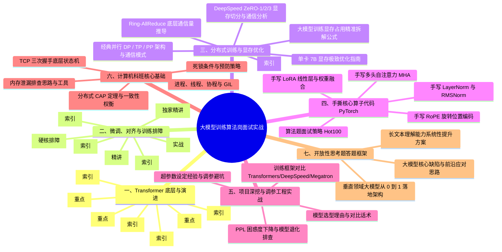
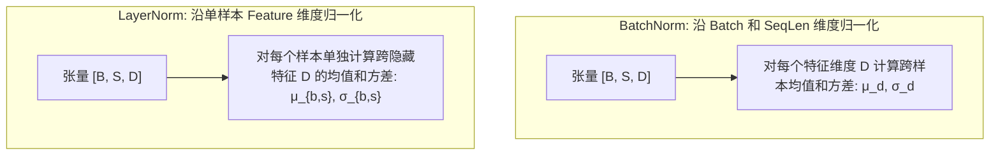
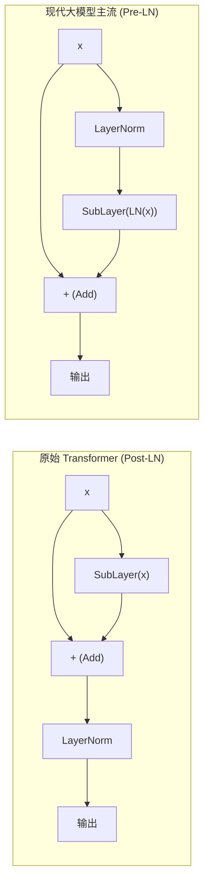
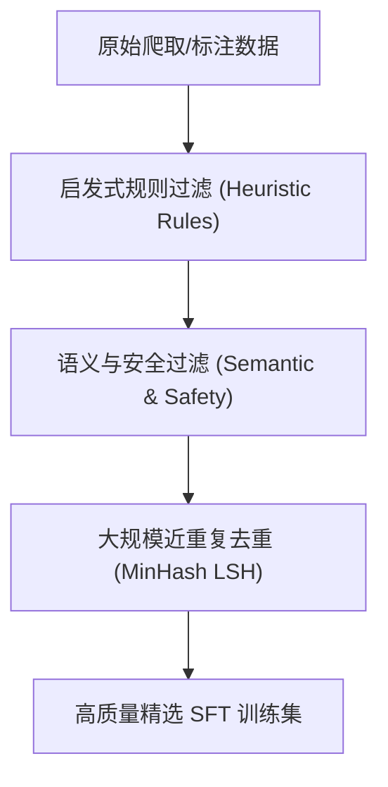
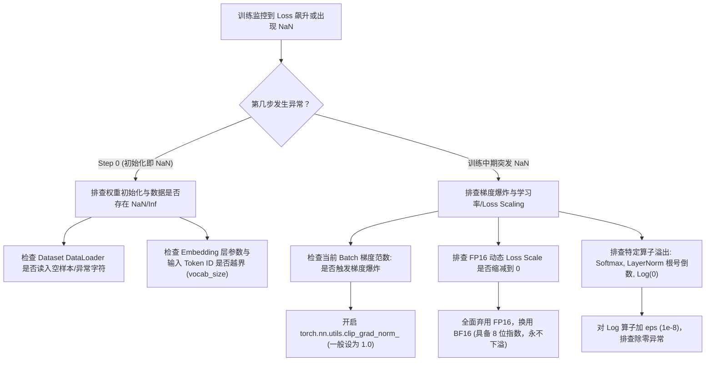
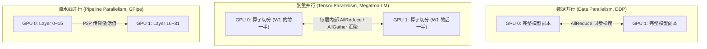
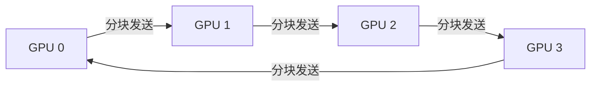
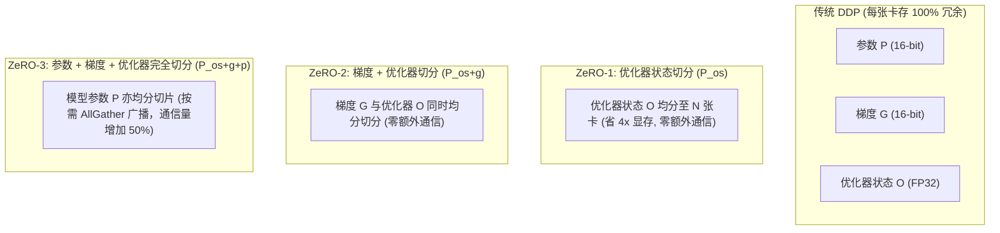

# 大模型训练算法岗高频面试题与手撕代码实战 (LLM Training Algorithm Interview & Hands-On)

> **知识库定位**：专攻**大模型训练 / 预训练算法岗**核心面试通关秘籍，覆盖模型底层推导、分布式并行通信（TP/PP/ZeRO）、训练异常排障（Loss NaN/发散）、核心算子手写 PyTorch 代码与项目深挖实战。  
> **内容来源**：知乎阿里算法工程师实战面经（中科院硕，冲刺大厂训练算法岗数十场高频核心真题复盘）系统化重构。  
> **去重原则**：凡与上一篇通用文档内容重复之考点（如 Attention 缩放因子、RoPE 相对位置抵消、Decoder-only 优势等），均直接设置精简索引跳转至前序文档，聚焦**训练岗专属重难点与手撕代码实战**。

---

## 模块导航与知识结构图




## 快速跳转索引与两篇文档交叉对照总表 (Interactive Navigation & Cross-Index)

| 模块 | 考题 / 核心技能点 | 内容定位 | 一键直达跳转 |
| :--- | :--- | :--- | :--- |
| **一、Transformer 底层机制** | 1. 手推自注意力机制公式与 $\sqrt{d_k}$ 缩放 | 索引至 03 通用篇 | [🔗 03 全景篇 Q1](./03_LLM_Algorithm_Interview_Core_20_Questions.md#q1) |
| | 2. 多头注意力核心意义与头数权衡 | 索引至 03 通用篇 | [🔗 03 全景篇 Q2](./03_LLM_Algorithm_Interview_Core_20_Questions.md#q2) |
| | 3. LayerNorm vs BatchNorm 与 RMSNorm 演进 | **本文独家重点精讲** | [👉 跳转本文 §1.3](#t1_3) |
| | 4. RoPE 旋转位置编码相对位置推导与外推 | 索引至 03 通用篇 | [🔗 03 全景篇 Q3](./03_LLM_Algorithm_Interview_Core_20_Questions.md#q3) |
| | 5. Decoder-only 架构主流原因与架构对比 | 索引至 03 通用篇 | [🔗 03 全景篇 Q8](./03_LLM_Algorithm_Interview_Core_20_Questions.md#q8) |
| | 6. 残差连接数学推导与 Pre-LN/Post-LN 对比 | **本文独家重点精讲** | [👉 跳转本文 §1.6](#t1_6) |
| | 7. 激活函数演进：ReLU $\to$ GELU $\to$ SwiGLU | **本文独家重点精讲** | [👉 跳转本文 §1.7](#t1_7) |
| **二、微调、对齐与排障** | 1. 全参数微调 vs LoRA vs QLoRA 选型对比 | **本文独家重点精讲** | [👉 跳转本文 §2.1](#t2_1) |
| | 2. LoRA 数学原理、秩 $r$ 与 $\alpha$ 设定 | 索引至 03 通用篇 | [🔗 03 全景篇 Q11](./03_LLM_Algorithm_Interview_Core_20_Questions.md#q11) |
| | 3. QLoRA 4-bit 量化逻辑与显存优化 | 索引至 03 通用篇 | [🔗 03 全景篇 Q14](./03_LLM_Algorithm_Interview_Core_20_Questions.md#q14) |
| | 4. SFT 数据工程与 MinHash LSH 去重过滤 | **本文独家重点实战** | [👉 跳转本文 §2.4](#t2_4) |
| | 5. RLHF 流程、DPO 优势与 GRPO 演进 | 索引至 03 通用篇 | [🔗 03 全景篇 Q13](./03_LLM_Algorithm_Interview_Core_20_Questions.md#q13) |
| | 6. 灾难性遗忘成因与 LoRA 隔离防遗忘原理 | **本文独家重点精讲** | [👉 跳转本文 §2.6](#t2_6) |
| | 7. 训练 Loss 不收敛与突发 NaN 工业排查决策树 | **本文硬核排障指南** | [👉 跳转本文 §2.7](#t2_7) |
| **三、分布式并行与显存优化** | 1. 经典并行 DP / TP / PP 架构与通信模式 | **本文训练岗护城河** | [👉 跳转本文 §3.1](#t3_1) |
| | 2. Ring-AllReduce 通信量 $2\frac{N-1}{N}S$ 推导 | **本文训练岗护城河** | [👉 跳转本文 §3.2](#t3_2) |
| | 3. DeepSpeed ZeRO-1/2/3 显存切分与通信分析 | **本文训练岗护城河** | [👉 跳转本文 §3.3](#t3_3) |
| | 4. 梯度检查点时间换空间原理 | 索引至 03 通用篇 | [🔗 03 全景篇 Q6](./03_LLM_Algorithm_Interview_Core_20_Questions.md#q6) |
| | 5. 大模型训练显存占用精确拆解公式 ($16\Phi$) | **本文硬核数学推导** | [👉 跳转本文 §3.4](#t3_4) |
| | 6. 单卡训 7B 显存不足的六大优化手段 | **本文工业实操锦囊** | [👉 跳转本文 §3.5](#t3_5) |
| **四、手撕核心算子代码** | 1. 手写多头自注意力机制 (MHA PyTorch) | **白板手撕硬门槛** | [👉 跳转代码 §4.1](#t4_1) |
| | 2. 手写 LayerNorm 与 RMSNorm (PyTorch) | **白板手撕硬门槛** | [👉 跳转代码 §4.2](#t4_2) |
| | 3. 手写 RoPE 旋转位置编码 (PyTorch) | **白板手撕硬门槛** | [👉 跳转代码 §4.3](#t4_3) |
| | 4. 手写 LoRA 线性层与权重融合 `merge()` | **白板手撕硬门槛** | [👉 跳转代码 §4.4](#t4_4) |
| **五、项目深挖与调参工程** | 1. 基座模型选型理由与高分话术模板 | **项目面试防被问穿** | [👉 跳转本文 §5.1](#t5_1) |
| | 2. 超参数设定经验与调参避坑指南 (LR/Warmup) | **项目面试防被问穿** | [👉 跳转本文 §5.2](#t5_2) |
| | 3. PPL 困惑度下降但模型退化的原因分析 | **项目面试防被问穿** | [👉 跳转本文 §5.3](#t5_3) |
| **六、计算机科班核心基础** | 1. 进程、线程、协程的区别与 Python GIL | **大厂二面必考八股** | [👉 跳转本文 §6.1](#t6_1) |
| | 2. TCP 三次握手原理（为什么不是两次/四次） | **大厂二面必考八股** | [👉 跳转本文 §6.2](#t6_2) |
| | 3. 分布式 CAP 定理与一致性权衡 | **大厂二面必考八股** | [👉 跳转本文 §6.3](#t6_3) |
| | 4. 内存泄漏排查思路与检测工具 | **大厂二面必考八股** | [👉 跳转本文 §6.4](#t6_4) |
| | 5. 死锁的四个必要条件与预防 | **大厂二面必考八股** | [👉 跳转本文 §6.5](#t6_5) |
| **七、开放性思考题架构** | 1. 如何系统性提升大模型的长文本理解能力？ | **架构思维考核** | [👉 跳转本文 §7.1](#t7_1) |
| | 2. 垂直领域大模型从 0 到 1 落地完整方案 | **架构思维考核** | [👉 跳转本文 §7.2](#t7_2) |

---

# 一、Transformer 底层机制（面试第一题）

<a id="t1_1"></a>
### 1. 手推自注意力机制公式，为什么要除以 $\sqrt{d_k}$？
- **核心答题点**：$Q, K, V$ 矩阵映射、点积打分、除以 $\sqrt{d_k}$ 标准化方差以避免 Softmax 进入饱和区导致梯度消失。
- 👉 **详细数学推导与方差证明请参阅**：[03 全景篇 Q1：自注意力机制工作原理与缩放证明](./03_LLM_Algorithm_Interview_Core_20_Questions.md#q1)

<a id="t1_2"></a>
### 2. 多头注意力的核心意义是什么？单头注意力不行吗？
- **核心答题点**：多头切分子空间、多语义模式并行捕获（句法/语义/长程指代）、防止单头注意力均质化；头数过多存在表征冗余与单头维度缩水问题。
- 👉 **详细原理解析请参阅**：[03 全景篇 Q2：多头注意力机制设计原理与头数权衡](./03_LLM_Algorithm_Interview_Core_20_Questions.md#q2)

---

<a id="t1_3"></a>
### 3. LayerNorm 和 BatchNorm 的区别，为什么大模型只用 LayerNorm？（高频核心）

#### (1) 计算维度差异（数学对比）
假设输入张量维度为 $[B, S, D]$（$B$: Batch Size, $S$: Sequence Length, $D$: Hidden Dimension）：



- **BatchNorm (BN)**：
  - 计算维度：在特征维度 $d$ 上，对跨 Batch 和跨序列长度 $S$ 的所有标量求统计量：
    $$\mu_d = \frac{1}{B \times S} \sum_{b=1}^B \sum_{s=1}^S x_{b,s,d}, \quad \sigma_d^2 = \frac{1}{B \times S} \sum_{b=1}^B \sum_{s=1}^S (x_{b,s,d} - \mu_d)^2$$
- **LayerNorm (LN)**：
  - 计算维度：对每一个单独的 Token 向量（大小为 $D$），独立计算其自身的均值和方差：
    $$\mu_{b,s} = \frac{1}{D} \sum_{d=1}^D x_{b,s,d}, \quad \sigma_{b,s}^2 = \frac{1}{D} \sum_{d=1}^D (x_{b,s,d} - \mu_{b,s})^2$$
    $$y_{b,s,d} = \frac{x_{b,s,d} - \mu_{b,s}}{\sqrt{\sigma_{b,s}^2 + \epsilon}} \cdot \gamma_d + \beta_d$$

#### (2) 为什么 NLP / 大模型领域彻底抛弃 BatchNorm，只用 LayerNorm？
1. **变长序列与 Padding 干扰（致命缺陷）**：
   - 自然语言序列长短不齐，Batch 内较短的句子必须填充大量无效的 `<pad>` Token。
   - BN 会将这些无意义的 padding 零值一并计入均值和方差，严重污染真实单词的统计量；而 LN 对每个 token 单独归一化，完全不受序列变长和 padding 影响。
2. **Batch Size 动态变化与微小 Batch 稳定性**：
   - BN 极度依赖 Batch Size。当 Batch 较小（如显存吃紧时 Batch Size=1 或 2）时，BN 估算的统计量方差极大，导致模型训练剧烈发散。
   - 大模型在分布式训练中经常采用极小的局部 Micro-Batch，LN 在单样本甚至单 Token 级别独立计算，与 Batch 大小完全解耦。
3. **训练与推理的行为一致性**：
   - BN 在推理时必须使用训练期间滑动累积的全局均值和方差（Running Mean / Var）。大模型多轮推理的生成长度不可预知，BN 的全局统计量易发生严重的分布偏移（Covariate Shift）。
   - LN 在训练和推理阶段的行为**完全同构**，无需缓存任何全局统计量。

#### (3) 深度追问：为什么说 BN 太依赖 Batch Size？估算的统计量方差与 Size 的本质关系？（统计学推导）

##### 1. 估算统计量与总体真实值的关系（大数定律与抽样方差）
设某个特征通道的激活值服从总体真实分布，总体均值为 $\mu$，总体方差为 $\sigma^2$。在大小为 $m$ 的 mini-batch 中抽样估计：
$$\hat{\mu} = \frac{1}{m} \sum_{i=1}^m x_i, \quad \hat{\sigma}^2 = \frac{1}{m} \sum_{i=1}^m (x_i - \hat{\mu})^2$$

- **估计值是否更接近真实？（大数定律收敛）**：
  根据辛钦大数定律（Law of Large Numbers），当 Batch Size $m \to \infty$ 时：
  $$\hat{\mu} \xrightarrow{P} \mu, \quad \hat{\sigma}^2 \xrightarrow{P} \sigma^2$$
  **结论**：Batch Size 越大，计算得到的样本均值和样本方差越精确地逼近总体的真实均值和真实方差。
- **估计量本身的方差变化（估计的稳定性）**：
  样本均值估计量自身的方差为：
  $$\operatorname{Var}(\hat{\mu}) = \frac{\sigma^2}{m} \propto O\left(\frac{1}{m}\right)$$
  样本方差估计量 $\hat{\sigma}^2$ 的抽样方差同样正比于 $\frac{1}{m}$。
  **结论**：Batch Size 越大，估计量自身的波动方差越小（$\to 0$），估算结果受离群点扰动的概率越低，批次之间的统计量越稳定。
- **核心概念辨析**：总体真实的方差 $\sigma^2$ 是数据分布固有的物理属性，并不随 Batch Size 的改变而改变；随 Batch Size 变大而改善的是**“用样本去逼近总体真实统计量时的精度与稳定性”**。

##### 2. 为什么说 BN “太依赖” Batch Size？（核心痛点根因）
- **小 Batch 下的统计噪声与“训练-测试不一致（Train-Test Mismatch）”**：
  - **训练阶段**：每个样本强制使用当前 mini-batch 计算出的高方差统计量归一化，网络权重被迫适应带有剧烈随机偏移的激活状态；
  - **测试推理阶段**：单个样本输入无法计算 batch 统计量，必须使用训练时通过指数移动平均（EMA）累积的**全局平滑统计量（Running Mean / Running Var）**；
  - **结果**：当 Batch Size 较小（如 $m \le 4$）时，训练期的动态噪声与测试期的全局静态统计量发生严重的分布脱节（Covariate Shift），导致测试集性能断崖式下跌（何恺明团队在 Group Normalization 论文中通过实验证明：当 Batch Size 从 32 递减到 2 时，BN 的 Top-1 错误率发生暴跌崩盘）。
- **极端 Batch Size 边界崩溃**：
  - 当 $m=1$ 时，单个样本减去自身均值分子恒为 0，方差为 0，BN 发生除零崩溃；
  - 当 $m=2$ 时，两个点构成的方差波动极大，任意一个离群值（Outlier）都会摧毁整个 batch 的特征表示。
- **样本间产生人工强耦合（Sample Dependency）**：
  - 单个样本的特征表达强依赖于同时被采样的其他样本，违反了机器学习中“样本间相互独立推断”的基本假设。
- **显存墙与分布式通信瓶颈（SyncBN 开销）**：
  - 在大模型预训练微调、高分辨率 CV（目标检测/分割）、多模态等任务中，单卡显存受限导致单卡 Micro-Batch 往往仅为 1~2。
  - 若强行使用 BN，必须在多 GPU 之间执行跨卡同步（SyncBN），带来沉重的 AllReduce 通信延迟，大幅拉低算力利用率（MFU）；而 LayerNorm/RMSNorm 沿单个 Token 内部特征维度归一化，完全与 Batch 维度解耦，零跨卡通信开销。

##### 3. Batch Size 是不是越大越好？（大 Batch 的双刃剑）
- **随机正则化效应衰减**：在合理的 Batch 范围（如 32~128）内，BN 带来的小幅随机噪声类似于轻度 Dropout / 数据增强，有助于梯度跳出尖锐局部极小值（Sharp Minima）；当 Batch 极大时，噪声完全消失，模型容易陷入尖锐极小值导致泛化能力下降（Generalization Gap）。
- **边际收益递减**：估计误差依 $O(1/\sqrt{m})$ 速度下降，从 $m=8$ 提升到 $m=32$ 收益极高，但从 $m=256$ 升到 $m=1024$ 边际改善已微乎其微，反而导致显存占用暴增。

#### (4) 现代大模型的演进：从 LayerNorm 到 RMSNorm
- **RMSNorm (Root Mean Square Normalization)**：
  - Zhang et al. 研究发现，LayerNorm 的核心成功要素在于**缩放不变性（Scaling Invariance）**，而**减去均值 $\mu$ 的平移操作对稳定梯度的贡献微乎其微**。
  - RMSNorm 直接舍弃减均值操作，仅除以均方根（RMS）：
    $$\text{RMS}(x) = \sqrt{\frac{1}{D} \sum_{i=1}^D x_i^2 + \epsilon}, \quad \bar{x}_i = \frac{x_i}{\text{RMS}(x)} \cdot \gamma_i$$
  - **收益**：减少了一次遍历求均值和一次全量减法，在 GPU 上减少了显存读写操作（Memory Bound 改善），带来 10%~20% 的算子级执行加速，已成为 LLaMA 系列、Qwen、DeepSeek 的统一标准。

---

<a id="t1_4"></a>
### 4. RoPE 位置编码的原理，相比绝对/相对位置编码好在哪？
- **核心答题点**：绝对编码无外推性、传统相对编码矩阵增量开销大；RoPE 通过复数正交旋转矩阵对 Q/K 变换，使内积 $\langle \tilde{q}_m, \tilde{k}_n \rangle$ 自然仅与相对位移 $m-n$ 相关。
- 👉 **详细数学推导与长文本外推方案请参阅**：[03 全景篇 Q3：RoPE 旋转位置编码与长文本外推](./03_LLM_Algorithm_Interview_Core_20_Questions.md#q3)

<a id="t1_5"></a>
### 5. Decoder-only 架构为什么更适合大模型？Encoder-Decoder 差在哪？
- **核心答题点**：自回归任务与预训练目标一致性、涌现出极强的上下文学习（In-Context Learning）能力、单栈架构简化 KV Cache 推理服务工程复杂度。
- 👉 **详细架构横向对比请参阅**：[03 全景篇 Q8：Decoder-Only 架构主流原因剖析](./03_LLM_Algorithm_Interview_Core_20_Questions.md#q8)

---

<a id="t1_6"></a>
### 6. Transformer 里的残差连接是怎么实现的？有什么作用？Pre-LN 与 Post-LN 有何区别？

#### (1) 残差连接数学公式与梯度高速公路证明
残差连接（Residual Connection）由 He et al. 提出：
$$x_{l} = x_{l-1} + \mathcal{F}(x_{l-1})$$
对任意浅层 $l$ 到深层 $L$，递归展开可得：
$$x_L = x_l + \sum_{i=l}^{L-1} \mathcal{F}(x_i)$$
反向传播对输入 $x_l$ 求损失梯度：
$$\frac{\partial \mathcal{E}}{\partial x_l} = \frac{\partial \mathcal{E}}{\partial x_L} \frac{\partial x_L}{\partial x_l} = \frac{\partial \mathcal{E}}{\partial x_L} \left( \mathbf{I} + \frac{\partial}{\partial x_l} \sum_{i=l}^{L-1} \mathcal{F}(x_i) \right)$$
- **关键结论**：括号中存在一个恒等项 $\mathbf{I}$！即使后半部分子模块的导数非常小（趋近于 0），高层的梯度 $\frac{\partial \mathcal{E}}{\partial x_L}$ 也能通过 $\mathbf{I}$ **无衰减地直接传递到最底层的浅层**。从根本上粉碎了深层网络的**梯度消失（Vanishing Gradient）**难题。

#### (2) Pre-LN 与 Post-LN 架构对决（训练稳定性之争）



- **Post-LN（原始 Attention is All You Need 采用）**：
  - 形式：$x_{l+1} = \text{LN}(x_l + \text{SubLayer}(x_l))$。
  - **弊端**：LayerNorm 处于残差分支合并之后。随着网络加深，输出方差累加后被强行压缩，导致浅层的有效梯度量级随着层数增加呈指数级衰减。因此 Post-LN 极难训练，**必须配备极其漫长的 Warmup 步数与极微小的学习率，否则第一步就会梯度爆炸**。
- **Pre-LN（LLaMA、GPT-3、PaLM 等现代模型全面采用）**：
  - 形式：$x_{l+1} = x_l + \text{SubLayer}(\text{LN}(x_l))$。
  - **优势**：残差直连路径上**没有任何阻碍（无 LN 缩放）**，主干通道保持恒等映射，深层梯度畅通无阻，即使不用 Warmup 也能非常平稳收敛。

---

<a id="t1_7"></a>
### 7. 为什么早期大模型用 GELU，现代大模型又演进到 SwiGLU？

#### (1) 从 ReLU 到 GELU（引入随机正则思想）
- **传统 ReLU 的问题**：硬截断 $\max(0, x)$ 在负半轴导数死锁为 0，引发神经元坏死。
- **GELU (Gaussian Error Linear Unit)**：
  - 受到 Dropout 和随机正则的启发，GELU 认为神经元的激活不应是非黑即白的硬开关，而是根据输入自身的概率大小进行软门控：
    $$\text{GELU}(x) = x \cdot P(X \le x) = x \cdot \Phi(x) = x \cdot \frac{1}{2} \left[ 1 + \text{erf}\left(\frac{x}{\sqrt{2}}\right) \right]$$
  - 快速近似公式：$\text{GELU}(x) \approx 0.5x \left( 1 + \tanh\left( \sqrt{\frac{2}{\pi}} (x + 0.044715 x^3) \right) \right)$。
  - 特性：在负值区间连续平滑，存在局部下凹极小值点，允许保留少量负向激活信息，在 BERT、GPT-2/3 中大幅超越了 ReLU。

#### (2) 从 GELU 到 SwiGLU（动态门控机制的胜利）
- 现代大模型（LLaMA, Qwen）进一步演进为 **SwiGLU**。
- 👉 **详细公式定义、逐元素点乘门控与三大优势请参阅**：[03 全景篇 Q4：SwiGLU 相比传统激活函数的优势](./03_LLM_Algorithm_Interview_Core_20_Questions.md#q4)

---

# 二、微调、对齐与训练排障（训练岗核心）

<a id="t2_1"></a>
### 1. 全参数微调、LoRA、QLoRA 的全景选型对比

| 对比维度 | 全参数微调 (Full Fine-Tuning) | LoRA (Low-Rank Adaptation) | QLoRA (Quantized LoRA) |
| :--- | :--- | :--- | :--- |
| **可训练参数比例** | 100% 全部参数 | 0.01% ~ 0.5% (仅低秩矩阵) | 0.01% ~ 0.5% (低秩矩阵) |
| **显存占用 (7B 模型)** | ~56GB (需要多张 A100) | ~16GB (单张 RTX 3090/4090) | **~6GB (消费级单卡轻量微调)** |
| **基座权重精度** | FP16 / BF16 | FP16 / BF16 (冻结) | **4-bit NF4 极限压缩 (冻结)** |
| **训练速度** | 相对较慢 | 快 (梯度计算量极小) | 略慢于 LoRA (存在实时反量化计算) |
| **领域知识吸收能力** | **最强（适合大量新知识注入）** | 中强（适合风格对齐/对话遵循） | 中强（适合单卡低资源微调） |
| **多任务适配** | 需维护多套全量权重副本 | **仅需保存几十 MB 的 Adapter** | **仅需保存几十 MB 的 Adapter** |

<a id="t2_2"></a>
### 2. LoRA 的数学原理是什么？秩 $r$ 怎么选？一般设多少？
- **核心答题点**：权重内在低秩假设 $\Delta W = \frac{\alpha}{r} BA$，$B=0$ 保持初始无损，推理权重直接无感相加。
- **工程选型经验**：
  - 常规指令微调、对话对齐：设置 $r = 8$ 或 $16$，$\alpha = 16$ 或 $32$（通常保持 $\alpha = 2r$）。
  - 复杂代码生成、多步推理：建议 $r = 32 \sim 64$。
  - 注入层选择：初期只微调 $W_q, W_v$，现代最佳实践建议覆盖全部线性层（`q, k, v, o, gate, up, down`）。
- 👉 **详细推导请参阅**：[03 全景篇 Q11：LoRA 原理与秩 r 权衡](./03_LLM_Algorithm_Interview_Core_20_Questions.md#q11)

<a id="t2_3"></a>
### 3. QLoRA 是怎么优化显存的？4bit 量化的逻辑是什么？
- **核心答题点**：NF4 信息论最优正态分布分位数量化、双重量化（Double Quantization）、分页优化器（Paged Optimizers）。
- 👉 **详细原理解析请参阅**：[03 全景篇 Q11 之 QLoRA 机制](./03_LLM_Algorithm_Interview_Core_20_Questions.md#q11) 与 [03 全景篇 Q14 之 NF4 优势](./03_LLM_Algorithm_Interview_Core_20_Questions.md#q14)

---

<a id="t2_4"></a>
### 4. SFT 指令数据集怎么构造？数据清洗的关键规则有哪些？（工业实战考点）

#### (1) 数据构造三要素
1. **Chat Template 协议规范**：严格使用模型标准的特殊控制符（如 ChatML 规范 `<|im_start|>user\n...<|im_end|>\n<|im_start|>assistant\n...<|im_end|>`）。
2. **Label Masking**：前向计算 Loss 时，通过 PyTorch `ignore_index=-100` 将 Prompt 部分的 Token 掩盖，**仅对 Assistant 回复部分计算交叉熵损失**。
3. **数据配比原则（Data Mixture）**：高质量开源通用数据（如 ShareGPT/Alpaca）占 30% 作为通用能力锚点，垂直任务数据占 70%，杜绝单任务破坏模型通用语言能力。

#### (2) 工业级数据清洗与过滤 Checklist



- **规则过滤（Heuristic Filtering）**：
  - 长度截断：剔除 Prompt < 5 字符或 Assistant 回复为空/超过最大上下文的样本；
  - 语言纯度：剔除混合乱码、乱用特殊符号、HTML 标签泄露的脏数据；
  - 拒答模板过滤：清洗“对不起，作为一个AI语言模型...”等无意义的预设拒答句式。
- **去重（Deduplication）**：
  - 使用 **MinHash + LSH（局部敏感哈希）** 对全量样本计算 Jaccard 相似度，将相似度阈值 $> 0.85$ 的冗余指令彻底去重。
- **逻辑与事实质检（LLM-as-a-Judge）**：
  - 利用顶尖闭源模型（如 Claude-3.5 / GPT-4o）对指令回答的连贯性、正确性、有用性进行多维度打分（1~5 分），直接砍掉低于 4 分的劣质样本。

<a id="t2_5"></a>
### 5. RLHF 的完整流程是什么？DPO 相比传统 RLHF 有何优势？
- **核心答题点**：传统 RLHF 依赖四模型（Actor/Ref/Critic/Reward）在线 PPO 迭代，训练脆弱且显存开销大；DPO 通过数学推导用策略隐式表达奖励，直接通过离线交叉熵损失实现优化。
- 👉 **详细算法机理与 PPO/DPO/GRPO 横评请参阅**：[03 全景篇 Q13：RLHF 对齐范式全景剖析](./03_LLM_Algorithm_Interview_Core_20_Questions.md#q13)

<a id="t2_6"></a>
### 6. 模型训练出现灾难性遗忘，怎么解决？为什么 LoRA 隔离微调能缓解遗忘？（核心高频题）

#### (1) 灾难性遗忘的物理根因（流形塌缩与表征漂移）
- **塑性-稳定性困境（Plasticity-Stability Dilemma）**：模型在吸收新任务领域知识（塑性）与保留原有通用知识能力（稳定性）之间的根本冲突。
- **全量微调（FFT）的毁灭性覆写**：在全参数微调中，梯度 $\nabla_W \mathcal{L}_{\text{task}}$ 流经网络所有参数。为了强行拟合下游单一狭窄任务的经验风险，权重矩阵沿下游梯度的奇异方向发生不可逆位移，彻底撕裂破坏了预训练阶段耗费万亿级 Token 构建的高维正交语义基底，引发**表征流形塌缩（Manifold Collapse）**与**表征漂移（Representation Drift）**。

#### (2) 为什么 LoRA 隔离微调能有效缓解灾难性遗忘？底层四大机理
1. **基座权重物理级绝对冻结（Zero Weight Drift）**：
   - 公式：$W = W_0 + \frac{\alpha}{r} BA$，其中基座权重 $W_0$ 强制设定为 `requires_grad = False`。
   - 存储通用世界知识、逻辑推理与语言先验的预训练参数在物理显存中**零位移（Zero Drift）**，杜绝了全量微调“原地覆写污染”的根本隐患。
2. **梯度流的严格旁路隔离（Gradient Isolation）**：
   - 下游任务损失函数的梯度仅对可微低秩矩阵反向传播（$\frac{\partial \mathcal{L}}{\partial A}, \frac{\partial \mathcal{L}}{\partial B}$），基模参数完全不接收梯度，从源头上**阻断了跨任务梯度的相互干扰、负迁移（Negative Transfer）与梯度冲突**。
3. **内在低秩子空间与信息瓶颈约束（Intrinsic Subspace Restriction & Information Bottleneck）**：
   - **内在秩假设**（Intrinsic Rank Hypothesis）：Aghajanyan 与 Hu 等人证实，模型适配下游特定任务所需的有效参数变化实际上位于极低维的内在子空间；
   - **容量受限的天然正则化**：低秩旁路的最大矩阵秩严格受限于 $r \ll \min(d, k)$（如 $r=8, 16$，而 $d=4096$），可训参数量仅占总量的 0.1% 左右。这种极端的信息瓶颈使得 LoRA 在数学上**根本不具备篡改、颠覆全局高维复杂几何流形的能力**，只能拟合下游任务的格式与局部表征变换；
   - **加法残差增量**：前向传播 $h = W_0 x + \Delta W x$ 中，$\Delta W x$ 只是作为局部的微小残差偏置（Additive Residual Bias），主导特征流依然牢牢掌控在基模 $W_0$ 手中。
4. **模块化解耦与零损回退（Modular Decoupling & Zero-Cost Rollback）**：
   - **完全无损物理回退**：全量微调覆写后不可逆，而 LoRA 是外挂式增量。遇到通用任务推理时，只需令缩放系数 $\alpha = 0$ 或直接卸载 Adapter，模型即可**瞬间 100% 恢复为纯血预训练基模，实现物理意义上的零遗忘**；
   - **多任务独立隔离（Multi-Adapter Routing）**：不同垂直领域（如金融、法律、代码）分别训练各自独立的 LoRA 权重，互不串扰污染。线上服务可通过路由调度器（Router）根据用户 Query 动态挂载，实现多领域并存而互不遗忘。

#### (3) 关键追问：使用了 LoRA 是不是就绝对不会发生遗忘？（面试拔高点）
- **否！激活融合态下的流形偏移依然存在**：
  - 推理时前向传播计算的是融合表征 $h = W_0 x + \frac{\alpha}{r} BA x$（或物理合并权重 $W = W_0 + \frac{\alpha}{r} BA$）；
  - 若下游任务微调时学习率过大、Epoch 过多、或者 Rank $r$ 盲目设大（如 $r=256$ 接近全秩），低秩增量 $\Delta h$ 的特征范数仍会严重压过通用激活范数，导致注意力分布偏置失衡，在需要通用推理、通用代码或日常对话时表现出输出退化或能力急剧衰减。

#### (4) 工业界对抗灾难性遗忘的“四大防御护城河”
1. **数据回放机制（Replay Buffer - 最稳妥基石）**：在领域微调数据中强制混入 10%~20% 的高质量通用预训练文本或通用指令对（Alpaca/ShareGPT），为通用流形锚定基准。
2. **LoRA 参数隔离 + 严控 Rank**：领域微调建议优先选用 $r \in [8, 32]$，搭配保守的 $\alpha$（如 $\alpha = 16$ 或 $\alpha = 2r$），限制旁路过度的自由拟合度。
3. **KL 散度基准约束（Reference Penalty）**：在微调 Loss 中加入当前策略与冻结基座模型输出之间的 KL 散度惩罚，限制预测概率分布过度漂移：
   $$\mathcal{L}_{\text{total}} = \mathcal{L}_{\text{task}} + \lambda_{\text{KL}} D_{\text{KL}}(\pi_{\text{LoRA}}(y|x) \parallel \pi_{\text{base}}(y|x))$$
4. **服务层动态路由（Dynamic LoRA Serving）**：利用网关根据用户 Prompt 分类器动态决定是否启用垂直 LoRA，通用问题直走基模。

---

<a id="t2_7"></a>
### 7. 训练 Loss 不收敛、出现 NaN，工业排查思路是什么？（大厂必考实战题）



#### 工业级标准排障 Checklist：
1. **数据层面**：
   - 检查 DataLoader 中是否存在由于数据切分截断导致的长空文本，或 Target 标签全为 `-100`（导致 CrossEntropyLoss 除以 0）；
   - 检查输入 ID 是否存在负数或 $\ge \text{vocab\_size}$，导致 Embedding 查找越界未捕获。
2. **数值与精度层面**：
   - **全面切换至 BF16**：FP16 上限仅为 65504，深层网络梯度极易溢出；BF16 的动态范围与 FP32 完全相同，可天然免疫绝大多数数值上溢。
   - 检查算子极值保护：Softmax 的分母、交叉熵损失中的 $\log(P)$ 是否未加保护，当概率 $P=0$ 时 $\log(0) = -\infty$；LayerNorm 计算标准差时 $\epsilon$ 是否设得过小（建议 $10^{-5}$ 或 $10^{-6}$）。
3. **优化器与学习率层面**：
   - **梯度裁剪（Gradient Clipping）**：检查是否未配置梯度范数截断。标准实践：`torch.nn.utils.clip_grad_norm_(model.parameters(), max_norm=1.0)`；
   - **学习率 Warmup**：Transformer 初始阶段注意力权重接近均匀分布，未设 Warmup 会导致初始更新步长过大，瞬间将权重踢出正常流形。
4. **定位工具（Debug 技巧）**：
   - 在 PyTorch 中临时开启异常检测：`torch.autograd.set_detect_anomaly(True)`，精确定位触发 NaN 的前向/反向具体算子；
   - 检查优化器状态：如果是 Adam 优化器的二阶动量 $v$ 累积了过小数值，重置优化器状态或减小 $\beta_2$。

---

# 三、分布式训练与显存优化（训练岗护城河）

<a id="t3_1"></a>
### 1. 数据并行、张量并行、流水线并行的区别与通信模式



#### (1) 数据并行（Data Parallelism, DDP）
- **切分逻辑**：模型在每张 GPU 上都完整复制一份；输入数据按 Batch 维度切分为 $N$ 份，各卡独立计算前向和局部梯度。
- **通信模式**：反向传播结束时，各卡之间调用 **AllReduce** 算子将局部梯度求平均，并同步更新各自的模型参数。
- **适用边界**：单张卡能够完整装下整个模型参数与优化器状态时首选。

#### (2) 张量并行（Tensor Parallelism, TP / Megatron-LM）
- **切分逻辑**：单层矩阵乘法太大，单卡装不下，在**层内部将参数矩阵切分（按行切或按列切）**。
- **Megatron-LM 经典切分模式**：
  - **MLP 模块**：第一层矩阵 $W_1$ 按列切分（Column Parallelism），输入 $X$ 广播，两卡独立计算；第二层矩阵 $W_2$ 按行切分（Row Parallelism），两卡输出局部结果后，通过 **AllReduce (Sum)** 算子相加恢复最终输出。整个 MLP 层只需一次通信！
  - **Self-Attention 模块**：$W_Q, W_K, W_V$ 按列切分（多头天然独立分配到不同卡），输出投影矩阵 $W_O$ 按行切分，最后执行一次 **AllReduce**。
- **通信模式**：每个 Transformer 块内包含 **2 次 Forward AllReduce 和 2 次 Backward AllReduce**。通信频率极高，**必须依赖机内超高带宽互联（NVLink，600GB/s~900GB/s），严禁跨机使用 TP**！

#### (3) 流水线并行（Pipeline Parallelism, PP）
- **切分逻辑**：按 Transformer 层的深度切分。例如 32 层的模型，GPU 0 负责 0~15 层，GPU 1 负责 16~31 层。
- **通信模式**：相邻两张 GPU 之间仅需通过 **P2P（点对点 Send/Recv）** 传输层间激活值和反向梯度，通信量较小，可以跨机（通过 InfiniBand / 以太网）。
- **痛点：气泡率（Pipeline Bubble）**：后序 GPU 必须等待前序 GPU 计算完毕才能开始，存在空闲等待时间。现代采用 **1F1B 调度（One Forward One Backward）** 使得前向计算与反向传播交错推进，降低气泡率与峰值激活显存。

---

<a id="t3_2"></a>
### 2. AllReduce 通信的原理（Ring-AllReduce）与通信量数学推导

#### (1) 传统集中式 Parameter Server 的带宽瓶颈
若由中心节点收集所有卡的梯度并广播，中心节点的网络带宽成为 $\mathcal{O}(N)$ 的严重单点瓶颈。

#### (2) Ring-AllReduce 的逻辑架构
将 $N$ 张 GPU 逻辑上组织成一个单向环（Ring）。假设传输的张量总大小为 $S$（Bytes），将其切分为 $N$ 个均匀分块（Chunk），每个分块大小为 $\frac{S}{N}$。



Ring-AllReduce 分为两个阶段：
1. **Scatter-Reduce 阶段（分散累加）**：
   - 环上的每张卡同时向右侧邻居发送自己持有的一个切片，并接收左侧邻居传来的切片并执行累加；
   - 经过 $N-1$ 步传输后，每张 GPU 上恰好拥有**一个切片的全局聚合完整和**。
   - 单卡累计发送数据量：$(N-1) \times \frac{S}{N} = \frac{N-1}{N} S$。
2. **Allgather 阶段（全收集广播）**：
   - 已经算好全局和的切片，继续在环上向邻居依次传递广播；
   - 同样经过 $N-1$ 步传输后，所有 GPU 上的所有分块全部更新为全局聚合结果。
   - 单卡累计发送数据量：$(N-1) \times \frac{S}{N} = \frac{N-1}{N} S$。

#### (3) 核心面试数学推导结论
- **总传输数据量**：
  $$\text{Total Transferred Volume per GPU} = 2 \times \frac{N-1}{N} \times S$$
- **核心洞见**：当卡数 $N$ 较大时，$\frac{N-1}{N} \approx 1$，单卡通信量**恒定接近于 $2S$，与参与的卡数 $N$ 完全解耦！** 实现了真正的线性扩展性。

---

<a id="t3_3"></a>
### 3. DeepSpeed ZeRO-1/2/3 显存优化逻辑与通信代价

ZeRO（Zero Redundancy Optimizer）旨在彻底消除数据并行（DDP）中内存的极大冗余。



| 级别 | 切分对象 | 显存节省效果 | 通信量对比（相比标准 DDP） | 适用场景与工程建议 |
| :--- | :--- | :--- | :--- | :--- |
| **ZeRO-1** | 仅切分优化器状态 ($P_{os}$) | 显存立降为原本的 $\approx \frac{1}{4}$ | **0% 额外通信（通信量完全相同）** | 工业训练基准必开项，免费白嫖显存。 |
| **ZeRO-2** | 切分优化器状态 + 梯度 ($P_{os+g}$) | 显存进一步大降 | **0% 额外通信（仅将通信与反向重叠）** | 训练常规大模型（如 7B/13B）的最佳黄金实践。 |
| **ZeRO-3** | 切分优化器 + 梯度 + **模型参数** ($P_{os+g+p}$) | 单卡显存随卡数 $N$ 严格线性缩减（理论无上限） | **通信开销增加 50%（前向与反向均需额外 AllGather 参数）** | 单卡或单机装不下超大模型（如 70B）时强制开启。 |
| **ZeRO-Offload** | 将优化器状态 / 参数卸载到 CPU 内存 | 进一步突破 GPU 显存限制 | 增加 PCIe 数据搬运开销，训练速度受限于 PCIe 带宽 | 极度匮乏 GPU 显存时的保底手段。 |

---

<a id="t3_4"></a>
### 4. 大模型训练的显存占用都花在哪了？（精确拆解公式）

假设模型参数量为 $\Phi$（例如 7B 模型 $\Phi = 7 \times 10^9$），以混合精度（FP16/BF16 训练，AdamW 优化器）为例：

#### (1) 静态显存（与序列长度无关，模型加载即锁定）
1. **模型参数（Model Parameters）**：FP16 存储，占 $2\Phi$ 字节；
2. **反向梯度（Gradients）**：FP16 存储，占 $2\Phi$ 字节；
3. **AdamW 优化器状态（Optimizer States）**：
   - FP32 主权重副本：$4\Phi$ 字节；
   - FP32 一阶动量（Momentum）：$4\Phi$ 字节；
   - FP32 二阶动量（Variance）：$4\Phi$ 字节；
   - 合计：**$12\Phi$ 字节**。
- **静态总和**：
  $$\text{Memory}_{\text{Static}} = 2\Phi (\text{参数}) + 2\Phi (\text{梯度}) + 12\Phi (\text{优化器}) = 16\Phi \text{ 字节}$$
- **实例验证**：
  对于一个 **7B（70 亿参数）** 模型：
  $$\text{Memory}_{\text{Static}} = 16 \times 7 \times 10^9 \text{ Bytes} \approx 112 \text{ GB}$$
  这就是为什么哪怕单张 80GB A100 也**绝对无法直接跑全参数训练**的原因（112GB 远超 80GB）。

#### (2) 动态显存（随 Batch Size 与序列长度动态膨胀）
1. **激活值（Activation Memory）**：每层 Transformer 内部暂存的中间特征（前向暂存给反向用），长文本下可达数十 GB；
2. **临时缓冲显存（Workspace / Temporary Buffers）**：NCCL 通信缓冲区、算子中间分配空间（通常预留数 GB）。

---

<a id="t3_5"></a>
### 5. 单卡训 7B 模型，显存不够用，有哪些优化手段？
1. **启动 ZeRO-Offload / ZeRO-3**：将 $12\Phi$ 的优化器状态与参数卸载到系统 CPU 内存（内存通常 256G 以上）；
2. **采用参数高效微调（LoRA / QLoRA）**：冻结基座权重，仅需为 0.1% 的参数维护优化器状态，显存从 112GB 骤降到十几 GB；
3. **全量开启梯度检查点（Gradient Checkpointing）**：牺牲 30% 计算时间，将激活显存砍掉 70%；
4. **集成 FlashAttention-2 算子**：杜绝 $N \times N$ 注意力矩阵物化，大幅减免 Attention 激活显存；
5. **调小 Micro-Batch Size + 累积梯度（Gradient Accumulation）**：单步只处理 Batch Size = 1 或 2，累加 $K$ 步后再执行一次优化器更新，实现等效的大全局 Batch 训练；
6. **启用混合精度（BF16 / FP16）**：避免 FP32 前向计算，显存减半。

---

# 四、手写核心算子代码（PyTorch 必考实战）

面试中训练算法岗极度注重白板写代码能力，以下为大厂真实面试最高频考察的 4 个手写核心算子。

<a id="t4_1"></a>
### 1. 手写多头自注意力机制（Multi-Head Attention）

```python
import torch
import torch.nn as nn
import math

class MultiHeadAttention(nn.Module):
    def __init__(self, d_model: int, n_heads: int):
        super().__init__()
        assert d_model % n_heads == 0, "d_model 必须能被 n_heads 整除"
        self.d_model = d_model
        self.n_heads = n_heads
        self.d_k = d_model // n_heads

        # 线性映射层 (一次性投影 Q, K, V 以提高并行效率)
        self.w_q = nn.Linear(d_model, d_model, bias=False)
        self.w_k = nn.Linear(d_model, d_model, bias=False)
        self.w_v = nn.Linear(d_model, d_model, bias=False)
        self.w_o = nn.Linear(d_model, d_model, bias=False)

    def forward(self, q, k, v, mask=None):
        """
        q, k, v shape: [batch_size, seq_len, d_model]
        mask shape: [batch_size, 1, seq_len, seq_len] 或 [1, 1, seq_len, seq_len]
        """
        b, s_q, _ = q.shape
        _, s_k, _ = k.shape

        # 1. 线性投影并切分为多头: [B, S, D] -> [B, S, H, d_k] -> [B, H, S, d_k]
        Q = self.w_q(q).view(b, s_q, self.n_heads, self.d_k).transpose(1, 2)
        K = self.w_k(k).view(b, s_k, self.n_heads, self.d_k).transpose(1, 2)
        V = self.w_v(v).view(b, s_k, self.n_heads, self.d_k).transpose(1, 2)

        # 2. 缩放点积打分: [B, H, S_q, d_k] @ [B, H, d_k, S_k] -> [B, H, S_q, S_k]
        scores = torch.matmul(Q, K.transpose(-2, -1)) / math.sqrt(self.d_k)

        # 3. 掩码操作 (Causal Mask 因果掩码或 Padding Mask)
        if mask is not None:
            scores = scores.masked_fill(mask == 0, -1e9)

        # 4. 概率归一化并聚合: Softmax 后与 V 相乘
        attn_weights = torch.softmax(scores, dim=-1)
        out = torch.matmul(attn_weights, V)  # [B, H, S_q, d_k]

        # 5. 拼接多头并恢复维度: [B, H, S_q, d_k] -> [B, S_q, H * d_k] -> [B, S_q, D]
        out = out.transpose(1, 2).contiguous().view(b, s_q, self.d_model)

        # 6. 最终输出线性融合
        return self.w_o(out)
```

---

<a id="t4_2"></a>
### 2. 手写 LayerNorm 与 RMSNorm

```python
class LayerNorm(nn.Module):
    def __init__(self, hidden_dim: int, eps: float = 1e-5):
        super().__init__()
        self.eps = eps
        # 可学习的可训练仿射参数 (gamma: 缩放, beta: 平移)
        self.gamma = nn.Parameter(torch.ones(hidden_dim))
        self.beta = nn.Parameter(torch.zeros(hidden_dim))

    def forward(self, x):
        # x shape: [B, S, D]，沿最后一个特征维度 D 归一化
        mean = x.mean(dim=-1, keepdim=True)
        var = x.var(dim=-1, unbiased=False, keepdim=True)
        x_norm = (x - mean) / torch.sqrt(var + self.eps)
        return self.gamma * x_norm + self.beta


class RMSNorm(nn.Module):
    def __init__(self, hidden_dim: int, eps: float = 1e-6):
        super().__init__()
        self.eps = eps
        # RMSNorm 舍弃 beta 平移偏置，仅保留 gamma 缩放
        self.gamma = nn.Parameter(torch.ones(hidden_dim))

    def forward(self, x):
        # 计算均方根 (RMS)
        rms = torch.rsqrt(x.pow(2).mean(dim=-1, keepdim=True) + self.eps)
        return x * rms * self.gamma
```

---

<a id="t4_3"></a>
### 3. 手写 RoPE（旋转位置编码）核心实现

```python
def precompute_freqs_cis(dim: int, end: int, theta: float = 10000.0):
    """预计算 RoPE 旋转频率复数表: e^(i * m * theta)"""
    freqs = 1.0 / (theta ** (torch.arange(0, dim, 2)[: (dim // 2)].float() / dim))
    t = torch.arange(end, device=freqs.device)  # 位置索引 [0, 1, ..., end-1]
    freqs = torch.outer(t, freqs).float()       # 外积得到角度网格 [end, dim // 2]
    # 转为复数形式极坐标: cos(m*theta) + i * sin(m*theta)
    freqs_cis = torch.polar(torch.ones_like(freqs), freqs)
    return freqs_cis

def apply_rotary_emb(x: torch.Tensor, freqs_cis: torch.Tensor) -> torch.Tensor:
    """
    x shape: [B, H, S, d_k]
    freqs_cis shape: [S, d_k // 2]
    """
    # 将实数张量两两一组转换为复数张量: [..., d_k] -> [..., d_k // 2]
    x_complex = torch.view_as_complex(x.float().reshape(*x.shape[:-1], -1, 2))
    freqs_cis = freqs_cis.view(1, 1, x.size(2), -1)  # 广播至 [1, 1, S, d_k // 2]
    
    # 复数乘法完成逆时针旋转变换
    x_rotated = x_complex * freqs_cis
    
    # 将复数重新还原回实数张量: [..., d_k // 2] -> [..., d_k]
    x_out = torch.view_as_real(x_rotated).flatten(3)
    return x_out.type_as(x)
```

---

<a id="t4_4"></a>
### 4. 手写 LoRA 线性层（支持微调与权重合并）

```python
class LoRALinear(nn.Module):
    def __init__(self, in_features: int, out_features: int, r: int = 8, lora_alpha: float = 16.0):
        super().__init__()
        # 1. 原始预训练权重 (冻结)
        self.linear = nn.Linear(in_features, out_features, bias=False)
        self.linear.weight.requires_grad = False
        
        self.r = r
        self.lora_alpha = lora_alpha
        self.scaling = lora_alpha / r
        
        # 2. 低秩适配矩阵分支
        if r > 0:
            self.lora_A = nn.Parameter(torch.empty(r, in_features))
            self.lora_B = nn.Parameter(torch.empty(out_features, r))
            self.reset_parameters()
            
        self.merged = False

    def reset_parameters(self):
        # A 采用高斯初始化，B 全零初始化 (确保初始时刻 BA=0)
        nn.init.kaiming_uniform_(self.lora_A, a=math.sqrt(5))
        nn.init.zeros_(self.lora_B)

    def forward(self, x: torch.Tensor):
        if self.r > 0 and not self.merged:
            result = self.linear(x)
            # h = Wx + (alpha/r) * (x @ A^T @ B^T)
            lora_out = (x @ self.lora_A.t()) @ self.lora_B.t()
            return result + lora_out * self.scaling
        return self.linear(x)

    def merge(self):
        """推理阶段: 将 LoRA 权重直接无损融入原始矩阵，消除任何额外推理延迟"""
        if self.r > 0 and not self.merged:
            self.linear.weight.data += (self.lora_B @ self.lora_A) * self.scaling
            self.merged = True

    def unmerge(self):
        """继续训练时恢复拆分状态"""
        if self.r > 0 and self.merged:
            self.linear.weight.data -= (self.lora_B @ self.lora_A) * self.scaling
            self.merged = False
```

---

# 五、项目深挖与工程调参指南（面试抠细节应对）

大厂算法面试中，简历项目深挖通常占据 **60% ~ 80%** 的时间。面试官重点考查真实实操经验与调参直觉。

<a id="t5_1"></a>
### 1. 基座模型选型理由话术模板
- **错误回答**：“网上大家都用 LLaMA，我就用了。”（扣分，显无独立思考）
- **高分话术**：
  - “我们基于三个维度评估选型：
    1. **语言与领域匹配度**：中文强依赖场景下优先选择 Qwen-2.5 或 DeepSeek 系列，其中文分词 Tokenizer 压缩率比 LLaMA 高 30%~40%，极大节约了上下文窗口；
    2. **开源协议与商用授权**：针对商业化落地约束评估权重商用协议；
    3. **架构生态成熟度**：该模型是否标配 GQA / RoPE 且在 vLLM、SGLang 中拥有成熟的算子优化支持。”

<a id="t5_2"></a>
### 2. 超参数设定经验与调参避坑指南
- **学习率（Learning Rate）**：
  - 全参数微调：通常设在 $1 \times 10^{-5} \sim 5 \times 10^{-5}$，严防打碎预训练知识；
  - LoRA 微调：由于只更新低秩分支，学习率可放大至 $1 \times 10^{-4} \sim 3 \times 10^{-4}$。
- **调度策略（LR Scheduler）**：
  - 必须使用 **Cosine 衰减 + 线性 Warmup**（Warmup 步数通常设为总 step 的 3%~5%）。
- **梯度累加（Gradient Accumulation）**：
  - 维持大模型训练稳定推荐的 Global Batch Size 约为 **128 ~ 512**。若单卡显存受限 Micro Batch = 2，可通过累加步数 64 达到 128。

<a id="t5_3"></a>
### 3. PPL（困惑度）下降但模型生成反而变差（模型退化）的原因？
- **原因 1：格式与句式过拟合**：模型学会了用固定句式套路“刷低 Loss”，自回归概率极其确定，但丧失了逻辑推理和信息丰富度。
- **原因 2：评估集分布污染与偏向**：验证集过于狭隘，无法反映长程指令理解能力。
- **解决方案**：在监控 PPL 的同时，必须引入自动化规则单元测试集（Exact Match / Pass@k）或基于 MT-Bench 的指令遵循盲测。

---

# 六、计算机科班核心基础（大厂二面必考）

大厂（阿里、腾讯、字节）极度看重计算机科班底层功底，避免候选人“只会调库不会系统”。

<a id="t6_1"></a>
### 1. 进程、线程、协程的区别与 Python GIL 机制
- **进程（Process）**：操作系统资源分配的最小单位，拥有独立的虚拟地址空间和文件描述符，进程间切换开销大。
- **线程（Thread）**：CPU 调度的最小单位，同进程内所有线程共享地址空间和堆内存，开销小但存在竞争同步难题。
- **协程（Coroutine）**：用户态轻量级线程，由程序自身（如 Python `asyncio`）协作式调度，完全避免内核态上下文切换。
- **Python GIL（全局解释器锁）**：由于 CPython 内存管理非线程安全，同一时刻仅允许一个线程执行字节码。因此在 Python 中做 CPU 密集型任务多线程是伪并行，必须使用多进程（`multiprocessing`）或底层 C++/CUDA 扩展。

<a id="t6_2"></a>
### 2. TCP 三次握手原理（为什么不是两次或四次？）
- **核心目的**：在不可靠的 IP 网络上建立可靠的双向通信，同步双向的初始序列号（ISN）。
- **为什么不是两次？**：若客户端发送的第一次 SYN 报文在网络节点滞留，客户端超时重发并已完成通信关闭连接；此时滞留的旧 SYN 到达服务端，服务端若两次握手即建立连接并分配资源等待，而客户端早无此需求，造成服务端资源的严重悬空浪费。
- **为什么不是四次？**：第二次握手中，服务端可以将对客户端的确认 ACK 与自身建立连接的 SYN 合并发送，四次属于冗余浪费。

<a id="t6_3"></a>
### 3. 分布式 CAP 定理
- **C (Consistency, 一致性)**：所有节点在同一时刻访问到的数据是一致的最新值。
- **A (Availability, 可用性)**：非故障节点必须在合理时间内返回响应（不可超时或报错）。
- **P (Partition Tolerance, 分区容忍性)**：分布式网络出现节点丢包或网络分区断裂时，系统依然能正常工作。
- **为什么不可兼得？**：网络通信物理延迟与断网必然存在（P 必须保证）。一旦发生网络分区，若选择写入数据并同步所有节点（保证 C），则必须阻塞其他分区等待网络恢复（牺牲 A）；若允许任意分区读写立即响应（保证 A），则分区之间数据必然不一致（牺牲 C）。因此只能做 CP 或 AP 选型。

<a id="t6_4"></a>
### 4. 内存泄漏（Memory Leak）排查思路
- **Python 内存泄漏**：存在循环引用且对象定义了 `__del__`，导致引用计数无法清零且 gc 无法回收；排查工具使用 `tracemalloc` 快照比对或 `objgraph.show_growth()` 抓取增长最多的类实例。
- **PyTorch / CUDA 显存泄漏**：在训练循环中未脱钩计算图，例如将中间 Tensor 累加记录到全局列表：`total_loss += loss`（此时保留了全图反向计算图），必须写成 `total_loss += loss.item()`。

<a id="t6_5"></a>
### 5. 死锁的四个必要条件与预防
1. **互斥条件**：资源同一时刻只能被一个实体独占；
2. **占有且等待**：持有了部分资源，同时又申请被他人占有的新资源；
3. **不可抢占**：他人持有的资源不可被强行夺走；
4. **循环等待**：存在实体之间首尾相连的资源等待闭环。
- **预防核心**：**破坏循环等待条件**——对系统中所有资源赋予严格的全局优先级序号，所有进程必须**严格按照升序申请资源**。

---

# 七、大模型开放思考题系统化框架

<a id="t7_1"></a>
### 1. 如何系统性提升大模型的长文本理解能力？
1. **位置编码演进**：放弃绝对编码，引入 RoPE 并采用 YaRN 或 NTK-Aware 扩展基频至 $10^6$ 以上；
2. **长文本合成与预训练**：构造多文档关联推理的长文本预训练数据，并采用 Chunked Prefill 混合训练；
3. **KV Cache 内存压缩**：推理端必须集成 DeepSeek MLA、GQA 与 vLLM PagedAttention，避免显存爆仓；
4. **长短混合微调**：按渐进式课程学习（8k $\to$ 32k $\to$ 128k）递进微调。

<a id="t7_2"></a>
### 2. 垂直领域大模型从 0 到 1 落地完整方案
1. **领域数据资产构建**：建立领域专业词典与标准清洗规范，按 7:3 混合领域与通用语料；
2. **二次预训练（Continual Pretraining）**：学习领域新术语与特定语料分布；
3. **高质量领域 SFT**：构建覆盖专业问答、逻辑抽取、合规判断的数万条高精 Multi-turn 数据；
4. **对齐与对标验收**：采用 DPO 对齐专业合规准则；在特定业务场景使用 LLM-as-a-Judge 与自动化沙盒单元测试联合验收；
5. **部署与降本增效**：采用 AWQ / FP8 量化部署，并与企业私域 RAG 知识库无缝编排。

