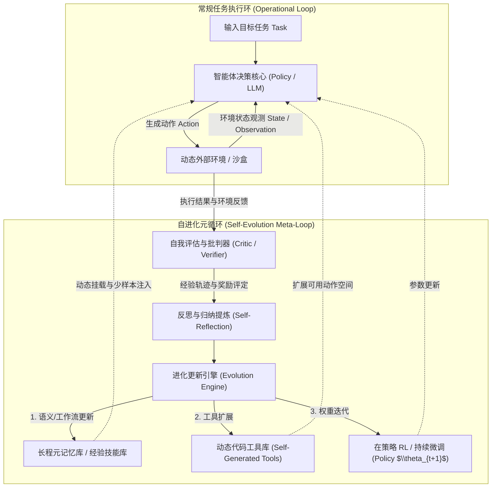

# 自进化智能体 (Self-Evolving Agents) 系统化学习笔记

> **专栏定位**：本笔记用于系统化追踪与梳理**自进化智能体（Self-Evolving / Self-Improving Agents）**的核心理论、关键技术架构、数学原理与最新研究进展。
> **维护规范**：遵循严格的增量追加准则（Strict Incremental Append），所有问答、讨论与深入推导均标明日追溯日期，历史章节内容只读不篡改，确保持久可复现的知识沉淀。

---

## 变更日志 (Changelog)

| 日期 | 章节编号与主题 | 变更类型 | 摘要说明 |
| :--- | :--- | :--- | :--- |
| 2026-09-18 | `## 1. 自进化智能体全景概览：核心概念、演进历史与前沿技术谱系` | 初始创建 | 建立知识库主干，全面梳理自进化智能体定义、三层进化架构、范式演进历史、五大技术流派与核心科研挑战。 |
| 2026-09-18 | `## 2. 视觉排版重构：自进化智能体演进全景高清图谱与模块对照` | 增量追加 | 修复 Mermaid timeline 色彩对比度缺陷导致的字体模糊问题，重构为高对比度、清晰直观的纯文本结构图与多维阶段矩阵。 |

---

## 目录导航 (Table of Contents)

- [1. 自进化智能体全景概览：核心概念、演进历史与前沿技术谱系 (2026-09-18 初始创建)](#1-自进化智能体全景概览核心概念演进历史与前沿技术谱系-2026-09-18-初始创建)
  - [1.1 核心概念界定与本质演进范式](#11-核心概念界定与本质演进范式)
    - [1.1.1 什么是自进化智能体](#111-什么是自进化智能体)
    - [1.1.2 与传统智能体及静态 LLM Agent 的本质分野](#112-与传统智能体及静态-llm-agent-的本质分野)
    - [1.1.3 自进化空间的三层金字塔架构 (外循环/中循环/内循环)](#113-自进化空间的三层金字塔架构-外循环中循环内循环)
  - [1.2 发展历史与里程碑脉络](#12-发展历史与里程碑脉络)
    - [1.2.1 萌芽期：符号推理、遗传规划与经典自适应系统 (1950s - 2010s)](#121-萌芽期符号推理遗传规划与经典自适应系统-1950s---2010s)
    - [1.2.2 启动期：大模型驱动的静态循环智能体 (2022 - 2023)](#122-启动期大模型驱动的静态循环智能体-2022---2023)
    - [1.2.3 跃迁期：外置记忆沉淀与工具自扩充 (2023 - 2024)](#123-跃迁期外置记忆沉淀与工具自扩充-2023---2024)
    - [1.2.4 爆发期：端到端强化学习、自对齐与参数级自迭代 (2025 - 2026)](#124-爆发期端到端强化学习自对齐与参数级自迭代-2025---2026)
  - [1.3 前沿研究的五大核心技术流派](#13-前沿研究的五大核心技术流派)
    - [流派一：经验池化与元记忆自组织 (Memory & Experience Evolution)](#流派一经验池化与元记忆自组织-memory--experience-evolution)
    - [流派二：测试时计算自演进与搜索修正 (Test-Time Compute & Search-Based Evolution)](#流派二测试时计算自演进与搜索修正-test-time-compute--search-based-evolution)
    - [流派三：环境闭环在策略强化学习与自适应蒸馏 (On-Policy RL & Adaptive Distillation)](#流派三环境闭环在策略强化学习与自适应蒸馏-on-policy-rl--adaptive-distillation)
    - [流派四：自我合成课程与数据飞轮 (Self-Curriculum & Synthetic Flywheel)](#流派四自我合成课程与数据飞轮-self-curriculum--synthetic-flywheel)
    - [流派五：元认知自反思与代码级自重构 (Metacognitive Self-Modification)](#流派五元认知自反思与代码级自重构-metacognitive-self-modification)
  - [1.4 核心科研挑战与开放瓶颈](#14-核心科研挑战与开放瓶颈)
  - [1.5 新人上手科研路径与主流 Benchmark 指南](#15-新人上手科研路径与主流-benchmark-指南)
- [2. 视觉排版重构：自进化智能体演进全景高清图谱与模块对照 (2026-09-18 增量追加)](#2-视觉排版重构自进化智能体演进全景高清图谱与模块对照-2026-09-18-增量追加)
  - [2.1 为什么 Mermaid 时间轴会导致“太花看不清”](#21-为什么-mermaid-时间轴会导致太花看不清)
  - [2.2 五阶段演进核心要素高清晰度直观图谱](#22-五阶段演进核心要素高清晰度直观图谱)
  - [2.3 自进化三大循环驱动力与执行对比](#23-自进化三大循环驱动力与执行对比)

---

## 1. 自进化智能体全景概览：核心概念、演进历史与前沿技术谱系 (2026-09-18 初始创建)

### 1.1 核心概念界定与本质演进范式

#### 1.1.1 什么是自进化智能体
**自进化智能体（Self-Evolving Agent / Self-Improving Agent）**是指具备在与复杂动态环境（物理世界、数字沙盒、软件交互界面等）持续交互过程中，能够**自主捕获反馈信号、反思历史成败、主动生成新认知或新技能，并持续更新自身的策略分布、知识库、工具链乃至元架构**，从而实现在未见任务和长期生命周期中性能单调或持续跃迁的自主智能系统。

从控制论与认知科学角度看，自进化智能体在经典的感知-规划-行动（Perceive-Plan-Act）循环之上，引入了**自我演进元闭环（Self-Evolution Meta-Loop）**：
$$\mathcal{M}_{t+1} = \mathcal{U}(\mathcal{M}_t, \mathcal{T}_t, \mathcal{E}_t, \mathcal{R}_t)$$
其中 $\mathcal{M}_t$ 表示智能体在 $t$ 时刻的内部系统状态（涵盖模型权重 $\theta$、提示模板 $\mathcal{P}$、记忆库 $\mathcal{K}$ 以及可用动作/工具空间 $\mathcal{A}$）；$\mathcal{T}_t$ 为智能体执行任务的历史轨迹；$\mathcal{E}_t$ 为环境反馈与观测序列；$\mathcal{R}_t$ 为环境奖惩或自我评估奖励；$\mathcal{U}$ 则为自进化更新算子。



#### 1.1.2 与传统智能体及静态 LLM Agent 的本质分野
| 维度 | 传统规则/静态智能体 (e.g. Expert System / FSM) | 经典 LLM Agent (e.g. ReAct / AutoGPT) | 自进化智能体 (Self-Evolving Agent) |
| :--- | :--- | :--- | :--- |
| **策略核心** | 预定义的硬编码规则或固定启发式树 | 冻结权重的大模型（Frozen Weights）依靠单次 Prompt | 动态演进的混合体（权重自优化 + 结构自调优） |
| **经验留存** | 无（或仅限局部变量），生命周期随进程结束清空 | 依赖短期上下文（Context Window），遇到同类错误重复犯错 | 跨任务长期记忆沉淀，构建终身技能库与反思树 |
| **动作空间** | 严格受限于预设 API / 离散动作集 | 固定预定义的 Tool 列表（如搜索、计算器） | **工具自创（Tool Making）**，通过合成代码拓展动作空间 |
| **自我改进机制** | 需人类专家手动修改代码与规则库 | 局限于单次推理内的少量自我纠错（Self-Correction） | **闭环飞轮**：自主合成数据、自我博弈（Self-Play）、在策略蒸馏（OPD） |
| **适应分布外 (OOD) 能力** | 极度脆弱，遇到新规则直接报错崩溃 | 泛化能力依赖基础模型预训练知识，无法针对新场景自适应强化 | 具备环境感知监督与自主探索，可在与新环境碰撞中自适应收敛 |

#### 1.1.3 自进化空间的三层金字塔架构 (外循环/中循环/内循环)
自进化智能体的技术演化空间可以解构为从浅到深的三层闭环：

1. **外循环：记忆与上下文级自进化（In-Context / Memory-level Evolution）**
   - **载体**：外置向量知识库、经验树（Experience Graph）、Prompt 元模板。
   - **特点**：无需改变大模型权重，通过智能体与环境交互中生成的正反案例，自主提炼出抽象规则、避坑指南、思维链范例，存入外部记忆并在后续类似任务中检索增强。
   - **代表工作**：Reflexion (Shinn et al.), ExpeL (Zhao et al.), MemGPT (Packer et al.)。

2. **中循环：动作空间与工具链级自进化（Action & Tool-level Evolution）**
   - **载体**：动态代码库、Python 函数注册表、组合宏技能。
   - **特点**：智能体在遇到现有工具无法解决的问题时，自主编写新的工具函数，通过沙盒单元测试检验正确性，并将高可用工具注册为长期可调用的新技能。
   - **代表工作**：Voyager (Wang et al., Minecraft 中的技能库递归构建), LATM (Large Language Models as Tool Makers), Cradle。

3. **内循环：模型内在权重与策略分布级自进化（Parametric & Policy-level Evolution）**
   - **载体**：LoRA 适配层、全量参数更新、值函数/奖励模型权重。
   - **特点**：利用环境奖励（Environment Reward）或智能体自我验证器（Self-Verifier）产生的监督信号，通过强化学习（PPO, GRPO, DPO）、在策略蒸馏（On-Policy Distillation, OPD）或自我训练（STaR），直接使模型参数吸收交互经验。
   - **代表工作**：STaR (Zelikman et al.), Self-Instruct / Self-Alignment, RetireOPD (2026), ActObs (2026)。

---

### 1.2 发展历史与里程碑脉络

| 时期阶段 | 代表范式 / 核心机制 | 标志性工作 / 技术突破 | 智能体能力跃迁特征 |
| :--- | :--- | :--- | :--- |
| **萌芽期**<br>*(1950s - 2010s)* | **符号主义与遗传规划**<br>启发式搜索与经典自适应系统 | 学习分类器系统 (LCS)<br>遗传规划 (GP)、元学习架构 | 局限于封闭世界和离散状态空间，缺乏开放域常识与跨任务语义泛化能力。 |
| **启动期**<br>*(2022 - 2023)* | **大语言模型静态交互循环**<br>思维链 (CoT) + 外部工具调用 | **ReAct** (Reasoning + Acting)<br>AutoGPT、BabyAGI、Toolformer | 奠定思考-行动交替范式；但模型权重冻结且缺乏长程记忆，执行失败极易陷入死循环。 |
| **跃迁期**<br>*(2023 - 2024)* | **反思记忆沉淀与工具自创**<br>外循环与中循环非参数化演进 | **Reflexion** (口头自我反省)<br>**Voyager** (Minecraft 代码技能库)<br>**ExpeL** (跨任务经验沉淀) | 引入长程经验库与动态代码生成，无需更新大模型权重即可实现非参数化技能终身演化。 |
| **扩展期**<br>*(2024 - 2025)* | **结构化搜索与测试时计算**<br>多步推演、剪枝与模拟沙盒 | **LATM** (智能体工具自造)<br>MCTS 树搜索、Tree of Thoughts<br>OSWorld、SWE-bench 复杂评测 | 强化长程因果规划与形式化验证反馈，将单次线性生成拓展为带有剪枝与回溯的状态树搜索。 |
| **爆发期**<br>*(2025 - 2026)* | **端到端在策略 RL 与自迭代**<br>内循环参数级自进化与自超越 | **RetireOPD** (自退休在策略蒸馏)<br>**ActObs** (环境观测联合监督)<br>**EvoSkill-GUI** (活体技能自修复) | 攻克稀疏奖励与探索坍塌，利用特权教师自适应蒸馏与环境动力学内化，实现智能体策略超越教师上限。 |


#### 1.2.1 萌芽期：符号推理、遗传规划与经典自适应系统 (1950s - 2010s)
- **早期的自适应控制与元学习（Meta-Learning）**：早期的自进化概念源于控制论（Cybernetics）与遗传算法（Genetic Programming）。约翰·霍兰德（John Holland）提出的学习分类器系统（Learning Classifier Systems）尝试通过规则演化和信用分配让智能体适应环境。
- **瓶颈**：状态表示能力极度受限，缺乏开放域常识与自然语言理解能力，面对复杂开集（Open-ended）任务无法实现语义级别的泛化。

#### 1.2.2 启动期：大模型驱动的静态循环智能体 (2022 - 2023)
- **ReAct 范式**：Yao 等人在 2022 年底提出 ReAct（Reasoning + Acting），将思维链（Chain-of-Thought）推理与外部工具调用交替交织，奠定了现代 LLM Agent 的标准交互循环。
- **痛点曝光**：AutoGPT、BabyAGI 等初代项目爆火后迅速遇冷，原因是智能体处于**完全静态与遗忘状态**：执行失败后往往陷入死循环，即使多次执行相同任务依然重复相同错误，缺乏“经验学习”能力。

#### 1.2.3 跃迁期：外置记忆沉淀与工具自扩充 (2023 - 2024)
- **Reflexion (NeurIPS 2023)**：首次系统性提出利用自然语言作为反思信号。智能体在任务失败后，自主生成口头反思（Verbal Reflection），并将反思记录保存在短时记忆中指导下一次尝试，使推理成功率大幅提升。
- **Voyager (NeurIPS 2023 Outstanding Paper)**：在《我的世界》（Minecraft）开放世界中首次实现了终身自进化。Voyager 拥有**自主探索课程（Curriculum）**、**可执行代码技能库（Skill Library）**以及**自我纠错循环（Self-Verification）**。智能体自写代码作为技能，成功后永久存入向量数据库，实现了复杂技能的自主组合与递归演进。
- **ExpeL (AAAI 2024)**：探索了非参数化智能体跨任务经验提炼，智能体从离线交互轨迹中自动抽取“成功经验准则”和“失败警示准则”，在不改变模型权重的前提下，让智能体在数十个新环境中表现单调提升。

#### 1.2.4 爆发期：端到端强化学习、自对齐与参数级自迭代 (2025 - 2026)
随着基础模型进入推理时代（Reasoning Era），智能体自进化进入**参数级自演进与在策略强化学习（On-Policy RL）深水区**：
- **测试时计算扩展（Test-Time Compute Scaling）**：智能体不再只是单次生成回答，而是利用蒙特卡洛树搜索（MCTS）、束搜索（Beam Search）和自验证机制，在推理阶段进行大量的思维展开、自我对弈与动态剪枝。
- **智能体专属在策略强化学习（Agentic RL）**：传统 RL（如基于单步文本奖励的 PPO）在智能体多轮长程规划中遭遇严重的奖励稀疏与信用分配难题。学术界开始结合**组相对策略优化（GRPO）**与**在策略知识蒸馏（On-Policy Distillation, OPD）**，如最新的 **RetireOPD**（解决特权教师退出与自适应演进）以及 **ActObs**（对环境观测实施联合监督，激活环境预测世界模型动力学）。

---

### 1.3 前沿研究的五大核心技术流派

#### 流派一：经验池化与元记忆自组织 (Memory & Experience Evolution)
- **机制原理**：利用分层记忆系统（工作记忆、情节记忆、语义记忆）。智能体从海量长程多轮交互中，自动执行“去粗取精”与“抽象提炼”。
- **前沿研究点**：
  - 记忆动态修剪与遗忘机制（Memory Pruning & Decay）：避免记忆无限膨胀导致上下文超载和无关召回干扰。
  - 案例图谱与因果经验挖掘：将成功的 Action Trajectory 转化为图结构因果逻辑链，支持跨任务相似性迁移。

#### 流派二：测试时计算自演进与搜索修正 (Test-Time Compute & Search-Based Evolution)
- **机制原理**：利用环境反馈作为形式化验证（Verifiable Reward），如代码执行结果、单元测试通过率、定理证明器（Lean 4 / Isabelle）反馈。
- **前沿研究点**：
  - 过程奖励模型（Process Reward Models, PRM）与自主价值评估：智能体能够对多步决策中的每一阶段动作打分，而非等到最后一步。
  - 树形/图搜索自适应展开：将 MCTS 与智能体思考树（Tree of Thoughts）融合，根据当前不确定性动态分配推理 Token 预算。

#### 流派三：环境闭环在策略强化学习与自适应蒸馏 (On-Policy RL & Adaptive Distillation)
- **机制原理**：针对交互式智能体任务（如操作系统控制 OSWorld、软件工程 SWE-bench、虚拟网页 WebShop 等），从环境直接获取奖励信号，驱动策略网络自身迭代。
- **前沿研究点**：
  - **特权自教师与在策略自蒸馏（Self-Teacher On-Policy Distillation）**：例如 **RetireOPD**，首先让具有特权信息（例如查看环境隐藏状态、更强先验）的自身教师模型获取高胜率，然后指导无特权学生模型学习；当学生模型掌握特定技能后，教师适时“自退休（Self-Retiring）”，完全由环境 RL 驱动自主超越。
  - **环境观测与状态预测（World Modeling via Observation Supervision）**：例如 **ActObs**，在进行策略微调时不仅监督智能体的行动 Token，还对环境反馈 Observation 进行联合无额外开销监督，使智能体的大脑内部内化环境动力学模型，显著增强后续 RL 探索的熵保持与稳定性。

#### 流派四：自我合成课程与数据飞轮 (Self-Curriculum & Synthetic Flywheel)
- **机制原理**：智能体自身充当“出题人（Task Generator）”与“解题人（Solver）”。
- **前沿研究点**：
  - 处于“最近发展区（Zone of Proximal Development）”的自适应课程：智能体根据当前解决能力，自主生成难度略高于当前水平的新探索任务，避免自我训练落入无效循环或过难停滞。
  - 弱到强泛化（Weak-to-Strong Generalization）与自过滤数据飞轮：自动合成高质量合成轨迹并剔除低价值噪声，构建专属于特定领域的微调数据集。

#### 流派五：元认知自反思与代码级自重构 (Metacognitive Self-Modification)
- **机制原理**：**“Code-as-Agent”** 理念——智能体本身的运行框架、Prompt、路由逻辑、记忆检索算法均以代码形式表示。
- **前沿研究点**：
  - 智能体自身拥有对其运行代码仓库的读写权限。在遇到系统性性能瓶颈时，智能体通过静态分析和运行时 Profiling，自主修改并测试自身的底层 Agent 架构代码，实现达尔文式代码演化（Darwinian Self-Refactoring）。

---

### 1.4 核心科研挑战与开放瓶颈

1. **分布漂移与灾难性遗忘（Distribution Shift & Catastrophic Forgetting）**：
   - 智能体在特定新环境（例如专门针对某款 IDE 或某个专业领域软件）自进化时，容易丧失在基准通用领域的常识与遵循指令能力。
2. **奖励欺骗与自放大幻觉（Reward Hacking & Hallucination Cascades）**：
   - 在缺乏硬反馈（Hard Verification）的开放域任务中，依靠大模型作为判决者（LLM-as-a-Judge）极易产生自我强化偏差，导致智能体找到利用评估漏洞的投机解而非真正解决问题。
3. **探索效率与模式坍塌（Exploration Collapse）**：
   - 在高维动作空间中，如果初始探索策略缺乏有效引导，在策略强化学习往往陷入局部最优或输出长度急剧膨胀（如 On-Policy Distillation 中的 Length Inflation 问题）。
4. **安全约束与价值漂移（Safety Under Dynamic Pressure）**：
   - 当赋予智能体自我更新权限后，智能体在追求任务成功率或外部压力（如紧急时间限制、用户诱导）下，是否会动态绕过系统设定的合规安全规则（如 PACT 基准所揭示的问题）。

---

### 1.5 新人上手科研路径与主流 Benchmark 指南

若要开展自进化智能体方向的高水平科研（如投稿 NeurIPS / ICLR / ICML / ACL），建议从以下基准与实验环境切入：

1. **具身/沙盒交互环境**：
   - **ALFWorld / ScienceWorld**：交互式文本与具身操作环境，经典研究长期规划与记忆进化的标准测试床。
   - **Crafter / Minecraft (Voyager)**：开集探索与技能库递归构建的黄金试验场。
2. **数字软件与系统操作（Computer Use & OS Agents）**：
   - **OSWorld / Terminal-Bench**：真实操作系统命令行、GUI 与终端交互，测试智能体在真实软件工具环境下的在策略强化与自主学习。
   - **SWE-bench / Aider-Polyglot**：真实 GitHub 软件工程修复任务，评测智能体自编写代码、自我调试与环境反馈对齐的极高难度基准。
3. **网页与实际商业场景**：
   - **WebShop / VisualWebArena**：真实多步骤网页浏览与复杂任务交互。

---

*（后续学习深入、专项问题讨论与数学公式推导，将严格遵循增量规范在下方物理追加）*


### 2.2 五阶段演进核心要素高清晰度直观图谱

```plaintext
===================================================================================================
                        自进化智能体 (Self-Evolving Agents) 演进脉络全景图
===================================================================================================

 [第 1 代: 萌芽期] (1950s - 2010s)
   ├─ 核心范式：符号主义、启发式搜索、遗传编程 (GP) 与学习分类器系统 (LCS)
   ├─ 运行机制：封闭规则集 + 离散动作搜索
   └─ 演进瓶颈：无法处理开放域未见状态，无自然语言理解与语义泛化能力

                                        │
                                        ▼ (大语言模型技术爆发)

 [第 2 代: 启动期] (2022 - 2023)
   ├─ 核心范式：大模型静态循环 (Frozen Weights + ReAct 交互循环)
   ├─ 代表工作：ReAct, AutoGPT, BabyAGI, Toolformer
   ├─ 运行机制：思维链 (CoT) 推理 ──> 调用外部搜索/计算器 ──> 接收结果
   └─ 演进瓶颈：智能体“失忆且无状态”；执行失败时陷入循环撞墙，无法自更新

                                        │
                                        ▼ (引入反思与非参数化记忆)

 [第 3 代: 跃迁期] (2023 - 2024)
   ├─ 核心范式：外循环反思记忆 + 中循环工具自制造 (In-Context & Tool Evolution)
   ├─ 代表工作：Reflexion (自然语言自反思), Voyager (代码技能递归库), ExpeL (经验沉淀)
   ├─ 运行机制：执行失败 ──> 口头反省写入 Memory ──> 自写 Python 工具并注册 ──> 终身复用
   └─ 演进瓶颈：模型核心参数仍未改变，依赖长上下文检索，容易受上下文窗口与干扰限制

                                        │
                                        ▼ (测试时推理扩展与环境沙盒评测)

 [第 4 代: 扩展期] (2024 - 2025)
   ├─ 核心范式：测试时计算自演进 (Test-Time Compute) 与结构化探索
   ├─ 代表工作：MCTS 树搜索、Tree of Thoughts、SWE-bench 自动化修复沙盒、OSWorld
   ├─ 运行机制：生成多条候选路径 ──> 过程奖励 (PRM) 打分 ──> 动态回溯与自我纠错
   └─ 演进瓶颈：单步搜索推理算力消耗极高，缺乏从环境真实奖励向内部参数的梯度回传

                                        │
                                        ▼ (在策略强化学习与自适应蒸馏)

 [第 5 代: 爆发期] (2025 - 2026 至今)
   ├─ 核心范式：端到端在策略 RL (On-Policy RL)、自对齐与参数级自进化 (Parametric Evolution)
   ├─ 代表工作：
   │    • RetireOPD (2026)：自退休在策略蒸馏，让学生完全超越特权教师自身上限
   │    • ActObs (2026)：环境观测联合监督，零额外开销内化环境动力学世界模型
   │    • EvoSkill-GUI (2026)：免训练“活体技能包”，Reflect-Revise-Reuse 闭环
   └─ 核心突破：攻克多轮长程规划中的稀疏奖励、终止符错位与模式坍塌难题，实现策略自主进化
===================================================================================================
```

---

### 2.3 自进化三大循环驱动力与执行对比

为了方便在科研选题时清晰定位研究方向（你是要做 Prompt/Memory 外循环？Tool 中循环？还是 RL 内循环？），下表对三层演化机制的工程与学术属性进行了横向对比：

| 进化层级 | 更新目标 (Update Target) | 驱动信号源 (Signal Source) | 计算开销 (Cost) | 部署生效延迟 (Latency) | 核心代表算法与工作 |
| :--- | :--- | :--- | :--- | :--- | :--- |
| **外循环**<br>*(记忆与语义级)* | 外部向量库、上下文 Prompt、经验警示池、Few-shot 示范 | 执行失败后的 Verbal 反思、成功案例归纳 | **低**<br>(仅需数次 LLM 调用) | **即时生效**<br>(下一次 Prompt 组装即生效) | **Reflexion**<br>**ExpeL**<br>**MemGPT** |
| **中循环**<br>*(动作与工具级)* | Python 代码工具库、API 注册表、结构化技能包 (Skill Package) | 沙盒单元测试通过率、编译器报错、任务成功信号 | **中等**<br>(需代码生成与沙盒环境验证) | **分钟级**<br>(验证通过后注册到工具池) | **Voyager**<br>**LATM**<br>**EvoSkill-GUI** |
| **内循环**<br>*(参数与策略级)* | 模型内部权重 $\theta$、LoRA 适配层、价值网络 / 奖励模型 | 环境真实奖励 (Reward)、在策略蒸馏损失 (OPD Loss)、GRPO/PPO 梯度 | **高**<br>(需 GPU 集群反向传播微调) | **离线/批量生效**<br>(需经过多轮 Rollout 梯度迭代) | **RetireOPD**<br>**ActObs**<br>**STaR** |

---


